# Advanced Lane Finding

## Udacity Self Driving Car Engineer Nanodegree - Project 4

The goal of this project is to develop a pipeline to process a video stream from a forward-facing camera mounted on the front of a car, and output an annotated video which identifies:
- The positions of the lane lines 
- The location of the vehicle relative to the center of the lane
- The radius of curvature of the road


```python
%matplotlib inline
import numpy as np
import cv2
import glob
import matplotlib.pyplot as plt
import matplotlib.image as mpimg
from moviepy.editor import VideoFileClip
from collections import deque

```

### Step 1: Distortion Correction

The first step in the project is to remove any distortion from the images by calculating the camera calibration matrix and distortion coefficients using a series of images of a chessboard.


```python
objp = np.zeros((6*9,3), np.float32)
objp[:,:2] = np.mgrid[0:9, 0:6].T.reshape(-1,2)

objpoints = [] # 3d points in real world space
imgpoints = [] # 2d points in image plane.

images = glob.glob('camera_cal/calibration*.jpg')

for idx, fname in enumerate(images):
    img = cv2.imread(fname)
    gray = cv2.cvtColor(img, cv2.COLOR_BGR2GRAY)

    # Find the chessboard corners
    ret, corners = cv2.findChessboardCorners(gray, (9,6), None)

    # If found, add object points, image points
    if ret == True:
        objpoints.append(objp)
        imgpoints.append(corners)

        # Draw and display the corners
        cv2.drawChessboardCorners(img, (9,6), corners, ret)
        f, (ax1, ax2) = plt.subplots(1, 2, figsize=(8,4))
        ax1.imshow(cv2.cvtColor(mpimg.imread(fname), cv2.COLOR_BGR2RGB))
        ax1.set_title('Original Image', fontsize=18)
        ax2.imshow(cv2.cvtColor(img, cv2.COLOR_BGR2RGB))
        ax2.set_title('With Corners', fontsize=18)
```


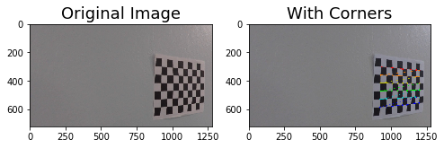


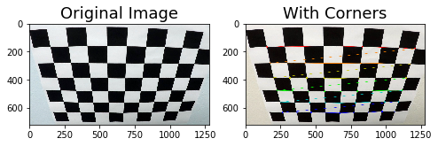


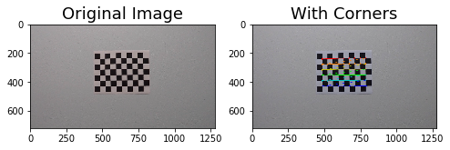


Next I will define a function `undistort()` which uses the calculate camera calibration matrix and distortion coefficients to remove distortion from an image and output the undistorted image.


```python
# Remove distortion from images
def undistort(image, show=True, read = True):
    if read:
        img = cv2.imread(image)
    else:
        img = image
    img_size = (img.shape[1], img.shape[0])
    ret, mtx, dist, rvecs, tvecs = cv2.calibrateCamera(objpoints, imgpoints, img_size, None, None)
    undist = cv2.undistort(img, mtx, dist, None, mtx)
    if show:
        f, (ax1, ax2) = plt.subplots(1, 2, figsize=(9,6))
        ax1.imshow(cv2.cvtColor(img, cv2.COLOR_BGR2RGB))
        ax1.set_title('Original Image', fontsize=20)
        ax2.imshow(cv2.cvtColor(undist, cv2.COLOR_BGR2RGB))
        ax2.set_title('Undistorted Image', fontsize=20)
    else:
        return undist
```


```python
images = glob.glob('test_images/test*.jpg')
for image in images:
    undistort(image)
```


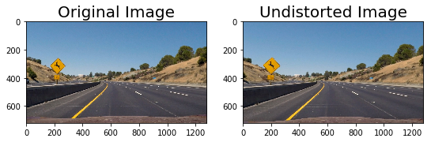


### Step 2: Perspective Transform

In this step I will define a function `birds_eye()` which transforms the undistorted image to a "birds eye view" of the road which focuses only on the lane lines and displays them in such a way that they appear to be relatively parallel to eachother. This will make it easier later on to fit polynomials to the lane lines and measure the curvature.


```python
# Perform perspective transform
def birds_eye(img, display=True, read = True):
    if read:
        undist = undistort(img, show = False)
    else:
        undist = undistort(img, show = False, read=False) 
    img_size = (undist.shape[1], undist.shape[0])
    offset = 0
    src = np.float32([[490, 482],[810, 482],
                      [1250, 720],[40, 720]])
    dst = np.float32([[0, 0], [1280, 0], 
                     [1250, 720],[40, 720]])
    M = cv2.getPerspectiveTransform(src, dst)
    warped = cv2.warpPerspective(undist, M, img_size)
    if display:
        f, (ax1, ax2) = plt.subplots(1, 2, figsize=(9, 6))
        f.tight_layout()
        ax1.imshow(cv2.cvtColor(undist, cv2.COLOR_BGR2RGB))
        ax1.set_title('Undistorted Image', fontsize=20)
        ax2.imshow(cv2.cvtColor(warped, cv2.COLOR_BGR2RGB))
        ax2.set_title('Undistorted and Warped Image', fontsize=20)
        plt.subplots_adjust(left=0., right=1, top=0.9, bottom=0.)
    else:
        return warped, M
```


```python
for image in glob.glob('test_images/test*.jpg'):
    birds_eye(image)
```


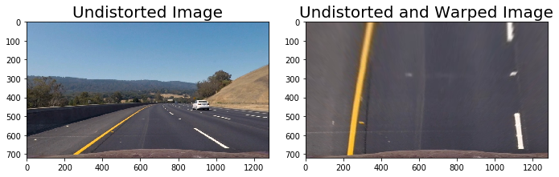


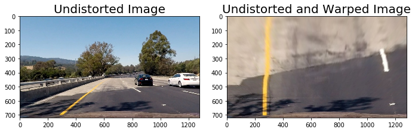


### Step 3: Apply Binary Thresholds

In this step I attempted to convert the warped image to different color spaces and create binary thresholded images which highlight only the lane lines and ignore everything else. 
I found that the following color channels and thresholds did a good job of identifying the lane lines in the provided test images:
- The S Channel from the HLS color space, with a min threshold of 180 and a max threshold of 255, did a fairly good job of identifying both the white and yellow lane lines, but did not pick up 100% of the pixels in either one, and had a tendency to get distracted by shadows on the road.
- The L Channel from the LUV color space, with a min threshold of 225 and a max threshold of 255, did an almost perfect job of picking up the white lane lines, but completely ignored the yellow lines.
- The B channel from the Lab color space, with a min threshold of 155 and an upper threshold of 200, did a better job than the S channel in identifying the yellow lines, but completely ignored the white lines. 

I chose to create a combined binary threshold based on the three above mentioned binary thresholds, to create one combination thresholded image which does a great job of highlighting almost all of the white and yellow lane lines.

**Note: The S binary threshold was left out of the final combined binary image and was not used in detecting lane lines because it added extra noise to the binary image and interfered with detecting lane lines accurately.**


```python

```


```python
# Create binary thresholded images to isolate lane line pixels
def apply_thresholds(image, show=True , read=True):
    if read :
        img, M = birds_eye(image, display = False)
    else:
        img, M = birds_eye(image, display = False , read = False)

    s_channel = cv2.cvtColor(img, cv2.COLOR_BGR2HLS)[:,:,2]
    
    l_channel = cv2.cvtColor(img, cv2.COLOR_BGR2LUV)[:,:,0]

    b_channel = cv2.cvtColor(img, cv2.COLOR_BGR2Lab)[:,:,2]   

    # Threshold color channel
    s_thresh_min = 180
    s_thresh_max = 255
    s_binary = np.zeros_like(s_channel)
    s_binary[(s_channel >= s_thresh_min) & (s_channel <= s_thresh_max)] = 1
    
    b_thresh_min = 155
    b_thresh_max = 200
    b_binary = np.zeros_like(b_channel)
    b_binary[(b_channel >= b_thresh_min) & (b_channel <= b_thresh_max)] = 1
    
    l_thresh_min = 225
    l_thresh_max = 255
    l_binary = np.zeros_like(l_channel)
    l_binary[(l_channel >= l_thresh_min) & (l_channel <= l_thresh_max)] = 1

    #color_binary = np.dstack((u_binary, s_binary, l_binary))
    
    combined_binary = np.zeros_like(s_binary)
    combined_binary[(l_binary == 1) | (b_binary == 1)] = 1

    if show == True:
        # Plotting thresholded images
        f, ((ax1, ax2, ax3), (ax4,ax5, ax6)) = plt.subplots(2, 3, sharey='col', sharex='row', figsize=(10,4))
        f.tight_layout()
        
        ax1.set_title('Original Image', fontsize=16)
        ax1.imshow(cv2.cvtColor(undistort(image, show=False),cv2.COLOR_BGR2RGB))
        
        ax2.set_title('Warped Image', fontsize=16)
        ax2.imshow(cv2.cvtColor(img, cv2.COLOR_BGR2RGB).astype('uint8'))
        
        ax3.set_title('s binary threshold', fontsize=16)
        ax3.imshow(s_binary, cmap='gray')
        
        ax4.set_title('b binary threshold', fontsize=16)
        ax4.imshow(b_binary, cmap='gray')
        
        ax5.set_title('l binary threshold', fontsize=16)
        ax5.imshow(l_binary, cmap='gray')

        ax6.set_title('Combined color thresholds', fontsize=16)
        ax6.imshow(combined_binary, cmap='gray')
        
        
    else: 
        return combined_binary
```


```python
for image in glob.glob('test_images/test*.jpg'):
    apply_thresholds(image)
```


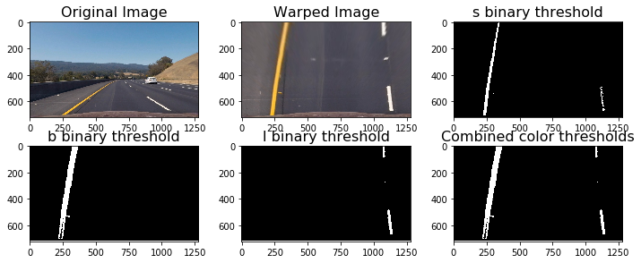


```python
# Define the complete image processing pipeline, reads raw image and returns binary image with lane lines identified
# (hopefully)
def pipeline(img , show=False , read=True):
    return apply_thresholds(img , show , read)
```

### Sliding Window Polyfit


```python
# Define method to fit polynomial to binary image with lines extracted, using sliding window
def sliding_window_polyfit(img):
    # Take a histogram of the bottom half of the image
    histogram = np.sum(img[img.shape[0]//2:,:], axis=0)
    # Print histogram from sliding window polyfit for example image
    plt.plot(histogram)
    plt.xlim(0, 1280)
    # Find the peak of the left and right halves of the histogram
    # These will be the starting point for the left and right lines
    midpoint = np.int(histogram.shape[0]//2)
    print(midpoint)
    quarter_point = np.int(midpoint//2)
    print(quarter_point)
    # Previously the left/right base was the max of the left/right half of the histogram
    # this changes it so that only a quarter of the histogram (directly to the left/right) is considered
    leftx_base = np.argmax(histogram[:midpoint])
    rightx_base = np.argmax(histogram[midpoint:]) + midpoint
    
    print('base pts:', leftx_base, rightx_base)

    # Choose the number of sliding windows
    nwindows = 10
    # Set height of windows
    window_height = np.int(img.shape[0]/nwindows)
    # Identify the x and y positions of all nonzero pixels in the image
    nonzero = img.nonzero()
    nonzeroy = np.array(nonzero[0])
    nonzerox = np.array(nonzero[1])
    # Current positions to be updated for each window
    leftx_current = leftx_base
    rightx_current = rightx_base
    # Set the width of the windows +/- margin
    margin = 80
    # Set minimum number of pixels found to recenter window
    minpix = 40
    # Create empty lists to receive left and right lane pixel indices
    left_lane_inds = []
    right_lane_inds = []
    # Rectangle data for visualization
    rectangle_data = []

    # Step through the windows one by one
    for window in range(nwindows):
        # Identify window boundaries in x and y (and right and left)
        win_y_low = img.shape[0] - (window+1)*window_height
        win_y_high = img.shape[0] - window*window_height
        win_xleft_low = leftx_current - margin
        win_xleft_high = leftx_current + margin
        win_xright_low = rightx_current - margin
        win_xright_high = rightx_current + margin
        rectangle_data.append((win_y_low, win_y_high, win_xleft_low, win_xleft_high, win_xright_low, win_xright_high))
        # Identify the nonzero pixels in x and y within the window
        good_left_inds = ((nonzeroy >= win_y_low) & (nonzeroy < win_y_high) & (nonzerox >= win_xleft_low) & (nonzerox < win_xleft_high)).nonzero()[0]
        good_right_inds = ((nonzeroy >= win_y_low) & (nonzeroy < win_y_high) & (nonzerox >= win_xright_low) & (nonzerox < win_xright_high)).nonzero()[0]
        # Append these indices to the lists
        left_lane_inds.append(good_left_inds)
        right_lane_inds.append(good_right_inds)
        # If you found > minpix pixels, recenter next window on their mean position
        if len(good_left_inds) > minpix:
            leftx_current = np.int(np.mean(nonzerox[good_left_inds]))
        if len(good_right_inds) > minpix:        
            rightx_current = np.int(np.mean(nonzerox[good_right_inds]))

    # Concatenate the arrays of indices
    left_lane_inds = np.concatenate(left_lane_inds)
    right_lane_inds = np.concatenate(right_lane_inds)

    # Extract left and right line pixel positions
    leftx = nonzerox[left_lane_inds]
    lefty = nonzeroy[left_lane_inds] 
    rightx = nonzerox[right_lane_inds]
    righty = nonzeroy[right_lane_inds] 

    left_fit, right_fit = (None, None)
    # Fit a second order polynomial to each
    if len(leftx) != 0:
        left_fit = np.polyfit(lefty, leftx, 2)
    if len(rightx) != 0:
        right_fit = np.polyfit(righty, rightx, 2)
    
    visualization_data = (rectangle_data, histogram)
    
    return left_fit, right_fit, left_lane_inds, right_lane_inds, visualization_data
```


```python
# visualize the result on example image
#exampleImg = cv2.imread('./test_images/test2.jpg')
exampleImg='test_images/straight_lines1.jpg'
#exampleImg = cv2.cvtColor(exampleImg, cv2.COLOR_BGR2RGB)
exampleImg_bin = apply_thresholds(exampleImg , show=False )

exampleImg = cv2.imread('test_images/straight_lines1.jpg')
exampleImg = cv2.cvtColor(exampleImg, cv2.COLOR_BGR2RGB)


        
f, (ax1, ax2) = plt.subplots(1, 2, sharey='col', sharex='row', figsize=(10,4))
f.tight_layout()
        
ax1.set_title('Original Image', fontsize=16)
ax1.imshow(exampleImg)

ax2.set_title('binary threshold Image', fontsize=16)
ax2.imshow(exampleImg_bin , 'gray')

left_fit, right_fit, left_lane_inds, right_lane_inds, visualization_data = sliding_window_polyfit(exampleImg_bin)

h = exampleImg.shape[0]
#print(left_fit)
#print(right_fit)
left_fit_x_int = left_fit[0]*h**2 + left_fit[1]*h + left_fit[2]
right_fit_x_int = right_fit[0]*h**2 + right_fit[1]*h + right_fit[2]
#print('fit x-intercepts:', left_fit_x_int, right_fit_x_int)

rectangles = visualization_data[0]
histogram = visualization_data[1]

# Create an output image to draw on and  visualize the result
out_img = np.uint8(np.dstack((exampleImg_bin, exampleImg_bin, exampleImg_bin))*255)
# Generate x and y values for plotting
ploty = np.linspace(0, exampleImg_bin.shape[0]-1, exampleImg_bin.shape[0] )
left_fitx = left_fit[0]*ploty**2 + left_fit[1]*ploty + left_fit[2]
right_fitx = right_fit[0]*ploty**2 + right_fit[1]*ploty + right_fit[2]
for rect in rectangles:
# Draw the windows on the visualization image
    cv2.rectangle(out_img,(rect[2],rect[0]),(rect[3],rect[1]),(0,255,0), 2) 
    cv2.rectangle(out_img,(rect[4],rect[0]),(rect[5],rect[1]),(0,255,0), 2) 
# Identify the x and y positions of all nonzero pixels in the image
nonzero = exampleImg_bin.nonzero()
nonzeroy = np.array(nonzero[0])
nonzerox = np.array(nonzero[1])
out_img[nonzeroy[left_lane_inds], nonzerox[left_lane_inds]] = [255, 0, 0]
out_img[nonzeroy[right_lane_inds], nonzerox[right_lane_inds]] = [100, 200, 255]
plt.imshow(out_img)
plt.plot(left_fitx, ploty, color='yellow')
plt.plot(right_fitx, ploty, color='yellow')
plt.xlim(0, 1280)
plt.ylim(720, 0)
```

    640
    320
    base pts: 222 1097


    (720, 0)


```python
# Print histogram from sliding window polyfit for example image
plt.plot(histogram)
plt.xlim(0, 1280)
print('...')
```

    ...


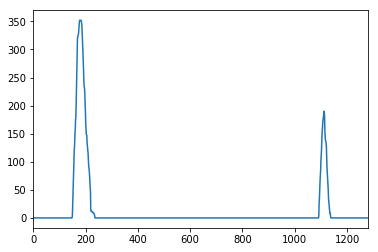


```python
# Define method to fit polynomial to binary image based upon a previous fit (chronologically speaking);
# this assumes that the fit will not change significantly from one video frame to the next
def polyfit_using_prev_fit(binary_warped, left_fit_prev, right_fit_prev):
    nonzero = binary_warped.nonzero()
    nonzeroy = np.array(nonzero[0])
    nonzerox = np.array(nonzero[1])
    margin = 80
    left_lane_inds = ((nonzerox > (left_fit_prev[0]*(nonzeroy**2) + left_fit_prev[1]*nonzeroy + left_fit_prev[2] - margin)) & 
                      (nonzerox < (left_fit_prev[0]*(nonzeroy**2) + left_fit_prev[1]*nonzeroy + left_fit_prev[2] + margin))) 
    right_lane_inds = ((nonzerox > (right_fit_prev[0]*(nonzeroy**2) + right_fit_prev[1]*nonzeroy + right_fit_prev[2] - margin)) & 
                       (nonzerox < (right_fit_prev[0]*(nonzeroy**2) + right_fit_prev[1]*nonzeroy + right_fit_prev[2] + margin)))  

    # Again, extract left and right line pixel positions
    leftx = nonzerox[left_lane_inds]
    lefty = nonzeroy[left_lane_inds] 
    rightx = nonzerox[right_lane_inds]
    righty = nonzeroy[right_lane_inds]
    
    left_fit_new, right_fit_new = (None, None)
    if len(leftx) != 0:
        # Fit a second order polynomial to each
        left_fit_new = np.polyfit(lefty, leftx, 2)
    if len(rightx) != 0:
        right_fit_new = np.polyfit(righty, rightx, 2)
    return left_fit_new, right_fit_new, left_lane_inds, right_lane_inds
```


```python
# visualize the result on example image
exampleImg2 = cv2.imread('test_images/test2.jpg')
exampleImg2 = cv2.cvtColor(exampleImg2, cv2.COLOR_BGR2RGB)
exampleImg2_bin = pipeline('test_images/test2.jpg')   
margin = 80
 
f, (ax1, ax2) = plt.subplots(1, 2, sharey='col', sharex='row', figsize=(10,4))
f.tight_layout()
        
ax1.set_title('Original Image', fontsize=16)
ax1.imshow(exampleImg2)

ax2.set_title('binary threshold Image', fontsize=16)
ax2.imshow(exampleImg2_bin , 'gray')

left_fit2, right_fit2, left_lane_inds2, right_lane_inds2 = polyfit_using_prev_fit(exampleImg2_bin, left_fit, right_fit)

# Generate x and y values for plotting
ploty = np.linspace(0, exampleImg2_bin.shape[0]-1, exampleImg2_bin.shape[0] )
left_fitx = left_fit[0]*ploty**2 + left_fit[1]*ploty + left_fit[2]
right_fitx = right_fit[0]*ploty**2 + right_fit[1]*ploty + right_fit[2]
left_fitx2 = left_fit2[0]*ploty**2 + left_fit2[1]*ploty + left_fit2[2]
right_fitx2 = right_fit2[0]*ploty**2 + right_fit2[1]*ploty + right_fit2[2]

# Create an image to draw on and an image to show the selection window
out_img = np.uint8(np.dstack((exampleImg2_bin, exampleImg2_bin, exampleImg2_bin))*255)
window_img = np.zeros_like(out_img)

# Color in left and right line pixels
nonzero = exampleImg2_bin.nonzero()
nonzeroy = np.array(nonzero[0])
nonzerox = np.array(nonzero[1])
out_img[nonzeroy[left_lane_inds2], nonzerox[left_lane_inds2]] = [255, 0, 0]
out_img[nonzeroy[right_lane_inds2], nonzerox[right_lane_inds2]] = [0, 0, 255]

# Generate a polygon to illustrate the search window area (OLD FIT)
# And recast the x and y points into usable format for cv2.fillPoly()
left_line_window1 = np.array([np.transpose(np.vstack([left_fitx-margin, ploty]))])
left_line_window2 = np.array([np.flipud(np.transpose(np.vstack([left_fitx+margin, ploty])))])
left_line_pts = np.hstack((left_line_window1, left_line_window2))
right_line_window1 = np.array([np.transpose(np.vstack([right_fitx-margin, ploty]))])
right_line_window2 = np.array([np.flipud(np.transpose(np.vstack([right_fitx+margin, ploty])))])
right_line_pts = np.hstack((right_line_window1, right_line_window2))

# Draw the lane onto the warped blank image
cv2.fillPoly(window_img, np.int_([left_line_pts]), (0,255, 0))
cv2.fillPoly(window_img, np.int_([right_line_pts]), (0,255, 0))
result = cv2.addWeighted(out_img, 1, window_img, 0.3, 0)
plt.imshow(result)
plt.plot(left_fitx2, ploty, color='yellow')
plt.plot(right_fitx2, ploty, color='yellow')
plt.xlim(0, 1280)
plt.ylim(720, 0)
```


    (720, 0)


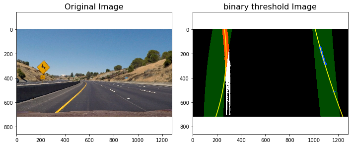


```python

```

### Radius of Curvature and Distance from Lane Center Calculation


```python
# Method to determine radius of curvature and distance from lane center 
# based on binary image, polynomial fit, and L and R lane pixel indices
def calc_curv_rad_and_center_dist(bin_img, l_fit, r_fit, l_lane_inds, r_lane_inds):
    # Define conversions in x and y from pixels space to meters
    ym_per_pix = 3.048/100 # meters per pixel in y dimension, lane line is 10 ft = 3.048 meters
    xm_per_pix = 3.7/378 # meters per pixel in x dimension, lane width is 12 ft = 3.7 meters
    left_curverad, right_curverad, center_dist = (0, 0, 0)
    # Define y-value where we want radius of curvature
    # I'll choose the maximum y-value, corresponding to the bottom of the image
    h = bin_img.shape[0]
    ploty = np.linspace(0, h-1, h)
    y_eval = np.max(ploty)
  
    # Identify the x and y positions of all nonzero pixels in the image
    nonzero = bin_img.nonzero()
    nonzeroy = np.array(nonzero[0])
    nonzerox = np.array(nonzero[1])
    # Again, extract left and right line pixel positions
    leftx = nonzerox[l_lane_inds]
    lefty = nonzeroy[l_lane_inds] 
    rightx = nonzerox[r_lane_inds]
    righty = nonzeroy[r_lane_inds]
    
    if len(leftx) != 0 and len(rightx) != 0:
        # Fit new polynomials to x,y in world space
        left_fit_cr = np.polyfit(lefty*ym_per_pix, leftx*xm_per_pix, 2)
        right_fit_cr = np.polyfit(righty*ym_per_pix, rightx*xm_per_pix, 2)
        # Calculate the new radii of curvature
        left_curverad = ((1 + (2*left_fit_cr[0]*y_eval*ym_per_pix + left_fit_cr[1])**2)**1.5) / np.absolute(2*left_fit_cr[0])
        right_curverad = ((1 + (2*right_fit_cr[0]*y_eval*ym_per_pix + right_fit_cr[1])**2)**1.5) / np.absolute(2*right_fit_cr[0])
        # Now our radius of curvature is in meters
    
    # Distance from center is image x midpoint - mean of l_fit and r_fit intercepts 
    if r_fit is not None and l_fit is not None:
        car_position = bin_img.shape[1]/2
        l_fit_x_int = l_fit[0]*h**2 + l_fit[1]*h + l_fit[2]
        r_fit_x_int = r_fit[0]*h**2 + r_fit[1]*h + r_fit[2]
        lane_center_position = (r_fit_x_int + l_fit_x_int) /2
        center_dist = (car_position - lane_center_position) * xm_per_pix
    return left_curverad, right_curverad, center_dist
```


```python
rad_l, rad_r, d_center = calc_curv_rad_and_center_dist(exampleImg2_bin, left_fit2, right_fit2, left_lane_inds2, right_lane_inds2)

print('Radius of curvature for example:', rad_l, 'm,', rad_r, 'm')
print('Distance from lane center for example:', d_center, 'm')
```

    Radius of curvature for example: 148.755664763 m, 509.668963798 m
    Distance from lane center for example: -0.738936252083 m


### Draw the Detected Lane Back onto the Original Image


```python
def draw_lane(original_img, binary_img, l_fit, r_fit, Minv):
    new_img = np.copy(original_img)
    if l_fit is None or r_fit is None:
        return original_img
    # Create an image to draw the lines on
    warp_zero = np.zeros_like(binary_img).astype(np.uint8)
    color_warp = np.dstack((warp_zero, warp_zero, warp_zero))
    
    h,w = binary_img.shape
    ploty = np.linspace(0, h-1, num=h)# to cover same y-range as image
    left_fitx = l_fit[0]*ploty**2 + l_fit[1]*ploty + l_fit[2]
    right_fitx = r_fit[0]*ploty**2 + r_fit[1]*ploty + r_fit[2]

    # Recast the x and y points into usable format for cv2.fillPoly()
    pts_left = np.array([np.transpose(np.vstack([left_fitx, ploty]))])
    pts_right = np.array([np.flipud(np.transpose(np.vstack([right_fitx, ploty])))])
    pts = np.hstack((pts_left, pts_right))

    # Draw the lane onto the warped blank image
    cv2.fillPoly(color_warp, np.int_([pts]), (0,255, 0))
    cv2.polylines(color_warp, np.int32([pts_left]), isClosed=False, color=(255,0,255), thickness=15)
    cv2.polylines(color_warp, np.int32([pts_right]), isClosed=False, color=(0,255,255), thickness=15)

    # Warp the blank back to original image space using inverse perspective matrix (Minv)
    newwarp = cv2.warpPerspective(color_warp, Minv, (w, h)) 
    # Combine the result with the original image
    result = cv2.addWeighted(new_img, 1, newwarp, 0.5, 0)
   
    return result
```


```python
src = np.float32([[490, 482],[810, 482],
                  [1250, 720],[40, 720]])
dst = np.float32([[0, 0], [1280, 0], 
                 [1250, 720],[40, 720]])
Minv = cv2.getPerspectiveTransform(dst, src)
exampleImg2_out1 = draw_lane(exampleImg2, exampleImg2_bin, left_fit, right_fit, Minv)

rad_l, rad_r, d_center = calc_curv_rad_and_center_dist(exampleImg2_bin, left_fit, right_fit, left_lane_inds, right_lane_inds)
print(rad_l, rad_r, d_center)
f, (ax1, ax2) = plt.subplots(1,2, figsize=(9, 6))
f.tight_layout()
       
ax1.set_title('Original Image', fontsize=16)
ax1.imshow(exampleImg2)

ax2.set_title('lane filled image', fontsize=16)
ax2.imshow(exampleImg2_out1 , 'gray')


ax2.text(200, 100, 'Distance from lane center :{} m'.format(d_center),
         style='italic', color='white', fontsize=10)
ax2.text(200, 175, 'Radius of curvature is {}m'.format(int((rad_l + rad_r)/2)),
     style='italic', color='white', fontsize=10)

```

    33.6169844623 65.0673973306 -0.136399504749


    <matplotlib.text.Text at 0x7f9d00cfb390>


```python

```

### Draw Curvature Radius and Distance from Center Data onto the Original Image


```python
def fill_lane(image , display= True , read=True):
    
    # visualize the result on example image
    if read :
        exampleImg = cv2.imread(image)
        exampleImg = cv2.cvtColor(exampleImg, cv2.COLOR_BGR2RGB)
        exampleImg_bin = pipeline(image , show=False , read=True) 
        left_fit, right_fit, left_lane_inds, right_lane_inds, visualization_data = sliding_window_polyfit(exampleImg_bin)

    else:
        exampleImg = image
        exampleImg = cv2.cvtColor(exampleImg ,cv2.COLOR_BGR2RGB)
        exampleImg_bin = pipeline(exampleImg , show=False , read=False) 
        exampleImg = image
        global left_fit, right_fit, left_lane_inds, right_lane_inds, visualization_data
        left_fit, right_fit, left_lane_inds, right_lane_inds, visualization_data = sliding_window_polyfit(exampleImg_bin)
        if left_fit is None or right_fit is None:
            print(left_fit, right_fit, left_lane_inds, right_lane_inds)
            plt.imshow(exampleImg )
            return image
    margin = 20

    
    #h = exampleImg.shape[0]
    print(exampleImg.shape)
    #print(exampleImg_bin)
    print(left_fit, right_fit, left_lane_inds, right_lane_inds)
    h = exampleImg.shape[0]
    w = exampleImg.shape[1]
    
  
    # Create an output image to draw on and  visualize the result
    out_img = np.uint8(np.dstack((exampleImg_bin, exampleImg_bin, exampleImg_bin))*255)
    window_img = np.zeros_like(out_img)
    warp_zero = np.zeros_like(exampleImg_bin).astype(np.uint8)
    color_warp = np.dstack((warp_zero, warp_zero, warp_zero))
        
    # Generate x and y values for plotting
    ploty = np.linspace(0, exampleImg_bin.shape[0]-1, exampleImg_bin.shape[0] )
    left_fitx = left_fit[0]*ploty**2 + left_fit[1]*ploty + left_fit[2]
    right_fitx = right_fit[0]*ploty**2 + right_fit[1]*ploty + right_fit[2]


    nonzero = exampleImg_bin.nonzero()
    nonzeroy = np.array(nonzero[0])
    nonzerox = np.array(nonzero[1])
    out_img[nonzeroy[left_lane_inds], nonzerox[left_lane_inds]] = [255, 0, 0]
    out_img[nonzeroy[right_lane_inds], nonzerox[right_lane_inds]] = [100, 200, 255]
    

    # Recast the x and y points into usable format for cv2.fillPoly()
    pts_left = np.array([np.transpose(np.vstack([left_fitx, ploty]))])
    pts_right = np.array([np.flipud(np.transpose(np.vstack([right_fitx, ploty])))])
    pts = np.hstack((pts_left, pts_right))

    # Draw the lane onto the warped blank image
    cv2.fillPoly(color_warp, np.int_([pts]), (0,255, 0))
    cv2.polylines(color_warp, np.int32([pts_left]), isClosed=False, color=(255,0,255), thickness=15)
    cv2.polylines(color_warp, np.int32([pts_right]), isClosed=False, color=(0,255,255), thickness=15)

    
    src = np.float32([[490, 482],[810, 482],
                  [1250, 720],[40, 720]])
    dst = np.float32([[0, 0], [1280, 0], 
                     [1250, 720],[40, 720]])
    Minv = cv2.getPerspectiveTransform(dst, src)
    
    # Warp the blank back to original image space using inverse perspective matrix (Minv)
    newwarp = cv2.warpPerspective(color_warp, Minv, (w, h)) 
    # Combine the result with the original image
    exampleImg_out1 = cv2.addWeighted(exampleImg, 1, newwarp, 0.5, 0)
   
   

    #exampleImg_out1 = draw_lane(exampleImg, exampleImg_bin, left_fitx, right_fitx, Minv)

    rad_l, rad_r, d_center = calc_curv_rad_and_center_dist(exampleImg_bin, left_fitx, right_fitx, left_lane_inds, right_lane_inds)
    #print(rad_l, rad_r, d_center)
    if display == True:
          #print( left_fit, right_fit, left_lane_inds, right_lane_inds)
        rectangles = visualization_data[0]
        histogram = visualization_data[1]


        f, (ax1, ax2 ,ax3) = plt.subplots(1,3, figsize=(9, 6))
        f.tight_layout()

        ax1.set_title('Original Image', fontsize=16)
        ax1.imshow(exampleImg)

        ax2.set_title('lane filled image', fontsize=16)
        ax2.imshow(exampleImg_out1 , 'gray')


        ax2.text(200, 100, 'Distance from lane center :{} m'.format(d_center),
                 style='italic', color='white', fontsize=10)
        ax2.text(200, 175, 'Radius of curvature is {}m'.format(int((rad_l + rad_r)/2)),
             style='italic', color='white', fontsize=10)

        ax3.set_title('binary poly fit', fontsize=16)
        ax3.imshow(window_img , 'gray')
        ax3.plot(left_fitx, ploty, color='yellow')
        ax3.plot(right_fitx, ploty, color='yellow')
    else:
        str1='Distance from lane center :{} m'.format(d_center)
        str2='Radius of curvature is {}m'.format(int((rad_l + rad_r)/2))
        texted_image1 =cv2.putText(img=np.copy(exampleImg_out1), text=str1, org=(0,50),fontFace=3, fontScale=1, color=(0,0,255), thickness=2)
        texted_image2 =cv2.putText(img=np.copy(texted_image1), text=str2, org=(0,120),fontFace=3, fontScale=1, color=(0,0,255), thickness=2)
        return texted_image2


```

### Step 7: Output visual display of the lane boundaries and numerical estimation of lane curvature and vehicle position.


```python
for image in glob.glob('test_images/test*.jpg'):
    fill_lane(image)
```

    (720, 1280, 3)
    [  6.27445200e-05  -1.97761141e-01   3.64860033e+02] [  7.17807742e-05   5.71968816e-02   1.10863335e+03] [31082 31083 31084 ...,  3687  3688  3689] [28565 28566 28567 ..., 12166 12167 12168]
    (720, 1280, 3)
    [  1.09715172e-04  -1.79914375e-01   2.45570535e+02] [  3.79470986e-05   6.74978206e-02   1.06669100e+03] [25050 25051 25052 ...,   988   989   990] [21237 21238 21239 ...,    12    13    14]
    (720, 1280, 3)
    [  1.29707204e-04  -1.52142072e-01   2.91925942e+02] [ -4.56600799e-05   1.41784381e-01   1.07433647e+03] [28451 28452 28453 ...,  4833  4834  4835] [28536 28537 28538 ...,  4859  4860  4861]
    (720, 1280, 3)
    [  5.34069561e-05  -1.94858851e-01   3.44298274e+02] [  6.06495401e-05   5.14431395e-02   1.07325981e+03] [32530 32531 32532 ...,  4530  4531  4532] [32556 32557 32558 ...,  4544  4545  4546]
    (720, 1280, 3)
    [ -9.70147147e-05   1.04525120e-01   2.64265191e+02] [  8.34771801e-05   2.55534863e-01   1.01037034e+03] [27149 27150 27151 ...,  3084  3085  3086] [23693 23694 23720 ...,  6149  6150  6151]
    (720, 1280, 3)
    [ -3.96991678e-05  -1.88905016e-02   2.95009276e+02] [ -1.65706360e-04   3.39913467e-01   1.02759337e+03] [29955 29956 29957 ...,  3142  3143  3144] [28879 28880 28881 ..., 13304 13305 13306]


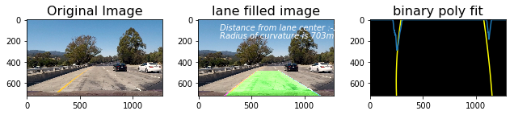


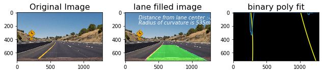


## Video Processing Pipeline:


```python
# Import everything needed to edit/save/watch video clips
from moviepy.editor import VideoFileClip
from IPython.display import HTML
```


```python
def process_video_image(image):
    return fill_lane(image , display= False , read=False)
```

## write images from video to analyse 


```python
video_output1 = 'project_video_output.mp4'
video_input1 = VideoFileClip('project_video.mp4').subclip(10,20)#.subclip(22,26)
video_input1.to_images_sequence("tmp_images/images%03d.jpeg")


```

    [MoviePy] Writing frames tmp_images/images%03d.jpeg.

    250it [00:06, 36.23it/s]             

    [MoviePy]: Done writing frames tmp_images/images%03d.jpeg.
    


    


    '\nfor frame in video_input1.iter_frames():\n    # now frame is a numpy array, do wathever you want\n    clip.fl_image(vertical_flip).to_images_sequence("tmp_images/images%03d.jpeg")\n    newframe = some_transformation(frame)\n    # etc.\n'


```python
for image in glob.glob('tmp_images/images*.jpeg'):
    fill_lane(image)
    break
```

    640
    320
    base pts: 264 1117
    (720, 1280, 3)
    [ -9.53976975e-06   5.59064837e-03   2.56988535e+02] [ -8.71378929e-05   3.17935267e-01   9.82439416e+02] [30375 30376 30377 ...,  4188  4189  4190] [27737 27738 27739 ..., 19571 19572 19573]


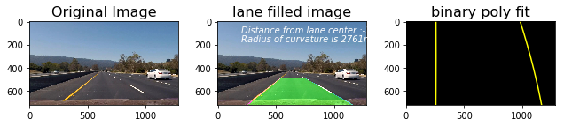


```python
#process_video_image('tmp_images/images000.jpeg')
video_input1.fl_image(process_video_image).to_images_sequence("tmp_output_images/images%03d.jpeg")
```

    640
    320
    base pts: 229 1078
    (720, 1280, 3)
    [ -6.41819803e-05   7.46159101e-02   1.98340140e+02] [ -3.34659395e-05   3.05434222e-01   9.29398584e+02] [29634 29635 29636 ...,  3294  3295  3296] [24448 24449 24450 ..., 20208 20209 20210]
    [MoviePy] Writing frames tmp_output_images/images%03d.jpeg.

    100%|██████████| 1/1 [00:00<00:00,  1.27it/s]

    640
    320
    base pts: 229 1078
    (720, 1280, 3)
    [ -6.41819803e-05   7.46159101e-02   1.98340140e+02] [ -3.34659395e-05   3.05434222e-01   9.29398584e+02] [29634 29635 29636 ...,  3294  3295  3296] [24448 24449 24450 ..., 20208 20209 20210]


    2it [00:01,  1.26it/s]                       

    640
    320
    base pts: 229 1090
    (720, 1280, 3)
    [ -6.05362011e-05   7.37513140e-02   1.97370204e+02] [  1.77516585e-06   2.57526116e-01   9.45237248e+02] [30207 30208 30209 ...,  3768  3769  3770] [27560 27561 27562 ..., 23857 23858 23859]


    3it [00:02,  1.28it/s]

    640
    320
    base pts: 229 1104
    (720, 1280, 3)
    [ -8.87865869e-05   8.82039227e-02   1.96930378e+02] [ -3.77072748e-05   2.94167944e-01   9.36055106e+02] [30100 30101 30102 ...,  4120  4121  4122] [30121 30122 30123 ..., 13680 13681 13682]


    4it [00:03,  1.27it/s]

    640
    320
    base pts: 229 1103
    (720, 1280, 3)
    [ -9.27581572e-05   9.38039803e-02   1.94023084e+02] [ -1.06090613e-04   3.60820736e-01   9.22998653e+02] [30084 30085 30086 ...,  4204  4205  4206] [30104 30105 30106 ...,  4218  4219  4220]


    5it [00:03,  1.28it/s]

    640
    320
    base pts: 230 1110
    (720, 1280, 3)
    [ -1.03518170e-04   9.74759115e-02   1.97759836e+02] [ -1.09057526e-04   3.69220008e-01   9.18282859e+02] [28956 28957 28958 ...,  3789  3790  3791] [28977 28978 28979 ...,  3803  3804  3805]


    6it [00:04,  1.28it/s]

    640
    320
    base pts: 229 1114
    (720, 1280, 3)
    [ -9.99234479e-05   9.28194480e-02   1.98912497e+02] [ -1.33851955e-04   3.85741117e-01   9.18403987e+02] [27897 27898 27899 ...,  3144  3145  3146] [27917 27918 27919 ...,  3156  3157  3158]


    7it [00:05,  1.27it/s]

    640
    320
    base pts: 230 1069
    (720, 1280, 3)
    [ -1.09722378e-04   9.61089791e-02   2.01662752e+02] [ -8.92749992e-05   3.76031359e-01   9.17399046e+02] [27714 27715 27716 ...,  3153  3154  3155] [22834 22835 22836 ...,  6907  6908  6909]


    8it [00:06,  1.29it/s]

    640
    320
    base pts: 231 1080
    (720, 1280, 3)
    [ -1.02977977e-04   8.84958057e-02   2.05343940e+02] [ -4.16004657e-05   3.40882111e-01   9.20108468e+02] [27567 27568 27569 ...,  3071  3072  3073] [24581 24582 24583 ..., 10521 10522 10523]


    9it [00:07,  1.28it/s]

    640
    320
    base pts: 231 1098
    (720, 1280, 3)
    [ -1.03762998e-04   9.00991197e-02   2.05084489e+02] [ -1.27321539e-04   3.98190100e-01   9.15510392e+02] [27894 27895 27896 ...,  3115  3116  3117] [26298 26299 26300 ..., 10070 10071 10072]


    10it [00:07,  1.29it/s]

    640
    320
    base pts: 235 1046
    (720, 1280, 3)
    [ -9.14785994e-05   7.93753518e-02   2.10390561e+02] [ -8.26033508e-05   3.58314716e-01   9.20057052e+02] [28212 28213 28214 ...,  3116  3117  3118] [27892 27893 27894 ..., 13634 13635 13636]


    11it [00:08,  1.27it/s]

    640
    320
    base pts: 234 1050
    (720, 1280, 3)
    [ -6.47078708e-05   6.42693235e-02   2.09538737e+02] [ -7.53746081e-05   3.32094463e-01   9.33842046e+02] [28901 28902 28903 ...,  3359  3360  3361] [29801 29802 29803 ..., 13176 13177 13178]


    12it [00:09,  1.26it/s]

    640
    320
    base pts: 236 1059
    (720, 1280, 3)
    [ -5.57555370e-05   5.60457996e-02   2.13239063e+02] [  1.66762732e-05   2.56667303e-01   9.50059201e+02] [29007 29008 29009 ...,  3368  3369  3370] [24863 24864 24865 ..., 16898 16899 16900]


    13it [00:10,  1.28it/s]

    640
    320
    base pts: 236 1075
    (720, 1280, 3)
    [ -4.40908579e-05   4.81816970e-02   2.14399162e+02] [ -3.35173550e-05   2.87489583e-01   9.47398885e+02] [29968 29969 29970 ...,  3712  3713  3714] [25404 25405 25406 ..., 16791 16792 16793]


    14it [00:10,  1.26it/s]

    640
    320
    base pts: 213 1084
    (720, 1280, 3)
    [ -4.13167977e-05   4.54014640e-02   2.14183892e+02] [ -3.70833545e-05   2.81440567e-01   9.52705237e+02] [30300 30301 30302 ...,  4253  4254  4255] [28521 28522 28523 ..., 20595 20596 20597]


    15it [00:11,  1.25it/s]

    640
    320
    base pts: 235 1097
    (720, 1280, 3)
    [ -6.24839095e-05   5.53458981e-02   2.13771018e+02] [ -4.17636287e-05   2.81503060e-01   9.54355965e+02] [30821 30822 30823 ...,  4425  4426  4427] [31164 31165 31166 ..., 24192 24193 24194]


    16it [00:12,  1.28it/s]

    640
    320
    base pts: 233 1117
    (720, 1280, 3)
    [ -6.90465851e-05   6.10342152e-02   2.09977807e+02] [ -1.60946639e-04   4.07470294e-01   9.25401309e+02] [30783 30784 30785 ...,  4545  4546  4547] [30801 30802 30803 ..., 16344 16345 16389]


    17it [00:13,  1.29it/s]

    640
    320
    base pts: 233 1119
    (720, 1280, 3)
    [ -8.48556933e-05   6.79722550e-02   2.12758504e+02] [ -1.08794375e-04   3.57329575e-01   9.36640619e+02] [30175 30176 30177 ...,  3866  3867  3868] [30196 30197 30198 ..., 18883 18884 18930]


    18it [00:14,  1.26it/s]

    640
    320
    base pts: 232 1122
    (720, 1280, 3)
    [ -9.47570060e-05   7.41196407e-02   2.11672898e+02] [ -1.14182296e-04   3.35932871e-01   9.53356407e+02] [29205 29206 29207 ...,  3449  3450  3451] [29224 29225 29226 ...,  3464  3465  3466]


    19it [00:14,  1.25it/s]

    640
    320
    base pts: 231 1128
    (720, 1280, 3)
    [ -9.35497717e-05   7.40472999e-02   2.09380089e+02] [ -1.32924214e-04   3.45860036e-01   9.57776672e+02] [28812 28813 28814 ...,  3505  3506  3507] [29060 29061 29062 ...,  7458  7459  7460]


    20it [00:15,  1.22it/s]

    640
    320
    base pts: 232 1097
    (720, 1280, 3)
    [ -8.88032872e-05   6.79955788e-02   2.11484155e+02] [ -1.48484421e-04   3.64276480e-01   9.52860823e+02] [28645 28646 28647 ...,  3358  3359  3360] [25321 25322 25323 ..., 11127 11128 11129]


    21it [00:16,  1.22it/s]

    640
    320
    base pts: 234 1108
    (720, 1280, 3)
    [ -9.41372740e-05   6.82920987e-02   2.15226904e+02] [ -1.40011315e-04   3.69117184e-01   9.48159173e+02] [27735 27736 27737 ...,  3149  3150  3151] [26201 26202 26203 ...,  9768  9769  9770]


    22it [00:17,  1.25it/s]

    640
    320
    base pts: 237 1059
    (720, 1280, 3)
    [ -8.69847851e-05   5.81529421e-02   2.23119109e+02] [ -1.35585967e-04   3.83568304e-01   9.37032743e+02] [28282 28283 28284 ...,  3086  3087  3088] [27837 27838 27839 ..., 13089 13090 13091]


    23it [00:18,  1.26it/s]

    640
    320
    base pts: 239 1069
    (720, 1280, 3)
    [ -7.73222499e-05   5.09659516e-02   2.25770651e+02] [ -1.42091708e-04   3.88124959e-01   9.35311054e+02] [28480 28481 28482 ...,  3099  3100  3101] [29298 29299 29300 ..., 16758 16759 16760]


    24it [00:18,  1.29it/s]

    640
    320
    base pts: 242 1080
    (720, 1280, 3)
    [ -6.82532246e-05   4.03371566e-02   2.32712571e+02] [ -1.74830987e-04   4.31440493e-01   9.19491685e+02] [28612 28613 28614 ...,  3094  3095  3096] [24530 24531 24532 ..., 15859 15860 15861]


    25it [00:19,  1.30it/s]

    640
    320
    base pts: 242 1095
    (720, 1280, 3)
    [ -5.52126650e-05   3.42116310e-02   2.32815691e+02] [ -1.72301566e-04   4.33318047e-01   9.19532134e+02] [29506 29507 29508 ...,  3540  3541  3542] [24327 24328 24329 ..., 19956 19957 19958]


    26it [00:20,  1.28it/s]

    640
    320
    base pts: 242 1112
    (720, 1280, 3)
    [ -4.98048513e-05   3.45138171e-02   2.30733140e+02] [ -1.26959217e-04   3.90913818e-01   9.32777152e+02] [30477 30478 30479 ...,  4043  4044  4045] [27999 28000 28001 ..., 19719 19720 19721]


    27it [00:21,  1.26it/s]

    640
    320
    base pts: 244 1125
    (720, 1280, 3)
    [ -7.42704303e-05   4.82807171e-02   2.29616788e+02] [ -1.48683432e-04   4.18981936e-01   9.23477246e+02] [30762 30763 30764 ...,  4173  4174  4175] [30780 30781 30782 ..., 23649 23650 23651]


    28it [00:22,  1.26it/s]

    640
    320
    base pts: 242 1132
    (720, 1280, 3)
    [ -8.30442749e-05   5.84754806e-02   2.26627787e+02] [ -1.59450907e-05   2.55049139e-01   9.74910437e+02] [30388 30389 30390 ...,  4120  4121  4122] [30407 30408 30409 ..., 16157 16158 16159]


    29it [00:22,  1.26it/s]

    640
    320
    base pts: 246 1132
    (720, 1280, 3)
    [ -9.36585368e-05   6.26018830e-02   2.30907121e+02] [ -6.08021433e-05   3.05401297e-01   9.59145301e+02] [29139 29140 29141 ...,  3427  3428  3429] [29158 29159 29160 ...,  3441  3442  3443]


    30it [00:23,  1.24it/s]

    640
    320
    base pts: 247 1131
    (720, 1280, 3)
    [ -8.82935391e-05   5.79946868e-02   2.33014152e+02] [ -9.74673783e-05   3.30952405e-01   9.57277642e+02] [27652 27653 27654 ...,  3132  3133  3134] [27673 27674 27675 ...,  7145  7146  7147]


    31it [00:24,  1.25it/s]

    640
    320
    base pts: 249 1090
    (720, 1280, 3)
    [ -9.01346692e-05   5.92900707e-02   2.34344663e+02] [ -3.68095793e-05   2.98127456e-01   9.63024610e+02] [27484 27485 27486 ...,  2974  2975  2976] [22102 22103 22104 ...,  6297  6298  6299]


    32it [00:25,  1.28it/s]

    640
    320
    base pts: 251 1099
    (720, 1280, 3)
    [ -8.16642112e-05   5.05989752e-02   2.39302930e+02] [ -3.24485685e-05   2.95289653e-01   9.61477553e+02] [27343 27344 27345 ...,  3010  3011  3012] [24034 24035 24036 ...,  9802  9803  9804]


    33it [00:25,  1.31it/s]

    640
    320
    base pts: 251 1119
    (720, 1280, 3)
    [ -7.18485532e-05   4.70489005e-02   2.38721590e+02] [ -4.88724485e-05   2.97405165e-01   9.67751432e+02] [27724 27725 27726 ...,  3094  3095  3096] [26121 26122 26123 ...,  9382  9383  9384]


    34it [00:26,  1.30it/s]

    640
    320
    base pts: 254 1073
    (720, 1280, 3)
    [ -7.33680957e-05   4.68253228e-02   2.42121952e+02] [ -4.31897184e-05   2.94009419e-01   9.69304474e+02] [28104 28105 28106 ...,  3038  3039  3040] [27561 27562 27563 ..., 12852 12853 12854]


    35it [00:27,  1.31it/s]

    640
    320
    base pts: 255 1083
    (720, 1280, 3)
    [ -6.87699184e-05   4.65319874e-02   2.41911349e+02] [ -5.30613090e-05   2.89199926e-01   9.76536857e+02] [28463 28464 28465 ...,  2944  2945  2946] [29145 29146 29147 ..., 16824 16825 16826]


    36it [00:28,  1.32it/s]

    640
    320
    base pts: 254 1099
    (720, 1280, 3)
    [ -5.15844162e-05   3.63800080e-02   2.41580675e+02] [ -6.86001807e-05   2.96065003e-01   9.81548988e+02] [28817 28818 28819 ...,  3146  3147  3148] [24965 24966 24967 ..., 16089 16090 16091]


    37it [00:29,  1.31it/s]

    640
    320
    base pts: 255 1111
    (720, 1280, 3)
    [ -3.86962330e-05   2.54870480e-02   2.45217287e+02] [ -6.35234210e-05   2.90576393e-01   9.83375293e+02] [29455 29456 29457 ...,  3465  3466  3467] [24360 24361 24362 ..., 20006 20007 20008]


    38it [00:29,  1.30it/s]

    640
    320
    base pts: 255 1114
    (720, 1280, 3)
    [ -3.68091560e-05   2.60990074e-02   2.44053256e+02] [ -4.70505534e-05   2.69263219e-01   9.93902362e+02] [30018 30019 30020 ...,  3955  3956  3957] [27527 27528 27529 ..., 19520 19521 19522]


    39it [00:30,  1.30it/s]

    640
    320
    base pts: 259 1124
    (720, 1280, 3)
    [ -6.00487207e-05   3.25490372e-02   2.50700407e+02] [ -7.51640471e-05   3.08618661e-01   9.78490814e+02] [30160 30161 30162 ...,  4445  4446  4447] [30178 30179 30180 ..., 23304 23305 23306]


    40it [00:31,  1.30it/s]

    640
    320
    base pts: 260 1138
    (720, 1280, 3)
    [ -5.73187536e-05   3.04957118e-02   2.50915925e+02] [ -4.91252018e-05   2.72699553e-01   9.92389052e+02] [29649 29650 29651 ...,  4280  4281  4282] [29668 29669 29670 ..., 15805 15806 15848]


    41it [00:32,  1.26it/s]

    640
    320
    base pts: 264 1146
    (720, 1280, 3)
    [ -5.78880230e-05   2.44578247e-02   2.57721628e+02] [ -8.41889508e-05   3.24246729e-01   9.72715657e+02] [28466 28467 28468 ...,  3441  3442  3443] [28484 28485 28486 ..., 18074 18075 18076]


    42it [00:32,  1.25it/s]

    640
    320
    base pts: 265 1150
    (720, 1280, 3)
    [ -6.46734120e-05   2.96518813e-02   2.59194816e+02] [ -7.26859180e-05   3.04313224e-01   9.80274692e+02] [27197 27198 27199 ...,  3048  3049  3050] [27215 27216 27217 ...,  7007  7008  7009]


    43it [00:33,  1.22it/s]

    640
    320
    base pts: 264 1102
    (720, 1280, 3)
    [ -5.68152711e-05   2.68396658e-02   2.58848486e+02] [ -1.55462277e-06   2.67184995e-01   9.87159855e+02] [27440 27441 27442 ...,  3100  3101  3102] [22219 22220 22221 ...,  6518  6519  6520]


    44it [00:34,  1.21it/s]

    640
    320
    base pts: 266 1115
    (720, 1280, 3)
    [ -5.73036340e-05   2.62120518e-02   2.61562580e+02] [ -4.60883485e-06   2.66848827e-01   9.85367977e+02] [27521 27522 27523 ...,  3036  3037  3038] [24166 24167 24168 ..., 10205 10206 10207]


    45it [00:35,  1.23it/s]

    640
    320
    base pts: 268 1133
    (720, 1280, 3)
    [ -5.87226302e-05   2.97985775e-02   2.60185879e+02] [ -8.14179759e-06   2.60160496e-01   9.89769680e+02] [27876 27877 27878 ...,  3140  3141  3142] [25988 25989 25990 ...,  9532  9533  9534]


    46it [00:36,  1.23it/s]

    640
    320
    base pts: 268 1084
    (720, 1280, 3)
    [ -5.65071972e-05   2.86212847e-02   2.61940997e+02] [ -4.93207700e-07   2.53420144e-01   9.89830616e+02] [28191 28192 28193 ...,  3291  3292  3293] [27605 27606 27607 ..., 13111 13112 13113]


    47it [00:37,  1.24it/s]

    640
    320
    base pts: 268 1095
    (720, 1280, 3)
    [ -4.20404040e-05   2.05227659e-02   2.61126217e+02] [ -1.40102853e-05   2.54741273e-01   9.92146792e+02] [28439 28440 28441 ...,  3171  3172  3173] [29102 29103 29104 ..., 16768 16769 16770]


    48it [00:37,  1.21it/s]

    640
    320
    base pts: 243 1103
    (720, 1280, 3)
    [ -2.71389978e-05   1.28724034e-02   2.60119995e+02] [ -1.16077826e-04   3.37806815e-01   9.76715831e+02] [28367 28368 28369 ...,  3336  3337  3338] [24457 24458 24459 ..., 15778 15779 15780]


    49it [00:38,  1.24it/s]

    640
    320
    base pts: 243 1115
    (720, 1280, 3)
    [ -1.18538431e-05   3.58427516e-03   2.60395212e+02] [ -8.35493782e-05   3.11536190e-01   9.81993268e+02] [28952 28953 28954 ...,  3556  3557  3558] [23816 23817 23818 ..., 19479 19480 19481]


    50it [00:39,  1.28it/s]

    640
    320
    base pts: 264 1117
    (720, 1280, 3)
    [ -5.17710501e-06   2.17023112e-03   2.57547478e+02] [ -1.10121770e-04   3.42010280e-01   9.76231836e+02] [29338 29339 29340 ...,  3955  3956  3957] [26859 26860 26861 ..., 19006 19007 19008]


    51it [00:40,  1.25it/s]

    640
    320
    base pts: 266 1128
    (720, 1280, 3)
    [ -2.85714797e-05   1.30916383e-02   2.57361795e+02] [ -6.55136846e-05   3.02633259e-01   9.83110404e+02] [28549 28550 28551 ...,  4032  4033  4034] [28564 28565 28566 ..., 21963 21964 21965]


    52it [00:41,  1.26it/s]

    640
    320
    base pts: 262 1152
    (720, 1280, 3)
    [ -3.11133692e-05   1.89157275e-02   2.52092695e+02] [ -5.57422652e-05   2.79807671e-01   9.95844319e+02] [28820 28821 28822 ...,  4243  4244  4245] [28838 28839 28840 ...,  4260  4261  4262]


    53it [00:41,  1.25it/s]

    640
    320
    base pts: 262 1152
    (720, 1280, 3)
    [ -4.05736458e-05   2.53876576e-02   2.50950735e+02] [ -6.32656003e-05   2.89639136e-01   9.92605223e+02] [28372 28373 28374 ...,  3995  3996  3997] [28392 28393 28394 ...,  4011  4012  4013]


    54it [00:42,  1.22it/s]

    640
    320
    base pts: 238 1152
    (720, 1280, 3)
    [ -4.93455153e-05   2.95977810e-02   2.51258540e+02] [ -8.02175746e-05   3.04067813e-01   9.89542982e+02] [27098 27099 27100 ...,  3266  3267  3268] [27117 27118 27119 ...,  3281  3282  3283]


    55it [00:43,  1.27it/s]

    640
    320
    base pts: 261 1108
    (720, 1280, 3)
    [ -5.38865785e-05   3.78344134e-02   2.46931049e+02] [ -1.75668538e-05   2.73883073e-01   9.96252294e+02] [27707 27708 27709 ...,  3135  3136  3137] [22244 22245 22246 ...,  6994  6995  6996]


    56it [00:44,  1.27it/s]

    640
    320
    base pts: 263 1118
    (720, 1280, 3)
    [ -6.18739151e-05   3.88492977e-02   2.52088048e+02] [ -2.02445339e-05   2.81666157e-01   9.87025313e+02] [27892 27893 27894 ...,  3186  3187  3188] [24336 24337 24338 ..., 10444 10445 10446]


    57it [00:45,  1.26it/s]

    640
    320
    base pts: 262 1152
    (720, 1280, 3)
    [ -5.97507789e-05   4.10483703e-02   2.49345906e+02] [ -3.35056094e-06   2.61506768e-01   9.96733211e+02] [28869 28870 28871 ...,  3280  3281  3282] [26692 26693 26694 ..., 10105 10106 10107]


    58it [00:45,  1.25it/s]

    640
    320
    base pts: 267 1085
    (720, 1280, 3)
    [ -6.20478710e-05   3.48083443e-02   2.58719071e+02] [ -3.80358898e-05   2.97714751e-01   9.82410798e+02] [28533 28534 28535 ...,  3159  3160  3161] [27777 27778 27779 ..., 13383 13384 13385]


    59it [00:46,  1.27it/s]

    640
    320
    base pts: 269 1098
    (720, 1280, 3)
    [ -4.92670107e-05   2.75205518e-02   2.59823201e+02] [ -4.72293315e-05   2.97972169e-01   9.84899427e+02] [28642 28643 28644 ...,  3213  3214  3215] [29226 29227 29228 ..., 12671 12672 12673]


    60it [00:47,  1.30it/s]

    640
    320
    base pts: 269 1110
    (720, 1280, 3)
    [ -1.93434072e-05   2.17173852e-03   2.66417289e+02] [ -8.84971601e-05   3.30826335e-01   9.77295301e+02] [28640 28641 28642 ...,  3244  3245  3246] [24722 24723 24724 ..., 16158 16159 16160]


    61it [00:48,  1.26it/s]

    640
    320
    base pts: 273 1113
    (720, 1280, 3)
    [  3.88310245e-06  -1.88676065e-02   2.73935244e+02] [ -6.32061257e-05   3.15420764e-01   9.74833235e+02] [29473 29474 29475 ...,  3762  3763  3764] [24365 24366 24367 ..., 19997 19998 19999]


    62it [00:48,  1.27it/s]

    640
    320
    base pts: 274 1126
    (720, 1280, 3)
    [  9.01627826e-06  -2.29927905e-02   2.75218026e+02] [ -1.02763058e-04   3.57401163e-01   9.63713828e+02] [30184 30185 30186 ...,  4383  4384  4385] [27689 27690 27691 ..., 24122 24123 24124]


    63it [00:49,  1.30it/s]

    640
    320
    base pts: 278 1135
    (720, 1280, 3)
    [ -9.41723857e-06  -2.29176821e-02   2.83793270e+02] [ -7.67131360e-05   3.43724342e-01   9.58723089e+02] [29967 29968 29969 ...,  4180  4181  4182] [29986 29987 29988 ..., 23268 14214 14215]


    64it [00:50,  1.32it/s]

    640
    320
    base pts: 278 1149
    (720, 1280, 3)
    [ -2.37554111e-05  -1.08574361e-02   2.81379666e+02] [ -2.02403776e-05   2.75374255e-01   9.79681936e+02] [29661 29662 29663 ...,  4039  4040  4041] [29680 29681 29682 ...,  4052  4053  4054]


    65it [00:51,  1.32it/s]

    640
    320
    base pts: 277 1149
    (720, 1280, 3)
    [ -2.15467296e-05  -1.34304348e-02   2.82282755e+02] [ -4.85891087e-05   3.04556980e-01   9.72394697e+02] [28386 28387 28388 ...,  3507  3508  3509] [28402 28403 28404 ..., 18373 18374 18375]


    66it [00:51,  1.33it/s]

    640
    320
    base pts: 277 1150
    (720, 1280, 3)
    [ -2.25066007e-05  -1.18573996e-02   2.81159951e+02] [ -1.71934500e-05   2.59498715e-01   9.88950936e+02] [28063 28064 28065 ...,  3480  3481  3482] [28082 28083 28084 ...,  7567  7568  7569]


    67it [00:52,  1.32it/s]

    640
    320
    base pts: 276 1107
    (720, 1280, 3)
    [ -3.03292027e-05  -5.08810231e-03   2.79750100e+02] [  1.16112367e-04   1.82986481e-01   1.00288066e+03] [28482 28483 28484 ...,  3536  3537  3538] [23119 23120 23121 ...,  7254  7255  7256]


    68it [00:53,  1.32it/s]

    640
    320
    base pts: 277 1115
    (720, 1280, 3)
    [ -2.49140882e-05  -1.52705028e-02   2.87075729e+02] [  9.99400918e-05   1.91013560e-01   9.96212554e+02] [28065 28066 28067 ...,  3342  3343  3344] [24592 24593 24594 ..., 10500 10501 10502]


    69it [00:54,  1.33it/s]

    640
    320
    base pts: 277 1128
    (720, 1280, 3)
    [ -3.55882621e-05  -6.46578311e-03   2.85251947e+02] [  1.05849708e-04   1.69853609e-01   1.00503077e+03] [28535 28536 28537 ...,  3288  3289  3290] [26576 26577 26578 ..., 10089 10090 10091]


    70it [00:54,  1.31it/s]

    640
    320
    base pts: 282 1084
    (720, 1280, 3)
    [ -3.91355738e-05  -6.12375734e-03   2.88944754e+02] [  1.02809414e-04   1.64903649e-01   1.00464403e+03] [28507 28508 28509 ...,  3314  3315  3316] [27916 27917 27918 ..., 13709 13710 13711]


    71it [00:55,  1.30it/s]

    640
    320
    base pts: 284 1092
    (720, 1280, 3)
    [ -2.11566366e-05  -1.46279791e-02   2.88183414e+02] [  7.30579339e-05   1.68351353e-01   1.01074140e+03] [28362 28363 28364 ...,  3369  3370  3371] [28969 28970 28971 ..., 17485 17486 17487]


    72it [00:56,  1.30it/s]

    640
    320
    base pts: 284 1101
    (720, 1280, 3)
    [ -6.79384922e-06  -2.37557400e-02   2.89117350e+02] [ -1.77004674e-05   2.33386977e-01   1.00082616e+03] [29092 29093 29094 ...,  3435  3436  3437] [25132 25133 25134 ..., 17044 17045 17046]


    73it [00:57,  1.32it/s]

    640
    320
    base pts: 284 1112
    (720, 1280, 3)
    [  1.34793241e-05  -3.78596754e-02   2.91703584e+02] [ -2.16698751e-05   2.37654868e-01   9.99527581e+02] [29590 29591 29592 ...,  3769  3770  3771] [24612 24613 24614 ..., 20524 20525 20526]


    74it [00:57,  1.34it/s]

    640
    320
    base pts: 257 1128
    (720, 1280, 3)
    [  2.30768892e-05  -3.95223083e-02   2.87071529e+02] [ -6.02836430e-05   2.68216111e-01   9.98715971e+02] [30533 30534 30535 ...,  4364  4365  4366] [28000 28001 28002 ..., 20417 20418 20419]


    75it [00:58,  1.33it/s]

    640
    320
    base pts: 258 1139
    (720, 1280, 3)
    [  9.85441880e-06  -3.70762870e-02   2.89428148e+02] [  2.90817348e-06   2.02815353e-01   1.01443382e+03] [30557 30558 30559 ...,  4258  4259  4260] [30576 30577 30578 ..., 23989  5228  5299]


    76it [00:59,  1.35it/s]

    640
    320
    base pts: 282 1137
    (720, 1280, 3)
    [  6.42080521e-06  -3.64953783e-02   2.89311237e+02] [ -4.21195599e-05   2.56743483e-01   9.98721707e+02] [29575 29576 29577 ...,  4088  4089  4090] [29594 29595 29596 ..., 16469 16470 16511]


    77it [01:00,  1.31it/s]

    640
    320
    base pts: 279 1148
    (720, 1280, 3)
    [  2.73574063e-06  -3.26580126e-02   2.85898392e+02] [ -2.95016772e-05   2.27525911e-01   1.01435297e+03] [28860 28861 28862 ...,  3773  3774  3775] [28880 28881 28882 ...,  3788  3789  3790]


    78it [01:01,  1.28it/s]

    640
    320
    base pts: 279 1148
    (720, 1280, 3)
    [ -2.16243498e-06  -2.98015900e-02   2.84671776e+02] [ -4.63742677e-05   2.40256515e-01   1.01371346e+03] [27899 27900 27901 ...,  3218  3219  3220] [27917 27918 27919 ...,  7668  7669  7670]


    79it [01:01,  1.27it/s]

    640
    320
    base pts: 275 1116
    (720, 1280, 3)
    [ -1.32277068e-05  -1.66906978e-02   2.77134495e+02] [  9.75212381e-06   2.09392046e-01   1.02633854e+03] [28506 28507 28508 ...,  3489  3490  3491] [23101 23102 23103 ...,  7693  7694  7695]


    80it [01:02,  1.30it/s]

    640
    320
    base pts: 278 1125
    (720, 1280, 3)
    [ -1.75741753e-05  -1.81119533e-02   2.81273126e+02] [  7.95402191e-06   2.13948630e-01   1.02054027e+03] [28632 28633 28634 ...,  3478  3479  3480] [25082 25083 25084 ..., 11424 11425 11426]


    81it [01:03,  1.30it/s]

    640
    320
    base pts: 278 1137
    (720, 1280, 3)
    [  3.61040291e-06  -4.04353295e-02   2.87722326e+02] [  3.90102841e-05   1.94573778e-01   1.02107106e+03] [27324 27325 27326 ...,  3262  3263  3264] [25453 25454 25455 ...,  9957  9958  9959]


    82it [01:04,  1.31it/s]

    640
    320
    base pts: 281 1090
    (720, 1280, 3)
    [  4.07335293e-06  -4.91714625e-02   2.96203148e+02] [  2.80026283e-05   2.10259472e-01   1.00918744e+03] [27873 27874 27875 ...,  3235  3236  3237] [27214 27215 27216 ..., 13406 13407 13408]


    83it [01:04,  1.32it/s]

    640
    320
    base pts: 281 1094
    (720, 1280, 3)
    [  1.30269834e-05  -6.02032440e-02   3.00127429e+02] [  1.79743255e-05   2.15032703e-01   1.00551564e+03] [28538 28539 28540 ...,  3405  3406  3407] [29134 29135 29136 ..., 17442 17443 17444]


    84it [01:05,  1.29it/s]

    640
    320
    base pts: 281 1104
    (720, 1280, 3)
    [  2.85270539e-05  -6.95355179e-02   3.00966534e+02] [ -4.64646115e-06   2.25831614e-01   1.00571354e+03] [28858 28859 28860 ...,  3442  3443  3444] [20801 20802 20803 ..., 16402 16403 16404]


    85it [01:06,  1.25it/s]

    640
    320
    base pts: 282 1117
    (720, 1280, 3)
    [  3.88953349e-05  -7.62175467e-02   3.02138203e+02] [ -6.11929136e-05   2.79355070e-01   9.94125095e+02] [29829 29830 29831 ...,  3874  3875  3876] [24894 24895 24896 ..., 20614 20615 20616]


    86it [01:07,  1.24it/s]

    640
    320
    base pts: 279 1134
    (720, 1280, 3)
    [  4.41031496e-05  -6.96781692e-02   2.94255631e+02] [ -9.14193638e-06   2.15342323e-01   1.01980936e+03] [30546 30547 30548 ...,  4252  4253  4254] [28174 28175 28176 ...,  2879  2944  2945]


    87it [01:08,  1.23it/s]

    640
    320
    base pts: 279 1146
    (720, 1280, 3)
    [  2.48012956e-05  -6.12897761e-02   2.94263276e+02] [ -2.64670576e-05   2.32909275e-01   1.01658965e+03] [30681 30682 30683 ...,  4339  4340  4341] [30699 30700 30701 ..., 24094 24095 24096]


    88it [01:09,  1.21it/s]

    640
    320
    base pts: 279 1146
    (720, 1280, 3)
    [  1.73843278e-05  -5.59879881e-02   2.93500765e+02] [ -3.84041622e-05   2.44657951e-01   1.01453503e+03] [30543 30544 30545 ...,  4397  4398  4399] [30562 30563 30564 ..., 16681 16726 16772]


    89it [01:09,  1.20it/s]

    640
    320
    base pts: 279 1155
    (720, 1280, 3)
    [  8.29642870e-07  -4.55289390e-02   2.93303595e+02] [ -2.53392196e-05   2.27504025e-01   1.01993831e+03] [29827 29828 29829 ...,  3927  3928  3929] [29843 29844 29845 ..., 19228 19229 19230]


    90it [01:10,  1.21it/s]

    640
    320
    base pts: 280 1154
    (720, 1280, 3)
    [ -1.30105295e-05  -4.07367112e-02   2.97423517e+02] [ -2.93915106e-05   2.45131176e-01   1.00850203e+03] [28637 28638 28639 ...,  3402  3403  3404] [28655 28656 28657 ...,  7786  7787  7788]


    91it [01:11,  1.21it/s]

    640
    320
    base pts: 282 1115
    (720, 1280, 3)
    [ -2.35917197e-05  -3.23741539e-02   2.97067815e+02] [ -2.79525330e-05   2.43904118e-01   1.00946000e+03] [28516 28517 28518 ...,  3311  3312  3313] [29333 29334 29335 ...,  6936  6937  6938]


    92it [01:12,  1.21it/s]

    640
    320
    base pts: 284 1123
    (720, 1280, 3)
    [ -2.64384087e-05  -3.54085483e-02   3.03452473e+02] [  1.05525678e-04   1.75543681e-01   1.01087744e+03] [28192 28193 28194 ...,  3182  3183  3184] [24843 24844 24845 ..., 10385 10386 10387]


    93it [01:13,  1.22it/s]

    640
    320
    base pts: 283 1138
    (720, 1280, 3)
    [ -3.46340276e-05  -2.30355772e-02   2.97987264e+02] [  1.15008850e-04   1.54894812e-01   1.01888041e+03] [28682 28683 28684 ...,  3325  3326  3327] [26725 26726 26727 ..., 10018 10019 10020]


    94it [01:13,  1.23it/s]

    640
    320
    base pts: 283 1096
    (720, 1280, 3)
    [ -3.09900624e-05  -1.82147721e-02   2.93422888e+02] [  1.01589957e-04   1.49592465e-01   1.02447999e+03] [28893 28894 28895 ...,  3288  3289  3290] [28229 28230 28231 ..., 13766 13767 13768]


    95it [01:14,  1.22it/s]

    640
    320
    base pts: 284 1099
    (720, 1280, 3)
    [ -2.18860376e-05  -2.00794671e-02   2.91958405e+02] [  7.69103560e-05   1.54341644e-01   1.02682254e+03] [29094 29095 29096 ...,  3119  3120  3121] [29711 29712 29713 ..., 12891 12892 12893]


    96it [01:15,  1.27it/s]

    640
    320
    base pts: 283 1111
    (720, 1280, 3)
    [ -8.42919280e-06  -2.30892688e-02   2.88427493e+02] [  1.56404967e-04   7.59230014e-02   1.04841540e+03] [29146 29147 29148 ...,  3171  3172  3173] [21096 21097 21098 ..., 16732 16733 16734]


    97it [01:16,  1.28it/s]

    640
    320
    base pts: 285 1120
    (720, 1280, 3)
    [  1.71561075e-05  -4.36723130e-02   2.93860977e+02] [  1.77016586e-05   1.90944747e-01   1.02279211e+03] [29469 29470 29471 ...,  3565  3566  3567] [24613 24614 24615 ...,   569   629   689]


    98it [01:17,  1.27it/s]

    640
    320
    base pts: 283 1124
    (720, 1280, 3)
    [  3.68966169e-05  -5.24220514e-02   2.91275939e+02] [  6.39357424e-06   1.92289045e-01   1.02837847e+03] [30434 30435 30436 ...,  4079  4080  4081] [28104 28105 28106 ...,  2436  2495  2496]


    99it [01:17,  1.27it/s]

    640
    320
    base pts: 284 1144
    (720, 1280, 3)
    [  3.41470199e-05  -5.92989155e-02   2.95476628e+02] [  2.21821062e-05   1.79240180e-01   1.02967130e+03] [30605 30606 30607 ...,  4566  4567  4568] [30624 30625 30626 ...,  4521  4587  4588]


    100it [01:18,  1.26it/s]

    640
    320
    base pts: 281 1146
    (720, 1280, 3)
    [  4.34258137e-05  -6.45379312e-02   2.93520471e+02] [  2.24804782e-05   1.63276929e-01   1.04096693e+03] [30278 30279 30280 ...,  4668  4669  4670] [30296 30297 30298 ...,  7161  7228  7293]


    101it [01:19,  1.28it/s]

    640
    320
    base pts: 281 1154
    (720, 1280, 3)
    [  3.78240982e-05  -6.30689068e-02   2.94009754e+02] [ -2.02791088e-05   2.19279648e-01   1.02282397e+03] [29653 29654 29655 ...,  4213  4214  4215] [29671 29672 29673 ...,  4232  4233  4234]


    102it [01:20,  1.26it/s]

    640
    320
    base pts: 280 1155
    (720, 1280, 3)
    [  2.93804101e-05  -5.83002990e-02   2.93420106e+02] [ -1.36667914e-05   2.14671032e-01   1.02286284e+03] [28335 28336 28337 ...,  3329  3330  3331] [28355 28356 28357 ...,  3347  3348  3349]


    103it [01:21,  1.26it/s]

    640
    320
    base pts: 277 1169
    (720, 1280, 3)
    [  2.43097531e-05  -5.41139526e-02   2.89962526e+02] [ -1.85363118e-05   2.11900296e-01   1.02904178e+03] [29002 29003 29004 ...,  3258  3259  3260] [29689 29707 29708 ...,  7481  7482  7483]


    104it [01:21,  1.27it/s]

    640
    320
    base pts: 278 1132
    (720, 1280, 3)
    [  2.03490363e-05  -5.72749609e-02   2.93004158e+02] [  1.52975561e-04   1.24604720e-01   1.03684922e+03] [29272 29273 29274 ...,  3280  3281  3282] [25646 25647 25648 ...,  6697  6698  6699]


    105it [01:22,  1.26it/s]

    640
    320
    base pts: 275 1142
    (720, 1280, 3)
    [  1.32500946e-05  -5.46523450e-02   2.92312518e+02] [  1.55745829e-04   1.08333319e-01   1.04270235e+03] [29741 29742 29743 ...,  3386  3387  3388] [27549 27550 27551 ..., 10585 10586 10587]


    106it [01:23,  1.29it/s]

    640
    320
    base pts: 275 1095
    (720, 1280, 3)
    [  4.21873660e-06  -5.04167740e-02   2.93112708e+02] [  1.41780565e-04   1.01699936e-01   1.04564591e+03] [29564 29565 29566 ...,  3119  3120  3121] [28756 28757 28758 ..., 14159 14160 14161]


    107it [01:24,  1.31it/s]

    640
    320
    base pts: 277 1101
    (720, 1280, 3)
    [ -3.70941499e-06  -4.91226064e-02   2.97866787e+02] [  1.21455020e-04   1.05975650e-01   1.04279531e+03] [29405 29406 29407 ...,  3130  3131  3132] [29905 29906 29907 ..., 12910 12911 12912]


    108it [01:24,  1.33it/s]

    640
    320
    base pts: 278 1113
    (720, 1280, 3)
    [ -1.05190674e-05  -4.06179063e-02   2.95622148e+02] [  8.04446231e-05   1.23930713e-01   1.04437031e+03] [29967 29968 29969 ...,  3323  3324  3325] [21542 21543 21544 ..., 16901 16902 16903]


    109it [01:25,  1.34it/s]

    640
    320
    base pts: 280 1112
    (720, 1280, 3)
    [ -1.78990969e-05  -3.73431177e-02   2.99736409e+02] [  6.43808518e-06   1.91126443e-01   1.02688581e+03] [30274 30275 30276 ...,  3749  3750  3751] [25021 25022 25023 ...,   529   530   592]


    110it [01:26,  1.31it/s]

    640
    320
    base pts: 280 1126
    (720, 1280, 3)
    [ -2.51733497e-05  -2.67801822e-02   2.96227919e+02] [  2.82735095e-06   1.88626140e-01   1.03115874e+03] [31239 31240 31241 ...,  4282  4283  4284] [28571 28572 28573 ...,  2959  2960  3019]


    111it [01:27,  1.30it/s]

    640
    320
    base pts: 282 1137
    (720, 1280, 3)
    [ -3.02352082e-05  -2.19617105e-02   2.95771647e+02] [ -2.34202791e-05   2.13965275e-01   1.02580747e+03] [30545 30546 30547 ...,  4488  4489  4490] [30563 30564 30565 ...,  4511  4512  4513]


    112it [01:27,  1.27it/s]

    640
    320
    base pts: 284 1144
    (720, 1280, 3)
    [ -5.22097356e-05  -6.04540165e-03   2.95586979e+02] [ -3.50151463e-05   2.25322842e-01   1.02084033e+03] [30307 30308 30309 ...,  4400  4401  4402] [30326 30327 30328 ...,  4419  4420  4421]


    113it [01:28,  1.28it/s]

    640
    320
    base pts: 286 1150
    (720, 1280, 3)
    [ -5.57367014e-05   2.68493190e-03   2.93374883e+02] [  1.44319321e-05   1.62905601e-01   1.04196860e+03] [29127 29128 29129 ...,  3678  3679  3680] [29147 29148 29149 ...,  9659  9729  9800]


    114it [01:29,  1.30it/s]

    640
    320
    base pts: 289 1148
    (720, 1280, 3)
    [ -6.01899692e-05   4.26410328e-03   2.97842389e+02] [ -4.70452623e-05   2.47073730e-01   1.01132812e+03] [27859 27860 27861 ...,  3054  3055  3056] [27876 27877 27878 ...,  7192  7193  7194]


    115it [01:30,  1.28it/s]

    640
    320
    base pts: 289 1113
    (720, 1280, 3)
    [ -5.98179313e-05   1.21177380e-02   2.93200462e+02] [  6.17836952e-05   1.85681067e-01   1.02200009e+03] [28192 28193 28194 ...,  3010  3011  3012] [22253 22254 22255 ...,  6459  6460  6461]


    116it [01:31,  1.31it/s]

    640
    320
    base pts: 291 1124
    (720, 1280, 3)
    [ -5.04914413e-05   9.74395287e-03   2.92401582e+02] [  5.50250302e-05   1.86957704e-01   1.02212100e+03] [28822 28823 28824 ...,  3138  3139  3140] [24860 24861 24862 ..., 10503 10504 10505]


    117it [01:31,  1.29it/s]

    640
    320
    base pts: 289 1150
    (720, 1280, 3)
    [ -2.21501335e-05  -5.29341949e-03   2.90870959e+02] [  4.84043369e-05   1.81450013e-01   1.02586957e+03] [29115 29116 29117 ...,  3275  3276  3277] [26881 26882 26883 ...,  9908  9909  9910]


    118it [01:32,  1.28it/s]

    640
    320
    base pts: 265 1095
    (720, 1280, 3)
    [  2.68808223e-06  -1.69959681e-02   2.87970049e+02] [  5.43914747e-05   1.67182953e-01   1.03229215e+03] [29232 29233 29234 ...,  3264  3265  3266] [28394 28395 28396 ..., 13851 13852 13853]


    119it [01:33,  1.27it/s]

    640
    320
    base pts: 266 1102
    (720, 1280, 3)
    [  2.95643538e-05  -4.09681408e-02   2.94000306e+02] [  4.44582435e-05   1.75555039e-01   1.02589474e+03] [28759 28760 28761 ...,  3216  3217  3218] [29330 29331 29332 ..., 17173 17174 17175]


    120it [01:34,  1.23it/s]

    640
    320
    base pts: 265 1109
    (720, 1280, 3)
    [  6.33511971e-05  -6.38168916e-02   2.93360058e+02] [ -9.12402049e-05   2.78466847e-01   1.00930718e+03] [29227 29228 29229 ...,  3362  3363  3364] [25509 25510 21072 ..., 16573 16574 16575]


    121it [01:35,  1.22it/s]

    640
    320
    base pts: 263 1124
    (720, 1280, 3)
    [  9.29677084e-05  -8.92594580e-02   2.96317261e+02] [  2.58421276e-06   2.00674381e-01   1.02487886e+03] [29994 29995 29996 ...,  3845  3846  3847] [25010 25011 25012 ...,   893   955   956]


    122it [01:35,  1.22it/s]

    640
    320
    base pts: 283 1130
    (720, 1280, 3)
    [  1.07182962e-04  -9.84023695e-02   2.93574078e+02] [  2.14720635e-06   1.95114032e-01   1.02870866e+03] [31002 31003 31004 ...,  4367  4368  4369] [28307 28308 28309 ...,  3120  3179  3180]


    123it [01:36,  1.20it/s]

    640
    320
    base pts: 279 1146
    (720, 1280, 3)
    [  1.21768823e-04  -1.12086535e-01   2.93672607e+02] [ -1.27773243e-05   2.10531885e-01   1.02534303e+03] [31474 31475 31476 ...,  4512  4513  4514] [31492 31493 31494 ...,  4527  4528  4529]


    124it [01:37,  1.23it/s]

    640
    320
    base pts: 278 1149
    (720, 1280, 3)
    [  9.70120441e-05  -1.07996070e-01   2.96120912e+02] [  1.96076565e-05   1.75662479e-01   1.03125109e+03] [30852 30853 30854 ...,  4315  4316  4317] [30870 30871 30872 ...,  8036  8037  8107]


    125it [01:38,  1.22it/s]

    640
    320
    base pts: 277 1149
    (720, 1280, 3)
    [  9.14524490e-05  -1.13607891e-01   2.99546113e+02] [ -1.74452756e-04   4.27603577e-01   9.48518293e+02] [29679 29680 29681 ...,  3509  3510  3511] [29699 29700 29701 ..., 29676 29677 29678]


    126it [01:39,  1.22it/s]

    640
    320
    base pts: 275 1149
    (720, 1280, 3)
    [  7.75964392e-05  -1.18212305e-01   3.07430739e+02] [ -2.54071769e-05   2.38565863e-01   1.00516553e+03] [28643 28644 28645 ...,  3171  3172  3173] [28660 28661 28662 ...,  7298  7299  7300]


    127it [01:40,  1.22it/s]

    640
    320
    base pts: 273 1110
    (720, 1280, 3)
    [  6.05617859e-05  -1.10271804e-01   3.06792927e+02] [  9.04200071e-05   1.81707115e-01   1.01222296e+03] [28619 28620 28621 ...,  3169  3170  3171] [23012 23013 23014 ...,  6666  6667  6668]


    128it [01:40,  1.22it/s]

    640
    320
    base pts: 272 1120
    (720, 1280, 3)
    [  4.91768095e-05  -1.08070672e-01   3.09271035e+02] [  8.86322799e-05   1.74691288e-01   1.01252689e+03] [28507 28508 28509 ...,  2995  2996  2997] [24773 24774 24775 ..., 10193 10194 10195]


    129it [01:41,  1.24it/s]

    640
    320
    base pts: 271 1135
    (720, 1280, 3)
    [  3.25879016e-05  -9.57389622e-02   3.06435315e+02] [  8.92944405e-05   1.61371909e-01   1.01993126e+03] [28727 28728 28729 ...,  2984  2985  2986] [26653 26654 26655 ...,  9404  9405  9406]


    130it [01:42,  1.25it/s]

    640
    320
    base pts: 269 1089
    (720, 1280, 3)
    [  3.61786086e-05  -9.74091590e-02   3.05974143e+02] [  8.42010062e-05   1.55499299e-01   1.02563974e+03] [28770 28771 28772 ...,  2970  2971  2972] [28033 28034 28035 ..., 13128 13129 13130]


    131it [01:43,  1.25it/s]

    640
    320
    base pts: 269 1100
    (720, 1280, 3)
    [  2.54572784e-05  -8.65689317e-02   3.03393667e+02] [  7.38093821e-05   1.51455883e-01   1.03054138e+03] [29198 29199 29200 ...,  3190  3191  3192] [29752 29753 29754 ..., 12521 12522 12523]


    132it [01:44,  1.26it/s]

    640
    320
    base pts: 269 1109
    (720, 1280, 3)
    [  1.86753929e-05  -8.18288858e-02   3.02688978e+02] [ -1.68467029e-05   2.13316606e-01   1.01987494e+03] [29771 29772 29773 ...,  3395  3396  3397] [21099 21100 21101 ..., 16565 16566 16567]


    133it [01:44,  1.26it/s]

    640
    320
    base pts: 271 1118
    (720, 1280, 3)
    [  2.79744418e-05  -9.26120791e-02   3.07679702e+02] [  1.33807397e-05   1.90635625e-01   1.02252883e+03] [30070 30071 30072 ...,  3517  3518  3519] [24665 24666 24667 ...,   938   993   994]


    134it [01:45,  1.25it/s]

    640
    320
    base pts: 271 1129
    (720, 1280, 3)
    [  1.56269522e-05  -8.27145471e-02   3.06971217e+02] [  1.23214904e-05   1.91408137e-01   1.02216134e+03] [31192 31193 31194 ...,  4160  4161  4162] [28462 28463 28464 ...,  3375  3376  3428]


    135it [01:46,  1.26it/s]

    640
    320
    base pts: 271 1140
    (720, 1280, 3)
    [  4.76676371e-06  -7.08139947e-02   3.04607593e+02] [ -8.96646619e-06   2.11549399e-01   1.01856255e+03] [31745 31746 31747 ...,  4492  4493  4494] [31770 31771 31772 ...,  4509  4510  4511]


    136it [01:47,  1.23it/s]

    640
    320
    base pts: 270 1144
    (720, 1280, 3)
    [ -3.48674258e-05  -4.14999713e-02   2.98618724e+02] [ -1.35910325e-05   2.11777966e-01   1.02062466e+03] [31454 31455 31456 ...,  4444  4445  4446] [31478 31479 31480 ...,  4463  4464  4465]


    137it [01:48,  1.20it/s]

    640
    320
    base pts: 270 1150
    (720, 1280, 3)
    [ -4.98836057e-05  -2.21709181e-02   2.91642239e+02] [ -3.38537071e-06   1.98668526e-01   1.02676098e+03] [30458 30459 30460 ...,  4136  4137  4138] [30482 30483 30484 ...,  4155  4156  4157]


    138it [01:48,  1.21it/s]

    640
    320
    base pts: 271 1151
    (720, 1280, 3)
    [ -5.85965074e-05  -1.31116397e-02   2.91334296e+02] [ -9.17778574e-06   2.08459934e-01   1.02193832e+03] [29486 29487 29488 ...,  3303  3304  3305] [29508 29509 29510 ...,  3322  3323  3324]


    139it [01:49,  1.22it/s]

    640
    320
    base pts: 270 1153
    (720, 1280, 3)
    [ -6.27995576e-05  -2.78909802e-03   2.86212556e+02] [ -1.21580108e-05   2.07058334e-01   1.02470651e+03] [29373 29374 29375 ...,  3359  3360  3361] [30127 30128 30129 ...,  7569  7570  7571]


    140it [01:50,  1.25it/s]

    640
    320
    base pts: 269 1123
    (720, 1280, 3)
    [ -5.89947132e-05   1.74882430e-03   2.81700084e+02] [  1.04651882e-04   1.41314524e-01   1.03380814e+03] [30185 30186 30187 ...,  3381  3382  3383] [25612 25613 25614 ...,  6913  6914  6915]


    141it [01:51,  1.20it/s]

    640
    320
    base pts: 271 1135
    (720, 1280, 3)
    [ -4.87946009e-05  -1.56914528e-03   2.80636773e+02] [  1.09936708e-04   1.29950946e-01   1.03519251e+03] [29160 29161 29162 ...,  3164  3165  3166] [26541 26542 26543 ..., 10287 10288 10289]


    142it [01:52,  1.23it/s]

    640
    320
    base pts: 270 1090
    (720, 1280, 3)
    [ -3.81707176e-05  -2.57263874e-03   2.77045592e+02] [  1.14233391e-04   1.14833165e-01   1.03983649e+03] [30039 30040 30041 ...,  3228  3229  3230] [29019 29020 29021 ..., 14297 14298 14299]


    143it [01:53,  1.20it/s]

    640
    320
    base pts: 274 1093
    (720, 1280, 3)
    [ -1.73803373e-05  -1.70793412e-02   2.80902272e+02] [  8.52087938e-05   1.32298261e-01   1.03256586e+03] [30110 30111 30112 ...,  3334  3335  3336] [30635 30636 30637 ..., 13436 13437 13438]


    144it [01:53,  1.20it/s]

    640
    320
    base pts: 272 1104
    (720, 1280, 3)
    [  3.00640258e-06  -2.58223658e-02   2.77684469e+02] [ -2.89066538e-05   2.13154668e-01   1.01960926e+03] [30536 30537 30538 ...,  3312  3313  3314] [21617 21618 21619 ..., 17057 17058 17059]


    145it [01:54,  1.19it/s]

    640
    320
    base pts: 249 1112
    (720, 1280, 3)
    [  2.76125996e-05  -4.41770870e-02   2.79926892e+02] [ -3.86189510e-05   2.26898157e-01   1.01403606e+03] [30644 30645 30646 ...,  3436  3437  3438] [24948 24949 24950 ..., 20493 20494 20495]


    146it [01:55,  1.24it/s]

    640
    320
    base pts: 249 1116
    (720, 1280, 3)
    [  3.84274402e-05  -5.14851307e-02   2.79343925e+02] [ -1.86623896e-06   1.92449662e-01   1.02122713e+03] [31662 31663 31664 ...,  4296  4297  4298] [28953 28954 28955 ...,  2626  2627  2628]


    147it [01:56,  1.27it/s]

    640
    320
    base pts: 248 1128
    (720, 1280, 3)
    [  4.78091942e-05  -5.67540781e-02   2.77365041e+02] [  6.53249574e-06   1.81460129e-01   1.02675995e+03] [32695 32696 32697 ...,  4967  4968  4969] [32716 32717 32718 ...,  4854  4855  4856]


    148it [01:57,  1.28it/s]

    640
    320
    base pts: 246 1138
    (720, 1280, 3)
    [  1.65432027e-05  -4.02382210e-02   2.75415344e+02] [ -2.79719682e-05   2.19895494e-01   1.01603739e+03] [31981 31982 31983 ...,  4874  4875  4876] [32003 32004 32005 ...,  4894  4895  4896]


    149it [01:57,  1.28it/s]

    640
    320
    base pts: 265 1144
    (720, 1280, 3)
    [  5.22304903e-06  -3.37362802e-02   2.73264409e+02] [  1.66688524e-06   1.96068278e-01   1.01978131e+03] [31776 31777 31778 ...,  4804  4805  4806] [31802 31803 31804 ...,  4824  4825  4826]


    150it [01:58,  1.28it/s]

    640
    320
    base pts: 264 1144
    (720, 1280, 3)
    [ -3.56417983e-06  -2.97316789e-02   2.73509774e+02] [ -7.77057409e-06   2.06294114e-01   1.01681548e+03] [30538 30539 30540 ...,  3964  3965  3966] [30560 30561 30562 ...,  3984  3985  3986]


    151it [01:59,  1.28it/s]

    640
    320
    base pts: 263 1146
    (720, 1280, 3)
    [ -1.23662454e-05  -2.22759964e-02   2.70756461e+02] [ -4.66001062e-06   2.02073152e-01   1.01906968e+03] [30079 30080 30081 ...,  3532  3533  3534] [30810 30811 30812 ...,  8014  8015  8016]


    152it [02:00,  1.27it/s]

    640
    320
    base pts: 261 1124
    (720, 1280, 3)
    [ -2.56698056e-05  -1.21245712e-02   2.68605682e+02] [  1.22748743e-04   1.36653184e-01   1.02650357e+03] [30370 30371 30372 ...,  3503  3504  3505] [25739 25740 25741 ...,  7150  7151  7152]


    153it [02:00,  1.29it/s]

    640
    320
    base pts: 263 1137
    (720, 1280, 3)
    [ -3.62520903e-05  -3.92572150e-03   2.68582950e+02] [  1.20239598e-04   1.30071038e-01   1.02416261e+03] [30310 30311 30312 ...,  3388  3389  3390] [27725 27758 27759 ..., 10809 10810 10811]


    154it [02:01,  1.31it/s]

    640
    320
    base pts: 260 1083
    (720, 1280, 3)
    [ -4.18149795e-05   5.28294715e-03   2.63313697e+02] [  1.10671216e-04   1.21307758e-01   1.02980486e+03] [30955 30956 30957 ...,  3466  3467  3468] [29910 29911 29912 ..., 14919 14920 14921]


    155it [02:02,  1.31it/s]

    640
    320
    base pts: 261 1088
    (720, 1280, 3)
    [ -3.65204219e-05   1.10654594e-03   2.65101022e+02] [  9.73192389e-05   1.24233352e-01   1.02690192e+03] [30853 30854 30855 ...,  3343  3344  3345] [31328 31329 31330 ..., 13541 13542 13543]


    156it [02:03,  1.29it/s]

    640
    320
    base pts: 260 1098
    (720, 1280, 3)
    [ -4.12977953e-05   1.13342622e-02   2.59351007e+02] [ -1.75205711e-05   2.05140966e-01   1.01394916e+03] [31495 31496 31497 ...,  3305  3306  3307] [22414 22415 22416 ..., 17541 17542 17543]


    157it [02:04,  1.27it/s]

    640
    320
    base pts: 258 1103
    (720, 1280, 3)
    [ -2.15107185e-05   6.33574656e-04   2.58057187e+02] [  2.16600707e-05   1.70170326e-01   1.02165147e+03] [31991 31992 31993 ...,  3558  3559  3560] [26202 26203 26204 ..., 21520 21521 21522]


    158it [02:04,  1.28it/s]

    640
    320
    base pts: 260 1112
    (720, 1280, 3)
    [ -5.00567831e-06  -9.14333830e-03   2.57973890e+02] [  1.78565595e-05   1.72310983e-01   1.01959143e+03] [32070 32071 32072 ...,  3804  3805  3806] [29184 29185 29186 ...,  1010  1064  1065]


    159it [02:05,  1.28it/s]

    640
    320
    base pts: 257 1122
    (720, 1280, 3)
    [  1.58889524e-05  -2.37654990e-02   2.58421638e+02] [  3.04966380e-05   1.57392527e-01   1.02324742e+03] [32644 32645 32646 ...,  4666  4667  4668] [32667 32668 32669 ...,  3892  3952  3953]


    160it [02:06,  1.26it/s]

    640
    320
    base pts: 258 1132
    (720, 1280, 3)
    [  1.26251449e-05  -2.81463384e-02   2.60748644e+02] [  2.93888409e-06   1.90714910e-01   1.01110350e+03] [31432 31433 31434 ...,  4674  4675  4676] [31457 31458 31459 ...,  4694  4695  4696]


    161it [02:07,  1.27it/s]

    640
    320
    base pts: 256 1131
    (720, 1280, 3)
    [  2.04029660e-05  -3.39174222e-02   2.59426088e+02] [  9.77918667e-06   1.83618614e-01   1.01219047e+03] [31019 31020 31021 ...,  4682  4683  4684] [31041 31042 31043 ...,  4701  4702  4703]


    162it [02:07,  1.29it/s]

    640
    320
    base pts: 256 1133
    (720, 1280, 3)
    [  3.11731630e-05  -4.33489555e-02   2.60410789e+02] [  7.95233544e-06   1.85870797e-01   1.01068500e+03] [29735 29736 29737 ...,  3966  3967  3968] [29756 29757 29758 ...,  3984  3985  3986]


    163it [02:08,  1.27it/s]

    640
    320
    base pts: 254 1096
    (720, 1280, 3)
    [  2.49164432e-05  -3.99622151e-02   2.59073293e+02] [ -5.52599306e-06   1.95086921e-01   1.00919842e+03] [29426 29427 29428 ...,  3376  3377  3378] [30328 30329 30330 ...,  7681  7682  7683]


    164it [02:09,  1.26it/s]

    640
    320
    base pts: 255 1100
    (720, 1280, 3)
    [  1.20562028e-05  -3.35077793e-02   2.58662935e+02] [  6.64823755e-05   1.57256222e-01   1.01308289e+03] [29243 29244 29245 ...,  3365  3366  3367] [25314 25315 25316 ...,  6773  6774  6775]


    165it [02:10,  1.24it/s]

    640
    320
    base pts: 253 1110
    (720, 1280, 3)
    [  1.38374234e-05  -4.55981001e-02   2.65374452e+02] [  6.30110617e-05   1.61756404e-01   1.00660299e+03] [29464 29465 29466 ...,  3378  3379  3380] [26953 26954 26955 ..., 10173 10174 10175]


    166it [02:11,  1.25it/s]

    640
    320
    base pts: 250 1072
    (720, 1280, 3)
    [  1.01491362e-05  -3.78444991e-02   2.58691680e+02] [  6.61467637e-05   1.43753596e-01   1.01558370e+03] [30230 30231 30232 ...,  3469  3470  3471] [29233 29234 29235 ..., 14303 14304 14305]


    167it [02:11,  1.28it/s]

    640
    320
    base pts: 248 1076
    (720, 1280, 3)
    [  1.43559290e-05  -4.77090650e-02   2.62858652e+02] [  6.04754242e-05   1.48434554e-01   1.01205092e+03] [30528 30529 30530 ...,  3448  3449  3450] [31032 31033 31034 ..., 13439 13440 13441]


    168it [02:12,  1.26it/s]

    640
    320
    base pts: 248 1087
    (720, 1280, 3)
    [  1.15620471e-05  -4.49016439e-02   2.60898495e+02] [  3.26058970e-05   1.63693988e-01   1.01086477e+03] [30797 30798 30799 ...,  3473  3474  3475] [21958 21959 21960 ..., 17360 17361 17362]


    169it [02:13,  1.24it/s]

    640
    320
    base pts: 244 1089
    (720, 1280, 3)
    [  8.08627290e-06  -4.01856223e-02   2.58695119e+02] [  5.21553111e-05   1.41792588e-01   1.01769202e+03] [31333 31334 31335 ...,  3757  3758  3759] [25652 25653 25654 ..., 21088 21089 21090]


    170it [02:14,  1.26it/s]

    640
    320
    base pts: 246 1097
    (720, 1280, 3)
    [  1.56038803e-05  -5.03990325e-02   2.63946668e+02] [  1.18682392e-05   1.80861594e-01   1.00547322e+03] [31902 31903 31904 ...,  4201  4202  4203] [29049 29050 29051 ...,  1755  1756  1819]


    171it [02:15,  1.27it/s]

    640
    320
    base pts: 246 1107
    (720, 1280, 3)
    [  9.46893283e-06  -4.42515406e-02   2.62270581e+02] [  2.06147648e-05   1.68997165e-01   1.00888932e+03] [31585 31586 31587 ...,  5010  5011  5012] [31607 31608 31609 ...,  4506  4507  4569]


    172it [02:15,  1.27it/s]

    640
    320
    base pts: 248 1114
    (720, 1280, 3)
    [ -1.25754061e-05  -3.76336002e-02   2.65954306e+02] [ -1.47653091e-06   2.04746634e-01   9.92582319e+02] [31532 31533 31534 ...,  4848  4849  4850] [31552 31553 31554 ...,  4867  4868  4869]


    173it [02:16,  1.24it/s]

    640
    320
    base pts: 244 1121
    (720, 1280, 3)
    [ -1.71006584e-05  -3.10788588e-02   2.61159853e+02] [ -6.99901352e-05   2.77908588e-01   9.73620992e+02] [31541 31542 31543 ...,  4574  4575  4576] [31562 31563 31564 ..., 19148 19149 19193]


    174it [02:17,  1.27it/s]

    640
    320
    base pts: 245 1120
    (720, 1280, 3)
    [ -2.79123022e-05  -2.13793749e-02   2.57898060e+02] [  2.37777581e-05   1.77320029e-01   9.98321513e+02] [30595 30596 30597 ...,  3905  3906  3907] [30620 30621 30622 ...,  3924  3925  3926]


    175it [02:18,  1.30it/s]

    640
    320
    base pts: 245 1076
    (720, 1280, 3)
    [ -3.10570525e-05  -1.77662948e-02   2.56453372e+02] [  1.50511734e-05   1.82540232e-01   9.96613742e+02] [30825 30826 30827 ...,  3507  3508  3509] [31806 31807 31808 ...,  8039  8040  8041]


    176it [02:19,  1.28it/s]

    640
    320
    base pts: 242 1089
    (720, 1280, 3)
    [ -3.23140935e-05  -8.96400961e-03   2.48686327e+02] [  1.18484480e-04   1.20874173e-01   1.00991296e+03] [31075 31076 31077 ...,  3482  3483  3484] [26540 26541 26542 ...,  7274  7275  7276]


    177it [02:19,  1.27it/s]

    640
    320
    base pts: 242 1099
    (720, 1280, 3)
    [ -3.12804508e-05  -1.00178151e-02   2.49631516e+02] [  9.87046442e-05   1.26177217e-01   1.00757537e+03] [31168 31169 31170 ...,  3546  3547  3548] [28220 28221 28222 ..., 11030 11031 11032]


    178it [02:20,  1.27it/s]

    640
    320
    base pts: 241 1060
    (720, 1280, 3)
    [ -2.89734308e-05  -1.02138762e-02   2.48175260e+02] [  1.04083453e-04   1.12884532e-01   1.00995105e+03] [31258 31259 31260 ...,  3512  3513  3514] [30190 30191 30192 ..., 14968 14969 14970]


    179it [02:21,  1.29it/s]

    640
    320
    base pts: 242 1065
    (720, 1280, 3)
    [ -2.24839327e-05  -1.62993938e-02   2.49722919e+02] [  8.84764180e-05   1.18677917e-01   1.00703504e+03] [31415 31416 31417 ...,  3628  3629  3630] [31943 31944 31945 ..., 13928 13929 13930]


    180it [02:22,  1.28it/s]

    640
    320
    base pts: 241 1073
    (720, 1280, 3)
    [ -1.97106492e-05  -1.51432838e-02   2.47431417e+02] [  1.33022163e-04   7.19949004e-02   1.01746503e+03] [31699 31700 31701 ...,  3607  3608  3609] [22662 22663 22664 ..., 17858 17859 17860]


    181it [02:22,  1.28it/s]

    640
    320
    base pts: 236 1079
    (720, 1280, 3)
    [ -5.82940514e-06  -1.89978639e-02   2.42268360e+02] [  1.08148651e-04   7.67604822e-02   1.02318389e+03] [31888 31889 31890 ...,  3542  3543  3544] [26040 26041 26042 ..., 21355 21356 21357]


    182it [02:23,  1.27it/s]

    640
    320
    base pts: 238 1088
    (720, 1280, 3)
    [  4.02810921e-07  -2.29019491e-02   2.42472775e+02] [  2.19261042e-06   1.76134370e-01   9.99528332e+02] [32269 32270 32271 ...,  3854  3855  3856] [29342 29343 29344 ...,  1515  1516  1568]


    183it [02:24,  1.27it/s]

    640
    320
    base pts: 233 1100
    (720, 1280, 3)
    [  1.61235905e-05  -2.73622262e-02   2.36570139e+02] [  6.92715836e-06   1.62383034e-01   1.00847613e+03] [32588 32589 32590 ...,  4433  4434  4435] [32610 32611 32612 ...,  3514  3515  3516]


    184it [02:25,  1.28it/s]

    640
    320
    base pts: 234 1111
    (720, 1280, 3)
    [ -5.99721818e-06  -1.79075328e-02   2.36938541e+02] [ -1.25058574e-05   1.84967025e-01   1.00129569e+03] [32179 32180 32181 ...,  4700  4701  4702] [32202 32203 32204 ...,  4717  4718  4719]


    185it [02:26,  1.29it/s]

    640
    320
    base pts: 232 1110
    (720, 1280, 3)
    [ -1.03644453e-05  -1.56808017e-02   2.36354444e+02] [ -3.70925767e-05   2.01007853e-01   1.00093537e+03] [31870 31871 31872 ...,  4770  4771  4772] [31896 31897 31898 ...,  4788  4789  4790]


    186it [02:26,  1.32it/s]

    640
    320
    base pts: 232 1115
    (720, 1280, 3)
    [ -8.98870916e-06  -2.11877058e-02   2.38949458e+02] [ -4.96491548e-05   2.15870238e-01   9.96282079e+02] [30192 30193 30194 ...,  3892  3893  3894] [30217 30218 30219 ...,  3908  3909  3910]


    187it [02:27,  1.32it/s]

    640
    320
    base pts: 233 1078
    (720, 1280, 3)
    [ -1.79497450e-05  -2.04563774e-02   2.43675302e+02] [  1.13977178e-04   1.36095808e-01   9.96455035e+02] [30131 30132 30133 ...,  3427  3428  3429] [23245 23246 23247 ...,  7601  7602  7603]


    188it [02:28,  1.33it/s]

    640
    320
    base pts: 231 1086
    (720, 1280, 3)
    [ -8.47379982e-06  -2.47407219e-02   2.40076096e+02] [  9.04929980e-05   1.33228400e-01   1.00220379e+03] [30514 30515 30516 ...,  3493  3494  3495] [25901 25902 25903 ...,  7070  7071  7072]


    189it [02:29,  1.30it/s]

    640
    320
    base pts: 234 1089
    (720, 1280, 3)
    [ -1.84820893e-05  -2.32478524e-02   2.45191791e+02] [  8.90846305e-05   1.33385051e-01   9.97488154e+02] [30560 30561 30562 ...,  3419  3420  3421] [27921 27922 27923 ..., 10570 10571 10572]


    190it [02:29,  1.30it/s]

    640
    320
    base pts: 234 1051
    (720, 1280, 3)
    [ -1.61048250e-05  -3.06242367e-02   2.50626037e+02] [  9.63528346e-05   1.23375224e-01   9.95923795e+02] [30447 30448 30449 ...,  3445  3446  3447] [29600 29601 29602 ..., 14087 14088 14089]


    191it [02:30,  1.29it/s]

    640
    320
    base pts: 233 1061
    (720, 1280, 3)
    [ -2.06967688e-06  -3.56697213e-02   2.47376283e+02] [  8.90721957e-05   1.17294454e-01   1.00186687e+03] [30422 30423 30424 ...,  3477  3478  3479] [31049 31050 31051 ..., 13217 13218 13219]


    192it [02:31,  1.26it/s]

    640
    320
    base pts: 232 1071
    (720, 1280, 3)
    [  2.06573854e-06  -3.73663646e-02   2.46265819e+02] [  1.69510930e-05   1.69694929e-01   9.92610540e+02] [30818 30819 30820 ...,  3590  3591  3592] [26104 26105 26106 ..., 17047 17048 17049]


    193it [02:32,  1.25it/s]

    640
    320
    base pts: 228 1084
    (720, 1280, 3)
    [  1.77772830e-05  -3.88688106e-02   2.36383081e+02] [  1.31018943e-05   1.54817728e-01   1.00592359e+03] [31786 31787 31788 ...,  3632  3633  3634] [25809 25810 25811 ..., 21304 21305 21306]


    194it [02:33,  1.24it/s]

    640
    320
    base pts: 229 1089
    (720, 1280, 3)
    [  2.80722633e-05  -4.87062991e-02   2.37731377e+02] [ -1.46845822e-05   1.84958711e-01   9.97369492e+02] [32587 32588 32589 ...,  4213  4214  4215] [29464 29465 29466 ...,  1836  1837  1838]


    195it [02:33,  1.22it/s]

    640
    320
    base pts: 222 1100
    (720, 1280, 3)
    [  3.26819080e-05  -5.07317528e-02   2.34209566e+02] [ -5.59895167e-06   1.72770012e-01   1.00252620e+03] [32829 32830 32831 ...,  4802  4803  4804] [32855 32856 32857 ...,  4316  4317  4318]


    196it [02:34,  1.22it/s]

    640
    320
    base pts: 222 1106
    (720, 1280, 3)
    [  3.10662997e-05  -5.83510084e-02   2.37431895e+02] [ -2.44821987e-05   1.95609908e-01   9.95201730e+02] [32519 32520 32521 ...,  4512  4513  4514] [32542 32543 32544 ...,  4528  4529  4530]


    197it [02:35,  1.25it/s]

    640
    320
    base pts: 226 1106
    (720, 1280, 3)
    [  3.19724673e-05  -6.69491716e-02   2.43348880e+02] [ -2.19098050e-05   2.02988540e-01   9.87242327e+02] [31606 31607 31608 ...,  4115  4116  4117] [31629 31630 31631 ...,  4132  4133  4134]


    198it [02:36,  1.26it/s]

    640
    320
    base pts: 224 1110
    (720, 1280, 3)
    [  4.37386538e-05  -7.70824029e-02   2.43185198e+02] [ -1.08192353e-05   1.93096603e-01   9.89843818e+02] [30525 30526 30527 ...,  3594  3595  3596] [30550 30551 30552 ...,  3611  3612  3613]


    199it [02:37,  1.23it/s]

    640
    320
    base pts: 224 1074
    (720, 1280, 3)
    [  4.33535704e-05  -8.44957612e-02   2.47747442e+02] [  8.76194953e-05   1.57309571e-01   9.89714955e+02] [30643 30644 30645 ...,  3282  3283  3284] [23936 23937 23938 ...,  7328  7329  7330]


    200it [02:37,  1.25it/s]

    640
    320
    base pts: 223 1099
    (720, 1280, 3)
    [  3.50449612e-05  -8.11388808e-02   2.46890034e+02] [  8.20908339e-05   1.49880126e-01   9.92858826e+02] [30735 30736 30737 ...,  3303  3304  3305] [26299 26300 26301 ..., 11320 11321 11322]


    201it [02:38,  1.23it/s]

    640
    320
    base pts: 223 1094
    (720, 1280, 3)
    [  1.99373416e-05  -7.55348111e-02   2.48203816e+02] [  7.32167453e-05   1.48253354e-01   9.93752982e+02] [29953 29954 29955 ...,  3290  3291  3292] [27756 27757 27758 ..., 10423 10424 10425]


    202it [02:39,  1.22it/s]

    640
    320
    base pts: 219 1054
    (720, 1280, 3)
    [  8.14659130e-06  -6.68709531e-02   2.46928317e+02] [  6.73763673e-05   1.41503146e-01   9.97014037e+02] [30688 30689 30690 ...,  3313  3314  3315] [30032 30033 30034 ..., 14486 14487 14488]


    203it [02:40,  1.22it/s]

    640
    320
    base pts: 216 1065
    (720, 1280, 3)
    [  1.18056757e-05  -6.95999709e-02   2.45550148e+02] [  5.68161339e-05   1.39446617e-01   1.00196282e+03] [31470 31471 31472 ...,  3336  3337  3338] [32219 32220 32221 ..., 13920 13921 13922]


    204it [02:41,  1.26it/s]

    640
    320
    base pts: 219 1072
    (720, 1280, 3)
    [  1.09895614e-05  -7.62033754e-02   2.53474961e+02] [  4.64775436e-05   1.46002390e-01   9.98739761e+02] [31593 31594 31595 ...,  3349  3350  3351] [26653 26654 26655 ..., 17412 17413 17414]


    205it [02:41,  1.24it/s]

    640
    320
    base pts: 220 1075
    (720, 1280, 3)
    [  2.69891224e-05  -9.07379469e-02   2.57503896e+02] [ -1.67859366e-05   1.98720467e-01   9.88797739e+02] [32383 32384 32385 ...,  3916  3917  3918] [26173 26174 26175 ...,   329   385   386]


    206it [02:42,  1.27it/s]

    640
    320
    base pts: 222 1086
    (720, 1280, 3)
    [  3.30080863e-05  -9.69122775e-02   2.59896289e+02] [ -9.59932277e-06   1.91626178e-01   9.91688691e+02] [33095 33096 33097 ...,  4344  4345  4346] [29944 29945 29946 ...,  2845  2846  2847]


    207it [02:43,  1.28it/s]

    640
    320
    base pts: 224 1096
    (720, 1280, 3)
    [  2.95930207e-05  -9.34588342e-02   2.61460656e+02] [ -2.01564857e-05   2.01966150e-01   9.89263641e+02] [32719 32720 32721 ...,  4329  4330  4331] [32744 32745 32746 ...,  4346  4347  4348]


    208it [02:44,  1.30it/s]

    640
    320
    base pts: 225 1107
    (720, 1280, 3)
    [  1.13481639e-05  -8.31307773e-02   2.61309290e+02] [ -1.65480007e-05   1.97899444e-01   9.91890566e+02] [32143 32144 32145 ...,  4432  4433  4434] [32168 32169 32170 ...,  4447  4448  4449]


    209it [02:45,  1.28it/s]

    640
    320
    base pts: 229 1109
    (720, 1280, 3)
    [  1.35166741e-05  -9.28026221e-02   2.69555120e+02] [ -6.72157226e-06   1.96832160e-01   9.86848025e+02] [30680 30681 30682 ...,  3825  3826  3827] [30704 30705 30706 ...,  3842  3843  3844]


    210it [02:45,  1.27it/s]

    640
    320
    base pts: 228 1109
    (720, 1280, 3)
    [  1.43155847e-05  -9.23461614e-02   2.68093358e+02] [ -7.59392206e-06   1.93050797e-01   9.89823253e+02] [29511 29512 29513 ...,  3191  3192  3193] [29558 29559 29560 ...,  7890  7891  7892]


    211it [02:46,  1.27it/s]

    640
    320
    base pts: 229 1072
    (720, 1280, 3)
    [  1.52424999e-05  -9.12904742e-02   2.67991350e+02] [  4.41971192e-05   1.69971709e-01   9.93296027e+02] [29601 29602 29603 ...,  3418  3419  3420] [23441 23442 23443 ...,  7192  7193  7194]


    212it [02:47,  1.25it/s]

    640
    320
    base pts: 228 1086
    (720, 1280, 3)
    [  1.52916913e-05  -8.76052935e-02   2.64215100e+02] [  5.95967559e-05   1.51471202e-01   1.00101323e+03] [30097 30098 30099 ...,  3423  3424  3425] [26097 26098 26099 ..., 11384 11385 11386]


    213it [02:48,  1.25it/s]

    640
    320
    base pts: 226 1116
    (720, 1280, 3)
    [  7.56755711e-06  -7.79292213e-02   2.59985596e+02] [  5.97721650e-05   1.39506636e-01   1.00886456e+03] [30854 30855 30856 ...,  3520  3521  3522] [28571 28572 28573 ..., 10806 10807 10808]


    214it [02:49,  1.26it/s]

    640
    320
    base pts: 229 1059
    (720, 1280, 3)
    [  9.18700238e-06  -8.74895704e-02   2.68076865e+02] [  4.77775001e-05   1.48968100e-01   1.00237814e+03] [30351 30352 30353 ...,  3362  3363  3364] [29726 29727 29728 ..., 14071 14072 14073]


    215it [02:49,  1.23it/s]

    640
    320
    base pts: 230 1069
    (720, 1280, 3)
    [  2.13283840e-06  -8.19494761e-02   2.67822390e+02] [  4.32755734e-05   1.47672271e-01   1.00366009e+03] [30521 30522 30523 ...,  3308  3309  3310] [31366 31367 31368 ..., 13091 13092 13093]


    216it [02:50,  1.24it/s]

    640
    320
    base pts: 231 1076
    (720, 1280, 3)
    [  6.42818246e-06  -9.03500688e-02   2.73545324e+02] [ -3.90238239e-05   2.16706567e-01   9.87035439e+02] [30767 30768 30769 ...,  3578  3579  3580] [26232 26233 26234 ..., 17013 17014 17015]


    217it [02:51,  1.25it/s]

    640
    320
    base pts: 230 1085
    (720, 1280, 3)
    [  1.25865216e-05  -9.23375561e-02   2.72822877e+02] [ -1.27282669e-05   1.92248883e-01   9.92903090e+02] [31187 31188 31189 ...,  3682  3683  3684] [25344 25345 25346 ...,   902   903   904]


    218it [02:52,  1.25it/s]

    640
    320
    base pts: 231 1095
    (720, 1280, 3)
    [  1.86744925e-05  -9.34680599e-02   2.73209049e+02] [  7.43782870e-06   1.73520057e-01   9.97275859e+02] [32160 32161 32162 ...,  4374  4375  4376] [28906 28907 28908 ...,  3398  3449  3450]


    219it [02:53,  1.25it/s]

    640
    320
    base pts: 232 1105
    (720, 1280, 3)
    [  1.88638599e-05  -9.13400526e-02   2.73556948e+02] [ -9.77272533e-06   1.93361563e-01   9.90924546e+02] [32327 32328 32329 ...,  4768  4769  4770] [32351 32352 32353 ...,  4784  4785  4786]


    220it [02:53,  1.22it/s]

    640
    320
    base pts: 231 1109
    (720, 1280, 3)
    [ -1.89724513e-05  -5.94579442e-02   2.63893285e+02] [  2.31483563e-06   1.76446435e-01   9.98408145e+02] [32203 32204 32205 ...,  4839  4840  4841] [32226 32227 32228 ...,  4858  4859  4860]


    221it [02:54,  1.24it/s]

    640
    320
    base pts: 233 1109
    (720, 1280, 3)
    [ -3.25546323e-05  -5.18823911e-02   2.66476762e+02] [  1.66156932e-05   1.72683812e-01   9.93207714e+02] [31237 31238 31239 ...,  4173  4174  4175] [31260 31261 31262 ...,  4190  4191  4192]


    222it [02:55,  1.27it/s]

    640
    320
    base pts: 234 1111
    (720, 1280, 3)
    [ -3.83065556e-05  -4.36941371e-02   2.63586759e+02] [  9.43115060e-06   1.74378636e-01   9.94812464e+02] [30392 30393 30394 ...,  3575  3576  3577] [30553 30554 30555 ...,  8311  8312  8313]


    223it [02:56,  1.28it/s]

    640
    320
    base pts: 236 1076
    (720, 1280, 3)
    [ -4.64557235e-05  -3.25596340e-02   2.61614243e+02] [  7.93641744e-05   1.38112818e-01   9.99242445e+02] [30493 30494 30495 ...,  3572  3573  3574] [24768 24769 24770 ...,  7713  7714  7715]


    224it [02:56,  1.30it/s]

    640
    320
    base pts: 238 1082
    (720, 1280, 3)
    [ -4.84781265e-05  -2.92204315e-02   2.62608503e+02] [  9.01881010e-05   1.28328449e-01   9.98574695e+02] [30441 30442 30443 ...,  3525  3526  3527] [26959 26960 26961 ..., 11336 11337 11338]


    225it [02:57,  1.29it/s]

    640
    320
    base pts: 236 1098
    (720, 1280, 3)
    [ -6.27146928e-05  -8.29865141e-03   2.53431029e+02] [  8.86994222e-05   1.12062931e-01   1.00934752e+03] [31415 31416 31417 ...,  3606  3607  3608] [29442 29443 29444 ..., 10844 10845 10846]


    226it [02:58,  1.31it/s]

    640
    320
    base pts: 238 1058
    (720, 1280, 3)
    [ -6.01259424e-05  -6.65369023e-03   2.53607747e+02] [  9.28134661e-05   1.02336184e-01   1.01150018e+03] [31246 31247 31248 ...,  3626  3627  3628] [30826 30827 30828 ..., 14624 14625 14626]


    227it [02:59,  1.29it/s]

    640
    320
    base pts: 237 1070
    (720, 1280, 3)
    [ -4.56161238e-05  -9.99626349e-03   2.49517836e+02] [  9.32984106e-05   9.03028540e-02   1.02011247e+03] [31128 31129 31130 ...,  3579  3580  3581] [32099 32100 32101 ..., 13754 13755 13756]


    228it [03:00,  1.31it/s]

    640
    320
    base pts: 239 1079
    (720, 1280, 3)
    [ -2.88151516e-05  -1.48704520e-02   2.47378069e+02] [  2.22639965e-06   1.54900126e-01   1.01152514e+03] [31434 31435 31436 ...,  3567  3568  3569] [26930 26931 26932 ..., 17785 17786 17787]


    229it [03:00,  1.29it/s]

    640
    320
    base pts: 239 1088
    (720, 1280, 3)
    [ -4.87993027e-06  -2.82307446e-02   2.47228113e+02] [  2.85384141e-05   1.27903886e-01   1.01943333e+03] [31774 31775 31776 ...,  3875  3876  3877] [26048 26049 26050 ..., 21555 21556 21557]


    230it [03:01,  1.29it/s]

    640
    320
    base pts: 237 1099
    (720, 1280, 3)
    [  1.65062098e-05  -3.84020939e-02   2.44365235e+02] [  1.59401025e-05   1.33880427e-01   1.02336170e+03] [32669 32670 32671 ...,  4351  4352  4353] [29532 29533 29534 ...,   792   793   794]


    231it [03:02,  1.29it/s]

    640
    320
    base pts: 238 1106
    (720, 1280, 3)
    [  2.79811593e-05  -5.45703393e-02   2.49993149e+02] [  1.87244850e-05   1.33351521e-01   1.02210265e+03] [31552 31553 31554 ...,  5107  5108  5109] [31569 31570 31571 ...,  4477  4478  4479]


    232it [03:03,  1.21it/s]

    640
    320
    base pts: 235 1114
    (720, 1280, 3)
    [  1.78668125e-05  -4.33288011e-02   2.43091975e+02] [  1.93212256e-05   1.26265764e-01   1.02840028e+03] [32327 32328 32329 ...,  5179  5180  5181] [32347 32348 32349 ...,  5197  5198  5199]


    233it [03:04,  1.26it/s]

    640
    320
    base pts: 208 1115
    (720, 1280, 3)
    [  1.82269456e-05  -4.17374295e-02   2.40142685e+02] [ -2.17619444e-07   1.38034159e-01   1.03026169e+03] [32303 32304 32305 ...,  5170  5171  5172] [32323 32324 32325 ...,  5190  5191  5192]


    234it [03:04,  1.27it/s]

    640
    320
    base pts: 210 1121
    (720, 1280, 3)
    [  1.59892666e-05  -4.70227531e-02   2.44704632e+02] [ -2.23632405e-05   1.60449804e-01   1.02488180e+03] [31437 31438 31439 ...,  4188  4189  4190] [31616 31617 31618 ...,  4206  4207  4208]


    235it [03:05,  1.26it/s]

    640
    320
    base pts: 209 1086
    (720, 1280, 3)
    [  2.09416591e-05  -5.27156507e-02   2.45163382e+02] [  6.68050611e-06   1.48781090e-01   1.02660218e+03] [31485 31486 31487 ...,  3690  3691  3692] [25759 25760 25761 ...,  8460  8461  8462]


    236it [03:06,  1.27it/s]

    640
    320
    base pts: 234 1092
    (720, 1280, 3)
    [  2.76821083e-05  -6.54833206e-02   2.52271681e+02] [  1.27697222e-05   1.53914717e-01   1.02045919e+03] [31488 31489 31490 ...,  3615  3616  3617] [27693 27694 27695 ...,  7237  7238  7239]


    237it [03:07,  1.28it/s]

    640
    320
    base pts: 237 1112
    (720, 1280, 3)
    [  1.53038442e-05  -5.99130809e-02   2.53810671e+02] [  1.51749202e-05   1.53008056e-01   1.02068216e+03] [31890 31891 31892 ...,  3651  3652  3653] [30052 30053 30054 ..., 11464 11465 11466]


    238it [03:07,  1.28it/s]

    640
    320
    base pts: 239 1072
    (720, 1280, 3)
    [  1.47242621e-05  -6.73306586e-02   2.60415627e+02] [  6.66150670e-06   1.67705233e-01   1.01311539e+03] [31413 31414 31415 ...,  3522  3523  3524] [31029 31030 31031 ..., 15150 15151 15152]


    239it [03:08,  1.27it/s]

    640
    320
    base pts: 240 1078
    (720, 1280, 3)
    [  6.81165941e-06  -6.66407474e-02   2.64410534e+02] [  3.40780290e-05   1.51770190e-01   1.01250853e+03] [31380 31381 31382 ...,  3697  3698  3699] [32347 32348 32349 ..., 18854 18855 18856]


    240it [03:09,  1.25it/s]

    640
    320
    base pts: 241 1087
    (720, 1280, 3)
    [  8.18448240e-06  -6.67636441e-02   2.64443093e+02] [ -1.33681610e-04   2.88142746e-01   9.85577028e+02] [31346 31347 31348 ...,  3757  3758  3759] [26856 26857 26858 ..., 17839 17840 17841]


    241it [03:10,  1.22it/s]

    640
    320
    base pts: 243 1096
    (720, 1280, 3)
    [  2.04532701e-05  -7.66367193e-02   2.67700537e+02] [  2.96971642e-07   1.74231337e-01   1.00842876e+03] [31507 31508 31509 ...,  4054  4055  4056] [25752 25753 25754 ...,   991   992  1047]


    242it [03:11,  1.26it/s]

    640
    320
    base pts: 242 1107
    (720, 1280, 3)
    [  2.29176969e-05  -7.33535943e-02   2.63756659e+02] [  1.03846930e-05   1.57713905e-01   1.01629578e+03] [32577 32578 32579 ...,  4726  4727  4728] [29485 29486 29487 ...,  3307  3363  3364]


    243it [03:11,  1.26it/s]

    640
    320
    base pts: 241 1117
    (720, 1280, 3)
    [  4.91002297e-06  -6.37160766e-02   2.62844521e+02] [  3.58029603e-06   1.65471123e-01   1.01408575e+03] [32346 32347 32348 ...,  5093  5094  5095] [32367 32368 32369 ...,  5112  5113  5114]


    244it [03:12,  1.24it/s]

    640
    320
    base pts: 240 1120
    (720, 1280, 3)
    [  3.93710537e-06  -5.60712224e-02   2.57132822e+02] [  9.58336515e-06   1.54471145e-01   1.02016074e+03] [31833 31834 31835 ...,  5065  5066  5067] [31851 31852 31853 ...,  5085  5086  5087]


    245it [03:13,  1.28it/s]

    640
    320
    base pts: 239 1122
    (720, 1280, 3)
    [  5.15458886e-06  -5.40357331e-02   2.54665639e+02] [  7.28551022e-06   1.53530225e-01   1.02262504e+03] [31122 31123 31124 ...,  4668  4669  4670] [31143 31144 31145 ...,  4688  4689  4690]


    246it [03:14,  1.30it/s]

    640
    320
    base pts: 239 1125
    (720, 1280, 3)
    [  4.92544434e-06  -5.33415531e-02   2.54999456e+02] [ -1.48622732e-05   1.71856853e-01   1.01854646e+03] [30099 30100 30101 ...,  3946  3947  3948] [30411 30412 30413 ...,  3964  3965  3966]


    247it [03:14,  1.33it/s]

    640
    320
    base pts: 239 1087
    (720, 1280, 3)
    [  1.61555167e-06  -5.06279323e-02   2.54438781e+02] [ -3.12456649e-05   1.82044031e-01   1.01712753e+03] [30254 30255 30256 ...,  3846  3847  3848] [25389 25390 25391 ...,  8084  8085  8086]


    248it [03:15,  1.32it/s]

    640
    320
    base pts: 239 1094
    (720, 1280, 3)
    [  5.94644187e-06  -5.74327022e-02   2.58068296e+02] [ -2.35344768e-05   1.86449803e-01   1.01184974e+03] [29768 29769 29770 ...,  3696  3697  3698] [26787 26788 26789 ..., 11620 11621 11622]


    249it [03:16,  1.30it/s]

    640
    320
    base pts: 238 1113
    (720, 1280, 3)
    [ -6.56392448e-06  -4.42373205e-02   2.52710636e+02] [ -1.02291224e-05   1.75844368e-01   1.01629091e+03] [30571 30572 30573 ...,  3525  3526  3527] [29036 29037 29038 ..., 10779 10780 10781]


    250it [03:17,  1.32it/s]

    640
    320
    base pts: 236 1081
    (720, 1280, 3)
    [ -6.89255201e-06  -3.71892032e-02   2.46403139e+02] [ -1.37131483e-05   1.73877283e-01   1.02178340e+03] [31079 31080 31081 ...,  3721  3722  3723] [30805 30806 30807 ..., 15331 15332 15333]
    [MoviePy]: Done writing frames tmp_output_images/images%03d.jpeg.
    


    


    ['tmp_output_images/images000.jpeg',
     'tmp_output_images/images001.jpeg',
     'tmp_output_images/images002.jpeg',
     'tmp_output_images/images003.jpeg',
     'tmp_output_images/images004.jpeg',
     'tmp_output_images/images005.jpeg',
     'tmp_output_images/images006.jpeg',
     'tmp_output_images/images007.jpeg',
     'tmp_output_images/images008.jpeg',
     'tmp_output_images/images009.jpeg',
     'tmp_output_images/images010.jpeg',
     'tmp_output_images/images011.jpeg',
     'tmp_output_images/images012.jpeg',
     'tmp_output_images/images013.jpeg',
     'tmp_output_images/images014.jpeg',
     'tmp_output_images/images015.jpeg',
     'tmp_output_images/images016.jpeg',
     'tmp_output_images/images017.jpeg',
     'tmp_output_images/images018.jpeg',
     'tmp_output_images/images019.jpeg',
     'tmp_output_images/images020.jpeg',
     'tmp_output_images/images021.jpeg',
     'tmp_output_images/images022.jpeg',
     'tmp_output_images/images023.jpeg',
     'tmp_output_images/images024.jpeg',
     'tmp_output_images/images025.jpeg',
     'tmp_output_images/images026.jpeg',
     'tmp_output_images/images027.jpeg',
     'tmp_output_images/images028.jpeg',
     'tmp_output_images/images029.jpeg',
     'tmp_output_images/images030.jpeg',
     'tmp_output_images/images031.jpeg',
     'tmp_output_images/images032.jpeg',
     'tmp_output_images/images033.jpeg',
     'tmp_output_images/images034.jpeg',
     'tmp_output_images/images035.jpeg',
     'tmp_output_images/images036.jpeg',
     'tmp_output_images/images037.jpeg',
     'tmp_output_images/images038.jpeg',
     'tmp_output_images/images039.jpeg',
     'tmp_output_images/images040.jpeg',
     'tmp_output_images/images041.jpeg',
     'tmp_output_images/images042.jpeg',
     'tmp_output_images/images043.jpeg',
     'tmp_output_images/images044.jpeg',
     'tmp_output_images/images045.jpeg',
     'tmp_output_images/images046.jpeg',
     'tmp_output_images/images047.jpeg',
     'tmp_output_images/images048.jpeg',
     'tmp_output_images/images049.jpeg',
     'tmp_output_images/images050.jpeg',
     'tmp_output_images/images051.jpeg',
     'tmp_output_images/images052.jpeg',
     'tmp_output_images/images053.jpeg',
     'tmp_output_images/images054.jpeg',
     'tmp_output_images/images055.jpeg',
     'tmp_output_images/images056.jpeg',
     'tmp_output_images/images057.jpeg',
     'tmp_output_images/images058.jpeg',
     'tmp_output_images/images059.jpeg',
     'tmp_output_images/images060.jpeg',
     'tmp_output_images/images061.jpeg',
     'tmp_output_images/images062.jpeg',
     'tmp_output_images/images063.jpeg',
     'tmp_output_images/images064.jpeg',
     'tmp_output_images/images065.jpeg',
     'tmp_output_images/images066.jpeg',
     'tmp_output_images/images067.jpeg',
     'tmp_output_images/images068.jpeg',
     'tmp_output_images/images069.jpeg',
     'tmp_output_images/images070.jpeg',
     'tmp_output_images/images071.jpeg',
     'tmp_output_images/images072.jpeg',
     'tmp_output_images/images073.jpeg',
     'tmp_output_images/images074.jpeg',
     'tmp_output_images/images075.jpeg',
     'tmp_output_images/images076.jpeg',
     'tmp_output_images/images077.jpeg',
     'tmp_output_images/images078.jpeg',
     'tmp_output_images/images079.jpeg',
     'tmp_output_images/images080.jpeg',
     'tmp_output_images/images081.jpeg',
     'tmp_output_images/images082.jpeg',
     'tmp_output_images/images083.jpeg',
     'tmp_output_images/images084.jpeg',
     'tmp_output_images/images085.jpeg',
     'tmp_output_images/images086.jpeg',
     'tmp_output_images/images087.jpeg',
     'tmp_output_images/images088.jpeg',
     'tmp_output_images/images089.jpeg',
     'tmp_output_images/images090.jpeg',
     'tmp_output_images/images091.jpeg',
     'tmp_output_images/images092.jpeg',
     'tmp_output_images/images093.jpeg',
     'tmp_output_images/images094.jpeg',
     'tmp_output_images/images095.jpeg',
     'tmp_output_images/images096.jpeg',
     'tmp_output_images/images097.jpeg',
     'tmp_output_images/images098.jpeg',
     'tmp_output_images/images099.jpeg',
     'tmp_output_images/images100.jpeg',
     'tmp_output_images/images101.jpeg',
     'tmp_output_images/images102.jpeg',
     'tmp_output_images/images103.jpeg',
     'tmp_output_images/images104.jpeg',
     'tmp_output_images/images105.jpeg',
     'tmp_output_images/images106.jpeg',
     'tmp_output_images/images107.jpeg',
     'tmp_output_images/images108.jpeg',
     'tmp_output_images/images109.jpeg',
     'tmp_output_images/images110.jpeg',
     'tmp_output_images/images111.jpeg',
     'tmp_output_images/images112.jpeg',
     'tmp_output_images/images113.jpeg',
     'tmp_output_images/images114.jpeg',
     'tmp_output_images/images115.jpeg',
     'tmp_output_images/images116.jpeg',
     'tmp_output_images/images117.jpeg',
     'tmp_output_images/images118.jpeg',
     'tmp_output_images/images119.jpeg',
     'tmp_output_images/images120.jpeg',
     'tmp_output_images/images121.jpeg',
     'tmp_output_images/images122.jpeg',
     'tmp_output_images/images123.jpeg',
     'tmp_output_images/images124.jpeg',
     'tmp_output_images/images125.jpeg',
     'tmp_output_images/images126.jpeg',
     'tmp_output_images/images127.jpeg',
     'tmp_output_images/images128.jpeg',
     'tmp_output_images/images129.jpeg',
     'tmp_output_images/images130.jpeg',
     'tmp_output_images/images131.jpeg',
     'tmp_output_images/images132.jpeg',
     'tmp_output_images/images133.jpeg',
     'tmp_output_images/images134.jpeg',
     'tmp_output_images/images135.jpeg',
     'tmp_output_images/images136.jpeg',
     'tmp_output_images/images137.jpeg',
     'tmp_output_images/images138.jpeg',
     'tmp_output_images/images139.jpeg',
     'tmp_output_images/images140.jpeg',
     'tmp_output_images/images141.jpeg',
     'tmp_output_images/images142.jpeg',
     'tmp_output_images/images143.jpeg',
     'tmp_output_images/images144.jpeg',
     'tmp_output_images/images145.jpeg',
     'tmp_output_images/images146.jpeg',
     'tmp_output_images/images147.jpeg',
     'tmp_output_images/images148.jpeg',
     'tmp_output_images/images149.jpeg',
     'tmp_output_images/images150.jpeg',
     'tmp_output_images/images151.jpeg',
     'tmp_output_images/images152.jpeg',
     'tmp_output_images/images153.jpeg',
     'tmp_output_images/images154.jpeg',
     'tmp_output_images/images155.jpeg',
     'tmp_output_images/images156.jpeg',
     'tmp_output_images/images157.jpeg',
     'tmp_output_images/images158.jpeg',
     'tmp_output_images/images159.jpeg',
     'tmp_output_images/images160.jpeg',
     'tmp_output_images/images161.jpeg',
     'tmp_output_images/images162.jpeg',
     'tmp_output_images/images163.jpeg',
     'tmp_output_images/images164.jpeg',
     'tmp_output_images/images165.jpeg',
     'tmp_output_images/images166.jpeg',
     'tmp_output_images/images167.jpeg',
     'tmp_output_images/images168.jpeg',
     'tmp_output_images/images169.jpeg',
     'tmp_output_images/images170.jpeg',
     'tmp_output_images/images171.jpeg',
     'tmp_output_images/images172.jpeg',
     'tmp_output_images/images173.jpeg',
     'tmp_output_images/images174.jpeg',
     'tmp_output_images/images175.jpeg',
     'tmp_output_images/images176.jpeg',
     'tmp_output_images/images177.jpeg',
     'tmp_output_images/images178.jpeg',
     'tmp_output_images/images179.jpeg',
     'tmp_output_images/images180.jpeg',
     'tmp_output_images/images181.jpeg',
     'tmp_output_images/images182.jpeg',
     'tmp_output_images/images183.jpeg',
     'tmp_output_images/images184.jpeg',
     'tmp_output_images/images185.jpeg',
     'tmp_output_images/images186.jpeg',
     'tmp_output_images/images187.jpeg',
     'tmp_output_images/images188.jpeg',
     'tmp_output_images/images189.jpeg',
     'tmp_output_images/images190.jpeg',
     'tmp_output_images/images191.jpeg',
     'tmp_output_images/images192.jpeg',
     'tmp_output_images/images193.jpeg',
     'tmp_output_images/images194.jpeg',
     'tmp_output_images/images195.jpeg',
     'tmp_output_images/images196.jpeg',
     'tmp_output_images/images197.jpeg',
     'tmp_output_images/images198.jpeg',
     'tmp_output_images/images199.jpeg',
     'tmp_output_images/images200.jpeg',
     'tmp_output_images/images201.jpeg',
     'tmp_output_images/images202.jpeg',
     'tmp_output_images/images203.jpeg',
     'tmp_output_images/images204.jpeg',
     'tmp_output_images/images205.jpeg',
     'tmp_output_images/images206.jpeg',
     'tmp_output_images/images207.jpeg',
     'tmp_output_images/images208.jpeg',
     'tmp_output_images/images209.jpeg',
     'tmp_output_images/images210.jpeg',
     'tmp_output_images/images211.jpeg',
     'tmp_output_images/images212.jpeg',
     'tmp_output_images/images213.jpeg',
     'tmp_output_images/images214.jpeg',
     'tmp_output_images/images215.jpeg',
     'tmp_output_images/images216.jpeg',
     'tmp_output_images/images217.jpeg',
     'tmp_output_images/images218.jpeg',
     'tmp_output_images/images219.jpeg',
     'tmp_output_images/images220.jpeg',
     'tmp_output_images/images221.jpeg',
     'tmp_output_images/images222.jpeg',
     'tmp_output_images/images223.jpeg',
     'tmp_output_images/images224.jpeg',
     'tmp_output_images/images225.jpeg',
     'tmp_output_images/images226.jpeg',
     'tmp_output_images/images227.jpeg',
     'tmp_output_images/images228.jpeg',
     'tmp_output_images/images229.jpeg',
     'tmp_output_images/images230.jpeg',
     'tmp_output_images/images231.jpeg',
     'tmp_output_images/images232.jpeg',
     'tmp_output_images/images233.jpeg',
     'tmp_output_images/images234.jpeg',
     'tmp_output_images/images235.jpeg',
     'tmp_output_images/images236.jpeg',
     'tmp_output_images/images237.jpeg',
     'tmp_output_images/images238.jpeg',
     'tmp_output_images/images239.jpeg',
     'tmp_output_images/images240.jpeg',
     'tmp_output_images/images241.jpeg',
     'tmp_output_images/images242.jpeg',
     'tmp_output_images/images243.jpeg',
     'tmp_output_images/images244.jpeg',
     'tmp_output_images/images245.jpeg',
     'tmp_output_images/images246.jpeg',
     'tmp_output_images/images247.jpeg',
     'tmp_output_images/images248.jpeg',
     'tmp_output_images/images249.jpeg']


```python


video_output1 = 'project_video_output.mp4'
video_input1 = VideoFileClip('project_video.mp4')#.subclip(22,26)#.subclip(22,26)
processed_video = video_input1.fl_image(process_video_image)
%time processed_video.write_videofile(video_output1, audio=False)
```

    640
    320
    base pts: 300 1136
    (720, 1280, 3)
    [ -6.87209353e-05   7.88581223e-02   2.65006919e+02] [ -1.52539868e-05   2.65149624e-01   1.02154651e+03] [27923 27924 27925 ...,  3124  3125  3126] [24280 24281 24282 ...,  5502  5503  5504]
    [MoviePy] >>>> Building video project_video_output.mp4
    [MoviePy] Writing video project_video_output.mp4


    
    
    
    
      0%|          | 0/1261 [00:00<?, ?it/s]
    
    
    
      0%|          | 1/1261 [00:00<18:24,  1.14it/s]

    640
    320
    base pts: 300 1136
    (720, 1280, 3)
    [ -6.87209353e-05   7.88581223e-02   2.65006919e+02] [ -1.52539868e-05   2.65149624e-01   1.02154651e+03] [27923 27924 27925 ...,  3124  3125  3126] [24280 24281 24282 ...,  5502  5503  5504]


    
    
    
    
      0%|          | 2/1261 [00:01<17:41,  1.19it/s]

    640
    320
    base pts: 301 1146
    (720, 1280, 3)
    [ -7.41406947e-05   8.12841885e-02   2.66576350e+02] [ -7.53585982e-05   3.18402906e-01   1.00743909e+03] [28369 28370 28371 ...,  3323  3324  3325] [23420 23421 23422 ...,   174   175   176]


    
    
    
    
      0%|          | 3/1261 [00:02<17:14,  1.22it/s]

    640
    320
    base pts: 300 1158
    (720, 1280, 3)
    [ -7.96922671e-05   8.50662083e-02   2.67315513e+02] [ -9.10984202e-05   3.37805761e-01   1.00056133e+03] [29955 29956 29957 ...,  4037  4038  4039] [27165 27166 27167 ...,  2931  2979  2980]


    
    
    
    
      0%|          | 4/1261 [00:03<17:19,  1.21it/s]

    640
    320
    base pts: 299 1171
    (720, 1280, 3)
    [ -8.86678238e-05   9.25900622e-02   2.67068545e+02] [ -8.97179860e-05   3.43633803e-01   9.96718943e+02] [30437 30438 30439 ...,  4252  4253  4254] [30454 30455 30456 ...,  4269  4270  4271]


    
    
    
    
      0%|          | 5/1261 [00:04<16:53,  1.24it/s]

    640
    320
    base pts: 276 1180
    (720, 1280, 3)
    [ -1.19598084e-04   1.13044310e-01   2.64969503e+02] [ -8.94984537e-05   3.44421706e-01   9.96263283e+02] [30340 30341 30342 ...,  4252  4253  4254] [30359 30360 30361 ...,  4268  4269  4270]


    
    
    
    
      0%|          | 6/1261 [00:04<16:56,  1.23it/s]

    640
    320
    base pts: 278 1179
    (720, 1280, 3)
    [ -1.20384169e-04   1.17950067e-01   2.64571796e+02] [ -9.97653760e-05   3.57916598e-01   9.90833547e+02] [29111 29112 29113 ...,  3759  3760  3761] [29130 29131 29132 ...,  3777  3778  3779]


    
    
    
    
      1%|          | 7/1261 [00:05<16:30,  1.27it/s]

    640
    320
    base pts: 303 1183
    (720, 1280, 3)
    [ -1.13824120e-04   1.18733961e-01   2.62828988e+02] [ -1.19935635e-04   3.70974423e-01   9.91576525e+02] [28032 28033 28034 ...,  3277  3278  3279] [28053 28054 28055 ...,  3290  3291  3292]


    
    
    
    
      1%|          | 8/1261 [00:06<16:20,  1.28it/s]

    640
    320
    base pts: 283 1129
    (720, 1280, 3)
    [ -1.13775555e-04   1.22448228e-01   2.63129415e+02] [  9.62287576e-06   3.11923402e-01   9.92009388e+02] [27798 27799 27800 ...,  3089  3090  3091] [21778 21779 21780 ...,  6885  6886  6887]


    
    
    
    
      1%|          | 9/1261 [00:07<16:27,  1.27it/s]

    640
    320
    base pts: 306 1142
    (720, 1280, 3)
    [ -1.03616140e-04   1.18982552e-01   2.60694282e+02] [  1.09379060e-05   2.96685417e-01   9.97577469e+02] [27763 27764 27765 ...,  3092  3093  3094] [24195 24196 24197 ..., 10534 10535  6228]


    
    
    
    
      1%|          | 10/1261 [00:07<16:24,  1.27it/s]

    640
    320
    base pts: 306 1157
    (720, 1280, 3)
    [ -1.12711921e-04   1.29688224e-01   2.56918299e+02] [ -1.44296086e-07   2.98321347e-01   9.98191520e+02] [28388 28389 28390 ...,  3143  3144  3145] [25794 25795 25796 ...,  9944  9945  9946]


    
    
    
    
      1%|          | 11/1261 [00:08<16:21,  1.27it/s]

    640
    320
    base pts: 282 1102
    (720, 1280, 3)
    [ -1.27056558e-04   1.43309867e-01   2.54365018e+02] [ -2.53075437e-05   3.08839893e-01   9.94280777e+02] [28558 28559 28560 ...,  3107  3108  3109] [27269 27270 27271 ..., 13448 13449 13450]


    
    
    
    
      1%|          | 12/1261 [00:09<15:59,  1.30it/s]

    640
    320
    base pts: 277 1120
    (720, 1280, 3)
    [ -1.14468281e-04   1.42353171e-01   2.47058097e+02] [ -1.84967432e-05   2.85665807e-01   1.00887303e+03] [28165 28166 28167 ...,  3207  3208  3209] [28304 28305 28306 ..., 12841 12842 12843]


    
    
    
    
      1%|          | 13/1261 [00:10<15:54,  1.31it/s]

    640
    320
    base pts: 278 1120
    (720, 1280, 3)
    [ -1.14964947e-04   1.46026637e-01   2.45676918e+02] [ -2.28472330e-05   2.89890342e-01   1.00561015e+03] [27897 27898 27899 ...,  3172  3173  3174] [20307 20308 20309 ..., 16007 16008 16009]


    
    
    
    
      1%|          | 14/1261 [00:10<16:00,  1.30it/s]

    640
    320
    base pts: 278 1133
    (720, 1280, 3)
    [ -1.11210574e-04   1.45845316e-01   2.44865070e+02] [ -3.61149622e-05   2.98568099e-01   1.00335343e+03] [28112 28113 28114 ...,  3172  3173  3174] [23337 23338 23339 ..., 15193 15194 15195]


    
    
    
    
      1%|          | 15/1261 [00:11<16:14,  1.28it/s]

    640
    320
    base pts: 280 1141
    (720, 1280, 3)
    [ -1.14901104e-04   1.48351338e-01   2.45996367e+02] [ -2.17243161e-05   2.95391947e-01   9.95995852e+02] [28945 28946 28947 ...,  3784  3785  3786] [26567 26568 26569 ..., 19045 19046 19047]


    
    
    
    
      1%|▏         | 16/1261 [00:12<16:10,  1.28it/s]

    640
    320
    base pts: 282 1162
    (720, 1280, 3)
    [ -1.08476163e-04   1.44250243e-01   2.46979437e+02] [ -2.75170439e-05   3.02568755e-01   9.88008015e+02] [29078 29079 29080 ...,  4277  4278  4279] [29114 29115 29116 ..., 22369 22370 22371]


    
    
    
    
      1%|▏         | 17/1261 [00:13<16:13,  1.28it/s]

    640
    320
    base pts: 282 1163
    (720, 1280, 3)
    [ -1.32333624e-04   1.58813522e-01   2.43838613e+02] [ -1.04389930e-04   3.92341012e-01   9.60357213e+02] [28690 28691 28692 ...,  4269  4270  4271] [28709 28710 28711 ...,  4288  4289  4290]


    
    
    
    
      1%|▏         | 18/1261 [00:14<16:25,  1.26it/s]

    640
    320
    base pts: 280 1164
    (720, 1280, 3)
    [ -1.39457398e-04   1.65773434e-01   2.41907374e+02] [ -7.74757489e-05   3.78334823e-01   9.56321331e+02] [28112 28113 28114 ...,  3779  3780  3781] [28129 28130 28131 ...,  3797  3798  3799]


    
    
    
    
      2%|▏         | 19/1261 [00:14<15:57,  1.30it/s]

    640
    320
    base pts: 278 1173
    (720, 1280, 3)
    [ -1.28682226e-04   1.63085770e-01   2.38119343e+02] [ -7.30856458e-05   3.67400802e-01   9.62928291e+02] [27406 27407 27408 ...,  3399  3400  3401] [27421 27422 27423 ...,  3416  3417  3418]


    
    
    
    
      2%|▏         | 20/1261 [00:15<16:02,  1.29it/s]

    640
    320
    base pts: 274 1179
    (720, 1280, 3)
    [ -1.17333702e-04   1.59792572e-01   2.34585914e+02] [ -4.56148866e-05   3.41741570e-01   9.68701919e+02] [26907 26908 26909 ...,  3139  3140  3141] [27329 27330 27331 ...,  7217  7218  7219]


    
    
    
    
      2%|▏         | 21/1261 [00:16<15:59,  1.29it/s]

    640
    320
    base pts: 272 1120
    (720, 1280, 3)
    [ -9.17776962e-05   1.45299159e-01   2.32459388e+02] [  4.40201917e-05   2.85805592e-01   9.81349297e+02] [27269 27270 27271 ...,  3141  3142  3143] [22418 22419 22420 ...,  6716  6717  6718]


    
    
    
    
      2%|▏         | 22/1261 [00:17<15:57,  1.29it/s]

    640
    320
    base pts: 272 1140
    (720, 1280, 3)
    [ -6.75246449e-05   1.31644274e-01   2.29481397e+02] [  7.79348503e-05   2.44220887e-01   9.94129770e+02] [27635 27636 27637 ...,  3135  3136  3137] [24548 24549 24550 ..., 10518 10519 10520]


    
    
    
    
      2%|▏         | 23/1261 [00:17<15:38,  1.32it/s]

    640
    320
    base pts: 270 1156
    (720, 1280, 3)
    [ -3.98415954e-05   1.10382258e-01   2.28983104e+02] [  3.12362916e-05   2.59239547e-01   9.98100995e+02] [28313 28314 28315 ...,  3086  3087  3088] [26632 26633 26634 ...,  9752  9753  9754]


    
    
    
    
    
    
    
    
      2%|▏         | 24/1261 [00:18<17:03,  1.21it/s]

    640
    320
    base pts: 268 1096
    (720, 1280, 3)
    [ -3.95609507e-05   1.02948189e-01   2.32120824e+02] [  2.05164485e-05   2.52985306e-01   9.98442205e+02] [28392 28393 28394 ...,  3092  3093  3094] [27928 27929 27930 ..., 13438 13439 13440]


    
    
    
    
      2%|▏         | 25/1261 [00:19<18:23,  1.12it/s]

    640
    320
    base pts: 267 1104
    (720, 1280, 3)
    [ -3.11478218e-05   9.04606274e-02   2.35205191e+02] [ -2.92019350e-06   2.61446863e-01   9.97646718e+02] [28255 28256 28257 ...,  3040  3041  3042] [28994 28995 28996 ..., 12224 12225 12226]


    
    
    
    
      2%|▏         | 26/1261 [00:20<17:44,  1.16it/s]

    640
    320
    base pts: 262 1114
    (720, 1280, 3)
    [ -1.45759174e-05   7.79428650e-02   2.33738787e+02] [ -5.47258824e-05   2.91543531e-01   9.99578378e+02] [28462 28463 28464 ...,  3090  3091  3092] [24698 24699 24700 ..., 16041 16042 16043]


    
    
    
    
      2%|▏         | 27/1261 [00:21<17:19,  1.19it/s]

    640
    320
    base pts: 260 1130
    (720, 1280, 3)
    [ -1.54828911e-05   7.38383594e-02   2.34207115e+02] [ -4.55906159e-05   2.82599144e-01   1.00428522e+03] [28948 28949 28950 ...,  3166  3167  3168] [23837 23838 23839 ..., 19624 19625 19626]


    
    
    
    
      2%|▏         | 28/1261 [00:22<17:16,  1.19it/s]

    640
    320
    base pts: 256 1146
    (720, 1280, 3)
    [ -8.83455007e-06   6.76711671e-02   2.32168885e+02] [ -6.62935937e-05   2.92839099e-01   1.00985431e+03] [29542 29543 29544 ...,  3210  3211  3212] [26886 26887 26888 ..., 18711 18712 18713]


    
    
    
    
      2%|▏         | 29/1261 [00:23<17:10,  1.20it/s]

    640
    320
    base pts: 256 1158
    (720, 1280, 3)
    [ -1.58790216e-05   6.51810323e-02   2.35780283e+02] [ -7.05284168e-05   3.03885807e-01   1.00487926e+03] [29967 29968 29969 ...,  4078  4079  4080] [29985 29986 29987 ..., 22873 22874 22875]


    
    
    
    
      2%|▏         | 30/1261 [00:23<16:41,  1.23it/s]

    640
    320
    base pts: 257 1168
    (720, 1280, 3)
    [ -5.60791385e-05   8.02046680e-02   2.38849571e+02] [ -1.13226298e-04   3.54162423e-01   9.88422796e+02] [29534 29535 29536 ...,  4256  4257  4258] [29550 29551 29552 ...,  4270  4271  4272]


    
    
    
    
      2%|▏         | 31/1261 [00:24<16:05,  1.27it/s]

    640
    320
    base pts: 282 1169
    (720, 1280, 3)
    [ -8.37738413e-05   9.35863022e-02   2.41776416e+02] [ -1.19073315e-04   3.67344490e-01   9.82789897e+02] [27847 27848 27849 ...,  4040  4041  4042] [27862 27863 27864 ...,  4055  4056  4057]


    
    
    
    
      3%|▎         | 32/1261 [00:25<15:53,  1.29it/s]

    640
    320
    base pts: 282 1169
    (720, 1280, 3)
    [ -1.00584201e-04   1.00259613e-01   2.45746030e+02] [ -1.29483237e-04   3.87048806e-01   9.72062745e+02] [26810 26811 26812 ...,  3136  3137  3138] [26827 26828 26829 ...,  3151  3152  3153]


    
    
    
    
      3%|▎         | 33/1261 [00:26<15:40,  1.31it/s]

    640
    320
    base pts: 280 1119
    (720, 1280, 3)
    [ -1.03228195e-04   1.03313874e-01   2.43671161e+02] [ -1.10914781e-04   3.72968589e-01   9.78387330e+02] [27418 27419 27420 ...,  3056  3057  3058] [28260 28261 28262 ...,  7038  7039  7040]


    
    
    
    
      3%|▎         | 34/1261 [00:26<15:44,  1.30it/s]

    640
    320
    base pts: 281 1129
    (720, 1280, 3)
    [ -1.11135517e-04   1.08215933e-01   2.45609374e+02] [ -6.72072052e-05   3.59220253e-01   9.76916529e+02] [27780 27781 27782 ...,  3084  3085  3086] [23127 23128 23129 ...,  6263  6264  6265]


    
    
    
    
      3%|▎         | 35/1261 [00:27<15:48,  1.29it/s]

    640
    320
    base pts: 283 1149
    (720, 1280, 3)
    [ -1.06525246e-04   1.05190237e-01   2.47519857e+02] [ -3.69865419e-05   3.40244219e-01   9.78238770e+02] [27621 27622 27623 ...,  3114  3115  3116] [24834 24835 24836 ...,  9902  9903  9904]


    
    
    
    
      3%|▎         | 36/1261 [00:28<15:22,  1.33it/s]

    640
    320
    base pts: 286 1086
    (720, 1280, 3)
    [ -1.12760758e-04   1.10606043e-01   2.49560339e+02] [ -7.70097148e-05   3.56785790e-01   9.72740071e+02] [27862 27863 27864 ...,  3097  3098  3099] [26646 26647 26648 ..., 13532 13533 13534]


    
    
    
    
      3%|▎         | 37/1261 [00:29<15:33,  1.31it/s]

    640
    320
    base pts: 263 1096
    (720, 1280, 3)
    [ -1.06203612e-04   1.06648763e-01   2.51199770e+02] [ -1.01055022e-04   3.73650918e-01   9.67977534e+02] [27656 27657 27658 ...,  2948  2949  2950] [27751 27752 27782 ..., 12493 12494 12495]


    
    
    
    
      3%|▎         | 38/1261 [00:29<15:24,  1.32it/s]

    640
    320
    base pts: 265 1100
    (720, 1280, 3)
    [ -1.11968619e-04   1.10837910e-01   2.52916238e+02] [ -5.89914682e-06   3.00904784e-01   9.79658389e+02] [27732 27733 27734 ...,  2977  2978  2979] [20275 20276 20277 ..., 15894 15895 15896]


    
    
    
    
      3%|▎         | 39/1261 [00:30<15:42,  1.30it/s]

    640
    320
    base pts: 267 1113
    (720, 1280, 3)
    [ -9.78777855e-05   9.96183535e-02   2.56578955e+02] [ -2.17269036e-05   3.10191997e-01   9.74538055e+02] [27928 27929 27930 ...,  3136  3137  3138] [23350 23351 23352 ..., 14819 14820 14821]


    
    
    
    
      3%|▎         | 40/1261 [00:31<15:45,  1.29it/s]

    640
    320
    base pts: 267 1134
    (720, 1280, 3)
    [ -9.76716316e-05   1.02455733e-01   2.54935318e+02] [ -1.05110839e-05   2.91612829e-01   9.81533754e+02] [28757 28758 28759 ...,  3767  3768  3769] [26899 26900 26901 ..., 18916 18917 18918]


    
    
    
    
      3%|▎         | 41/1261 [00:32<15:53,  1.28it/s]

    640
    320
    base pts: 269 1141
    (720, 1280, 3)
    [ -1.06732353e-04   1.12557037e-01   2.53345179e+02] [ -3.63510550e-05   3.13975039e-01   9.76921766e+02] [29653 29654 29655 ...,  4209  4210  4211] [26517 26518 26519 ..., 22730 22731 22732]


    
    
    
    
      3%|▎         | 42/1261 [00:33<15:39,  1.30it/s]

    640
    320
    base pts: 292 1156
    (720, 1280, 3)
    [ -1.01845851e-04   1.11696605e-01   2.53496781e+02] [ -2.32809851e-05   2.92024104e-01   9.86176271e+02] [29440 29441 29442 ...,  4126  4127  4128] [29458 29459 29460 ..., 13971 13972 13864]


    
    
    
    
      3%|▎         | 43/1261 [00:34<16:30,  1.23it/s]

    640
    320
    base pts: 270 1157
    (720, 1280, 3)
    [ -1.43334124e-04   1.41658855e-01   2.48847301e+02] [ -1.12966378e-04   3.84483366e-01   9.65685409e+02] [28688 28689 28690 ...,  3937  3938  3939] [28704 28705 28706 ...,  3951  3952  3953]


    
    
    
    
      3%|▎         | 44/1261 [00:34<16:00,  1.27it/s]

    640
    320
    base pts: 270 1169
    (720, 1280, 3)
    [ -1.43852239e-04   1.46629390e-01   2.45443581e+02] [ -1.21108327e-04   3.84923781e-01   9.70465689e+02] [27606 27607 27608 ...,  3623  3624  3625] [27627 27628 27629 ...,  3640  3641  3642]


    
    
    
    
      4%|▎         | 45/1261 [00:35<15:58,  1.27it/s]

    640
    320
    base pts: 270 1171
    (720, 1280, 3)
    [ -1.49545752e-04   1.54971963e-01   2.42781646e+02] [ -1.38081060e-04   3.95685492e-01   9.73232998e+02] [26473 26474 26475 ...,  2935  2936  2937] [26549 26550 26551 ...,  2950  2951  2952]


    
    
    
    
      4%|▎         | 46/1261 [00:36<16:03,  1.26it/s]

    640
    320
    base pts: 270 1131
    (720, 1280, 3)
    [ -1.52251985e-04   1.60260542e-01   2.40432903e+02] [ -2.63058535e-05   3.38166258e-01   9.77804623e+02] [26676 26677 26678 ...,  2957  2958  2959] [21587 21588 21589 ...,  6412  6413  6414]


    
    
    
    
      4%|▎         | 47/1261 [00:37<16:08,  1.25it/s]

    640
    320
    base pts: 292 1142
    (720, 1280, 3)
    [ -1.50186539e-04   1.62661867e-01   2.37756643e+02] [  9.82486791e-06   3.03855981e-01   9.84826969e+02] [27135 27136 27137 ...,  2932  2933  2934] [23818 23819 23820 ...,  5832  5833  5834]


    
    
    
    
      4%|▍         | 48/1261 [00:37<16:00,  1.26it/s]

    640
    320
    base pts: 292 1156
    (720, 1280, 3)
    [ -1.49891015e-04   1.65657158e-01   2.36728025e+02] [ -6.14797605e-05   3.56690785e-01   9.74309024e+02] [27000 27001 27002 ...,  2899  2900  2901] [25360 25361 25362 ...,  9089  9090  9091]


    
    
    
    
      4%|▍         | 49/1261 [00:38<16:13,  1.25it/s]

    640
    320
    base pts: 292 1096
    (720, 1280, 3)
    [ -1.50932880e-04   1.73301490e-01   2.31532651e+02] [ -4.79104196e-05   3.20612619e-01   9.86571190e+02] [27526 27527 27528 ...,  2972  2973  2974] [26925 26926 26927 ..., 12969 12970 12971]


    
    
    
    
      4%|▍         | 50/1261 [00:39<15:59,  1.26it/s]

    640
    320
    base pts: 269 1108
    (720, 1280, 3)
    [ -1.46752755e-04   1.74369344e-01   2.30103592e+02] [ -6.31784193e-05   3.32182198e-01   9.83676656e+02] [27068 27069 27070 ...,  2896  2897  2898] [27710 27711 27712 ..., 11959 11960 11961]


    
    
    
    
      4%|▍         | 51/1261 [00:40<15:38,  1.29it/s]

    640
    320
    base pts: 268 1111
    (720, 1280, 3)
    [ -1.37565822e-04   1.72074099e-01   2.28628629e+02] [  1.37849154e-05   2.68896208e-01   9.96232428e+02] [27403 27404 27405 ...,  2870  2871  2872] [19628 19629 19630 ..., 15260 15261 15262]


    
    
    
    
      4%|▍         | 52/1261 [00:41<15:40,  1.29it/s]

    640
    320
    base pts: 272 1123
    (720, 1280, 3)
    [ -1.27228661e-04   1.66343206e-01   2.29665231e+02] [  8.26765323e-06   2.69171573e-01   9.93704017e+02] [27902 27903 27904 ...,  2992  2993  2994] [22966 22967 22968 ..., 18603 18604 18605]


    
    
    
    
      4%|▍         | 53/1261 [00:41<16:36,  1.21it/s]

    640
    320
    base pts: 272 1134
    (720, 1280, 3)
    [ -1.12697640e-04   1.57950589e-01   2.30002843e+02] [  2.42649033e-06   2.68150878e-01   9.92846541e+02] [28570 28571 28572 ...,  3458  3459  3460] [25910 25911 25912 ..., 18000 18001 18002]


    
    
    
    
      4%|▍         | 54/1261 [00:42<16:21,  1.23it/s]

    640
    320
    base pts: 271 1132
    (720, 1280, 3)
    [ -1.11235142e-04   1.58560443e-01   2.28743760e+02] [ -5.01654603e-05   3.23302143e-01   9.77215731e+02] [29261 29262 29263 ...,  4193  4194  4195] [29278 29279 29280 ..., 12049 12050 12051]


    
    
    
    
      4%|▍         | 55/1261 [00:43<16:20,  1.23it/s]

    640
    320
    base pts: 269 1163
    (720, 1280, 3)
    [ -1.30611138e-04   1.72783547e-01   2.24589596e+02] [ -1.22993108e-04   3.95861063e-01   9.61143075e+02] [28635 28636 28637 ...,  4043  4044  4045] [28652 28653 28654 ...,  4057  4058  4059]


    
    
    
    
      4%|▍         | 56/1261 [00:44<16:35,  1.21it/s]

    640
    320
    base pts: 267 1163
    (720, 1280, 3)
    [ -1.23597472e-04   1.71147342e-01   2.21963330e+02] [ -1.26272621e-04   3.97693678e-01   9.62154992e+02] [28291 28292 28293 ...,  3874  3875  3876] [28309 28310 28311 ...,  3887  3888  3889]


    
    
    
    
      5%|▍         | 57/1261 [00:45<16:42,  1.20it/s]

    640
    320
    base pts: 270 1167
    (720, 1280, 3)
    [ -1.14958545e-04   1.65502739e-01   2.22014164e+02] [ -1.58921984e-04   4.26055640e-01   9.58365265e+02] [27152 27153 27154 ...,  3375  3376  3377] [27168 27169 27170 ...,  3387  3388  3389]


    
    
    
    
      5%|▍         | 58/1261 [00:46<16:41,  1.20it/s]

    640
    320
    base pts: 265 1166
    (720, 1280, 3)
    [ -1.04444476e-04   1.58606996e-01   2.21100796e+02] [ -1.40567658e-04   4.12591121e-01   9.58142835e+02] [27208 27209 27210 ...,  3149  3150  3151] [27918 27919 27934 ...,  7121  7122  7123]


    
    
    
    
      5%|▍         | 59/1261 [00:46<16:18,  1.23it/s]

    640
    320
    base pts: 266 1123
    (720, 1280, 3)
    [ -9.00829303e-05   1.43595154e-01   2.25734567e+02] [ -6.84935141e-06   3.48283733e-01   9.56241543e+02] [27064 27065 27066 ...,  3191  3192  3193] [23071 23072 23073 ...,  6367  6368  6369]


    
    
    
    
      5%|▍         | 60/1261 [00:47<15:53,  1.26it/s]

    640
    320
    base pts: 270 1133
    (720, 1280, 3)
    [ -7.36892159e-05   1.27715630e-01   2.29645791e+02] [ -1.04405509e-04   4.19866963e-01   9.37642667e+02] [26947 26948 26949 ...,  3093  3094  3095] [24585 24586 24587 ...,  9432  9433  9434]


    
    
    
    
      5%|▍         | 61/1261 [00:48<16:04,  1.24it/s]

    640
    320
    base pts: 266 1070
    (720, 1280, 3)
    [ -5.73362665e-05   1.10459837e-01   2.32968975e+02] [ -1.03827773e-04   3.99549753e-01   9.39337966e+02] [26180 26181 26182 ...,  2904  2905  2906] [25225 25262 25263 ..., 12633 12634 12635]


    
    
    
    
      5%|▍         | 62/1261 [00:49<15:43,  1.27it/s]

    640
    320
    base pts: 265 1081
    (720, 1280, 3)
    [ -4.50245321e-05   9.57425875e-02   2.36923037e+02] [ -1.11125492e-04   4.08987766e-01   9.33085980e+02] [26582 26583 26584 ...,  2997  2998  2999] [26800 26801 26837 ..., 11894 11895 11896]


    
    
    
    
      5%|▍         | 63/1261 [00:49<15:30,  1.29it/s]

    640
    320
    base pts: 263 1097
    (720, 1280, 3)
    [ -3.27998255e-05   8.51141411e-02   2.36680271e+02] [ -1.66097386e-04   4.48428226e-01   9.27361810e+02] [27349 27350 27351 ...,  2999  3000  3001] [19838 19839 19840 ..., 15538 15539 15540]


    
    
    
    
      5%|▌         | 64/1261 [00:50<15:51,  1.26it/s]

    640
    320
    base pts: 263 1109
    (720, 1280, 3)
    [ -1.99163617e-05   6.74131982e-02   2.41509288e+02] [ -1.41640979e-04   4.36006609e-01   9.26183886e+02] [27648 27649 27650 ...,  3293  3294  3295] [23018 23019 23020 ..., 18990 18991 18992]


    
    
    
    
      5%|▌         | 65/1261 [00:51<16:14,  1.23it/s]

    640
    320
    base pts: 260 1123
    (720, 1280, 3)
    [ -1.24628269e-05   5.82441289e-02   2.41582423e+02] [ -1.24469680e-04   4.17542483e-01   9.31666317e+02] [29022 29023 29024 ...,  3749  3750  3751] [27043 27044 27045 ..., 19039 19040 19041]


    
    
    
    
      5%|▌         | 66/1261 [00:52<16:11,  1.23it/s]

    640
    320
    base pts: 261 1136
    (720, 1280, 3)
    [ -2.00770834e-05   5.65587825e-02   2.44413195e+02] [ -1.37760759e-04   4.36889296e-01   9.23283966e+02] [29680 29681 29682 ...,  4093  4094  4095] [29698 29699 29700 ..., 22568 22569 22570]


    
    
    
    
      5%|▌         | 67/1261 [00:53<16:01,  1.24it/s]

    640
    320
    base pts: 259 1148
    (720, 1280, 3)
    [ -2.27222880e-05   5.70862119e-02   2.43584337e+02] [ -1.56534419e-04   4.62149604e-01   9.13586138e+02] [29094 29095 29096 ...,  4044  4045  4046] [29113 29114 29115 ..., 25819 25820 25821]


    
    
    
    
      5%|▌         | 68/1261 [00:54<16:18,  1.22it/s]

    640
    320
    base pts: 256 1136
    (720, 1280, 3)
    [ -6.18652758e-05   7.73003996e-02   2.40453589e+02] [ -9.53915865e-05   3.83616476e-01   9.38454870e+02] [28184 28185 28186 ...,  3607  3608  3609] [28205 28206 28207 ...,  3621  3622  3623]


    
    
    
    
      5%|▌         | 69/1261 [00:54<16:12,  1.23it/s]

    640
    320
    base pts: 277 1147
    (720, 1280, 3)
    [ -8.82999008e-05   9.23638204e-02   2.40742310e+02] [ -9.29277469e-05   3.85512398e-01   9.33888850e+02] [27071 27072 27073 ...,  3046  3047  3048] [27091 27092 27093 ...,  3060  3061  3062]


    
    
    
    
      6%|▌         | 70/1261 [00:55<16:15,  1.22it/s]

    640
    320
    base pts: 275 1147
    (720, 1280, 3)
    [ -1.06871154e-04   1.07704163e-01   2.35586242e+02] [ -1.03790365e-04   3.88200839e-01   9.37693188e+02] [26808 26809 26810 ...,  2963  2964  2965] [27275 27276 27277 ...,  6808  6809  6810]


    
    
    
    
      6%|▌         | 71/1261 [00:56<16:43,  1.19it/s]

    640
    320
    base pts: 273 1097
    (720, 1280, 3)
    [ -1.28440613e-04   1.22852856e-01   2.34087936e+02] [ -1.05171275e-05   3.45836422e-01   9.40489123e+02] [26463 26464 26465 ...,  2876  2877  2878] [21691 21692 21693 ...,  5895  5896  5897]


    
    
    
    
      6%|▌         | 72/1261 [00:57<16:21,  1.21it/s]

    640
    320
    base pts: 273 1109
    (720, 1280, 3)
    [ -1.42969631e-04   1.36454426e-01   2.29797056e+02] [  4.28000669e-05   2.98049260e-01   9.49201041e+02] [26937 26938 26939 ...,  3020  3021  3022] [23783 23784 23785 ...,  9695  9696  9697]


    
    
    
    
      6%|▌         | 73/1261 [00:58<16:32,  1.20it/s]

    640
    320
    base pts: 270 1127
    (720, 1280, 3)
    [ -1.44780052e-04   1.44239432e-01   2.25679058e+02] [ -5.07504205e-05   3.59879932e-01   9.40871893e+02] [27367 27368 27369 ...,  3078  3079  3080] [25648 25649 25650 ...,  9161  9162  9163]


    
    
    
    
      6%|▌         | 74/1261 [00:59<16:26,  1.20it/s]

    640
    320
    base pts: 248 1061
    (720, 1280, 3)
    [ -1.44956699e-04   1.49026775e-01   2.23156148e+02] [ -3.18779166e-05   3.15367326e-01   9.49191595e+02] [27772 27773 27774 ...,  3044  3045  3046] [27291 27292 27293 ..., 12781 12782 12783]


    
    
    
    
      6%|▌         | 75/1261 [00:59<16:10,  1.22it/s]

    640
    320
    base pts: 245 1073
    (720, 1280, 3)
    [ -1.41201564e-04   1.53511109e-01   2.17626614e+02] [ -2.47434021e-05   2.93502216e-01   9.58615922e+02] [28152 28153 28154 ...,  3107  3108  3109] [28884 28885 28886 ..., 12376 12377 12378]


    
    
    
    
      6%|▌         | 76/1261 [01:00<15:50,  1.25it/s]

    640
    320
    base pts: 269 1079
    (720, 1280, 3)
    [ -1.28248955e-04   1.47290150e-01   2.17840862e+02] [ -4.91138693e-05   3.11095781e-01   9.54639560e+02] [28365 28366 28367 ...,  3190  3191  3192] [20290 20291 20292 ..., 15889 15890 15891]


    
    
    
    
      6%|▌         | 77/1261 [01:01<16:00,  1.23it/s]

    640
    320
    base pts: 244 1097
    (720, 1280, 3)
    [ -1.04554446e-04   1.39436689e-01   2.11246811e+02] [ -4.50966018e-05   2.93878047e-01   9.66913780e+02] [28782 28783 28784 ...,  3252  3253  3254] [23759 23760 23761 ..., 19694 19695 19696]


    
    
    
    
      6%|▌         | 78/1261 [01:02<15:36,  1.26it/s]

    640
    320
    base pts: 240 1111
    (720, 1280, 3)
    [ -7.21240680e-05   1.19309945e-01   2.10970330e+02] [ -6.66800264e-05   3.10383015e-01   9.65796020e+02] [29515 29516 29517 ...,  3489  3490  3491] [26926 26927 26928 ..., 19191 19192 19193]


    
    
    
    
      6%|▋         | 79/1261 [01:03<15:41,  1.26it/s]

    640
    320
    base pts: 241 1125
    (720, 1280, 3)
    [ -3.64414370e-05   9.39032413e-02   2.11061329e+02] [ -7.51752490e-05   3.14399664e-01   9.66971461e+02] [30100 30101 30102 ...,  4237  4238  4239] [30151 30152 30153 ..., 11832 11833 11834]


    
    
    
    
      6%|▋         | 80/1261 [01:03<15:32,  1.27it/s]

    640
    320
    base pts: 237 1136
    (720, 1280, 3)
    [ -4.03748899e-05   9.10453118e-02   2.10780748e+02] [ -8.83067409e-05   3.23132474e-01   9.65391156e+02] [29752 29753 29754 ...,  4531  4532  4533] [29771 29772 29773 ...,  4547  4548  4549]


    
    
    
    
      6%|▋         | 81/1261 [01:04<14:57,  1.32it/s]

    640
    320
    base pts: 239 1134
    (720, 1280, 3)
    [ -3.21830418e-05   8.05240340e-02   2.12552888e+02] [ -1.07721800e-04   3.39778486e-01   9.60887506e+02] [29164 29165 29166 ...,  4465  4466  4467] [29183 29184 29185 ...,  4481  4482  4483]


    
    
    
    
      7%|▋         | 82/1261 [01:05<14:41,  1.34it/s]

    640
    320
    base pts: 236 1135
    (720, 1280, 3)
    [ -2.73312243e-05   7.40651497e-02   2.11433174e+02] [ -1.03207314e-04   3.35374056e-01   9.62076944e+02] [28474 28475 28476 ...,  3855  3856  3857] [28495 28496 28497 ...,  3871  3872  3873]


    
    
    
    
      7%|▋         | 83/1261 [01:05<14:25,  1.36it/s]

    640
    320
    base pts: 231 1137
    (720, 1280, 3)
    [ -2.51683526e-05   6.78961773e-02   2.11678360e+02] [ -1.11508287e-04   3.44255414e-01   9.61312800e+02] [28335 28336 28337 ...,  3272  3273  3274] [28991 28992 28993 ...,  7721  7722  7723]


    
    
    
    
      7%|▋         | 84/1261 [01:06<15:20,  1.28it/s]

    640
    320
    base pts: 228 1115
    (720, 1280, 3)
    [ -2.34852572e-05   6.90179253e-02   2.05488459e+02] [  1.46360814e-05   2.69696568e-01   9.78611991e+02] [28452 28453 28454 ...,  3296  3297  3298] [23991 23992 23993 ...,  7290  7291  7292]


    
    
    
    
      7%|▋         | 85/1261 [01:07<15:20,  1.28it/s]

    640
    320
    base pts: 227 1120
    (720, 1280, 3)
    [ -2.12456920e-05   6.09199773e-02   2.07964785e+02] [  1.06123491e-05   2.65191377e-01   9.79986895e+02] [28998 28999 29000 ...,  3324  3325  3326] [26155 26156 26157 ...,  6490  6491  6492]


    
    
    
    
      7%|▋         | 86/1261 [01:08<15:46,  1.24it/s]

    640
    320
    base pts: 224 1129
    (720, 1280, 3)
    [ -2.78513643e-05   5.85901638e-02   2.10650934e+02] [ -2.26725526e-05   2.81392095e-01   9.78244209e+02] [29350 29351 29352 ...,  3299  3300  3301] [28000 28001 28002 ..., 10207 10208 10209]


    
    
    
    
      7%|▋         | 87/1261 [01:09<15:29,  1.26it/s]

    640
    320
    base pts: 227 1073
    (720, 1280, 3)
    [ -4.04170256e-05   5.32254120e-02   2.20433668e+02] [ -3.55171918e-05   2.89050648e-01   9.69720083e+02] [28631 28632 28633 ...,  3125  3126  3127] [28710 28711 28742 ..., 13099 13100 13101]


    
    
    
    
      7%|▋         | 88/1261 [01:10<15:19,  1.28it/s]

    640
    320
    base pts: 252 1079
    (720, 1280, 3)
    [ -4.92238679e-05   5.11787258e-02   2.26441671e+02] [ -7.29180994e-05   3.16392584e-01   9.60129425e+02] [28427 28428 28429 ...,  2974  2975  2976] [20862 20863 20864 ..., 16419 16420 16421]


    
    
    
    
      7%|▋         | 89/1261 [01:10<15:22,  1.27it/s]

    640
    320
    base pts: 251 1085
    (720, 1280, 3)
    [ -4.69305488e-05   4.17877510e-02   2.32572739e+02] [ -1.11910883e-04   3.54587687e-01   9.49003382e+02] [28406 28407 28408 ...,  2985  2986  2987] [24099 24100 24101 ..., 15340 15341 15342]


    
    
    
    
      7%|▋         | 90/1261 [01:11<15:30,  1.26it/s]

    640
    320
    base pts: 230 1095
    (720, 1280, 3)
    [ -4.16352231e-05   3.06639468e-02   2.41416441e+02] [ -7.67118026e-05   3.30752264e-01   9.48623869e+02] [29034 29035 29036 ...,  3551  3552  3553] [23316 23317 23318 ..., 18931 18932 18933]


    
    
    
    
      7%|▋         | 91/1261 [01:12<15:15,  1.28it/s]

    640
    320
    base pts: 253 1111
    (720, 1280, 3)
    [ -3.03082246e-05   2.42184770e-02   2.41302022e+02] [ -1.06967875e-04   3.57164337e-01   9.46060882e+02] [29092 29093 29094 ...,  4236  4237  4238] [26104 26105 26106 ..., 22532 22533 22534]


    
    
    
    
      7%|▋         | 92/1261 [01:13<14:46,  1.32it/s]

    640
    320
    base pts: 254 1127
    (720, 1280, 3)
    [ -3.07891831e-05   2.55606608e-02   2.41462645e+02] [ -1.04281748e-04   3.55309154e-01   9.47196785e+02] [29303 29304 29305 ...,  4119  4120  4121] [29323 29324 29325 ..., 22392 22393 22394]


    
    
    
    
      7%|▋         | 93/1261 [01:13<14:21,  1.36it/s]

    640
    320
    base pts: 255 1131
    (720, 1280, 3)
    [ -7.00864028e-05   4.63725976e-02   2.42979081e+02] [ -1.00423704e-04   3.58143875e-01   9.42526837e+02] [29296 29297 29298 ...,  3936  3937  3938] [29317 29318 29319 ...,  3950  3951  3952]


    
    
    
    
      7%|▋         | 94/1261 [01:14<14:20,  1.36it/s]

    640
    320
    base pts: 257 1131
    (720, 1280, 3)
    [ -8.89547783e-05   6.02155661e-02   2.43200931e+02] [ -7.59216289e-05   3.42680135e-01   9.41728476e+02] [28225 28226 28227 ...,  3222  3223  3224] [28245 28246 28247 ...,  3237  3238  3239]


    
    
    
    
      8%|▊         | 95/1261 [01:15<14:10,  1.37it/s]

    640
    320
    base pts: 256 1132
    (720, 1280, 3)
    [ -9.80408999e-05   7.01217297e-02   2.39865721e+02] [ -7.23294219e-05   3.32914062e-01   9.45753720e+02] [27191 27192 27193 ...,  2755  2756  2757] [27215 27216 27217 ...,  6763  6764  6765]


    
    
    
    
      8%|▊         | 96/1261 [01:15<14:19,  1.36it/s]

    640
    320
    base pts: 257 1088
    (720, 1280, 3)
    [ -1.07065790e-04   7.66469897e-02   2.39446365e+02] [  9.87639583e-05   2.43446578e-01   9.56696722e+02] [27353 27354 27355 ...,  2805  2806  2807] [21509 21510 21511 ...,  6185  6186  6187]


    
    
    
    
      8%|▊         | 97/1261 [01:16<14:08,  1.37it/s]

    640
    320
    base pts: 259 1097
    (720, 1280, 3)
    [ -1.10157513e-04   8.25453134e-02   2.38878787e+02] [  1.06254922e-04   2.22353669e-01   9.61425290e+02] [27385 27386 27387 ...,  2804  2805  2806] [23549 23550 23551 ...,  9746  9747  9748]


    
    
    
    
      8%|▊         | 98/1261 [01:17<14:17,  1.36it/s]

    640
    320
    base pts: 259 1126
    (720, 1280, 3)
    [ -1.19682522e-04   9.39565603e-02   2.35030654e+02] [  7.48853726e-05   2.24628030e-01   9.68064408e+02] [27839 27840 27841 ...,  2983  2984  2985] [25626 25627 25628 ...,  9401  9402  9403]


    
    
    
    
      8%|▊         | 99/1261 [01:18<14:04,  1.38it/s]

    640
    320
    base pts: 260 1057
    (720, 1280, 3)
    [ -1.26232501e-04   1.00458689e-01   2.36291766e+02] [  6.97387738e-05   2.07454082e-01   9.71678292e+02] [28038 28039 28040 ...,  2841  2842  2843] [27283 27284 27285 ..., 12662 12663 12664]


    
    
    
    
      8%|▊         | 100/1261 [01:18<14:02,  1.38it/s]

    640
    320
    base pts: 260 1069
    (720, 1280, 3)
    [ -1.17354906e-04   9.81238006e-02   2.35236518e+02] [  5.47129596e-05   2.00370126e-01   9.79355558e+02] [28090 28091 28092 ...,  2831  2832  2833] [28588 28589 28590 ..., 11898 11899 11900]


    
    
    
    
      8%|▊         | 101/1261 [01:19<13:58,  1.38it/s]

    640
    320
    base pts: 240 1075
    (720, 1280, 3)
    [ -1.06598408e-04   9.26104490e-02   2.37094974e+02] [ -6.87154509e-05   2.90632992e-01   9.64432613e+02] [28237 28238 28239 ...,  3020  3021  3022] [19917 19918 19919 ..., 15484 15485 15486]


    
    
    
    
      8%|▊         | 102/1261 [01:20<14:06,  1.37it/s]

    640
    320
    base pts: 267 1086
    (720, 1280, 3)
    [ -9.65142626e-05   8.64917728e-02   2.39375877e+02] [ -7.56013092e-05   2.96822801e-01   9.62068710e+02] [28354 28355 28356 ...,  3167  3168  3169] [23084 23085 23086 ..., 18866 18867 18868]


    
    
    
    
      8%|▊         | 103/1261 [01:21<13:58,  1.38it/s]

    640
    320
    base pts: 242 1100
    (720, 1280, 3)
    [ -7.42830672e-05   7.16195175e-02   2.41670918e+02] [ -7.28255194e-05   2.92426479e-01   9.66728813e+02] [29212 29213 29214 ...,  3770  3771  3772] [26612 26613 26614 ..., 18509 18510 18511]


    
    
    
    
      8%|▊         | 104/1261 [01:21<14:14,  1.35it/s]

    640
    320
    base pts: 244 1113
    (720, 1280, 3)
    [ -6.19166567e-05   6.47110021e-02   2.43504623e+02] [ -5.91437628e-05   2.77029763e-01   9.73041726e+02] [29567 29568 29569 ...,  4231  4232  4233] [29594 29595 29596 ..., 22335 22336 22337]


    
    
    
    
      8%|▊         | 105/1261 [01:22<14:35,  1.32it/s]

    640
    320
    base pts: 244 1130
    (720, 1280, 3)
    [ -5.37743634e-05   6.31285543e-02   2.40346543e+02] [ -1.20371028e-04   3.38764574e-01   9.63794266e+02] [29238 29239 29240 ...,  4269  4270  4271] [29259 29260 29261 ...,  4283  4284  4285]


    
    
    
    
      8%|▊         | 106/1261 [01:23<14:33,  1.32it/s]

    640
    320
    base pts: 244 1133
    (720, 1280, 3)
    [ -7.51385953e-05   7.64358374e-02   2.38362095e+02] [ -1.26809048e-04   3.41645750e-01   9.68638652e+02] [28861 28862 28863 ...,  4302  4303  4304] [28879 28880 28881 ...,  4317  4318  4319]


    
    
    
    
      8%|▊         | 107/1261 [01:24<14:30,  1.33it/s]

    640
    320
    base pts: 246 1138
    (720, 1280, 3)
    [ -7.21281495e-05   7.43419889e-02   2.38094694e+02] [ -1.27296837e-04   3.39627808e-01   9.74931931e+02] [27922 27923 27924 ...,  3951  3952  3953] [27941 27942 27943 ...,  3969  3970  3971]


    
    
    
    
      9%|▊         | 108/1261 [01:24<14:26,  1.33it/s]

    640
    320
    base pts: 249 1140
    (720, 1280, 3)
    [ -8.10540171e-05   7.71111041e-02   2.42715168e+02] [ -1.37307623e-04   3.58055836e-01   9.68465515e+02] [27573 27574 27575 ...,  3165  3166  3167] [28090 28091 28092 ...,  3176  3177  3178]


    
    
    
    
      9%|▊         | 109/1261 [01:25<14:45,  1.30it/s]

    640
    320
    base pts: 270 1118
    (720, 1280, 3)
    [ -8.15792621e-05   7.65900149e-02   2.43731462e+02] [ -3.73123619e-05   3.10729639e-01   9.73282309e+02] [27558 27559 27560 ...,  3088  3089  3090] [22671 22672 22673 ...,  6643  6644  6645]


    
    
    
    
      9%|▊         | 110/1261 [01:26<14:37,  1.31it/s]

    640
    320
    base pts: 247 1119
    (720, 1280, 3)
    [ -8.91802779e-05   8.28190253e-02   2.43159838e+02] [ -3.81365427e-05   3.05403847e-01   9.75995189e+02] [27867 27868 27869 ...,  3089  3090  3091] [24613 24614 24615 ..., 10407 10408 10409]


    
    
    
    
      9%|▉         | 111/1261 [01:27<14:22,  1.33it/s]

    640
    320
    base pts: 248 1130
    (720, 1280, 3)
    [ -8.90610900e-05   8.08782302e-02   2.45583031e+02] [ -4.04869854e-05   3.04786255e-01   9.75646461e+02] [28207 28208 28209 ...,  3218  3219  3220] [26528 26529 26530 ...,  9864  9865  9866]


    
    
    
    
      9%|▉         | 112/1261 [01:27<14:05,  1.36it/s]

    640
    320
    base pts: 248 1086
    (720, 1280, 3)
    [ -9.06332155e-05   8.56752242e-02   2.41614148e+02] [ -2.92071288e-05   2.81483637e-01   9.87884416e+02] [29098 29099 29100 ...,  3173  3174  3175] [28575 28596 28597 ..., 13749 13750 13751]


    
    
    
    
      9%|▉         | 113/1261 [01:28<14:03,  1.36it/s]

    640
    320
    base pts: 249 1095
    (720, 1280, 3)
    [ -9.18691881e-05   8.47029275e-02   2.45732721e+02] [ -5.44048715e-05   3.05495626e-01   9.79250403e+02] [28461 28462 28463 ...,  3130  3131  3132] [29177 29178 29179 ..., 12370 12371 12372]


    
    
    
    
      9%|▉         | 114/1261 [01:29<14:07,  1.35it/s]

    640
    320
    base pts: 252 1103
    (720, 1280, 3)
    [ -8.03114715e-05   7.64086757e-02   2.48669939e+02] [  3.33883366e-05   2.31882492e-01   9.94404211e+02] [28736 28737 28738 ...,  3219  3220  3221] [24664 24665 24666 ..., 15996 15997 15998]


    
    
    
    
      9%|▉         | 115/1261 [01:30<13:57,  1.37it/s]

    640
    320
    base pts: 278 1111
    (720, 1280, 3)
    [ -8.10189129e-05   7.33804366e-02   2.53244930e+02] [  5.86739700e-05   2.04760009e-01   9.98706442e+02] [28665 28666 28667 ...,  3214  3215  3216] [23499 23500 23501 ..., 19229 19230 19231]


    
    
    
    
      9%|▉         | 116/1261 [01:30<13:45,  1.39it/s]

    640
    320
    base pts: 280 1109
    (720, 1280, 3)
    [ -7.93940825e-05   7.36534930e-02   2.54367977e+02] [  3.42800574e-05   2.16107390e-01   9.96938793e+02] [29407 29408 29409 ...,  3898  3899  3900] [26764 26765 26766 ..., 18942 18943 18944]


    
    
    
    
      9%|▉         | 117/1261 [01:31<13:52,  1.37it/s]

    640
    320
    base pts: 254 1138
    (720, 1280, 3)
    [ -7.99556471e-05   7.62260857e-02   2.53555307e+02] [ -1.67136293e-05   2.62658866e-01   9.87318316e+02] [29471 29472 29473 ...,  4424  4425  4426] [29490 29491 29492 ..., 22587 12573 12574]


    
    
    
    
      9%|▉         | 118/1261 [01:32<14:57,  1.27it/s]

    640
    320
    base pts: 255 1135
    (720, 1280, 3)
    [ -1.07708920e-04   9.28832678e-02   2.52800855e+02] [ -8.48827084e-05   3.28905738e-01   9.72176941e+02] [29059 29060 29061 ...,  4272  4273  4274] [29077 29078 29079 ...,  4290  4291  4292]


    
    
    
    
      9%|▉         | 119/1261 [01:33<14:52,  1.28it/s]

    640
    320
    base pts: 256 1149
    (720, 1280, 3)
    [ -1.14548348e-04   9.97837469e-02   2.52325626e+02] [ -1.00016287e-04   3.39875481e-01   9.71992143e+02] [28469 28470 28471 ...,  3955  3956  3957] [28489 28490 28491 ...,  3972  3973  3974]


    
    
    
    
     10%|▉         | 120/1261 [01:33<14:50,  1.28it/s]

    640
    320
    base pts: 261 1150
    (720, 1280, 3)
    [ -1.22783045e-04   1.05067066e-01   2.55125628e+02] [ -1.30515229e-04   3.71007005e-01   9.64744439e+02] [27050 27051 27052 ...,  3239  3240  3241] [27069 27070 27071 ...,  3253  3254  3255]


    
    
    
    
     10%|▉         | 121/1261 [01:34<14:44,  1.29it/s]

    640
    320
    base pts: 261 1157
    (720, 1280, 3)
    [ -1.18076078e-04   1.05556949e-01   2.54184868e+02] [ -1.26454164e-04   3.65957832e-01   9.68728509e+02] [26110 26111 26112 ...,  3021  3022  3023] [26813 26825 26826 ...,  6734  6735  6736]


    
    
    
    
     10%|▉         | 122/1261 [01:35<14:32,  1.31it/s]

    640
    320
    base pts: 288 1119
    (720, 1280, 3)
    [ -1.19496405e-04   1.07557291e-01   2.55264344e+02] [ -5.85524770e-05   3.35941809e-01   9.71490373e+02] [26656 26657 26658 ...,  2968  2969  2970] [22717 22718 22719 ...,  6103  6104  6105]


    
    
    
    
     10%|▉         | 123/1261 [01:36<14:16,  1.33it/s]

    640
    320
    base pts: 290 1135
    (720, 1280, 3)
    [ -1.21744840e-04   1.08284498e-01   2.58106328e+02] [ -4.65444926e-05   3.28999176e-01   9.68046537e+02] [27338 27339 27340 ...,  2894  2895  2896] [24949 24950 24976 ...,  9521  9522  9523]


    
    
    
    
     10%|▉         | 124/1261 [01:36<14:08,  1.34it/s]

    640
    320
    base pts: 266 1073
    (720, 1280, 3)
    [ -1.22287974e-04   1.10616079e-01   2.58224068e+02] [ -5.96677572e-05   3.24259680e-01   9.70651398e+02] [27499 27500 27501 ...,  2894  2895  2896] [26444 26445 26446 ..., 13100 13101 13102]


    
    
    
    
     10%|▉         | 125/1261 [01:37<14:03,  1.35it/s]

    640
    320
    base pts: 294 1085
    (720, 1280, 3)
    [ -1.22461710e-04   1.12618050e-01   2.58948464e+02] [ -8.61486020e-05   3.45820346e-01   9.66605017e+02] [27500 27501 27502 ...,  3081  3082  3083] [27670 27671 27672 ..., 12586 12587 12588]


    
    
    
    
     10%|▉         | 126/1261 [01:38<14:15,  1.33it/s]

    640
    320
    base pts: 293 1097
    (720, 1280, 3)
    [ -1.17616967e-04   1.16468099e-01   2.54531083e+02] [ -4.99035682e-05   3.05902445e-01   9.81672488e+02] [27853 27854 27855 ...,  3020  3021  3022] [20566 20567 20568 ..., 16155 16156 16157]


    
    
    
    
     10%|█         | 127/1261 [01:39<14:23,  1.31it/s]

    640
    320
    base pts: 295 1111
    (720, 1280, 3)
    [ -1.11396689e-04   1.13534481e-01   2.55914761e+02] [  8.71018797e-06   2.53994465e-01   9.93125877e+02] [27855 27856 27857 ...,  3086  3087  3088] [23614 23615 23616 ..., 15382 15383 15384]


    
    
    
    
     10%|█         | 128/1261 [01:40<14:43,  1.28it/s]

    640
    320
    base pts: 295 1128
    (720, 1280, 3)
    [ -1.02847365e-04   1.10649897e-01   2.55234633e+02] [ -1.71034676e-05   2.67400208e-01   9.94980903e+02] [29053 29054 29055 ...,  3553  3554  3555] [23609 23610 23611 ..., 19525 19526 19527]


    
    
    
    
     10%|█         | 129/1261 [01:40<14:30,  1.30it/s]

    640
    320
    base pts: 273 1136
    (720, 1280, 3)
    [ -1.07030355e-04   1.13268829e-01   2.58457904e+02] [ -4.21108486e-05   2.95908138e-01   9.84052434e+02] [29589 29590 29591 ...,  4107  4108  4109] [26872 26873 26874 ..., 23174 23175 23176]


    
    
    
    
     10%|█         | 130/1261 [01:41<14:38,  1.29it/s]

    640
    320
    base pts: 298 1151
    (720, 1280, 3)
    [ -1.36708670e-04   1.32517837e-01   2.54996345e+02] [ -8.78665006e-05   3.42664818e-01   9.72742814e+02] [29145 29146 29147 ...,  3752  3753  3754] [29164 29165 29166 ..., 13633 13673 13674]


    
    
    
    
     10%|█         | 131/1261 [01:42<14:52,  1.27it/s]

    640
    320
    base pts: 275 1150
    (720, 1280, 3)
    [ -1.42062121e-04   1.37978293e-01   2.54513085e+02] [ -1.54067182e-04   4.20852579e-01   9.51115273e+02] [27875 27876 27877 ...,  3268  3269  3270] [27890 27891 27892 ..., 15393 15394 15395]


    
    
    
    
     10%|█         | 132/1261 [01:43<14:42,  1.28it/s]

    640
    320
    base pts: 277 1158
    (720, 1280, 3)
    [ -1.42411353e-04   1.40816612e-01   2.55761491e+02] [ -1.35954852e-04   4.07563924e-01   9.52399744e+02] [26428 26429 26430 ...,  3006  3007  3008] [26445 26446 26447 ...,  3019  3020  3021]


    
    
    
    
     11%|█         | 133/1261 [01:43<14:40,  1.28it/s]

    640
    320
    base pts: 276 1163
    (720, 1280, 3)
    [ -1.38504602e-04   1.41554751e-01   2.54785822e+02] [ -1.29543891e-04   4.01688719e-01   9.56501459e+02] [25198 25199 25200 ...,  2941  2942  2943] [25247 25248 25249 ...,  6375  6376  6377]


    
    
    
    
     11%|█         | 134/1261 [01:44<14:50,  1.27it/s]

    640
    320
    base pts: 278 1110
    (720, 1280, 3)
    [ -1.40558466e-04   1.47297415e-01   2.54108168e+02] [ -1.05756322e-04   3.97127973e-01   9.55712661e+02] [25507 25508 25509 ...,  2977  2978  2979] [20834 20835 20836 ...,  5790  5791  5792]


    
    
    
    
     11%|█         | 135/1261 [01:45<14:47,  1.27it/s]

    640
    320
    base pts: 280 1126
    (720, 1280, 3)
    [ -1.25926608e-04   1.39659790e-01   2.54628518e+02] [ -5.31179409e-05   3.57987410e-01   9.63686969e+02] [25942 25943 25944 ...,  3028  3029  3030] [22947 22948 22949 ...,  9456  9457  9458]


    
    
    
    
     11%|█         | 136/1261 [01:46<14:23,  1.30it/s]

    640
    320
    base pts: 282 1147
    (720, 1280, 3)
    [ -1.09156082e-04   1.31151905e-01   2.54639871e+02] [ -9.88092512e-05   3.87048677e-01   9.62982714e+02] [26439 26440 26441 ...,  2957  2958  2959] [24608 24609 24610 ...,  8763  8764  8765]


    
    
    
    
     11%|█         | 137/1261 [01:46<14:12,  1.32it/s]

    640
    320
    base pts: 305 1094
    (720, 1280, 3)
    [ -1.05298778e-04   1.30438540e-01   2.53166729e+02] [ -8.37690600e-05   3.61379608e-01   9.71295441e+02] [26724 26725 26726 ...,  2855  2856  2857] [26128 26129 26130 ..., 12416 12417 12418]


    
    
    
    
     11%|█         | 138/1261 [01:47<13:52,  1.35it/s]

    640
    320
    base pts: 280 1110
    (720, 1280, 3)
    [ -8.85465439e-05   1.20744779e-01   2.51509945e+02] [ -8.15218637e-05   3.51535749e-01   9.79123277e+02] [27112 27113 27114 ...,  3086  3087  3088] [27568 27569 27570 ..., 11955 11956 11957]


    
    
    
    
     11%|█         | 139/1261 [01:48<13:36,  1.37it/s]

    640
    320
    base pts: 279 1116
    (720, 1280, 3)
    [ -6.48422318e-05   1.03076687e-01   2.52821369e+02] [  7.91405553e-06   2.75459550e-01   9.95426340e+02] [27735 27736 27737 ...,  3279  3280  3281] [19936 19937 19938 ..., 15622 15623 15624]


    
    
    
    
     11%|█         | 140/1261 [01:49<13:50,  1.35it/s]

    640
    320
    base pts: 277 1132
    (720, 1280, 3)
    [ -4.55232536e-05   9.10189889e-02   2.50621529e+02] [  2.21754946e-05   2.47521672e-01   1.00839220e+03] [28303 28304 28305 ...,  3377  3378  3379] [23381 23382 23383 ..., 19184 19185 19186]


    
    
    
    
     11%|█         | 141/1261 [01:49<13:57,  1.34it/s]

    640
    320
    base pts: 275 1145
    (720, 1280, 3)
    [ -3.17548530e-05   7.88553799e-02   2.52702439e+02] [  2.43222335e-05   2.39133868e-01   1.01084337e+03] [28951 28952 28953 ...,  3763  3764  3765] [26467 26468 26469 ..., 18683 18684 18685]


    
    
    
    
     11%|█▏        | 142/1261 [01:50<13:39,  1.37it/s]

    640
    320
    base pts: 274 1144
    (720, 1280, 3)
    [ -2.66985606e-05   7.30741232e-02   2.53504543e+02] [ -4.49160890e-05   3.08720807e-01   9.92582527e+02] [28921 28922 28923 ...,  4034  4035  4036] [28936 28937 28938 ..., 11891 11892 11931]


    
    
    
    
     11%|█▏        | 143/1261 [01:51<13:47,  1.35it/s]

    640
    320
    base pts: 277 1170
    (720, 1280, 3)
    [ -6.58193879e-05   9.06288920e-02   2.54892410e+02] [ -9.46805518e-05   3.64951204e-01   9.73854529e+02] [28863 28864 28865 ...,  4148  4149  4150] [28878 28879 28880 ...,  4164  4165  4166]


    
    
    
    
     11%|█▏        | 144/1261 [01:52<13:37,  1.37it/s]

    640
    320
    base pts: 297 1167
    (720, 1280, 3)
    [ -7.43359961e-05   9.39160073e-02   2.54608668e+02] [ -1.13458246e-04   3.77438721e-01   9.71330346e+02] [28680 28681 28682 ...,  3955  3956  3957] [28698 28699 28700 ...,  3972  3973  3974]


    
    
    
    
     11%|█▏        | 145/1261 [01:52<13:23,  1.39it/s]

    640
    320
    base pts: 296 1171
    (720, 1280, 3)
    [ -9.36361577e-05   1.07564967e-01   2.52118062e+02] [ -1.20527562e-04   3.83737166e-01   9.71698319e+02] [27412 27413 27414 ...,  3368  3369  3370] [27428 27429 27430 ...,  3384  3385  3386]


    
    
    
    
     12%|█▏        | 146/1261 [01:53<14:26,  1.29it/s]

    640
    320
    base pts: 296 1175
    (720, 1280, 3)
    [ -1.09143124e-04   1.16931517e-01   2.52730790e+02] [ -1.27399320e-04   3.95752634e-01   9.66572813e+02] [27085 27086 27087 ...,  3281  3282  3283] [27795 27796 27797 ...,  6986  6987  6988]


    
    
    
    
     12%|█▏        | 147/1261 [01:54<14:17,  1.30it/s]

    640
    320
    base pts: 295 1130
    (720, 1280, 3)
    [ -1.14217099e-04   1.21019795e-01   2.51747677e+02] [ -8.20796295e-05   3.77905246e-01   9.70775769e+02] [27506 27507 27508 ...,  3180  3181  3182] [23140 23141 23142 ...,  6480  6481  6482]


    
    
    
    
     12%|█▏        | 148/1261 [01:55<14:26,  1.28it/s]

    640
    320
    base pts: 297 1141
    (720, 1280, 3)
    [ -1.24695486e-04   1.25332446e-01   2.56858935e+02] [ -9.76277081e-05   4.04852444e-01   9.55137794e+02] [27264 27265 27266 ...,  3128  3129  3130] [24648 24649 24650 ...,  9565  9566  9567]


    
    
    
    
     12%|█▏        | 149/1261 [01:55<14:10,  1.31it/s]

    640
    320
    base pts: 297 1082
    (720, 1280, 3)
    [ -1.16690497e-04   1.20483405e-01   2.57494758e+02] [ -7.90212393e-05   3.71606629e-01   9.61462794e+02] [27069 27070 27071 ...,  3107  3108  3109] [25878 25879 25913 ..., 13377 13378 13379]


    
    
    
    
     12%|█▏        | 150/1261 [01:56<14:01,  1.32it/s]

    640
    320
    base pts: 297 1096
    (720, 1280, 3)
    [ -1.02349935e-04   1.14415005e-01   2.55797715e+02] [ -1.14343574e-04   3.94860008e-01   9.60422984e+02] [27174 27175 27176 ...,  3195  3196  3197] [27274 27275 27276 ..., 12891 12892 12893]


    
    
    
    
     12%|█▏        | 151/1261 [01:57<13:41,  1.35it/s]

    640
    320
    base pts: 274 1099
    (720, 1280, 3)
    [ -9.36914147e-05   1.12533211e-01   2.53301626e+02] [ -3.08457799e-05   3.23503758e-01   9.74876507e+02] [26964 26965 26966 ...,  3222  3223  3224] [20403 20404 20405 ..., 16113 16114 16115]


    
    
    
    
     12%|█▏        | 152/1261 [01:58<13:58,  1.32it/s]

    640
    320
    base pts: 296 1114
    (720, 1280, 3)
    [ -6.95154217e-05   9.68736154e-02   2.52490087e+02] [ -1.52313928e-05   3.01600610e-01   9.81386979e+02] [28192 28193 28194 ...,  3393  3394  3395] [24293 24294 24295 ..., 15833 15834 15835]


    
    
    
    
     12%|█▏        | 153/1261 [01:58<13:34,  1.36it/s]

    640
    320
    base pts: 272 1124
    (720, 1280, 3)
    [ -5.86441152e-05   8.71739264e-02   2.55225640e+02] [  1.26059661e-06   2.86107319e-01   9.80713400e+02] [29020 29021 29022 ...,  3737  3738  3739] [23781 23782 23783 ..., 19577 19578 19579]


    
    
    
    
     12%|█▏        | 154/1261 [01:59<13:44,  1.34it/s]

    640
    320
    base pts: 269 1125
    (720, 1280, 3)
    [ -4.88908835e-05   8.52725990e-02   2.50427548e+02] [ -2.23194991e-05   2.98378162e-01   9.83452997e+02] [29373 29374 29375 ...,  3962  3963  3964] [26672 26673 26674 ..., 22929 22930 22931]


    
    
    
    
     12%|█▏        | 155/1261 [02:00<13:36,  1.35it/s]

    640
    320
    base pts: 267 1162
    (720, 1280, 3)
    [ -5.86219864e-05   9.00564674e-02   2.47182027e+02] [ -2.52648881e-06   2.67751147e-01   9.94980917e+02] [29334 29335 29336 ...,  4202  4203  4204] [29351 29352 29353 ..., 13638 13639 13640]


    
    
    
    
     12%|█▏        | 156/1261 [02:01<13:54,  1.32it/s]

    640
    320
    base pts: 266 1152
    (720, 1280, 3)
    [ -4.39530085e-05   7.79845578e-02   2.47792190e+02] [  1.10844888e-05   2.43948755e-01   1.00229007e+03] [28620 28621 28622 ...,  4067  4068  4069] [28637 28638 28639 ..., 16082 16083 16127]


    
    
    
    
     12%|█▏        | 157/1261 [02:01<14:02,  1.31it/s]

    640
    320
    base pts: 265 1163
    (720, 1280, 3)
    [ -4.79129765e-05   8.10946248e-02   2.45887046e+02] [ -6.34300930e-05   3.34816443e-01   9.73159246e+02] [27899 27900 27901 ...,  3478  3479  3480] [27916 27917 27918 ..., 18492 18493 18494]


    
    
    
    
     13%|█▎        | 158/1261 [02:02<14:00,  1.31it/s]

    640
    320
    base pts: 290 1159
    (720, 1280, 3)
    [ -5.73357991e-05   8.00932671e-02   2.49229103e+02] [ -1.29556974e-04   3.84287748e-01   9.64650020e+02] [26661 26662 26663 ...,  3061  3062  3063] [26770 26771 26772 ...,  7018  7019  7020]


    
    
    
    
     13%|█▎        | 159/1261 [02:03<14:16,  1.29it/s]

    640
    320
    base pts: 262 1112
    (720, 1280, 3)
    [ -7.08485836e-05   8.95766584e-02   2.44995429e+02] [ -8.01863312e-05   3.56525868e-01   9.69053637e+02] [26842 26843 26844 ...,  3087  3088  3089] [22286 22287 22288 ...,  6537  6538  6539]


    
    
    
    
     13%|█▎        | 160/1261 [02:04<13:51,  1.32it/s]

    640
    320
    base pts: 286 1126
    (720, 1280, 3)
    [ -7.77275499e-05   9.16173062e-02   2.45031649e+02] [ -8.45916790e-05   3.66067499e-01   9.62738949e+02] [26996 26997 26998 ...,  3158  3159  3160] [24064 24065 24066 ...,  9987  9988  9989]


    
    
    
    
     13%|█▎        | 161/1261 [02:04<13:40,  1.34it/s]

    640
    320
    base pts: 284 1142
    (720, 1280, 3)
    [ -9.32803579e-05   1.05508300e-01   2.39938219e+02] [ -9.60537353e-05   3.67362476e-01   9.67496275e+02] [27788 27789 27790 ...,  3143  3144  3145] [26334 26335 26078 ...,  9622  9623  9624]


    
    
    
    
     13%|█▎        | 162/1261 [02:05<13:38,  1.34it/s]

    640
    320
    base pts: 256 1090
    (720, 1280, 3)
    [ -9.50133418e-05   1.08954644e-01   2.37117153e+02] [ -9.26373511e-05   3.62015979e-01   9.68453795e+02] [27954 27955 27956 ...,  3246  3247  3248] [27438 27439 27440 ..., 13419 13420 13421]


    
    
    
    
     13%|█▎        | 163/1261 [02:06<13:52,  1.32it/s]

    640
    320
    base pts: 254 1099
    (720, 1280, 3)
    [ -9.09187382e-05   1.10066131e-01   2.33582911e+02] [ -1.31705129e-04   3.88449291e-01   9.66610587e+02] [27997 27998 27999 ...,  3162  3163  3164] [28608 28609 28610 ..., 12614 12615 12616]


    
    
    
    
     13%|█▎        | 164/1261 [02:07<13:53,  1.32it/s]

    640
    320
    base pts: 279 1110
    (720, 1280, 3)
    [ -8.29156218e-05   1.03434391e-01   2.35885261e+02] [ -1.56134792e-04   4.21956294e-01   9.52891818e+02] [27643 27644 27645 ...,  3177  3178  3179] [24031 24032 24033 ..., 15828 15829 15830]


    
    
    
    
     13%|█▎        | 165/1261 [02:07<13:37,  1.34it/s]

    640
    320
    base pts: 279 1118
    (720, 1280, 3)
    [ -7.72827468e-05   9.64476653e-02   2.39470409e+02] [ -1.67040162e-04   4.49012594e-01   9.36891609e+02] [28277 28278 28279 ...,  3367  3368  3369] [23518 23519 23520 ..., 19586 19587 19588]


    
    
    
    
     13%|█▎        | 166/1261 [02:08<13:40,  1.33it/s]

    640
    320
    base pts: 255 1138
    (720, 1280, 3)
    [ -7.22783728e-05   9.71279221e-02   2.36298787e+02] [ -1.65305811e-04   4.56749840e-01   9.31885890e+02] [28880 28881 28882 ...,  3991  3992  3993] [26422 26423 26424 ..., 19119 19120 19121]


    
    
    
    
     13%|█▎        | 167/1261 [02:09<13:53,  1.31it/s]

    640
    320
    base pts: 255 1151
    (720, 1280, 3)
    [ -9.37227962e-05   1.05480847e-01   2.37861496e+02] [ -1.64352625e-04   4.72903586e-01   9.19933514e+02] [29264 29265 29266 ...,  4141  4142  4143] [29280 29281 29282 ..., 22587 22588 22589]


    
    
    
    
     13%|█▎        | 168/1261 [02:10<13:34,  1.34it/s]

    640
    320
    base pts: 279 1157
    (720, 1280, 3)
    [ -9.22834479e-05   1.11194127e-01   2.32017984e+02] [ -5.82011392e-05   3.39659160e-01   9.63765293e+02] [28902 28903 28904 ...,  3981  3982  3983] [28920 28921 28922 ..., 15410 15411 15412]


    
    
    
    
     13%|█▎        | 169/1261 [02:10<13:42,  1.33it/s]

    640
    320
    base pts: 277 1156
    (720, 1280, 3)
    [ -9.46959926e-05   1.16838332e-01   2.27961440e+02] [ -8.07098414e-05   3.68361542e-01   9.55004369e+02] [28427 28428 28429 ...,  3816  3817  3818] [28446 28447 28448 ..., 17883 17884 17885]


    
    
    
    
     13%|█▎        | 170/1261 [02:11<13:54,  1.31it/s]

    640
    320
    base pts: 273 1160
    (720, 1280, 3)
    [ -9.76052442e-05   1.23263257e-01   2.22076088e+02] [ -5.38346386e-05   3.26490225e-01   9.70602718e+02] [27341 27342 27343 ...,  3330  3331  3332] [27361 27362 27363 ...,  3345  3346  3347]


    
    
    
    
     14%|█▎        | 171/1261 [02:12<13:44,  1.32it/s]

    640
    320
    base pts: 272 1103
    (720, 1280, 3)
    [ -1.02526718e-04   1.28394557e-01   2.19336289e+02] [ -4.63307444e-05   3.17676675e-01   9.72151174e+02] [27143 27144 27145 ...,  3037  3038  3039] [27927 27928 27929 ...,  7115  7116  7117]


    
    
    
    
     14%|█▎        | 172/1261 [02:13<13:56,  1.30it/s]

    640
    320
    base pts: 246 1114
    (720, 1280, 3)
    [ -1.00081167e-04   1.26973557e-01   2.18128509e+02] [ -2.61373297e-06   2.94527727e-01   9.73957783e+02] [27795 27796 27797 ...,  3093  3094  3095] [24225 24226 24227 ...,  6396  6397  6398]


    
    
    
    
     14%|█▎        | 173/1261 [02:14<13:39,  1.33it/s]

    640
    320
    base pts: 245 1123
    (720, 1280, 3)
    [ -1.11807857e-04   1.34451344e-01   2.17163430e+02] [  2.27381085e-05   2.73413487e-01   9.73727122e+02] [28104 28105 28106 ...,  3123  3124  3125] [25942 25943 25944 ...,  9916  9917  9918]


    
    
    
    
     14%|█▍        | 174/1261 [02:14<13:41,  1.32it/s]

    640
    320
    base pts: 270 1067
    (720, 1280, 3)
    [ -1.09160740e-04   1.31492781e-01   2.19141220e+02] [ -1.93787978e-06   2.80511726e-01   9.67626036e+02] [27785 27786 27787 ...,  3109  3110  3111] [26978 26979 26980 ..., 13407 13408 13409]


    
    
    
    
     14%|█▍        | 175/1261 [02:15<13:25,  1.35it/s]

    640
    320
    base pts: 271 1077
    (720, 1280, 3)
    [ -1.02861344e-04   1.27191996e-01   2.19776861e+02] [ -3.02219959e-05   2.98309345e-01   9.63172317e+02] [27903 27904 27905 ...,  3142  3143  3144] [28318 28319 28320 ..., 12347 12348 12349]


    
    
    
    
     14%|█▍        | 176/1261 [02:16<13:35,  1.33it/s]

    640
    320
    base pts: 270 1083
    (720, 1280, 3)
    [ -9.52432657e-05   1.21762885e-01   2.19696538e+02] [  1.43534165e-04   1.54375444e-01   9.92806947e+02] [28278 28279 28280 ...,  3266  3267  3268] [20477 20478 20479 ..., 16075 16076 16077]


    
    
    
    
     14%|█▍        | 177/1261 [02:17<13:41,  1.32it/s]

    640
    320
    base pts: 244 1100
    (720, 1280, 3)
    [ -8.00036720e-05   1.17298095e-01   2.14900263e+02] [  9.61810618e-05   1.66762953e-01   1.00077252e+03] [28775 28776 28777 ...,  3472  3473  3474] [24042 24043 24044 ..., 19750 19751 19752]


    
    
    
    
     14%|█▍        | 178/1261 [02:17<13:51,  1.30it/s]

    640
    320
    base pts: 242 1103
    (720, 1280, 3)
    [ -5.75504481e-05   1.02146433e-01   2.15450173e+02] [  8.18318323e-05   1.62113507e-01   1.01003514e+03] [30134 30135 30136 ...,  3990  3991  3992] [27888 27889 27890 ..., 19881 19882 19883]


    
    
    
    
     14%|█▍        | 179/1261 [02:18<14:03,  1.28it/s]

    640
    320
    base pts: 240 1119
    (720, 1280, 3)
    [ -2.89843489e-05   8.08798420e-02   2.17986460e+02] [  5.24302612e-05   1.77392983e-01   1.01341281e+03] [30400 30401 30402 ...,  4515  4516  4517] [30419 30420 30421 ..., 23438 23439 23440]


    
    
    
    
     14%|█▍        | 180/1261 [02:19<13:59,  1.29it/s]

    640
    320
    base pts: 242 1136
    (720, 1280, 3)
    [ -2.75639575e-05   7.20338654e-02   2.19494962e+02] [  2.09660008e-05   1.96267300e-01   1.01743582e+03] [30180 30181 30182 ...,  4276  4277  4278] [30199 30200 30201 ..., 14347 14348 14349]


    
    
    
    
     14%|█▍        | 181/1261 [02:20<13:57,  1.29it/s]

    640
    320
    base pts: 239 1149
    (720, 1280, 3)
    [ -1.71947583e-05   5.39561663e-02   2.27023867e+02] [ -1.48260180e-04   3.85693001e-01   9.66175971e+02] [27790 27791 27792 ...,  3787  3788  3789] [27807 27808 27809 ...,  3802  3803  3804]


    
    
    
    
     14%|█▍        | 182/1261 [02:20<13:51,  1.30it/s]

    640
    320
    base pts: 240 1154
    (720, 1280, 3)
    [ -8.43132276e-06   4.27935176e-02   2.27810668e+02] [ -1.73034489e-04   4.00034874e-01   9.70477778e+02] [27378 27379 27380 ...,  3287  3288  3289] [27394 27395 27396 ...,  3300  3301  3302]


    
    
    
    
     15%|█▍        | 183/1261 [02:21<13:54,  1.29it/s]

    640
    320
    base pts: 263 1155
    (720, 1280, 3)
    [ -1.51182987e-05   3.77688103e-02   2.33228609e+02] [ -1.88910374e-04   4.25693631e-01   9.61338565e+02] [27545 27546 27547 ...,  2947  2948  2949] [28058 28059 28060 ...,  6737  6738  6739]


    
    
    
    
     15%|█▍        | 184/1261 [02:22<13:51,  1.29it/s]

    640
    320
    base pts: 264 1119
    (720, 1280, 3)
    [ -3.35610409e-05   4.27481304e-02   2.36948895e+02] [ -1.42710074e-04   4.16803458e-01   9.55795581e+02] [27164 27165 27166 ...,  3008  3009  3010] [22424 22425 22426 ...,  5893  5894  5895]


    
    
    
    
     15%|█▍        | 185/1261 [02:23<13:52,  1.29it/s]

    640
    320
    base pts: 264 1131
    (720, 1280, 3)
    [ -5.50646397e-05   5.04110851e-02   2.40212524e+02] [ -1.21648361e-04   4.06459856e-01   9.52780663e+02] [27567 27568 27569 ...,  3061  3062  3063] [24641 24642 24643 ...,  9358  9359  9360]


    
    
    
    
     15%|█▍        | 186/1261 [02:24<13:42,  1.31it/s]

    640
    320
    base pts: 266 1074
    (720, 1280, 3)
    [ -1.01137712e-04   7.51675289e-02   2.45594360e+02] [ -1.40785466e-04   4.30357649e-01   9.37709995e+02] [27733 27734 27735 ...,  3011  3012  3013] [26455 26456 26457 ..., 12892 12893 12894]


    
    
    
    
     15%|█▍        | 187/1261 [02:24<13:28,  1.33it/s]

    640
    320
    base pts: 266 1087
    (720, 1280, 3)
    [ -1.18655609e-04   8.67911354e-02   2.45755390e+02] [ -1.40306278e-04   4.29058429e-01   9.37729022e+02] [27412 27413 27414 ...,  3204  3205  3206] [27485 27486 27487 ..., 12102 12103 12104]


    
    
    
    
     15%|█▍        | 188/1261 [02:25<13:31,  1.32it/s]

    640
    320
    base pts: 268 1100
    (720, 1280, 3)
    [ -1.41268454e-04   1.03054638e-01   2.47522283e+02] [ -1.72526862e-04   4.63978428e-01   9.25985058e+02] [27466 27467 27468 ...,  3227  3228  3229] [19819 19820 19821 ..., 15422 15423 15424]


    
    
    
    
     15%|█▍        | 189/1261 [02:26<13:31,  1.32it/s]

    640
    320
    base pts: 271 1108
    (720, 1280, 3)
    [ -1.49760040e-04   1.12868192e-01   2.47005412e+02] [ -1.72261298e-04   4.64344403e-01   9.25805750e+02] [28018 28019 28020 ...,  3506  3507  3508] [23491 23492 23493 ..., 19252 19253 19254]


    
    
    
    
     15%|█▌        | 190/1261 [02:27<14:00,  1.27it/s]

    640
    320
    base pts: 273 1128
    (720, 1280, 3)
    [ -1.55392281e-04   1.23126606e-01   2.46455604e+02] [ -1.87825110e-04   4.87952445e-01   9.17928287e+02] [28421 28422 28423 ...,  3739  3740  3741] [26357 26358 26359 ..., 18580 18581 18582]


    
    
    
    
     15%|█▌        | 191/1261 [02:27<13:46,  1.29it/s]

    640
    320
    base pts: 278 1136
    (720, 1280, 3)
    [ -1.48841169e-04   1.23208708e-01   2.48785998e+02] [ -1.49339890e-04   4.56579454e-01   9.21686145e+02] [28951 28952 28953 ...,  3683  3684  3685] [25856 25857 25858 ..., 22283 22284 22285]


    
    
    
    
     15%|█▌        | 192/1261 [02:28<13:33,  1.31it/s]

    640
    320
    base pts: 281 1157
    (720, 1280, 3)
    [ -1.53139769e-04   1.28849483e-01   2.47324472e+02] [ -1.35841546e-04   4.38400602e-01   9.29681255e+02] [28187 28188 28189 ...,  3566  3567  3568] [28204 28205 28206 ..., 14296 14297 14298]


    
    
    
    
     15%|█▌        | 193/1261 [02:29<13:46,  1.29it/s]

    640
    320
    base pts: 285 1151
    (720, 1280, 3)
    [ -1.47260578e-04   1.29526893e-01   2.49424811e+02] [ -1.08458204e-04   4.14780137e-01   9.33569046e+02] [27156 27157 27158 ...,  3079  3080  3081] [27175 27176 27177 ..., 16122 16123 16163]


    
    
    
    
     15%|█▌        | 194/1261 [02:30<13:57,  1.27it/s]

    640
    320
    base pts: 287 1158
    (720, 1280, 3)
    [ -1.32458041e-04   1.24560583e-01   2.49510796e+02] [ -1.55586702e-04   4.62226468e-01   9.22521709e+02] [26171 26172 26173 ...,  2928  2929  2930] [26187 26188 26189 ...,  6554  6555  6556]


    
    
    
    
     15%|█▌        | 195/1261 [02:30<13:54,  1.28it/s]

    640
    320
    base pts: 264 1160
    (720, 1280, 3)
    [ -1.24136503e-04   1.21412521e-01   2.49275314e+02] [ -1.51178592e-04   4.60350680e-01   9.22788342e+02] [25643 25644 25645 ...,  2848  2849  2850] [26074 26075 26076 ...,  6067  6068  6069]


    
    
    
    
     16%|█▌        | 196/1261 [02:31<14:11,  1.25it/s]

    640
    320
    base pts: 262 1105
    (720, 1280, 3)
    [ -1.11311460e-04   1.23285518e-01   2.39708471e+02] [ -9.68018789e-05   4.01294511e-01   9.46126956e+02] [26246 26247 26248 ...,  2985  2986  2987] [21881 21882 21883 ...,  6053  6054  6055]


    
    
    
    
     16%|█▌        | 197/1261 [02:32<14:25,  1.23it/s]

    640
    320
    base pts: 258 1144
    (720, 1280, 3)
    [ -1.00602447e-04   1.21693872e-01   2.32088235e+02] [ -4.97091409e-05   3.52848868e-01   9.65076564e+02] [27067 27068 27069 ...,  3019  3020  3021] [24040 24041 24042 ..., 10012 10013 10014]


    
    
    
    
     16%|█▌        | 198/1261 [02:33<14:25,  1.23it/s]

    640
    320
    base pts: 275 1153
    (720, 1280, 3)
    [ -1.07154801e-04   1.34248716e-01   2.21982842e+02] [ -8.17928183e-05   3.56995810e-01   9.76375648e+02] [27930 27931 27932 ...,  3169  3170  3171] [26401 26402 26403 ...,  9865  9866  9867]


    
    
    
    
     16%|█▌        | 199/1261 [02:34<14:23,  1.23it/s]

    640
    320
    base pts: 245 1102
    (720, 1280, 3)
    [ -1.02371395e-04   1.37945098e-01   2.13627179e+02] [ -4.78413103e-05   3.11061793e-01   9.94123740e+02] [28721 28722 28723 ...,  3327  3328  3329] [28171 28172 28173 ..., 14258 14259 14260]


    
    
    
    
     16%|█▌        | 200/1261 [02:35<14:30,  1.22it/s]

    640
    320
    base pts: 245 1105
    (720, 1280, 3)
    [ -9.51704365e-05   1.32259084e-01   2.13874493e+02] [ -9.15185718e-05   3.42456163e-01   9.85970453e+02] [28792 28793 28794 ...,  3341  3342  3343] [29485 29486 29487 ..., 13196 13197 13198]


    
    
    
    
     16%|█▌        | 201/1261 [02:35<14:35,  1.21it/s]

    640
    320
    base pts: 241 1114
    (720, 1280, 3)
    [ -8.98233998e-05   1.30853466e-01   2.10236129e+02] [  1.57973189e-04   1.36884646e-01   1.02804214e+03] [29512 29513 29514 ...,  3541  3542  3543] [25657 25658 25659 ..., 17263 17264 17265]


    
    
    
    
     16%|█▌        | 202/1261 [02:36<13:53,  1.27it/s]

    640
    320
    base pts: 242 1123
    (720, 1280, 3)
    [ -8.68788752e-05   1.24122555e-01   2.12874520e+02] [  1.89852681e-04   9.23267192e-02   1.03627834e+03] [29556 29557 29558 ...,  3299  3300  3301] [24491 24492 24493 ..., 20248 20249 20250]


    
    
    
    
     16%|█▌        | 203/1261 [02:37<13:58,  1.26it/s]

    640
    320
    base pts: 266 1135
    (720, 1280, 3)
    [ -8.37242760e-05   1.17541483e-01   2.15232166e+02] [  1.50113092e-04   1.11347954e-01   1.03261403e+03] [29795 29796 29797 ...,  3644  3645  3646] [27158 27159 27160 ..., 19530 19531 19532]


    
    
    
    
     16%|█▌        | 204/1261 [02:38<13:25,  1.31it/s]

    640
    320
    base pts: 264 1153
    (720, 1280, 3)
    [ -1.10421229e-04   1.32000770e-01   2.12595032e+02] [  1.21375053e-04   1.20787567e-01   1.03516347e+03] [30007 30008 30009 ...,  4121  4122  4123] [30025 30026 30027 ..., 23206 23207 23208]


    
    
    
    
     16%|█▋        | 205/1261 [02:38<13:36,  1.29it/s]

    640
    320
    base pts: 266 1160
    (720, 1280, 3)
    [ -1.12494348e-04   1.29807938e-01   2.16368319e+02] [ -1.04554114e-04   3.73538686e-01   9.61989864e+02] [29202 29203 29204 ...,  4346  4347  4348] [29220 29221 29222 ...,  4361  4362  4363]


    
    
    
    
     16%|█▋        | 206/1261 [02:39<13:32,  1.30it/s]

    640
    320
    base pts: 267 1160
    (720, 1280, 3)
    [ -1.11135147e-04   1.28211793e-01   2.18034484e+02] [ -8.90231028e-05   3.59652374e-01   9.63837723e+02] [28218 28219 28220 ...,  4111  4112  4113] [28237 28238 28239 ..., 18000 18001 18043]


    
    
    
    
     16%|█▋        | 207/1261 [02:40<13:18,  1.32it/s]

    640
    320
    base pts: 270 1161
    (720, 1280, 3)
    [ -9.67649166e-05   1.11999320e-01   2.26733060e+02] [ -1.59092384e-04   4.34499142e-01   9.42445596e+02] [27010 27011 27012 ...,  3332  3333  3334] [27089 27090 27107 ...,  7547  7548  7549]


    
    
    
    
     16%|█▋        | 208/1261 [02:41<13:25,  1.31it/s]

    640
    320
    base pts: 272 1100
    (720, 1280, 3)
    [ -8.96363627e-05   1.04287630e-01   2.30699115e+02] [ -1.22053144e-04   4.24790745e-01   9.36762335e+02] [26912 26913 26914 ...,  3143  3144  3145] [21894 21895 21896 ...,  6765  6766  6767]


    
    
    
    
     17%|█▋        | 209/1261 [02:41<13:03,  1.34it/s]

    640
    320
    base pts: 248 1117
    (720, 1280, 3)
    [ -8.25192283e-05   1.03101075e-01   2.28632192e+02] [ -7.41369621e-05   3.86698482e-01   9.46832875e+02] [27152 27153 27154 ...,  2965  2966  2967] [23684 23685 23686 ..., 10400 10401 10402]


    
    
    
    
     17%|█▋        | 210/1261 [02:42<12:47,  1.37it/s]

    640
    320
    base pts: 248 1133
    (720, 1280, 3)
    [ -7.74574710e-05   1.01879877e-01   2.26462038e+02] [ -1.23305693e-04   4.15485888e-01   9.46504546e+02] [27796 27797 27798 ...,  3028  3029  3030] [25786 25787 25788 ...,  9865  9866  9867]


    
    
    
    
     17%|█▋        | 211/1261 [02:43<13:00,  1.34it/s]

    640
    320
    base pts: 245 1081
    (720, 1280, 3)
    [ -6.59021311e-05   9.68492518e-02   2.23042279e+02] [ -1.15487220e-04   3.83096182e-01   9.61566118e+02] [27487 27488 27489 ...,  3077  3078  3079] [26719 26720 26721 ..., 13852 13853 13854]


    
    
    
    
     17%|█▋        | 212/1261 [02:44<13:00,  1.34it/s]

    640
    320
    base pts: 245 1092
    (720, 1280, 3)
    [ -6.76430536e-05   9.59321985e-02   2.24602512e+02] [ -1.56749717e-04   4.24386094e-01   9.50466327e+02] [28374 28375 28376 ...,  3241  3242  3243] [28799 28800 28801 ..., 13390 13391 13392]


    
    
    
    
     17%|█▋        | 213/1261 [02:44<12:53,  1.35it/s]

    640
    320
    base pts: 246 1101
    (720, 1280, 3)
    [ -6.44974863e-05   9.22193713e-02   2.24831575e+02] [  5.60011068e-05   2.56035172e-01   9.81501757e+02] [28644 28645 28646 ...,  3249  3250  3251] [21524 21525 21526 ..., 16925 16926 16927]


    
    
    
    
     17%|█▋        | 214/1261 [02:45<12:44,  1.37it/s]

    640
    320
    base pts: 268 1097
    (720, 1280, 3)
    [ -7.14614515e-05   9.46602022e-02   2.25491485e+02] [  6.96353583e-05   2.32954465e-01   9.85431334e+02] [28813 28814 28815 ...,  3359  3360  3361] [24318 24319 24320 ..., 20139 15840 15841]


    
    
    
    
     17%|█▋        | 215/1261 [02:46<12:59,  1.34it/s]

    640
    320
    base pts: 267 1124
    (720, 1280, 3)
    [ -8.29565069e-05   1.02901871e-01   2.23806475e+02] [  4.66757492e-05   2.41249473e-01   9.82429721e+02] [29605 29606 29607 ...,  3714  3715  3716] [27376 27377 27378 ..., 19738 19739 19740]


    
    
    
    
     17%|█▋        | 216/1261 [02:47<12:45,  1.36it/s]

    640
    320
    base pts: 265 1120
    (720, 1280, 3)
    [ -1.05596421e-04   1.18982287e-01   2.20408666e+02] [  4.11718203e-05   2.34652502e-01   9.84847422e+02] [30137 30138 30139 ...,  4179  4180  4181] [30155 30156 30157 ..., 23341 23342 23343]


    
    
    
    
     17%|█▋        | 217/1261 [02:47<12:59,  1.34it/s]

    640
    320
    base pts: 264 1132
    (720, 1280, 3)
    [ -1.39012344e-04   1.40681240e-01   2.17477548e+02] [  6.37213746e-05   1.97543815e-01   9.95410246e+02] [29134 29135 29136 ...,  4124  4125  4126] [29151 29152 29153 ..., 25867 25868 25869]


    
    
    
    
     17%|█▋        | 218/1261 [02:48<13:06,  1.33it/s]

    640
    320
    base pts: 261 1146
    (720, 1280, 3)
    [ -1.52263970e-04   1.55568722e-01   2.11233549e+02] [ -1.22842602e-04   3.94824928e-01   9.44713687e+02] [28634 28635 28636 ...,  4183  4184  4185] [28651 28652 28653 ...,  4198  4199  4200]


    
    
    
    
     17%|█▋        | 219/1261 [02:49<13:04,  1.33it/s]

    640
    320
    base pts: 263 1144
    (720, 1280, 3)
    [ -1.49605551e-04   1.53811162e-01   2.13358066e+02] [ -1.48355011e-04   4.26781077e-01   9.32001206e+02] [27561 27562 27563 ...,  3399  3400  3401] [27580 27581 27582 ...,  3413  3414  3415]


    
    
    
    
     17%|█▋        | 220/1261 [02:50<13:13,  1.31it/s]

    640
    320
    base pts: 235 1148
    (720, 1280, 3)
    [ -1.34514853e-04   1.50417141e-01   2.08305877e+02] [ -1.59810404e-04   4.30560122e-01   9.35323664e+02] [27057 27058 27059 ...,  3295  3296  3297] [27614 27615 27616 ...,  7382  7383  7384]


    
    
    
    
     18%|█▊        | 221/1261 [02:50<13:18,  1.30it/s]

    640
    320
    base pts: 236 1098
    (720, 1280, 3)
    [ -1.30534336e-04   1.52656040e-01   2.06321804e+02] [ -1.95977248e-04   4.57545797e-01   9.29908196e+02] [27470 27471 27472 ...,  3473  3474  3475] [23543 23544 23545 ...,  6968  6969  6970]


    
    
    
    
     18%|█▊        | 222/1261 [02:51<13:07,  1.32it/s]

    640
    320
    base pts: 263 1113
    (720, 1280, 3)
    [ -1.21299783e-04   1.48460973e-01   2.06083943e+02] [ -1.66352067e-04   4.46341924e-01   9.27770719e+02] [28428 28429 28430 ...,  3423  3424  3425] [25955 25956 25957 ..., 10740 10741 10742]


    
    
    
    
     18%|█▊        | 223/1261 [02:52<12:56,  1.34it/s]

    640
    320
    base pts: 238 1060
    (720, 1280, 3)
    [ -1.11267976e-04   1.45120159e-01   2.04325483e+02] [ -1.74190782e-04   4.44228980e-01   9.27683132e+02] [27994 27995 27996 ...,  3353  3354  3355] [26921 26922 26923 ...,  9700  9701  9702]


    
    
    
    
     18%|█▊        | 224/1261 [02:53<12:44,  1.36it/s]

    640
    320
    base pts: 239 1069
    (720, 1280, 3)
    [ -1.08151009e-04   1.40680571e-01   2.08453475e+02] [ -2.26327030e-04   5.09308769e-01   9.04181751e+02] [27963 27964 27965 ...,  3247  3248  3249] [28125 28126 28127 ..., 13036 13037 13038]


    
    
    
    
     18%|█▊        | 225/1261 [02:53<12:57,  1.33it/s]

    640
    320
    base pts: 237 1077
    (720, 1280, 3)
    [ -1.05849999e-04   1.40834044e-01   2.06087238e+02] [ -1.60629054e-04   4.61040707e-01   9.11640733e+02] [28682 28683 28684 ...,  3418  3419  3420] [21405 21406 21407 ..., 17140 17141 17142]


    
    
    
    
     18%|█▊        | 226/1261 [02:54<13:04,  1.32it/s]

    640
    320
    base pts: 240 1088
    (720, 1280, 3)
    [ -9.62582686e-05   1.30677651e-01   2.09136441e+02] [ -1.79254579e-04   4.90443822e-01   8.96175479e+02] [28768 28769 28770 ...,  3416  3417  3418] [24429 24430 24431 ..., 20229 20230 20231]


    
    
    
    
     18%|█▊        | 227/1261 [02:55<12:57,  1.33it/s]

    640
    320
    base pts: 236 1103
    (720, 1280, 3)
    [ -8.73924790e-05   1.27211425e-01   2.06827052e+02] [ -1.47340101e-04   4.63133450e-01   8.99589417e+02] [29086 29087 29088 ...,  3749  3750  3751] [27039 27040 27041 ..., 19423 19424 19425]


    
    
    
    
     18%|█▊        | 228/1261 [02:56<12:47,  1.35it/s]

    640
    320
    base pts: 234 1116
    (720, 1280, 3)
    [ -8.17054392e-05   1.24934488e-01   2.03804634e+02] [ -1.32674267e-04   4.50205971e-01   9.00380258e+02] [29884 29885 29886 ...,  4340  4341  4342] [26760 26761 26762 ..., 23164 23165 23166]


    
    
    
    
     18%|█▊        | 229/1261 [02:56<12:55,  1.33it/s]

    640
    320
    base pts: 233 1134
    (720, 1280, 3)
    [ -1.04939239e-04   1.36063240e-01   2.01570756e+02] [ -5.00340660e-05   3.56149594e-01   9.22988716e+02] [29487 29488 29489 ...,  4380  4381  4382] [29507 29508 29509 ..., 14988 14989 14990]


    
    
    
    
     18%|█▊        | 230/1261 [02:57<12:58,  1.32it/s]

    640
    320
    base pts: 228 1127
    (720, 1280, 3)
    [ -9.72967608e-05   1.34201204e-01   1.96648141e+02] [ -4.13563600e-05   3.20843748e-01   9.40312398e+02] [28739 28740 28741 ...,  4337  4338  4339] [28757 28758 28759 ...,  4351  4352  4353]


    
    
    
    
     18%|█▊        | 231/1261 [02:58<12:53,  1.33it/s]

    640
    320
    base pts: 229 1130
    (720, 1280, 3)
    [ -8.97053713e-05   1.28261482e-01   1.97125841e+02] [ -5.89790159e-05   3.33290284e-01   9.36270132e+02] [27602 27603 27604 ...,  3623  3624  3625] [27620 27621 27622 ...,  3638  3639  3640]


    
    
    
    
     18%|█▊        | 232/1261 [02:59<13:02,  1.32it/s]

    640
    320
    base pts: 224 1132
    (720, 1280, 3)
    [ -8.44190725e-05   1.28050175e-01   1.91778071e+02] [ -8.50178547e-05   3.44928225e-01   9.38439091e+02] [27371 27372 27373 ...,  3250  3251  3252] [27788 27789 27790 ...,  7678  7679  7680]


    
    
    
    
     18%|█▊        | 233/1261 [02:59<13:18,  1.29it/s]

    640
    320
    base pts: 223 1079
    (720, 1280, 3)
    [ -8.20002979e-05   1.26007606e-01   1.90220871e+02] [ -3.01919425e-05   3.20217956e-01   9.39355744e+02] [27657 27658 27659 ...,  3406  3407  3408] [23593 23594 23595 ...,  7178  7179  7180]


    
    
    
    
     19%|█▊        | 234/1261 [03:00<13:10,  1.30it/s]

    640
    320
    base pts: 220 1089
    (720, 1280, 3)
    [ -7.84284341e-05   1.22173491e-01   1.89294588e+02] [ -2.56929733e-05   3.12645404e-01   9.38684923e+02] [28484 28485 28486 ...,  3480  3481  3482] [25876 25877 25878 ..., 10886 10887 10888]


    
    
    
    
     19%|█▊        | 235/1261 [03:01<13:21,  1.28it/s]

    640
    320
    base pts: 218 1036
    (720, 1280, 3)
    [ -7.45517047e-05   1.17661923e-01   1.88166555e+02] [ -7.21926292e-05   3.31929305e-01   9.36147164e+02] [29296 29297 29298 ...,  3403  3404  3405] [27998 27999 28000 ..., 10392 10393 10394]


    
    
    
    
     19%|█▊        | 236/1261 [03:02<13:06,  1.30it/s]

    640
    320
    base pts: 221 1047
    (720, 1280, 3)
    [ -8.22267513e-05   1.17844780e-01   1.91881068e+02] [ -8.89151734e-05   3.58200273e-01   9.23350490e+02] [29119 29120 29121 ...,  3360  3361  3362] [29153 29154 29155 ..., 13694 13695 13696]


    
    
    
    
     19%|█▉        | 237/1261 [03:03<13:53,  1.23it/s]

    640
    320
    base pts: 219 1053
    (720, 1280, 3)
    [ -6.94688950e-05   1.07786313e-01   1.91714972e+02] [ -1.15924340e-04   3.72495628e-01   9.21616663e+02] [29227 29228 29229 ...,  3534  3535  3536] [22080 22081 22082 ..., 17599 17600 17601]


    
    
    
    
     19%|█▉        | 238/1261 [03:03<13:43,  1.24it/s]

    640
    320
    base pts: 242 1070
    (720, 1280, 3)
    [ -5.80846612e-05   9.68316838e-02   1.94087058e+02] [ -1.28557754e-04   3.91779346e-01   9.14207276e+02] [29198 29199 29200 ...,  3704  3705  3706] [25009 25010 25011 ..., 16624 16625 16626]


    
    
    
    
     19%|█▉        | 239/1261 [03:04<13:35,  1.25it/s]

    640
    320
    base pts: 241 1078
    (720, 1280, 3)
    [ -4.15025740e-05   8.03398360e-02   1.97279542e+02] [ -1.79359516e-04   4.45976552e-01   8.98125199e+02] [29886 29887 29888 ...,  3801  3802  3803] [28092 28093 28094 ..., 20365 20366 20367]


    
    
    
    
     19%|█▉        | 240/1261 [03:05<13:43,  1.24it/s]

    640
    320
    base pts: 215 1093
    (720, 1280, 3)
    [ -3.61852237e-05   7.59522670e-02   1.96442619e+02] [ -1.62456697e-04   4.36134028e-01   9.00006052e+02] [30598 30599 30600 ...,  4124  4125  4126] [27728 27729 27730 ..., 24104 24105 24106]


    
    
    
    
     19%|█▉        | 241/1261 [03:06<13:18,  1.28it/s]

    640
    320
    base pts: 213 1106
    (720, 1280, 3)
    [ -6.38123402e-05   8.97601228e-02   1.95177374e+02] [ -1.66172177e-04   4.46853416e-01   8.93885844e+02] [29366 29367 29368 ...,  4277  4278  4279] [29384 29385 29386 ..., 22827 22828 22829]


    
    
    
    
     19%|█▉        | 242/1261 [03:07<13:01,  1.30it/s]

    640
    320
    base pts: 209 1108
    (720, 1280, 3)
    [ -6.24858115e-05   9.03440757e-02   1.90677996e+02] [ -1.05360593e-04   3.62099321e-01   9.26416472e+02] [29873 29874 29875 ...,  4338  4339  4340] [29892 29893 29894 ...,  4353  4354  4355]


    
    
    
    
     19%|█▉        | 243/1261 [03:07<13:06,  1.29it/s]

    640
    320
    base pts: 236 1115
    (720, 1280, 3)
    [ -6.93154396e-05   8.80459891e-02   1.95464772e+02] [ -1.18048975e-04   3.81008357e-01   9.17833381e+02] [28774 28775 28776 ...,  3594  3595  3596] [28793 28794 28795 ...,  3608  3609  3610]


    
    
    
    
     19%|█▉        | 244/1261 [03:08<13:03,  1.30it/s]

    640
    320
    base pts: 235 1114
    (720, 1280, 3)
    [ -7.37000135e-05   9.10621786e-02   1.93473394e+02] [ -1.35628128e-04   3.90242209e-01   9.18541050e+02] [28542 28543 28544 ...,  3252  3253  3254] [28733 28734 28735 ...,  7616  7617  7618]


    
    
    
    
     19%|█▉        | 245/1261 [03:09<13:06,  1.29it/s]

    640
    320
    base pts: 233 1072
    (720, 1280, 3)
    [ -7.84347454e-05   8.92098624e-02   1.96005287e+02] [ -8.84855619e-05   3.82271381e-01   9.12913278e+02] [28348 28349 28350 ...,  3104  3105  3106] [23628 23629 23630 ...,  6511  6512  6513]


    
    
    
    
     20%|█▉        | 246/1261 [03:10<12:50,  1.32it/s]

    640
    320
    base pts: 233 1082
    (720, 1280, 3)
    [ -8.79908898e-05   9.16131741e-02   1.97444764e+02] [ -5.45967720e-05   3.56356507e-01   9.13429590e+02] [28657 28658 28659 ...,  3307  3308  3309] [25750 25751 25752 ..., 10361 10362 10363]


    
    
    
    
     20%|█▉        | 247/1261 [03:10<13:04,  1.29it/s]

    640
    320
    base pts: 231 1094
    (720, 1280, 3)
    [ -9.15643356e-05   9.51895504e-02   1.95125827e+02] [ -3.96231852e-05   3.38227169e-01   9.17983034e+02] [28803 28804 28805 ...,  3341  3342  3343] [27263 27264 27265 ...,  9831  9832  9833]


    
    
    
    
     20%|█▉        | 248/1261 [03:11<13:03,  1.29it/s]

    640
    320
    base pts: 232 1036
    (720, 1280, 3)
    [ -8.64525938e-05   8.67097357e-02   2.00723736e+02] [ -1.24867241e-04   4.01995362e-01   9.01736774e+02] [28916 28917 28918 ...,  3296  3297  3298] [28674 28675 28676 ..., 13398 13399 13400]


    
    
    
    
     20%|█▉        | 249/1261 [03:12<12:47,  1.32it/s]

    640
    320
    base pts: 230 1050
    (720, 1280, 3)
    [ -8.07378632e-05   8.60310136e-02   1.97727545e+02] [  5.48316965e-05   2.55185281e-01   9.34235214e+02] [28929 28930 28931 ...,  3370  3371  3372] [21743 21744 21745 ..., 17240 17241 17242]


    
    
    
    
     20%|█▉        | 250/1261 [03:13<12:44,  1.32it/s]

    640
    320
    base pts: 232 1058
    (720, 1280, 3)
    [ -7.11085560e-05   7.67134938e-02   2.00416464e+02] [  1.33127555e-05   2.78821655e-01   9.30146417e+02] [29638 29639 29640 ...,  3470  3471  3472] [25523 25524 25525 ..., 16720 16721 16722]


    
    
    
    
     20%|█▉        | 251/1261 [03:13<12:34,  1.34it/s]

    640
    320
    base pts: 229 1078
    (720, 1280, 3)
    [ -6.41819803e-05   7.46159101e-02   1.98340140e+02] [ -3.34659395e-05   3.05434222e-01   9.29398584e+02] [29634 29635 29636 ...,  3294  3295  3296] [24448 24449 24450 ..., 20208 20209 20210]


    
    
    
    
     20%|█▉        | 252/1261 [03:14<13:40,  1.23it/s]

    640
    320
    base pts: 229 1090
    (720, 1280, 3)
    [ -6.05362011e-05   7.37513140e-02   1.97370204e+02] [  1.77516585e-06   2.57526116e-01   9.45237248e+02] [30207 30208 30209 ...,  3768  3769  3770] [27560 27561 27562 ..., 23857 23858 23859]


    
    
    
    
     20%|██        | 253/1261 [03:15<13:13,  1.27it/s]

    640
    320
    base pts: 229 1104
    (720, 1280, 3)
    [ -8.87865869e-05   8.82039227e-02   1.96930378e+02] [ -3.77072748e-05   2.94167944e-01   9.36055106e+02] [30100 30101 30102 ...,  4120  4121  4122] [30121 30122 30123 ..., 13680 13681 13682]


    
    
    
    
     20%|██        | 254/1261 [03:16<12:52,  1.30it/s]

    640
    320
    base pts: 229 1103
    (720, 1280, 3)
    [ -9.27581572e-05   9.38039803e-02   1.94023084e+02] [ -1.06090613e-04   3.60820736e-01   9.22998653e+02] [30084 30085 30086 ...,  4204  4205  4206] [30104 30105 30106 ...,  4218  4219  4220]


    
    
    
    
     20%|██        | 255/1261 [03:17<13:22,  1.25it/s]

    640
    320
    base pts: 230 1110
    (720, 1280, 3)
    [ -1.03518170e-04   9.74759115e-02   1.97759836e+02] [ -1.09057526e-04   3.69220008e-01   9.18282859e+02] [28956 28957 28958 ...,  3789  3790  3791] [28977 28978 28979 ...,  3803  3804  3805]


    
    
    
    
     20%|██        | 256/1261 [03:17<13:15,  1.26it/s]

    640
    320
    base pts: 229 1114
    (720, 1280, 3)
    [ -9.99234479e-05   9.28194480e-02   1.98912497e+02] [ -1.33851955e-04   3.85741117e-01   9.18403987e+02] [27897 27898 27899 ...,  3144  3145  3146] [27917 27918 27919 ...,  3156  3157  3158]


    
    
    
    
     20%|██        | 257/1261 [03:18<13:12,  1.27it/s]

    640
    320
    base pts: 230 1069
    (720, 1280, 3)
    [ -1.09722378e-04   9.61089791e-02   2.01662752e+02] [ -8.92749992e-05   3.76031359e-01   9.17399046e+02] [27714 27715 27716 ...,  3153  3154  3155] [22834 22835 22836 ...,  6907  6908  6909]


    
    
    
    
     20%|██        | 258/1261 [03:19<13:05,  1.28it/s]

    640
    320
    base pts: 231 1080
    (720, 1280, 3)
    [ -1.02977977e-04   8.84958057e-02   2.05343940e+02] [ -4.16004657e-05   3.40882111e-01   9.20108468e+02] [27567 27568 27569 ...,  3071  3072  3073] [24581 24582 24583 ..., 10521 10522 10523]


    
    
    
    
     21%|██        | 259/1261 [03:20<13:12,  1.26it/s]

    640
    320
    base pts: 231 1098
    (720, 1280, 3)
    [ -1.03762998e-04   9.00991197e-02   2.05084489e+02] [ -1.27321539e-04   3.98190100e-01   9.15510392e+02] [27894 27895 27896 ...,  3115  3116  3117] [26298 26299 26300 ..., 10070 10071 10072]


    
    
    
    
     21%|██        | 260/1261 [03:21<12:52,  1.30it/s]

    640
    320
    base pts: 235 1046
    (720, 1280, 3)
    [ -9.14785994e-05   7.93753518e-02   2.10390561e+02] [ -8.26033508e-05   3.58314716e-01   9.20057052e+02] [28212 28213 28214 ...,  3116  3117  3118] [27892 27893 27894 ..., 13634 13635 13636]


    
    
    
    
     21%|██        | 261/1261 [03:21<12:30,  1.33it/s]

    640
    320
    base pts: 234 1050
    (720, 1280, 3)
    [ -6.47078708e-05   6.42693235e-02   2.09538737e+02] [ -7.53746081e-05   3.32094463e-01   9.33842046e+02] [28901 28902 28903 ...,  3359  3360  3361] [29801 29802 29803 ..., 13176 13177 13178]


    
    
    
    
     21%|██        | 262/1261 [03:22<12:20,  1.35it/s]

    640
    320
    base pts: 236 1059
    (720, 1280, 3)
    [ -5.57555370e-05   5.60457996e-02   2.13239063e+02] [  1.66762732e-05   2.56667303e-01   9.50059201e+02] [29007 29008 29009 ...,  3368  3369  3370] [24863 24864 24865 ..., 16898 16899 16900]


    
    
    
    
     21%|██        | 263/1261 [03:23<13:11,  1.26it/s]

    640
    320
    base pts: 236 1075
    (720, 1280, 3)
    [ -4.40908579e-05   4.81816970e-02   2.14399162e+02] [ -3.35173550e-05   2.87489583e-01   9.47398885e+02] [29968 29969 29970 ...,  3712  3713  3714] [25404 25405 25406 ..., 16791 16792 16793]


    
    
    
    
     21%|██        | 264/1261 [03:24<12:40,  1.31it/s]

    640
    320
    base pts: 213 1084
    (720, 1280, 3)
    [ -4.13167977e-05   4.54014640e-02   2.14183892e+02] [ -3.70833545e-05   2.81440567e-01   9.52705237e+02] [30300 30301 30302 ...,  4253  4254  4255] [28521 28522 28523 ..., 20595 20596 20597]


    
    
    
    
     21%|██        | 265/1261 [03:24<13:13,  1.26it/s]

    640
    320
    base pts: 235 1097
    (720, 1280, 3)
    [ -6.24839095e-05   5.53458981e-02   2.13771018e+02] [ -4.17636287e-05   2.81503060e-01   9.54355965e+02] [30821 30822 30823 ...,  4425  4426  4427] [31164 31165 31166 ..., 24192 24193 24194]


    
    
    
    
     21%|██        | 266/1261 [03:25<13:06,  1.27it/s]

    640
    320
    base pts: 233 1117
    (720, 1280, 3)
    [ -6.90465851e-05   6.10342152e-02   2.09977807e+02] [ -1.60946639e-04   4.07470294e-01   9.25401309e+02] [30783 30784 30785 ...,  4545  4546  4547] [30801 30802 30803 ..., 16344 16345 16389]


    
    
    
    
     21%|██        | 267/1261 [03:26<12:39,  1.31it/s]

    640
    320
    base pts: 233 1119
    (720, 1280, 3)
    [ -8.48556933e-05   6.79722550e-02   2.12758504e+02] [ -1.08794375e-04   3.57329575e-01   9.36640619e+02] [30175 30176 30177 ...,  3866  3867  3868] [30196 30197 30198 ..., 18883 18884 18930]


    
    
    
    
     21%|██▏       | 268/1261 [03:27<12:46,  1.30it/s]

    640
    320
    base pts: 232 1122
    (720, 1280, 3)
    [ -9.47570060e-05   7.41196407e-02   2.11672898e+02] [ -1.14182296e-04   3.35932871e-01   9.53356407e+02] [29205 29206 29207 ...,  3449  3450  3451] [29224 29225 29226 ...,  3464  3465  3466]


    
    
    
    
     21%|██▏       | 269/1261 [03:27<12:26,  1.33it/s]

    640
    320
    base pts: 231 1128
    (720, 1280, 3)
    [ -9.35497717e-05   7.40472999e-02   2.09380089e+02] [ -1.32924214e-04   3.45860036e-01   9.57776672e+02] [28812 28813 28814 ...,  3505  3506  3507] [29060 29061 29062 ...,  7458  7459  7460]


    
    
    
    
     21%|██▏       | 270/1261 [03:28<12:05,  1.37it/s]

    640
    320
    base pts: 232 1097
    (720, 1280, 3)
    [ -8.88032872e-05   6.79955788e-02   2.11484155e+02] [ -1.48484421e-04   3.64276480e-01   9.52860823e+02] [28645 28646 28647 ...,  3358  3359  3360] [25321 25322 25323 ..., 11127 11128 11129]


    
    
    
    
     21%|██▏       | 271/1261 [03:29<12:15,  1.35it/s]

    640
    320
    base pts: 234 1108
    (720, 1280, 3)
    [ -9.41372740e-05   6.82920987e-02   2.15226904e+02] [ -1.40011315e-04   3.69117184e-01   9.48159173e+02] [27735 27736 27737 ...,  3149  3150  3151] [26201 26202 26203 ...,  9768  9769  9770]


    
    
    
    
     22%|██▏       | 272/1261 [03:30<12:29,  1.32it/s]

    640
    320
    base pts: 237 1059
    (720, 1280, 3)
    [ -8.69847851e-05   5.81529421e-02   2.23119109e+02] [ -1.35585967e-04   3.83568304e-01   9.37032743e+02] [28282 28283 28284 ...,  3086  3087  3088] [27837 27838 27839 ..., 13089 13090 13091]


    
    
    
    
     22%|██▏       | 273/1261 [03:30<12:34,  1.31it/s]

    640
    320
    base pts: 239 1069
    (720, 1280, 3)
    [ -7.73222499e-05   5.09659516e-02   2.25770651e+02] [ -1.42091708e-04   3.88124959e-01   9.35311054e+02] [28480 28481 28482 ...,  3099  3100  3101] [29298 29299 29300 ..., 16758 16759 16760]


    
    
    
    
     22%|██▏       | 274/1261 [03:31<12:41,  1.30it/s]

    640
    320
    base pts: 242 1080
    (720, 1280, 3)
    [ -6.82532246e-05   4.03371566e-02   2.32712571e+02] [ -1.74830987e-04   4.31440493e-01   9.19491685e+02] [28612 28613 28614 ...,  3094  3095  3096] [24530 24531 24532 ..., 15859 15860 15861]


    
    
    
    
     22%|██▏       | 275/1261 [03:32<12:26,  1.32it/s]

    640
    320
    base pts: 242 1095
    (720, 1280, 3)
    [ -5.52126650e-05   3.42116310e-02   2.32815691e+02] [ -1.72301566e-04   4.33318047e-01   9.19532134e+02] [29506 29507 29508 ...,  3540  3541  3542] [24327 24328 24329 ..., 19956 19957 19958]


    
    
    
    
     22%|██▏       | 276/1261 [03:33<12:18,  1.33it/s]

    640
    320
    base pts: 242 1112
    (720, 1280, 3)
    [ -4.98048513e-05   3.45138171e-02   2.30733140e+02] [ -1.26959217e-04   3.90913818e-01   9.32777152e+02] [30477 30478 30479 ...,  4043  4044  4045] [27999 28000 28001 ..., 19719 19720 19721]


    
    
    
    
     22%|██▏       | 277/1261 [03:33<12:05,  1.36it/s]

    640
    320
    base pts: 244 1125
    (720, 1280, 3)
    [ -7.42704303e-05   4.82807171e-02   2.29616788e+02] [ -1.48683432e-04   4.18981936e-01   9.23477246e+02] [30762 30763 30764 ...,  4173  4174  4175] [30780 30781 30782 ..., 23649 23650 23651]


    
    
    
    
     22%|██▏       | 278/1261 [03:34<12:00,  1.36it/s]

    640
    320
    base pts: 242 1132
    (720, 1280, 3)
    [ -8.30442749e-05   5.84754806e-02   2.26627787e+02] [ -1.59450907e-05   2.55049139e-01   9.74910437e+02] [30388 30389 30390 ...,  4120  4121  4122] [30407 30408 30409 ..., 16157 16158 16159]


    
    
    
    
     22%|██▏       | 279/1261 [03:35<11:59,  1.37it/s]

    640
    320
    base pts: 246 1132
    (720, 1280, 3)
    [ -9.36585368e-05   6.26018830e-02   2.30907121e+02] [ -6.08021433e-05   3.05401297e-01   9.59145301e+02] [29139 29140 29141 ...,  3427  3428  3429] [29158 29159 29160 ...,  3441  3442  3443]


    
    
    
    
     22%|██▏       | 280/1261 [03:36<12:12,  1.34it/s]

    640
    320
    base pts: 247 1131
    (720, 1280, 3)
    [ -8.82935391e-05   5.79946868e-02   2.33014152e+02] [ -9.74673783e-05   3.30952405e-01   9.57277642e+02] [27652 27653 27654 ...,  3132  3133  3134] [27673 27674 27675 ...,  7145  7146  7147]


    
    
    
    
     22%|██▏       | 281/1261 [03:36<12:17,  1.33it/s]

    640
    320
    base pts: 249 1090
    (720, 1280, 3)
    [ -9.01346692e-05   5.92900707e-02   2.34344663e+02] [ -3.68095793e-05   2.98127456e-01   9.63024610e+02] [27484 27485 27486 ...,  2974  2975  2976] [22102 22103 22104 ...,  6297  6298  6299]


    
    
    
    
     22%|██▏       | 282/1261 [03:37<12:28,  1.31it/s]

    640
    320
    base pts: 251 1099
    (720, 1280, 3)
    [ -8.16642112e-05   5.05989752e-02   2.39302930e+02] [ -3.24485685e-05   2.95289653e-01   9.61477553e+02] [27343 27344 27345 ...,  3010  3011  3012] [24034 24035 24036 ...,  9802  9803  9804]


    
    
    
    
     22%|██▏       | 283/1261 [03:38<12:31,  1.30it/s]

    640
    320
    base pts: 251 1119
    (720, 1280, 3)
    [ -7.18485532e-05   4.70489005e-02   2.38721590e+02] [ -4.88724485e-05   2.97405165e-01   9.67751432e+02] [27724 27725 27726 ...,  3094  3095  3096] [26121 26122 26123 ...,  9382  9383  9384]


    
    
    
    
     23%|██▎       | 284/1261 [03:39<12:28,  1.30it/s]

    640
    320
    base pts: 254 1073
    (720, 1280, 3)
    [ -7.33680957e-05   4.68253228e-02   2.42121952e+02] [ -4.31897184e-05   2.94009419e-01   9.69304474e+02] [28104 28105 28106 ...,  3038  3039  3040] [27561 27562 27563 ..., 12852 12853 12854]


    
    
    
    
     23%|██▎       | 285/1261 [03:40<12:32,  1.30it/s]

    640
    320
    base pts: 255 1083
    (720, 1280, 3)
    [ -6.87699184e-05   4.65319874e-02   2.41911349e+02] [ -5.30613090e-05   2.89199926e-01   9.76536857e+02] [28463 28464 28465 ...,  2944  2945  2946] [29145 29146 29147 ..., 16824 16825 16826]


    
    
    
    
     23%|██▎       | 286/1261 [03:40<12:18,  1.32it/s]

    640
    320
    base pts: 254 1099
    (720, 1280, 3)
    [ -5.15844162e-05   3.63800080e-02   2.41580675e+02] [ -6.86001807e-05   2.96065003e-01   9.81548988e+02] [28817 28818 28819 ...,  3146  3147  3148] [24965 24966 24967 ..., 16089 16090 16091]


    
    
    
    
     23%|██▎       | 287/1261 [03:41<12:24,  1.31it/s]

    640
    320
    base pts: 255 1111
    (720, 1280, 3)
    [ -3.86962330e-05   2.54870480e-02   2.45217287e+02] [ -6.35234210e-05   2.90576393e-01   9.83375293e+02] [29455 29456 29457 ...,  3465  3466  3467] [24360 24361 24362 ..., 20006 20007 20008]


    
    
    
    
     23%|██▎       | 288/1261 [03:42<12:23,  1.31it/s]

    640
    320
    base pts: 255 1114
    (720, 1280, 3)
    [ -3.68091560e-05   2.60990074e-02   2.44053256e+02] [ -4.70505534e-05   2.69263219e-01   9.93902362e+02] [30018 30019 30020 ...,  3955  3956  3957] [27527 27528 27529 ..., 19520 19521 19522]


    
    
    
    
     23%|██▎       | 289/1261 [03:43<12:28,  1.30it/s]

    640
    320
    base pts: 259 1124
    (720, 1280, 3)
    [ -6.00487207e-05   3.25490372e-02   2.50700407e+02] [ -7.51640471e-05   3.08618661e-01   9.78490814e+02] [30160 30161 30162 ...,  4445  4446  4447] [30178 30179 30180 ..., 23304 23305 23306]


    
    
    
    
     23%|██▎       | 290/1261 [03:43<13:04,  1.24it/s]

    640
    320
    base pts: 260 1138
    (720, 1280, 3)
    [ -5.73187536e-05   3.04957118e-02   2.50915925e+02] [ -4.91252018e-05   2.72699553e-01   9.92389052e+02] [29649 29650 29651 ...,  4280  4281  4282] [29668 29669 29670 ..., 15805 15806 15848]


    
    
    
    
     23%|██▎       | 291/1261 [03:44<12:41,  1.27it/s]

    640
    320
    base pts: 264 1146
    (720, 1280, 3)
    [ -5.78880230e-05   2.44578247e-02   2.57721628e+02] [ -8.41889508e-05   3.24246729e-01   9.72715657e+02] [28466 28467 28468 ...,  3441  3442  3443] [28484 28485 28486 ..., 18074 18075 18076]


    
    
    
    
     23%|██▎       | 292/1261 [03:45<12:34,  1.28it/s]

    640
    320
    base pts: 265 1150
    (720, 1280, 3)
    [ -6.46734120e-05   2.96518813e-02   2.59194816e+02] [ -7.26859180e-05   3.04313224e-01   9.80274692e+02] [27197 27198 27199 ...,  3048  3049  3050] [27215 27216 27217 ...,  7007  7008  7009]


    
    
    
    
     23%|██▎       | 293/1261 [03:46<12:11,  1.32it/s]

    640
    320
    base pts: 264 1102
    (720, 1280, 3)
    [ -5.68152711e-05   2.68396658e-02   2.58848486e+02] [ -1.55462277e-06   2.67184995e-01   9.87159855e+02] [27440 27441 27442 ...,  3100  3101  3102] [22219 22220 22221 ...,  6518  6519  6520]


    
    
    
    
     23%|██▎       | 294/1261 [03:46<12:23,  1.30it/s]

    640
    320
    base pts: 266 1115
    (720, 1280, 3)
    [ -5.73036340e-05   2.62120518e-02   2.61562580e+02] [ -4.60883485e-06   2.66848827e-01   9.85367977e+02] [27521 27522 27523 ...,  3036  3037  3038] [24166 24167 24168 ..., 10205 10206 10207]


    
    
    
    
     23%|██▎       | 295/1261 [03:47<12:10,  1.32it/s]

    640
    320
    base pts: 268 1133
    (720, 1280, 3)
    [ -5.87226302e-05   2.97985775e-02   2.60185879e+02] [ -8.14179759e-06   2.60160496e-01   9.89769680e+02] [27876 27877 27878 ...,  3140  3141  3142] [25988 25989 25990 ...,  9532  9533  9534]


    
    
    
    
     23%|██▎       | 296/1261 [03:48<11:56,  1.35it/s]

    640
    320
    base pts: 268 1084
    (720, 1280, 3)
    [ -5.65071972e-05   2.86212847e-02   2.61940997e+02] [ -4.93207700e-07   2.53420144e-01   9.89830616e+02] [28191 28192 28193 ...,  3291  3292  3293] [27605 27606 27607 ..., 13111 13112 13113]


    
    
    
    
     24%|██▎       | 297/1261 [03:49<12:09,  1.32it/s]

    640
    320
    base pts: 268 1095
    (720, 1280, 3)
    [ -4.20404040e-05   2.05227659e-02   2.61126217e+02] [ -1.40102853e-05   2.54741273e-01   9.92146792e+02] [28439 28440 28441 ...,  3171  3172  3173] [29102 29103 29104 ..., 16768 16769 16770]


    
    
    
    
     24%|██▎       | 298/1261 [03:49<11:53,  1.35it/s]

    640
    320
    base pts: 243 1103
    (720, 1280, 3)
    [ -2.71389978e-05   1.28724034e-02   2.60119995e+02] [ -1.16077826e-04   3.37806815e-01   9.76715831e+02] [28367 28368 28369 ...,  3336  3337  3338] [24457 24458 24459 ..., 15778 15779 15780]


    
    
    
    
     24%|██▎       | 299/1261 [03:50<12:05,  1.33it/s]

    640
    320
    base pts: 243 1115
    (720, 1280, 3)
    [ -1.18538431e-05   3.58427516e-03   2.60395212e+02] [ -8.35493782e-05   3.11536190e-01   9.81993268e+02] [28952 28953 28954 ...,  3556  3557  3558] [23816 23817 23818 ..., 19479 19480 19481]


    
    
    
    
     24%|██▍       | 300/1261 [03:51<11:56,  1.34it/s]

    640
    320
    base pts: 264 1117
    (720, 1280, 3)
    [ -5.17710501e-06   2.17023112e-03   2.57547478e+02] [ -1.10121770e-04   3.42010280e-01   9.76231836e+02] [29338 29339 29340 ...,  3955  3956  3957] [26859 26860 26861 ..., 19006 19007 19008]


    
    
    
    
     24%|██▍       | 301/1261 [03:52<11:53,  1.35it/s]

    640
    320
    base pts: 266 1128
    (720, 1280, 3)
    [ -2.85714797e-05   1.30916383e-02   2.57361795e+02] [ -6.55136846e-05   3.02633259e-01   9.83110404e+02] [28549 28550 28551 ...,  4032  4033  4034] [28564 28565 28566 ..., 21963 21964 21965]


    
    
    
    
     24%|██▍       | 302/1261 [03:52<11:57,  1.34it/s]

    640
    320
    base pts: 262 1152
    (720, 1280, 3)
    [ -3.11133692e-05   1.89157275e-02   2.52092695e+02] [ -5.57422652e-05   2.79807671e-01   9.95844319e+02] [28820 28821 28822 ...,  4243  4244  4245] [28838 28839 28840 ...,  4260  4261  4262]


    
    
    
    
     24%|██▍       | 303/1261 [03:53<12:03,  1.32it/s]

    640
    320
    base pts: 262 1152
    (720, 1280, 3)
    [ -4.05736458e-05   2.53876576e-02   2.50950735e+02] [ -6.32656003e-05   2.89639136e-01   9.92605223e+02] [28372 28373 28374 ...,  3995  3996  3997] [28392 28393 28394 ...,  4011  4012  4013]


    
    
    
    
     24%|██▍       | 304/1261 [03:54<11:47,  1.35it/s]

    640
    320
    base pts: 238 1152
    (720, 1280, 3)
    [ -4.93455153e-05   2.95977810e-02   2.51258540e+02] [ -8.02175746e-05   3.04067813e-01   9.89542982e+02] [27098 27099 27100 ...,  3266  3267  3268] [27117 27118 27119 ...,  3281  3282  3283]


    
    
    
    
     24%|██▍       | 305/1261 [03:55<11:47,  1.35it/s]

    640
    320
    base pts: 261 1108
    (720, 1280, 3)
    [ -5.38865785e-05   3.78344134e-02   2.46931049e+02] [ -1.75668538e-05   2.73883073e-01   9.96252294e+02] [27707 27708 27709 ...,  3135  3136  3137] [22244 22245 22246 ...,  6994  6995  6996]


    
    
    
    
     24%|██▍       | 306/1261 [03:55<11:34,  1.38it/s]

    640
    320
    base pts: 263 1118
    (720, 1280, 3)
    [ -6.18739151e-05   3.88492977e-02   2.52088048e+02] [ -2.02445339e-05   2.81666157e-01   9.87025313e+02] [27892 27893 27894 ...,  3186  3187  3188] [24336 24337 24338 ..., 10444 10445 10446]


    
    
    
    
     24%|██▍       | 307/1261 [03:56<11:47,  1.35it/s]

    640
    320
    base pts: 262 1152
    (720, 1280, 3)
    [ -5.97507789e-05   4.10483703e-02   2.49345906e+02] [ -3.35056094e-06   2.61506768e-01   9.96733211e+02] [28869 28870 28871 ...,  3280  3281  3282] [26692 26693 26694 ..., 10105 10106 10107]


    
    
    
    
     24%|██▍       | 308/1261 [03:57<11:54,  1.33it/s]

    640
    320
    base pts: 267 1085
    (720, 1280, 3)
    [ -6.20478710e-05   3.48083443e-02   2.58719071e+02] [ -3.80358898e-05   2.97714751e-01   9.82410798e+02] [28533 28534 28535 ...,  3159  3160  3161] [27777 27778 27779 ..., 13383 13384 13385]


    
    
    
    
     25%|██▍       | 309/1261 [03:58<11:50,  1.34it/s]

    640
    320
    base pts: 269 1098
    (720, 1280, 3)
    [ -4.92670107e-05   2.75205518e-02   2.59823201e+02] [ -4.72293315e-05   2.97972169e-01   9.84899427e+02] [28642 28643 28644 ...,  3213  3214  3215] [29226 29227 29228 ..., 12671 12672 12673]


    
    
    
    
     25%|██▍       | 310/1261 [03:58<11:56,  1.33it/s]

    640
    320
    base pts: 269 1110
    (720, 1280, 3)
    [ -1.93434072e-05   2.17173852e-03   2.66417289e+02] [ -8.84971601e-05   3.30826335e-01   9.77295301e+02] [28640 28641 28642 ...,  3244  3245  3246] [24722 24723 24724 ..., 16158 16159 16160]


    
    
    
    
     25%|██▍       | 311/1261 [03:59<11:46,  1.34it/s]

    640
    320
    base pts: 273 1113
    (720, 1280, 3)
    [  3.88310245e-06  -1.88676065e-02   2.73935244e+02] [ -6.32061257e-05   3.15420764e-01   9.74833235e+02] [29473 29474 29475 ...,  3762  3763  3764] [24365 24366 24367 ..., 19997 19998 19999]


    
    
    
    
     25%|██▍       | 312/1261 [04:00<11:37,  1.36it/s]

    640
    320
    base pts: 274 1126
    (720, 1280, 3)
    [  9.01627826e-06  -2.29927905e-02   2.75218026e+02] [ -1.02763058e-04   3.57401163e-01   9.63713828e+02] [30184 30185 30186 ...,  4383  4384  4385] [27689 27690 27691 ..., 24122 24123 24124]


    
    
    
    
     25%|██▍       | 313/1261 [04:01<11:30,  1.37it/s]

    640
    320
    base pts: 278 1135
    (720, 1280, 3)
    [ -9.41723857e-06  -2.29176821e-02   2.83793270e+02] [ -7.67131360e-05   3.43724342e-01   9.58723089e+02] [29967 29968 29969 ...,  4180  4181  4182] [29986 29987 29988 ..., 23268 14214 14215]


    
    
    
    
     25%|██▍       | 314/1261 [04:01<11:38,  1.36it/s]

    640
    320
    base pts: 278 1149
    (720, 1280, 3)
    [ -2.37554111e-05  -1.08574361e-02   2.81379666e+02] [ -2.02403776e-05   2.75374255e-01   9.79681936e+02] [29661 29662 29663 ...,  4039  4040  4041] [29680 29681 29682 ...,  4052  4053  4054]


    
    
    
    
     25%|██▍       | 315/1261 [04:02<11:34,  1.36it/s]

    640
    320
    base pts: 277 1149
    (720, 1280, 3)
    [ -2.15467296e-05  -1.34304348e-02   2.82282755e+02] [ -4.85891087e-05   3.04556980e-01   9.72394697e+02] [28386 28387 28388 ...,  3507  3508  3509] [28402 28403 28404 ..., 18373 18374 18375]


    
    
    
    
     25%|██▌       | 316/1261 [04:03<11:27,  1.37it/s]

    640
    320
    base pts: 277 1150
    (720, 1280, 3)
    [ -2.25066007e-05  -1.18573996e-02   2.81159951e+02] [ -1.71934500e-05   2.59498715e-01   9.88950936e+02] [28063 28064 28065 ...,  3480  3481  3482] [28082 28083 28084 ...,  7567  7568  7569]


    
    
    
    
     25%|██▌       | 317/1261 [04:03<11:41,  1.35it/s]

    640
    320
    base pts: 276 1107
    (720, 1280, 3)
    [ -3.03292027e-05  -5.08810231e-03   2.79750100e+02] [  1.16112367e-04   1.82986481e-01   1.00288066e+03] [28482 28483 28484 ...,  3536  3537  3538] [23119 23120 23121 ...,  7254  7255  7256]


    
    
    
    
     25%|██▌       | 318/1261 [04:04<11:50,  1.33it/s]

    640
    320
    base pts: 277 1115
    (720, 1280, 3)
    [ -2.49140882e-05  -1.52705028e-02   2.87075729e+02] [  9.99400918e-05   1.91013560e-01   9.96212554e+02] [28065 28066 28067 ...,  3342  3343  3344] [24592 24593 24594 ..., 10500 10501 10502]


    
    
    
    
     25%|██▌       | 319/1261 [04:05<11:51,  1.32it/s]

    640
    320
    base pts: 277 1128
    (720, 1280, 3)
    [ -3.55882621e-05  -6.46578311e-03   2.85251947e+02] [  1.05849708e-04   1.69853609e-01   1.00503077e+03] [28535 28536 28537 ...,  3288  3289  3290] [26576 26577 26578 ..., 10089 10090 10091]


    
    
    
    
     25%|██▌       | 320/1261 [04:06<12:12,  1.28it/s]

    640
    320
    base pts: 282 1084
    (720, 1280, 3)
    [ -3.91355738e-05  -6.12375734e-03   2.88944754e+02] [  1.02809414e-04   1.64903649e-01   1.00464403e+03] [28507 28508 28509 ...,  3314  3315  3316] [27916 27917 27918 ..., 13709 13710 13711]


    
    
    
    
     25%|██▌       | 321/1261 [04:07<12:16,  1.28it/s]

    640
    320
    base pts: 284 1092
    (720, 1280, 3)
    [ -2.11566366e-05  -1.46279791e-02   2.88183414e+02] [  7.30579339e-05   1.68351353e-01   1.01074140e+03] [28362 28363 28364 ...,  3369  3370  3371] [28969 28970 28971 ..., 17485 17486 17487]


    
    
    
    
     26%|██▌       | 322/1261 [04:07<12:12,  1.28it/s]

    640
    320
    base pts: 284 1101
    (720, 1280, 3)
    [ -6.79384922e-06  -2.37557400e-02   2.89117350e+02] [ -1.77004674e-05   2.33386977e-01   1.00082616e+03] [29092 29093 29094 ...,  3435  3436  3437] [25132 25133 25134 ..., 17044 17045 17046]


    
    
    
    
     26%|██▌       | 323/1261 [04:08<12:02,  1.30it/s]

    640
    320
    base pts: 284 1112
    (720, 1280, 3)
    [  1.34793241e-05  -3.78596754e-02   2.91703584e+02] [ -2.16698751e-05   2.37654868e-01   9.99527581e+02] [29590 29591 29592 ...,  3769  3770  3771] [24612 24613 24614 ..., 20524 20525 20526]


    
    
    
    
     26%|██▌       | 324/1261 [04:09<12:15,  1.27it/s]

    640
    320
    base pts: 257 1128
    (720, 1280, 3)
    [  2.30768892e-05  -3.95223083e-02   2.87071529e+02] [ -6.02836430e-05   2.68216111e-01   9.98715971e+02] [30533 30534 30535 ...,  4364  4365  4366] [28000 28001 28002 ..., 20417 20418 20419]


    
    
    
    
     26%|██▌       | 325/1261 [04:10<12:22,  1.26it/s]

    640
    320
    base pts: 258 1139
    (720, 1280, 3)
    [  9.85441880e-06  -3.70762870e-02   2.89428148e+02] [  2.90817348e-06   2.02815353e-01   1.01443382e+03] [30557 30558 30559 ...,  4258  4259  4260] [30576 30577 30578 ..., 23989  5228  5299]


    
    
    
    
     26%|██▌       | 326/1261 [04:11<12:22,  1.26it/s]

    640
    320
    base pts: 282 1137
    (720, 1280, 3)
    [  6.42080521e-06  -3.64953783e-02   2.89311237e+02] [ -4.21195599e-05   2.56743483e-01   9.98721707e+02] [29575 29576 29577 ...,  4088  4089  4090] [29594 29595 29596 ..., 16469 16470 16511]


    
    
    
    
     26%|██▌       | 327/1261 [04:11<12:12,  1.28it/s]

    640
    320
    base pts: 279 1148
    (720, 1280, 3)
    [  2.73574063e-06  -3.26580126e-02   2.85898392e+02] [ -2.95016772e-05   2.27525911e-01   1.01435297e+03] [28860 28861 28862 ...,  3773  3774  3775] [28880 28881 28882 ...,  3788  3789  3790]


    
    
    
    
     26%|██▌       | 328/1261 [04:12<11:52,  1.31it/s]

    640
    320
    base pts: 279 1148
    (720, 1280, 3)
    [ -2.16243498e-06  -2.98015900e-02   2.84671776e+02] [ -4.63742677e-05   2.40256515e-01   1.01371346e+03] [27899 27900 27901 ...,  3218  3219  3220] [27917 27918 27919 ...,  7668  7669  7670]


    
    
    
    
     26%|██▌       | 329/1261 [04:13<11:47,  1.32it/s]

    640
    320
    base pts: 275 1116
    (720, 1280, 3)
    [ -1.32277068e-05  -1.66906978e-02   2.77134495e+02] [  9.75212381e-06   2.09392046e-01   1.02633854e+03] [28506 28507 28508 ...,  3489  3490  3491] [23101 23102 23103 ...,  7693  7694  7695]


    
    
    
    
     26%|██▌       | 330/1261 [04:14<11:36,  1.34it/s]

    640
    320
    base pts: 278 1125
    (720, 1280, 3)
    [ -1.75741753e-05  -1.81119533e-02   2.81273126e+02] [  7.95402191e-06   2.13948630e-01   1.02054027e+03] [28632 28633 28634 ...,  3478  3479  3480] [25082 25083 25084 ..., 11424 11425 11426]


    
    
    
    
     26%|██▌       | 331/1261 [04:14<11:50,  1.31it/s]

    640
    320
    base pts: 278 1137
    (720, 1280, 3)
    [  3.61040291e-06  -4.04353295e-02   2.87722326e+02] [  3.90102841e-05   1.94573778e-01   1.02107106e+03] [27324 27325 27326 ...,  3262  3263  3264] [25453 25454 25455 ...,  9957  9958  9959]


    
    
    
    
     26%|██▋       | 332/1261 [04:15<11:51,  1.31it/s]

    640
    320
    base pts: 281 1090
    (720, 1280, 3)
    [  4.07335293e-06  -4.91714625e-02   2.96203148e+02] [  2.80026283e-05   2.10259472e-01   1.00918744e+03] [27873 27874 27875 ...,  3235  3236  3237] [27214 27215 27216 ..., 13406 13407 13408]


    
    
    
    
     26%|██▋       | 333/1261 [04:16<11:56,  1.30it/s]

    640
    320
    base pts: 281 1094
    (720, 1280, 3)
    [  1.30269834e-05  -6.02032440e-02   3.00127429e+02] [  1.79743255e-05   2.15032703e-01   1.00551564e+03] [28538 28539 28540 ...,  3405  3406  3407] [29134 29135 29136 ..., 17442 17443 17444]


    
    
    
    
     26%|██▋       | 334/1261 [04:17<12:07,  1.27it/s]

    640
    320
    base pts: 281 1104
    (720, 1280, 3)
    [  2.85270539e-05  -6.95355179e-02   3.00966534e+02] [ -4.64646115e-06   2.25831614e-01   1.00571354e+03] [28858 28859 28860 ...,  3442  3443  3444] [20801 20802 20803 ..., 16402 16403 16404]


    
    
    
    
     27%|██▋       | 335/1261 [04:18<12:10,  1.27it/s]

    640
    320
    base pts: 282 1117
    (720, 1280, 3)
    [  3.88953349e-05  -7.62175467e-02   3.02138203e+02] [ -6.11929136e-05   2.79355070e-01   9.94125095e+02] [29829 29830 29831 ...,  3874  3875  3876] [24894 24895 24896 ..., 20614 20615 20616]


    
    
    
    
     27%|██▋       | 336/1261 [04:18<12:24,  1.24it/s]

    640
    320
    base pts: 279 1134
    (720, 1280, 3)
    [  4.41031496e-05  -6.96781692e-02   2.94255631e+02] [ -9.14193638e-06   2.15342323e-01   1.01980936e+03] [30546 30547 30548 ...,  4252  4253  4254] [28174 28175 28176 ...,  2879  2944  2945]


    
    
    
    
     27%|██▋       | 337/1261 [04:19<12:12,  1.26it/s]

    640
    320
    base pts: 279 1146
    (720, 1280, 3)
    [  2.48012956e-05  -6.12897761e-02   2.94263276e+02] [ -2.64670576e-05   2.32909275e-01   1.01658965e+03] [30681 30682 30683 ...,  4339  4340  4341] [30699 30700 30701 ..., 24094 24095 24096]


    
    
    
    
     27%|██▋       | 338/1261 [04:20<12:03,  1.28it/s]

    640
    320
    base pts: 279 1146
    (720, 1280, 3)
    [  1.73843278e-05  -5.59879881e-02   2.93500765e+02] [ -3.84041622e-05   2.44657951e-01   1.01453503e+03] [30543 30544 30545 ...,  4397  4398  4399] [30562 30563 30564 ..., 16681 16726 16772]


    
    
    
    
     27%|██▋       | 339/1261 [04:21<11:52,  1.29it/s]

    640
    320
    base pts: 279 1155
    (720, 1280, 3)
    [  8.29642870e-07  -4.55289390e-02   2.93303595e+02] [ -2.53392196e-05   2.27504025e-01   1.01993831e+03] [29827 29828 29829 ...,  3927  3928  3929] [29843 29844 29845 ..., 19228 19229 19230]


    
    
    
    
     27%|██▋       | 340/1261 [04:21<12:07,  1.27it/s]

    640
    320
    base pts: 280 1154
    (720, 1280, 3)
    [ -1.30105295e-05  -4.07367112e-02   2.97423517e+02] [ -2.93915106e-05   2.45131176e-01   1.00850203e+03] [28637 28638 28639 ...,  3402  3403  3404] [28655 28656 28657 ...,  7786  7787  7788]


    
    
    
    
     27%|██▋       | 341/1261 [04:22<12:18,  1.25it/s]

    640
    320
    base pts: 282 1115
    (720, 1280, 3)
    [ -2.35917197e-05  -3.23741539e-02   2.97067815e+02] [ -2.79525330e-05   2.43904118e-01   1.00946000e+03] [28516 28517 28518 ...,  3311  3312  3313] [29333 29334 29335 ...,  6936  6937  6938]


    
    
    
    
     27%|██▋       | 342/1261 [04:23<12:11,  1.26it/s]

    640
    320
    base pts: 284 1123
    (720, 1280, 3)
    [ -2.64384087e-05  -3.54085483e-02   3.03452473e+02] [  1.05525678e-04   1.75543681e-01   1.01087744e+03] [28192 28193 28194 ...,  3182  3183  3184] [24843 24844 24845 ..., 10385 10386 10387]


    
    
    
    
     27%|██▋       | 343/1261 [04:24<12:42,  1.20it/s]

    640
    320
    base pts: 283 1138
    (720, 1280, 3)
    [ -3.46340276e-05  -2.30355772e-02   2.97987264e+02] [  1.15008850e-04   1.54894812e-01   1.01888041e+03] [28682 28683 28684 ...,  3325  3326  3327] [26725 26726 26727 ..., 10018 10019 10020]


    
    
    
    
     27%|██▋       | 344/1261 [04:25<12:32,  1.22it/s]

    640
    320
    base pts: 283 1096
    (720, 1280, 3)
    [ -3.09900624e-05  -1.82147721e-02   2.93422888e+02] [  1.01589957e-04   1.49592465e-01   1.02447999e+03] [28893 28894 28895 ...,  3288  3289  3290] [28229 28230 28231 ..., 13766 13767 13768]


    
    
    
    
     27%|██▋       | 345/1261 [04:26<12:15,  1.24it/s]

    640
    320
    base pts: 284 1099
    (720, 1280, 3)
    [ -2.18860376e-05  -2.00794671e-02   2.91958405e+02] [  7.69103560e-05   1.54341644e-01   1.02682254e+03] [29094 29095 29096 ...,  3119  3120  3121] [29711 29712 29713 ..., 12891 12892 12893]


    
    
    
    
     27%|██▋       | 346/1261 [04:26<12:12,  1.25it/s]

    640
    320
    base pts: 283 1111
    (720, 1280, 3)
    [ -8.42919280e-06  -2.30892688e-02   2.88427493e+02] [  1.56404967e-04   7.59230014e-02   1.04841540e+03] [29146 29147 29148 ...,  3171  3172  3173] [21096 21097 21098 ..., 16732 16733 16734]


    
    
    
    
     28%|██▊       | 347/1261 [04:27<12:38,  1.20it/s]

    640
    320
    base pts: 285 1120
    (720, 1280, 3)
    [  1.71561075e-05  -4.36723130e-02   2.93860977e+02] [  1.77016586e-05   1.90944747e-01   1.02279211e+03] [29469 29470 29471 ...,  3565  3566  3567] [24613 24614 24615 ...,   569   629   689]


    
    
    
    
     28%|██▊       | 348/1261 [04:28<12:12,  1.25it/s]

    640
    320
    base pts: 283 1124
    (720, 1280, 3)
    [  3.68966169e-05  -5.24220514e-02   2.91275939e+02] [  6.39357424e-06   1.92289045e-01   1.02837847e+03] [30434 30435 30436 ...,  4079  4080  4081] [28104 28105 28106 ...,  2436  2495  2496]


    
    
    
    
     28%|██▊       | 349/1261 [04:29<11:50,  1.28it/s]

    640
    320
    base pts: 284 1144
    (720, 1280, 3)
    [  3.41470199e-05  -5.92989155e-02   2.95476628e+02] [  2.21821062e-05   1.79240180e-01   1.02967130e+03] [30605 30606 30607 ...,  4566  4567  4568] [30624 30625 30626 ...,  4521  4587  4588]


    
    
    
    
     28%|██▊       | 350/1261 [04:29<11:38,  1.30it/s]

    640
    320
    base pts: 281 1146
    (720, 1280, 3)
    [  4.34258137e-05  -6.45379312e-02   2.93520471e+02] [  2.24804782e-05   1.63276929e-01   1.04096693e+03] [30278 30279 30280 ...,  4668  4669  4670] [30296 30297 30298 ...,  7161  7228  7293]


    
    
    
    
     28%|██▊       | 351/1261 [04:30<12:01,  1.26it/s]

    640
    320
    base pts: 281 1154
    (720, 1280, 3)
    [  3.78240982e-05  -6.30689068e-02   2.94009754e+02] [ -2.02791088e-05   2.19279648e-01   1.02282397e+03] [29653 29654 29655 ...,  4213  4214  4215] [29671 29672 29673 ...,  4232  4233  4234]


    
    
    
    
     28%|██▊       | 352/1261 [04:31<12:01,  1.26it/s]

    640
    320
    base pts: 280 1155
    (720, 1280, 3)
    [  2.93804101e-05  -5.83002990e-02   2.93420106e+02] [ -1.36667914e-05   2.14671032e-01   1.02286284e+03] [28335 28336 28337 ...,  3329  3330  3331] [28355 28356 28357 ...,  3347  3348  3349]


    
    
    
    
     28%|██▊       | 353/1261 [04:32<11:55,  1.27it/s]

    640
    320
    base pts: 277 1169
    (720, 1280, 3)
    [  2.43097531e-05  -5.41139526e-02   2.89962526e+02] [ -1.85363118e-05   2.11900296e-01   1.02904178e+03] [29002 29003 29004 ...,  3258  3259  3260] [29689 29707 29708 ...,  7481  7482  7483]


    
    
    
    
     28%|██▊       | 354/1261 [04:33<11:57,  1.26it/s]

    640
    320
    base pts: 278 1132
    (720, 1280, 3)
    [  2.03490363e-05  -5.72749609e-02   2.93004158e+02] [  1.52975561e-04   1.24604720e-01   1.03684922e+03] [29272 29273 29274 ...,  3280  3281  3282] [25646 25647 25648 ...,  6697  6698  6699]


    
    
    
    
     28%|██▊       | 355/1261 [04:33<11:46,  1.28it/s]

    640
    320
    base pts: 275 1142
    (720, 1280, 3)
    [  1.32500946e-05  -5.46523450e-02   2.92312518e+02] [  1.55745829e-04   1.08333319e-01   1.04270235e+03] [29741 29742 29743 ...,  3386  3387  3388] [27549 27550 27551 ..., 10585 10586 10587]


    
    
    
    
     28%|██▊       | 356/1261 [04:34<11:46,  1.28it/s]

    640
    320
    base pts: 275 1095
    (720, 1280, 3)
    [  4.21873660e-06  -5.04167740e-02   2.93112708e+02] [  1.41780565e-04   1.01699936e-01   1.04564591e+03] [29564 29565 29566 ...,  3119  3120  3121] [28756 28757 28758 ..., 14159 14160 14161]


    
    
    
    
     28%|██▊       | 357/1261 [04:35<11:34,  1.30it/s]

    640
    320
    base pts: 277 1101
    (720, 1280, 3)
    [ -3.70941499e-06  -4.91226064e-02   2.97866787e+02] [  1.21455020e-04   1.05975650e-01   1.04279531e+03] [29405 29406 29407 ...,  3130  3131  3132] [29905 29906 29907 ..., 12910 12911 12912]


    
    
    
    
     28%|██▊       | 358/1261 [04:36<11:26,  1.32it/s]

    640
    320
    base pts: 278 1113
    (720, 1280, 3)
    [ -1.05190674e-05  -4.06179063e-02   2.95622148e+02] [  8.04446231e-05   1.23930713e-01   1.04437031e+03] [29967 29968 29969 ...,  3323  3324  3325] [21542 21543 21544 ..., 16901 16902 16903]


    
    
    
    
     28%|██▊       | 359/1261 [04:36<11:26,  1.31it/s]

    640
    320
    base pts: 280 1112
    (720, 1280, 3)
    [ -1.78990969e-05  -3.73431177e-02   2.99736409e+02] [  6.43808518e-06   1.91126443e-01   1.02688581e+03] [30274 30275 30276 ...,  3749  3750  3751] [25021 25022 25023 ...,   529   530   592]


    
    
    
    
     29%|██▊       | 360/1261 [04:37<11:40,  1.29it/s]

    640
    320
    base pts: 280 1126
    (720, 1280, 3)
    [ -2.51733497e-05  -2.67801822e-02   2.96227919e+02] [  2.82735095e-06   1.88626140e-01   1.03115874e+03] [31239 31240 31241 ...,  4282  4283  4284] [28571 28572 28573 ...,  2959  2960  3019]


    
    
    
    
     29%|██▊       | 361/1261 [04:38<11:26,  1.31it/s]

    640
    320
    base pts: 282 1137
    (720, 1280, 3)
    [ -3.02352082e-05  -2.19617105e-02   2.95771647e+02] [ -2.34202791e-05   2.13965275e-01   1.02580747e+03] [30545 30546 30547 ...,  4488  4489  4490] [30563 30564 30565 ...,  4511  4512  4513]


    
    
    
    
     29%|██▊       | 362/1261 [04:39<11:25,  1.31it/s]

    640
    320
    base pts: 284 1144
    (720, 1280, 3)
    [ -5.22097356e-05  -6.04540165e-03   2.95586979e+02] [ -3.50151463e-05   2.25322842e-01   1.02084033e+03] [30307 30308 30309 ...,  4400  4401  4402] [30326 30327 30328 ...,  4419  4420  4421]


    
    
    
    
     29%|██▉       | 363/1261 [04:40<11:41,  1.28it/s]

    640
    320
    base pts: 286 1150
    (720, 1280, 3)
    [ -5.57367014e-05   2.68493190e-03   2.93374883e+02] [  1.44319321e-05   1.62905601e-01   1.04196860e+03] [29127 29128 29129 ...,  3678  3679  3680] [29147 29148 29149 ...,  9659  9729  9800]


    
    
    
    
     29%|██▉       | 364/1261 [04:40<11:46,  1.27it/s]

    640
    320
    base pts: 289 1148
    (720, 1280, 3)
    [ -6.01899692e-05   4.26410328e-03   2.97842389e+02] [ -4.70452623e-05   2.47073730e-01   1.01132812e+03] [27859 27860 27861 ...,  3054  3055  3056] [27876 27877 27878 ...,  7192  7193  7194]


    
    
    
    
     29%|██▉       | 365/1261 [04:41<11:21,  1.31it/s]

    640
    320
    base pts: 289 1113
    (720, 1280, 3)
    [ -5.98179313e-05   1.21177380e-02   2.93200462e+02] [  6.17836952e-05   1.85681067e-01   1.02200009e+03] [28192 28193 28194 ...,  3010  3011  3012] [22253 22254 22255 ...,  6459  6460  6461]


    
    
    
    
     29%|██▉       | 366/1261 [04:42<11:29,  1.30it/s]

    640
    320
    base pts: 291 1124
    (720, 1280, 3)
    [ -5.04914413e-05   9.74395287e-03   2.92401582e+02] [  5.50250302e-05   1.86957704e-01   1.02212100e+03] [28822 28823 28824 ...,  3138  3139  3140] [24860 24861 24862 ..., 10503 10504 10505]


    
    
    
    
     29%|██▉       | 367/1261 [04:43<11:25,  1.30it/s]

    640
    320
    base pts: 289 1150
    (720, 1280, 3)
    [ -2.21501335e-05  -5.29341949e-03   2.90870959e+02] [  4.84043369e-05   1.81450013e-01   1.02586957e+03] [29115 29116 29117 ...,  3275  3276  3277] [26881 26882 26883 ...,  9908  9909  9910]


    
    
    
    
     29%|██▉       | 368/1261 [04:43<11:27,  1.30it/s]

    640
    320
    base pts: 265 1095
    (720, 1280, 3)
    [  2.68808223e-06  -1.69959681e-02   2.87970049e+02] [  5.43914747e-05   1.67182953e-01   1.03229215e+03] [29232 29233 29234 ...,  3264  3265  3266] [28394 28395 28396 ..., 13851 13852 13853]


    
    
    
    
     29%|██▉       | 369/1261 [04:44<11:33,  1.29it/s]

    640
    320
    base pts: 266 1102
    (720, 1280, 3)
    [  2.95643538e-05  -4.09681408e-02   2.94000306e+02] [  4.44582435e-05   1.75555039e-01   1.02589474e+03] [28759 28760 28761 ...,  3216  3217  3218] [29330 29331 29332 ..., 17173 17174 17175]


    
    
    
    
     29%|██▉       | 370/1261 [04:45<11:30,  1.29it/s]

    640
    320
    base pts: 265 1109
    (720, 1280, 3)
    [  6.33511971e-05  -6.38168916e-02   2.93360058e+02] [ -9.12402049e-05   2.78466847e-01   1.00930718e+03] [29227 29228 29229 ...,  3362  3363  3364] [25509 25510 21072 ..., 16573 16574 16575]


    
    
    
    
     29%|██▉       | 371/1261 [04:46<11:39,  1.27it/s]

    640
    320
    base pts: 263 1124
    (720, 1280, 3)
    [  9.29677084e-05  -8.92594580e-02   2.96317261e+02] [  2.58421276e-06   2.00674381e-01   1.02487886e+03] [29994 29995 29996 ...,  3845  3846  3847] [25010 25011 25012 ...,   893   955   956]


    
    
    
    
     30%|██▉       | 372/1261 [04:46<11:18,  1.31it/s]

    640
    320
    base pts: 283 1130
    (720, 1280, 3)
    [  1.07182962e-04  -9.84023695e-02   2.93574078e+02] [  2.14720635e-06   1.95114032e-01   1.02870866e+03] [31002 31003 31004 ...,  4367  4368  4369] [28307 28308 28309 ...,  3120  3179  3180]


    
    
    
    
     30%|██▉       | 373/1261 [04:47<11:17,  1.31it/s]

    640
    320
    base pts: 279 1146
    (720, 1280, 3)
    [  1.21768823e-04  -1.12086535e-01   2.93672607e+02] [ -1.27773243e-05   2.10531885e-01   1.02534303e+03] [31474 31475 31476 ...,  4512  4513  4514] [31492 31493 31494 ...,  4527  4528  4529]


    
    
    
    
     30%|██▉       | 374/1261 [04:48<11:17,  1.31it/s]

    640
    320
    base pts: 278 1149
    (720, 1280, 3)
    [  9.70120441e-05  -1.07996070e-01   2.96120912e+02] [  1.96076565e-05   1.75662479e-01   1.03125109e+03] [30852 30853 30854 ...,  4315  4316  4317] [30870 30871 30872 ...,  8036  8037  8107]


    
    
    
    
     30%|██▉       | 375/1261 [04:49<11:34,  1.28it/s]

    640
    320
    base pts: 277 1149
    (720, 1280, 3)
    [  9.14524490e-05  -1.13607891e-01   2.99546113e+02] [ -1.74452756e-04   4.27603577e-01   9.48518293e+02] [29679 29680 29681 ...,  3509  3510  3511] [29699 29700 29701 ..., 29676 29677 29678]


    
    
    
    
     30%|██▉       | 376/1261 [04:50<11:48,  1.25it/s]

    640
    320
    base pts: 275 1149
    (720, 1280, 3)
    [  7.75964392e-05  -1.18212305e-01   3.07430739e+02] [ -2.54071769e-05   2.38565863e-01   1.00516553e+03] [28643 28644 28645 ...,  3171  3172  3173] [28660 28661 28662 ...,  7298  7299  7300]


    
    
    
    
     30%|██▉       | 377/1261 [04:51<11:53,  1.24it/s]

    640
    320
    base pts: 273 1110
    (720, 1280, 3)
    [  6.05617859e-05  -1.10271804e-01   3.06792927e+02] [  9.04200071e-05   1.81707115e-01   1.01222296e+03] [28619 28620 28621 ...,  3169  3170  3171] [23012 23013 23014 ...,  6666  6667  6668]


    
    
    
    
     30%|██▉       | 378/1261 [04:51<11:54,  1.24it/s]

    640
    320
    base pts: 272 1120
    (720, 1280, 3)
    [  4.91768095e-05  -1.08070672e-01   3.09271035e+02] [  8.86322799e-05   1.74691288e-01   1.01252689e+03] [28507 28508 28509 ...,  2995  2996  2997] [24773 24774 24775 ..., 10193 10194 10195]


    
    
    
    
     30%|███       | 379/1261 [04:52<11:55,  1.23it/s]

    640
    320
    base pts: 271 1135
    (720, 1280, 3)
    [  3.25879016e-05  -9.57389622e-02   3.06435315e+02] [  8.92944405e-05   1.61371909e-01   1.01993126e+03] [28727 28728 28729 ...,  2984  2985  2986] [26653 26654 26655 ...,  9404  9405  9406]


    
    
    
    
     30%|███       | 380/1261 [04:53<11:50,  1.24it/s]

    640
    320
    base pts: 269 1089
    (720, 1280, 3)
    [  3.61786086e-05  -9.74091590e-02   3.05974143e+02] [  8.42010062e-05   1.55499299e-01   1.02563974e+03] [28770 28771 28772 ...,  2970  2971  2972] [28033 28034 28035 ..., 13128 13129 13130]


    
    
    
    
     30%|███       | 381/1261 [04:54<11:40,  1.26it/s]

    640
    320
    base pts: 269 1100
    (720, 1280, 3)
    [  2.54572784e-05  -8.65689317e-02   3.03393667e+02] [  7.38093821e-05   1.51455883e-01   1.03054138e+03] [29198 29199 29200 ...,  3190  3191  3192] [29752 29753 29754 ..., 12521 12522 12523]


    
    
    
    
     30%|███       | 382/1261 [04:54<11:35,  1.26it/s]

    640
    320
    base pts: 269 1109
    (720, 1280, 3)
    [  1.86753929e-05  -8.18288858e-02   3.02688978e+02] [ -1.68467029e-05   2.13316606e-01   1.01987494e+03] [29771 29772 29773 ...,  3395  3396  3397] [21099 21100 21101 ..., 16565 16566 16567]


    
    
    
    
     30%|███       | 383/1261 [04:55<11:35,  1.26it/s]

    640
    320
    base pts: 271 1118
    (720, 1280, 3)
    [  2.79744418e-05  -9.26120791e-02   3.07679702e+02] [  1.33807397e-05   1.90635625e-01   1.02252883e+03] [30070 30071 30072 ...,  3517  3518  3519] [24665 24666 24667 ...,   938   993   994]


    
    
    
    
     30%|███       | 384/1261 [04:56<11:28,  1.27it/s]

    640
    320
    base pts: 271 1129
    (720, 1280, 3)
    [  1.56269522e-05  -8.27145471e-02   3.06971217e+02] [  1.23214904e-05   1.91408137e-01   1.02216134e+03] [31192 31193 31194 ...,  4160  4161  4162] [28462 28463 28464 ...,  3375  3376  3428]


    
    
    
    
     31%|███       | 385/1261 [04:57<11:27,  1.27it/s]

    640
    320
    base pts: 271 1140
    (720, 1280, 3)
    [  4.76676371e-06  -7.08139947e-02   3.04607593e+02] [ -8.96646619e-06   2.11549399e-01   1.01856255e+03] [31745 31746 31747 ...,  4492  4493  4494] [31770 31771 31772 ...,  4509  4510  4511]


    
    
    
    
     31%|███       | 386/1261 [04:58<11:25,  1.28it/s]

    640
    320
    base pts: 270 1144
    (720, 1280, 3)
    [ -3.48674258e-05  -4.14999713e-02   2.98618724e+02] [ -1.35910325e-05   2.11777966e-01   1.02062466e+03] [31454 31455 31456 ...,  4444  4445  4446] [31478 31479 31480 ...,  4463  4464  4465]


    
    
    
    
     31%|███       | 387/1261 [04:58<11:10,  1.30it/s]

    640
    320
    base pts: 270 1150
    (720, 1280, 3)
    [ -4.98836057e-05  -2.21709181e-02   2.91642239e+02] [ -3.38537071e-06   1.98668526e-01   1.02676098e+03] [30458 30459 30460 ...,  4136  4137  4138] [30482 30483 30484 ...,  4155  4156  4157]


    
    
    
    
     31%|███       | 388/1261 [04:59<11:27,  1.27it/s]

    640
    320
    base pts: 271 1151
    (720, 1280, 3)
    [ -5.85965074e-05  -1.31116397e-02   2.91334296e+02] [ -9.17778574e-06   2.08459934e-01   1.02193832e+03] [29486 29487 29488 ...,  3303  3304  3305] [29508 29509 29510 ...,  3322  3323  3324]


    
    
    
    
     31%|███       | 389/1261 [05:00<11:31,  1.26it/s]

    640
    320
    base pts: 270 1153
    (720, 1280, 3)
    [ -6.27995576e-05  -2.78909802e-03   2.86212556e+02] [ -1.21580108e-05   2.07058334e-01   1.02470651e+03] [29373 29374 29375 ...,  3359  3360  3361] [30127 30128 30129 ...,  7569  7570  7571]


    
    
    
    
     31%|███       | 390/1261 [05:01<11:36,  1.25it/s]

    640
    320
    base pts: 269 1123
    (720, 1280, 3)
    [ -5.89947132e-05   1.74882430e-03   2.81700084e+02] [  1.04651882e-04   1.41314524e-01   1.03380814e+03] [30185 30186 30187 ...,  3381  3382  3383] [25612 25613 25614 ...,  6913  6914  6915]


    
    
    
    
     31%|███       | 391/1261 [05:02<11:38,  1.24it/s]

    640
    320
    base pts: 271 1135
    (720, 1280, 3)
    [ -4.87946009e-05  -1.56914528e-03   2.80636773e+02] [  1.09936708e-04   1.29950946e-01   1.03519251e+03] [29160 29161 29162 ...,  3164  3165  3166] [26541 26542 26543 ..., 10287 10288 10289]


    
    
    
    
     31%|███       | 392/1261 [05:02<11:30,  1.26it/s]

    640
    320
    base pts: 270 1090
    (720, 1280, 3)
    [ -3.81707176e-05  -2.57263874e-03   2.77045592e+02] [  1.14233391e-04   1.14833165e-01   1.03983649e+03] [30039 30040 30041 ...,  3228  3229  3230] [29019 29020 29021 ..., 14297 14298 14299]


    
    
    
    
     31%|███       | 393/1261 [05:03<11:48,  1.22it/s]

    640
    320
    base pts: 274 1093
    (720, 1280, 3)
    [ -1.73803373e-05  -1.70793412e-02   2.80902272e+02] [  8.52087938e-05   1.32298261e-01   1.03256586e+03] [30110 30111 30112 ...,  3334  3335  3336] [30635 30636 30637 ..., 13436 13437 13438]


    
    
    
    
     31%|███       | 394/1261 [05:04<11:26,  1.26it/s]

    640
    320
    base pts: 272 1104
    (720, 1280, 3)
    [  3.00640258e-06  -2.58223658e-02   2.77684469e+02] [ -2.89066538e-05   2.13154668e-01   1.01960926e+03] [30536 30537 30538 ...,  3312  3313  3314] [21617 21618 21619 ..., 17057 17058 17059]


    
    
    
    
     31%|███▏      | 395/1261 [05:05<11:09,  1.29it/s]

    640
    320
    base pts: 249 1112
    (720, 1280, 3)
    [  2.76125996e-05  -4.41770870e-02   2.79926892e+02] [ -3.86189510e-05   2.26898157e-01   1.01403606e+03] [30644 30645 30646 ...,  3436  3437  3438] [24948 24949 24950 ..., 20493 20494 20495]


    
    
    
    
     31%|███▏      | 396/1261 [05:05<10:56,  1.32it/s]

    640
    320
    base pts: 249 1116
    (720, 1280, 3)
    [  3.84274402e-05  -5.14851307e-02   2.79343925e+02] [ -1.86623896e-06   1.92449662e-01   1.02122713e+03] [31662 31663 31664 ...,  4296  4297  4298] [28953 28954 28955 ...,  2626  2627  2628]


    
    
    
    
     31%|███▏      | 397/1261 [05:06<10:54,  1.32it/s]

    640
    320
    base pts: 248 1128
    (720, 1280, 3)
    [  4.78091942e-05  -5.67540781e-02   2.77365041e+02] [  6.53249574e-06   1.81460129e-01   1.02675995e+03] [32695 32696 32697 ...,  4967  4968  4969] [32716 32717 32718 ...,  4854  4855  4856]


    
    
    
    
     32%|███▏      | 398/1261 [05:07<11:08,  1.29it/s]

    640
    320
    base pts: 246 1138
    (720, 1280, 3)
    [  1.65432027e-05  -4.02382210e-02   2.75415344e+02] [ -2.79719682e-05   2.19895494e-01   1.01603739e+03] [31981 31982 31983 ...,  4874  4875  4876] [32003 32004 32005 ...,  4894  4895  4896]


    
    
    
    
     32%|███▏      | 399/1261 [05:08<11:03,  1.30it/s]

    640
    320
    base pts: 265 1144
    (720, 1280, 3)
    [  5.22304903e-06  -3.37362802e-02   2.73264409e+02] [  1.66688524e-06   1.96068278e-01   1.01978131e+03] [31776 31777 31778 ...,  4804  4805  4806] [31802 31803 31804 ...,  4824  4825  4826]


    
    
    
    
     32%|███▏      | 400/1261 [05:09<10:54,  1.31it/s]

    640
    320
    base pts: 264 1144
    (720, 1280, 3)
    [ -3.56417983e-06  -2.97316789e-02   2.73509774e+02] [ -7.77057409e-06   2.06294114e-01   1.01681548e+03] [30538 30539 30540 ...,  3964  3965  3966] [30560 30561 30562 ...,  3984  3985  3986]


    
    
    
    
     32%|███▏      | 401/1261 [05:09<10:57,  1.31it/s]

    640
    320
    base pts: 263 1146
    (720, 1280, 3)
    [ -1.23662454e-05  -2.22759964e-02   2.70756461e+02] [ -4.66001062e-06   2.02073152e-01   1.01906968e+03] [30079 30080 30081 ...,  3532  3533  3534] [30810 30811 30812 ...,  8014  8015  8016]


    
    
    
    
     32%|███▏      | 402/1261 [05:10<11:53,  1.20it/s]

    640
    320
    base pts: 261 1124
    (720, 1280, 3)
    [ -2.56698056e-05  -1.21245712e-02   2.68605682e+02] [  1.22748743e-04   1.36653184e-01   1.02650357e+03] [30370 30371 30372 ...,  3503  3504  3505] [25739 25740 25741 ...,  7150  7151  7152]


    
    
    
    
     32%|███▏      | 403/1261 [05:11<11:42,  1.22it/s]

    640
    320
    base pts: 263 1137
    (720, 1280, 3)
    [ -3.62520903e-05  -3.92572150e-03   2.68582950e+02] [  1.20239598e-04   1.30071038e-01   1.02416261e+03] [30310 30311 30312 ...,  3388  3389  3390] [27725 27758 27759 ..., 10809 10810 10811]


    
    
    
    
     32%|███▏      | 404/1261 [05:12<11:29,  1.24it/s]

    640
    320
    base pts: 260 1083
    (720, 1280, 3)
    [ -4.18149795e-05   5.28294715e-03   2.63313697e+02] [  1.10671216e-04   1.21307758e-01   1.02980486e+03] [30955 30956 30957 ...,  3466  3467  3468] [29910 29911 29912 ..., 14919 14920 14921]


    
    
    
    
     32%|███▏      | 405/1261 [05:13<11:26,  1.25it/s]

    640
    320
    base pts: 261 1088
    (720, 1280, 3)
    [ -3.65204219e-05   1.10654594e-03   2.65101022e+02] [  9.73192389e-05   1.24233352e-01   1.02690192e+03] [30853 30854 30855 ...,  3343  3344  3345] [31328 31329 31330 ..., 13541 13542 13543]


    
    
    
    
     32%|███▏      | 406/1261 [05:13<11:13,  1.27it/s]

    640
    320
    base pts: 260 1098
    (720, 1280, 3)
    [ -4.12977953e-05   1.13342622e-02   2.59351007e+02] [ -1.75205711e-05   2.05140966e-01   1.01394916e+03] [31495 31496 31497 ...,  3305  3306  3307] [22414 22415 22416 ..., 17541 17542 17543]


    
    
    
    
     32%|███▏      | 407/1261 [05:14<11:04,  1.28it/s]

    640
    320
    base pts: 258 1103
    (720, 1280, 3)
    [ -2.15107185e-05   6.33574656e-04   2.58057187e+02] [  2.16600707e-05   1.70170326e-01   1.02165147e+03] [31991 31992 31993 ...,  3558  3559  3560] [26202 26203 26204 ..., 21520 21521 21522]


    
    
    
    
     32%|███▏      | 408/1261 [05:15<10:52,  1.31it/s]

    640
    320
    base pts: 260 1112
    (720, 1280, 3)
    [ -5.00567831e-06  -9.14333830e-03   2.57973890e+02] [  1.78565595e-05   1.72310983e-01   1.01959143e+03] [32070 32071 32072 ...,  3804  3805  3806] [29184 29185 29186 ...,  1010  1064  1065]


    
    
    
    
     32%|███▏      | 409/1261 [05:16<10:57,  1.30it/s]

    640
    320
    base pts: 257 1122
    (720, 1280, 3)
    [  1.58889524e-05  -2.37654990e-02   2.58421638e+02] [  3.04966380e-05   1.57392527e-01   1.02324742e+03] [32644 32645 32646 ...,  4666  4667  4668] [32667 32668 32669 ...,  3892  3952  3953]


    
    
    
    
     33%|███▎      | 410/1261 [05:16<11:00,  1.29it/s]

    640
    320
    base pts: 258 1132
    (720, 1280, 3)
    [  1.26251449e-05  -2.81463384e-02   2.60748644e+02] [  2.93888409e-06   1.90714910e-01   1.01110350e+03] [31432 31433 31434 ...,  4674  4675  4676] [31457 31458 31459 ...,  4694  4695  4696]


    
    
    
    
     33%|███▎      | 411/1261 [05:17<11:05,  1.28it/s]

    640
    320
    base pts: 256 1131
    (720, 1280, 3)
    [  2.04029660e-05  -3.39174222e-02   2.59426088e+02] [  9.77918667e-06   1.83618614e-01   1.01219047e+03] [31019 31020 31021 ...,  4682  4683  4684] [31041 31042 31043 ...,  4701  4702  4703]


    
    
    
    
     33%|███▎      | 412/1261 [05:18<10:55,  1.30it/s]

    640
    320
    base pts: 256 1133
    (720, 1280, 3)
    [  3.11731630e-05  -4.33489555e-02   2.60410789e+02] [  7.95233544e-06   1.85870797e-01   1.01068500e+03] [29735 29736 29737 ...,  3966  3967  3968] [29756 29757 29758 ...,  3984  3985  3986]


    
    
    
    
     33%|███▎      | 413/1261 [05:19<10:58,  1.29it/s]

    640
    320
    base pts: 254 1096
    (720, 1280, 3)
    [  2.49164432e-05  -3.99622151e-02   2.59073293e+02] [ -5.52599306e-06   1.95086921e-01   1.00919842e+03] [29426 29427 29428 ...,  3376  3377  3378] [30328 30329 30330 ...,  7681  7682  7683]


    
    
    
    
     33%|███▎      | 414/1261 [05:20<10:51,  1.30it/s]

    640
    320
    base pts: 255 1100
    (720, 1280, 3)
    [  1.20562028e-05  -3.35077793e-02   2.58662935e+02] [  6.64823755e-05   1.57256222e-01   1.01308289e+03] [29243 29244 29245 ...,  3365  3366  3367] [25314 25315 25316 ...,  6773  6774  6775]


    
    
    
    
     33%|███▎      | 415/1261 [05:20<10:59,  1.28it/s]

    640
    320
    base pts: 253 1110
    (720, 1280, 3)
    [  1.38374234e-05  -4.55981001e-02   2.65374452e+02] [  6.30110617e-05   1.61756404e-01   1.00660299e+03] [29464 29465 29466 ...,  3378  3379  3380] [26953 26954 26955 ..., 10173 10174 10175]


    
    
    
    
     33%|███▎      | 416/1261 [05:21<10:44,  1.31it/s]

    640
    320
    base pts: 250 1072
    (720, 1280, 3)
    [  1.01491362e-05  -3.78444991e-02   2.58691680e+02] [  6.61467637e-05   1.43753596e-01   1.01558370e+03] [30230 30231 30232 ...,  3469  3470  3471] [29233 29234 29235 ..., 14303 14304 14305]


    
    
    
    
     33%|███▎      | 417/1261 [05:22<10:35,  1.33it/s]

    640
    320
    base pts: 248 1076
    (720, 1280, 3)
    [  1.43559290e-05  -4.77090650e-02   2.62858652e+02] [  6.04754242e-05   1.48434554e-01   1.01205092e+03] [30528 30529 30530 ...,  3448  3449  3450] [31032 31033 31034 ..., 13439 13440 13441]


    
    
    
    
     33%|███▎      | 418/1261 [05:23<11:09,  1.26it/s]

    640
    320
    base pts: 248 1087
    (720, 1280, 3)
    [  1.15620471e-05  -4.49016439e-02   2.60898495e+02] [  3.26058970e-05   1.63693988e-01   1.01086477e+03] [30797 30798 30799 ...,  3473  3474  3475] [21958 21959 21960 ..., 17360 17361 17362]


    
    
    
    
     33%|███▎      | 419/1261 [05:24<13:14,  1.06it/s]

    640
    320
    base pts: 244 1089
    (720, 1280, 3)
    [  8.08627290e-06  -4.01856223e-02   2.58695119e+02] [  5.21553111e-05   1.41792588e-01   1.01769202e+03] [31333 31334 31335 ...,  3757  3758  3759] [25652 25653 25654 ..., 21088 21089 21090]


    
    
    
    
     33%|███▎      | 420/1261 [05:25<15:06,  1.08s/it]

    640
    320
    base pts: 246 1097
    (720, 1280, 3)
    [  1.56038803e-05  -5.03990325e-02   2.63946668e+02] [  1.18682392e-05   1.80861594e-01   1.00547322e+03] [31902 31903 31904 ...,  4201  4202  4203] [29049 29050 29051 ...,  1755  1756  1819]


    
    
    
    
     33%|███▎      | 421/1261 [05:26<14:56,  1.07s/it]

    640
    320
    base pts: 246 1107
    (720, 1280, 3)
    [  9.46893283e-06  -4.42515406e-02   2.62270581e+02] [  2.06147648e-05   1.68997165e-01   1.00888932e+03] [31585 31586 31587 ...,  5010  5011  5012] [31607 31608 31609 ...,  4506  4507  4569]


    
    
    
    
     33%|███▎      | 422/1261 [05:27<13:29,  1.04it/s]

    640
    320
    base pts: 248 1114
    (720, 1280, 3)
    [ -1.25754061e-05  -3.76336002e-02   2.65954306e+02] [ -1.47653091e-06   2.04746634e-01   9.92582319e+02] [31532 31533 31534 ...,  4848  4849  4850] [31552 31553 31554 ...,  4867  4868  4869]


    
    
    
    
     34%|███▎      | 423/1261 [05:28<12:35,  1.11it/s]

    640
    320
    base pts: 244 1121
    (720, 1280, 3)
    [ -1.71006584e-05  -3.10788588e-02   2.61159853e+02] [ -6.99901352e-05   2.77908588e-01   9.73620992e+02] [31541 31542 31543 ...,  4574  4575  4576] [31562 31563 31564 ..., 19148 19149 19193]


    
    
    
    
     34%|███▎      | 424/1261 [05:29<11:55,  1.17it/s]

    640
    320
    base pts: 245 1120
    (720, 1280, 3)
    [ -2.79123022e-05  -2.13793749e-02   2.57898060e+02] [  2.37777581e-05   1.77320029e-01   9.98321513e+02] [30595 30596 30597 ...,  3905  3906  3907] [30620 30621 30622 ...,  3924  3925  3926]


    
    
    
    
     34%|███▎      | 425/1261 [05:29<11:36,  1.20it/s]

    640
    320
    base pts: 245 1076
    (720, 1280, 3)
    [ -3.10570525e-05  -1.77662948e-02   2.56453372e+02] [  1.50511734e-05   1.82540232e-01   9.96613742e+02] [30825 30826 30827 ...,  3507  3508  3509] [31806 31807 31808 ...,  8039  8040  8041]


    
    
    
    
     34%|███▍      | 426/1261 [05:30<11:16,  1.23it/s]

    640
    320
    base pts: 242 1089
    (720, 1280, 3)
    [ -3.23140935e-05  -8.96400961e-03   2.48686327e+02] [  1.18484480e-04   1.20874173e-01   1.00991296e+03] [31075 31076 31077 ...,  3482  3483  3484] [26540 26541 26542 ...,  7274  7275  7276]


    
    
    
    
     34%|███▍      | 427/1261 [05:31<11:19,  1.23it/s]

    640
    320
    base pts: 242 1099
    (720, 1280, 3)
    [ -3.12804508e-05  -1.00178151e-02   2.49631516e+02] [  9.87046442e-05   1.26177217e-01   1.00757537e+03] [31168 31169 31170 ...,  3546  3547  3548] [28220 28221 28222 ..., 11030 11031 11032]


    
    
    
    
     34%|███▍      | 428/1261 [05:32<11:31,  1.21it/s]

    640
    320
    base pts: 241 1060
    (720, 1280, 3)
    [ -2.89734308e-05  -1.02138762e-02   2.48175260e+02] [  1.04083453e-04   1.12884532e-01   1.00995105e+03] [31258 31259 31260 ...,  3512  3513  3514] [30190 30191 30192 ..., 14968 14969 14970]


    
    
    
    
     34%|███▍      | 429/1261 [05:33<11:21,  1.22it/s]

    640
    320
    base pts: 242 1065
    (720, 1280, 3)
    [ -2.24839327e-05  -1.62993938e-02   2.49722919e+02] [  8.84764180e-05   1.18677917e-01   1.00703504e+03] [31415 31416 31417 ...,  3628  3629  3630] [31943 31944 31945 ..., 13928 13929 13930]


    
    
    
    
     34%|███▍      | 430/1261 [05:34<11:42,  1.18it/s]

    640
    320
    base pts: 241 1073
    (720, 1280, 3)
    [ -1.97106492e-05  -1.51432838e-02   2.47431417e+02] [  1.33022163e-04   7.19949004e-02   1.01746503e+03] [31699 31700 31701 ...,  3607  3608  3609] [22662 22663 22664 ..., 17858 17859 17860]


    
    
    
    
     34%|███▍      | 431/1261 [05:34<11:24,  1.21it/s]

    640
    320
    base pts: 236 1079
    (720, 1280, 3)
    [ -5.82940514e-06  -1.89978639e-02   2.42268360e+02] [  1.08148651e-04   7.67604822e-02   1.02318389e+03] [31888 31889 31890 ...,  3542  3543  3544] [26040 26041 26042 ..., 21355 21356 21357]


    
    
    
    
     34%|███▍      | 432/1261 [05:35<10:58,  1.26it/s]

    640
    320
    base pts: 238 1088
    (720, 1280, 3)
    [  4.02810921e-07  -2.29019491e-02   2.42472775e+02] [  2.19261042e-06   1.76134370e-01   9.99528332e+02] [32269 32270 32271 ...,  3854  3855  3856] [29342 29343 29344 ...,  1515  1516  1568]


    
    
    
    
     34%|███▍      | 433/1261 [05:36<11:24,  1.21it/s]

    640
    320
    base pts: 233 1100
    (720, 1280, 3)
    [  1.61235905e-05  -2.73622262e-02   2.36570139e+02] [  6.92715836e-06   1.62383034e-01   1.00847613e+03] [32588 32589 32590 ...,  4433  4434  4435] [32610 32611 32612 ...,  3514  3515  3516]


    
    
    
    
     34%|███▍      | 434/1261 [05:37<11:08,  1.24it/s]

    640
    320
    base pts: 234 1111
    (720, 1280, 3)
    [ -5.99721818e-06  -1.79075328e-02   2.36938541e+02] [ -1.25058574e-05   1.84967025e-01   1.00129569e+03] [32179 32180 32181 ...,  4700  4701  4702] [32202 32203 32204 ...,  4717  4718  4719]


    
    
    
    
     34%|███▍      | 435/1261 [05:38<10:59,  1.25it/s]

    640
    320
    base pts: 232 1110
    (720, 1280, 3)
    [ -1.03644453e-05  -1.56808017e-02   2.36354444e+02] [ -3.70925767e-05   2.01007853e-01   1.00093537e+03] [31870 31871 31872 ...,  4770  4771  4772] [31896 31897 31898 ...,  4788  4789  4790]


    
    
    
    
     35%|███▍      | 436/1261 [05:38<11:01,  1.25it/s]

    640
    320
    base pts: 232 1115
    (720, 1280, 3)
    [ -8.98870916e-06  -2.11877058e-02   2.38949458e+02] [ -4.96491548e-05   2.15870238e-01   9.96282079e+02] [30192 30193 30194 ...,  3892  3893  3894] [30217 30218 30219 ...,  3908  3909  3910]


    
    
    
    
     35%|███▍      | 437/1261 [05:39<10:46,  1.27it/s]

    640
    320
    base pts: 233 1078
    (720, 1280, 3)
    [ -1.79497450e-05  -2.04563774e-02   2.43675302e+02] [  1.13977178e-04   1.36095808e-01   9.96455035e+02] [30131 30132 30133 ...,  3427  3428  3429] [23245 23246 23247 ...,  7601  7602  7603]


    
    
    
    
     35%|███▍      | 438/1261 [05:40<10:47,  1.27it/s]

    640
    320
    base pts: 231 1086
    (720, 1280, 3)
    [ -8.47379982e-06  -2.47407219e-02   2.40076096e+02] [  9.04929980e-05   1.33228400e-01   1.00220379e+03] [30514 30515 30516 ...,  3493  3494  3495] [25901 25902 25903 ...,  7070  7071  7072]


    
    
    
    
     35%|███▍      | 439/1261 [05:41<10:54,  1.25it/s]

    640
    320
    base pts: 234 1089
    (720, 1280, 3)
    [ -1.84820893e-05  -2.32478524e-02   2.45191791e+02] [  8.90846305e-05   1.33385051e-01   9.97488154e+02] [30560 30561 30562 ...,  3419  3420  3421] [27921 27922 27923 ..., 10570 10571 10572]


    
    
    
    
     35%|███▍      | 440/1261 [05:41<10:27,  1.31it/s]

    640
    320
    base pts: 234 1051
    (720, 1280, 3)
    [ -1.61048250e-05  -3.06242367e-02   2.50626037e+02] [  9.63528346e-05   1.23375224e-01   9.95923795e+02] [30447 30448 30449 ...,  3445  3446  3447] [29600 29601 29602 ..., 14087 14088 14089]


    
    
    
    
     35%|███▍      | 441/1261 [05:42<10:29,  1.30it/s]

    640
    320
    base pts: 233 1061
    (720, 1280, 3)
    [ -2.06967688e-06  -3.56697213e-02   2.47376283e+02] [  8.90721957e-05   1.17294454e-01   1.00186687e+03] [30422 30423 30424 ...,  3477  3478  3479] [31049 31050 31051 ..., 13217 13218 13219]


    
    
    
    
     35%|███▌      | 442/1261 [05:43<10:16,  1.33it/s]

    640
    320
    base pts: 232 1071
    (720, 1280, 3)
    [  2.06573854e-06  -3.73663646e-02   2.46265819e+02] [  1.69510930e-05   1.69694929e-01   9.92610540e+02] [30818 30819 30820 ...,  3590  3591  3592] [26104 26105 26106 ..., 17047 17048 17049]


    
    
    
    
     35%|███▌      | 443/1261 [05:44<10:23,  1.31it/s]

    640
    320
    base pts: 228 1084
    (720, 1280, 3)
    [  1.77772830e-05  -3.88688106e-02   2.36383081e+02] [  1.31018943e-05   1.54817728e-01   1.00592359e+03] [31786 31787 31788 ...,  3632  3633  3634] [25809 25810 25811 ..., 21304 21305 21306]


    
    
    
    
     35%|███▌      | 444/1261 [05:44<10:22,  1.31it/s]

    640
    320
    base pts: 229 1089
    (720, 1280, 3)
    [  2.80722633e-05  -4.87062991e-02   2.37731377e+02] [ -1.46845822e-05   1.84958711e-01   9.97369492e+02] [32587 32588 32589 ...,  4213  4214  4215] [29464 29465 29466 ...,  1836  1837  1838]


    
    
    
    
     35%|███▌      | 445/1261 [05:45<10:21,  1.31it/s]

    640
    320
    base pts: 222 1100
    (720, 1280, 3)
    [  3.26819080e-05  -5.07317528e-02   2.34209566e+02] [ -5.59895167e-06   1.72770012e-01   1.00252620e+03] [32829 32830 32831 ...,  4802  4803  4804] [32855 32856 32857 ...,  4316  4317  4318]


    
    
    
    
     35%|███▌      | 446/1261 [05:46<10:27,  1.30it/s]

    640
    320
    base pts: 222 1106
    (720, 1280, 3)
    [  3.10662997e-05  -5.83510084e-02   2.37431895e+02] [ -2.44821987e-05   1.95609908e-01   9.95201730e+02] [32519 32520 32521 ...,  4512  4513  4514] [32542 32543 32544 ...,  4528  4529  4530]


    
    
    
    
     35%|███▌      | 447/1261 [05:47<10:38,  1.27it/s]

    640
    320
    base pts: 226 1106
    (720, 1280, 3)
    [  3.19724673e-05  -6.69491716e-02   2.43348880e+02] [ -2.19098050e-05   2.02988540e-01   9.87242327e+02] [31606 31607 31608 ...,  4115  4116  4117] [31629 31630 31631 ...,  4132  4133  4134]


    
    
    
    
     36%|███▌      | 448/1261 [05:48<10:29,  1.29it/s]

    640
    320
    base pts: 224 1110
    (720, 1280, 3)
    [  4.37386538e-05  -7.70824029e-02   2.43185198e+02] [ -1.08192353e-05   1.93096603e-01   9.89843818e+02] [30525 30526 30527 ...,  3594  3595  3596] [30550 30551 30552 ...,  3611  3612  3613]


    
    
    
    
     36%|███▌      | 449/1261 [05:48<10:30,  1.29it/s]

    640
    320
    base pts: 224 1074
    (720, 1280, 3)
    [  4.33535704e-05  -8.44957612e-02   2.47747442e+02] [  8.76194953e-05   1.57309571e-01   9.89714955e+02] [30643 30644 30645 ...,  3282  3283  3284] [23936 23937 23938 ...,  7328  7329  7330]


    
    
    
    
     36%|███▌      | 450/1261 [05:49<10:26,  1.29it/s]

    640
    320
    base pts: 223 1099
    (720, 1280, 3)
    [  3.50449612e-05  -8.11388808e-02   2.46890034e+02] [  8.20908339e-05   1.49880126e-01   9.92858826e+02] [30735 30736 30737 ...,  3303  3304  3305] [26299 26300 26301 ..., 11320 11321 11322]


    
    
    
    
     36%|███▌      | 451/1261 [05:50<10:20,  1.31it/s]

    640
    320
    base pts: 223 1094
    (720, 1280, 3)
    [  1.99373416e-05  -7.55348111e-02   2.48203816e+02] [  7.32167453e-05   1.48253354e-01   9.93752982e+02] [29953 29954 29955 ...,  3290  3291  3292] [27756 27757 27758 ..., 10423 10424 10425]


    
    
    
    
     36%|███▌      | 452/1261 [05:51<10:35,  1.27it/s]

    640
    320
    base pts: 219 1054
    (720, 1280, 3)
    [  8.14659130e-06  -6.68709531e-02   2.46928317e+02] [  6.73763673e-05   1.41503146e-01   9.97014037e+02] [30688 30689 30690 ...,  3313  3314  3315] [30032 30033 30034 ..., 14486 14487 14488]


    
    
    
    
     36%|███▌      | 453/1261 [05:51<10:41,  1.26it/s]

    640
    320
    base pts: 216 1065
    (720, 1280, 3)
    [  1.18056757e-05  -6.95999709e-02   2.45550148e+02] [  5.68161339e-05   1.39446617e-01   1.00196282e+03] [31470 31471 31472 ...,  3336  3337  3338] [32219 32220 32221 ..., 13920 13921 13922]


    
    
    
    
     36%|███▌      | 454/1261 [05:52<10:36,  1.27it/s]

    640
    320
    base pts: 219 1072
    (720, 1280, 3)
    [  1.09895614e-05  -7.62033754e-02   2.53474961e+02] [  4.64775436e-05   1.46002390e-01   9.98739761e+02] [31593 31594 31595 ...,  3349  3350  3351] [26653 26654 26655 ..., 17412 17413 17414]


    
    
    
    
     36%|███▌      | 455/1261 [05:53<10:28,  1.28it/s]

    640
    320
    base pts: 220 1075
    (720, 1280, 3)
    [  2.69891224e-05  -9.07379469e-02   2.57503896e+02] [ -1.67859366e-05   1.98720467e-01   9.88797739e+02] [32383 32384 32385 ...,  3916  3917  3918] [26173 26174 26175 ...,   329   385   386]


    
    
    
    
     36%|███▌      | 456/1261 [05:54<10:32,  1.27it/s]

    640
    320
    base pts: 222 1086
    (720, 1280, 3)
    [  3.30080863e-05  -9.69122775e-02   2.59896289e+02] [ -9.59932277e-06   1.91626178e-01   9.91688691e+02] [33095 33096 33097 ...,  4344  4345  4346] [29944 29945 29946 ...,  2845  2846  2847]


    
    
    
    
     36%|███▌      | 457/1261 [05:55<10:25,  1.29it/s]

    640
    320
    base pts: 224 1096
    (720, 1280, 3)
    [  2.95930207e-05  -9.34588342e-02   2.61460656e+02] [ -2.01564857e-05   2.01966150e-01   9.89263641e+02] [32719 32720 32721 ...,  4329  4330  4331] [32744 32745 32746 ...,  4346  4347  4348]


    
    
    
    
     36%|███▋      | 458/1261 [05:55<10:36,  1.26it/s]

    640
    320
    base pts: 225 1107
    (720, 1280, 3)
    [  1.13481639e-05  -8.31307773e-02   2.61309290e+02] [ -1.65480007e-05   1.97899444e-01   9.91890566e+02] [32143 32144 32145 ...,  4432  4433  4434] [32168 32169 32170 ...,  4447  4448  4449]


    
    
    
    
     36%|███▋      | 459/1261 [05:56<10:30,  1.27it/s]

    640
    320
    base pts: 229 1109
    (720, 1280, 3)
    [  1.35166741e-05  -9.28026221e-02   2.69555120e+02] [ -6.72157226e-06   1.96832160e-01   9.86848025e+02] [30680 30681 30682 ...,  3825  3826  3827] [30704 30705 30706 ...,  3842  3843  3844]


    
    
    
    
     36%|███▋      | 460/1261 [05:57<10:31,  1.27it/s]

    640
    320
    base pts: 228 1109
    (720, 1280, 3)
    [  1.43155847e-05  -9.23461614e-02   2.68093358e+02] [ -7.59392206e-06   1.93050797e-01   9.89823253e+02] [29511 29512 29513 ...,  3191  3192  3193] [29558 29559 29560 ...,  7890  7891  7892]


    
    
    
    
     37%|███▋      | 461/1261 [05:58<10:39,  1.25it/s]

    640
    320
    base pts: 229 1072
    (720, 1280, 3)
    [  1.52424999e-05  -9.12904742e-02   2.67991350e+02] [  4.41971192e-05   1.69971709e-01   9.93296027e+02] [29601 29602 29603 ...,  3418  3419  3420] [23441 23442 23443 ...,  7192  7193  7194]


    
    
    
    
     37%|███▋      | 462/1261 [05:59<10:47,  1.23it/s]

    640
    320
    base pts: 228 1086
    (720, 1280, 3)
    [  1.52916913e-05  -8.76052935e-02   2.64215100e+02] [  5.95967559e-05   1.51471202e-01   1.00101323e+03] [30097 30098 30099 ...,  3423  3424  3425] [26097 26098 26099 ..., 11384 11385 11386]


    
    
    
    
     37%|███▋      | 463/1261 [05:59<10:50,  1.23it/s]

    640
    320
    base pts: 226 1116
    (720, 1280, 3)
    [  7.56755711e-06  -7.79292213e-02   2.59985596e+02] [  5.97721650e-05   1.39506636e-01   1.00886456e+03] [30854 30855 30856 ...,  3520  3521  3522] [28571 28572 28573 ..., 10806 10807 10808]


    
    
    
    
     37%|███▋      | 464/1261 [06:00<10:34,  1.26it/s]

    640
    320
    base pts: 229 1059
    (720, 1280, 3)
    [  9.18700238e-06  -8.74895704e-02   2.68076865e+02] [  4.77775001e-05   1.48968100e-01   1.00237814e+03] [30351 30352 30353 ...,  3362  3363  3364] [29726 29727 29728 ..., 14071 14072 14073]


    
    
    
    
     37%|███▋      | 465/1261 [06:01<10:23,  1.28it/s]

    640
    320
    base pts: 230 1069
    (720, 1280, 3)
    [  2.13283840e-06  -8.19494761e-02   2.67822390e+02] [  4.32755734e-05   1.47672271e-01   1.00366009e+03] [30521 30522 30523 ...,  3308  3309  3310] [31366 31367 31368 ..., 13091 13092 13093]


    
    
    
    
     37%|███▋      | 466/1261 [06:02<10:16,  1.29it/s]

    640
    320
    base pts: 231 1076
    (720, 1280, 3)
    [  6.42818246e-06  -9.03500688e-02   2.73545324e+02] [ -3.90238239e-05   2.16706567e-01   9.87035439e+02] [30767 30768 30769 ...,  3578  3579  3580] [26232 26233 26234 ..., 17013 17014 17015]


    
    
    
    
     37%|███▋      | 467/1261 [06:03<10:34,  1.25it/s]

    640
    320
    base pts: 230 1085
    (720, 1280, 3)
    [  1.25865216e-05  -9.23375561e-02   2.72822877e+02] [ -1.27282669e-05   1.92248883e-01   9.92903090e+02] [31187 31188 31189 ...,  3682  3683  3684] [25344 25345 25346 ...,   902   903   904]


    
    
    
    
     37%|███▋      | 468/1261 [06:03<10:30,  1.26it/s]

    640
    320
    base pts: 231 1095
    (720, 1280, 3)
    [  1.86744925e-05  -9.34680599e-02   2.73209049e+02] [  7.43782870e-06   1.73520057e-01   9.97275859e+02] [32160 32161 32162 ...,  4374  4375  4376] [28906 28907 28908 ...,  3398  3449  3450]


    
    
    
    
     37%|███▋      | 469/1261 [06:04<10:25,  1.27it/s]

    640
    320
    base pts: 232 1105
    (720, 1280, 3)
    [  1.88638599e-05  -9.13400526e-02   2.73556948e+02] [ -9.77272533e-06   1.93361563e-01   9.90924546e+02] [32327 32328 32329 ...,  4768  4769  4770] [32351 32352 32353 ...,  4784  4785  4786]


    
    
    
    
     37%|███▋      | 470/1261 [06:05<10:13,  1.29it/s]

    640
    320
    base pts: 231 1109
    (720, 1280, 3)
    [ -1.89724513e-05  -5.94579442e-02   2.63893285e+02] [  2.31483563e-06   1.76446435e-01   9.98408145e+02] [32203 32204 32205 ...,  4839  4840  4841] [32226 32227 32228 ...,  4858  4859  4860]


    
    
    
    
     37%|███▋      | 471/1261 [06:06<09:53,  1.33it/s]

    640
    320
    base pts: 233 1109
    (720, 1280, 3)
    [ -3.25546323e-05  -5.18823911e-02   2.66476762e+02] [  1.66156932e-05   1.72683812e-01   9.93207714e+02] [31237 31238 31239 ...,  4173  4174  4175] [31260 31261 31262 ...,  4190  4191  4192]


    
    
    
    
     37%|███▋      | 472/1261 [06:06<09:56,  1.32it/s]

    640
    320
    base pts: 234 1111
    (720, 1280, 3)
    [ -3.83065556e-05  -4.36941371e-02   2.63586759e+02] [  9.43115060e-06   1.74378636e-01   9.94812464e+02] [30392 30393 30394 ...,  3575  3576  3577] [30553 30554 30555 ...,  8311  8312  8313]


    
    
    
    
     38%|███▊      | 473/1261 [06:07<09:57,  1.32it/s]

    640
    320
    base pts: 236 1076
    (720, 1280, 3)
    [ -4.64557235e-05  -3.25596340e-02   2.61614243e+02] [  7.93641744e-05   1.38112818e-01   9.99242445e+02] [30493 30494 30495 ...,  3572  3573  3574] [24768 24769 24770 ...,  7713  7714  7715]


    
    
    
    
     38%|███▊      | 474/1261 [06:08<09:53,  1.33it/s]

    640
    320
    base pts: 238 1082
    (720, 1280, 3)
    [ -4.84781265e-05  -2.92204315e-02   2.62608503e+02] [  9.01881010e-05   1.28328449e-01   9.98574695e+02] [30441 30442 30443 ...,  3525  3526  3527] [26959 26960 26961 ..., 11336 11337 11338]


    
    
    
    
     38%|███▊      | 475/1261 [06:09<09:50,  1.33it/s]

    640
    320
    base pts: 236 1098
    (720, 1280, 3)
    [ -6.27146928e-05  -8.29865141e-03   2.53431029e+02] [  8.86994222e-05   1.12062931e-01   1.00934752e+03] [31415 31416 31417 ...,  3606  3607  3608] [29442 29443 29444 ..., 10844 10845 10846]


    
    
    
    
     38%|███▊      | 476/1261 [06:09<09:45,  1.34it/s]

    640
    320
    base pts: 238 1058
    (720, 1280, 3)
    [ -6.01259424e-05  -6.65369023e-03   2.53607747e+02] [  9.28134661e-05   1.02336184e-01   1.01150018e+03] [31246 31247 31248 ...,  3626  3627  3628] [30826 30827 30828 ..., 14624 14625 14626]


    
    
    
    
     38%|███▊      | 477/1261 [06:10<09:40,  1.35it/s]

    640
    320
    base pts: 237 1070
    (720, 1280, 3)
    [ -4.56161238e-05  -9.99626349e-03   2.49517836e+02] [  9.32984106e-05   9.03028540e-02   1.02011247e+03] [31128 31129 31130 ...,  3579  3580  3581] [32099 32100 32101 ..., 13754 13755 13756]


    
    
    
    
     38%|███▊      | 478/1261 [06:11<09:43,  1.34it/s]

    640
    320
    base pts: 239 1079
    (720, 1280, 3)
    [ -2.88151516e-05  -1.48704520e-02   2.47378069e+02] [  2.22639965e-06   1.54900126e-01   1.01152514e+03] [31434 31435 31436 ...,  3567  3568  3569] [26930 26931 26932 ..., 17785 17786 17787]


    
    
    
    
     38%|███▊      | 479/1261 [06:12<09:47,  1.33it/s]

    640
    320
    base pts: 239 1088
    (720, 1280, 3)
    [ -4.87993027e-06  -2.82307446e-02   2.47228113e+02] [  2.85384141e-05   1.27903886e-01   1.01943333e+03] [31774 31775 31776 ...,  3875  3876  3877] [26048 26049 26050 ..., 21555 21556 21557]


    
    
    
    
     38%|███▊      | 480/1261 [06:12<09:42,  1.34it/s]

    640
    320
    base pts: 237 1099
    (720, 1280, 3)
    [  1.65062098e-05  -3.84020939e-02   2.44365235e+02] [  1.59401025e-05   1.33880427e-01   1.02336170e+03] [32669 32670 32671 ...,  4351  4352  4353] [29532 29533 29534 ...,   792   793   794]


    
    
    
    
     38%|███▊      | 481/1261 [06:13<09:39,  1.35it/s]

    640
    320
    base pts: 238 1106
    (720, 1280, 3)
    [  2.79811593e-05  -5.45703393e-02   2.49993149e+02] [  1.87244850e-05   1.33351521e-01   1.02210265e+03] [31552 31553 31554 ...,  5107  5108  5109] [31569 31570 31571 ...,  4477  4478  4479]


    
    
    
    
     38%|███▊      | 482/1261 [06:14<09:43,  1.33it/s]

    640
    320
    base pts: 235 1114
    (720, 1280, 3)
    [  1.78668125e-05  -4.33288011e-02   2.43091975e+02] [  1.93212256e-05   1.26265764e-01   1.02840028e+03] [32327 32328 32329 ...,  5179  5180  5181] [32347 32348 32349 ...,  5197  5198  5199]


    
    
    
    
     38%|███▊      | 483/1261 [06:15<09:51,  1.32it/s]

    640
    320
    base pts: 208 1115
    (720, 1280, 3)
    [  1.82269456e-05  -4.17374295e-02   2.40142685e+02] [ -2.17619444e-07   1.38034159e-01   1.03026169e+03] [32303 32304 32305 ...,  5170  5171  5172] [32323 32324 32325 ...,  5190  5191  5192]


    
    
    
    
     38%|███▊      | 484/1261 [06:15<09:56,  1.30it/s]

    640
    320
    base pts: 210 1121
    (720, 1280, 3)
    [  1.59892666e-05  -4.70227531e-02   2.44704632e+02] [ -2.23632405e-05   1.60449804e-01   1.02488180e+03] [31437 31438 31439 ...,  4188  4189  4190] [31616 31617 31618 ...,  4206  4207  4208]


    
    
    
    
     38%|███▊      | 485/1261 [06:16<09:57,  1.30it/s]

    640
    320
    base pts: 209 1086
    (720, 1280, 3)
    [  2.09416591e-05  -5.27156507e-02   2.45163382e+02] [  6.68050611e-06   1.48781090e-01   1.02660218e+03] [31485 31486 31487 ...,  3690  3691  3692] [25759 25760 25761 ...,  8460  8461  8462]


    
    
    
    
     39%|███▊      | 486/1261 [06:17<09:58,  1.30it/s]

    640
    320
    base pts: 234 1092
    (720, 1280, 3)
    [  2.76821083e-05  -6.54833206e-02   2.52271681e+02] [  1.27697222e-05   1.53914717e-01   1.02045919e+03] [31488 31489 31490 ...,  3615  3616  3617] [27693 27694 27695 ...,  7237  7238  7239]


    
    
    
    
     39%|███▊      | 487/1261 [06:18<09:49,  1.31it/s]

    640
    320
    base pts: 237 1112
    (720, 1280, 3)
    [  1.53038442e-05  -5.99130809e-02   2.53810671e+02] [  1.51749202e-05   1.53008056e-01   1.02068216e+03] [31890 31891 31892 ...,  3651  3652  3653] [30052 30053 30054 ..., 11464 11465 11466]


    
    
    
    
     39%|███▊      | 488/1261 [06:18<09:46,  1.32it/s]

    640
    320
    base pts: 239 1072
    (720, 1280, 3)
    [  1.47242621e-05  -6.73306586e-02   2.60415627e+02] [  6.66150670e-06   1.67705233e-01   1.01311539e+03] [31413 31414 31415 ...,  3522  3523  3524] [31029 31030 31031 ..., 15150 15151 15152]


    
    
    
    
     39%|███▉      | 489/1261 [06:19<09:51,  1.31it/s]

    640
    320
    base pts: 240 1078
    (720, 1280, 3)
    [  6.81165941e-06  -6.66407474e-02   2.64410534e+02] [  3.40780290e-05   1.51770190e-01   1.01250853e+03] [31380 31381 31382 ...,  3697  3698  3699] [32347 32348 32349 ..., 18854 18855 18856]


    
    
    
    
     39%|███▉      | 490/1261 [06:20<10:02,  1.28it/s]

    640
    320
    base pts: 241 1087
    (720, 1280, 3)
    [  8.18448240e-06  -6.67636441e-02   2.64443093e+02] [ -1.33681610e-04   2.88142746e-01   9.85577028e+02] [31346 31347 31348 ...,  3757  3758  3759] [26856 26857 26858 ..., 17839 17840 17841]


    
    
    
    
     39%|███▉      | 491/1261 [06:21<10:06,  1.27it/s]

    640
    320
    base pts: 243 1096
    (720, 1280, 3)
    [  2.04532701e-05  -7.66367193e-02   2.67700537e+02] [  2.96971642e-07   1.74231337e-01   1.00842876e+03] [31507 31508 31509 ...,  4054  4055  4056] [25752 25753 25754 ...,   991   992  1047]


    
    
    
    
     39%|███▉      | 492/1261 [06:22<09:58,  1.29it/s]

    640
    320
    base pts: 242 1107
    (720, 1280, 3)
    [  2.29176969e-05  -7.33535943e-02   2.63756659e+02] [  1.03846930e-05   1.57713905e-01   1.01629578e+03] [32577 32578 32579 ...,  4726  4727  4728] [29485 29486 29487 ...,  3307  3363  3364]


    
    
    
    
     39%|███▉      | 493/1261 [06:22<10:03,  1.27it/s]

    640
    320
    base pts: 241 1117
    (720, 1280, 3)
    [  4.91002297e-06  -6.37160766e-02   2.62844521e+02] [  3.58029603e-06   1.65471123e-01   1.01408575e+03] [32346 32347 32348 ...,  5093  5094  5095] [32367 32368 32369 ...,  5112  5113  5114]


    
    
    
    
     39%|███▉      | 494/1261 [06:23<10:13,  1.25it/s]

    640
    320
    base pts: 240 1120
    (720, 1280, 3)
    [  3.93710537e-06  -5.60712224e-02   2.57132822e+02] [  9.58336515e-06   1.54471145e-01   1.02016074e+03] [31833 31834 31835 ...,  5065  5066  5067] [31851 31852 31853 ...,  5085  5086  5087]


    
    
    
    
     39%|███▉      | 495/1261 [06:24<10:18,  1.24it/s]

    640
    320
    base pts: 239 1122
    (720, 1280, 3)
    [  5.15458886e-06  -5.40357331e-02   2.54665639e+02] [  7.28551022e-06   1.53530225e-01   1.02262504e+03] [31122 31123 31124 ...,  4668  4669  4670] [31143 31144 31145 ...,  4688  4689  4690]


    
    
    
    
     39%|███▉      | 496/1261 [06:25<10:01,  1.27it/s]

    640
    320
    base pts: 239 1125
    (720, 1280, 3)
    [  4.92544434e-06  -5.33415531e-02   2.54999456e+02] [ -1.48622732e-05   1.71856853e-01   1.01854646e+03] [30099 30100 30101 ...,  3946  3947  3948] [30411 30412 30413 ...,  3964  3965  3966]


    
    
    
    
     39%|███▉      | 497/1261 [06:25<09:43,  1.31it/s]

    640
    320
    base pts: 239 1087
    (720, 1280, 3)
    [  1.61555167e-06  -5.06279323e-02   2.54438781e+02] [ -3.12456649e-05   1.82044031e-01   1.01712753e+03] [30254 30255 30256 ...,  3846  3847  3848] [25389 25390 25391 ...,  8084  8085  8086]


    
    
    
    
     39%|███▉      | 498/1261 [06:26<09:43,  1.31it/s]

    640
    320
    base pts: 239 1094
    (720, 1280, 3)
    [  5.94644187e-06  -5.74327022e-02   2.58068296e+02] [ -2.35344768e-05   1.86449803e-01   1.01184974e+03] [29768 29769 29770 ...,  3696  3697  3698] [26787 26788 26789 ..., 11620 11621 11622]


    
    
    
    
     40%|███▉      | 499/1261 [06:27<09:51,  1.29it/s]

    640
    320
    base pts: 238 1113
    (720, 1280, 3)
    [ -6.56392448e-06  -4.42373205e-02   2.52710636e+02] [ -1.02291224e-05   1.75844368e-01   1.01629091e+03] [30571 30572 30573 ...,  3525  3526  3527] [29036 29037 29038 ..., 10779 10780 10781]


    
    
    
    
     40%|███▉      | 500/1261 [06:28<09:55,  1.28it/s]

    640
    320
    base pts: 236 1081
    (720, 1280, 3)
    [ -6.89255201e-06  -3.71892032e-02   2.46403139e+02] [ -1.37131483e-05   1.73877283e-01   1.02178340e+03] [31079 31080 31081 ...,  3721  3722  3723] [30805 30806 30807 ..., 15331 15332 15333]


    
    
    
    
     40%|███▉      | 501/1261 [06:29<09:43,  1.30it/s]

    640
    320
    base pts: 235 1091
    (720, 1280, 3)
    [ -9.72392683e-06  -2.89393381e-02   2.41725855e+02] [ -8.25675626e-05   2.21888501e-01   1.01750315e+03] [31392 31393 31394 ...,  3825  3826  3827] [24386 24387 24388 ..., 14759 14760 14761]


    
    
    
    
     40%|███▉      | 502/1261 [06:29<09:43,  1.30it/s]

    640
    320
    base pts: 232 1103
    (720, 1280, 3)
    [ -3.68539394e-06  -2.42736580e-02   2.35992032e+02] [ -8.49667927e-05   2.22545533e-01   1.02338670e+03] [32288 32289 32290 ...,  3698  3699  3700] [28042 28043 28044 ..., 19109 19110 19111]


    
    
    
    
     40%|███▉      | 503/1261 [06:30<09:44,  1.30it/s]

    640
    320
    base pts: 235 1110
    (720, 1280, 3)
    [  1.86866951e-05  -4.60345960e-02   2.44729364e+02] [ -5.38115032e-05   2.11350028e-01   1.01972059e+03] [32266 32267 32268 ...,  3737  3738  3739] [26730 26731 26732 ..., 22393 22394 22395]


    
    
    
    
     40%|███▉      | 504/1261 [06:31<09:45,  1.29it/s]

    640
    320
    base pts: 235 1116
    (720, 1280, 3)
    [  3.74709197e-05  -6.04246914e-02   2.46741192e+02] [ -9.27269499e-06   1.67167407e-01   1.03124457e+03] [32324 32325 32326 ...,  3983  3984  3985] [29208 29209 29210 ...,   728   729   791]


    
    
    
    
     40%|████      | 505/1261 [06:32<10:02,  1.25it/s]

    640
    320
    base pts: 235 1126
    (720, 1280, 3)
    [  3.23767894e-05  -6.11083485e-02   2.47623293e+02] [ -2.84452823e-06   1.62741029e-01   1.03245251e+03] [32331 32332 32333 ...,  5121  5122  5123] [32349 32350 32351 ...,  4063  4121  4122]


    
    
    
    
     40%|████      | 506/1261 [06:32<09:47,  1.28it/s]

    640
    320
    base pts: 236 1132
    (720, 1280, 3)
    [  1.98011007e-05  -5.41596762e-02   2.47649927e+02] [ -1.44874085e-05   1.76391631e-01   1.02792114e+03] [32016 32017 32018 ...,  5163  5164  5165] [32035 32036 32037 ...,  5181  5182  5183]


    
    
    
    
     40%|████      | 507/1261 [06:33<09:52,  1.27it/s]

    640
    320
    base pts: 233 1133
    (720, 1280, 3)
    [  7.00971393e-06  -4.26325123e-02   2.43435574e+02] [ -1.91739738e-05   1.78287887e-01   1.02985302e+03] [32096 32097 32098 ...,  5227  5228  5229] [32114 32115 32116 ...,  5246  5247  5248]


    
    
    
    
     40%|████      | 508/1261 [06:34<09:53,  1.27it/s]

    640
    320
    base pts: 233 1133
    (720, 1280, 3)
    [  5.04978007e-06  -4.19145258e-02   2.44330043e+02] [ -2.64581685e-05   1.88761930e-01   1.02503330e+03] [31535 31536 31537 ...,  4562  4563  4564] [31760 31761 31762 ...,  4581  4582  4583]


    
    
    
    
     40%|████      | 509/1261 [06:35<09:42,  1.29it/s]

    640
    320
    base pts: 231 1110
    (720, 1280, 3)
    [  8.46443733e-07  -3.62457725e-02   2.40277574e+02] [  1.52243686e-04   1.12324592e-01   1.03244620e+03] [31761 31762 31763 ...,  3692  3693  3694] [26131 26132 26133 ...,  8860  8861  8862]


    
    
    
    
     40%|████      | 510/1261 [06:36<09:59,  1.25it/s]

    640
    320
    base pts: 231 1117
    (720, 1280, 3)
    [  7.20667235e-07  -3.69531543e-02   2.41586372e+02] [  1.40334755e-04   1.07082888e-01   1.03102219e+03] [32504 32505 32506 ...,  3758  3759  3760] [29028 29029 29063 ...,  8062  8063  8064]


    
    
    
    
     41%|████      | 511/1261 [06:37<10:07,  1.23it/s]

    640
    320
    base pts: 233 1127
    (720, 1280, 3)
    [ -1.35464020e-05  -2.70595974e-02   2.40592192e+02] [  1.38548373e-04   9.37753810e-02   1.03211046e+03] [30684 30685 30686 ...,  3661  3662  3663] [29065 29066 29067 ..., 11696 11697 11698]


    
    
    
    
     41%|████      | 512/1261 [06:37<09:52,  1.26it/s]

    640
    320
    base pts: 233 1078
    (720, 1280, 3)
    [ -1.59203638e-05  -2.51160092e-02   2.41534641e+02] [  1.34805516e-04   8.38897440e-02   1.03262854e+03] [31960 31961 31962 ...,  3616  3617  3618] [31593 31594 31595 ..., 15771 15772 15773]


    
    
    
    
     41%|████      | 513/1261 [06:38<09:46,  1.28it/s]

    640
    320
    base pts: 235 1080
    (720, 1280, 3)
    [ -1.96025808e-05  -2.59697812e-02   2.46033126e+02] [  7.69713938e-06   1.71854439e-01   1.01170831e+03] [31847 31848 31849 ...,  3597  3598  3599] [24219 24220 24221 ..., 14346 14347 14348]


    
    
    
    
     41%|████      | 514/1261 [06:39<09:48,  1.27it/s]

    640
    320
    base pts: 235 1091
    (720, 1280, 3)
    [ -1.29619719e-05  -2.37083674e-02   2.42433424e+02] [ -3.65523173e-06   1.77054114e-01   1.01196871e+03] [32701 32702 32703 ...,  3845  3846  3847] [28277 28278 28279 ..., 18733 18734 18735]


    
    
    
    
     41%|████      | 515/1261 [06:40<09:46,  1.27it/s]

    640
    320
    base pts: 236 1091
    (720, 1280, 3)
    [ -1.13114962e-06  -3.18937411e-02   2.44255591e+02] [  1.24964551e-05   1.64687303e-01   1.01346595e+03] [33197 33198 33199 ...,  3896  3897  3898] [27440 27441 27442 ..., 22716 22717 22718]


    
    
    
    
     41%|████      | 516/1261 [06:40<09:31,  1.30it/s]

    640
    320
    base pts: 234 1104
    (720, 1280, 3)
    [  1.26416508e-05  -3.57028028e-02   2.41146959e+02] [  1.71411754e-06   1.68954533e-01   1.01531925e+03] [33884 33885 33886 ...,  4389  4390  4391] [30724 30725 30726 ...,   996   997   998]


    
    
    
    
     41%|████      | 517/1261 [06:41<09:33,  1.30it/s]

    640
    320
    base pts: 231 1113
    (720, 1280, 3)
    [  1.50478828e-05  -3.30177664e-02   2.37866326e+02] [  1.21075490e-05   1.52364939e-01   1.02270795e+03] [33397 33398 33399 ...,  4895  4896  4897] [33419 33420 33421 ...,  3645  3646  3701]


    
    
    
    
     41%|████      | 518/1261 [06:42<09:14,  1.34it/s]

    640
    320
    base pts: 234 1120
    (720, 1280, 3)
    [ -5.52378597e-06  -2.48913379e-02   2.38894439e+02] [ -1.45141405e-05   1.74393491e-01   1.01801036e+03] [33165 33166 33167 ...,  5153  5154  5155] [33185 33186 33187 ...,  5170  5171  5172]


    
    
    
    
     41%|████      | 519/1261 [06:43<09:16,  1.33it/s]

    640
    320
    base pts: 235 1123
    (720, 1280, 3)
    [ -5.77696552e-07  -2.58266277e-02   2.37056119e+02] [ -3.87795945e-05   1.85975774e-01   1.02282411e+03] [32447 32448 32449 ...,  5169  5170  5171] [32470 32471 32472 ...,  5193  5194  5195]


    
    
    
    
     41%|████      | 520/1261 [06:43<09:12,  1.34it/s]

    640
    320
    base pts: 237 1127
    (720, 1280, 3)
    [  6.20284226e-06  -3.69817979e-02   2.43637257e+02] [ -4.90174685e-05   2.00242656e-01   1.01740242e+03] [30513 30514 30515 ...,  4020  4021  4022] [30646 30647 30648 ...,  4039  4040  4041]


    
    
    
    
     41%|████▏     | 521/1261 [06:44<09:02,  1.36it/s]

    640
    320
    base pts: 237 1098
    (720, 1280, 3)
    [  1.52284416e-05  -4.43942201e-02   2.45382535e+02] [  2.81121264e-05   1.68683380e-01   1.02053928e+03] [30672 30673 30674 ...,  3312  3313  3314] [24991 24992 24993 ...,  8083  8084  8085]


    
    
    
    
     41%|████▏     | 522/1261 [06:45<09:12,  1.34it/s]

    640
    320
    base pts: 238 1106
    (720, 1280, 3)
    [  1.49822980e-05  -4.60713616e-02   2.46937632e+02] [  2.21607745e-05   1.70506250e-01   1.02181620e+03] [30808 30809 30810 ...,  3239  3240  3241] [27127 27128 27129 ...,  6981  6982  6983]


    
    
    
    
     41%|████▏     | 523/1261 [06:46<09:24,  1.31it/s]

    640
    320
    base pts: 239 1122
    (720, 1280, 3)
    [ -4.70347378e-06  -3.38697287e-02   2.47834612e+02] [  1.93450970e-05   1.67865333e-01   1.02113344e+03] [30307 30308 30309 ...,  2699  2700  2701] [28610 28611 28612 ..., 10221 10222 10223]


    
    
    
    
     42%|████▏     | 524/1261 [06:46<09:27,  1.30it/s]

    640
    320
    base pts: 240 1076
    (720, 1280, 3)
    [ -6.09917540e-06  -3.95832301e-02   2.52040499e+02] [  2.90488611e-05   1.57891527e-01   1.02054926e+03] [28862 28863 28864 ...,  1362  1363  1364] [28418 28419 28420 ..., 12889 12890 12891]


    
    
    
    
     42%|████▏     | 525/1261 [06:47<09:34,  1.28it/s]

    640
    320
    base pts: 241 1082
    (720, 1280, 3)
    [ -1.92655619e-05  -3.32897131e-02   2.54522857e+02] [  2.53840080e-05   1.59981049e-01   1.01714547e+03] [27219 27220 27221 ...,   160   161   162] [28059 28060 28061 ...,  9785  9786  9787]


    
    
    
    
     42%|████▏     | 526/1261 [06:48<09:38,  1.27it/s]

    640
    320
    base pts: 237 1094
    (720, 1280, 3)
    [  8.72518400e-06  -4.88853545e-02   2.51032019e+02] [ -2.98728974e-06   1.70602996e-01   1.02176458e+03] [26566 26567 26568 ...,   932   933   934] [22531 22532 22533 ..., 12901 12902 12903]


    
    
    
    
     42%|████▏     | 527/1261 [06:49<09:24,  1.30it/s]

    640
    320
    base pts: 234 1099
    (720, 1280, 3)
    [  3.92773408e-05  -7.10145374e-02   2.52141021e+02] [  3.28867862e-05   1.32801869e-01   1.03250589e+03] [26885 26886 26887 ...,  2301  2302  2303] [21375 21376 21377 ..., 16621 16622 16623]


    
    
    
    
     42%|████▏     | 528/1261 [06:50<09:34,  1.28it/s]

    640
    320
    base pts: 232 1111
    (720, 1280, 3)
    [  4.54228700e-05  -6.97854891e-02   2.47018389e+02] [  4.00193686e-05   1.12889997e-01   1.04309022e+03] [27498 27499 27500 ...,  3070  3071  3072] [24523 24524 24525 ..., 15646 15647 15648]


    
    
    
    
     42%|████▏     | 529/1261 [06:50<09:28,  1.29it/s]

    640
    320
    base pts: 233 1119
    (720, 1280, 3)
    [  5.48768086e-05  -8.27064677e-02   2.52399273e+02] [  7.51329457e-06   1.49034782e-01   1.03153796e+03] [26818 26819 26820 ...,  3576  3577  3578] [26840 26841 26842 ...,  2428  2429  2471]


    
    
    
    
     42%|████▏     | 530/1261 [06:51<09:19,  1.31it/s]

    640
    320
    base pts: 237 1122
    (720, 1280, 3)
    [  1.16217864e-05  -6.32757543e-02   2.58592632e+02] [ -1.21805840e-05   1.73004328e-01   1.01982016e+03] [25596 25597 25598 ...,  3692  3693  3694] [25619 25620 25621 ...,  3711  3712  3713]


    
    
    
    
     42%|████▏     | 531/1261 [06:52<09:13,  1.32it/s]

    640
    320
    base pts: 238 1121
    (720, 1280, 3)
    [ -6.67321565e-06  -5.50411821e-02   2.62470043e+02] [ -2.73514493e-05   1.89176252e-01   1.01356954e+03] [25517 25518 25519 ...,  4265  4266  4267] [25539 25540 25541 ...,  4284  4285  4286]


    
    
    
    
     42%|████▏     | 532/1261 [06:53<09:14,  1.31it/s]

    640
    320
    base pts: 242 1125
    (720, 1280, 3)
    [ -1.62072774e-05  -5.50010540e-02   2.70262513e+02] [ -5.63297078e-05   2.25574034e-01   9.98743204e+02] [25118 25119 25120 ...,  3238  3239  3240] [25226 25246 25247 ...,  3254  3255  3256]


    
    
    
    
     42%|████▏     | 533/1261 [06:53<09:17,  1.31it/s]

    640
    320
    base pts: 242 1091
    (720, 1280, 3)
    [ -2.89231674e-05  -4.39809809e-02   2.69088114e+02] [  3.54187714e-05   1.82124490e-01   1.00243879e+03] [24970 24971 24972 ...,  2560  2561  2562] [19145 19146 19147 ...,  2435  2436  2478]


    
    
    
    
     42%|████▏     | 534/1261 [06:54<09:16,  1.31it/s]

    640
    320
    base pts: 242 1099
    (720, 1280, 3)
    [ -3.32581410e-05  -3.75592887e-02   2.67795410e+02] [  4.83242993e-05   1.70805420e-01   1.00505212e+03] [24800 24801 24802 ...,  2000  2001  2002] [20998 20999 21000 ...,  5064  5065  5066]


    
    
    
    
     42%|████▏     | 535/1261 [06:55<09:14,  1.31it/s]

    640
    320
    base pts: 240 1129
    (720, 1280, 3)
    [ -3.57552550e-05  -2.70847859e-02   2.62215965e+02] [  4.07928873e-05   1.64980946e-01   1.01152870e+03] [25159 25160 25161 ...,  1657  1658  1659] [23119 23120 23121 ...,  4581  4582  4583]


    
    
    
    
     43%|████▎     | 536/1261 [06:56<09:07,  1.32it/s]

    640
    320
    base pts: 238 1078
    (720, 1280, 3)
    [ -3.95449680e-05  -1.36482255e-02   2.55030249e+02] [  5.08795497e-05   1.41255730e-01   1.02431946e+03] [25166 25167 25168 ...,   555   556   557] [24505 24506 24507 ...,  6326  6327  6328]


    
    
    
    
     43%|████▎     | 537/1261 [06:56<09:28,  1.27it/s]

    640
    320
    base pts: 233 1085
    (720, 1280, 3)
    [  2.03353140e-05  -6.16529106e-02   2.63925385e+02] [  4.30777638e-05   1.41874232e-01   1.02522870e+03] [25754 25755 25756 ...,  1754  1755  1756] [26902 26903 26904 ...,  6340  6341  6342]


    
    
    
    
     43%|████▎     | 538/1261 [06:57<09:12,  1.31it/s]

    640
    320
    base pts: 229 1098
    (720, 1280, 3)
    [  4.45151338e-05  -7.46667066e-02   2.62057587e+02] [  1.25410281e-06   1.65120769e-01   1.02651336e+03] [25974 25975 25976 ...,  1747  1748  1749] [17337 17338 17339 ...,   387   388   389]


    
    
    
    
     43%|████▎     | 539/1261 [06:58<09:23,  1.28it/s]

    640
    320
    base pts: 241 1105
    (720, 1280, 3)
    [  3.80727821e-05  -7.24104645e-02   2.64539875e+02] [ -4.56112319e-06   1.75365087e-01   1.02141622e+03] [26886 26887 26888 ...,  4339  4340  4341] [21007 21008 21009 ...,  3624  3625  3626]


    
    
    
    
     43%|████▎     | 540/1261 [06:59<09:29,  1.27it/s]

    640
    320
    base pts: 240 1114
    (720, 1280, 3)
    [  3.75504387e-05  -7.08245500e-02   2.63078586e+02] [ -3.29026063e-06   1.72092439e-01   1.02258472e+03] [29540 29541 29542 ...,  5267  5268  5269] [26235 26236 26237 ...,  5282  5283  5284]


    
    
    
    
     43%|████▎     | 541/1261 [07:00<09:26,  1.27it/s]

    640
    320
    base pts: 242 1123
    (720, 1280, 3)
    [  2.22285972e-05  -6.25400166e-02   2.64522726e+02] [ -6.47084818e-07   1.74016877e-01   1.01937180e+03] [30104 30105 30106 ...,  5046  5047  5048] [30133 30134 30135 ...,  5067  5068  5069]


    
    
    
    
     43%|████▎     | 542/1261 [07:00<09:30,  1.26it/s]

    640
    320
    base pts: 230 1121
    (720, 1280, 3)
    [ -6.53448556e-06  -4.73607919e-02   2.65480896e+02] [ -1.06934144e-06   1.75775689e-01   1.01573316e+03] [29130 29131 29132 ...,  3685  3686  3687] [29157 29158 29159 ...,  3708  3709  3710]


    
    
    
    
     43%|████▎     | 543/1261 [07:01<09:27,  1.27it/s]

    640
    320
    base pts: 242 1124
    (720, 1280, 3)
    [ -1.00260460e-05  -4.33438884e-02   2.63934141e+02] [ -2.16451857e-05   1.89527096e-01   1.01516385e+03] [27994 27995 27996 ...,  3025  3026  3027] [28019 28020 28021 ...,  7822  7823  7824]


    
    
    
    
     43%|████▎     | 544/1261 [07:02<09:23,  1.27it/s]

    640
    320
    base pts: 243 1124
    (720, 1280, 3)
    [  8.50355418e-07  -5.61257780e-02   2.68982974e+02] [ -1.77016140e-05   1.90399308e-01   1.01043031e+03] [26509 26510 26511 ...,  2932  2933  2934] [26535 26536 26537 ...,  6105  6106  6107]


    
    
    
    
     43%|████▎     | 545/1261 [07:03<09:09,  1.30it/s]

    640
    320
    base pts: 245 1130
    (720, 1280, 3)
    [ -5.79090904e-06  -4.84702133e-02   2.65159875e+02] [  1.65501277e-05   1.67879337e-01   1.01500421e+03] [25746 25747 25748 ...,  2513  2514  2515] [26871 26872 26873 ...,  9366  9367  9368]


    
    
    
    
     43%|████▎     | 546/1261 [07:03<09:12,  1.29it/s]

    640
    320
    base pts: 242 1086
    (720, 1280, 3)
    [ -2.94083581e-06  -4.97745887e-02   2.65736737e+02] [  2.54329084e-05   1.64879255e-01   1.01367934e+03] [25669 25670 25671 ...,  2596  2597  2598] [26721 26778 26779 ..., 12829 12830 12831]


    
    
    
    
     43%|████▎     | 547/1261 [07:04<09:17,  1.28it/s]

    640
    320
    base pts: 239 1082
    (720, 1280, 3)
    [ -2.27124088e-05  -2.92982637e-02   2.59980706e+02] [  9.90896080e-05   1.11468836e-01   1.02423082e+03] [26774 26775 26776 ...,  3124  3125  3126] [21538 21539 21540 ...,   430   474   475]


    
    
    
    
     43%|████▎     | 548/1261 [07:05<09:14,  1.29it/s]

    640
    320
    base pts: 238 1089
    (720, 1280, 3)
    [ -3.15397876e-05  -1.84474132e-02   2.57220942e+02] [  9.17664905e-05   1.04502869e-01   1.02764464e+03] [28517 28518 28519 ...,  4133  4134  4135] [25969 25970 25971 ...,  2804  2853  2854]


    
    
    
    
     44%|████▎     | 549/1261 [07:06<09:16,  1.28it/s]

    640
    320
    base pts: 239 1096
    (720, 1280, 3)
    [ -3.73079753e-05  -8.04194582e-03   2.53675288e+02] [  7.69438398e-05   1.04400948e-01   1.03070339e+03] [30922 30923 30924 ...,  5026  5027  5028] [29358 29359 29360 ...,  5048  5049  5050]


    
    
    
    
     44%|████▎     | 550/1261 [07:07<09:13,  1.28it/s]

    640
    320
    base pts: 234 1112
    (720, 1280, 3)
    [ -2.59429035e-05  -4.43760361e-03   2.43599842e+02] [  6.21489687e-05   9.61796804e-02   1.04492721e+03] [32178 32179 32180 ...,  5128  5129  5130] [32386 32387 32388 ...,  5155  5156  5157]


    
    
    
    
     44%|████▎     | 551/1261 [07:07<09:38,  1.23it/s]

    640
    320
    base pts: 231 1121
    (720, 1280, 3)
    [ -1.97722143e-05  -9.85935086e-03   2.44018756e+02] [  4.46981374e-05   1.02007408e-01   1.04711500e+03] [34507 34508 34509 ...,  4978  4979  4980] [34538 34539 34540 ...,  5004  5005  5006]


    
    
    
    
     44%|████▍     | 552/1261 [07:08<09:20,  1.26it/s]

    640
    320
    base pts: 233 1131
    (720, 1280, 3)
    [ -1.77496973e-05  -6.77561242e-03   2.39408497e+02] [  3.66547282e-05   9.94665772e-02   1.05384387e+03] [33567 33568 33569 ...,  4327  4328  4329] [33600 33601 33602 ...,  4352  4353  4354]


    
    
    
    
     44%|████▍     | 553/1261 [07:09<09:05,  1.30it/s]

    640
    320
    base pts: 234 1128
    (720, 1280, 3)
    [ -6.99328098e-06  -1.64473466e-02   2.41934047e+02] [  2.74663526e-05   1.04835251e-01   1.05471343e+03] [31191 31192 31193 ...,  3102  3103  3104] [31221 31222 31223 ...,  3118  3119  3120]


    
    
    
    
     44%|████▍     | 554/1261 [07:10<09:12,  1.28it/s]

    640
    320
    base pts: 233 1130
    (720, 1280, 3)
    [ -1.46004409e-05  -1.21405527e-02   2.39723750e+02] [  1.54052606e-05   1.10910275e-01   1.05623593e+03] [30236 30237 30238 ...,  3280  3281  3282] [30265 30266 30267 ...,  7099  7100  7101]


    
    
    
    
     44%|████▍     | 555/1261 [07:11<09:14,  1.27it/s]

    640
    320
    base pts: 232 1138
    (720, 1280, 3)
    [  1.71536580e-05  -3.75336065e-02   2.45366511e+02] [  7.18008901e-06   1.20948176e-01   1.05318764e+03] [29647 29648 29649 ...,  3037  3038  3039] [30706 30707 30708 ..., 10148 10149 10150]


    
    
    
    
     44%|████▍     | 556/1261 [07:11<09:03,  1.30it/s]

    640
    320
    base pts: 236 1090
    (720, 1280, 3)
    [  4.05797768e-05  -6.04316647e-02   2.53754412e+02] [  3.48285557e-05   1.11730630e-01   1.04924722e+03] [28716 28717 28718 ...,  2550  2551  2552] [28177 28178 28179 ..., 12798 12799 12800]


    
    
    
    
     44%|████▍     | 557/1261 [07:12<09:05,  1.29it/s]

    640
    320
    base pts: 240 1097
    (720, 1280, 3)
    [  3.05863502e-05  -6.10757072e-02   2.57558429e+02] [  3.97470793e-05   1.05715364e-01   1.04908575e+03] [28146 28147 28148 ...,  2087  2088  2089] [29361 29362 29363 ..., 11139 11140 11141]


    
    
    
    
     44%|████▍     | 558/1261 [07:13<08:57,  1.31it/s]

    640
    320
    base pts: 233 1106
    (720, 1280, 3)
    [  1.48481752e-05  -4.76175665e-02   2.51031614e+02] [  1.82351206e-04  -1.62856880e-02   1.07832670e+03] [29128 29129 29130 ...,  2660  2661  2662] [23985 23986 23987 ...,  4619  4620  4621]


    
    
    
    
     44%|████▍     | 559/1261 [07:13<08:46,  1.33it/s]

    640
    320
    base pts: 209 1125
    (720, 1280, 3)
    [  1.68814053e-05  -3.26736796e-02   2.32911917e+02] [  4.79321935e-05   7.74962280e-02   1.07830560e+03] [30444 30445 30446 ...,  2850  2851  2852] [23875 23876 23877 ...,  5547  5548  5549]


    
    
    
    
     44%|████▍     | 560/1261 [07:14<08:34,  1.36it/s]

    640
    320
    base pts: 216 1150
    (720, 1280, 3)
    [  1.33311142e-05   4.64355759e-03   2.00592302e+02] [  3.74507606e-05   4.94649150e-02   1.11791221e+03] [31724 31725 31726 ...,  2986  2987  2988] [28417 28418 28419 ...,  5770  5771  5772]


    
    
    
    
     44%|████▍     | 561/1261 [07:15<09:00,  1.30it/s]

    640
    320
    base pts: 189 1157
    (720, 1280, 3)
    [  8.61819911e-06   1.09557174e-02   1.90966700e+02] [  2.69063005e-05   4.30584182e-02   1.12712930e+03] [31965 31966 31967 ...,  2909  2910  2911] [32000 32001 32002 ...,  8281  8282  8283]


    
    
    
    
     45%|████▍     | 562/1261 [07:16<09:00,  1.29it/s]

    640
    320
    base pts: 189 1166
    (720, 1280, 3)
    [ -1.33046401e-06   2.66795585e-02   1.80204112e+02] [ -7.74610068e-06   6.65692909e-02   1.13418589e+03] [29967 29968 29969 ...,  2724  2725  2726] [30002 30003 30004 ..., 10183 10184 10185]


    
    
    
    
     45%|████▍     | 563/1261 [07:17<08:53,  1.31it/s]

    640
    320
    base pts: 209 1156
    (720, 1280, 3)
    [ -2.66321897e-05   1.32244796e-02   2.03377379e+02] [ -1.45629029e-05   1.14350859e-01   1.09513685e+03] [28767 28768 28769 ...,  4366  4367  4368] [28805 28806 28807 ...,  4396  4397  4398]


    
    
    
    
     45%|████▍     | 564/1261 [07:18<09:35,  1.21it/s]

    640
    320
    base pts: 213 1147
    (720, 1280, 3)
    [ -3.00217092e-05  -8.69571202e-03   2.25928109e+02] [  2.08912544e-05   1.21712532e-01   1.06495871e+03] [27442 27443 27444 ...,  3411  3412  3413] [27471 27472 27473 ...,  3433  3434  3435]


    
    
    
    
     45%|████▍     | 565/1261 [07:18<09:20,  1.24it/s]

    640
    320
    base pts: 219 1112
    (720, 1280, 3)
    [ -1.76724911e-05  -2.65276846e-02   2.38303249e+02] [  7.83670088e-05   1.12648506e-01   1.05036651e+03] [26352 26353 26354 ...,  2222  2223  2224] [19894 19895 19896 ...,  5449  5450  5451]


    
    
    
    
     45%|████▍     | 566/1261 [07:19<08:59,  1.29it/s]

    640
    320
    base pts: 221 1120
    (720, 1280, 3)
    [ -2.53004256e-05  -3.67139022e-02   2.52994995e+02] [  9.41981407e-05   1.10724931e-01   1.03656297e+03] [25428 25429 25430 ...,  2023  2024  2025] [21352 21353 21354 ...,  7747  7748  7749]


    
    
    
    
     45%|████▍     | 567/1261 [07:20<09:00,  1.28it/s]

    640
    320
    base pts: 227 1072
    (720, 1280, 3)
    [  6.45047335e-06  -6.51114418e-02   2.62562732e+02] [  7.86688363e-05   1.19576154e-01   1.02903531e+03] [24684 24685 24686 ...,  1390  1391  1392] [22521 22522 22523 ...,  5814  5815  5816]


    
    
    
    
     45%|████▌     | 568/1261 [07:21<08:58,  1.29it/s]

    640
    320
    base pts: 232 1086
    (720, 1280, 3)
    [  1.74943925e-05  -7.01595259e-02   2.65072814e+02] [  9.26633181e-05   9.93462711e-02   1.03469557e+03] [24473 24474 24475 ...,  1862  1863  1864] [24547 24548 24549 ...,  9169  9170  9171]


    
    
    
    
     45%|████▌     | 569/1261 [07:21<08:55,  1.29it/s]

    640
    320
    base pts: 230 1101
    (720, 1280, 3)
    [  3.01550423e-05  -7.07674154e-02   2.58062639e+02] [  6.32794917e-06   1.46544641e-01   1.03729275e+03] [24493 24494 24495 ...,  1474  1475  1476] [16426 16427 16428 ...,  8083  8084  8085]


    
    
    
    
     45%|████▌     | 570/1261 [07:22<08:49,  1.31it/s]

    640
    320
    base pts: 232 1106
    (720, 1280, 3)
    [  1.12586286e-05  -5.03453940e-02   2.52214058e+02] [  2.17337199e-05   1.32089299e-01   1.04611305e+03] [25462 25463 25464 ...,  1807  1808  1809] [20494 20495 20496 ..., 11944 11945 11946]


    
    
    
    
     45%|████▌     | 571/1261 [07:23<08:36,  1.34it/s]

    640
    320
    base pts: 229 1119
    (720, 1280, 3)
    [ -8.11160580e-06  -2.45941002e-02   2.39902066e+02] [  2.91362280e-06   1.28792464e-01   1.05875907e+03] [25750 25751 25752 ...,  2067  2068  2069] [19292 19293 19294 ..., 15113 15114 15115]


    
    
    
    
     45%|████▌     | 572/1261 [07:24<08:36,  1.33it/s]

    640
    320
    base pts: 228 1128
    (720, 1280, 3)
    [ -9.57078677e-06  -2.48121289e-02   2.42312652e+02] [ -2.05834971e-05   1.56050529e-01   1.05150695e+03] [25652 25653 25654 ...,  1971  1972  1973] [22000 22001 22002 ...,   512   513   514]


    
    
    
    
     45%|████▌     | 573/1261 [07:24<08:30,  1.35it/s]

    640
    320
    base pts: 226 1139
    (720, 1280, 3)
    [ -1.11630309e-05  -1.85871476e-02   2.36814103e+02] [ -7.73394825e-06   1.38324147e-01   1.06057277e+03] [25951 25952 25953 ...,  2759  2760  2761] [25984 25985 25986 ...,  2172  2173  2174]


    
    
    
    
     46%|████▌     | 574/1261 [07:25<08:40,  1.32it/s]

    640
    320
    base pts: 230 1146
    (720, 1280, 3)
    [ -4.77561830e-06  -2.70027605e-02   2.42224151e+02] [ -1.19570548e-05   1.47688804e-01   1.05917709e+03] [25586 25587 25588 ...,  3103  3104  3105] [25618 25619 25620 ...,  3125  3126  3127]


    
    
    
    
     46%|████▌     | 575/1261 [07:26<08:43,  1.31it/s]

    640
    320
    base pts: 230 1148
    (720, 1280, 3)
    [  1.22026706e-05  -4.31767518e-02   2.47046137e+02] [ -2.19969288e-05   1.56202867e-01   1.05850359e+03] [25036 25037 25038 ...,  3334  3335  3336] [25067 25068 25069 ...,  3352  3353  3354]


    
    
    
    
     46%|████▌     | 576/1261 [07:27<08:41,  1.31it/s]

    640
    320
    base pts: 233 1148
    (720, 1280, 3)
    [  2.19726919e-05  -5.27477006e-02   2.51460942e+02] [ -3.47075208e-05   1.73030809e-01   1.05305619e+03] [23277 23278 23279 ...,  2214  2215  2216] [23309 23310 23311 ...,  2229  2230  2231]


    
    
    
    
     46%|████▌     | 577/1261 [07:27<08:44,  1.30it/s]

    640
    320
    base pts: 232 1123
    (720, 1280, 3)
    [  4.02972367e-05  -7.24186428e-02   2.57444497e+02] [  2.31286901e-05   1.53984047e-01   1.04919512e+03] [23219 23220 23221 ...,  1824  1825  1826] [18006 18007 18008 ...,  4572  4573  4574]


    
    
    
    
     46%|████▌     | 578/1261 [07:28<08:36,  1.32it/s]

    640
    320
    base pts: 232 1132
    (720, 1280, 3)
    [  3.67051252e-05  -7.19262762e-02   2.60582704e+02] [  2.47066606e-05   1.56810884e-01   1.04382737e+03] [21810 21811 21812 ...,  1270  1271  1272] [18696 18697 18698 ...,  6162  6163  6164]


    
    
    
    
     46%|████▌     | 579/1261 [07:29<08:51,  1.28it/s]

    640
    320
    base pts: 233 1136
    (720, 1280, 3)
    [  1.70753746e-05  -6.40736777e-02   2.62549707e+02] [  7.87325377e-06   1.75199944e-01   1.03585164e+03] [21717 21718 21719 ...,  1167  1168  1169] [20352 20353 20388 ...,  5138  5139  5140]


    
    
    
    
     46%|████▌     | 580/1261 [07:30<08:55,  1.27it/s]

    640
    320
    base pts: 234 1100
    (720, 1280, 3)
    [  1.52802316e-05  -6.01229994e-02   2.61142671e+02] [  7.58208963e-06   1.71205720e-01   1.03934014e+03] [20603 20604 20605 ...,   483   484   485] [21148 21149 21181 ...,  6896  6897  6898]


    
    
    
    
     46%|████▌     | 581/1261 [07:30<08:50,  1.28it/s]

    640
    320
    base pts: 234 1111
    (720, 1280, 3)
    [  9.71839533e-07  -4.72543578e-02   2.58462324e+02] [ -3.24072048e-05   1.94161962e-01   1.03772163e+03] [20365 20366 20367 ...,   714   715   716] [13123 13124 13125 ...,  9439  9440  5903]


    
    
    
    
     46%|████▌     | 582/1261 [07:31<08:39,  1.31it/s]

    640
    320
    base pts: 234 1118
    (720, 1280, 3)
    [ -1.12910120e-05  -3.49819737e-02   2.54005710e+02] [  2.30612915e-06   1.62583863e-01   1.04451753e+03] [21231 21232 21233 ...,   460   461   462] [16621 16622 16623 ...,  9201  9202  9203]


    
    
    
    
     46%|████▌     | 583/1261 [07:32<08:33,  1.32it/s]

    640
    320
    base pts: 233 1124
    (720, 1280, 3)
    [ -1.04292846e-05  -3.83448371e-02   2.54807970e+02] [ -5.26057720e-05   2.22891597e-01   1.02557550e+03] [21149 21150 21151 ...,   520   521   522] [15351 15352 15353 ...,   415   416   422]


    
    
    
    
     46%|████▋     | 584/1261 [07:33<08:30,  1.33it/s]

    640
    320
    base pts: 235 1131
    (720, 1280, 3)
    [ -2.07283023e-05  -3.41930178e-02   2.58074885e+02] [ -2.57160470e-05   2.08155223e-01   1.02177960e+03] [21193 21194 21195 ...,  1093  1094  1095] [17893 17894 17895 ..., 14168 14169 14170]


    
    
    
    
     46%|████▋     | 585/1261 [07:34<08:46,  1.28it/s]

    640
    320
    base pts: 227 1141
    (720, 1280, 3)
    [  1.12877165e-05  -5.17207017e-02   2.52477210e+02] [ -6.06460915e-05   2.38078927e-01   1.01754841e+03] [23183 23184 23185 ...,  2311  2312  2313] [23211 23212 23213 ...,  2325  2326  2327]


    
    
    
    
     46%|████▋     | 586/1261 [07:34<08:48,  1.28it/s]

    640
    320
    base pts: 232 1143
    (720, 1280, 3)
    [  1.73036636e-05  -6.10287537e-02   2.60520018e+02] [ -3.53590979e-04   6.11558743e-01   8.98912128e+02] [20851 20852 20853 ...,   981   998   999] [20881 20882 20883 ..., 17227 17228 17229]


    
    
    
    
     47%|████▋     | 587/1261 [07:35<08:44,  1.29it/s]

    640
    320
    base pts: 231 1147
    (720, 1280, 3)
    [  1.57857095e-05  -5.32796992e-02   2.54350387e+02] [ -3.95628321e-04   6.90450901e-01   8.65054210e+02] [21577 21578 21579 ...,  1409  1410  1411] [21605 21606 21607 ..., 21574 21575 21576]


    
    
    
    
     47%|████▋     | 588/1261 [07:36<08:46,  1.28it/s]

    640
    320
    base pts: 232 1149
    (720, 1280, 3)
    [  5.60061912e-06  -4.54331771e-02   2.55688737e+02] [ -3.66126489e-04   6.04605871e-01   9.08414361e+02] [20880 20881 20882 ...,  1150  1151  1152] [21117 21118 21146 21147 21148 21149 21150 21151 21152 21153 21154 21155
     21156 21157 21158 21159 21160 21161 21162 21189 21190 21191 21192 21193
     21194 21195 21196 21197 21198 21199 21200 21201 21202 21203 21204 21205
     21206 21207 21208 21236 21237 21238 21239 21240 21241 21242 21243 21244
     21245 21246 21247 21248 21249 21250 21251 21252 21253 21254 21255 21256
     21257 21287 21288 21289 21290 21291 21292 21293 21294 21295 21296 21297
     21298 21299 21300 21301 21302 21303 21304 21305 21306 21307 21333 21334
     21335 21336 21337 21338 21339 21340 21341 21342 21343 21344 21345 21346
     21347 21348 21349 21350 21351 21352 21383 21384 21385 21386 21387 21388
     21389 21390 21391 21392 21393 21394 21395 21396 21397 21398 21399 21400
     21401 21402 21434 21435 21436 21437 21438 21439 21440 21441 21442 21443
     21444 21445 21446 21447 21448 21449 21450 21451 21452 21453 21483 21484
     21485 21486 21487 21488 21489 21490 21491 21492 21493 21494 21495 21496
     21497 21498 21499 21500 21527 21528 21529 21530 21531 21532 21533 21534
     21535 21536 21537 21538 21539 21540 21541 21542 21543 21544 21568 21569
     21570 21571 21572 21573 21574 21575 21576 21577 21578 21579 21580 21581
     21582 21583 21584 21608 21609 21610 21611 21612 21613 21614 21615 21616
     21617 21618 21619 21620 21621 21622 21623 21649 21650 21651 21652 21653
     21654 21655 21656 21657 21658 21659 21660 21661 21662 21663 21664 21665
     21666 21667 21668 21669 21700 21701 21702 21703 21704 21705 21706 21707
     21708 21709 21710 21711 21712 21713 21714 21715 21716 21717 21718 21719
     21720 21752 21753 21754 21755 21756 21757 21758 21759 21760 21761 21762
     21763 21764 21765 21766 21767 21768 21769 21801 21802 21803 21804 21805
     21806 21807 21808 21809 21810 21811 21812 21813 21814 21815 21816 21817
     21818 21819 21848 21849 21850 21851 21852 21853 21854 21855 21856 21857
     21858 21859 21860 21861 21862 21863 21864 21865 21866 21867 21868 21898
     21899 21900 21901 21902 21903 21904 21905 21906 21907 21908 21909 21910
     21911 21912 21913 21914 21915 21916 21917 21918 21950 21951 21952 21953
     21954 21955 21956 21957 21958 21959 21960 21961 21962 21963 21964 21965
     21966 21967 21968 21996 21997 21998 21999 22000 22001 22002 22003 22004
     22005 22006 22007 22008 22009 22010 22011 22012 22041 22042 22043 22044
     22045 22046 22047 22048 22049 22050 22051 22052 22053 22054 22055 22056
     22084 22085 22086 22087 22088 22089 22090 22091 22092 22093 22094 22095
     22096 22097 22098 22099 22100 22101 22102 22103 22133 22134 22135 22136
     22137 22138 22139 22140 22141 22142 22143 22144 22145 22146 22147 22148
     22149 22150 22151 22181 22182 22183 22184 22185 22186 22187 22188 22189
     22190 22191 22192 22193 22194 22195 22196 22197 22198 22199 22200 22201
     22232 22233 22234 22235 22236 22237 22238 22239 22240 22241 22242 22243
     22244 22245 22246 22247 22248 22249 22250 22251 22283 22284 22285 22286
     22287 22288 22289 22290 22291 22292 22293 22294 22295 22296 22297 22298
     22299 22300 22301 22302 22330 22331 22332 22333 22334 22335 22336 22337
     22338 22339 22340 22341 22342 22343 22344 22345 22346 22376 22377 22378
     22379 22380 22381 22382 22383 22384 22385 22386 22387 22418 22419 22420
     22421 22422 22423 22424 22425 22426 22456 22457 22458 22459 22460 22461
     22462 22463 22464 22465 22466 22495 22496 22497 22498 22499 22500 22501
     22502 22503 22504 22505 22506 22534 22535 22536 22537 22538 22539 22540
     22541 22542 22543 22544 22545 22546 22547 22548 22572 22573 22574 22575
     22576 22577 22578 22579 22580 22581 22582 22583 22584 22585 22608 22609
     22610 22611 22612 22613 22614 22615 22616 22617 22618 22619 22645 22646
     22647 22648 22649 22650 22651 22652 22653 22654 22655 22684 22685 22686
     22687 22688 22689 22690 22691 22692 22693 22694 22724 22725 22726 22727
     22728 22729 22730 22731 22732 22733 22766 22767 22768 22769 22770 22771
     22772 22773 22803 22804 22805 22806 22807 22808 22809 22838 22839 22840
     22841 22842 22843 22844 22845 22846 22847 22873 22874 22875 22876 22877
     22878 22879 22880 22881 22882 22883 22884 22885 22886 22887 22888 22889
     22890 22891 22918 22919 22920 22921 22922 22923 22924 22925 22926 22927
     22928 22929 22930 22956 22957 22958 22959 22960 22961 14719 14720 14721
     14753 14754 14755 14756 14788 14789 14790 14791 14792 14793 14824 14825
     14826 14827 14828 14829 14830 14863 14864 14865 14866 14867 14900]


    
    
    
    
     47%|████▋     | 589/1261 [07:37<08:47,  1.27it/s]

    640
    320
    base pts: 231 1117
    (720, 1280, 3)
    [  2.22829040e-06  -3.85067022e-02   2.51477611e+02] [  1.94177224e-04   1.00303264e-01   1.02460954e+03] [21179 21180 21181 ...,  1487  1488  1489] [16705 16706 16707 ...,  6298  6299  6300]


    
    
    
    
     47%|████▋     | 590/1261 [07:37<08:48,  1.27it/s]

    640
    320
    base pts: 228 1129
    (720, 1280, 3)
    [ -4.98375484e-07  -2.57829134e-02   2.40927314e+02] [  1.54589659e-04   9.90434769e-02   1.03575193e+03] [22347 22348 22349 ...,  1630  1631  1632] [19436 19437 19438 ...,  6624  6625  6626]


    
    
    
    
     47%|████▋     | 591/1261 [07:38<08:50,  1.26it/s]

    640
    320
    base pts: 224 1086
    (720, 1280, 3)
    [ -3.87614655e-05   6.65026970e-03   2.29457135e+02] [  1.10827661e-04   1.06031563e-01   1.03982829e+03] [23341 23342 23343 ...,  1980  1981  1982] [22137 22167 22168 ...,  6369  6370  6371]


    
    
    
    
     47%|████▋     | 592/1261 [07:39<08:44,  1.28it/s]

    640
    320
    base pts: 222 1094
    (720, 1280, 3)
    [ -4.52324230e-05   8.90171337e-03   2.29693650e+02] [  9.46515073e-05   1.04440853e-01   1.03939982e+03] [23287 23288 23289 ...,  1500  1501  1502] [23816 23817 23818 ...,  8714  8715  8716]


    
    
    
    
     47%|████▋     | 593/1261 [07:40<08:40,  1.28it/s]

    640
    320
    base pts: 218 1098
    (720, 1280, 3)
    [ -4.33313654e-05   1.20452223e-02   2.24398469e+02] [ -1.20584417e-04   2.69487720e-01   1.00631752e+03] [23983 23984 23985 ...,  1906  1907  1908] [16068 16069 16070 ..., 12272 12273 12274]


    
    
    
    
     47%|████▋     | 594/1261 [07:41<08:34,  1.30it/s]

    640
    320
    base pts: 217 1107
    (720, 1280, 3)
    [ -4.90484985e-05   1.90728085e-02   2.19621905e+02] [ -1.15267107e-05   1.75101022e-01   1.02694286e+03] [24238 24239 24240 ...,  1698  1699  1700] [19079 19080 19081 ..., 15299 15300 15301]


    
    
    
    
     47%|████▋     | 595/1261 [07:41<08:20,  1.33it/s]

    640
    320
    base pts: 216 1114
    (720, 1280, 3)
    [ -4.50296149e-05   1.54592384e-02   2.21075005e+02] [  2.66442448e-05   1.46090834e-01   1.02939615e+03] [24684 24685 24686 ...,  1783  1784  1785] [22037 22038 22039 ...,    90    91    92]


    
    
    
    
     47%|████▋     | 596/1261 [07:42<08:30,  1.30it/s]

    640
    320
    base pts: 215 1126
    (720, 1280, 3)
    [ -2.27085036e-05   5.43616811e-03   2.17147280e+02] [  3.16655248e-05   1.31671236e-01   1.03890816e+03] [24853 24854 24855 ...,  2238  2239  2240] [24881 24882 24883 ...,  1230  1231  1232]


    
    
    
    
     47%|████▋     | 597/1261 [07:43<08:27,  1.31it/s]

    640
    320
    base pts: 201 1130
    (720, 1280, 3)
    [ -4.66796526e-06  -3.69018678e-03   2.14730641e+02] [  3.01505087e-05   1.27238940e-01   1.04295983e+03] [24699 24700 24701 ...,  2912  2913  2914] [24730 24731 24732 ...,  2917  2918  2919]


    
    
    
    
     47%|████▋     | 598/1261 [07:44<08:23,  1.32it/s]

    640
    320
    base pts: 199 1134
    (720, 1280, 3)
    [ -6.32292059e-06  -7.11150353e-04   2.10710726e+02] [  2.44512422e-05   1.28084333e-01   1.04399571e+03] [23917 23918 23919 ...,  2565  2566  2567] [23944 23945 23946 ...,  2572  2573  2574]


    
    
    
    
     48%|████▊     | 599/1261 [07:44<08:12,  1.34it/s]

    640
    320
    base pts: 197 1133
    (720, 1280, 3)
    [ -2.92544017e-06  -2.97854007e-03   2.08544768e+02] [  8.03281215e-06   1.37801575e-01   1.04372747e+03] [23470 23471 23472 ...,  2604  2605  2606] [23496 23497 23498 ...,  2611  2612  2613]


    
    
    
    
     48%|████▊     | 600/1261 [07:45<08:25,  1.31it/s]

    640
    320
    base pts: 195 1133
    (720, 1280, 3)
    [  1.05682367e-05  -1.41764944e-02   2.09311903e+02] [  2.50063259e-05   1.21891230e-01   1.04527756e+03] [22957 22958 22959 ...,  2019  2020  2021] [23938 23939 23940 ...,  2025  2026  2027]


    
    
    
    
     48%|████▊     | 601/1261 [07:46<08:26,  1.30it/s]

    640
    320
    base pts: 204 1107
    (720, 1280, 3)
    [  2.71146777e-05  -2.12432606e-02   2.02466015e+02] [ -7.49899180e-05   1.55589858e-01   1.05105336e+03] [22655 22656 22657 ...,  2121  2122  2123] [16750 16751 16785 ...,  4835  4836  4837]


    
    
    
    
     48%|████▊     | 602/1261 [07:47<08:26,  1.30it/s]

    640
    320
    base pts: 189 1117
    (720, 1280, 3)
    [  5.03173216e-05  -3.74982531e-02   2.01149774e+02] [ -2.70131785e-05   1.41656146e-01   1.05829291e+03] [23288 23289 23290 ...,  2021  2022  2023] [19184 19185 19223 ...,  4502  4503  4504]


    
    
    
    
     48%|████▊     | 603/1261 [07:47<08:17,  1.32it/s]

    640
    320
    base pts: 199 1128
    (720, 1280, 3)
    [  3.56997265e-05  -3.45563044e-02   2.01511407e+02] [ -2.44677651e-06   1.26571207e-01   1.06063285e+03] [23686 23687 23688 ...,  2215  2216  2217] [21447 21483 21484 ...,  7251  7252  7253]


    
    
    
    
     48%|████▊     | 604/1261 [07:48<08:18,  1.32it/s]

    640
    320
    base pts: 197 1110
    (720, 1280, 3)
    [  6.08590917e-05  -6.17750363e-02   2.07613076e+02] [ -3.71853306e-05   1.63828692e-01   1.05171090e+03] [24046 24047 24048 ...,  2529  2530  2531] [23692 23693 23694 ..., 10273 10274 10275]


    
    
    
    
     48%|████▊     | 605/1261 [07:49<08:23,  1.30it/s]

    640
    320
    base pts: 199 1103
    (720, 1280, 3)
    [  4.62923405e-05  -6.66334539e-02   2.17397514e+02] [  1.56346817e-04   3.42838267e-02   1.06277069e+03] [23264 23265 23266 ...,  1795  1796  1797] [15684 15685 15686 ...,  9042  9043  9044]


    
    
    
    
     48%|████▊     | 606/1261 [07:50<08:30,  1.28it/s]

    640
    320
    base pts: 195 1099
    (720, 1280, 3)
    [  3.36388534e-05  -7.53305603e-02   2.28787360e+02] [  1.68984240e-04   2.22991779e-02   1.05447831e+03] [23216 23217 23218 ...,  2189  2190  2191] [18231 18232 18233 ..., 11525 11526 11527]


    
    
    
    
     48%|████▊     | 607/1261 [07:51<08:30,  1.28it/s]

    640
    320
    base pts: 196 1107
    (720, 1280, 3)
    [  3.87208264e-05  -8.77688377e-02   2.34978911e+02] [  2.22008600e-04  -3.58663616e-02   1.06293983e+03] [23271 23272 23273 ...,  1530  1531  1532] [20848 20849 20850 ..., 13988 13989 13990]


    
    
    
    
     48%|████▊     | 608/1261 [07:51<08:29,  1.28it/s]

    640
    320
    base pts: 191 1117
    (720, 1280, 3)
    [  3.31929881e-05  -8.08950354e-02   2.27334239e+02] [  1.04811368e-04   6.98324752e-02   1.03953169e+03] [24128 24129 24130 ...,  2328  2329  2330] [20756 20757 20758 ..., 17343 17344 17345]


    
    
    
    
     48%|████▊     | 609/1261 [07:52<08:20,  1.30it/s]

    640
    320
    base pts: 186 1124
    (720, 1280, 3)
    [  1.09294475e-05  -5.87318089e-02   2.18431518e+02] [  2.32250701e-05   1.45305867e-01   1.02064630e+03] [23757 23758 23759 ...,  2263  2264  2265] [23789 23790 23791 ..., 20413 20414 20415]


    
    
    
    
     48%|████▊     | 610/1261 [07:53<08:23,  1.29it/s]

    640
    320
    base pts: 187 1118
    (720, 1280, 3)
    [ -4.82797147e-06  -4.07569764e-02   2.11015446e+02] [  2.10907658e-05   1.33246241e-01   1.02644869e+03] [24077 24078 24079 ...,  2863  2864  2865] [24106 24107 24108 ..., 20849 20850 20851]


    
    
    
    
     48%|████▊     | 611/1261 [07:54<08:17,  1.31it/s]

    640
    320
    base pts: 182 1120
    (720, 1280, 3)
    [ -7.88208061e-06  -3.55865889e-02   2.05702061e+02] [  6.40319349e-04  -7.07703577e-01   1.30898772e+03] [24247 24248 24249 ...,  3020  3021  3022] [24276 24277 24278 24279 24280 24281 24282 24283 24284 24285 24286 24287
     24288 24289 24290 24321 24322 24323 24324 24325 24326 24327 24328 24329
     24330 24331 24361 24362 24363 24364 24365 24366 24367 24368 24369 24370
     24371 24401 24402 24403 24404 24405 24406 24407 24408 24409 24410 24444
     24445 24446 24447 24448 24449 24450 24451 24452 24453 24485 24486 24487
     24488 24489 24490 24491 24492 24493 24494 24495 24496 24528 24529 24530
     24531 24532 24533 24534 24535 24536 24537 24538 24539 24572 24573 24574
     24575 24576 24577 24578 24579 24580 24581 24582 24614 24615 24616 24617
     24618 24619 24620 24621 24622 24623 24624 24625 24658 24659 24660 24661
     24662 24663 24664 24665 24666 24667 24668 24669 24670 24671 24672 24673
     24674 24675 24707 24708 24709 24710 24711 24712 24713 24714 24715 24716
     24717 24718 24719 24752 24753 24754 24755 24756 24757 24758 24759 24791
     24792 24793 24794 24795 24796 24797 24798 24829 24830 24831 24832 24833
     24834 24835 24836 24837 24868 24869 24870 24871 24872 24873 24874 24875
     24876 24877 24878 24879 24880 24881 24915 24916 24917 24918 24919 24920
     24921 24922 24923 24924 24925 24926 24955 24956 24957 24958 24959 24960
     24961 24962 24963 24964 24965 24966 24998 24999 25000 25001 25002 25003
     25004 25005 25006 25007 25040 25041 25042 25043 25044 25045 25046 25047
     25048 25049 25050 25051 25082 25083 25084 25085 25086 25087 25088 25089
     25090 25119 25120 25121 25122 25123 25124 25125 25126 25127 25155 25156
     25157 25158 25159 25160 25161 25162 25163 25192 25193 25194 25195 25196
     25197 25227 25228 25229 25230 25231 25261 25262 25263 25264 25265 25266
     25267 25268 25269 25270 25302 25303 25304 25305 25306 25307 25308 25309
     25310 25311 25341 25342 25343 25344 25345 25346 25347 25348 25349 25380
     25381 25382 25383 25384 25385 25418 25419 25420 25421 25422 25423 25424
     25425 25426 25427 25458 25459 25460 25461 25462 25463 25464 25465 25497
     25498 25499 25500 25501 25502 25503 25536 25537 25538 25539 25540 25541
     25542 25575 25576 25577 25578 25579 25610 25611 25612 25613 25614 25645
     25646 25647 25648 25649 25650 25651 25652 25653 25684 25685 25686 25687
     25688 25689 25690 25691 25692 25721 25722 25723 25724 25725 25757 25758
     25759 25760 25761 25762 25763 25764 25797 25798 25799 25800 25801 25802
     25803 25804 25837 25838 25839 25840 25841 25842 25843 25844 25845 25846
     25847 25848 25849 25850 25851 25852 25885 25886 25887 25888 25889 25890
     25891 25892 25893 25894 25895 25896 25897 25898 25899 25929 25930 25931
     25932 25933 25934 25935 25936 25937 25938 25939 25940 25941 25942 25943
     25944 25975 25976 25977 25978 25979 25980 25981 25982 25983 25984 25985
     26015 26016 26017 26018 26019 26020 26021 26022 26023 26055 26056 26057
     26058 26059 26060 26061 26092 26093 26094 26095 26096 26097 26124 26125
     26126 26127 26128 26129 26130 26159 26160 26161 26162 26163 26164 26165
     26197 26198 26199 26200 26201 26202 26203 26235 26236 26237 26238 26239
     26240 26241 26242 26243 26244 26245 26246 22730 22731 22732 22733 22734
     22735 22766 22767 22768 22769 22770 22771 22772 22773 22774 22775 22776
     22777 22778 22779 22808 22809 22810 22811 22812 22813 22814 22815 22816
     22817 22818 22819 22820 22821 22822 22823 22851 22852 22853 22854 22855
     22856 22857 22858 22859 22860 22861 22862 22863 22864 22895 22896 22897
     22898 22899 22900 22901 22902 22903 22904 22905 22906 22907 22908 22909
     22910 22911 22942 22943 22944 22945 22946 22947 22948 22949 22950 22951
     22952 22953 22954 22955 22956 22957 22958 22987 22988 22989 22990 22991
     22992 22993 22994 22995 22996 22997 22998 22999 23000 23001 23002 23003
     23033 23034 23035 23036 23037 23038 23039 23040 23041 23042 23043 23044
     23045 23046 23047 23048 23049 23050 23051 23082 23083 23084 23085 23086
     23087 23088 23089 23090 23091 23092 23093 23094 23095 23096 23097 23098
     23099 23100 23127 23128 23129 23130 23131 23132 23133 23134 23135 23136
     23137 23138 23139 23140 23141 23142 23172 23173 23174 23175 23176 23177
     23178 23179 23180 23181 23182 23183 23184 23185 23186 23187 23188 23218
     23219 23220 23221 23222 23223 23224 23225 23226 23227 23228 23229 23230
     23231 23232 23233 23234 23235 23236 23237 23238 23239 23268 23269 23270
     23271 23272 23273 23274 23275 23276 23277 23278 23279 23280 23281 23282
     23283 23284 23285 23286 23287 23288 23289 23321 23322 23323 23324 23325
     23326 23327 23328 23329 23330 23331 23332 23333 23334 23335 23336 23337
     23338 23339 23371 23372 23373 23374 23375 23376 23377 23378 23379 23380
     23381 23382 23383 23384 23385 23386 23387 23418 23419 23420 23421 23422
     23423 23424 23425 23426 23427 23428 23429 23430 23431 23432 23433 23434
     23435 23436 23437 23468 23469 23470 23471 23472 23473 23474 23475 23476
     23477 23478 23479 23480 23481 23482 23514 23515 23516 23517 23518 23519
     23520 23521 23522 23523 23524 23525 23526 23527 23561 23562 23563 23564
     23565 23566 23567 23568 23569 23570 23571 23572 23573 23574 23607 23608
     23609 23610 23611 23612 23613 23614 23615 23616 23617 23618 23619 23653
     23654 23655 23656 23657 23658 23659 23660 23661 23662 23663 23697 23698
     23699 23700 23701 23702 23703 23704 23705 23706 23737 23738 23739 23740
     23741 23742 23743 23744 23745 23746 23780 23781 23782 23783 23784 23785
     23786 23787 23788 23789 23823 23824 23825 23826 23827 23828 23829 23830
     23831 23832 23833 23866 23867 23868 23869 23870 23871 23872 23873 23874
     23875 23907 23908 23909 23910 23911 23912 23913 23914 23915 23947 23948
     23949 23950 23951 23952 23953 23954 23955 23956 23957 23958 23989 23990
     23991 23992 23993 23994 23995 23996 23997 24027 24028 24029 24030 24031
     24032 24033 24034 24035 24036 24037 24068 24069 24070 24071 24072 24073
     24074 24075 24076 24077 24078 24110 24111 24112 24113 24114 24115 24116
     24147 24148 24149 24150 24151 24152 24153 24154 24155 24156 24188 24189
     24190 24191 24192 24193 24194 24195 24196 24197 24198 24199 24200 24201
     24202 24231 24232 24233 24234 24235 24236 24237 24238 24239 24240 24241
     24242 24243 24244 24245 24246]


    
    
    
    
     49%|████▊     | 612/1261 [07:54<08:19,  1.30it/s]

    640
    320
    base pts: 184 1118
    (720, 1280, 3)
    [ -6.97159215e-06  -3.78200817e-02   2.10401012e+02] [ -9.20972182e-04   1.22922814e+00   7.13137541e+02] [23116 23117 23118 ...,  2167  2168  2169] [23785 23786 23787 23788 23789 23790 23791 23792 23793 23794 23795 23796
     23797 23828 23829 23830 23831 23832 23833 23834 23835 23836 23837 23838
     23839 23840 23841 23872 23873 23874 23875 23876 23877 23878 23879 23880
     23881 23882 23883 23884 23885 23912 23913 23914 23915 23916 23917 23918
     23919 23920 23921 23950 23951 23952 23953 23954 23955 23956 23957 23958
     23959 23960 23961 23962 23963 23964 23965 23966 23967 23998 23999 24000
     24001 24002 24003 24004 24005 24006 24007 24008 24009 24010 24011 24012
     24042 24043 24044 24045 24046 24047 24048 24049 24050 24051 24052 24085
     24086 24087 24088 24089 24090 24091 24092 24093 24124 24125 24126 24127
     24128 24129 24130 24131 24132 24133 24134 24135 24167 24168 24169 24170
     24171 24172 24173 24174 24175 24207 24208 24209 24241 24242 24243 24244
     24245 24277 24278 24279 24305 24330 24331 24332 24333 24334 24358 24359
     24360 24361 24362 24363 24364 24365 24394 24395 24396 24397 24398 24399
     24400 24401 24402 24403 24404 24405 24406 24407 24408 24432 24433 24434
     24435 24436 24437 24438 24439 24440 24441 24442 24443 24471 24472 24473
     24474 24475 24476 24477 24478 24479 24480 24481 24482 24483 24512 24513
     24514 24515 24516 24517 24518 24519 24520 24521 24522 24523 24553 24554
     24555 24556 24557 24558 24559 24560 24561 24562 24563 24564 24596 24597
     24598 24599 24600 24601 24602 24603 24604 24605 24606 24639 24640 24641
     24642 24643 24644 24645 24646 24679 24680 24681 24682 24683 24715 24744
     24745 24746 24747 24748 24774 24775 24776 24777 24778 24779 24780 24781
     24782 24783 24784 24785 16336 16337 16375]


    
    
    
    
     49%|████▊     | 613/1261 [07:55<08:19,  1.30it/s]

    640
    320
    base pts: 181 1082
    (720, 1280, 3)
    [  1.04070778e-05  -4.94729539e-02   2.10134302e+02] [  2.66945949e-04  -7.49067334e-03   1.02165621e+03] [22947 22948 22949 ...,  1853  1854  1855] [17726 17727 17761 17762 17763 17764 17765 17766 17767 17800 17801 17802
     17803 17804 17805 17838 17839 17840 17841 17873     0     1     2     3
         4     5     6     7     8     9    10    11    12    13    14    15
        16    17    18    19    20    21    22    23    24    25    26    27
        28    29    30    31    32    33    34    35    36    37    38    39
        40    41    42    43    44    48    49    50    51    52    53    60
        61    62    63    64    65    66    80    81    82    83    84    85
        86   103   104   105   106   107   108   109   130   131   132   133
       134   135   136   137   138   158   159   160   161   162   163   164
       165   186   187   188   189   190   191   192   193   213   214   215
       216   217   218   219   220   239   240   241   242   243   244   245
       246   247   266   267   268   269   270   271   272   273   274   295
       296   297   298   299   300   301   302   303   304   325   326   327
       328   329   330   331   332   333   334   356   357   358   359   360
       361   362   363   364   365   366   367   368   392   393   394   395
       396   397   398   399   400   401   402   403   404   427   428   429
       430   431   432   433   434   435   436   437   438   439   440   464
       465   466   467   468   469   470   471   472   473   474   475   476
       477   478   503   504   505   506   507   508   509   510   511   512
       513   514   515   516   517   518   543   544   545   546   547   548
       549   550   551   552   553   554   555   556   581   582   583   584
       585   586   587   588   589   590   591   592   593   619   620   621
       622   623   624   625   626   627   628   629   630   631   658   659
       660   661   662   663   664   665   666   667   668   669   697   698
       699   700   701   702   703   704   705   706   707   708   736   737
       738   739   740   741   742   743   744   745   774   775   776   777
       778   779   780   781   812   813   814   815   816   817   818   848
       849   850   851   852   853   884   885   886   887   888   919   920
       921   952   953   983   984  1014  1043  1072  1100  1155  1316  1338
      1339  1363  1364  1365  1366  1387  1388  1389  1390  1413  1414  1415
      1416  1439  1440  1441  1442  1443  1465  1466  1467  1468  1469  1492
      1493  1494  1495  1496  1497  1520  1521  1522  1545  1707  1731  1732
      1733  1734  1735]


    
    
    
    
     49%|████▊     | 614/1261 [07:56<08:19,  1.29it/s]

    640
    320
    base pts: 185 1089
    (720, 1280, 3)
    [  1.19707634e-04  -1.41972428e-01   2.26191817e+02] [  2.08442703e-04   1.16887560e-02   1.01979252e+03] [24932 24933 24934 ...,  2959  2960  2961] [21527 21528 21529 21564 21565 21566 21567 21568 21569 21570 21604 21605
     21606 21607 21608 21609 21610 21644 21645 21646 21647 21648 21649 21684
     21685 21686 21687 21688  3001  3002  3003  3004  3005  3006  3007  3008
      3009  3039  3040  3041  3042  3043  3044  3045  3046  3047  3077  3078
      3079  3080  3081  3082  3083  3084  3085  3115  3116  3117  3118  3119
      3120  3121  3122  3123  3124  3155  3156  3157  3158  3159  3160  3161
      3162  3163  3164  3165  3196  3197  3198  3199  3200  3201  3202  3203
      3204  3205  3206  3237  3238  3239  3240  3241  3242  3243  3244  3245
      3246  3247  3278  3279  3280  3281  3282  3283  3284  3285  3286  3316
      3317  3318  3319  3320  3321  3322  3323  3324  3355  3356  3357  3358
      3359  3360  3361  3362  3394  3395  3396  3397  3398  3399  3400  3401
      3433  3434  3435  3436  3437  3438  3439  3471  3472  3473  3474  3475
      3476  3477  3510  3511  3512  3513  3514  3515  3547  3548  3549  3550
      3551  3552  3584  3585  3586  3587  3588  3618  3619  3620  3621  3622
      3652  3653  3654  3655  3656  3686  3687  3688  3689  3720  3751  3782
      3783  3814  3815  3845  3846  3877  3878  3879  3913  3914  3915  3949
      3950  3951  3952  3953  3987  3988  4022  4023  4056  4087  4088  4118
      4119  4149  4150  4151  4181  4182  4183  4212  4213  4243  4244  4245
      4246  4247  4277  4278  4279  4280  4281  4282  4312  4313  4314  4315
      4316  4317  4351  4352  4353  4354  4355  4390  4391  4392  4393  4394
      4428  4429  4430  4431  4432  4470  4471  4472  4473  4474  4475  4513
      4514  4515  4516  4517  4518  4560  4561  4562  4563  4564  4565  4608
      4609  4610  4611  4612  4613  4614  4615  4658  4659  4660  4661  4662
      4663  4664  4665  4666  4667  4668  4669  4670  4671    36    37    38
        39    40    41    42    43    44    81    82    83    84    85    86
        87    88   125   126   127   128   129   130   131   168   169   170
       171   172   173   210   211   212   213   214   215   252   253   254
       255   256   257   294   295   296   297   298   299   336   337   338
       339   340   341   378   379   380   381   382   383   420   421   422
       423   424   425   462   463   464   465   466   467   468   504   505
       506   507   508   509   510   511   548   549   550   551   552   553
       554   555   590   591   592   593   594   595   596   631   632   633
       634   635   636   637   671   672   673   674   675   676   710   711
       712   713   714   715   749   750   751   752   753   754   786   787
       788   789   790   791   823   824   825   826   827   828   857   858
       859   860   861   862   863   892   893   894   895   896   897   898
       899   928   929   930   931   932   933   934   935   962   963   964
       965   966   967   968   969   970   995   996   997   998   999  1000
      1001  1002  1003  1028  1029  1030  1031  1032  1033  1034  1035  1036
      1058  1059  1060  1061  1062  1063  1064  1065  1088  1089  1090  1091
      1092  1093  1094  1095  1115  1116  1117  1118  1119  1120  1121  1122
      1144  1145  1146  1147  1148  1149  1150  1151  1176  1177  1178  1179
      1180  1181  1182  1183  1184  1227  1228  1229  1230  1231  1232  1233
      1234  1235  1236  1281  1282  1283  1284  1285  1286  1287  1288  1289
      1290  1291  1292  1334  1335  1336  1337  1338  1339  1340  1341  1342
      1343  1344  1345  1387  1388  1389  1390  1391  1392  1393  1394  1395
      1396  1397  1398  1399  1441  1442  1443  1444  1445  1446  1447  1448
      1449  1450  1451  1452  1453  1493  1494  1495  1496  1497  1498  1499
      1500  1501  1502  1503  1504  1543  1544  1545  1546  1547  1548  1549
      1550  1551  1552  1553  1592  1593  1594  1595  1596  1597  1598  1599
      1600  1601  1640  1641  1642  1643  1644  1645  1646  1647  1648  1649
      1688  1689  1690  1691  1692  1693  1694  1695  1696  1735  1736  1737
      1738  1739  1740  1741  1742  1743  1782  1783  1784  1785  1786  1787
      1788  1789  1827  1828  1829  1830  1831  1832  1833  1871  1872  1873
      1874  1875  1876  1877  1916  1917  1918  1919  1920  1921  1958  1959
      1960  1961  1962  1963  1964  2002  2003  2004  2005  2006  2007  2045
      2046  2047  2048  2087  2088  2089  2128  2129  2130  2168  2169  2170
      2209  2210  2211  2250  2251  2291  2292  2334  2335  2336  2337  2378
      2379  2380  2381  2382  2383  2424  2425  2426  2427  2428  2429  2430
      2469  2470  2471  2472  2473  2511  2512  2513  2514  2515  2551  2552
      2553  2554  2555  2588  2589  2590  2591  2592  2626  2627  2628  2629
      2630  2662  2663  2664  2665  2666  2699  2700  2701  2702  2703  2736
      2737  2738  2739  2740  2741  2773  2774  2775  2776  2777  2778  2811
      2812  2813  2814  2815  2816  2849  2850  2851  2852  2853  2854  2886
      2887  2888  2889  2890  2891  2892  2924  2925  2926  2927  2928  2929
      2930  2962  2963  2964  2965  2966  2967  2968  2969  2970]


    
    
    
    
     49%|████▉     | 615/1261 [07:57<08:09,  1.32it/s]

    640
    320
    base pts: 182 1097
    (720, 1280, 3)
    [  1.82625453e-04  -1.95339622e-01   2.32625864e+02] [  1.63543259e-04   1.80272057e-02   1.02505832e+03] [26193 26194 26195 ...,  3162  3163  3164] [24925 24926 24927 ...,  3174  3175  3176]


    
    
    
    
     49%|████▉     | 616/1261 [07:57<08:04,  1.33it/s]

    640
    320
    base pts: 179 1103
    (720, 1280, 3)
    [  2.00631236e-04  -2.31088179e-01   2.46332549e+02] [  1.37288569e-04   3.24754506e-02   1.02135791e+03] [26446 26447 26448 ...,  2699  2700  2701] [27103 27104 27105 27106 27107 27140 27141 27142 27143 27144 27145 27179
     27180 27181 27182 27183 27184 27185 27186 27218 27219 27220 27221  6268
      6269  6270  6271  6272  6273  6274  6275  6276  6277  6320  6321  6322
      6323  6324  6325  6326  6327  6328  6329  6371  6372  6373  6374  6375
      6376  6377  6378  6379  6380  6422  6423  6424  6425  6426  6427  6428
      6429  6430  6472  6473  6474  6475  6476  6477  6478  6479  6480  6521
      6522  6523  6524  6525  6526  6527  6528  6529  6530  6571  6572  6573
      6574  6575  6576  6577  6578  6579  6620  6621  6622  6623  6624  6625
      6626  6627  6628  6629  6670  6671  6672  6673  6674  6675  6676  6677
      6678  6679  6680  6718  6719  6720  6721  6722  6723  6724  6725  6726
      6727  6728  6729  6767  6768  6769  6770  6771  6772  6773  6774  6775
      6776  6777  6778  6816  6817  6818  6819  6820  6821  6822  6823  6824
      6825  6865  6866  6867  6868  6869  6870  6871  6872  6873  6874  6875
      6916  6917  6918  6919  6920  6921  6922  6923  6924  6925  6926  6967
      6968  6969  6970  6971  6972  6973  6974  6975  7016  7017  7018  7019
      7020  7021  7022  7023  7024  7025  7026  7067  7068  7069  7070  7071
      7072  7073  7074  7075  7076  7077  7078  7079  7121  7122  7123  7124
      7125  7126  7127  7128  7129  7130  7131  7132  7133  7134  7135  7177
      7178  7179  7180  7181  7182  7183  7184  7185  7186  7187  7188  7189
      7190  7232  7233  7234  7235  7236  7237  7238  7239  7240  7241  7242
      7243  7244  7291  7292  7293  7294  7295  7296  7297  7298  7299  7300
      7301  7302  7349  7350  7351  7352  7353  7354  7355  7356  7357  7358
      7359  7360  7407  7408  7409  7410  7411  7412  7413  7414  7415  7416
      7417  7465  7466  7467  7468  7469  7470  7471  7472  7473  7474  7475
      7525  7526  7527  7528  7529  7530  7531  7532  7533  7534  7535  7536
      7587  7588  7589  7590  7591  7592  7593  7594  7595  7596  7597  7598
      7648  7649  7650  7651  7652  7653  7654  7655  7656  7657  7705  7706
      7707  7708  7755  7756  7757  7758  7805  7806  7807  7808  7854  7855
      7856  7902  7903  7904  7950  7951  7952  7997  7998  7999  8044  8325
      8326  8327  8368  8369  8370  8371  8411  8412  8413  8414  8415  8457
      8458  8459  8460  8461  8502  8503  8504  8505  8506  8507  8547  8548
      8549  8550  8551  8552  8592  8593  8594  8595  8596  8597  8598  8599
      8640  8641  8642  8643  8644  8645  8646  8647  8648  8688  8689  8690
      8691  8692  8693  8694  8695  8696  8697  8738  8739  8740  8741  8742
      8743  8744  8745  8746  8747  8786  8787  8788  8789  8790  8791  8792
      8793  8794  8834  8835  8836  8837  8838  8839  8840  8841  8842  8883
      8884  8885  8886  8887  8888  8889  8890  8891  8892  8935  8936  8937
      8938  8939  8940  8941  8942  8943  8987  8988  8989  8990  8991  8992
      8993  8994  8995  8996  8997  9042  9043  9044  9045  9046  9047  9048
      9049  9050  9051  9052  9053  9100  9101  9102  9103  9104  9105  9106
      9107  9108  9109  9110  9111  9112  9158  9159  9160  9161  9162  9163
      9164  9165  9166  9167  9168  9169  9170  9214  9215  9216  9217  9218
      9219  9220  9221  9222  9223  9224  9225  9226  9270  9271  9272  9273
      9274  9275  9276  9277  9278  9279  9280  9281  9282  9283  9284  9326
      9327  9328  9329  9330  9331  9332  9333  9334  9335  9336  9337  9338
      9339  9340  9341  9382  9383  9384  9385  9386  9387  9388  9389  9390
      9391  9392  9393  9394  9395  9396  9397  9439  9440  9441  9442  9443
      9444  9445  9446  9447  9448  9449  9450  9451  9452  9453  9454  9495
      9496  9497  9498  9499  9500  9501  9502  9503  9504  9505  9506  9507
      9508  9509  9510  9511  9554  9555  9556  9557  9558  9559  9560  9561
      9562  9563  9564  9565  9566  9567  9568  9569  9570  9615  9616  9617
      9618  9619  9620  9621  9622  9623  9624  9625  9626  9627  9628  9673
      9674  9675  9676  9677  9678  9679  9680  9681  9682  9683  9684  2985
      2986  2987  3025  3026  3027  3028  3067  3068  3069  3070  3109  3110
      3111  3112  3113  3150  3151  3152  3153  3154  3191  3192  3193  3194
      3195  3232  3233  3234  3235  3236  3271  3272  3273  3274  3275  3311
      3312  3313  3314  3315  3316  3352  3353  3354  3355  3356  3357  3392
      3393  3394  3395  3396  3397  3398  3435  3436  3437  3438  3439  3477
      3478  3479  3480  3481  3519  3520  3559  3560  3599  3642  3731  3779
      4022  4023  4071  4072  4073  4074  4122  4123  4124  4125  4126  4127
      4174  4175  4176  4177  4178  4179  4180  4226  4227  4228  4229  4230
      4231  4232  4279  4280  4281  4282  4283  4284  4285  4286  4287  4336
      4337  4338  4339  4340  4341  4342  4343  4344  4393  4394  4395  4396
      4397  4398  4399  4400  4401  4451  4452  4453  4454  4455  4456  4457
      4458  4459  4508  4509  4510  4511  4512  4513  4514  4515  4564  4565
      4566  4567  4568  4569  4570  4571  4620  4621  4622  4623  4624  4625
      4626  4627  4628  4675  4676  4677  4678  4679  4680  4681  4682  4683
      4734  4735  4736  4737  4738  4739  4740  4741  4742  4792  4793  4794
      4795  4796  4797  4798  4799  4800  4801  4802  4853  4854  4855  4856
      4857  4858  4859  4860  4861  4862  4863  4864  4865  4866  4867  4917
      4918  4919  4920  4921  4922  4923  4924  4925  4926  4927  4928  4929
      4979  4980  4981  4982  4983  4984  4985  4986  4987  4988  4989  4990
      4991  5039  5040  5041  5042  5043  5044  5045  5046  5047  5048  5049
      5098  5099  5100  5101  5102  5103  5104  5105  5106  5107  5108  5155
      5156  5157  5158  5159  5160  5161  5162  5163  5164  5165  5214  5215
      5216  5217  5218  5219  5220  5221  5222  5223  5224  5274  5275  5276
      5277  5278  5279  5280  5281  5282  5283  5332  5333  5334  5335  5336
      5337  5338  5339  5340  5341  5390  5391  5392  5393  5394  5395  5396
      5397  5398  5399  5448  5449  5450  5451  5452  5453  5454  5455  5456
      5505  5506  5507  5508  5509  5510  5511  5559  5560  5561  5562  5563
      5610  5611  5612  5613  5659  5660  5661  5710  5711  5759  5760  5808
      5855  6073  6074  6075  6117  6118  6119  6120  6121  6164  6165  6166
      6167  6168  6169  6170  6171  6172  6215  6216  6217  6218  6219  6220
      6221  6222  6223  6224]


    
    
    
    
     49%|████▉     | 617/1261 [07:58<08:09,  1.32it/s]

    640
    320
    base pts: 177 1064
    (720, 1280, 3)
    [  1.85067447e-04  -2.33258507e-01   2.53486150e+02] [  1.36596501e-04   2.71529644e-02   1.02068217e+03] [25905 25906 25907 ...,  2098  2099  2100] [19605 19606 19607 ...,  5006  5007  5008]


    
    
    
    
     49%|████▉     | 618/1261 [07:59<08:13,  1.30it/s]

    640
    320
    base pts: 180 1072
    (720, 1280, 3)
    [  1.84216062e-04  -2.39784620e-01   2.56485423e+02] [  1.89877805e-04  -1.46890492e-02   1.03009867e+03] [26939 26940 26941 ...,  2548  2549  2550] [22521 22522 22559 ...,  9027  9028  9029]


    
    
    
    
     49%|████▉     | 619/1261 [08:00<08:07,  1.32it/s]

    640
    320
    base pts: 186 1036
    (720, 1280, 3)
    [  1.51269797e-04  -2.34958058e-01   2.68360368e+02] [  2.36115053e-04  -4.75742725e-02   1.03058210e+03] [26568 26569 26570 ...,  1995  1996  1997] [24160 24161 24162 ..., 11418 11419 11420]


    
    
    
    
     49%|████▉     | 620/1261 [08:00<08:11,  1.30it/s]

    640
    320
    base pts: 186 1045
    (720, 1280, 3)
    [  1.12823407e-04  -2.10409321e-01   2.65659187e+02] [  2.04604869e-04  -4.74959975e-02   1.03837829e+03] [27544 27545 27546 ...,  2376  2377  2378] [27148 27149 27150 ..., 11293 11294 11295]


    
    
    
    
     49%|████▉     | 621/1261 [08:01<08:04,  1.32it/s]

    640
    320
    base pts: 191 1049
    (720, 1280, 3)
    [  8.49668271e-05  -2.04430933e-01   2.72431083e+02] [  2.05464949e-04  -6.17709900e-02   1.04440627e+03] [27673 27674 27675 ...,  2524  2525  2526] [29208 29209 29252 ..., 14951 14952 14953]


    
    
    
    
     49%|████▉     | 622/1261 [08:02<07:55,  1.34it/s]

    640
    320
    base pts: 188 1062
    (720, 1280, 3)
    [  3.73860212e-05  -1.68912427e-01   2.66086509e+02] [  7.10058799e-05   2.77673209e-02   1.03857573e+03] [27656 27657 27658 ...,  2266  2267  2268] [22151 22152 22153 ..., 14000 14001 14002]


    
    
    
    
     49%|████▉     | 623/1261 [08:03<08:07,  1.31it/s]

    640
    320
    base pts: 188 1071
    (720, 1280, 3)
    [  2.53264439e-05  -1.61536109e-01   2.70154872e+02] [  5.66001283e-05   3.38556471e-02   1.04495066e+03] [27675 27676 27677 ...,  2232  2233  2234] [21373 21374 21375 ...,    42    43    44]


    
    
    
    
     49%|████▉     | 624/1261 [08:03<08:10,  1.30it/s]

    640
    320
    base pts: 199 1078
    (720, 1280, 3)
    [  4.95192223e-05  -1.82192999e-01   2.77823765e+02] [  5.67950882e-05   2.80631947e-02   1.05072904e+03] [28773 28774 28775 ...,  2732  2733  2734] [25461 25462 25463 ...,  1589  1590  1591]


    
    
    
    
     50%|████▉     | 625/1261 [08:04<08:09,  1.30it/s]

    640
    320
    base pts: 213 1082
    (720, 1280, 3)
    [  1.45808757e-04  -2.83861740e-01   3.18436397e+02] [  6.71045814e-05   3.74648739e-02   1.03837764e+03] [29693 29694 29695 ...,  3653  3654  3655] [29729 29730 29731 ...,  3663  3664  3665]


    
    
    
    
     50%|████▉     | 626/1261 [08:05<08:02,  1.32it/s]

    640
    320
    base pts: 213 1088
    (720, 1280, 3)
    [  1.84409795e-04  -3.13332813e-01   3.28801915e+02] [  6.47158920e-05   3.29472482e-02   1.04431331e+03] [29277 29278 29279 ...,  3488  3489  3490] [29309 29310 29311 ...,  3501  3502  3503]


    
    
    
    
     50%|████▉     | 627/1261 [08:06<08:02,  1.31it/s]

    640
    320
    base pts: 220 1092
    (720, 1280, 3)
    [  2.23187716e-04  -3.44559686e-01   3.36214761e+02] [  7.71133036e-05   1.94739313e-02   1.05042404e+03] [27810 27811 27812 ...,  2854  2855  2856] [27844 27845 27846 ...,  2863  2864  2865]


    
    
    
    
     50%|████▉     | 628/1261 [08:06<07:52,  1.34it/s]

    640
    320
    base pts: 224 1094
    (720, 1280, 3)
    [  1.96079034e-04  -3.46478700e-01   3.53457091e+02] [  5.91854383e-05   3.94036442e-02   1.04381381e+03] [26723 26724 26725 ...,  2855  2856  2857] [26755 26756 26757 ...,  6216  6217  6218]


    
    
    
    
     50%|████▉     | 629/1261 [08:07<07:49,  1.35it/s]

    640
    320
    base pts: 222 1085
    (720, 1280, 3)
    [  1.79871332e-04  -3.35164111e-01   3.50479901e+02] [  1.81866137e-04  -2.65209731e-02   1.06091960e+03] [27152 27153 27154 ...,  2817  2818  2819] [20741 20742 20743 ...,  5831  5832  5833]


    
    
    
    
     50%|████▉     | 630/1261 [08:08<07:54,  1.33it/s]

    640
    320
    base pts: 216 1109
    (720, 1280, 3)
    [  1.46355555e-04  -2.85255066e-01   3.24973368e+02] [  1.97293131e-04  -5.18860108e-02   1.08427920e+03] [28742 28743 28744 ...,  2998  2999  3000] [23644 23645 23646 ...,  6023  6024  6025]


    
    
    
    
     50%|█████     | 631/1261 [08:09<07:50,  1.34it/s]

    640
    320
    base pts: 206 1111
    (720, 1280, 3)
    [  1.08101808e-04  -2.42763641e-01   3.04839952e+02] [  1.74458289e-04  -5.99375330e-02   1.10049663e+03] [29595 29596 29597 ...,  3142  3143  3144] [26239 26240 26278 ..., 10930 10931 10932]


    
    
    
    
     50%|█████     | 632/1261 [08:10<07:59,  1.31it/s]

    640
    320
    base pts: 202 1099
    (720, 1280, 3)
    [  8.57003268e-05  -2.15786471e-01   2.91372262e+02] [  1.74631955e-04  -7.34289436e-02   1.11125570e+03] [30563 30564 30565 ...,  3024  3025  3026] [29059 29060 29061 ..., 10173 10174 10175]


    
    
    
    
     50%|█████     | 633/1261 [08:10<07:54,  1.32it/s]

    640
    320
    base pts: 201 1101
    (720, 1280, 3)
    [  6.63239634e-05  -2.02364188e-01   2.88238966e+02] [  1.70237531e-04  -8.33505815e-02   1.11446341e+03] [31247 31248 31249 ...,  3246  3247  3248] [31674 31675 31676 ..., 14464 14465 14466]


    
    
    
    
     50%|█████     | 634/1261 [08:11<08:11,  1.27it/s]

    640
    320
    base pts: 199 1099
    (720, 1280, 3)
    [  7.21473308e-05  -2.18595952e-01   2.99701982e+02] [  2.03468625e-04  -1.07285614e-01   1.11306882e+03] [31058 31059 31060 ...,  3198  3199  3200] [21990 21991 21992 ..., 17542 17543 17544]


    
    
    
    
     50%|█████     | 635/1261 [08:12<08:10,  1.28it/s]

    640
    320
    base pts: 214 1095
    (720, 1280, 3)
    [  7.85592249e-05  -2.45236458e-01   3.21883763e+02] [  2.27674697e-04  -1.28213130e-01   1.10809030e+03] [31096 31097 31098 ...,  3081  3082  3083] [25119 25120 25121 ..., 20724 20725 20726]


    
    
    
    
     50%|█████     | 636/1261 [08:13<08:08,  1.28it/s]

    640
    320
    base pts: 222 1096
    (720, 1280, 3)
    [  1.00735410e-04  -2.80369685e-01   3.45437387e+02] [  3.08518110e-05   7.29703583e-02   1.05039834e+03] [30659 30660 30661 ...,  3798  3799  3800] [27733 27734 27735 ...,  3357  3404  3405]


    
    
    
    
     51%|█████     | 637/1261 [08:13<07:56,  1.31it/s]

    640
    320
    base pts: 249 1098
    (720, 1280, 3)
    [  1.18630806e-04  -3.16519158e-01   3.72716973e+02] [  4.23868590e-05   8.69058915e-02   1.03407235e+03] [30284 30285 30286 ...,  3647  3648  3649] [30316 30317 30318 ...,  3656  3657  3658]


    
    
    
    
     51%|█████     | 638/1261 [08:14<07:50,  1.32it/s]

    640
    320
    base pts: 255 1106
    (720, 1280, 3)
    [  1.18769994e-04  -3.13670303e-01   3.76280453e+02] [  4.38158230e-05   8.70231324e-02   1.03531781e+03] [30224 30225 30226 ...,  3431  3432  3433] [30258 30259 30260 ...,  3441  3442  3443]


    
    
    
    
     51%|█████     | 639/1261 [08:15<08:03,  1.29it/s]

    640
    320
    base pts: 237 1111
    (720, 1280, 3)
    [  1.16522208e-04  -2.99077111e-01   3.68261446e+02] [  4.67266816e-05   7.89520511e-02   1.04486702e+03] [30037 30038 30039 ...,  3440  3441  3442] [30063 30064 30065 ...,  3449  3450  3451]


    
    
    
    
     51%|█████     | 640/1261 [08:16<07:57,  1.30it/s]

    640
    320
    base pts: 239 1120
    (720, 1280, 3)
    [  1.05516544e-04  -2.63830780e-01   3.48502950e+02] [  8.40126614e-05   3.35201263e-02   1.06647006e+03] [29883 29884 29885 ...,  3692  3693  3694] [29912 29913 29914 ...,  3699  3700  3701]


    
    
    
    
     51%|█████     | 641/1261 [08:17<08:04,  1.28it/s]

    640
    320
    base pts: 235 1132
    (720, 1280, 3)
    [  8.43176769e-05  -2.28736758e-01   3.29663909e+02] [  7.90102315e-05   2.13231019e-02   1.08493233e+03] [29938 29939 29940 ...,  3524  3525  3526] [30523 30524 30525 ...,  8078  8079  8080]


    
    
    
    
     51%|█████     | 642/1261 [08:17<08:08,  1.27it/s]

    640
    320
    base pts: 230 1110
    (720, 1280, 3)
    [  6.86012386e-05  -2.08848496e-01   3.23934122e+02] [  1.30365246e-04  -7.20573343e-03   1.09287800e+03] [30853 30854 30855 ...,  3501  3502  3503] [24319 24320 24321 ...,  7949  7950  7951]


    
    
    
    
     51%|█████     | 643/1261 [08:18<08:03,  1.28it/s]

    640
    320
    base pts: 233 1113
    (720, 1280, 3)
    [  6.31274887e-05  -2.10187098e-01   3.31352364e+02] [  1.47875648e-04  -1.84200846e-02   1.09249159e+03] [30950 30951 30952 ...,  3523  3524  3525] [26558 26559 26560 ..., 11795 11796 11797]


    
    
    
    
     51%|█████     | 644/1261 [08:19<08:02,  1.28it/s]

    640
    320
    base pts: 248 1119
    (720, 1280, 3)
    [  7.66001438e-05  -2.27620165e-01   3.43092324e+02] [  1.39222416e-04  -1.12584884e-02   1.08739357e+03] [30667 30668 30669 ...,  3354  3355  3356] [28516 28517 28518 ..., 10510 10511 10512]


    
    
    
    
     51%|█████     | 645/1261 [08:20<07:55,  1.30it/s]

    640
    320
    base pts: 252 1094
    (720, 1280, 3)
    [  7.54327970e-05  -2.26571987e-01   3.46847402e+02] [  1.61931618e-04  -3.33898908e-02   1.09071027e+03] [31049 31050 31051 ...,  3392  3393  3394] [30669 30670 30671 ..., 14457 14458 14459]


    
    
    
    
     51%|█████     | 646/1261 [08:20<08:03,  1.27it/s]

    640
    320
    base pts: 258 1097
    (720, 1280, 3)
    [  7.03917494e-05  -2.29489754e-01   3.55233901e+02] [  1.39765758e-04  -1.18436702e-02   1.08236708e+03] [30213 30214 30215 ...,  3121  3122  3123] [31363 31364 31365 ..., 17499 17500 17501]


    
    
    
    
     51%|█████▏    | 647/1261 [08:21<07:54,  1.29it/s]

    640
    320
    base pts: 250 1103
    (720, 1280, 3)
    [  6.44193221e-05  -2.20026390e-01   3.53259225e+02] [ -5.69208267e-07   9.94866669e-02   1.06187610e+03] [30748 30749 30750 ...,  3049  3050  3051] [25386 25387 25388 ..., 16390 16391 16392]


    
    
    
    
     51%|█████▏    | 648/1261 [08:22<07:52,  1.30it/s]

    640
    320
    base pts: 249 1109
    (720, 1280, 3)
    [  6.32489512e-05  -2.16112078e-01   3.52563062e+02] [  5.26249719e-05   5.72972016e-02   1.07082517e+03] [30866 30867 30868 ...,  3463  3464  3465] [24693 24694 24695 ...,   974   975   976]


    
    
    
    
     51%|█████▏    | 649/1261 [08:23<07:57,  1.28it/s]

    640
    320
    base pts: 262 1115
    (720, 1280, 3)
    [  5.40113969e-05  -2.06748718e-01   3.52321966e+02] [  5.88923865e-05   5.50719512e-02   1.06933912e+03] [31256 31257 31258 ...,  3814  3815  3816] [28137 28138 28139 ...,  3271  3272  3273]


    
    
    
    
     52%|█████▏    | 650/1261 [08:24<07:59,  1.27it/s]

    640
    320
    base pts: 253 1123
    (720, 1280, 3)
    [  5.52880283e-05  -1.98375198e-01   3.46512025e+02] [  5.83176338e-05   5.30586007e-02   1.07315035e+03] [31647 31648 31649 ...,  4247  4248  4249] [31672 31673 31674 ...,  4260  4261  4262]


    
    
    
    
     52%|█████▏    | 651/1261 [08:24<07:49,  1.30it/s]

    640
    320
    base pts: 261 1128
    (720, 1280, 3)
    [  4.84484165e-05  -1.89725636e-01   3.45911473e+02] [  7.35936073e-05   4.66670602e-02   1.07145563e+03] [31714 31715 31716 ...,  4443  4444  4445] [31739 31740 31741 ...,  4456  4457  4458]


    
    
    
    
     52%|█████▏    | 652/1261 [08:25<07:51,  1.29it/s]

    640
    320
    base pts: 256 1128
    (720, 1280, 3)
    [  5.05685551e-05  -1.86064200e-01   3.44281750e+02] [  8.62284756e-05   3.76933762e-02   1.07205229e+03] [30700 30701 30702 ...,  3858  3859  3860] [30750 30751 30752 ...,  3873  3874  3875]


    
    
    
    
     52%|█████▏    | 653/1261 [08:26<07:49,  1.29it/s]

    640
    320
    base pts: 266 1134
    (720, 1280, 3)
    [  3.07554386e-05  -1.73187377e-01   3.45441559e+02] [  7.54987465e-05   5.04681654e-02   1.06791537e+03] [29705 29706 29707 ...,  3505  3506  3507] [29729 29730 29731 ...,  7935  7936  7937]


    
    
    
    
     52%|█████▏    | 654/1261 [08:27<08:02,  1.26it/s]

    640
    320
    base pts: 267 1104
    (720, 1280, 3)
    [  2.62858631e-05  -1.63012108e-01   3.43859996e+02] [  1.87052767e-04  -1.16718973e-02   1.07579038e+03] [29462 29463 29464 ...,  3292  3293  3294] [22861 22862 22863 ...,  7183  7184  7185]


    
    
    
    
     52%|█████▏    | 655/1261 [08:27<08:05,  1.25it/s]

    640
    320
    base pts: 267 1111
    (720, 1280, 3)
    [  2.43580820e-05  -1.56631575e-01   3.44017576e+02] [  1.81792775e-04  -1.17032645e-02   1.07624478e+03] [29831 29832 29833 ...,  3438  3439  3440] [25091 25092 25093 ..., 11209 11210 11211]


    
    
    
    
     52%|█████▏    | 656/1261 [08:28<07:56,  1.27it/s]

    640
    320
    base pts: 268 1122
    (720, 1280, 3)
    [  3.14611928e-05  -1.54919012e-01   3.42550081e+02] [  1.88560504e-04  -2.45320987e-02   1.08087916e+03] [29888 29889 29890 ...,  3362  3363  3364] [26971 26972 26973 ..., 10179 10180 10181]


    
    
    
    
     52%|█████▏    | 657/1261 [08:29<07:49,  1.29it/s]

    640
    320
    base pts: 270 1090
    (720, 1280, 3)
    [  4.06213830e-05  -1.57790617e-01   3.42891217e+02] [  1.74005407e-04  -2.16511557e-02   1.08225504e+03] [29777 29778 29779 ...,  3323  3324  3325] [28719 28720 28754 ..., 13877 13878 13879]


    
    
    
    
     52%|█████▏    | 658/1261 [08:30<07:38,  1.31it/s]

    640
    320
    base pts: 274 1093
    (720, 1280, 3)
    [  5.17667355e-05  -1.66916582e-01   3.46829501e+02] [  1.82057052e-04  -3.49782228e-02   1.08421604e+03] [29750 29751 29752 ...,  3446  3447  3448] [30322 30323 30345 ..., 12709 12710 12711]


    
    
    
    
     52%|█████▏    | 659/1261 [08:30<07:31,  1.33it/s]

    640
    320
    base pts: 271 1100
    (720, 1280, 3)
    [  6.40937169e-05  -1.69925512e-01   3.43088310e+02] [  1.34280636e-04  -1.24558904e-02   1.08480336e+03] [30096 30097 30098 ...,  3384  3385  3386] [20981 20982 20983 ..., 16541 16542 16543]


    
    
    
    
     52%|█████▏    | 660/1261 [08:31<07:32,  1.33it/s]

    640
    320
    base pts: 271 1104
    (720, 1280, 3)
    [  8.67377385e-05  -1.88559028e-01   3.46835616e+02] [  6.10169938e-05   5.14193171e-02   1.06989938e+03] [30341 30342 30343 ...,  3394  3395  3396] [24543 24544 24545 ...,   398   399   400]


    
    
    
    
     52%|█████▏    | 661/1261 [08:32<07:22,  1.35it/s]

    640
    320
    base pts: 271 1113
    (720, 1280, 3)
    [  8.67222166e-05  -1.81680091e-01   3.41888820e+02] [  6.01204611e-05   4.94929837e-02   1.07360727e+03] [30205 30206 30207 ...,  3768  3769  3770] [27702 27703 27704 ...,  2229  2230  2231]


    
    
    
    
     52%|█████▏    | 662/1261 [08:33<07:17,  1.37it/s]

    640
    320
    base pts: 271 1121
    (720, 1280, 3)
    [  9.90596544e-05  -1.84940646e-01   3.38701749e+02] [  6.35917038e-05   4.72410335e-02   1.07623606e+03] [31297 31298 31299 ...,  4206  4207  4208] [27546 27547 27548 ...,  4162  4163  4164]


    
    
    
    
     53%|█████▎    | 663/1261 [08:33<07:28,  1.33it/s]

    640
    320
    base pts: 271 1129
    (720, 1280, 3)
    [  1.20473162e-04  -2.02166535e-01   3.40732398e+02] [  6.50059653e-05   4.78289074e-02   1.07643103e+03] [30954 30955 30956 ...,  4336  4337  4338] [30980 30981 30982 ...,  4352  4353  4354]


    
    
    
    
     53%|█████▎    | 664/1261 [08:34<07:20,  1.36it/s]

    640
    320
    base pts: 269 1131
    (720, 1280, 3)
    [  1.28269320e-04  -2.09094072e-01   3.41445910e+02] [  7.05316146e-05   4.52036066e-02   1.07728347e+03] [30516 30517 30518 ...,  4079  4080  4081] [30541 30542 30543 ...,  4095  4096  4097]


    
    
    
    
     53%|█████▎    | 665/1261 [08:35<07:32,  1.32it/s]

    640
    320
    base pts: 269 1132
    (720, 1280, 3)
    [  1.37792763e-04  -2.19404555e-01   3.45269190e+02] [  6.44911168e-05   5.47340475e-02   1.07437095e+03] [29491 29492 29493 ...,  3533  3534  3535] [29517 29518 29519 ...,  3548  3549  3550]


    
    
    
    
     53%|█████▎    | 666/1261 [08:36<07:40,  1.29it/s]

    640
    320
    base pts: 269 1138
    (720, 1280, 3)
    [  1.16400488e-04  -2.15099069e-01   3.48958889e+02] [  2.98761081e-05   8.81751167e-02   1.06692339e+03] [29179 29180 29181 ...,  3234  3235  3236] [29766 29767 29768 ...,  7336  7337  7338]


    
    
    
    
     53%|█████▎    | 667/1261 [08:37<07:37,  1.30it/s]

    640
    320
    base pts: 271 1122
    (720, 1280, 3)
    [  1.10150827e-04  -2.14111506e-01   3.50978934e+02] [  2.09628517e-04  -5.77189008e-03   1.07713521e+03] [29034 29035 29036 ...,  3052  3053  3054] [23636 23637 23638 ...,  6358  6359  6360]


    
    
    
    
     53%|█████▎    | 668/1261 [08:37<07:37,  1.30it/s]

    640
    320
    base pts: 269 1127
    (720, 1280, 3)
    [  1.01875615e-04  -2.03665474e-01   3.46302991e+02] [  1.85739780e-04  -5.70112891e-03   1.08289102e+03] [29577 29578 29579 ...,  3098  3099  3100] [26019 26020 26021 ..., 10370 10371 10372]


    
    
    
    
     53%|█████▎    | 669/1261 [08:38<07:26,  1.32it/s]

    640
    320
    base pts: 268 1097
    (720, 1280, 3)
    [  9.69855643e-05  -2.01679724e-01   3.45774907e+02] [  1.79533611e-04  -1.18956022e-02   1.08807547e+03] [30189 30190 30191 ...,  3034  3035  3036] [28431 28432 28433 ...,  9900  9901  9902]


    
    
    
    
     53%|█████▎    | 670/1261 [08:39<07:25,  1.33it/s]

    640
    320
    base pts: 267 1103
    (720, 1280, 3)
    [  9.35963513e-05  -1.99816165e-01   3.45517092e+02] [  1.74552173e-04  -1.99856154e-02   1.09231679e+03] [30119 30120 30121 ...,  3132  3133  3134] [30147 30148 30149 ..., 13684 13685 13686]


    
    
    
    
     53%|█████▎    | 671/1261 [08:40<07:35,  1.30it/s]

    640
    320
    base pts: 267 1110
    (720, 1280, 3)
    [  9.04377281e-05  -1.95860448e-01   3.44307138e+02] [  6.27806483e-05   5.35634221e-02   1.08303382e+03] [29902 29903 29904 ...,  3102  3103  3104] [21909 21910 21911 ..., 17456 17457 17458]


    
    
    
    
     53%|█████▎    | 672/1261 [08:40<07:36,  1.29it/s]

    640
    320
    base pts: 270 1114
    (720, 1280, 3)
    [  9.05179106e-05  -2.01816869e-01   3.49587432e+02] [  8.48708123e-06   1.04219313e-01   1.06912264e+03] [30014 30015 30016 ...,  3105  3106  3107] [25140 25141 25142 ..., 16200 16201 16202]


    
    
    
    
     53%|█████▎    | 673/1261 [08:41<07:30,  1.30it/s]

    640
    320
    base pts: 269 1121
    (720, 1280, 3)
    [  8.50133505e-05  -1.98333573e-01   3.48930064e+02] [  3.36408074e-05   8.33821265e-02   1.07448901e+03] [30483 30484 30485 ...,  3307  3308  3309] [24475 24476 24477 ...,   798   799   800]


    
    
    
    
     53%|█████▎    | 674/1261 [08:42<07:20,  1.33it/s]

    640
    320
    base pts: 269 1128
    (720, 1280, 3)
    [  8.60962673e-05  -2.00326150e-01   3.51142354e+02] [  3.62829117e-05   8.57614026e-02   1.07306462e+03] [31030 31031 31032 ...,  3838  3839  3840] [28046 28047 28048 ...,  3028  3029  3069]


    
    
    
    
     54%|█████▎    | 675/1261 [08:43<07:19,  1.33it/s]

    640
    320
    base pts: 271 1135
    (720, 1280, 3)
    [  8.91039729e-05  -2.05075109e-01   3.53911777e+02] [  3.97706710e-05   8.61670831e-02   1.07184753e+03] [31228 31229 31230 ...,  4243  4244  4245] [31254 31255 31256 ...,  4256  4257  4258]


    
    
    
    
     54%|█████▎    | 676/1261 [08:43<07:11,  1.36it/s]

    640
    320
    base pts: 273 1140
    (720, 1280, 3)
    [  9.42374643e-05  -2.09840868e-01   3.56881482e+02] [  4.49091162e-05   8.76236510e-02   1.06887295e+03] [30825 30826 30827 ...,  4252  4253  4254] [30849 30850 30851 ...,  4266  4267  4268]


    
    
    
    
     54%|█████▎    | 677/1261 [08:44<07:06,  1.37it/s]

    640
    320
    base pts: 272 1141
    (720, 1280, 3)
    [  9.46337368e-05  -2.11377330e-01   3.58574976e+02] [  4.67861277e-05   8.92244404e-02   1.06768813e+03] [29504 29505 29506 ...,  3501  3502  3503] [29542 29543 29544 ...,  3514  3515  3516]


    
    
    
    
     54%|█████▍    | 678/1261 [08:45<07:11,  1.35it/s]

    640
    320
    base pts: 271 1143
    (720, 1280, 3)
    [  6.34859197e-05  -1.88590262e-01   3.54798372e+02] [  3.71907107e-05   9.64361112e-02   1.06875649e+03] [28299 28300 28301 ...,  2974  2975  2976] [28323 28324 28325 ...,  7181  7182  7183]


    
    
    
    
     54%|█████▍    | 679/1261 [08:46<07:18,  1.33it/s]

    640
    320
    base pts: 274 1116
    (720, 1280, 3)
    [  5.36240610e-05  -1.80945180e-01   3.55544148e+02] [  7.18068703e-05   8.47913715e-02   1.06663367e+03] [28657 28658 28659 ...,  3172  3173  3174] [22411 22412 22413 ...,  6639  6640  6641]


    
    
    
    
     54%|█████▍    | 680/1261 [08:46<07:25,  1.30it/s]

    640
    320
    base pts: 274 1124
    (720, 1280, 3)
    [  4.40902479e-05  -1.70600807e-01   3.53125844e+02] [  7.70741847e-05   7.95366508e-02   1.06747984e+03] [28967 28968 28969 ...,  3265  3266  3267] [24728 24729 24730 ..., 10471 10472 10473]


    
    
    
    
     54%|█████▍    | 681/1261 [08:47<07:15,  1.33it/s]

    640
    320
    base pts: 276 1130
    (720, 1280, 3)
    [  4.52386063e-05  -1.70749097e-01   3.54136934e+02] [  8.75045753e-05   7.25118409e-02   1.06725421e+03] [29010 29011 29012 ...,  3113  3114  3115] [26884 26885 26886 ...,  9681  9682  9683]


    
    
    
    
     54%|█████▍    | 682/1261 [08:48<07:19,  1.32it/s]

    640
    320
    base pts: 277 1100
    (720, 1280, 3)
    [  4.34790262e-05  -1.67007879e-01   3.52647977e+02] [  8.29052945e-05   7.57118153e-02   1.06671543e+03] [28954 28955 28956 ...,  3120  3121  3122] [28274 28275 28276 ..., 13188 13189 13190]


    
    
    
    
     54%|█████▍    | 683/1261 [08:49<07:17,  1.32it/s]

    640
    320
    base pts: 278 1105
    (720, 1280, 3)
    [  3.84935970e-05  -1.59331516e-01   3.50662586e+02] [  8.65980951e-05   7.05125426e-02   1.06801702e+03] [28691 28692 28693 ...,  3150  3151  3152] [29491 29492 29493 ..., 12318 12319 12320]


    
    
    
    
     54%|█████▍    | 684/1261 [08:49<07:06,  1.35it/s]

    640
    320
    base pts: 277 1114
    (720, 1280, 3)
    [  3.11040757e-05  -1.49249748e-01   3.46788192e+02] [  1.10856710e-04   4.77235668e-02   1.07368930e+03] [29017 29018 29019 ...,  3175  3176  3177] [20198 20199 20200 ..., 15894 15895 15896]


    
    
    
    
     54%|█████▍    | 685/1261 [08:50<07:03,  1.36it/s]

    640
    320
    base pts: 278 1119
    (720, 1280, 3)
    [  3.78925507e-05  -1.51982366e-01   3.47338661e+02] [  8.25586952e-05   6.95890161e-02   1.06911535e+03] [29429 29430 29431 ...,  3434  3435  3436] [23962 23963 23964 ...,   575   576   577]


    
    
    
    
     54%|█████▍    | 686/1261 [08:51<07:01,  1.36it/s]

    640
    320
    base pts: 279 1123
    (720, 1280, 3)
    [  3.81304676e-05  -1.52344158e-01   3.49431703e+02] [  8.48191844e-05   6.92882678e-02   1.06591498e+03] [29907 29908 29909 ...,  3932  3933  3934] [27361 27362 27363 ...,  3256  3257  3258]


    
    
    
    
     54%|█████▍    | 687/1261 [08:52<07:10,  1.33it/s]

    640
    320
    base pts: 279 1131
    (720, 1280, 3)
    [  4.84774098e-05  -1.58248347e-01   3.49681572e+02] [  8.40773863e-05   6.78199060e-02   1.06591754e+03] [30651 30652 30653 ...,  4160  4161  4162] [30673 30674 30675 ...,  4175  4176  4177]


    
    
    
    
     55%|█████▍    | 688/1261 [08:52<07:11,  1.33it/s]

    640
    320
    base pts: 278 1139
    (720, 1280, 3)
    [  6.44746070e-05  -1.64367406e-01   3.47586297e+02] [  7.75209428e-05   6.97799295e-02   1.06777138e+03] [30867 30868 30869 ...,  4592  4593  4594] [30888 30889 30890 ...,  4608  4609  4610]


    
    
    
    
     55%|█████▍    | 689/1261 [08:53<07:03,  1.35it/s]

    640
    320
    base pts: 277 1144
    (720, 1280, 3)
    [  7.88389745e-05  -1.67231141e-01   3.42929797e+02] [  7.77262792e-05   6.27366450e-02   1.07378595e+03] [30399 30400 30401 ...,  4491  4492  4493] [30421 30422 30423 ...,  4508  4509  4510]


    
    
    
    
     55%|█████▍    | 690/1261 [08:54<07:07,  1.34it/s]

    640
    320
    base pts: 278 1143
    (720, 1280, 3)
    [  8.46847164e-05  -1.69914894e-01   3.43401754e+02] [  6.59180380e-05   7.38801732e-02   1.07093557e+03] [29488 29489 29490 ...,  3553  3554  3555] [29511 29512 29513 ...,  3566  3567  3568]


    
    
    
    
     55%|█████▍    | 691/1261 [08:54<06:57,  1.36it/s]

    640
    320
    base pts: 278 1143
    (720, 1280, 3)
    [  5.38284955e-05  -1.51375203e-01   3.41591208e+02] [  5.07358974e-05   8.59857224e-02   1.06816449e+03] [27613 27614 27615 ...,  3097  3098  3099] [28393 28394 28395 ...,  6895  6896  6897]


    
    
    
    
     55%|█████▍    | 692/1261 [08:55<06:55,  1.37it/s]

    640
    320
    base pts: 280 1118
    (720, 1280, 3)
    [  4.69010650e-05  -1.48502432e-01   3.43547786e+02] [  1.23018282e-04   4.95421602e-02   1.06984155e+03] [27755 27756 27757 ...,  3119  3120  3121] [23235 23236 23237 ..., 10187 10188 10189]


    
    
    
    
     55%|█████▍    | 693/1261 [08:56<06:57,  1.36it/s]

    640
    320
    base pts: 280 1124
    (720, 1280, 3)
    [  4.03798553e-05  -1.40546782e-01   3.41013387e+02] [  1.25405402e-04   4.42788109e-02   1.07057615e+03] [28408 28409 28410 ...,  3123  3124  3125] [25603 25604 25605 ...,  9721  9722  9723]


    
    
    
    
     55%|█████▌    | 694/1261 [08:57<06:55,  1.36it/s]

    640
    320
    base pts: 278 1097
    (720, 1280, 3)
    [  4.12110751e-05  -1.39190490e-01   3.38858571e+02] [  1.31893358e-04   3.12481932e-02   1.07397088e+03] [29123 29124 29125 ...,  3228  3229  3230] [27934 27935 27936 ..., 13498 13499 13500]


    
    
    
    
     55%|█████▌    | 695/1261 [08:57<06:49,  1.38it/s]

    640
    320
    base pts: 280 1103
    (720, 1280, 3)
    [  4.43874915e-05  -1.40407551e-01   3.38537064e+02] [  1.37304556e-04   2.24655902e-02   1.07611207e+03] [29151 29152 29153 ...,  3237  3238  3239] [29539 29540 29541 ..., 12708 12709 12710]


    
    
    
    
     55%|█████▌    | 696/1261 [08:58<07:01,  1.34it/s]

    640
    320
    base pts: 279 1110
    (720, 1280, 3)
    [  4.16769765e-05  -1.36383558e-01   3.36537522e+02] [  1.63436103e-04  -6.29357655e-03   1.08362149e+03] [29296 29297 29298 ...,  3294  3295  3296] [20819 20820 20821 ..., 16335 16336 16337]


    
    
    
    
     55%|█████▌    | 697/1261 [08:59<07:00,  1.34it/s]

    640
    320
    base pts: 279 1112
    (720, 1280, 3)
    [  4.81267250e-05  -1.41294005e-01   3.38365565e+02] [  6.96418186e-05   7.45228128e-02   1.06470545e+03] [29687 29688 29689 ...,  3317  3318  3319] [24369 24370 24371 ...,   676   677   678]


    
    
    
    
     55%|█████▌    | 698/1261 [09:00<06:56,  1.35it/s]

    640
    320
    base pts: 280 1118
    (720, 1280, 3)
    [  7.99950918e-05  -1.66051590e-01   3.42913768e+02] [  2.85951338e-05   9.88832712e-02   1.06129689e+03] [30551 30552 30553 ...,  4123  4124  4125] [28063 28064 28065 ...,  3260  3261  3262]


    
    
    
    
     55%|█████▌    | 699/1261 [09:00<06:51,  1.37it/s]

    640
    320
    base pts: 281 1126
    (720, 1280, 3)
    [  9.26358377e-05  -1.75807755e-01   3.45371863e+02] [  2.08105829e-05   1.07670355e-01   1.05968943e+03] [31822 31823 31824 ...,  4726  4727  4728] [31843 31844 31845 ...,  4744  4745  4746]


    
    
    
    
     56%|█████▌    | 700/1261 [09:01<06:51,  1.36it/s]

    640
    320
    base pts: 283 1130
    (720, 1280, 3)
    [  1.24529784e-04  -2.04492857e-01   3.52343167e+02] [  5.65072328e-05   9.20859227e-02   1.05539850e+03] [30763 30764 30765 ...,  4378  4379  4380] [30789 30790 30791 ...,  4396  4397  4398]


    
    
    
    
     56%|█████▌    | 701/1261 [09:02<06:54,  1.35it/s]

    640
    320
    base pts: 282 1136
    (720, 1280, 3)
    [  1.46009113e-04  -2.22955262e-01   3.55978224e+02] [  4.86368188e-05   9.91262393e-02   1.05307012e+03] [29962 29963 29964 ...,  3847  3848  3849] [29985 29986 29987 ...,  3863  3864  3865]


    
    
    
    
     56%|█████▌    | 702/1261 [09:03<07:00,  1.33it/s]

    640
    320
    base pts: 281 1137
    (720, 1280, 3)
    [  1.57126608e-04  -2.30865651e-01   3.55014340e+02] [  2.87704221e-05   1.12208657e-01   1.05386367e+03] [28789 28790 28791 ...,  3297  3298  3299] [28810 28811 28812 ...,  7796  7797  7798]


    
    
    
    
     56%|█████▌    | 703/1261 [09:03<07:07,  1.31it/s]

    640
    320
    base pts: 280 1140
    (720, 1280, 3)
    [  1.31751607e-04  -2.21040153e-01   3.54987593e+02] [  1.26837380e-05   1.29098565e-01   1.05041128e+03] [28943 28944 28945 ...,  3306  3307  3308] [29741 29742 29743 ...,  7194  7195  7196]


    
    
    
    
     56%|█████▌    | 704/1261 [09:04<07:11,  1.29it/s]

    640
    320
    base pts: 280 1115
    (720, 1280, 3)
    [  1.26708081e-04  -2.19889508e-01   3.55315746e+02] [  8.51937109e-05   9.69485849e-02   1.05297239e+03] [29048 29049 29050 ...,  3238  3239  3240] [24238 24239 24240 ..., 11030 11031 11032]


    
    
    
    
     56%|█████▌    | 705/1261 [09:05<07:15,  1.28it/s]

    640
    320
    base pts: 278 1123
    (720, 1280, 3)
    [  1.17237537e-04  -2.19528628e-01   3.57344057e+02] [  9.87752092e-05   8.67384711e-02   1.05187350e+03] [29274 29275 29276 ...,  3234  3235  3236] [26210 26211 26212 ..., 10261 10262 10263]


    
    
    
    
     56%|█████▌    | 706/1261 [09:06<07:15,  1.28it/s]

    640
    320
    base pts: 275 1100
    (720, 1280, 3)
    [  1.05513268e-04  -2.12761010e-01   3.55496651e+02] [  8.24885107e-05   9.52668127e-02   1.05113106e+03] [29456 29457 29458 ...,  3241  3242  3243] [28006 28007 28008 ..., 14158 14159 14160]


    
    
    
    
     56%|█████▌    | 707/1261 [09:07<07:43,  1.19it/s]

    640
    320
    base pts: 274 1097
    (720, 1280, 3)
    [  9.54245601e-05  -2.05530836e-01   3.53232719e+02] [  7.72577634e-05   9.60906266e-02   1.05111292e+03] [29936 29937 29938 ...,  3472  3473  3474] [29958 29959 29960 ..., 13469 13470 13471]


    
    
    
    
     56%|█████▌    | 708/1261 [09:07<07:23,  1.25it/s]

    640
    320
    base pts: 272 1103
    (720, 1280, 3)
    [  7.89411236e-05  -1.94837670e-01   3.51673997e+02] [  1.45612384e-04   3.73868783e-02   1.06186732e+03] [30103 30104 30105 ...,  3383  3384  3385] [21593 21594 21595 ..., 16957 16958 16959]


    
    
    
    
     56%|█████▌    | 709/1261 [09:08<07:24,  1.24it/s]

    640
    320
    base pts: 272 1103
    (720, 1280, 3)
    [  6.15212912e-05  -1.83495611e-01   3.51383252e+02] [  1.13049414e-04   6.34990074e-02   1.05342003e+03] [30574 30575 30576 ...,  3502  3503  3504] [25425 25426 25427 ...,   364   365   366]


    
    
    
    
     56%|█████▋    | 710/1261 [09:09<07:20,  1.25it/s]

    640
    320
    base pts: 271 1110
    (720, 1280, 3)
    [  6.49471897e-05  -1.87154312e-01   3.52721351e+02] [  1.04652333e-04   6.56304535e-02   1.05279046e+03] [31385 31386 31387 ...,  4010  4011  4012] [29047 29048 29049 ...,  2803  2804  2852]


    
    
    
    
     56%|█████▋    | 711/1261 [09:10<07:22,  1.24it/s]

    640
    320
    base pts: 271 1124
    (720, 1280, 3)
    [  6.74025772e-05  -1.86203117e-01   3.52180035e+02] [  1.02228589e-04   6.33662446e-02   1.05422075e+03] [32069 32070 32071 ...,  4504  4505  4506] [28429 28430 28431 ...,  4518  4519  4520]


    
    
    
    
     56%|█████▋    | 712/1261 [09:11<07:48,  1.17it/s]

    640
    320
    base pts: 270 1129
    (720, 1280, 3)
    [  8.41525943e-05  -1.94108257e-01   3.50454618e+02] [  9.71312477e-05   6.18077450e-02   1.05631548e+03] [31566 31567 31568 ...,  4793  4794  4795] [31584 31585 31586 ...,  4810  4811  4812]


    
    
    
    
     57%|█████▋    | 713/1261 [09:12<07:21,  1.24it/s]

    640
    320
    base pts: 269 1132
    (720, 1280, 3)
    [  9.78057515e-05  -2.00785906e-01   3.49707171e+02] [  9.43393172e-05   5.75612675e-02   1.05885618e+03] [30727 30728 30729 ...,  4550  4551  4552] [30747 30748 30749 ...,  4565  4566  4567]


    
    
    
    
     57%|█████▋    | 714/1261 [09:12<07:18,  1.25it/s]

    640
    320
    base pts: 273 1131
    (720, 1280, 3)
    [  1.10460304e-04  -2.13324041e-01   3.55079337e+02] [  8.64713697e-05   6.57404116e-02   1.05488826e+03] [29132 29133 29134 ...,  3619  3620  3621] [29153 29154 29155 ...,  3634  3635  3636]


    
    
    
    
     57%|█████▋    | 715/1261 [09:13<07:00,  1.30it/s]

    640
    320
    base pts: 279 1141
    (720, 1280, 3)
    [  8.81937770e-05  -2.04930861e-01   3.57839525e+02] [  6.57924073e-05   8.17993197e-02   1.05131052e+03] [28370 28371 28372 ...,  3255  3256  3257] [28941 28942 28943 ...,  7462  7463  7464]


    
    
    
    
     57%|█████▋    | 716/1261 [09:14<06:49,  1.33it/s]

    640
    320
    base pts: 281 1103
    (720, 1280, 3)
    [  8.79364854e-05  -2.02746869e-01   3.57779298e+02] [  1.16518186e-04   5.34512411e-02   1.05614710e+03] [28582 28583 28584 ...,  3250  3251  3252] [23590 23591 23592 ...,  6635  6636  6637]


    
    
    
    
     57%|█████▋    | 717/1261 [09:14<06:50,  1.33it/s]

    640
    320
    base pts: 276 1114
    (720, 1280, 3)
    [  8.10196504e-05  -1.94017411e-01   3.54168925e+02] [  1.17638337e-04   4.58480361e-02   1.06153663e+03] [29526 29527 29528 ...,  3413  3414  3415] [26305 26306 26307 ..., 11165 11166 11167]


    
    
    
    
     57%|█████▋    | 718/1261 [09:15<06:48,  1.33it/s]

    640
    320
    base pts: 276 1124
    (720, 1280, 3)
    [  7.61828849e-05  -1.89322186e-01   3.52406162e+02] [  1.02623071e-04   4.86902556e-02   1.06638776e+03] [29955 29956 29957 ...,  3415  3416  3417] [28268 28269 28270 ..., 10498 10499 10500]


    
    
    
    
     57%|█████▋    | 719/1261 [09:16<06:44,  1.34it/s]

    640
    320
    base pts: 277 1094
    (720, 1280, 3)
    [  7.19726674e-05  -1.87206883e-01   3.53476347e+02] [  1.14663224e-04   3.35851259e-02   1.07078297e+03] [30287 30288 30289 ...,  3473  3474  3475] [29960 29961 29962 ..., 14494 14495 14496]


    
    
    
    
     57%|█████▋    | 720/1261 [09:17<06:48,  1.32it/s]

    640
    320
    base pts: 277 1101
    (720, 1280, 3)
    [  5.67377322e-05  -1.76481424e-01   3.52010696e+02] [  8.64168488e-05   4.88943292e-02   1.07113561e+03] [30025 30026 30027 ...,  3453  3454  3455] [30935 30936 30937 ..., 18166 18167 18168]


    
    
    
    
     57%|█████▋    | 721/1261 [09:17<06:45,  1.33it/s]

    640
    320
    base pts: 276 1110
    (720, 1280, 3)
    [  6.02979994e-05  -1.81408203e-01   3.54397150e+02] [  1.60500062e-04  -1.75171178e-02   1.08813309e+03] [28868 28869 28870 ...,  3056  3057  3058] [24990 24991 24992 ..., 15949 15950 15951]


    
    
    
    
     57%|█████▋    | 722/1261 [09:18<06:42,  1.34it/s]

    640
    320
    base pts: 276 1117
    (720, 1280, 3)
    [  6.32697466e-05  -1.82221643e-01   3.54247010e+02] [  9.03742099e-05   3.81059410e-02   1.07895448e+03] [29497 29498 29499 ...,  3337  3338  3339] [24481 24482 24483 ...,  1091  1092  1093]


    
    
    
    
     57%|█████▋    | 723/1261 [09:19<06:40,  1.34it/s]

    640
    320
    base pts: 277 1127
    (720, 1280, 3)
    [  6.05861618e-05  -1.79349312e-01   3.54889957e+02] [  8.59349302e-05   3.92657858e-02   1.08185628e+03] [30813 30814 30815 ...,  3938  3939  3940] [28250 28251 28252 ...,  3288  3327  3328]


    
    
    
    
     57%|█████▋    | 724/1261 [09:20<06:33,  1.36it/s]

    640
    320
    base pts: 276 1135
    (720, 1280, 3)
    [  6.56594168e-05  -1.81400344e-01   3.55135116e+02] [  8.33387739e-05   3.76410289e-02   1.08421131e+03] [31399 31400 31401 ...,  4547  4548  4549] [31421 31422 31423 ...,  4564  4565  4566]


    
    
    
    
     57%|█████▋    | 725/1261 [09:20<06:39,  1.34it/s]

    640
    320
    base pts: 275 1142
    (720, 1280, 3)
    [  7.40594268e-05  -1.80612904e-01   3.51826165e+02] [  7.22238619e-05   3.91390808e-02   1.09031758e+03] [31284 31285 31286 ...,  4708  4709  4710] [31308 31309 31310 ...,  4727  4728  4729]


    
    
    
    
     58%|█████▊    | 726/1261 [09:21<06:40,  1.33it/s]

    640
    320
    base pts: 286 1142
    (720, 1280, 3)
    [  8.53915029e-05  -1.90103730e-01   3.56101108e+02] [  7.87972644e-05   3.56663921e-02   1.08993963e+03] [30560 30561 30562 ...,  4414  4415  4416] [30609 30610 30611 ...,  4435  4436  4437]


    
    
    
    
     58%|█████▊    | 727/1261 [09:22<06:49,  1.30it/s]

    640
    320
    base pts: 284 1143
    (720, 1280, 3)
    [  7.40127392e-05  -1.87908567e-01   3.58361435e+02] [  6.27279931e-05   4.87618452e-02   1.08984011e+03] [29335 29336 29337 ...,  3492  3493  3494] [29355 29356 29357 ...,  3504  3505  3506]


    
    
    
    
     58%|█████▊    | 728/1261 [09:23<06:55,  1.28it/s]

    640
    320
    base pts: 284 1123
    (720, 1280, 3)
    [  6.54147844e-05  -1.82073929e-01   3.60065539e+02] [  1.63818024e-04   3.25007542e-03   1.09476841e+03] [29303 29304 29305 ...,  3317  3318  3319] [23685 23686 23687 ...,  7231  7232  7233]


    
    
    
    
     58%|█████▊    | 729/1261 [09:24<06:50,  1.29it/s]

    640
    320
    base pts: 284 1148
    (720, 1280, 3)
    [  6.26851664e-05  -1.81908950e-01   3.61927986e+02] [  1.77873313e-04  -1.10143989e-02   1.09821593e+03] [29989 29990 29991 ...,  3356  3357  3358] [26306 26307 26308 ..., 11367 11368 11369]


    
    
    
    
     58%|█████▊    | 730/1261 [09:24<06:39,  1.33it/s]

    640
    320
    base pts: 285 1141
    (720, 1280, 3)
    [  6.95571414e-05  -1.86429913e-01   3.64138668e+02] [  1.68658230e-04  -1.43617954e-02   1.10228236e+03] [30230 30231 30232 ...,  3191  3192  3193] [28352 28353 28354 ..., 10335 10336 10337]


    
    
    
    
     58%|█████▊    | 731/1261 [09:25<06:34,  1.34it/s]

    640
    320
    base pts: 290 1113
    (720, 1280, 3)
    [  8.26769583e-05  -1.96831570e-01   3.68496657e+02] [  1.62136337e-04  -1.64934392e-02   1.10289380e+03] [29970 29971 29972 ...,  3256  3257  3258] [29461 29485 29486 ..., 14081 14082 14083]


    
    
    
    
     58%|█████▊    | 732/1261 [09:26<06:42,  1.31it/s]

    640
    320
    base pts: 292 1117
    (720, 1280, 3)
    [  8.81917318e-05  -2.05348355e-01   3.73828150e+02] [  1.51339265e-04  -1.27428509e-02   1.10053263e+03] [29626 29627 29628 ...,  3044  3045  3046] [30552 30553 30554 ..., 17300 17301 17302]


    
    
    
    
     58%|█████▊    | 733/1261 [09:27<06:34,  1.34it/s]

    640
    320
    base pts: 291 1122
    (720, 1280, 3)
    [  9.29818557e-05  -2.14370903e-01   3.79904877e+02] [  2.14587694e-04  -6.99237004e-02   1.11204636e+03] [29666 29667 29668 ...,  3007  3008  3009] [25045 25046 25047 ..., 15883 15884 15885]


    
    
    
    
     58%|█████▊    | 734/1261 [09:27<06:28,  1.36it/s]

    640
    320
    base pts: 293 1129
    (720, 1280, 3)
    [  9.70557074e-05  -2.16596106e-01   3.80510869e+02] [  8.64340778e-05   4.27194496e-02   1.08781662e+03] [30831 30832 30833 ...,  3727  3728  3729] [24970 24971 24972 ...,  1829  1830  1831]


    
    
    
    
     58%|█████▊    | 735/1261 [09:28<06:25,  1.36it/s]

    640
    320
    base pts: 296 1137
    (720, 1280, 3)
    [  9.82971178e-05  -2.15062356e-01   3.80087784e+02] [  8.22549927e-05   4.33483341e-02   1.08992469e+03] [31363 31364 31365 ...,  4356  4357  4358] [28314 28315 28316 ...,  4096  4097  4098]


    
    
    
    
     58%|█████▊    | 736/1261 [09:29<06:32,  1.34it/s]

    640
    320
    base pts: 296 1145
    (720, 1280, 3)
    [  1.00378386e-04  -2.16121354e-01   3.81432534e+02] [  6.92449145e-05   5.18310055e-02   1.09007841e+03] [31721 31722 31723 ...,  4427  4428  4429] [31743 31744 31745 ...,  4442  4443  4444]


    
    
    
    
     58%|█████▊    | 737/1261 [09:29<06:28,  1.35it/s]

    640
    320
    base pts: 296 1149
    (720, 1280, 3)
    [  1.13054893e-04  -2.25933484e-01   3.83374592e+02] [  5.78722186e-05   5.73266996e-02   1.09179089e+03] [31118 31119 31120 ...,  4545  4546  4547] [31140 31141 31142 ...,  4560  4561  4562]


    
    
    
    
     59%|█████▊    | 738/1261 [09:30<06:29,  1.34it/s]

    640
    320
    base pts: 296 1150
    (720, 1280, 3)
    [  1.31332654e-04  -2.42567949e-01   3.88808654e+02] [  3.86258504e-05   7.62795505e-02   1.08844874e+03] [30384 30385 30386 ...,  4034  4035  4036] [30407 30408 30409 ...,  4049  4050  4051]


    
    
    
    
     59%|█████▊    | 739/1261 [09:31<06:30,  1.34it/s]

    640
    320
    base pts: 301 1150
    (720, 1280, 3)
    [  1.34304854e-04  -2.41512966e-01   3.87552933e+02] [  2.04263296e-05   8.99743925e-02   1.08955336e+03] [29153 29154 29155 ...,  3368  3369  3370] [29372 29373 29374 ...,  8023  8024  8025]


    
    
    
    
     59%|█████▊    | 740/1261 [09:32<06:30,  1.34it/s]

    640
    320
    base pts: 305 1133
    (720, 1280, 3)
    [  9.92879896e-05  -2.25785581e-01   3.90851137e+02] [  1.72054653e-04   1.74916605e-02   1.09359150e+03] [28625 28626 28627 ...,  3316  3317  3318] [23166 23167 23168 ...,  6953  6954  6955]


    
    
    
    
     59%|█████▉    | 741/1261 [09:32<06:26,  1.35it/s]

    640
    320
    base pts: 302 1139
    (720, 1280, 3)
    [  9.31706511e-05  -2.22467495e-01   3.91590252e+02] [  1.76665191e-04   5.70616497e-03   1.09616767e+03] [28863 28864 28865 ...,  3306  3307  3308] [25287 25288 25320 ..., 10689 10690 10691]


    
    
    
    
     59%|█████▉    | 742/1261 [09:33<06:32,  1.32it/s]

    640
    320
    base pts: 302 1111
    (720, 1280, 3)
    [  9.48781144e-05  -2.25789527e-01   3.95081485e+02] [  1.83289793e-04  -5.94005625e-03   1.09767851e+03] [28648 28649 28650 ...,  3221  3222  3223] [26697 26698 26699 ...,  9529  9530  9531]


    
    
    
    
     59%|█████▉    | 743/1261 [09:34<06:35,  1.31it/s]

    640
    320
    base pts: 312 1116
    (720, 1280, 3)
    [  9.47400411e-05  -2.24420347e-01   3.95952582e+02] [  1.72808072e-04  -7.98331322e-03   1.09930136e+03] [28460 28461 28462 ...,  3349  3350  3351] [27973 27974 27975 ..., 13066 13067 13068]


    
    
    
    
     59%|█████▉    | 744/1261 [09:35<06:30,  1.32it/s]

    640
    320
    base pts: 311 1122
    (720, 1280, 3)
    [  1.00123648e-04  -2.30472108e-01   3.99029218e+02] [  1.64442630e-04  -8.84820644e-03   1.09985545e+03] [28636 28637 28638 ...,  3306  3307  3308] [29432 29433 29434 ..., 16859 16860 16861]


    
    
    
    
     59%|█████▉    | 745/1261 [09:36<06:36,  1.30it/s]

    640
    320
    base pts: 310 1130
    (720, 1280, 3)
    [  7.95258488e-05  -2.13334572e-01   3.97138507e+02] [  8.94705420e-05   4.65878515e-02   1.09193387e+03] [28855 28856 28857 ...,  3183  3184  3185] [24777 24778 24779 ...,    43    44    45]


    
    
    
    
     59%|█████▉    | 746/1261 [09:36<07:00,  1.22it/s]

    640
    320
    base pts: 310 1138
    (720, 1280, 3)
    [  7.70926314e-05  -2.09626884e-01   3.96172080e+02] [  8.36674384e-05   4.76236403e-02   1.09467494e+03] [30000 30001 30002 ...,  3875  3876  3877] [24674 24675 24676 ...,  1967  2017  2018]


    
    
    
    
     59%|█████▉    | 747/1261 [09:37<06:51,  1.25it/s]

    640
    320
    base pts: 316 1146
    (720, 1280, 3)
    [  8.59069274e-05  -2.12680938e-01   3.97496429e+02] [  8.86204239e-05   4.15523024e-02   1.09915739e+03] [31024 31025 31026 ...,  4493  4494  4495] [28181 28182 28183 ...,  4203  4204  4205]


    
    
    
    
     59%|█████▉    | 748/1261 [09:38<06:43,  1.27it/s]

    640
    320
    base pts: 312 1155
    (720, 1280, 3)
    [  9.96879251e-05  -2.18251790e-01   3.97421442e+02] [  8.71911707e-05   3.83859215e-02   1.10377108e+03] [31086 31087 31088 ...,  4791  4792  4793] [31107 31108 31109 ...,  4806  4807  4808]


    
    
    
    
     59%|█████▉    | 749/1261 [09:39<06:57,  1.23it/s]

    640
    320
    base pts: 313 1163
    (720, 1280, 3)
    [  1.08601715e-04  -2.21922365e-01   3.98320721e+02] [  9.00558014e-05   2.93859768e-02   1.10967934e+03] [30525 30526 30527 ...,  4816  4817  4818] [30544 30545 30546 ...,  4832  4833  4834]


    
    
    
    
     59%|█████▉    | 750/1261 [09:40<06:56,  1.23it/s]

    640
    320
    base pts: 314 1164
    (720, 1280, 3)
    [  1.13145392e-04  -2.25307493e-01   4.00892724e+02] [  7.91179427e-05   3.76347239e-02   1.11042923e+03] [29651 29652 29653 ...,  4252  4253  4254] [29668 29669 29670 ...,  4268  4269  4270]


    
    
    
    
     60%|█████▉    | 751/1261 [09:40<06:43,  1.26it/s]

    640
    320
    base pts: 314 1174
    (720, 1280, 3)
    [  1.18398260e-04  -2.29291325e-01   4.03629229e+02] [  8.51311081e-05   2.92067533e-02   1.11404118e+03] [27750 27751 27752 ...,  3357  3358  3359] [27909 27910 27926 ...,  8017  8018  8019]


    
    
    
    
     60%|█████▉    | 752/1261 [09:41<06:37,  1.28it/s]

    640
    320
    base pts: 320 1148
    (720, 1280, 3)
    [  7.52731194e-05  -2.00932452e-01   4.00646962e+02] [  2.37918941e-04  -5.39847084e-02   1.12787675e+03] [28241 28242 28243 ...,  3284  3285  3286] [23108 23109 23110 ...,  7050  7051  7052]


    
    
    
    
     60%|█████▉    | 753/1261 [09:42<06:32,  1.30it/s]

    640
    320
    base pts: 321 1156
    (720, 1280, 3)
    [  7.09011215e-05  -2.00942055e-01   4.04475011e+02] [  2.35415298e-04  -6.39086397e-02   1.13206192e+03] [28413 28414 28415 ...,  3131  3132  3133] [24852 24853 24854 ..., 10555 10556 10557]


    
    
    
    
     60%|█████▉    | 754/1261 [09:43<06:29,  1.30it/s]

    640
    320
    base pts: 326 1130
    (720, 1280, 3)
    [  5.63136652e-05  -1.95584633e-01   4.10287556e+02] [  2.23568072e-04  -6.74355720e-02   1.13376095e+03] [28794 28795 28796 ...,  3387  3388  3389] [27002 27003 27004 ...,  9785  9786  9787]


    
    
    
    
     60%|█████▉    | 755/1261 [09:43<06:20,  1.33it/s]

    640
    320
    base pts: 330 1136
    (720, 1280, 3)
    [  6.48226263e-05  -2.01586051e-01   4.14136004e+02] [  2.11724901e-04  -6.89151809e-02   1.13820211e+03] [28472 28473 28474 ...,  3212  3213  3214] [27978 27979 27980 ..., 13320 13321 13322]


    
    
    
    
     60%|█████▉    | 756/1261 [09:44<06:27,  1.30it/s]

    640
    320
    base pts: 331 1146
    (720, 1280, 3)
    [  6.65061310e-05  -1.96852536e-01   4.12049617e+02] [  2.07610454e-04  -8.78232335e-02   1.15131426e+03] [29019 29020 29021 ...,  3376  3377  3378] [29747 29748 29749 ..., 17406 17407 17408]


    
    
    
    
    
    
    
     60%|██████    | 757/1261 [09:45<07:17,  1.15it/s]

    640
    320
    base pts: 330 1153
    (720, 1280, 3)
    [  6.30261184e-05  -1.90132380e-01   4.11329008e+02] [  2.94460525e-04  -1.73553742e-01   1.17541682e+03] [29457 29458 29459 ...,  3351  3352  3353] [25349 25350 25351 ..., 16348 16349 16350]


    
    
    
    
     60%|██████    | 758/1261 [09:46<07:12,  1.16it/s]

    640
    320
    base pts: 328 1159
    (720, 1280, 3)
    [  6.38086900e-05  -1.85432032e-01   4.09454145e+02] [  5.14498282e-05   3.53675111e-02   1.13350759e+03] [29281 29282 29283 ...,  3460  3461  3462] [24101 24102 24103 ...,   270   271   272]


    
    
    
    
     60%|██████    | 759/1261 [09:47<06:53,  1.21it/s]

    640
    320
    base pts: 330 1168
    (720, 1280, 3)
    [  7.43160189e-05  -1.88611338e-01   4.09568525e+02] [  5.59666662e-05   3.51041245e-02   1.13532529e+03] [30192 30193 30194 ...,  4080  4081  4082] [27489 27490 27491 ...,  2633  2634  2635]


    
    
    
    
     60%|██████    | 760/1261 [09:48<06:33,  1.27it/s]

    640
    320
    base pts: 330 1176
    (720, 1280, 3)
    [  8.09513693e-05  -1.90373632e-01   4.10080788e+02] [  6.84223028e-05   2.85107483e-02   1.13677654e+03] [30641 30642 30643 ...,  4751  4752  4753] [30659 30660 30661 ...,  4772  4773  4774]


    
    
    
    
     60%|██████    | 761/1261 [09:48<06:27,  1.29it/s]

    640
    320
    base pts: 341 1179
    (720, 1280, 3)
    [  9.17879498e-05  -1.93924719e-01   4.09762834e+02] [  7.77709229e-05   2.26187984e-02   1.13711279e+03] [30105 30106 30107 ...,  4584  4585  4586] [30121 30122 30123 ...,  4602  4603  4604]


    
    
    
    
     60%|██████    | 762/1261 [09:49<06:35,  1.26it/s]

    640
    320
    base pts: 335 1183
    (720, 1280, 3)
    [  1.01316105e-04  -1.94094127e-01   4.06469437e+02] [  8.77940783e-05   1.37422771e-02   1.14189401e+03] [29672 29673 29674 ...,  4438  4439  4440] [29689 29690 29691 ...,  4457  4458  4459]


    
    
    
    
     61%|██████    | 763/1261 [09:50<07:03,  1.18it/s]

    640
    320
    base pts: 334 1182
    (720, 1280, 3)
    [  7.78601328e-05  -1.77806905e-01   4.03942506e+02] [  9.22749025e-05   1.17013678e-02   1.14232408e+03] [28429 28430 28431 ...,  3625  3626  3627] [28553 28554 28555 ...,  3639  3640  3641]


    
    
    
    
     61%|██████    | 764/1261 [09:51<07:01,  1.18it/s]

    640
    320
    base pts: 335 1173
    (720, 1280, 3)
    [  5.05896957e-05  -1.57718183e-01   4.00534456e+02] [  2.68654528e-04  -7.57170067e-02   1.15428917e+03] [28891 28892 28893 ...,  3601  3602  3603] [23873 23874 23875 ...,  7792  7793  7794]


    
    
    
    
     61%|██████    | 765/1261 [09:52<06:53,  1.20it/s]

    640
    320
    base pts: 335 1187
    (720, 1280, 3)
    [  4.57280262e-05  -1.50706657e-01   3.98450583e+02] [  2.74104307e-04  -9.61132216e-02   1.16033200e+03] [29334 29335 29336 ...,  3588  3589  3590] [26066 26067 26068 ..., 11839 11840 11841]


    
    
    
    
     61%|██████    | 766/1261 [09:53<06:36,  1.25it/s]

    640
    320
    base pts: 335 1185
    (720, 1280, 3)
    [  4.85628343e-05  -1.52087912e-01   3.99790322e+02] [  2.56411073e-04  -1.00101680e-01   1.16210071e+03] [29201 29202 29203 ...,  3384  3385  3386] [27535 27536 27537 ..., 10573 10574 10575]


    
    
    
    
     61%|██████    | 767/1261 [09:53<06:45,  1.22it/s]

    640
    320
    base pts: 335 1166
    (720, 1280, 3)
    [  5.09552757e-05  -1.49186836e-01   3.97484275e+02] [  2.50680274e-04  -1.11374484e-01   1.16918693e+03] [29438 29439 29440 ...,  3422  3423  3424] [28988 28989 28990 ..., 14532 14533 14534]


    
    
    
    
     61%|██████    | 768/1261 [09:54<06:41,  1.23it/s]

    640
    320
    base pts: 342 1158
    (720, 1280, 3)
    [  6.77656577e-05  -1.59464461e-01   3.99061331e+02] [  2.33356535e-04  -1.16633415e-01   1.17405831e+03] [29365 29366 29367 ...,  3554  3555  3556] [30122 30123 30124 ..., 18218 18219 18220]


    
    
    
    
     61%|██████    | 769/1261 [09:55<06:55,  1.18it/s]

    640
    320
    base pts: 340 1163
    (720, 1280, 3)
    [  8.94230841e-05  -1.76428029e-01   4.03948855e+02] [  1.82192643e-04  -8.30987989e-02   1.16952144e+03] [29375 29376 29377 ...,  3616  3617  3618] [25750 25751 25752 ..., 17155 17156 17157]


    
    
    
    
     61%|██████    | 770/1261 [09:56<06:51,  1.19it/s]

    640
    320
    base pts: 342 1170
    (720, 1280, 3)
    [  9.34689648e-05  -1.79390003e-01   4.05888389e+02] [ -2.05170839e-06   8.56634509e-02   1.13345637e+03] [30086 30087 30088 ...,  3819  3820  3821] [25286 25287 25288 ...,  1257  1258  1259]


    
    
    
    
     61%|██████    | 771/1261 [09:57<06:53,  1.18it/s]

    640
    320
    base pts: 345 1179
    (720, 1280, 3)
    [  1.02632355e-04  -1.84527630e-01   4.05911997e+02] [  2.93269715e-06   8.82713983e-02   1.13555714e+03] [31136 31137 31138 ...,  4380  4381  4382] [28711 28712 28713 ...,  3485  3486  3487]


    
    
    
    
     61%|██████    | 772/1261 [09:58<06:46,  1.20it/s]

    640
    320
    base pts: 342 1190
    (720, 1280, 3)
    [  1.15621814e-04  -1.88705374e-01   4.02874355e+02] [  1.96492904e-06   8.98494452e-02   1.14048839e+03] [31352 31353 31354 ...,  4768  4769  4770] [31368 31369 31370 ...,  4783  4784  4785]


    
    
    
    
     61%|██████▏   | 773/1261 [09:58<06:38,  1.23it/s]

    640
    320
    base pts: 340 1194
    (720, 1280, 3)
    [  1.36816945e-04  -2.04037245e-01   4.03063315e+02] [  8.25464589e-06   8.75824456e-02   1.14154262e+03] [31030 31031 31032 ...,  4980  4981  4982] [31050 31051 31052 ...,  4995  4996  4997]


    
    
    
    
     61%|██████▏   | 774/1261 [09:59<06:33,  1.24it/s]

    640
    320
    base pts: 338 1199
    (720, 1280, 3)
    [  1.50157228e-04  -2.14510090e-01   4.04797732e+02] [  3.26092741e-05   7.82850052e-02   1.14036547e+03] [30306 30307 30308 ...,  4572  4573  4574] [30325 30326 30327 ...,  4588  4589  4590]


    
    
    
    
     61%|██████▏   | 775/1261 [10:00<06:23,  1.27it/s]

    640
    320
    base pts: 339 1201
    (720, 1280, 3)
    [  1.53185238e-04  -2.17652735e-01   4.04736619e+02] [  4.39947324e-05   7.47490940e-02   1.13993663e+03] [29204 29205 29206 ...,  3615  3616  3617] [29222 29223 29224 ...,  3623  3624  3625]


    
    
    
    
     62%|██████▏   | 776/1261 [10:01<06:09,  1.31it/s]

    640
    320
    base pts: 340 1183
    (720, 1280, 3)
    [  1.17390083e-04  -2.02860329e-01   4.06652079e+02] [  1.62479910e-04   2.05747330e-02   1.14195040e+03] [29144 29145 29146 ...,  3546  3547  3548] [24421 24422 24423 ...,  7664  7665  7666]


    
    
    
    
     62%|██████▏   | 777/1261 [10:01<06:16,  1.29it/s]

    640
    320
    base pts: 339 1186
    (720, 1280, 3)
    [  1.03255680e-04  -1.95908051e-01   4.07584733e+02] [  1.56426051e-04   1.98972639e-02   1.14098306e+03] [29225 29226 29227 ...,  3608  3609  3610] [26135 26136 26137 ..., 11704 11705 11706]


    
    
    
    
     62%|██████▏   | 778/1261 [10:02<06:42,  1.20it/s]

    640
    320
    base pts: 341 1197
    (720, 1280, 3)
    [  1.00282326e-04  -2.00955445e-01   4.12038792e+02] [  1.57820366e-04   1.98302937e-02   1.13709537e+03] [29226 29227 29228 ...,  3586  3587  3588] [27631 27632 27633 ..., 10601 10602 10603]


    
    
    
    
     62%|██████▏   | 779/1261 [10:03<06:23,  1.26it/s]

    640
    320
    base pts: 342 1160
    (720, 1280, 3)
    [  1.04055133e-04  -2.05173568e-01   4.13323331e+02] [  1.51069924e-04   2.00326790e-02   1.13766008e+03] [28828 28829 28830 ...,  3425  3426  3427] [28445 28446 28447 ..., 14112 14113 14114]


    
    
    
    
     62%|██████▏   | 780/1261 [10:04<06:12,  1.29it/s]

    640
    320
    base pts: 341 1167
    (720, 1280, 3)
    [  9.01862758e-05  -1.93869234e-01   4.11204843e+02] [  1.36297231e-04   2.01870210e-02   1.14027627e+03] [28828 28829 28830 ...,  3413  3414  3415] [29561 29562 29563 ..., 17826 17827 17828]


    
    
    
    
     62%|██████▏   | 781/1261 [10:05<06:16,  1.27it/s]

    640
    320
    base pts: 342 1176
    (720, 1280, 3)
    [  7.71048418e-05  -1.81116103e-01   4.07862247e+02] [  1.16733806e-04   3.31361326e-02   1.14066995e+03] [28232 28233 28234 ...,  3314  3315  3316] [24875 24876 24877 ..., 16346 16347 16348]


    
    
    
    
     62%|██████▏   | 782/1261 [10:05<06:16,  1.27it/s]

    640
    320
    base pts: 336 1185
    (720, 1280, 3)
    [  7.80496627e-05  -1.74960988e-01   4.01619915e+02] [  2.69683061e-05   1.05515010e-01   1.12954339e+03] [29237 29238 29239 ...,  3493  3494  3495] [24626 24627 24628 ...,   432   433   434]


    
    
    
    
     62%|██████▏   | 783/1261 [10:06<06:14,  1.28it/s]

    640
    320
    base pts: 338 1191
    (720, 1280, 3)
    [  6.97015440e-05  -1.68301574e-01   4.00760483e+02] [  3.68545479e-05   1.02677760e-01   1.12619308e+03] [30457 30458 30459 ...,  4290  4291  4292] [28056 28057 28058 ...,  3279  3280  3281]


    
    
    
    
     62%|██████▏   | 784/1261 [10:07<06:04,  1.31it/s]

    640
    320
    base pts: 335 1200
    (720, 1280, 3)
    [  6.83411780e-05  -1.61797359e-01   3.97277344e+02] [  3.70543703e-05   1.05543917e-01   1.12553437e+03] [30880 30881 30882 ...,  4592  4593  4594] [30897 30898 30899 ...,  4607  4608  4609]


    
    
    
    
     62%|██████▏   | 785/1261 [10:08<06:08,  1.29it/s]

    640
    320
    base pts: 334 1206
    (720, 1280, 3)
    [  7.17305048e-05  -1.57944955e-01   3.93167686e+02] [  4.06456606e-05   1.02329030e-01   1.12718176e+03] [30569 30570 30571 ...,  4550  4551  4552] [30585 30586 30587 ...,  4565  4566  4567]


    
    
    
    
     62%|██████▏   | 786/1261 [10:08<06:03,  1.31it/s]

    640
    320
    base pts: 335 1207
    (720, 1280, 3)
    [  8.85342527e-05  -1.70461232e-01   3.96574671e+02] [  5.31474919e-05   1.01079561e-01   1.12318949e+03] [29356 29357 29358 ...,  4090  4091  4092] [29374 29375 29376 ...,  4105  4106  4107]


    
    
    
    
     62%|██████▏   | 787/1261 [10:09<06:07,  1.29it/s]

    640
    320
    base pts: 335 1210
    (720, 1280, 3)
    [  7.10178178e-05  -1.60609025e-01   3.95068643e+02] [  4.83658202e-05   1.07415171e-01   1.12161411e+03] [28502 28503 28504 ...,  3412  3413  3414] [28520 28521 28522 ...,  8061  8062  8063]


    
    
    
    
     62%|██████▏   | 788/1261 [10:10<06:04,  1.30it/s]

    640
    320
    base pts: 341 1181
    (720, 1280, 3)
    [  7.67498929e-05  -1.66935045e-01   3.97877940e+02] [  2.01433376e-04   2.96331630e-02   1.12671765e+03] [28057 28058 28059 ...,  3121  3122  3123] [23361 23362 23363 ...,  6927  6928  6929]


    
    
    
    
     63%|██████▎   | 789/1261 [10:11<06:11,  1.27it/s]

    640
    320
    base pts: 337 1183
    (720, 1280, 3)
    [  7.15242993e-05  -1.65786110e-01   4.00444116e+02] [  2.03864151e-04   1.95456229e-02   1.12523521e+03] [27920 27921 27922 ...,  3184  3185  3186] [24976 24977 24978 ..., 10724 10725 10726]


    
    
    
    
     63%|██████▎   | 790/1261 [10:12<06:12,  1.27it/s]

    640
    320
    base pts: 340 1146
    (720, 1280, 3)
    [  6.41620795e-05  -1.59621041e-01   4.00685577e+02] [  1.78327604e-04   2.78633122e-02   1.12294161e+03] [28526 28527 28528 ...,  3351  3352  3353] [26991 26992 26993 ..., 10003 10004 10005]


    
    
    
    
     63%|██████▎   | 791/1261 [10:12<06:15,  1.25it/s]

    640
    320
    base pts: 343 1154
    (720, 1280, 3)
    [  6.79514076e-05  -1.58351001e-01   3.99457772e+02] [  1.73152218e-04   2.12730112e-02   1.12712474e+03] [28285 28286 28287 ...,  3356  3357  3358] [27961 27962 27963 ..., 13656 13657 13658]


    
    
    
    
     63%|██████▎   | 792/1261 [10:13<06:07,  1.28it/s]

    640
    320
    base pts: 345 1163
    (720, 1280, 3)
    [  6.20602358e-05  -1.49194272e-01   3.95452125e+02] [  1.56971071e-04   1.92721320e-02   1.13105331e+03] [28255 28256 28257 ...,  3430  3431  3432] [21778 21779 21780 ..., 17296 17297 17298]


    
    
    
    
     63%|██████▎   | 793/1261 [10:14<06:04,  1.28it/s]

    640
    320
    base pts: 341 1166
    (720, 1280, 3)
    [  5.48343924e-05  -1.46230578e-01   3.97333469e+02] [  1.10134739e-04   5.35925822e-02   1.12178347e+03] [28545 28546 28547 ...,  3355  3356  3357] [24816 24817 24818 ..., 16151 16152 16153]


    
    
    
    
     63%|██████▎   | 794/1261 [10:15<06:02,  1.29it/s]

    640
    320
    base pts: 341 1172
    (720, 1280, 3)
    [  5.40535251e-05  -1.44957278e-01   3.96938674e+02] [  6.44380645e-05   9.59214725e-02   1.11089223e+03] [29479 29480 29481 ...,  3865  3866  3867] [24544 24545 24546 ...,  1886  1887  1888]


    
    
    
    
     63%|██████▎   | 795/1261 [10:16<06:01,  1.29it/s]

    640
    320
    base pts: 342 1177
    (720, 1280, 3)
    [  6.50192291e-05  -1.53811761e-01   3.99850412e+02] [  6.47500753e-05   9.77000274e-02   1.10641561e+03] [30565 30566 30567 ...,  4650  4651  4652] [27934 27935 27936 ...,  4661  4662  4663]


    
    
    
    
     63%|██████▎   | 796/1261 [10:16<06:01,  1.29it/s]

    640
    320
    base pts: 342 1183
    (720, 1280, 3)
    [  7.80087698e-05  -1.63564450e-01   4.02874285e+02] [  6.29525608e-05   1.04289704e-01   1.10143958e+03] [30712 30713 30714 ...,  4749  4750  4751] [30733 30734 30735 ...,  4771  4772  4773]


    
    
    
    
     63%|██████▎   | 797/1261 [10:17<06:02,  1.28it/s]

    640
    320
    base pts: 341 1192
    (720, 1280, 3)
    [  1.00028554e-04  -1.74430678e-01   4.01886661e+02] [  6.66830242e-05   9.90930131e-02   1.10318093e+03] [30328 30329 30330 ...,  4487  4488  4489] [30349 30350 30351 ...,  4508  4509  4510]


    
    
    
    
     63%|██████▎   | 798/1261 [10:18<06:01,  1.28it/s]

    640
    320
    base pts: 342 1193
    (720, 1280, 3)
    [  1.12491517e-04  -1.80871577e-01   4.01875251e+02] [  5.93772471e-05   1.04740375e-01   1.10177624e+03] [28987 28988 28989 ...,  3562  3563  3564] [29025 29026 29027 ...,  3584  3585  3586]


    
    
    
    
     63%|██████▎   | 799/1261 [10:19<06:01,  1.28it/s]

    640
    320
    base pts: 343 1199
    (720, 1280, 3)
    [  8.50482368e-05  -1.61062395e-01   3.95235890e+02] [  5.99252077e-05   1.01222922e-01   1.10637893e+03] [28364 28365 28366 ...,  3463  3464  3465] [28607 28608 28609 ...,  7895  7896  7897]


    
    
    
    
     63%|██████▎   | 800/1261 [10:19<06:06,  1.26it/s]

    640
    320
    base pts: 340 1169
    (720, 1280, 3)
    [  7.71144058e-05  -1.51409706e-01   3.90509766e+02] [  1.58238226e-04   4.56727772e-02   1.11522741e+03] [28611 28612 28613 ...,  3333  3334  3335] [24362 24363 24364 ...,  7053  7054  7055]


    
    
    
    
     64%|██████▎   | 801/1261 [10:20<05:54,  1.30it/s]

    640
    320
    base pts: 339 1180
    (720, 1280, 3)
    [  6.70197297e-05  -1.41263198e-01   3.86257219e+02] [  1.66846570e-04   3.34093757e-02   1.11903486e+03] [28744 28745 28746 ...,  3269  3270  3271] [25951 25952 25953 ..., 11148 11149 11150]


    
    
    
    
     64%|██████▎   | 802/1261 [10:21<05:48,  1.32it/s]

    640
    320
    base pts: 337 1143
    (720, 1280, 3)
    [  4.38459521e-05  -1.21006717e-01   3.80505743e+02] [  1.49696952e-04   3.54218816e-02   1.12077824e+03] [28938 28939 28940 ...,  3345  3346  3347] [27580 27602 27603 ..., 10037 10038 10039]


    
    
    
    
     64%|██████▎   | 803/1261 [10:22<05:49,  1.31it/s]

    640
    320
    base pts: 336 1149
    (720, 1280, 3)
    [  2.82151667e-05  -1.08974891e-01   3.77764288e+02] [  1.48345847e-04   3.05404388e-02   1.12199206e+03] [28952 28953 28954 ...,  3403  3404  3405] [28970 28971 28972 ..., 13720 13721 13722]


    
    
    
    
     64%|██████▍   | 804/1261 [10:23<06:00,  1.27it/s]

    640
    320
    base pts: 337 1153
    (720, 1280, 3)
    [  4.68385769e-07  -9.09425108e-02   3.78584240e+02] [  2.75861060e-04  -6.31647542e-02   1.13358458e+03] [28744 28745 28746 ...,  3251  3252  3253] [21607 21608 21609 ..., 17044 17045 17046]


    
    
    
    
     64%|██████▍   | 805/1261 [10:23<06:07,  1.24it/s]

    640
    320
    base pts: 337 1152
    (720, 1280, 3)
    [ -5.60245399e-06  -8.74737779e-02   3.80995260e+02] [  4.41005207e-05   1.28971709e-01   1.08906356e+03] [29213 29214 29215 ...,  3560  3561  3562] [25010 25011 25012 ...,   782   783   784]


    
    
    
    
     64%|██████▍   | 806/1261 [10:24<06:13,  1.22it/s]

    640
    320
    base pts: 337 1159
    (720, 1280, 3)
    [  6.70528425e-07  -8.50062951e-02   3.78035390e+02] [  4.50528350e-05   1.29766258e-01   1.08672259e+03] [29972 29973 29974 ...,  4079  4080  4081] [28184 28185 28186 ...,  3053  3054  3055]


    
    
    
    
     64%|██████▍   | 807/1261 [10:25<06:11,  1.22it/s]

    640
    320
    base pts: 341 1175
    (720, 1280, 3)
    [  1.84689188e-05  -9.09015074e-02   3.75549817e+02] [  4.01546740e-05   1.33029568e-01   1.08658416e+03] [31449 31450 31451 ...,  4632  4633  4634] [28206 28207 28208 ...,  4651  4652  4653]


    
    
    
    
     64%|██████▍   | 808/1261 [10:26<06:03,  1.25it/s]

    640
    320
    base pts: 341 1185
    (720, 1280, 3)
    [  4.81040228e-05  -1.06623408e-01   3.76527311e+02] [  3.98841862e-05   1.37852433e-01   1.08274164e+03] [30943 30944 30945 ...,  4651  4652  4653] [30962 30963 30964 ...,  4669  4670  4671]


    
    
    
    
     64%|██████▍   | 809/1261 [10:27<06:04,  1.24it/s]

    640
    320
    base pts: 341 1186
    (720, 1280, 3)
    [  6.65807525e-05  -1.07998682e-01   3.69864477e+02] [  2.33698927e-05   1.44677507e-01   1.08682293e+03] [29789 29790 29791 ...,  4229  4230  4231] [29809 29810 29811 ...,  4246  4247  4248]


    
    
    
    
     64%|██████▍   | 810/1261 [10:27<05:53,  1.27it/s]

    640
    320
    base pts: 337 1187
    (720, 1280, 3)
    [  7.86465527e-05  -1.10873213e-01   3.64949230e+02] [  3.35391542e-06   1.55686307e-01   1.08840080e+03] [28685 28686 28687 ...,  3590  3591  3592] [28706 28707 28708 ...,  3606  3607  3608]


    
    
    
    
     64%|██████▍   | 811/1261 [10:28<05:51,  1.28it/s]

    640
    320
    base pts: 335 1196
    (720, 1280, 3)
    [  6.72729731e-05  -1.02656397e-01   3.60084919e+02] [  9.17656309e-06   1.56213220e-01   1.08821210e+03] [27094 27095 27096 ...,  3168  3169  3170] [27519 27520 27521 ...,  7468  7469  7470]


    
    
    
    
     64%|██████▍   | 812/1261 [10:29<06:12,  1.20it/s]

    640
    320
    base pts: 329 1185
    (720, 1280, 3)
    [  6.74835567e-05  -9.58361564e-02   3.51704638e+02] [  1.47310733e-04   7.80416159e-02   1.10275308e+03] [28401 28402 28403 ...,  3193  3194  3195] [24183 24184 24185 ...,  7000  7001  7002]


    
    
    
    
     64%|██████▍   | 813/1261 [10:30<06:00,  1.24it/s]

    640
    320
    base pts: 327 1173
    (720, 1280, 3)
    [  5.66292183e-05  -8.64221749e-02   3.46509040e+02] [  1.39729041e-04   7.25395517e-02   1.10476073e+03] [28738 28739 28740 ...,  3397  3398  3399] [26053 26054 26055 ..., 11005 11006 11007]


    
    
    
    
     65%|██████▍   | 814/1261 [10:31<05:44,  1.30it/s]

    640
    320
    base pts: 300 1139
    (720, 1280, 3)
    [  4.87650837e-05  -8.05565461e-02   3.41922588e+02] [  1.37044932e-04   6.67337482e-02   1.10623943e+03] [29669 29670 29671 ...,  3538  3539  3540] [28438 28439 28440 ..., 10529 10530 10531]


    
    
    
    
     65%|██████▍   | 815/1261 [10:31<05:38,  1.32it/s]

    640
    320
    base pts: 321 1144
    (720, 1280, 3)
    [  4.10399193e-05  -7.76980770e-02   3.39562862e+02] [  1.31035053e-04   6.28011103e-02   1.10492607e+03] [29710 29711 29712 ...,  3639  3640  3641] [29831 29832 29833 ..., 14411 14412 14413]


    
    
    
    
     65%|██████▍   | 816/1261 [10:32<05:43,  1.30it/s]

    640
    320
    base pts: 322 1148
    (720, 1280, 3)
    [  4.78588415e-05  -8.91134863e-02   3.44013863e+02] [  8.99206300e-05   9.66081231e-02   1.09091763e+03] [29656 29657 29658 ...,  3607  3608  3609] [22425 22426 22427 ..., 17821 17822 17823]


    
    
    
    
     65%|██████▍   | 817/1261 [10:33<05:46,  1.28it/s]

    640
    320
    base pts: 321 1151
    (720, 1280, 3)
    [  5.79927357e-05  -1.04502781e-01   3.49868351e+02] [  4.08457230e-06   1.83084898e-01   1.06229042e+03] [29719 29720 29721 ...,  3622  3623  3624] [25241 25242 25243 ...,   897   898   899]


    
    
    
    
     65%|██████▍   | 818/1261 [10:34<05:49,  1.27it/s]

    640
    320
    base pts: 319 1161
    (720, 1280, 3)
    [  7.60668349e-05  -1.19963928e-01   3.51565169e+02] [  2.09519761e-05   1.73659378e-01   1.06151315e+03] [30519 30520 30521 ...,  4501  4502  4503] [28336 28337 28338 ...,  3666  3667  3668]


    
    
    
    
     65%|██████▍   | 819/1261 [10:34<05:48,  1.27it/s]

    640
    320
    base pts: 317 1172
    (720, 1280, 3)
    [  9.44282726e-05  -1.29107831e-01   3.49146786e+02] [  1.75635938e-05   1.78529875e-01   1.06091469e+03] [31479 31480 31481 ...,  5012  5013  5014] [31497 31498 31499 ...,  5034  5035  5036]


    
    
    
    
     65%|██████▌   | 820/1261 [10:35<05:42,  1.29it/s]

    640
    320
    base pts: 314 1172
    (720, 1280, 3)
    [  1.20532521e-04  -1.48359374e-01   3.49291426e+02] [  3.12457210e-05   1.66095140e-01   1.06181773e+03] [31906 31907 31908 ...,  5138  5139  5140] [31925 31926 31927 ...,  5161  5162  5163]


    
    
    
    
     65%|██████▌   | 821/1261 [10:36<05:49,  1.26it/s]

    640
    320
    base pts: 286 1178
    (720, 1280, 3)
    [  1.40488817e-04  -1.61071377e-01   3.47218478e+02] [  6.04193559e-05   1.41989590e-01   1.06497311e+03] [31214 31215 31216 ...,  4968  4969  4970] [31231 31232 31233 ...,  4988  4989  4990]


    
    
    
    
     65%|██████▌   | 822/1261 [10:37<05:43,  1.28it/s]

    640
    320
    base pts: 283 1181
    (720, 1280, 3)
    [  1.50035866e-04  -1.66123138e-01   3.41904325e+02] [  8.23478393e-05   1.16956866e-01   1.07200194e+03] [30171 30172 30173 ...,  4450  4451  4452] [30192 30193 30194 ...,  4469  4470  4471]


    
    
    
    
     65%|██████▌   | 823/1261 [10:38<05:37,  1.30it/s]

    640
    320
    base pts: 304 1131
    (720, 1280, 3)
    [  1.10625654e-04  -1.48807509e-01   3.39604065e+02] [  1.59988707e-04   7.31557126e-02   1.07629344e+03] [30222 30223 30224 ...,  3723  3724  3725] [31012 31013 31014 ...,  8687  8688  8689]


    
    
    
    
     65%|██████▌   | 824/1261 [10:38<05:32,  1.31it/s]

    640
    320
    base pts: 302 1137
    (720, 1280, 3)
    [  9.83927284e-05  -1.45457778e-01   3.38960149e+02] [  1.73250420e-04   5.75491415e-02   1.07692783e+03] [30141 30142 30143 ...,  3548  3549  3550] [26722 26723 26724 ...,  7381  7382  7383]


    
    
    
    
     65%|██████▌   | 825/1261 [10:39<05:32,  1.31it/s]

    640
    320
    base pts: 299 1147
    (720, 1280, 3)
    [  7.95677883e-05  -1.38420452e-01   3.38595288e+02] [  1.98349834e-04   2.94682876e-02   1.07898463e+03] [30265 30266 30267 ...,  3696  3697  3698] [28064 28065 28066 ..., 11429 11430 11431]


    
    
    
    
     66%|██████▌   | 826/1261 [10:40<05:29,  1.32it/s]

    640
    320
    base pts: 298 1106
    (720, 1280, 3)
    [  6.57987786e-05  -1.34851015e-01   3.40511896e+02] [  1.94081687e-04   2.44861875e-02   1.07677990e+03] [30329 30330 30331 ...,  3643  3644  3645] [29498 29499 29500 ..., 15316 15317 15318]


    
    
    
    
     66%|██████▌   | 827/1261 [10:41<05:31,  1.31it/s]

    640
    320
    base pts: 296 1111
    (720, 1280, 3)
    [  5.62128229e-05  -1.30261103e-01   3.40025173e+02] [  1.85268366e-04   1.85676206e-02   1.07721388e+03] [30115 30116 30117 ...,  3525  3526  3527] [30533 30534 30535 ..., 13923 13924 13925]


    
    
    
    
     66%|██████▌   | 828/1261 [10:41<05:24,  1.33it/s]

    640
    320
    base pts: 293 1118
    (720, 1280, 3)
    [  3.45005754e-05  -1.15481655e-01   3.38018499e+02] [  2.88992091e-04  -8.03427273e-02   1.09858226e+03] [30657 30658 30659 ...,  3575  3576  3577] [27179 27180 27181 ..., 17842 17843 17844]


    
    
    
    
     66%|██████▌   | 829/1261 [10:42<05:32,  1.30it/s]

    640
    320
    base pts: 294 1120
    (720, 1280, 3)
    [  2.64209673e-05  -1.09010461e-01   3.37248429e+02] [  7.98169647e-05   9.59393725e-02   1.05975414e+03] [30743 30744 30745 ...,  3776  3777  3778] [25813 25814 25815 ...,   333   334   335]


    
    
    
    
     66%|██████▌   | 830/1261 [10:43<05:24,  1.33it/s]

    640
    320
    base pts: 294 1128
    (720, 1280, 3)
    [  2.03621131e-05  -1.00695525e-01   3.33459626e+02] [  8.41214824e-05   8.58539136e-02   1.06219250e+03] [31728 31729 31730 ...,  4459  4460  4461] [29106 29107 29108 ...,  3109  3110  3111]


    
    
    
    
     66%|██████▌   | 831/1261 [10:44<05:27,  1.31it/s]

    640
    320
    base pts: 293 1137
    (720, 1280, 3)
    [  3.68234257e-05  -1.06954174e-01   3.31783984e+02] [  7.71777320e-05   8.78702233e-02   1.06276570e+03] [32370 32371 32372 ...,  5254  5255  5256] [32387 32388 32389 ...,  5274  5275  5276]


    
    
    
    
     66%|██████▌   | 832/1261 [10:44<05:28,  1.31it/s]

    640
    320
    base pts: 292 1145
    (720, 1280, 3)
    [  6.11239692e-05  -1.19665905e-01   3.30217620e+02] [  6.90302682e-05   8.95837521e-02   1.06341756e+03] [31649 31650 31651 ...,  5295  5296  5297] [31667 31668 31669 ...,  5316  5317  5318]


    
    
    
    
     66%|██████▌   | 833/1261 [10:45<05:27,  1.31it/s]

    640
    320
    base pts: 290 1144
    (720, 1280, 3)
    [  7.79069607e-05  -1.30442039e-01   3.30072093e+02] [  6.27623596e-05   9.23947027e-02   1.06222895e+03] [30943 30944 30945 ...,  5004  5005  5006] [30958 30959 30960 ...,  5026  5027  5028]


    
    
    
    
     66%|██████▌   | 834/1261 [10:46<05:27,  1.31it/s]

    640
    320
    base pts: 287 1150
    (720, 1280, 3)
    [  8.38528239e-05  -1.26843309e-01   3.22844896e+02] [  5.57279993e-05   9.32170765e-02   1.06519495e+03] [30053 30054 30055 ...,  4316  4317  4318] [30115 30116 30117 ...,  4336  4337  4338]


    
    
    
    
     66%|██████▌   | 835/1261 [10:47<05:44,  1.24it/s]

    640
    320
    base pts: 286 1109
    (720, 1280, 3)
    [  6.18494338e-05  -1.14118094e-01   3.17942572e+02] [  1.24373383e-04   5.89278561e-02   1.06772190e+03] [29944 29945 29946 ...,  3767  3768  3769] [24655 24656 24657 ...,  8626  8627  8628]


    
    
    
    
     66%|██████▋   | 836/1261 [10:48<05:35,  1.27it/s]

    640
    320
    base pts: 283 1131
    (720, 1280, 3)
    [  5.67461505e-05  -1.03189193e-01   3.09892678e+02] [  1.25879048e-04   5.01561427e-02   1.07244261e+03] [30075 30076 30077 ...,  3600  3601  3602] [26570 26600 26601 ...,  7478  7479  7480]


    
    
    
    
     66%|██████▋   | 837/1261 [10:48<05:37,  1.26it/s]

    640
    320
    base pts: 278 1137
    (720, 1280, 3)
    [  5.58879670e-05  -9.66964973e-02   3.02399571e+02] [  1.21699980e-04   4.53488691e-02   1.07553370e+03] [31019 31020 31021 ...,  3675  3676  3677] [29027 29028 29029 ..., 12093 12094 12095]


    
    
    
    
     66%|██████▋   | 838/1261 [10:49<05:37,  1.25it/s]

    640
    320
    base pts: 276 1096
    (720, 1280, 3)
    [  6.27985512e-05  -1.04169647e-01   3.02479000e+02] [  1.17454347e-04   4.51219565e-02   1.07191675e+03] [31398 31399 31400 ...,  3671  3672  3673] [30810 30811 30812 ..., 16059 16060 16061]


    
    
    
    
     67%|██████▋   | 839/1261 [10:50<05:35,  1.26it/s]

    640
    320
    base pts: 276 1101
    (720, 1280, 3)
    [  6.35283479e-05  -1.07188453e-01   3.02412146e+02] [  1.07782902e-04   5.12284967e-02   1.06761448e+03] [31155 31156 31157 ...,  3596  3597  3598] [31844 31845 31846 ..., 14404 14405 14406]


    
    
    
    
     67%|██████▋   | 840/1261 [10:51<05:33,  1.26it/s]

    640
    320
    base pts: 272 1105
    (720, 1280, 3)
    [  6.65646424e-05  -1.13361541e-01   3.02162205e+02] [  1.24285412e-04   3.47182188e-02   1.06759392e+03] [31119 31120 31121 ...,  3512  3513  3514] [27387 27388 27389 ..., 18042 18043 18044]


    
    
    
    
     67%|██████▋   | 841/1261 [10:52<05:37,  1.25it/s]

    640
    320
    base pts: 268 1113
    (720, 1280, 3)
    [  5.55056425e-05  -1.03232739e-01   2.97226280e+02] [  1.11274387e-04   3.92186217e-02   1.06800299e+03] [30200 30201 30202 ...,  3593  3594  3595] [25298 25299 25300 ..., 21030 21031 21032]


    
    
    
    
     67%|██████▋   | 842/1261 [10:52<05:33,  1.26it/s]

    640
    320
    base pts: 261 1121
    (720, 1280, 3)
    [  6.41118502e-05  -1.00517939e-01   2.88097373e+02] [  9.63460083e-05   4.34322138e-02   1.07099409e+03] [32220 32221 32222 ...,  4025  4026  4027] [29550 29551 29552 ...,  1119  1120  1121]


    
    
    
    
     67%|██████▋   | 843/1261 [10:53<05:29,  1.27it/s]

    640
    320
    base pts: 260 1125
    (720, 1280, 3)
    [  7.29172292e-05  -1.06625766e-01   2.85763216e+02] [  8.87627537e-05   4.26145550e-02   1.07141472e+03] [32699 32700 32701 ...,  5075  5076  5077] [32720 32721 32722 ...,  4499  4552  4553]


    
    
    
    
     67%|██████▋   | 844/1261 [10:54<05:29,  1.27it/s]

    640
    320
    base pts: 255 1131
    (720, 1280, 3)
    [  9.76036250e-05  -1.21897252e-01   2.82363262e+02] [  7.06059084e-05   5.05517085e-02   1.07349846e+03] [32466 32467 32468 ...,  5279  5280  5281] [32481 32482 32483 ...,  5297  5298  5299]


    
    
    
    
     67%|██████▋   | 845/1261 [10:55<05:26,  1.27it/s]

    640
    320
    base pts: 250 1129
    (720, 1280, 3)
    [  1.14470641e-04  -1.38529223e-01   2.83418970e+02] [  7.29496537e-05   4.74506798e-02   1.07267481e+03] [32208 32209 32210 ...,  5339  5340  5341] [32230 32231 32232 ...,  5358  5359  5360]


    
    
    
    
     67%|██████▋   | 846/1261 [10:55<05:28,  1.26it/s]

    640
    320
    base pts: 253 1129
    (720, 1280, 3)
    [  1.21527772e-04  -1.58870502e-01   2.91068499e+02] [  6.80728357e-05   5.49900224e-02   1.06794489e+03] [30926 30927 30928 ...,  4648  4649  4650] [31168 31169 31170 ...,  4666  4667  4668]


    
    
    
    
     67%|██████▋   | 847/1261 [10:56<05:26,  1.27it/s]

    640
    320
    base pts: 249 1107
    (720, 1280, 3)
    [  9.69028394e-05  -1.45430685e-01   2.88052438e+02] [  1.99632313e-04  -1.10189824e-02   1.07551023e+03] [31576 31577 31578 ...,  3861  3862  3863] [26408 26409 26410 ...,  8986  8987  8988]


    
    
    
    
     67%|██████▋   | 848/1261 [10:57<05:21,  1.28it/s]

    640
    320
    base pts: 246 1133
    (720, 1280, 3)
    [  9.53588882e-05  -1.43937100e-01   2.83725652e+02] [  1.81154875e-04  -1.49598864e-02   1.08199133e+03] [31784 31785 31786 ...,  3732  3733  3734] [28422 28423 28424 ...,  7847  7848  7849]


    
    
    
    
     67%|██████▋   | 849/1261 [10:58<05:18,  1.30it/s]

    640
    320
    base pts: 243 1126
    (720, 1280, 3)
    [  8.62123518e-05  -1.40765970e-01   2.83040928e+02] [  1.75103586e-04  -2.45268658e-02   1.08654174e+03] [32311 32312 32313 ...,  3989  3990  3991] [30631 30632 30633 ..., 12245 12246 12247]


    
    
    
    
     67%|██████▋   | 850/1261 [10:59<05:34,  1.23it/s]

    640
    320
    base pts: 243 1093
    (720, 1280, 3)
    [  8.99979743e-05  -1.49220380e-01   2.85404336e+02] [  1.73822260e-04  -3.60839976e-02   1.09083319e+03] [32051 32052 32053 ...,  3891  3892  3893] [32070 32071 32072 ..., 16006 16007 16008]


    
    
    
    
     67%|██████▋   | 851/1261 [11:00<05:32,  1.23it/s]

    640
    320
    base pts: 241 1099
    (720, 1280, 3)
    [  6.84558719e-05  -1.40664053e-01   2.88196243e+02] [  8.90728685e-05   1.36742207e-02   1.08537128e+03] [32405 32406 32407 ...,  3961  3962  3963] [25155 25156 25157 ..., 14773 14774 14775]


    
    
    
    
     68%|██████▊   | 852/1261 [11:00<05:29,  1.24it/s]

    640
    320
    base pts: 239 1107
    (720, 1280, 3)
    [  6.63718533e-05  -1.42608239e-01   2.88412265e+02] [  7.94480004e-05   1.61986324e-02   1.08935566e+03] [32696 32697 32698 ...,  3926  3927  3928] [28439 28440 28441 ..., 18648 18649 18650]


    
    
    
    
     68%|██████▊   | 853/1261 [11:01<05:26,  1.25it/s]

    640
    320
    base pts: 239 1112
    (720, 1280, 3)
    [  8.24268880e-05  -1.63199627e-01   2.95637603e+02] [  7.03333016e-05   2.54802224e-02   1.08644403e+03] [33039 33040 33041 ...,  3980  3981  3982] [31294 31295 31296 ..., 22572 22573 22574]


    
    
    
    
     68%|██████▊   | 854/1261 [11:02<05:23,  1.26it/s]

    640
    320
    base pts: 237 1121
    (720, 1280, 3)
    [  9.56628592e-05  -1.71509039e-01   2.94947545e+02] [  5.50560823e-05   3.82392390e-02   1.08734947e+03] [33558 33559 33560 ...,  4047  4048  4049] [30378 30379 30380 ...,   947   948   949]


    
    
    
    
     68%|██████▊   | 855/1261 [11:03<05:15,  1.29it/s]

    640
    320
    base pts: 238 1129
    (720, 1280, 3)
    [  1.08722341e-04  -1.80867527e-01   2.95294642e+02] [  4.58772140e-05   4.12684639e-02   1.09049976e+03] [33707 33708 33709 ...,  4859  4860  4861] [33725 33726 33727 ...,  4097  4098  4099]


    
    
    
    
     68%|██████▊   | 856/1261 [11:03<05:19,  1.27it/s]

    640
    320
    base pts: 239 1130
    (720, 1280, 3)
    [  1.16753591e-04  -1.90551300e-01   2.99515637e+02] [  3.87982023e-05   4.84486454e-02   1.08915330e+03] [33056 33057 33058 ...,  5181  5182  5183] [33074 33075 33076 ...,  5199  5200  5201]


    
    
    
    
     68%|██████▊   | 857/1261 [11:04<05:17,  1.27it/s]

    640
    320
    base pts: 239 1136
    (720, 1280, 3)
    [  1.25840966e-04  -2.00318798e-01   3.01884828e+02] [  3.80762256e-05   5.17507355e-02   1.08811750e+03] [32478 32479 32480 ...,  5392  5393  5394] [32498 32499 32500 ...,  5411  5412  5413]


    
    
    
    
     68%|██████▊   | 858/1261 [11:05<05:08,  1.31it/s]

    640
    320
    base pts: 236 1131
    (720, 1280, 3)
    [  9.17599765e-05  -1.86952297e-01   3.04246948e+02] [  3.70747831e-05   5.93129444e-02   1.08257802e+03] [31128 31129 31130 ...,  4067  4068  4069] [31641 31660 31661 ...,  4087  4088  4089]


    
    
    
    
     68%|██████▊   | 859/1261 [11:06<05:12,  1.29it/s]

    640
    320
    base pts: 237 1119
    (720, 1280, 3)
    [  6.36054591e-05  -1.69008817e-01   3.04712771e+02] [  1.27302200e-04   2.14939638e-02   1.08276567e+03] [30891 30892 30893 ...,  3515  3516  3517] [26115 26116 26117 ...,  8251  8252  8253]


    
    
    
    
     68%|██████▊   | 860/1261 [11:06<05:09,  1.30it/s]

    640
    320
    base pts: 237 1120
    (720, 1280, 3)
    [  3.49550859e-05  -1.46905726e-01   3.01011309e+02] [  1.21880565e-04   1.81086676e-02   1.08264112e+03] [31094 31095 31096 ...,  3494  3495  3496] [28332 28333 28334 ..., 12228 12229 12230]


    
    
    
    
     68%|██████▊   | 861/1261 [11:07<05:02,  1.32it/s]

    640
    320
    base pts: 238 1093
    (720, 1280, 3)
    [  1.59993437e-05  -1.30616838e-01   3.00043130e+02] [  1.27425851e-04   1.25466601e-02   1.08167496e+03] [31369 31370 31371 ...,  3497  3498  3499] [30212 30213 30214 ..., 11047 11048 11049]


    
    
    
    
     68%|██████▊   | 862/1261 [11:08<05:00,  1.33it/s]

    640
    320
    base pts: 238 1098
    (720, 1280, 3)
    [  1.03027024e-05  -1.19280928e-01   2.96085918e+02] [  1.18163839e-04   1.27980647e-02   1.08325984e+03] [31108 31109 31110 ...,  3561  3562  3563] [31460 31461 31462 ..., 14919 14920 14921]


    
    
    
    
     68%|██████▊   | 863/1261 [11:09<04:58,  1.33it/s]

    640
    320
    base pts: 238 1104
    (720, 1280, 3)
    [  2.84600099e-06  -1.09989099e-01   2.93530704e+02] [  5.44549935e-05   5.65646827e-02   1.07561453e+03] [31876 31877 31878 ...,  3788  3789  3790] [24133 24134 24135 ..., 19400 19401 19402]


    
    
    
    
     69%|██████▊   | 864/1261 [11:10<05:16,  1.26it/s]

    640
    320
    base pts: 245 1111
    (720, 1280, 3)
    [  3.19752523e-06  -9.78511044e-02   2.87332952e+02] [  7.31354100e-05   3.76098245e-02   1.08271701e+03] [31492 31493 31494 ...,  3725  3726  3727] [27031 27032 27033 ..., 17569 17570 17571]


    
    
    
    
     69%|██████▊   | 865/1261 [11:10<05:09,  1.28it/s]

    640
    320
    base pts: 245 1119
    (720, 1280, 3)
    [  2.48703705e-05  -1.04083942e-01   2.82288506e+02] [  6.39462082e-05   3.97053345e-02   1.08610064e+03] [31568 31569 31570 ...,  3690  3691  3692] [29513 29514 29515 ..., 21390 21391 21392]


    
    
    
    
     69%|██████▊   | 866/1261 [11:11<05:03,  1.30it/s]

    640
    320
    base pts: 242 1125
    (720, 1280, 3)
    [  4.64747602e-05  -1.22408232e-01   2.87795814e+02] [  7.22522057e-05   3.46036973e-02   1.08441211e+03] [32712 32713 32714 ...,  4367  4368  4369] [32732 32733 32734 ...,  2341  2342  2343]


    
    
    
    
     69%|██████▉   | 867/1261 [11:12<05:04,  1.29it/s]

    640
    320
    base pts: 240 1132
    (720, 1280, 3)
    [  7.23321648e-05  -1.31608664e-01   2.83336472e+02] [  5.97120577e-05   3.52212774e-02   1.09046262e+03] [32706 32707 32708 ...,  5026  5027  5028] [32729 32730 32731 ...,  4926  4927  4928]


    
    
    
    
     69%|██████▉   | 868/1261 [11:13<05:03,  1.29it/s]

    640
    320
    base pts: 240 1131
    (720, 1280, 3)
    [  9.36705769e-05  -1.50240473e-01   2.87072937e+02] [  7.30446725e-05   2.57621779e-02   1.08987949e+03] [32524 32525 32526 ...,  5316  5317  5318] [32543 32544 32545 ...,  5336  5337  5338]


    
    
    
    
     69%|██████▉   | 869/1261 [11:13<04:59,  1.31it/s]

    640
    320
    base pts: 242 1133
    (720, 1280, 3)
    [  1.24730012e-04  -1.80223943e-01   2.95280581e+02] [  8.74992038e-05   1.70267255e-02   1.08833972e+03] [31891 31892 31893 ...,  5304  5305  5306] [31909 31910 31911 ...,  5325  5326  5327]


    
    
    
    
     69%|██████▉   | 870/1261 [11:14<04:57,  1.31it/s]

    640
    320
    base pts: 241 1131
    (720, 1280, 3)
    [  9.86128839e-05  -1.67709318e-01   2.93702093e+02] [  9.09989035e-05   1.15305270e-02   1.09149917e+03] [31246 31247 31248 ...,  4118  4119  4120] [31961 31962 31979 ...,  4138  4139  4140]


    
    
    
    
     69%|██████▉   | 871/1261 [11:15<05:02,  1.29it/s]

    640
    320
    base pts: 242 1116
    (720, 1280, 3)
    [  7.84385982e-05  -1.57119515e-01   2.95021421e+02] [  1.73686212e-04  -2.99013598e-02   1.09575525e+03] [29990 29991 29992 ...,  3441  3442  3443] [26374 26375 26376 ...,  7892  7893  7894]


    
    
    
    
     69%|██████▉   | 872/1261 [11:16<05:03,  1.28it/s]

    640
    320
    base pts: 240 1137
    (720, 1280, 3)
    [  5.58726784e-05  -1.34898859e-01   2.87300809e+02] [  1.69847450e-04  -4.12914573e-02   1.10410053e+03] [31272 31273 31274 ...,  3692  3693  3694] [28939 28940 28941 ..., 12582 12583 12584]


    
    
    
    
     69%|██████▉   | 873/1261 [11:17<05:01,  1.29it/s]

    640
    320
    base pts: 239 1103
    (720, 1280, 3)
    [  3.23353007e-05  -1.18318985e-01   2.84988415e+02] [  1.65382511e-04  -4.95719528e-02   1.10689902e+03] [32046 32047 32048 ...,  3880  3881  3882] [31237 31238 31239 ..., 11608 11609 11610]


    
    
    
    
     69%|██████▉   | 874/1261 [11:17<05:02,  1.28it/s]

    640
    320
    base pts: 236 1108
    (720, 1280, 3)
    [  1.38981745e-05  -9.90645680e-02   2.78521615e+02] [  1.52645610e-04  -5.27751296e-02   1.11329419e+03] [32784 32785 32786 ...,  3931  3932  3933] [33351 33352 33353 ..., 15804 15805 15806]


    
    
    
    
     69%|██████▉   | 875/1261 [11:18<04:54,  1.31it/s]

    640
    320
    base pts: 237 1112
    (720, 1280, 3)
    [  4.44127983e-06  -9.05945096e-02   2.77680605e+02] [  1.54515900e-04  -6.31861513e-02   1.11690228e+03] [33100 33101 33102 ...,  3956  3957  3958] [24731 24732 24733 ..., 19758 19759 19760]


    
    
    
    
     69%|██████▉   | 876/1261 [11:19<04:59,  1.29it/s]

    640
    320
    base pts: 239 1116
    (720, 1280, 3)
    [  2.06336318e-05  -1.03065348e-01   2.82802268e+02] [  1.67880331e-04  -8.00029089e-02   1.12049583e+03] [32643 32644 32645 ...,  3897  3898  3899] [27733 27734 27735 ..., 17887 17888 17889]


    
    
    
    
     70%|██████▉   | 877/1261 [11:20<04:49,  1.33it/s]

    640
    320
    base pts: 240 1123
    (720, 1280, 3)
    [  3.61497495e-05  -1.06723735e-01   2.79716310e+02] [  1.48578008e-04  -7.41119622e-02   1.12505858e+03] [32833 32834 32835 ...,  3994  3995  3996] [30360 30361 30362 ..., 21657 21658 21659]


    
    
    
    
     70%|██████▉   | 878/1261 [11:20<04:51,  1.32it/s]

    640
    320
    base pts: 241 1130
    (720, 1280, 3)
    [  6.25233914e-05  -1.22258095e-01   2.79995814e+02] [  5.67266393e-05   1.49012343e-02   1.10573295e+03] [33023 33024 33025 ...,  4332  4333  4334] [33042 33043 33044 ...,  1473  1474  1475]


    
    
    
    
     70%|██████▉   | 879/1261 [11:21<04:47,  1.33it/s]

    640
    320
    base pts: 243 1134
    (720, 1280, 3)
    [  9.09053237e-05  -1.43478029e-01   2.84672215e+02] [  4.39542804e-05   2.66438334e-02   1.10404942e+03] [32954 32955 32956 ...,  5393  5394  5395] [32977 32978 32979 ...,  5406  5407  5408]


    
    
    
    
     70%|██████▉   | 880/1261 [11:22<04:52,  1.30it/s]

    640
    320
    base pts: 242 1136
    (720, 1280, 3)
    [  1.08029041e-04  -1.56068492e-01   2.86209069e+02] [  5.39550529e-05   2.21370592e-02   1.10401697e+03] [32222 32223 32224 ...,  5443  5444  5445] [32244 32245 32246 ...,  5463  5464  5465]


    
    
    
    
     70%|██████▉   | 881/1261 [11:23<04:53,  1.30it/s]

    640
    320
    base pts: 242 1135
    (720, 1280, 3)
    [  1.28418282e-04  -1.76252093e-01   2.90930593e+02] [  5.96690311e-05   1.97377628e-02   1.10395944e+03] [32040 32041 32042 ...,  5456  5457  5458] [32062 32063 32064 ...,  5475  5476  5477]


    
    
    
    
     70%|██████▉   | 882/1261 [11:23<04:51,  1.30it/s]

    640
    320
    base pts: 239 1126
    (720, 1280, 3)
    [  9.92959256e-05  -1.58126512e-01   2.84564426e+02] [  1.29410424e-04  -7.43116639e-03   1.11034874e+03] [33112 33113 33114 ...,  5046  5047  5048] [26845 26846 26847 ...,  5065  5066  5067]


    
    
    
    
     70%|███████   | 883/1261 [11:24<04:51,  1.30it/s]

    640
    320
    base pts: 239 1134
    (720, 1280, 3)
    [  8.09022210e-05  -1.50574287e-01   2.85701258e+02] [  1.32740976e-04  -1.49383595e-02   1.10899029e+03] [32640 32641 32642 ...,  4055  4056  4057] [28700 28701 28702 ...,  9240  9241  9242]


    
    
    
    
     70%|███████   | 884/1261 [11:25<04:42,  1.33it/s]

    640
    320
    base pts: 238 1151
    (720, 1280, 3)
    [  6.44462162e-05  -1.43660996e-01   2.88133048e+02] [  1.41955208e-04  -2.12419935e-02   1.10743512e+03] [32812 32813 32814 ...,  4072  4073  4074] [30661 30662 30663 ..., 13144 13145 13146]


    
    
    
    
     70%|███████   | 885/1261 [11:26<04:48,  1.30it/s]

    640
    320
    base pts: 238 1106
    (720, 1280, 3)
    [  6.53466997e-05  -1.49451870e-01   2.91624963e+02] [  1.47955878e-04  -3.06629041e-02   1.10800891e+03] [33182 33183 33184 ...,  4044  4045  4046] [32607 32608 32609 ..., 11838 11839 11840]


    
    
    
    
     70%|███████   | 886/1261 [11:26<04:48,  1.30it/s]

    640
    320
    base pts: 240 1106
    (720, 1280, 3)
    [  8.02130780e-05  -1.70574643e-01   3.02381876e+02] [  1.39565515e-04  -2.41847793e-02   1.10165287e+03] [32396 32397 32398 ...,  3824  3825  3826] [33254 33255 33256 ..., 15437 15438 15439]


    
    
    
    
     70%|███████   | 887/1261 [11:27<04:45,  1.31it/s]

    640
    320
    base pts: 243 1113
    (720, 1280, 3)
    [  9.37867760e-05  -1.79888443e-01   3.03474400e+02] [  1.61602868e-05   6.84794603e-02   1.08654131e+03] [32440 32441 32442 ...,  3934  3935  3936] [28777 24380 24381 ..., 19481 19482 19483]


    
    
    
    
     70%|███████   | 888/1261 [11:28<04:50,  1.28it/s]

    640
    320
    base pts: 245 1117
    (720, 1280, 3)
    [  1.10563729e-04  -1.99398145e-01   3.10589271e+02] [  1.47844773e-06   9.23473650e-02   1.07666405e+03] [33042 33043 33044 ...,  3777  3778  3779] [27781 27782 27783 ..., 23260 23261 23262]


    
    
    
    
     70%|███████   | 889/1261 [11:29<04:47,  1.30it/s]

    640
    320
    base pts: 246 1124
    (720, 1280, 3)
    [  1.14208560e-04  -2.04179839e-01   3.14220327e+02] [  2.62214420e-05   7.52711471e-02   1.07883862e+03] [33065 33066 33067 ...,  4000  4001  4002] [30249 30250 30251 ...,  1406  1407  1408]


    
    
    
    
     71%|███████   | 890/1261 [11:30<04:48,  1.28it/s]

    640
    320
    base pts: 242 1132
    (720, 1280, 3)
    [  1.08293957e-04  -1.96038248e-01   3.09848363e+02] [  2.31874726e-05   7.34437302e-02   1.08369555e+03] [32867 32868 32869 ...,  4696  4697  4698] [32886 32887 32888 ...,  3980  3981  3982]


    
    
    
    
     71%|███████   | 891/1261 [11:30<04:45,  1.30it/s]

    640
    320
    base pts: 241 1136
    (720, 1280, 3)
    [  9.78474007e-05  -1.86326276e-01   3.08083474e+02] [  2.92290096e-05   6.85403929e-02   1.08631259e+03] [32534 32535 32536 ...,  5059  5060  5061] [32557 32558 32559 ...,  5076  5077  5078]


    
    
    
    
     71%|███████   | 892/1261 [11:31<04:37,  1.33it/s]

    640
    320
    base pts: 242 1139
    (720, 1280, 3)
    [  7.61400016e-05  -1.68751352e-01   3.04571757e+02] [  4.99437075e-05   5.20119963e-02   1.09079191e+03] [32596 32597 32598 ...,  5160  5161  5162] [32619 32620 32621 ...,  5179  5180  5181]


    
    
    
    
     71%|███████   | 893/1261 [11:32<04:35,  1.34it/s]

    640
    320
    base pts: 243 1139
    (720, 1280, 3)
    [  7.26865897e-05  -1.68265214e-01   3.07186417e+02] [  6.68916383e-05   4.00349496e-02   1.09095360e+03] [31366 31367 31368 ...,  4685  4686  4687] [31469 31470 31492 ...,  4703  4704  4705]


    
    
    
    
     71%|███████   | 894/1261 [11:33<04:35,  1.33it/s]

    640
    320
    base pts: 245 1129
    (720, 1280, 3)
    [  2.24418657e-05  -1.37824277e-01   3.06636885e+02] [  2.75537783e-04  -5.45560557e-02   1.09992425e+03] [31391 31392 31393 ...,  3795  3796  3797] [25930 25931 25932 ...,  8991  8992  8993]


    
    
    
    
     71%|███████   | 895/1261 [11:33<04:37,  1.32it/s]

    640
    320
    base pts: 245 1138
    (720, 1280, 3)
    [  1.69101038e-05  -1.38139284e-01   3.12060310e+02] [  2.74169779e-04  -7.14551598e-02   1.10280539e+03] [31463 31464 31465 ...,  3615  3616  3617] [28098 28099 28100 ...,  7675  7676  7677]


    
    
    
    
     71%|███████   | 896/1261 [11:34<04:32,  1.34it/s]

    640
    320
    base pts: 246 1140
    (720, 1280, 3)
    [  1.44017394e-05  -1.35349461e-01   3.15604069e+02] [  2.71402446e-04  -9.13543691e-02   1.10913088e+03] [30899 30900 30901 ...,  3541  3542  3543] [29205 29206 29207 ..., 11488 11489 11490]


    
    
    
    
     71%|███████   | 897/1261 [11:35<04:38,  1.31it/s]

    640
    320
    base pts: 247 1106
    (720, 1280, 3)
    [  2.97500033e-05  -1.39282433e-01   3.14187148e+02] [  2.59233570e-04  -1.06007104e-01   1.11943098e+03] [30888 30889 30890 ...,  3620  3621  3622] [30567 30568 30569 ..., 15498 15499 15500]


    
    
    
    
     71%|███████   | 898/1261 [11:36<04:35,  1.32it/s]

    640
    320
    base pts: 246 1112
    (720, 1280, 3)
    [  3.40408705e-05  -1.39149624e-01   3.14957808e+02] [  2.48766727e-04  -1.22478784e-01   1.12805901e+03] [30700 30701 30702 ...,  3626  3627  3628] [23878 23879 23880 ..., 14285 14286 14287]


    
    
    
    
     71%|███████▏  | 899/1261 [11:36<04:37,  1.30it/s]

    640
    320
    base pts: 264 1117
    (720, 1280, 3)
    [  4.12125830e-05  -1.37940680e-01   3.13179716e+02] [  2.20437698e-04  -1.19825783e-01   1.13368736e+03] [31171 31172 31173 ...,  3622  3623  3624] [27413 27414 27415 ..., 18358 18359 18360]


    
    
    
    
     71%|███████▏  | 900/1261 [11:37<04:32,  1.32it/s]

    640
    320
    base pts: 264 1122
    (720, 1280, 3)
    [  2.42551454e-05  -1.26818515e-01   3.15173636e+02] [  1.96623981e-04  -1.11208314e-01   1.13401808e+03] [31218 31219 31220 ...,  3591  3592  3593] [26154 26155 26156 ..., 21921 21922 21923]


    
    
    
    
     71%|███████▏  | 901/1261 [11:38<04:45,  1.26it/s]

    640
    320
    base pts: 262 1126
    (720, 1280, 3)
    [  2.32758029e-05  -1.24270886e-01   3.17808080e+02] [  3.06444308e-06   8.19298611e-02   1.08558806e+03] [30471 30472 30473 ...,  3804  3805  3806] [27739 27740 27741 ...,  1330  1331  1332]


    
    
    
    
     72%|███████▏  | 902/1261 [11:39<04:40,  1.28it/s]

    640
    320
    base pts: 263 1136
    (720, 1280, 3)
    [  2.89548155e-05  -1.20985462e-01   3.13059690e+02] [ -2.49540076e-06   8.87141399e-02   1.08759290e+03] [31339 31340 31341 ...,  4481  4482  4483] [31357 31358 31359 ...,  3914  3915  3916]


    
    
    
    
     72%|███████▏  | 903/1261 [11:39<04:34,  1.31it/s]

    640
    320
    base pts: 260 1138
    (720, 1280, 3)
    [  3.54893874e-05  -1.20380989e-01   3.11357883e+02] [ -5.39323895e-06   9.21260552e-02   1.08767558e+03] [31716 31717 31718 ...,  5000  5001  5002] [31735 31736 31737 ...,  5017  5018  5019]


    
    
    
    
     72%|███████▏  | 904/1261 [11:40<04:30,  1.32it/s]

    640
    320
    base pts: 262 1142
    (720, 1280, 3)
    [  6.64714828e-05  -1.35098930e-01   3.09136037e+02] [  2.04927731e-05   7.71757237e-02   1.09047054e+03] [31160 31161 31162 ...,  5259  5260  5261] [31179 31180 31181 ...,  5277  5278  5279]


    
    
    
    
     72%|███████▏  | 905/1261 [11:41<04:35,  1.29it/s]

    640
    320
    base pts: 263 1144
    (720, 1280, 3)
    [  9.61386146e-05  -1.52591593e-01   3.08166863e+02] [  2.46804264e-05   7.62182693e-02   1.09125591e+03] [30701 30702 30703 ...,  4903  4904  4905] [30970 30991 30992 ...,  4922  4923  4924]


    
    
    
    
     72%|███████▏  | 906/1261 [11:42<04:35,  1.29it/s]

    640
    320
    base pts: 262 1131
    (720, 1280, 3)
    [  7.28099534e-05  -1.39770161e-01   3.07317448e+02] [  1.67473675e-04   1.30911663e-02   1.09422455e+03] [30745 30746 30747 ...,  3559  3560  3561] [25589 25590 25591 ...,  8883  8884  8885]


    
    
    
    
     72%|███████▏  | 907/1261 [11:43<04:36,  1.28it/s]

    640
    320
    base pts: 262 1154
    (720, 1280, 3)
    [  6.75216691e-05  -1.30605534e-01   3.02140355e+02] [  1.70413322e-04  -6.80144213e-04   1.09791497e+03] [30949 30950 30951 ...,  3522  3523  3524] [27669 27670 27671 ...,  7792  7793  7794]


    
    
    
    
     72%|███████▏  | 908/1261 [11:43<04:37,  1.27it/s]

    640
    320
    base pts: 263 1143
    (720, 1280, 3)
    [  5.65512497e-05  -1.25617218e-01   3.03802416e+02] [  1.76196065e-04  -1.39376139e-02   1.09557332e+03] [31011 31012 31013 ...,  3595  3596  3597] [29508 29509 29510 ..., 11816 11817 11818]


    
    
    
    
     72%|███████▏  | 909/1261 [11:44<04:36,  1.27it/s]

    640
    320
    base pts: 262 1107
    (720, 1280, 3)
    [  5.09608856e-05  -1.21212049e-01   3.02677064e+02] [  1.63136121e-04  -1.17038962e-02   1.09427880e+03] [31035 31036 31037 ...,  3654  3655  3656] [31056 31057 31058 ..., 15653 15654 15655]


    
    
    
    
     72%|███████▏  | 910/1261 [11:45<04:31,  1.29it/s]

    640
    320
    base pts: 262 1111
    (720, 1280, 3)
    [  4.67056843e-05  -1.22318232e-01   3.04920860e+02] [  9.52034923e-05   3.53522424e-02   1.08256964e+03] [31256 31257 31258 ...,  3708  3709  3710] [24136 24137 24138 ..., 14315 14316 14317]


    
    
    
    
     72%|███████▏  | 911/1261 [11:46<04:50,  1.20it/s]

    640
    320
    base pts: 262 1113
    (720, 1280, 3)
    [  3.13749966e-05  -1.07987093e-01   3.02554583e+02] [  9.29004339e-05   3.38896160e-02   1.08272711e+03] [31445 31446 31447 ...,  3661  3662  3663] [27289 27290 27291 ..., 18037 18038 18039]


    
    
    
    
     72%|███████▏  | 912/1261 [11:47<04:40,  1.24it/s]

    640
    320
    base pts: 258 1122
    (720, 1280, 3)
    [  2.47508277e-05  -9.71098322e-02   2.95973864e+02] [  4.85951912e-05   7.15682214e-02   1.07703114e+03] [31873 31874 31875 ...,  3642  3643  3644] [26514 26515 26516 ...,  8712  8713  8714]


    
    
    
    
     72%|███████▏  | 913/1261 [11:47<04:36,  1.26it/s]

    640
    320
    base pts: 257 1126
    (720, 1280, 3)
    [  3.38936311e-05  -1.06306035e-01   2.99549642e+02] [  8.40143049e-05   3.98473947e-02   1.07974004e+03] [32111 32112 32113 ...,  4361  4362  4363] [29066 29067 29068 ...,  2535  2536  2537]


    
    
    
    
     72%|███████▏  | 914/1261 [11:48<04:31,  1.28it/s]

    640
    320
    base pts: 262 1133
    (720, 1280, 3)
    [  4.14543732e-05  -1.06386339e-01   2.97450131e+02] [  8.41710470e-05   3.73139312e-02   1.07991790e+03] [32413 32414 32415 ...,  5117  5118  5119] [32434 32435 32436 ...,  5136  5137  5138]


    
    
    
    
     73%|███████▎  | 915/1261 [11:49<04:23,  1.31it/s]

    640
    320
    base pts: 260 1135
    (720, 1280, 3)
    [  5.76436272e-05  -1.09880473e-01   2.93154377e+02] [  9.30889790e-05   2.70618334e-02   1.08337356e+03] [32509 32510 32511 ...,  5403  5404  5405] [32527 32528 32529 ...,  5423  5424  5425]


    
    
    
    
     73%|███████▎  | 916/1261 [11:50<04:25,  1.30it/s]

    640
    320
    base pts: 260 1136
    (720, 1280, 3)
    [  1.04674277e-04  -1.45618558e-01   2.99194249e+02] [  1.10477526e-04   1.45573277e-02   1.08388050e+03] [31574 31575 31576 ...,  5248  5249  5250] [31621 31622 31623 ...,  5268  5269  5270]


    
    
    
    
     73%|███████▎  | 917/1261 [11:51<04:40,  1.23it/s]

    640
    320
    base pts: 259 1140
    (720, 1280, 3)
    [  9.34034368e-05  -1.39335015e-01   2.94907329e+02] [  1.02045514e-04   1.45634774e-02   1.08777142e+03] [31262 31263 31264 ...,  4559  4560  4561] [31686 31687 31688 ...,  4581  4582  4583]


    
    
    
    
     73%|███████▎  | 918/1261 [11:51<04:34,  1.25it/s]

    640
    320
    base pts: 257 1107
    (720, 1280, 3)
    [  9.94470096e-05  -1.49183873e-01   2.97311179e+02] [  1.27934530e-04   1.25440523e-03   1.08835520e+03] [31787 31788 31789 ...,  4071  4072  4073] [27142 27143 27144 ...,  9154  9155  9156]


    
    
    
    
     73%|███████▎  | 919/1261 [11:52<04:33,  1.25it/s]

    640
    320
    base pts: 254 1113
    (720, 1280, 3)
    [  9.86055025e-05  -1.48124811e-01   2.94588658e+02] [  1.29180285e-04  -7.34233139e-03   1.09248517e+03] [32258 32259 32260 ...,  4032  4033  4034] [29390 29391 29421 ..., 13501 13502 13503]


    
    
    
    
     73%|███████▎  | 920/1261 [11:53<04:30,  1.26it/s]

    640
    320
    base pts: 253 1094
    (720, 1280, 3)
    [  9.59325248e-05  -1.54186274e-01   2.97830565e+02] [  1.25453366e-04  -4.49101750e-03   1.08931733e+03] [32451 32452 32453 ...,  3965  3966  3967] [31221 31222 31223 ..., 12090 12091 12092]


    
    
    
    
     73%|███████▎  | 921/1261 [11:54<04:29,  1.26it/s]

    640
    320
    base pts: 253 1096
    (720, 1280, 3)
    [  9.73127913e-05  -1.62249972e-01   3.01387112e+02] [  1.25044368e-04  -6.13549118e-03   1.08833679e+03] [31686 31687 31688 ...,  3645  3646  3647] [31924 31925 31926 ..., 15843 15844 15845]


    
    
    
    
     73%|███████▎  | 922/1261 [11:54<04:26,  1.27it/s]

    640
    320
    base pts: 249 1104
    (720, 1280, 3)
    [  8.12460761e-05  -1.51682758e-01   2.98152063e+02] [  3.54007509e-05   5.47355048e-02   1.07925145e+03] [32311 32312 32313 ...,  3874  3875  3876] [24797 24798 24799 ..., 20183 20184 20185]


    
    
    
    
     73%|███████▎  | 923/1261 [11:55<04:20,  1.30it/s]

    640
    320
    base pts: 246 1108
    (720, 1280, 3)
    [  7.53977013e-05  -1.50635356e-01   2.98526545e+02] [  5.40134355e-05   4.59371319e-02   1.07965204e+03] [32726 32727 32728 ...,  3975  3976  3977] [28202 28203 28204 ..., 18609 18610 18611]


    
    
    
    
     73%|███████▎  | 924/1261 [11:56<04:16,  1.31it/s]

    640
    320
    base pts: 245 1114
    (720, 1280, 3)
    [  8.81460054e-05  -1.60703391e-01   2.99279048e+02] [  5.86998264e-05   4.37197074e-02   1.08016475e+03] [32872 32873 32874 ...,  4074  4075  4076] [30845 30846 30847 ...,   212   213   214]


    
    
    
    
     73%|███████▎  | 925/1261 [11:57<04:19,  1.30it/s]

    640
    320
    base pts: 246 1119
    (720, 1280, 3)
    [  1.01511174e-04  -1.81759948e-01   3.07926401e+02] [  7.38672407e-05   3.47487634e-02   1.07797520e+03] [33507 33508 33509 ...,  4871  4872  4873] [33528 33529 33530 ...,  4150  4151  4152]


    
    
    
    
     73%|███████▎  | 926/1261 [11:57<04:17,  1.30it/s]

    640
    320
    base pts: 246 1127
    (720, 1280, 3)
    [  1.27621572e-04  -2.04764519e-01   3.12913106e+02] [  6.09510193e-05   4.65598027e-02   1.07552937e+03] [33074 33075 33076 ...,  5373  5374  5375] [33094 33095 33096 ...,  5391  5392  5393]


    
    
    
    
     74%|███████▎  | 927/1261 [11:58<04:13,  1.32it/s]

    640
    320
    base pts: 241 1127
    (720, 1280, 3)
    [  1.54817084e-04  -2.23157484e-01   3.12807611e+02] [  4.71520291e-05   5.36825130e-02   1.07833047e+03] [32813 32814 32815 ...,  5615  5616  5617] [32832 32833 32834 ...,  5635  5636  5637]


    
    
    
    
     74%|███████▎  | 928/1261 [11:59<04:08,  1.34it/s]

    640
    320
    base pts: 254 1135
    (720, 1280, 3)
    [  1.62393148e-04  -2.32657153e-01   3.15042036e+02] [  3.21093884e-05   6.64238086e-02   1.07778567e+03] [31891 31892 31893 ...,  4926  4927  4928] [31914 31915 31916 ...,  4946  4947  4948]


    
    
    
    
     74%|███████▎  | 929/1261 [12:00<04:05,  1.35it/s]

    640
    320
    base pts: 243 1130
    (720, 1280, 3)
    [  1.33450905e-04  -2.15556368e-01   3.11679742e+02] [  2.75102548e-05   6.83574216e-02   1.07970301e+03] [32448 32449 32450 ...,  4246  4247  4248] [33171 33172 33173 ...,  9825  9826  9827]


    
    
    
    
     74%|███████▍  | 930/1261 [12:00<04:10,  1.32it/s]

    640
    320
    base pts: 243 1119
    (720, 1280, 3)
    [  1.05944782e-04  -2.02142543e-01   3.13044468e+02] [  8.92986218e-05   4.25419756e-02   1.08020855e+03] [32573 32574 32575 ...,  3990  3991  3992] [28870 28871 28872 ...,  8417  8418  8419]


    
    
    
    
     74%|███████▍  | 931/1261 [12:01<04:11,  1.31it/s]

    640
    320
    base pts: 244 1130
    (720, 1280, 3)
    [  7.79833830e-05  -1.86933380e-01   3.14491818e+02] [  8.99651382e-05   4.32312843e-02   1.07902855e+03] [30206 30207 30208 ...,  3598  3599  3600] [28101 28102 28103 ..., 11800 11801 11802]


    
    
    
    
     74%|███████▍  | 932/1261 [12:02<04:10,  1.31it/s]

    640
    320
    base pts: 242 1099
    (720, 1280, 3)
    [  4.54501832e-05  -1.66571528e-01   3.13944623e+02] [  8.44729895e-05   4.61460680e-02   1.07969528e+03] [31346 31347 31348 ...,  3668  3669  3670] [30544 30545 30546 ..., 16517 16518 16519]


    
    
    
    
     74%|███████▍  | 933/1261 [12:03<04:11,  1.30it/s]

    640
    320
    base pts: 242 1103
    (720, 1280, 3)
    [  2.39940993e-05  -1.53310873e-01   3.16177473e+02] [  8.89456165e-05   4.05147681e-02   1.08015719e+03] [31156 31157 31158 ...,  3618  3619  3620] [31634 31635 31636 ..., 14857 14858 14859]


    
    
    
    
     74%|███████▍  | 934/1261 [12:04<04:16,  1.28it/s]

    640
    320
    base pts: 242 1110
    (720, 1280, 3)
    [  2.49775888e-05  -1.48935916e-01   3.14526227e+02] [ -5.52270876e-05   1.53261559e-01   1.06074789e+03] [31772 31773 31774 ...,  3631  3632  3633] [24111 24112 24113 ..., 19397 19398 19399]


    
    
    
    
     74%|███████▍  | 935/1261 [12:04<04:09,  1.30it/s]

    640
    320
    base pts: 245 1116
    (720, 1280, 3)
    [  2.89740176e-05  -1.54751419e-01   3.19730137e+02] [ -1.47149175e-05   1.31818488e-01   1.06060743e+03] [32103 32104 32105 ...,  3829  3830  3831] [27348 27349 27350 ..., 22948 22949 22950]


    
    
    
    
     74%|███████▍  | 936/1261 [12:05<04:13,  1.28it/s]

    640
    320
    base pts: 249 1123
    (720, 1280, 3)
    [  3.23182567e-05  -1.53509936e-01   3.21571383e+02] [  7.34795916e-05   5.26809441e-02   1.07786422e+03] [32707 32708 32709 ...,  4132  4133  4134] [30245 30246 30247 ...,  1545  1546  1547]


    
    
    
    
     74%|███████▍  | 937/1261 [12:06<04:05,  1.32it/s]

    640
    320
    base pts: 251 1132
    (720, 1280, 3)
    [  3.79147234e-05  -1.50741864e-01   3.19875827e+02] [  7.08420045e-05   5.15489118e-02   1.08024678e+03] [33628 33629 33630 ...,  5000  5001  5002] [33651 33652 33653 ...,  4496  4497  4498]


    
    
    
    
     74%|███████▍  | 938/1261 [12:07<04:13,  1.27it/s]

    640
    320
    base pts: 252 1138
    (720, 1280, 3)
    [  5.39364017e-05  -1.61670030e-01   3.23482624e+02] [  7.08037320e-05   5.25319172e-02   1.07933985e+03] [32766 32767 32768 ...,  5323  5324  5325] [32786 32787 32788 ...,  5341  5342  5343]


    
    
    
    
     74%|███████▍  | 939/1261 [12:07<04:06,  1.30it/s]

    640
    320
    base pts: 253 1137
    (720, 1280, 3)
    [  6.76495381e-05  -1.66668021e-01   3.22645227e+02] [  7.72967599e-05   4.43659078e-02   1.08098116e+03] [32270 32271 32272 ...,  5371  5372  5373] [32291 32292 32293 ...,  5390  5391  5392]


    
    
    
    
     75%|███████▍  | 940/1261 [12:08<04:06,  1.30it/s]

    640
    320
    base pts: 266 1135
    (720, 1280, 3)
    [  7.11915240e-05  -1.67312275e-01   3.22646544e+02] [  6.47458263e-05   5.35403033e-02   1.07887294e+03] [30462 30463 30464 ...,  4438  4439  4440] [30483 30484 30485 ...,  4456  4457  4458]


    
    
    
    
     75%|███████▍  | 941/1261 [12:09<04:04,  1.31it/s]

    640
    320
    base pts: 263 1121
    (720, 1280, 3)
    [  4.86047502e-05  -1.53420949e-01   3.21207809e+02] [  2.27924954e-04  -1.87132400e-02   1.08574391e+03] [31006 31007 31008 ...,  3912  3913  3914] [25728 25729 25770 ...,  8889  8890  8891]


    
    
    
    
     75%|███████▍  | 942/1261 [12:10<04:01,  1.32it/s]

    640
    320
    base pts: 256 1125
    (720, 1280, 3)
    [  4.46930160e-05  -1.47160809e-01   3.17592861e+02] [  2.06966030e-04  -2.10361514e-02   1.08832997e+03] [31452 31453 31454 ...,  4111  4112  4113] [27942 27943 27944 ...,  8022  8023  8024]


    
    
    
    
     75%|███████▍  | 943/1261 [12:10<03:59,  1.33it/s]

    640
    320
    base pts: 255 1134
    (720, 1280, 3)
    [  3.55393637e-05  -1.40777171e-01   3.18548349e+02] [  2.12540257e-04  -3.57824194e-02   1.08933973e+03] [31466 31467 31468 ...,  4047  4048  4049] [29466 29467 29468 ..., 12497 12498 12499]


    
    
    
    
     75%|███████▍  | 944/1261 [12:11<03:56,  1.34it/s]

    640
    320
    base pts: 253 1101
    (720, 1280, 3)
    [  4.25054941e-05  -1.34312931e-01   3.09304586e+02] [  1.90218402e-04  -3.98470222e-02   1.09733301e+03] [31976 31977 31978 ...,  3987  3988  3989] [31344 31345 31346 ..., 17016 17017 17018]


    
    
    
    
     75%|███████▍  | 945/1261 [12:12<03:59,  1.32it/s]

    640
    320
    base pts: 269 1102
    (720, 1280, 3)
    [  4.77686893e-05  -1.42342259e-01   3.13868150e+02] [  1.95039497e-04  -5.34031176e-02   1.09796671e+03] [31252 31253 31254 ...,  3968  3969  3970] [31963 31964 31965 ..., 15125 15126 15127]


    
    
    
    
     75%|███████▌  | 946/1261 [12:13<03:59,  1.31it/s]

    640
    320
    base pts: 268 1109
    (720, 1280, 3)
    [  7.12522170e-05  -1.57936021e-01   3.16203518e+02] [  2.55908385e-04  -1.13508163e-01   1.11335091e+03] [31469 31470 31471 ...,  3872  3873  3874] [27883 27884 27885 ..., 19363 19364 19365]


    
    
    
    
     75%|███████▌  | 947/1261 [12:13<04:00,  1.31it/s]

    640
    320
    base pts: 265 1117
    (720, 1280, 3)
    [  9.74773362e-05  -1.71730959e-01   3.13865771e+02] [  1.84251284e-04  -6.70022558e-02   1.10939212e+03] [31620 31621 31622 ...,  4062  4063  4064] [26730 26731 26732 ...,  9005  9006  9060]


    
    
    
    
     75%|███████▌  | 948/1261 [12:14<04:00,  1.30it/s]

    640
    320
    base pts: 262 1122
    (720, 1280, 3)
    [  1.13451847e-04  -1.88942625e-01   3.20634771e+02] [  1.08685609e-04   5.86859134e-04   1.09254002e+03] [32220 32221 32222 ...,  4425  4426  4427] [29578 29579 29580 ...,  2242  2243  2244]


    
    
    
    
     75%|███████▌  | 949/1261 [12:15<04:02,  1.29it/s]

    640
    320
    base pts: 259 1131
    (720, 1280, 3)
    [  1.17700926e-04  -1.89445382e-01   3.18109017e+02] [  9.56066469e-05   2.91097599e-03   1.09739889e+03] [32765 32766 32767 ...,  5138  5139  5140] [32782 32783 32784 ...,  5086  5087  5088]


    
    
    
    
     75%|███████▌  | 950/1261 [12:16<04:07,  1.26it/s]

    640
    320
    base pts: 263 1133
    (720, 1280, 3)
    [  1.31099802e-04  -2.03786013e-01   3.21231555e+02] [  8.39379531e-05   8.25101551e-03   1.09785340e+03] [32599 32600 32601 ...,  5328  5329  5330] [32617 32618 32619 ...,  5347  5348  5349]


    
    
    
    
     75%|███████▌  | 951/1261 [12:17<04:09,  1.24it/s]

    640
    320
    base pts: 258 1135
    (720, 1280, 3)
    [  1.42469627e-04  -2.14105576e-01   3.21683671e+02] [  7.38511649e-05   1.12339506e-02   1.10111473e+03] [32502 32503 32504 ...,  5560  5561  5562] [32520 32521 32522 ...,  5580  5581  5582]


    
    
    
    
     75%|███████▌  | 952/1261 [12:17<04:03,  1.27it/s]

    640
    320
    base pts: 252 1136
    (720, 1280, 3)
    [  1.39442558e-04  -2.08123903e-01   3.15384590e+02] [  6.44200572e-05   1.23873981e-02   1.10849336e+03] [31996 31997 31998 ...,  5391  5392  5393] [32135 32136 32137 ...,  5411  5412  5413]


    
    
    
    
     76%|███████▌  | 953/1261 [12:18<03:59,  1.28it/s]

    640
    320
    base pts: 253 1124
    (720, 1280, 3)
    [  9.43286463e-05  -1.93600881e-01   3.21863773e+02] [  1.90321931e-04  -4.42278832e-02   1.11032064e+03] [31590 31591 31592 ...,  4332  4333  4334] [26873 26874 26875 ...,  9707  9708  9709]


    
    
    
    
     76%|███████▌  | 954/1261 [12:19<03:54,  1.31it/s]

    640
    320
    base pts: 250 1138
    (720, 1280, 3)
    [  6.56235951e-05  -1.69257884e-01   3.15373063e+02] [  1.84103043e-04  -5.40288574e-02   1.11897929e+03] [31974 31975 31976 ...,  4133  4134  4135] [28841 28842 28843 ...,  8659  8660  8661]


    
    
    
    
     76%|███████▌  | 955/1261 [12:20<03:56,  1.29it/s]

    640
    320
    base pts: 249 1145
    (720, 1280, 3)
    [  4.99959105e-05  -1.63807282e-01   3.18369910e+02] [  1.98438779e-04  -7.57043202e-02   1.12317791e+03] [32093 32094 32095 ...,  3936  3937  3938] [30447 30448 30449 ..., 12721 12722 12723]


    
    
    
    
     76%|███████▌  | 956/1261 [12:21<03:55,  1.30it/s]

    640
    320
    base pts: 249 1113
    (720, 1280, 3)
    [  2.95483304e-05  -1.54363453e-01   3.22905015e+02] [  1.84487288e-04  -7.16185441e-02   1.12250414e+03] [31695 31696 31697 ...,  3941  3942  3943] [31391 31392 31393 ..., 16636 16637 16638]


    
    
    
    
     76%|███████▌  | 957/1261 [12:21<04:01,  1.26it/s]

    640
    320
    base pts: 247 1121
    (720, 1280, 3)
    [  2.90567334e-05  -1.50511332e-01   3.21124419e+02] [  2.74419940e-05   3.30820322e-02   1.11017171e+03] [31508 31509 31510 ...,  4073  4074  4075] [24948 24949 24950 ..., 15432 15433 15434]


    
    
    
    
     76%|███████▌  | 958/1261 [12:22<03:52,  1.30it/s]

    640
    320
    base pts: 252 1125
    (720, 1280, 3)
    [  4.29848388e-05  -1.64844010e-01   3.29024659e+02] [  5.97183731e-05   1.42035829e-02   1.11279972e+03] [31640 31641 31642 ...,  4044  4045  4046] [27752 27753 27754 ..., 19366 19367 19368]


    
    
    
    
     76%|███████▌  | 959/1261 [12:23<03:48,  1.32it/s]

    640
    320
    base pts: 255 1136
    (720, 1280, 3)
    [  5.64322512e-05  -1.66630395e-01   3.27432888e+02] [  4.15759532e-05   2.87160188e-02   1.11536988e+03] [31759 31760 31761 ...,  4006  4007  4008] [30183 30184 30185 ..., 22467 22468 22469]


    
    
    
    
     76%|███████▌  | 960/1261 [12:24<03:48,  1.31it/s]

    640
    320
    base pts: 259 1140
    (720, 1280, 3)
    [  7.13781160e-05  -1.83645264e-01   3.37320026e+02] [  4.40886050e-05   3.36626542e-02   1.11176275e+03] [32050 32051 32052 ...,  4655  4656  4657] [29041 29042 29043 ...,  3279  3280  3281]


    
    
    
    
     76%|███████▌  | 961/1261 [12:24<03:51,  1.30it/s]

    640
    320
    base pts: 260 1149
    (720, 1280, 3)
    [  7.73461070e-05  -1.85063712e-01   3.39996960e+02] [  3.69189719e-05   4.13788840e-02   1.11344553e+03] [30097 30098 30099 ...,  5275  5276  5277] [30111 30112 30113 ...,  5296  5297  5298]


    
    
    
    
     76%|███████▋  | 962/1261 [12:25<03:48,  1.31it/s]

    640
    320
    base pts: 264 1154
    (720, 1280, 3)
    [  1.00617614e-04  -2.00407260e-01   3.42582272e+02] [  2.14228745e-05   5.43408836e-02   1.11591855e+03] [31252 31253 31254 ...,  5425  5426  5427] [31267 31268 31269 ...,  5444  5445  5446]


    
    
    
    
     76%|███████▋  | 963/1261 [12:26<03:50,  1.29it/s]

    640
    320
    base pts: 268 1155
    (720, 1280, 3)
    [  1.17048257e-04  -2.18501581e-01   3.50897284e+02] [  1.43998421e-05   6.70517614e-02   1.11313472e+03] [31008 31009 31010 ...,  4942  4943  4944] [31025 31026 31027 ...,  4962  4963  4964]


    
    
    
    
     76%|███████▋  | 964/1261 [12:27<03:54,  1.27it/s]

    640
    320
    base pts: 270 1159
    (720, 1280, 3)
    [  1.13150660e-04  -2.12463402e-01   3.49989876e+02] [ -4.44694327e-07   7.87978757e-02   1.11615829e+03] [30561 30562 30563 ...,  4167  4168  4169] [31036 31037 31038 ...,  4183  4184  4185]


    
    
    
    
     77%|███████▋  | 965/1261 [12:27<03:51,  1.28it/s]

    640
    320
    base pts: 272 1157
    (720, 1280, 3)
    [  7.10545854e-05  -1.92902131e-01   3.53313236e+02] [  7.40898117e-05   4.94102265e-02   1.11542604e+03] [31058 31059 31060 ...,  3833  3834  3835] [27035 27036 27037 ...,  8425  8426  8427]


    
    
    
    
     77%|███████▋  | 966/1261 [12:28<03:44,  1.31it/s]

    640
    320
    base pts: 275 1156
    (720, 1280, 3)
    [  6.45667490e-05  -1.90136570e-01   3.57040651e+02] [  6.86532502e-05   5.65919115e-02   1.11108357e+03] [30558 30559 30560 ...,  3484  3485  3486] [28090 28091 28092 ..., 12022 12023 12024]


    
    
    
    
     77%|███████▋  | 967/1261 [12:29<03:41,  1.33it/s]

    640
    320
    base pts: 275 1133
    (720, 1280, 3)
    [  7.20983919e-05  -1.93902036e-01   3.57604518e+02] [  6.71678406e-05   5.72815373e-02   1.11170824e+03] [30742 30743 30744 ...,  3513  3514  3515] [29559 29560 29561 ..., 10850 10851 10852]


    
    
    
    
     77%|███████▋  | 968/1261 [12:30<03:43,  1.31it/s]

    640
    320
    base pts: 277 1136
    (720, 1280, 3)
    [  5.89313125e-05  -1.86667536e-01   3.60855532e+02] [  6.20603251e-05   6.49501270e-02   1.10775533e+03] [31040 31041 31042 ...,  3491  3492  3493] [31209 31210 31211 ..., 15077 15078 15079]


    
    
    
    
     77%|███████▋  | 969/1261 [12:30<03:40,  1.32it/s]

    640
    320
    base pts: 278 1143
    (720, 1280, 3)
    [  5.40799000e-05  -1.78282517e-01   3.58364639e+02] [  9.42189854e-07   1.13399252e-01   1.09901848e+03] [30616 30617 30618 ...,  3204  3205  3206] [23584 23585 23586 ..., 18690 18691 18692]


    
    
    
    
     77%|███████▋  | 970/1261 [12:31<03:43,  1.30it/s]

    640
    320
    base pts: 291 1153
    (720, 1280, 3)
    [  2.55165591e-05  -1.46942706e-01   3.49805219e+02] [  8.67806320e-05   3.71891605e-02   1.11849974e+03] [30834 30835 30836 ...,  3176  3177  3178] [26636 26637 26638 ...,  6915  6916  6917]


    
    
    
    
     77%|███████▋  | 971/1261 [12:32<03:44,  1.29it/s]

    640
    320
    base pts: 288 1159
    (720, 1280, 3)
    [  4.44737464e-05  -1.57834444e-01   3.51997247e+02] [  4.11831158e-05   7.76475562e-02   1.11002409e+03] [30149 30150 30151 ...,  2503  2504  2505] [28206 28207 28208 ...,   470   471   472]


    
    
    
    
     77%|███████▋  | 972/1261 [12:33<03:44,  1.28it/s]

    640
    320
    base pts: 291 1167
    (720, 1280, 3)
    [  5.47163127e-05  -1.61842379e-01   3.51376400e+02] [  4.80204059e-05   7.18818088e-02   1.11179337e+03] [29328 29329 29330 ...,  2265  2266  2267] [29348 29349 29350 ...,  1961  1962  1963]


    
    
    
    
     77%|███████▋  | 973/1261 [12:34<03:53,  1.23it/s]

    640
    320
    base pts: 287 1170
    (720, 1280, 3)
    [  6.72962428e-05  -1.72793504e-01   3.56020054e+02] [  5.18843168e-05   7.09694977e-02   1.10876470e+03] [30169 30170 30171 ...,  4321  4322  4323] [30190 30191 30192 ...,  4337  4338  4339]


    
    
    
    
     77%|███████▋  | 974/1261 [12:35<03:49,  1.25it/s]

    640
    320
    base pts: 284 1171
    (720, 1280, 3)
    [  8.08937731e-05  -1.75004264e-01   3.53036294e+02] [  6.40998252e-05   5.77906830e-02   1.11366253e+03] [28835 28836 28837 ...,  4153  4154  4155] [28853 28854 28855 ...,  4171  4172  4173]


    
    
    
    
     77%|███████▋  | 975/1261 [12:35<03:48,  1.25it/s]

    640
    320
    base pts: 292 1171
    (720, 1280, 3)
    [  7.41817113e-05  -1.70186979e-01   3.53502799e+02] [  6.29493052e-05   6.12334262e-02   1.11067578e+03] [27636 27637 27638 ...,  3709  3710  3711] [27656 27657 27658 ...,  3729  3730  3731]


    
    
    
    
     77%|███████▋  | 976/1261 [12:36<03:44,  1.27it/s]

    640
    320
    base pts: 289 1150
    (720, 1280, 3)
    [  5.45423277e-05  -1.56982498e-01   3.54387201e+02] [  8.75778477e-05   4.74760090e-02   1.10835887e+03] [26585 26586 26587 ...,  2464  2465  2466] [27347 27348 27349 ...,  6667  6668  6669]


    
    
    
    
     77%|███████▋  | 977/1261 [12:37<03:37,  1.31it/s]

    640
    320
    base pts: 289 1158
    (720, 1280, 3)
    [  3.60703324e-05  -1.41153556e-01   3.50959230e+02] [  2.90737191e-04  -6.96032815e-02   1.12540368e+03] [26111 26112 26113 ...,  2281  2282  2283] [22054 22055 22056 ...,  5217  5218  5219]


    
    
    
    
     78%|███████▊  | 978/1261 [12:38<03:35,  1.31it/s]

    640
    320
    base pts: 292 1161
    (720, 1280, 3)
    [  1.85189482e-05  -1.28150505e-01   3.52947540e+02] [  2.48684465e-04  -5.66495806e-02   1.12155633e+03] [26216 26217 26218 ...,  2453  2454  2455] [23854 23855 23856 ...,  4577  4578  4579]


    
    
    
    
     78%|███████▊  | 979/1261 [12:38<03:35,  1.31it/s]

    640
    320
    base pts: 298 1126
    (720, 1280, 3)
    [ -2.92292943e-06  -1.08590198e-01   3.50739761e+02] [  2.31250453e-04  -6.11110171e-02   1.12511770e+03] [26416 26417 26418 ...,  2729  2730  2731] [25594 25595 25596 ...,  7159  7160  7161]


    
    
    
    
     78%|███████▊  | 980/1261 [12:39<03:34,  1.31it/s]

    640
    320
    base pts: 296 1131
    (720, 1280, 3)
    [ -1.66280894e-05  -9.01493450e-02   3.46075015e+02] [  2.06959227e-04  -5.81698295e-02   1.12779864e+03] [26506 26507 26508 ...,  2973  2974  2975] [27221 27222 27239 ..., 11059 11060 11061]


    
    
    
    
     78%|███████▊  | 981/1261 [12:40<03:35,  1.30it/s]

    640
    320
    base pts: 296 1137
    (720, 1280, 3)
    [ -2.62043049e-05  -7.55881056e-02   3.42592012e+02] [ -1.89550464e-04   2.44331549e-01   1.07244666e+03] [27981 27982 27983 ...,  3689  3690  3691] [19783 19784 19785 ..., 12049 12050 12051]


    
    
    
    
     78%|███████▊  | 982/1261 [12:41<03:40,  1.26it/s]

    640
    320
    base pts: 294 1146
    (720, 1280, 3)
    [ -2.74242074e-05  -6.26137988e-02   3.35910023e+02] [ -1.76538708e-04   2.57468876e-01   1.06775169e+03] [28867 28868 28869 ...,  3847  3848  3849] [23528 23529 23530 ..., 14537 14538 14539]


    
    
    
    
     78%|███████▊  | 983/1261 [12:41<03:36,  1.29it/s]

    640
    320
    base pts: 293 1154
    (720, 1280, 3)
    [  8.23329906e-06  -8.37422712e-02   3.36820628e+02] [ -6.76812217e-05   1.71175390e-01   1.08594044e+03] [29308 29309 29310 ...,  4257  4258  4259] [26468 26469 26470 ...,  8943  8990  8991]


    
    
    
    
     78%|███████▊  | 984/1261 [12:42<03:31,  1.31it/s]

    640
    320
    base pts: 287 1164
    (720, 1280, 3)
    [  5.05612283e-05  -1.04731937e-01   3.33261874e+02] [ -2.73640709e-05   1.35161911e-01   1.09816025e+03] [30585 30586 30587 ...,  4490  4491  4492] [30610 30611 30612 ...,  1406  1464  1465]


    
    
    
    
     78%|███████▊  | 985/1261 [12:43<03:34,  1.29it/s]

    640
    320
    base pts: 283 1170
    (720, 1280, 3)
    [  9.90868555e-05  -1.39687671e-01   3.36417207e+02] [ -1.60063348e-05   1.36361962e-01   1.09471478e+03] [30187 30188 30189 ...,  4980  4981  4982] [30214 30215 30216 ...,  4492  4493  4542]


    
    
    
    
     78%|███████▊  | 986/1261 [12:44<03:35,  1.28it/s]

    640
    320
    base pts: 297 1172
    (720, 1280, 3)
    [  1.29048230e-04  -1.60073461e-01   3.37772370e+02] [ -2.75567641e-05   1.55967693e-01   1.08840939e+03] [30095 30096 30097 ...,  5105  5106  5107] [30123 30124 30125 ...,  5124  5125  5126]


    
    
    
    
     78%|███████▊  | 987/1261 [12:45<03:35,  1.27it/s]

    640
    320
    base pts: 294 1174
    (720, 1280, 3)
    [  1.15904890e-04  -1.46982019e-01   3.31970520e+02] [ -5.68862918e-05   1.85103600e-01   1.08325708e+03] [29306 29307 29308 ...,  4874  4875  4876] [29320 29321 29322 ...,  4891  4892  4893]


    
    
    
    
     78%|███████▊  | 988/1261 [12:45<03:30,  1.30it/s]

    640
    320
    base pts: 293 1138
    (720, 1280, 3)
    [  7.31865648e-05  -1.22667793e-01   3.30851193e+02] [ -8.63434725e-05   2.22664268e-01   1.06791823e+03] [30094 30095 30096 ...,  3817  3818  3819] [30180 30181 30182 ...,  3837  3838  3839]


    
    
    
    
     78%|███████▊  | 989/1261 [12:46<03:31,  1.29it/s]

    640
    320
    base pts: 290 1142
    (720, 1280, 3)
    [  4.70724190e-05  -9.48125591e-02   3.19547765e+02] [ -1.85184679e-04   2.77203900e-01   1.06206053e+03] [29917 29918 29919 ...,  3567  3568  3569] [23775 23776 23777 ...,  7977  7978  7979]


    
    
    
    
     79%|███████▊  | 990/1261 [12:47<03:31,  1.28it/s]

    640
    320
    base pts: 285 1156
    (720, 1280, 3)
    [  4.08127001e-06  -6.14882263e-02   3.09776788e+02] [ -1.67513581e-04   2.86672115e-01   1.05740349e+03] [30030 30031 30032 ...,  3255  3256  3257] [25694 25695 25696 ...,  6715  6716  6717]


    
    
    
    
     79%|███████▊  | 991/1261 [12:48<03:29,  1.29it/s]

    640
    320
    base pts: 283 1160
    (720, 1280, 3)
    [ -2.80874776e-05  -3.27372099e-02   3.02148322e+02] [ -1.71106020e-04   3.14960454e-01   1.04328069e+03] [28865 28866 28867 ...,  3540  3541  3542] [26356 26357 26358 ..., 10317 10318 10319]


    
    
    
    
     79%|███████▊  | 992/1261 [12:49<03:44,  1.20it/s]

    640
    320
    base pts: 279 1127
    (720, 1280, 3)
    [ -5.01635461e-05  -8.41452355e-03   2.91529193e+02] [ -1.69534994e-04   3.34170073e-01   1.03507363e+03] [30682 30683 30684 ...,  3761  3762  3763] [29775 29776 29777 ..., 14930 14931 14932]


    
    
    
    
     79%|███████▊  | 993/1261 [12:49<03:41,  1.21it/s]

    640
    320
    base pts: 277 1127
    (720, 1280, 3)
    [ -4.06438770e-05  -1.48059945e-02   2.92984037e+02] [  4.73171541e-05   1.57284007e-01   1.05740538e+03] [31210 31211 31212 ...,  3755  3756  3757] [32157 32158 32159 ...,  1308  1309  1361]


    
    
    
    
     79%|███████▉  | 994/1261 [12:50<03:32,  1.25it/s]

    640
    320
    base pts: 274 1131
    (720, 1280, 3)
    [  1.71702012e-06  -4.38747157e-02   2.93875470e+02] [  4.17839725e-04  -1.06524946e-01   1.09618506e+03] [31453 31454 31455 ...,  3962  3963  3964] [23082 23083 23084 ...,  3840  3841  3842]


    
    
    
    
     79%|███████▉  | 995/1261 [12:51<03:29,  1.27it/s]

    640
    320
    base pts: 271 1136
    (720, 1280, 3)
    [  4.39122528e-05  -7.24515279e-02   2.96919901e+02] [  4.28002570e-04  -1.49137473e-01   1.10231091e+03] [31509 31510 31511 ...,  3794  3795  3796] [26162 26163 26164 ...,  6661  6662  6663]


    
    
    
    
     79%|███████▉  | 996/1261 [12:52<03:28,  1.27it/s]

    640
    320
    base pts: 279 1140
    (720, 1280, 3)
    [  1.11392922e-04  -1.15754723e-01   2.99573135e+02] [  4.25240314e-04  -1.86685177e-01   1.11408342e+03] [31524 31525 31526 ...,  3597  3598  3599] [28776 28777 28778 ...,  8489  8490  8491]


    
    
    
    
     79%|███████▉  | 997/1261 [12:52<03:20,  1.31it/s]

    640
    320
    base pts: 277 1152
    (720, 1280, 3)
    [  1.62119941e-04  -1.42097931e-01   2.93942394e+02] [  3.92300734e-04  -1.95828992e-01   1.12692972e+03] [30701 30702 30703 ...,  3441  3442  3443] [30724 30725 30726 ..., 10572 10573 10574]


    
    
    
    
     79%|███████▉  | 998/1261 [12:53<03:18,  1.33it/s]

    640
    320
    base pts: 250 1157
    (720, 1280, 3)
    [  1.96843359e-04  -1.73472790e-01   2.95322149e+02] [  1.72758303e-04   4.76030898e-03   1.07985501e+03] [29848 29849 29850 ...,  3600  3601  3602] [29867 29868 29869 ...,   763   764   765]


    
    
    
    
     79%|███████▉  | 999/1261 [12:54<03:16,  1.33it/s]

    640
    320
    base pts: 242 1154
    (720, 1280, 3)
    [  1.88131171e-04  -1.68920820e-01   2.86971804e+02] [  4.61478149e-05   7.76558625e-02   1.08196228e+03] [28499 28500 28501 ...,  4196  4197  4198] [28524 28525 28526 ...,  2801  2802  2803]


    
    
    
    
     79%|███████▉  | 1000/1261 [12:55<03:18,  1.31it/s]

    640
    320
    base pts: 236 1143
    (720, 1280, 3)
    [  1.34444683e-04  -1.43588973e-01   2.83001656e+02] [ -5.60094773e-05   1.47078607e-01   1.07622040e+03] [27707 27708 27709 ...,  4556  4557  4558] [27793 27794 27795 ...,  4580  4581  4582]


    
    
    
    
     79%|███████▉  | 1001/1261 [12:55<03:20,  1.30it/s]

    640
    320
    base pts: 250 1123
    (720, 1280, 3)
    [  1.12356387e-04  -1.34741471e-01   2.76398889e+02] [  2.10262214e-04   3.38611663e-02   1.08293504e+03] [28505 28506 28507 ...,  4271  4272  4273] [19716 19717 19718 ...,  4292  4293  4294]


    
    
    
    
     79%|███████▉  | 1002/1261 [12:56<03:14,  1.33it/s]

    640
    320
    base pts: 213 1137
    (720, 1280, 3)
    [  8.35492932e-05  -1.02595804e-01   2.54296066e+02] [  1.61744746e-04   3.36991776e-02   1.09805359e+03] [30003 30004 30005 ...,  4638  4639  4640] [22859 22860 22861 ...,  4661  4662  4663]


    
    
    
    
     80%|███████▉  | 1003/1261 [12:57<03:10,  1.35it/s]

    640
    320
    base pts: 224 1148
    (720, 1280, 3)
    [  5.51838937e-05  -7.57488901e-02   2.36747571e+02] [  1.50830545e-04   1.76689146e-02   1.11026118e+03] [31149 31150 31151 ...,  4474  4475  4476] [26005 26006 26049 ...,  4496  4497  4498]


    
    
    
    
     80%|███████▉  | 1004/1261 [12:58<03:11,  1.34it/s]

    640
    320
    base pts: 215 1164
    (720, 1280, 3)
    [  5.40153441e-05  -5.84428004e-02   2.17609836e+02] [  1.51330969e-04   1.22966748e-03   1.12422342e+03] [32086 32087 32088 ...,  4338  4339  4340] [28820 28821 28822 ...,  4359  4360  4361]


    
    
    
    
     80%|███████▉  | 1005/1261 [12:58<03:11,  1.34it/s]

    640
    320
    base pts: 191 1172
    (720, 1280, 3)
    [  8.66379334e-05  -9.26324160e-02   2.26620699e+02] [  1.43519929e-04   5.22960940e-03   1.12383268e+03] [31493 31494 31495 ...,  3350  3351  3352] [30228 30250 30251 ...,  7844  7845  7846]


    
    
    
    
     80%|███████▉  | 1006/1261 [12:59<03:13,  1.32it/s]

    640
    320
    base pts: 230 1174
    (720, 1280, 3)
    [  8.75317143e-05  -1.48972103e-01   2.77597121e+02] [  1.58193005e-04   2.96704753e-02   1.09057993e+03] [28633 28634 28635 ...,  2686  2687  2688] [29181 29182 29183 ...,  9091  9092  9093]


    
    
    
    
     80%|███████▉  | 1007/1261 [13:00<03:14,  1.31it/s]

    640
    320
    base pts: 229 1123
    (720, 1280, 3)
    [  7.81585777e-05  -1.37802243e-01   2.74587919e+02] [  9.02535904e-05   5.74846512e-02   1.09331045e+03] [29136 29137 29138 ...,  2900  2901  2902] [17393 17394 17395 ..., 12802 12803 12804]


    
    
    
    
     80%|███████▉  | 1008/1261 [13:01<03:17,  1.28it/s]

    640
    320
    base pts: 233 1119
    (720, 1280, 3)
    [  8.70487302e-05  -1.70085309e-01   2.95219007e+02] [  1.33653970e-04   4.30974226e-02   1.07737301e+03] [28932 28933 28934 ...,  3496  3497  3498] [20384 20385 20386 ..., 15804 15805 15806]


    
    
    
    
     80%|████████  | 1009/1261 [13:01<03:12,  1.31it/s]

    640
    320
    base pts: 230 1123
    (720, 1280, 3)
    [  6.51007937e-05  -1.41840508e-01   2.84423615e+02] [  3.47079077e-05   1.16888027e-01   1.06192632e+03] [29148 29149 29150 ...,  3415  3416  3417] [23914 23915 23916 ..., 14982 14983 14984]


    
    
    
    
     80%|████████  | 1010/1261 [13:02<03:12,  1.31it/s]

    640
    320
    base pts: 223 1125
    (720, 1280, 3)
    [  7.10900865e-05  -1.37637584e-01   2.71846481e+02] [  7.14331371e-05   7.20601700e-02   1.07358104e+03] [29984 29985 29986 ...,  3456  3457  3458] [27372 27373 27374 ...,   550   551   552]


    
    
    
    
     80%|████████  | 1011/1261 [13:03<03:13,  1.29it/s]

    640
    320
    base pts: 220 1125
    (720, 1280, 3)
    [  8.73810104e-05  -1.57434580e-01   2.76538317e+02] [  8.82979777e-05   5.78271555e-02   1.06865054e+03] [31402 31403 31404 ...,  4909  4910  4911] [31425 31426 31427 ...,  4524  4525  4526]


    
    
    
    
     80%|████████  | 1012/1261 [13:04<03:15,  1.27it/s]

    640
    320
    base pts: 211 1137
    (720, 1280, 3)
    [  2.63652380e-05  -9.26395257e-02   2.45718143e+02] [  8.44243526e-05   4.20372527e-02   1.08328018e+03] [30978 30979 30980 ...,  4962  4963  4964] [31000 31001 31002 ...,  4980  4981  4982]


    
    
    
    
     80%|████████  | 1013/1261 [13:05<03:14,  1.28it/s]

    640
    320
    base pts: 206 1136
    (720, 1280, 3)
    [  3.29667424e-05  -9.38262565e-02   2.39381396e+02] [  1.16128665e-04   1.57995198e-02   1.08198920e+03] [31389 31390 31391 ...,  5145  5146  5147] [31410 31411 31412 ...,  5168  5169  5170]


    
    
    
    
     80%|████████  | 1014/1261 [13:05<03:11,  1.29it/s]

    640
    320
    base pts: 206 1137
    (720, 1280, 3)
    [  1.37133266e-05  -7.39784493e-02   2.35981530e+02] [  1.38346455e-04  -2.93346563e-04   1.08225808e+03] [31425 31426 31427 ...,  4801  4802  4803] [31448 31449 31450 ...,  4825  4826  4827]


    
    
    
    
     80%|████████  | 1015/1261 [13:06<03:11,  1.29it/s]

    640
    320
    base pts: 205 1142
    (720, 1280, 3)
    [  2.21735175e-05  -7.49375452e-02   2.30619899e+02] [  1.35071823e-04  -6.58491722e-03   1.08453497e+03] [31655 31656 31657 ...,  4349  4350  4351] [32412 32413 32414 ...,  4371  4372  4373]


    
    
    
    
     81%|████████  | 1016/1261 [13:07<03:05,  1.32it/s]

    640
    320
    base pts: 207 1104
    (720, 1280, 3)
    [  3.68973370e-05  -8.10476383e-02   2.31463631e+02] [  1.27465736e-04  -6.82509854e-03   1.08527763e+03] [31042 31043 31044 ...,  3350  3351  3352] [26424 26425 26426 ...,  8048  8049  8050]


    
    
    
    
     81%|████████  | 1017/1261 [13:08<03:09,  1.29it/s]

    640
    320
    base pts: 208 1108
    (720, 1280, 3)
    [  3.97603879e-05  -8.36553123e-02   2.30636382e+02] [  1.08782764e-04  -1.90042581e-03   1.08625827e+03] [31223 31224 31225 ...,  4041  4042  4043] [28645 28646 28647 ..., 11691 11692 11693]


    
    
    
    
     81%|████████  | 1018/1261 [13:08<03:04,  1.32it/s]

    640
    320
    base pts: 207 1094
    (720, 1280, 3)
    [  4.68011652e-05  -1.01196723e-01   2.38604053e+02] [  1.18063548e-04  -8.55581964e-03   1.08447167e+03] [32398 32399 32400 ...,  3694  3695  3696] [31347 31348 31349 ..., 16094 16095 16096]


    
    
    
    
     81%|████████  | 1019/1261 [13:09<02:59,  1.35it/s]

    640
    320
    base pts: 206 1100
    (720, 1280, 3)
    [  2.55145720e-05  -8.22075692e-02   2.35376000e+02] [  1.29559876e-04  -2.55127942e-02   1.09136781e+03] [32520 32521 32522 ...,  3594  3595  3596] [32895 32917 32918 ..., 15245 15246 15247]


    
    
    
    
     81%|████████  | 1020/1261 [13:10<03:00,  1.34it/s]

    640
    320
    base pts: 204 1108
    (720, 1280, 3)
    [  3.39534867e-05  -8.10326644e-02   2.30490269e+02] [  3.52116820e-04  -2.12256523e-01   1.13527927e+03] [32102 32103 32104 ...,  3440  3441  3442] [23199 23200 23201 ..., 18343 18344 18345]


    
    
    
    
     81%|████████  | 1021/1261 [13:11<02:57,  1.35it/s]

    640
    320
    base pts: 209 1110
    (720, 1280, 3)
    [  5.07873271e-05  -1.06493644e-01   2.43925493e+02] [  3.20293261e-04  -2.03731214e-01   1.13298744e+03] [30084 30085 30086 ...,  3393  3394  3395] [24793 24794 24795 ..., 20378 20379 20380]


    
    
    
    
     81%|████████  | 1022/1261 [13:11<02:56,  1.36it/s]

    640
    320
    base pts: 203 1119
    (720, 1280, 3)
    [  3.85891744e-05  -8.54066189e-02   2.31646800e+02] [  5.73510886e-05   3.75041296e-02   1.08199499e+03] [30751 30752 30753 ...,  3350  3351  3352] [27905 27906 27907 ...,   490   491   534]


    
    
    
    
     81%|████████  | 1023/1261 [13:12<02:55,  1.35it/s]

    640
    320
    base pts: 197 1127
    (720, 1280, 3)
    [  3.34671241e-05  -8.29190832e-02   2.22653529e+02] [  5.05725893e-05   3.50190357e-02   1.08765709e+03] [32126 32127 32128 ...,  4702  4703  4704] [32148 32149 32150 ...,  3566  3567  3568]


    
    
    
    
     81%|████████  | 1024/1261 [13:13<02:53,  1.37it/s]

    640
    320
    base pts: 194 1128
    (720, 1280, 3)
    [  3.41373573e-05  -8.10775989e-02   2.17381608e+02] [  2.93054206e-05   4.84051566e-02   1.08921677e+03] [32630 32631 32632 ...,  5184  5185  5186] [32652 32653 32654 ...,  5204  5205  5206]


    
    
    
    
     81%|████████▏ | 1025/1261 [13:14<02:54,  1.35it/s]

    640
    320
    base pts: 189 1131
    (720, 1280, 3)
    [  5.88957763e-05  -9.31257962e-02   2.12408319e+02] [  2.51925230e-05   5.09657582e-02   1.09227269e+03] [33389 33390 33391 ...,  4873  4874  4875] [33412 33413 33414 ...,  4893  4894  4895]


    
    
    
    
     81%|████████▏ | 1026/1261 [13:14<02:54,  1.34it/s]

    640
    320
    base pts: 192 1127
    (720, 1280, 3)
    [  7.92610287e-05  -1.23014312e-01   2.26766549e+02] [  4.85242546e-05   5.06227658e-02   1.07760947e+03] [32278 32279 32280 ...,  4474  4475  4476] [32634 32635 32636 ...,  4492  4493  4494]


    
    
    
    
     81%|████████▏ | 1027/1261 [13:15<02:54,  1.34it/s]

    640
    320
    base pts: 192 1109
    (720, 1280, 3)
    [  2.92636598e-05  -9.62092182e-02   2.28937342e+02] [  1.63796672e-04   2.46655313e-03   1.07398775e+03] [31782 31783 31784 ...,  3254  3255  3256] [26464 26465 26466 ...,  7623  7624  7625]


    
    
    
    
     82%|████████▏ | 1028/1261 [13:16<02:56,  1.32it/s]

    640
    320
    base pts: 194 1113
    (720, 1280, 3)
    [  3.58906487e-05  -1.10702919e-01   2.38054714e+02] [  1.55219907e-04   6.51423796e-03   1.06823632e+03] [28494 28495 28496 ...,   194   195   196] [25243 25244 25245 ...,  8059  8060  8061]


    
    
    
    
     82%|████████▏ | 1029/1261 [13:17<02:56,  1.31it/s]

    640
    320
    base pts: 197 1081
    (720, 1280, 3)
    [  7.30419041e-05  -1.44249223e-01   2.46533741e+02] [  1.61929576e-04  -3.95018873e-03   1.06790535e+03] [26828 26829 26830 ...,   466   467   468] [25589 25590 25591 ..., 10482 10483 10484]


    
    
    
    
     82%|████████▏ | 1030/1261 [13:17<02:58,  1.29it/s]

    640
    320
    base pts: 193 1088
    (720, 1280, 3)
    [  8.45057199e-05  -1.48483143e-01   2.42655838e+02] [  1.49635744e-04  -5.91370131e-03   1.07295292e+03] [26169 26170 26171 ...,  1339  1340  1341] [26596 26597 26598 ...,  8873  8874  8875]


    
    
    
    
     82%|████████▏ | 1031/1261 [13:18<02:55,  1.31it/s]

    640
    320
    base pts: 192 1092
    (720, 1280, 3)
    [  1.43028038e-04  -2.13802508e-01   2.60906877e+02] [  1.04582048e-04   2.60819521e-02   1.06353850e+03] [24698 24699 24700 ...,   829   830   831] [15587 15588 15589 ..., 10733 10734 10735]


    
    
    
    
     82%|████████▏ | 1032/1261 [13:19<02:51,  1.34it/s]

    640
    320
    base pts: 190 1099
    (720, 1280, 3)
    [  1.20400698e-04  -1.93069764e-01   2.54285261e+02] [  9.85304841e-05   2.11412300e-02   1.06738351e+03] [24238 24239 24240 ...,    22    23    24] [18040 18041 18042 ...,  3415  3416  3417]


    
    
    
    
     82%|████████▏ | 1033/1261 [13:20<02:52,  1.32it/s]

    640
    320
    base pts: 185 1110
    (720, 1280, 3)
    [  1.31185815e-04  -1.92897711e-01   2.45918658e+02] [  4.02663688e-05   7.04990362e-02   1.06265636e+03] [24710 24711 24712 ...,  1132  1133  1134] [21556 21557 21558 ...,  4073  4074  4082]


    
    
    
    
     82%|████████▏ | 1034/1261 [13:20<02:50,  1.33it/s]

    640
    320
    base pts: 188 1115
    (720, 1280, 3)
    [  2.06260147e-04  -2.70549308e-01   2.70374004e+02] [  3.31926579e-05   8.86107614e-02   1.05307158e+03] [22297 22298 22299 ...,   174   175   176] [22321 22322 22323 ...,   505   506   507]


    
    
    
    
     82%|████████▏ | 1035/1261 [13:21<02:50,  1.33it/s]

    640
    320
    base pts: 191 1120
    (720, 1280, 3)
    [  2.20702680e-04  -3.10496409e-01   2.90948906e+02] [  2.54581148e-05   1.04430427e-01   1.04666644e+03] [18839 18840 18841 ...,   401   402   403] [18864 18865 18866 ...,   411   412   413]


    
    
    
    
     82%|████████▏ | 1036/1261 [13:22<02:46,  1.35it/s]

    640
    320
    base pts: 196 1117
    (720, 1280, 3)
    [  2.06282799e-04  -3.24270116e-01   3.08079557e+02] [  1.23876172e-05   1.28380543e-01   1.03267749e+03] [16907 16908 16909 ...,  1786  1787  1788] [16932 16933 16934 ...,  1799  1800  1801]


    
    
    
    
     82%|████████▏ | 1037/1261 [13:23<02:43,  1.37it/s]

    640
    320
    base pts: 200 1120
    (720, 1280, 3)
    [  1.85300320e-04  -3.15844080e-01   3.10664588e+02] [  1.50254895e-05   1.24830522e-01   1.03382523e+03] [14273 14274 14275 ...,   296   297   298] [14526 14527 14528 ...,   302   303   304]


    
    
    
    
     82%|████████▏ | 1038/1261 [13:23<02:45,  1.35it/s]

    640
    320
    base pts: 195 1098
    (720, 1280, 3)
    [  7.36447489e-05  -2.10320734e-01   2.87205533e+02] [  3.52007062e-04  -1.55764010e-01   1.09035211e+03] [13296 13297 13298 ...,  1761  1762  1763] [9286 9287 9288 9289 9290 9291 9292 9293 9294 9321 9322 9323 9324 9325 9326
     9327 9328 9329 9330 9331 9332 9333 9334 9335 9336 9337 9338 9339 9340 9341
     9367 9368 9369 9370 9371 9372 9373 9374 9375 9376 9377 9378 9379 9380 9381
     9382 9383 9384 9385 9386 9387 9388 9389 9415 9416 9417 9418 9419 9420 9421
     9422 9423 9424 9425 9426 9427 9428 9429 9430 9431 9432 9433 9434 9435 9436
     9437 9463 9464 9465 9466 9467 9468 9469 9470 9471 9472 9473 9474 9475 9476
     9477 9478 9479 9480 9481 9482 9483 9484 9485 9512 9513 9514 9515 9516 9517
     9518 9519 9520 9521 9522 9523 9524 9525 9526 9527 9528 9529 9530 9558 9559
     9560 9561 9562 9563 9564 9565 9595 9596 9597 9598 1817 1818 1819 1820 1821
     1822 1823 1824 1825 1826 1827 1828 1829 1830 1831 1832 1833 1872 1873 1874
     1875 1876 1877 1878 1879 1880 1881 1882 1883 1884 1885 1922 1923 1924 1925
     1926 1927 1928 1929 1930 1931 1932 1933 1934 1935 1971 1972 1973 1974 1975
     1976 1977 1978 1979 1980 1981 1982 1983 1984 2021 2022 2023 2024 2025 2026
     2027 2028 2029 2030 2031 2032 2033 2034 2035 2036 2073 2074 2075 2076 2077
     2078 2079 2080 2081 2082 2083 2084 2085 2086 2087 2088 2089 2125 2126 2127
     2128 2129 2130 2131 2132 2133 2134 2135 2136 2137 2138 2139 2140 2141 2142
     2177 2178 2179 2180 2181 2182 2183 2184 2185 2186 2187 2188 2189 2190 2191
     2192 2226 2227 2228 2229 2230 2231 2232 2233 2234 2235 2236 2237 2238 2239
     2272 2273 2274 2275 2276 2277 2278 2279 2280 2281 2282 2283 2284 2285 2316
     2317 2318 2319 2320 2321 2322 2323 2324 2325 2326 2327 2328 2329 2330 2360
     2361 2362 2363 2364 2365 2366 2367 2368 2369 2370 2371 2372 2373 2374 2375
     2404 2405 2406 2407 2408 2409 2410 2411 2412 2413 2414 2415 2416 2417 2418
     2419 2420 2448 2449 2450 2451 2452 2453 2454 2455 2456 2457 2458 2459 2460
     2461 2462 2463 2492 2493 2494 2495 2496 2497 2498 2499 2500 2501 2502 2503
     2504 2505 2534 2535 2536 2537 2538 2539 2540 2541 2542 2543 2544 2545 2546
     2547 2577 2578 2579 2580 2581 2582 2583 2584 2585 2586 2587 2588 2589 2590
     2620 2621 2622 2623 2624 2625 2626 2627 2628 2629 2630 2660 2661 2662 2663
     2664 2665 2666 2667 2668 2669 2670 2698 2699 2700 2701 2702 2703 2704 2705
     2706 2707 2708 2736 2737 2738 2739 2740 2741 2742 2743 2744 2745 2746 2747
     2748 2749 2777 2778 2779 2780 2781 2782 2783 2784 2785 2786 2787 2788 2789
     2790 2819 2820 2821 2822 2823 2824 2825 2826 2827 2828 2829 2830 2831 2860
     2861 2862 2863 2864 2865 2866 2867 2868 2869  218  219  244  245  246  247
      248  276  277  278  279  280  311  312  313  314  315  350  351  352  353
      389  390  391  392  393  430  431  432  433  472  473  474  475 1521 1522
     1523 1524 1570 1571 1572 1573 1618 1619 1620 1621 1622 1667 1668 1669 1670
     1671 1672 1716 1717 1718 1719 1720 1721 1722 1723 1764 1765 1766 1767 1768
     1769 1770 1771 1772 1773 1774 1775 1776]


    
    
    
    
     82%|████████▏ | 1039/1261 [13:24<02:48,  1.32it/s]

    640
    320
    base pts: 193 1069
    (720, 1280, 3)
    [ -6.18855849e-05  -8.80499064e-02   2.68505715e+02] [  5.09838928e-04  -3.28811579e-01   1.12720698e+03] [11514 11515 11516 ...,  2732  2733  2734] [ 9773  9774  9775  9776  9777  9778  9779  9780  9781  9782  9783  9784
      9785  9786  9787  9788  9789  9790  9791  9820  9821  9822  9823  9824
      9825  9826  9827  9828  9829  9830  9831  9832  9833  9834  9835  9836
      9837  9838  9839  9840  9870  9871  9872  9873  9874  9875  9876  9877
      9878  9879  9880  9881  9882  9883  9884  9885  9886  9887  9888  9889
      9890  9891  9925  9926  9927  9928  9929  9930  9931  9932  9933  9934
      9935  9936  9937  9938  9939  9940  9941  9942  9943  9944  9945  9946
      9947  9980  9981  9982  9983  9984  9985  9986  9987  9988  9989  9990
      9991  9992  9993  9994  9995  9996  9997  9998  9999 10000 10001 10002
     10033 10034 10035 10036 10037 10038 10039 10040 10041 10042 10043 10044
     10045 10046 10047 10078 10079 10080 10081 10082 10083  2775  2776  2777
      2778  2779  2780  2781  2782  2783  2784  2785  2813  2814  2815  2816
      2817  2818  2819  2820  2821  2822  2823  2824  2825  2851  2852  2853
      2854  2855  2856  2857  2858  2859  2860  2861  2862  2863  2864  2890
      2891  2892  2893  2894  2895  2896  2897  2898  2899  2900  2901  2902
      2903  2927  2928  2929  2930  2931  2932  2933  2934  2935  2936  2937
      2938  2939  2940  2963  2964  2965  2966  2967  2968  2969  2970  2971
      2972  2973  2974  2975  2976  2977  3001  3002  3003  3004  3005  3006
      3007  3008  3009  3010  3011  3012  3013  3014  3015  3016  3040  3041
      3042  3043  3044  3045  3046  3047  3048  3049  3050  3051  3052  3053
      3054  3055   314   315   316   317   348   349   350   351   383   384
       385   386   387   419   420   421   422   455   456   457   458   459
       493   494   495   496   530   531   532   533   568   569   570   606
       607  1907  1908  1956  1957  1958  1959  1960  1961  2008  2009  2010
      2011  2012  2013  2014  2015  2060  2061  2062  2063  2064  2065  2066
      2067  2068  2069  2070  2071  2072  2114  2115  2116  2117  2118  2119
      2120  2121  2122  2123  2124  2125  2126  2127  2128  2168  2169  2170
      2171  2172  2173  2174  2175  2176  2177  2178  2179  2180  2181  2182
      2183  2221  2222  2223  2224  2225  2226  2227  2228  2229  2230  2231
      2232  2233  2234  2235  2236  2273  2274  2275  2276  2277  2278  2279
      2280  2281  2282  2283  2284  2285  2286  2287  2322  2323  2324  2325
      2326  2327  2328  2329  2330  2331  2332  2333  2334  2335  2336  2368
      2369  2370  2371  2372  2373  2374  2375  2376  2377  2378  2379  2380
      2381  2382  2415  2416  2417  2418  2419  2420  2421  2422  2423  2424
      2425  2426  2427  2428  2429  2463  2464  2465  2466  2467  2468  2469
      2470  2471  2472  2473  2474  2475  2476  2477  2510  2511  2512  2513
      2514  2515  2516  2517  2518  2519  2520  2521  2522  2523  2524  2556
      2557  2558  2559  2560  2561  2562  2563  2564  2565  2566  2567  2568
      2569  2570  2602  2603  2604  2605  2606  2607  2608  2609  2610  2611
      2612  2613  2614  2615  2647  2648  2649  2650  2651  2652  2653  2654
      2655  2656  2657  2658  2659  2660  2691  2692  2693  2694  2695  2696
      2697  2698  2699  2700  2701  2702  2703  2704  2735  2736  2737  2738
      2739  2740  2741  2742  2743  2744  2745  2746]


    
    
    
    
     82%|████████▏ | 1040/1261 [13:25<02:49,  1.30it/s]

    640
    320
    base pts: 208 1087
    (720, 1280, 3)
    [ -5.04144018e-05  -7.20881625e-02   2.55205637e+02] [  1.41973436e-04   3.72413200e-03   1.06170912e+03] [10384 10385 10386 ...,   735   736   737] [10029 10030 10031 10032 10033 10034 10035 10036 10037 10038 10039 10040
     10041 10042 10043 10044 10045 10073 10074 10075 10076 10077 10078 10079
     10080 10081 10082 10083 10084 10085 10086 10087 10088 10089 10090 10091
     10092 10093 10094 10095 10096 10120 10121 10122 10123 10124 10125 10126
     10127 10128 10129 10130 10131 10132 10133 10134 10135 10136 10137 10138
     10139 10140 10141 10142 10143 10144 10167 10168 10169 10170 10171 10172
     10173 10174 10175 10176 10177 10178 10179 10180 10181 10182 10183 10184
     10185 10186 10187 10188 10189 10190 10191 10219 10220 10221 10222 10223
     10224 10225 10226 10227 10228 10229 10230 10231 10232 10233 10234 10235
     10236 10237 10238 10239 10240 10241 10242 10270 10271 10272 10273 10274
     10275 10276 10277  1786  1787  1823  1824  1825  1826  1827  1828  1829
      1864  1865  1866  1867  1868  1869  1870  1871  1872  1910  1911  1912
      1913  1914  1915  1916  1917  1918  1919  1920  1959  1960  1961  1962
      1963  1964  1965  1966  1967  1968  1969  1970  1971  1972  2013  2014
      2015  2016  2017  2018  2019  2020  2021  2022  2023  2024  2025  2026
      2027  2066  2067  2068  2069  2070  2071  2072  2073  2074  2075  2076
      2077  2078  2079  2116  2117  2118  2119  2120  2121  2122  2123  2124
      2125  2126  2127  2128  2129  2130  2167  2168  2169  2170  2171  2172
      2173  2174  2175  2176  2177  2178  2179  2180  2181  2218  2219  2220
      2221  2222  2223  2224  2225  2226  2227  2228  2229  2230  2231  2232
      2233  2270  2271  2272  2273  2274  2275  2276  2277  2278  2279  2280
      2281  2282  2283  2319  2320  2321  2322  2323  2324  2325  2326  2327
      2328  2329  2330  2331  2367  2368  2369  2370  2371  2372  2373  2374
      2375  2376  2377  2378  2379  2414  2415  2416  2417  2418  2419  2420
      2421  2422  2423  2424  2425  2426  2460  2461  2462  2463  2464  2465
      2466  2467  2468  2469  2470  2471  2472  2506  2507  2508  2509  2510
      2511  2512  2513  2514  2515  2516  2517  2551  2552  2553  2554  2555
      2556  2557  2558  2559  2560  2561  2562  2563  2595  2596  2597  2598
      2599  2600  2601  2602  2603  2604  2605  2606  2638  2639  2640  2641
      2642  2643  2644  2645  2646  2647  2648  2649  2680  2681  2682  2683
      2684  2685  2686  2687  2688  2689  2690  2718  2719  2720  2721  2722
      2723  2724  2725  2726  2727  2755  2756  2757  2758  2759  2760  2761
      2762  2763  2791  2792  2793  2794  2795  2796  2797  2798  2826  2827
      2828  2829  2830  2831  2832  2833  2834  2835  2836  2837  2838  2866
      2867  2868  2869  2870  2871  2872  2873  2874  2875  2876  2877  2878
      2879  2906  2907  2908  2909  2910  2911  2912  2913  2914  2915  2916
      2917  2918  2919  2920  2921  2948  2949  2950  2951  2952  2953  2954
      2955  2956  2957  2958  2959  2960  2961  2962  2963  2989  2990  2991
      2992  2993  2994  2995  2996  2997  2998  2999  3000  3001  3002  3003
      3029  3030  3031  3032  3033  3034  3035  3036  3037  3038  3039  3040
      3041  3042  3068  3069  3070  3071  3072  3073  3074  3075  3076  3077
      3078  3079  3080   242   272   303]


    
    
    
    
     83%|████████▎ | 1041/1261 [13:26<02:51,  1.28it/s]

    640
    320
    base pts: 202 1086
    (720, 1280, 3)
    [ -9.47552734e-06  -1.01322543e-01   2.56728045e+02] [ -6.92486735e-04   6.79008592e-01   9.25775022e+02] [9197 9198 9199 ..., 2111 2112 2113] [2185 2298 2299 2300 2301 2338 2339 2340 2341 2342 2380 2381 2382 2383 2384
     2421 2422 2423 2424 2425 2426 2427 2428 2429 2430 2431 2432 2469 2470 2471
     2472 2473 2474 2475 2476 2477 2478 2479 2480 2481 2482 2518 2519 2520 2521
     2522 2523 2524 2525 2526 2527 2528 2529 2530 2565 2566 2567 2568 2569 2570
     2571 2572 2573 2574 2575 2576 2577 2610 2611 2612 2613 2614 2615 2616 2617
     2618 2619 2620 2621 2622 2623 2657 2658 2659 2660 2661 2662 2663 2664 2665
     2666 2667 2668 2669 2670 2671 2705 2706 2707 2708 2709 2710 2711 2712 2713
     2714 2715 2716 2717 2718 2752 2753 2754 2755 2756 2757 2758 2759 2760 2761
     2762 2763 2764 2765 2796 2797 2798 2799 2800 2801 2802 2803 2804 2805 2806
     2807 2808 2809 2810 2811 2842 2843 2844 2845 2846 2847 2848 2849 2850 2851
     2852 2853 2854 2855 2856 2857 2858 2859 2889 2890 2891 2892 2893 2894 2895
     2896 2897 2898 2899 2900 2901 2902 2903 2904 2932 2933 2934 2935 2936 2937
     2938 2939 2940 2941 2942 2943 2944 2945 2946 2947 2975 2976 2977 2978 2979
     2980 2981 2982 2983 2984 2985 2986 2987 2988 2989 2990 3018 3019 3020 3021
     3022 3023 3024 3025 3026 3027 3028 3029 3030 3031 3058 3059 3060 3061 3062
     3063 3064 3065 3066 3067 3094 3095 3096 3097 3098 3099 3100 3101 3102 3129
     3130 3131 3132 3133 3134 3135 3160 3161 3162 3163 3164 3165 3166 3167 3192
     3193 3194 3195 3196 3197 3198 3199 3225 3226 3227 3228 3229 3230 3231 3232
     3233 3260 3261 3262 3263 3264 3265 3266 3267 3268 3295 3296 3297 3298 3299
     3300 3301 3302 3328 3329 3330 3331 3332 3333 3334 3335 3336 3337 3338 3339
     3340 3341 3342 3368 3369 3370 3371 3372 3373 3374 3375 3376 3377 3378 3379
     3380 3381 3382 3383 3409 3410 3411 3412 3413 3414 3415 3416 3417 3418 3419
     3420 3421 3422 3423 3424 3425 3426 3450 3451 3452 3453 3454 3455 3456 3457
     3458 3459 3460 3461 3462 3463 3464 3465 3466 3491 3492 3493 3494 3495 3496
     3497 3498 3499 3500 3501 3502 3503 3504 3505 3506 3507 3533 3534 3535 3536
     3537 3538 3539 3540 3541 3542 3543 3544 3545 3546 3547 3548 3549 3550 3577
     3578  472  473  507  508  509  510  511  512  546  547  548  549  550  551
      552  553  587  588  589  590  591  592  593  594  629  630  631  632  633
      634  670  671  672  673  674  712  713  939  979  980  981 1021 1022 1023
     1024 1025 1065 1066 1067 1068 1069 1109 1110 1111 1112 1151 1152 1153 1154
     1155 1193 1194 1195 1196 1197 1198 1236 1237 1238]


    
    
    
    
     83%|████████▎ | 1042/1261 [13:27<02:51,  1.28it/s]

    640
    320
    base pts: 201 1089
    (720, 1280, 3)
    [  6.37413453e-05  -1.78740719e-01   2.79331562e+02] [ -8.17036293e-04   9.62054627e-01   8.16016931e+02] [7967 7968 7969 ..., 1607 1608 1609] [4252 4253 4254 4255 4256 4257 4258 4259 4260 4261 4262 4263 4264 4265 4266
     4294 4295 4296 4297 4298 4299 4300 4301 4302 4303 4304 4305 4306 4307 4308
     4309 4310 4340 4341 4342 4343 4344 4345 4346 4347 4348 4349 4350 4351 4352
     4353 4354 4355 4383 4384 4385 4386 4387 4388 4389 4390 4391 4392 4393 4394
     4395 4426 4427 4428 4429 4430 4431 4432 4433 4464 4465 4466 4467 4468 4469
     4470 4471 4472 4473 4474 4506 4507 4508 4509 4510 4511 4512 4513 4514 4515
     4516 4517 4518 4548 4549 4550 4551 4552 4553 4554 4555 4556 4557 4558 4559
     4560 4561 4562 4563 4564 4565 4594 4595 4596 4597 4598 4599 4600 4601 4602
     4603 4604 4605 4606 4607 4608 4609 4638 4639 4640 4641 4642 4643 4644 4645
     4646 4647 4648 4649 4650 4651 4652 4683 4684 4685 4686 4687 4688 4689 4690
     4691 4692 4693 4694 4695 4696 4697 4731 4732 4733 4734 4735 4736 4737 4738
     4739 4740 4741 4742 4743 4744 4745 4778 4779 4780 4781 4782 4783 4784 4785
     4786 4787 4788 4789 4790 4791 4792 4793 4794 4795 4796 4827 4828 4829 4830
     4831 4832 4833 4834 4835 4836 4837 4838 4839 4840 4841 4842 4843 4874 4875
     4876 4877 4878 4879 4880 4881 4882 4883 4884 4885 4886 4887 4888 4889 4890
     4891 4922 4923 4924 4925 4926 4927 4928 4929 4930 4931 4932 4933 4934 4935
     4936 4937 4938 4969 4970 4971 4972 4973 4974 4975 4976 4977 4978 4979 4980
     4981 4982 4983 4984 4985 5015 5016 5017 5018 5019 5020 5021 5022 5023 5024
     5025 5026 5027 5028 5029 5030 5031 5060 5061 5062 5063 5064 5065 5066 5067
     5068 5069 5070 5071 5072 5073 5074 5075 5076 5103 5104 5105 5106 5107 5108
     5109 5110 5111 5112 5113 5114 5115 5116 5117 5118 5119 5120 5149 5150 5151
     5152 5153 5154 5155 5156 5157 5158 5159 5160 5161 5162 5163 5164 5165 5196
     5197 5198 5199 5200 5201 5202 5203 5204 5205 5206 5207 5208 5209 5210 5211
     5212 5241 5242 5243 5244 5245 1929 1930 1931 1932 1933 1934 1935 1936 1937
     1938 1970 1971 1972 1973 1974 1975 1976 1977 1978 1979 1980 1981 1982 2013
     2014 2015 2016 2017 2018 2019 2020 2021 2022 2023 2024 2054 2055 2056 2057
     2058 2059 2060 2061 2062 2063 2064 2065 2066 2096 2097 2098 2099 2100 2101
     2102 2103 2104 2105 2106 2107 2108 2139 2140 2141 2142 2143 2144 2145 2146
     2147 2148 2149 2150 2183 2184 2185 2186 2187 2188 2189 2190 2191 2192 2193
     2227 2228 2229 2230 2231 2232 2233 2234 2235 2236 2237 2272 2273 2274 2275
     2276 2277 2278 2279 2280 2281 2282 2317 2318 2319 2320 2321 2322 2323 2359
     2360 2361 2591 2592 2632 2633 2634 2635 2636 2675 2676 2677 2678 2679 2680
     2720 2721 2722 2723 2724 2725 2765 2766 2767 2768 2769 2809 2810 2811 3804
     3844 3845 3846 3884 3885 3886 3887 3888 3889 3890 3891 3892 3928 3929 3930
     3931 3932 3933 3934 3935 3936 3937 3938 3939 3940 3941 3976 3977 3978 3979
     3980 3981 3982 3983 3984 3985 3986 3987 3988 3989 3990 4024 4025 4026 4027
     4028 4029 4030 4031 4032 4033 4034 4035 4036 4037 4038 4039 4040 4073 4074
     4075 4076 4077 4078 4079 4080 4081 4082 4083 4084 4085 4086 4087 4088 4089
     4122 4123 4124 4125 4126 4127 4128 4129 4130 4131 4132 4133 4134 4135 4136
     4167 4168 4169 4170 4171 4172 4173 4174 4175 4176 4177 4178 4179 4180 4210
     4211 4212 4213 4214 4215 4216 4217 4218 4219 4220 4221 4222 4223]


    
    
    
    
     83%|████████▎ | 1043/1261 [13:27<02:49,  1.29it/s]

    640
    320
    base pts: 193 1097
    (720, 1280, 3)
    [  4.29641249e-05  -1.61724847e-01   2.73330278e+02] [ -1.11462425e-04   2.74886579e-01   9.82593996e+02] [9536 9537 9538 ..., 3489 3490 3491] [7758 7759 7760 7761 7762 7763 7764 7765 7766 7767 7768 7769 7770 7771 7772
     7773 7774 7775 7776 7777 7808 7809 7810 7811 7812 7813 7814 7815 7816 7817
     7818 7819 7820 7821 7822 7823 7824 7825 7826 7827 7857 7858 7859 7860 7861
     7862 7863 7864 7865 7866 7867 7868 7869 7870 7871 7872 7873 7874 7875 7876
     7905 7906 7907 7908 7909 7910 7911 7912 7913 7914 7915 7916 7917 7918 7919
     7920 7921 7922 7923 7924 7925 7953 7954 7955 7956 7957 7958 7959 7960 7961
     7962 7963 7964 7965 7966 7967 7968 7969 7970 7971 7972 7973 8001 8002 8003
     8004 8005 8006 8007 8008 8009 8010 8011 8012 8013 8014 8015 8016 8017 8044
     8045 8046 8047 8048 8049 4612 4613 4614 4615 4616 4617 4618 4619 4620 4621
     4622 4623 4624 4625 4626 4627 4628 4629 4670 4671 4672 4673 4674 4675 4676
     4677 4678 4679 4680 4681 4682 4683 4684 4685 4686 4726 4727 4728 4729 4730
     4731 4732 4733 4734 4735 4736 4737 4738 4739 4780 4781 4782 4783 4784 4785
     4786 4787 4788 4830 4831 4960 4961 5004 5005 5006 5050 5051 5052 5053 5098
     5099 5100 5101 5148 5149 5150 5151 5152 5153 5198 5199 5200 5201 5202 5203
     5246 5247 5248 5249 5250 5251 5252 5293 5294 5295 5296 5297 5298 5299 5300
     5301 5302 5303 5304 5305 5306 5345 5346 5347 5348 5349 5350 5351 5352 5353
     5354 5355 5356 5357 5358 5396 5397 5398 5399 5400 5401 5402 5403 5404 5405
     5406 5407 5408 5409 5410 5445 5446 5447 5448 5449 5450 5451 5452 5453 5454
     5455 5456 5457 5458 5492 5493 5494 5495 5496 5528 5529 6394 6395 6396 6397
     6398 6399 6433 6434 6435 6436 6437 6438 6439 6440 6441 6442 6475 6476 6477
     6478 6479 6480 6481 6482 6483 6484 6485 6486 6487 6488 6489 6490 6491 6523
     6524 6525 6526 6527 6528 6529 6530 6531 6532 6533 6534 6535 6536 6537 6538
     6539 6575 6576 6577 6578 6579 6580 6581 6582 6583 6584 6585 6586 6587 6588
     6589 6590 6591 6592 6593 6627 6628 6629 6630 6631 6632 6633 6634 6635 6636
     6637 6638 6639 6640 6641 6642 6643 6644 6676 6677 6678 6679 6680 6681 6682
     6683 6684 6685 6686 6687 6688 6689 6690 6691 6692 6693 6724 6725 6726 6727
     6728 6729 6730 6731 6732 6733 6734 6735 6736 6737 6738 6739 6740 6741 6772
     6773 6774 6775 6776 6777 6778 6779 6780 6781 6782 6783 6784 6785 6786 6816
     6817 6818 6819 6820 6821 6822 6823 6824 6825 6826 6827 6828 6829 6858 6859
     6860 6861 6862 6863 6864 6865 6866 6867 6868 6869 6870 6871 6872 6873 6902
     6903 6904 6905 6906 6907 6908 6909 6910 6911 6912 6913 6914 6915 6916 6917
     6918 6948 6949 6950 6951 6952 6953 6954 6955 6956 6957 6958 6959 6960 6961
     6962 6963 6964 6965 6966 6997 6998 6999 7000 7001 7002 7003 7004 7005 7006
     7007 7008 7009 7010 7011 7012 7013 7014 7015 7048 7049 7050 7051 7052 7053
     7054 7055 7056 7057 7058 7059 7060 7061 7062 7063 7064 7096 7097 7098 7099
     7100 7101 7102 7103 7104 7105 7106 7107 7108 7109 7110 7111 7112 7113 7114
     7115 7148 7149 7150 7151 7152 7153 7154 7155 7156 7157 7158 7159 7160 7161
     7162 7163 7164 7165 7198 7199 7200 7201 7202 7203 7204 7205 7206 7207 7208
     7209 7210 7211 7212 7247 7248 7249 7250 7251 7252 7253 7254 7255 7256 7257
     7258 7259 7260 7295 7296 7297 7298 7299 7300 7301 7302 7303 7304 7305 7306
     7307 7340 7341 7342 7343 7344 7345 7346 7347 7348 7349 7350 7351 7383 7384
     7385 7386 7387 7388 7389 7390 7391 7392 7423 7424 7425 7426 7427 7428 7429
     7430 7431 7432 7433 7463 7464 7465 7466 7467 7468 7469 7470 7471 7472 7473
     7474 7475 7476 7477 7478 7479 7480 7510 7511 7512 7513 7514 7515 7516 7517
     7518 7519 7520 7521 7522 7523 7524 7525 7526 7527 7556 7557 7558 7559 7560
     7561 7562 7563 7564 7565 7566 7567 7568 7569 7570 7571 7572 7573 7574 7575
     7607 7608 7609 7610 7611 7612 7613 7614 7615 7616 7617 7618 7619 7620 7621
     7622 7623 7624 7625 7626 7658 7659 7660 7661 7662 7663 7664 7665 7666 7667
     7668 7669 7670 7671 7672 7673 7674 7675 7676 7677 7678 7709 7710 7711 7712
     7713 7714 7715 7716 7717 7718 7719 7720 7721 7722 7723 7724 7725 7726 7727
     4319 4320 4321 4322 4354 4355 4356 4357 4358 4359 4360 4361 4362 4363 4364
     4398 4399 4400 4401 4402 4403 4404 4405 4406 4407 4408 4409 4410 4411 4412
     4446 4447 4448 4449 4450 4451 4452 4453 4454 4455 4456 4457 4458 4459 4460
     4461 4462 4496 4497 4498 4499 4500 4501 4502 4503 4504 4505 4506 4507 4508
     4509 4510 4511 4512 4513 4514 4515 4553 4554 4555 4556 4557 4558 4559 4560
     4561 4562 4563 4564 4565 4566 4567 4568 4569 4570 4571]


    
    
    
    
     83%|████████▎ | 1044/1261 [13:28<02:45,  1.31it/s]

    640
    320
    base pts: 186 1101
    (720, 1280, 3)
    [  4.28848610e-05  -1.59460762e-01   2.71923362e+02] [  1.71173231e-04  -3.95656855e-02   1.06678785e+03] [11446 11447 11448 ...,  4203  4204  4205] [8630 8631 8632 ..., 2546 2547 2548]


    
    
    
    
     83%|████████▎ | 1045/1261 [13:29<02:44,  1.32it/s]

    640
    320
    base pts: 183 1121
    (720, 1280, 3)
    [  8.12354166e-05  -1.61931560e-01   2.56513237e+02] [  1.86431632e-04  -7.13887550e-02   1.08630349e+03] [11516 11517 11518 ...,  4766  4767  4768] [11634 11635 11636 ...,  3491  3492  3493]


    
    
    
    
     83%|████████▎ | 1046/1261 [13:29<02:41,  1.33it/s]

    640
    320
    base pts: 192 1118
    (720, 1280, 3)
    [  8.90175857e-05  -1.91591299e-01   2.71691517e+02] [  1.05513164e-04  -1.16676783e-02   1.07015450e+03] [15310 15311 15312 ...,  5460  5461  5462] [16036 16037 16074 ...,  5476  5477  5478]


    
    
    
    
     83%|████████▎ | 1047/1261 [13:30<02:41,  1.32it/s]

    640
    320
    base pts: 206 1093
    (720, 1280, 3)
    [  1.32825942e-04  -2.06118387e-01   2.71711044e+02] [  7.67424658e-05  -1.38067655e-02   1.07455760e+03] [18651 18652 18653 ...,  4551  4552  4553] [18649 18650 10080 ...,  4568  4569  4570]


    
    
    
    
     83%|████████▎ | 1048/1261 [13:31<02:44,  1.30it/s]

    640
    320
    base pts: 186 1102
    (720, 1280, 3)
    [  1.98027247e-04  -2.21322710e-01   2.49063457e+02] [  7.93437011e-05  -3.05439553e-02   1.09094917e+03] [21403 21404 21405 ...,  4779  4780  4781] [22420 10861 10862 ...,  4796  4797  4798]


    
    
    
    
     83%|████████▎ | 1049/1261 [13:32<02:39,  1.33it/s]

    640
    320
    base pts: 182 640
    [  1.88205471e-04  -2.20364852e-01   2.44740016e+02] None [26508 26509 26510 ...,  4597  4598  4599] []


    
    
    
    
     83%|████████▎ | 1050/1261 [13:33<02:38,  1.34it/s]

    640
    320
    base pts: 172 640
    [  1.88312960e-04  -2.26679003e-01   2.38380726e+02] None [29541 29542 29543 ...,  4452  4453  4454] []


    
    
    
    
     83%|████████▎ | 1051/1261 [13:33<02:35,  1.35it/s]

    640
    320
    base pts: 176 1086
    (720, 1280, 3)
    [  1.75419561e-04  -2.49327511e-01   2.58283818e+02] [  1.92632718e-04  -8.35180124e-02   1.10113366e+03] [30797 30798 30799 ...,  4280  4281  4282] [23303 23304 23305 ..., 12446 12447 12448]


    
    
    
    
     83%|████████▎ | 1052/1261 [13:34<02:37,  1.33it/s]

    640
    320
    base pts: 169 1096
    (720, 1280, 3)
    [  1.84737538e-04  -2.66491951e-01   2.62912457e+02] [  2.77398064e-04  -1.48010387e-01   1.11498444e+03] [31789 31790 31791 ...,  4016  4017  4018] [21989 21990 21991 ..., 16652 16653 16654]


    
    
    
    
     84%|████████▎ | 1053/1261 [13:35<02:38,  1.31it/s]

    640
    320
    base pts: 163 1099
    (720, 1280, 3)
    [  1.69045782e-04  -2.60645126e-01   2.61354147e+02] [  1.40261000e-04  -7.05820264e-02   1.11192241e+03] [34432 34433 34434 ...,  3803  3804  3805] [25964 25965 25966 ..., 15608 15609 15610]


    
    
    
    
     84%|████████▎ | 1054/1261 [13:36<02:37,  1.32it/s]

    640
    320
    base pts: 187 1098
    (720, 1280, 3)
    [  1.42920743e-04  -2.86642700e-01   2.95471880e+02] [  1.41248662e-04  -6.17675760e-02   1.10090298e+03] [34234 34235 34236 ...,  3815  3816  3817] [28544 28545 28546 ..., 18961 18962 18963]


    
    
    
    
     84%|████████▎ | 1055/1261 [13:36<02:37,  1.31it/s]

    640
    320
    base pts: 197 1103
    (720, 1280, 3)
    [  1.13293089e-04  -2.83573513e-01   3.12386203e+02] [  5.49791298e-05   2.83668718e-02   1.07694265e+03] [34613 34614 34615 ...,  4254  4255  4256] [31960 31961 31962 ...,  2031  2032  2033]


    
    
    
    
     84%|████████▎ | 1056/1261 [13:37<02:39,  1.28it/s]

    640
    320
    base pts: 207 1109
    (720, 1280, 3)
    [  9.84260805e-05  -2.83380805e-01   3.23465662e+02] [  5.05893054e-05   3.80544916e-02   1.07265528e+03] [35407 35408 35409 ...,  4975  4976  4977] [35432 35433 35434 ...,  4991  4992  4993]


    
    
    
    
     84%|████████▍ | 1057/1261 [13:38<02:38,  1.28it/s]

    640
    320
    base pts: 212 1113
    (720, 1280, 3)
    [  7.16477099e-05  -2.72255873e-01   3.33659784e+02] [  5.05714773e-05   4.65257655e-02   1.06564697e+03] [34064 34065 34066 ...,  4839  4840  4841] [34089 34090 34091 ...,  4856  4857  4858]


    
    
    
    
     84%|████████▍ | 1058/1261 [13:39<02:40,  1.26it/s]

    640
    320
    base pts: 216 1112
    (720, 1280, 3)
    [  4.04849824e-05  -2.51026943e-01   3.36162646e+02] [  4.17600684e-05   5.68403633e-02   1.06348928e+03] [32428 32429 32430 ...,  3949  3950  3951] [32453 32454 32455 ...,  3965  3966  3967]


    
    
    
    
     84%|████████▍ | 1059/1261 [13:40<02:38,  1.28it/s]

    640
    320
    base pts: 238 1118
    (720, 1280, 3)
    [  1.68083089e-05  -2.35622948e-01   3.45794342e+02] [  4.70844427e-05   6.60522504e-02   1.05373355e+03] [30677 30678 30679 ...,  3480  3481  3482] [30704 30705 30706 ...,  7269  7270  7271]


    
    
    
    
     84%|████████▍ | 1060/1261 [13:40<02:38,  1.27it/s]

    640
    320
    base pts: 248 1086
    (720, 1280, 3)
    [  9.73436504e-06  -2.27724943e-01   3.55086455e+02] [  1.03576088e-04   4.33251458e-02   1.05022426e+03] [29705 29706 29707 ...,  2960  2961  2962] [23429 23430 23431 ..., 10560 10561 10562]


    
    
    
    
     84%|████████▍ | 1061/1261 [13:41<02:36,  1.28it/s]

    640
    320
    base pts: 261 1088
    (720, 1280, 3)
    [  2.20789971e-05  -2.37377443e-01   3.67393692e+02] [  8.52190638e-05   6.25406127e-02   1.03936536e+03] [29272 29273 29274 ...,  2834  2835  2836] [25405 25406 25407 ...,  9319  9320  9321]


    
    
    
    
     84%|████████▍ | 1062/1261 [13:42<02:37,  1.27it/s]

    640
    320
    base pts: 265 1069
    (720, 1280, 3)
    [  2.66687277e-05  -2.26179582e-01   3.65480686e+02] [  8.64199510e-05   6.06312930e-02   1.04212703e+03] [29381 29382 29383 ...,  2839  2840  2841] [27476 27477 27478 ..., 13120 13121 13122]


    
    
    
    
     84%|████████▍ | 1063/1261 [13:43<02:38,  1.25it/s]

    640
    320
    base pts: 247 1087
    (720, 1280, 3)
    [  3.34056835e-05  -1.97209772e-01   3.42894533e+02] [  7.94684513e-05   4.62094341e-02   1.06280457e+03] [30452 30453 30454 ...,  2979  2980  2981] [29984 29985 29986 ..., 13231 13232 13233]


    
    
    
    
     84%|████████▍ | 1064/1261 [13:44<02:39,  1.24it/s]

    640
    320
    base pts: 242 1098
    (720, 1280, 3)
    [  4.89884329e-05  -1.91210864e-01   3.32869738e+02] [  9.68686207e-05   1.80202014e-02   1.07828503e+03] [30922 30923 30924 ...,  3099  3100  3101] [31915 31916 31917 ..., 17781 17782 17783]


    
    
    
    
     84%|████████▍ | 1065/1261 [13:44<02:37,  1.25it/s]

    640
    320
    base pts: 240 1110
    (720, 1280, 3)
    [  4.98328466e-05  -1.72065355e-01   3.17393732e+02] [  1.10793859e-04  -1.19939291e-02   1.09736438e+03] [31873 31874 31875 ...,  3474  3475  3476] [27307 27308 27309 ..., 17605 17606  5699]


    
    
    
    
     85%|████████▍ | 1066/1261 [13:45<02:34,  1.26it/s]

    640
    320
    base pts: 238 1120
    (720, 1280, 3)
    [  6.20770792e-05  -1.68907783e-01   3.08812409e+02] [  1.03057175e-04  -1.40693442e-02   1.10570499e+03] [32484 32485 32486 ...,  3696  3697  3698] [26320 26321 26322 ..., 21622 21623 21624]


    
    
    
    
     85%|████████▍ | 1067/1261 [13:46<02:32,  1.27it/s]

    640
    320
    base pts: 239 1125
    (720, 1280, 3)
    [  6.75082858e-05  -1.74055910e-01   3.13093332e+02] [  4.26548067e-05   4.76511458e-02   1.08939356e+03] [32974 32975 32976 ...,  3752  3753  3754] [29840 29841 29842 ...,   837   838   839]


    
    
    
    
     85%|████████▍ | 1068/1261 [13:47<02:32,  1.26it/s]

    640
    320
    base pts: 239 1134
    (720, 1280, 3)
    [  7.71260625e-05  -1.76925407e-01   3.12410003e+02] [  4.21013507e-05   4.50395024e-02   1.09337890e+03] [33601 33602 33603 ...,  4889  4890  4891] [33628 33629 33630 ...,  3943  3944  3945]


    
    
    
    
     85%|████████▍ | 1069/1261 [13:48<02:34,  1.24it/s]

    640
    320
    base pts: 242 1134
    (720, 1280, 3)
    [  8.80973370e-05  -1.92951813e-01   3.21655570e+02] [  3.99344440e-05   5.56132103e-02   1.08716349e+03] [32857 32858 32859 ...,  5215  5216  5217] [32881 32882 32883 ...,  5236  5237  5238]


    
    
    
    
     85%|████████▍ | 1070/1261 [13:48<02:34,  1.24it/s]

    640
    320
    base pts: 245 1137
    (720, 1280, 3)
    [  7.84934071e-05  -1.92576547e-01   3.24807899e+02] [  5.64147151e-05   4.79105195e-02   1.08628087e+03] [32297 32298 32299 ...,  4963  4964  4965] [32321 32322 32323 ...,  4985  4986  4987]


    
    
    
    
     85%|████████▍ | 1071/1261 [13:49<02:33,  1.24it/s]

    640
    320
    base pts: 245 1138
    (720, 1280, 3)
    [  6.75693468e-05  -1.77635385e-01   3.17930412e+02] [  4.88624843e-05   4.88200022e-02   1.09247947e+03] [32230 32231 32232 ...,  4232  4233  4234] [32692 32693 32694 ...,  4251  4252  4253]


    
    
    
    
     85%|████████▌ | 1072/1261 [13:50<02:29,  1.27it/s]

    640
    320
    base pts: 248 1120
    (720, 1280, 3)
    [  5.59066948e-05  -1.75735419e-01   3.23540826e+02] [  1.48444064e-04   5.34611773e-03   1.09317622e+03] [32172 32173 32174 ...,  3544  3545  3546] [26105 26106 26107 ...,  8266  8267  8268]


    
    
    
    
     85%|████████▌ | 1073/1261 [13:51<02:29,  1.26it/s]

    640
    320
    base pts: 252 1129
    (720, 1280, 3)
    [  4.82730147e-05  -1.66911775e-01   3.21178029e+02] [  1.38115885e-04   1.51922592e-03   1.09823309e+03] [31661 31662 31663 ...,  3513  3514  3515] [28071 28072 28073 ...,  6815  6816  6817]


    
    
    
    
     85%|████████▌ | 1074/1261 [13:51<02:25,  1.28it/s]

    640
    320
    base pts: 251 1149
    (720, 1280, 3)
    [  3.15417718e-05  -1.58541325e-01   3.23883438e+02] [  1.34884680e-04   2.40371962e-03   1.09726278e+03] [31881 31882 31883 ...,  3492  3493  3494] [30317 30318 30319 ..., 10522 10523 10524]


    
    
    
    
     85%|████████▌ | 1075/1261 [13:52<02:27,  1.26it/s]

    640
    320
    base pts: 252 1107
    (720, 1280, 3)
    [  2.27015133e-05  -1.52319918e-01   3.26756041e+02] [  1.42724397e-04  -1.01648032e-02   1.09876862e+03] [32012 32013 32014 ...,  3687  3688  3689] [32102 32103 32104 ..., 14751 14752 14753]


    
    
    
    
     85%|████████▌ | 1076/1261 [13:53<02:31,  1.22it/s]

    640
    320
    base pts: 252 1115
    (720, 1280, 3)
    [  1.75103240e-05  -1.43247223e-01   3.24710763e+02] [  2.58984862e-04  -1.08424545e-01   1.12207404e+03] [32933 32934 32935 ...,  3756  3757  3758] [24739 24740 24741 ..., 19274 19275 19276]


    
    
    
    
     85%|████████▌ | 1077/1261 [13:54<02:27,  1.25it/s]

    640
    320
    base pts: 263 1116
    (720, 1280, 3)
    [  2.05111880e-05  -1.53364676e-01   3.37825889e+02] [  2.78559849e-04  -1.36779234e-01   1.12391203e+03] [32173 32174 32175 ...,  3403  3404  3405] [27243 27244 27245 ...,  7031  7032  7033]


    
    
    
    
     85%|████████▌ | 1078/1261 [13:55<02:32,  1.20it/s]

    640
    320
    base pts: 269 1125
    (720, 1280, 3)
    [  2.31745191e-05  -1.50496943e-01   3.40542399e+02] [  1.18399282e-04   6.19887261e-05   1.09582184e+03] [31593 31594 31595 ...,  3581  3582  3583] [29414 29415 29416 ...,   428   429   430]


    
    
    
    
     86%|████████▌ | 1079/1261 [13:56<02:29,  1.22it/s]

    640
    320
    base pts: 272 1133
    (720, 1280, 3)
    [  4.40365331e-05  -1.58978044e-01   3.39932126e+02] [  9.06355834e-05   6.97293746e-03   1.10262103e+03] [33610 33611 33612 ...,  4538  4539  4540] [33631 33632 33633 ...,  3240  3288  3289]


    
    
    
    
     86%|████████▌ | 1080/1261 [13:56<02:31,  1.19it/s]

    640
    320
    base pts: 269 1143
    (720, 1280, 3)
    [  6.25074196e-05  -1.65380831e-01   3.39654534e+02] [  7.37566477e-05   1.51833410e-02   1.10690049e+03] [32198 32199 32200 ...,  4948  4949  4950] [32222 32223 32224 ...,  4967  4968  4969]


    
    
    
    
     86%|████████▌ | 1081/1261 [13:57<02:28,  1.21it/s]

    640
    320
    base pts: 268 1147
    (720, 1280, 3)
    [  5.34507032e-05  -1.47254101e-01   3.29002549e+02] [  2.76690656e-05   3.36110752e-02   1.11902359e+03] [30531 30532 30533 ...,  5148  5149  5150] [30550 30551 30552 ...,  5167  5168  5169]


    
    
    
    
     86%|████████▌ | 1082/1261 [13:58<02:28,  1.21it/s]

    640
    320
    base pts: 270 1151
    (720, 1280, 3)
    [  6.41206201e-05  -1.58657485e-01   3.33753215e+02] [  4.32445895e-06   5.65502794e-02   1.11509538e+03] [30598 30599 30600 ...,  4824  4825  4826] [30619 30620 30621 ...,  4844  4845  4846]


    
    
    
    
     86%|████████▌ | 1083/1261 [13:59<02:24,  1.24it/s]

    640
    320
    base pts: 275 1149
    (720, 1280, 3)
    [  7.27241011e-05  -1.63527857e-01   3.34360951e+02] [  1.02366869e-05   5.73867452e-02   1.11550968e+03] [30347 30348 30349 ...,  3734  3735  3736] [31162 31163 31164 ...,  3753  3754  3755]


    
    
    
    
     86%|████████▌ | 1084/1261 [14:00<02:21,  1.25it/s]

    640
    320
    base pts: 271 1153
    (720, 1280, 3)
    [  7.90150958e-05  -1.65034812e-01   3.31735922e+02] [  2.15089790e-04  -4.56282962e-02   1.12939132e+03] [30904 30905 30906 ...,  3406  3407  3408] [26379 26380 26381 ...,  7766  7767  7768]


    
    
    
    
     86%|████████▌ | 1085/1261 [14:01<02:23,  1.22it/s]

    640
    320
    base pts: 277 1160
    (720, 1280, 3)
    [  8.84201827e-05  -1.75217234e-01   3.35771417e+02] [  1.97843503e-04  -4.69160273e-02   1.12938452e+03] [30871 30872 30873 ...,  3232  3233  3234] [28376 28377 28378 ..., 11522 11523 11524]


    
    
    
    
     86%|████████▌ | 1086/1261 [14:01<02:19,  1.26it/s]

    640
    320
    base pts: 272 1135
    (720, 1280, 3)
    [  7.50730890e-05  -1.58510590e-01   3.26914258e+02] [  1.86325466e-04  -5.66678375e-02   1.13898739e+03] [31606 31607 31608 ...,  3226  3227  3228] [30764 30765 30766 ..., 10747 10748 10749]


    
    
    
    
     86%|████████▌ | 1087/1261 [14:02<02:20,  1.24it/s]

    640
    320
    base pts: 272 1149
    (720, 1280, 3)
    [  6.63211981e-05  -1.59227962e-01   3.31766480e+02] [  1.80802478e-04  -5.89140252e-02   1.13651963e+03] [31717 31718 31719 ...,  3464  3465  3466] [32417 32418 32419 ..., 14561 14562 14563]


    
    
    
    
     86%|████████▋ | 1088/1261 [14:03<02:21,  1.22it/s]

    640
    320
    base pts: 274 1137
    (720, 1280, 3)
    [  4.88313992e-05  -1.48243487e-01   3.33427749e+02] [  4.68690318e-05   4.07987924e-02   1.11579490e+03] [31686 31687 31688 ...,  3559  3560  3561] [22808 22809 22810 ..., 18009 18010 18011]


    
    
    
    
     86%|████████▋ | 1089/1261 [14:04<02:19,  1.23it/s]

    640
    320
    base pts: 272 1141
    (720, 1280, 3)
    [  4.88508169e-05  -1.49761866e-01   3.34875841e+02] [  3.17051877e-05   6.09288880e-02   1.10938926e+03] [32213 32214 32215 ...,  3726  3727  3728] [26657 26658 26659 ..., 21736 21737 21738]


    
    
    
    
     86%|████████▋ | 1090/1261 [14:04<02:14,  1.27it/s]

    640
    320
    base pts: 275 1143
    (720, 1280, 3)
    [  5.59595302e-05  -1.60137541e-01   3.41977356e+02] [  5.37642707e-05   5.12271625e-02   1.10419617e+03] [32344 32345 32346 ...,  4177  4178  4179] [29505 29506 29507 ...,  1723  1724  1725]


    
    
    
    
     87%|████████▋ | 1091/1261 [14:05<02:13,  1.28it/s]

    640
    320
    base pts: 278 1151
    (720, 1280, 3)
    [  7.24964892e-05  -1.61113270e-01   3.36315368e+02] [  4.93805550e-05   4.88403040e-02   1.10799013e+03] [32393 32394 32395 ...,  4640  4641  4642] [32416 32417 32418 ...,  4099  4100  4101]


    
    
    
    
     87%|████████▋ | 1092/1261 [14:06<02:12,  1.27it/s]

    640
    320
    base pts: 275 1156
    (720, 1280, 3)
    [  8.75345273e-05  -1.66951539e-01   3.34615959e+02] [  5.11473852e-05   5.21737431e-02   1.10692133e+03] [31455 31456 31457 ...,  4831  4832  4833] [31474 31475 31476 ...,  4847  4848  4849]


    
    
    
    
     87%|████████▋ | 1093/1261 [14:07<02:08,  1.31it/s]

    640
    320
    base pts: 278 1159
    (720, 1280, 3)
    [  5.30995238e-05  -1.40715853e-01   3.29864971e+02] [  6.38465962e-05   4.53137820e-02   1.10796200e+03] [31538 31539 31540 ...,  5009  5010  5011] [31560 31561 31562 ...,  5027  5028  5029]


    
    
    
    
     87%|████████▋ | 1094/1261 [14:07<02:07,  1.31it/s]

    640
    320
    base pts: 274 1159
    (720, 1280, 3)
    [  5.82276646e-05  -1.37868668e-01   3.25530418e+02] [  6.29066182e-05   4.37582451e-02   1.11051311e+03] [31008 31009 31010 ...,  4259  4260  4261] [31163 31164 31165 ...,  4276  4277  4278]


    
    
    
    
     87%|████████▋ | 1095/1261 [14:08<02:10,  1.28it/s]

    640
    320
    base pts: 280 1143
    (720, 1280, 3)
    [  8.79217212e-05  -1.67313465e-01   3.36083576e+02] [  1.75916042e-04   9.62534813e-04   1.10488487e+03] [30262 30263 30264 ...,  3595  3596  3597] [25172 25173 25174 ...,  7908  7909  7910]


    
    
    
    
     87%|████████▋ | 1096/1261 [14:09<02:09,  1.28it/s]

    640
    320
    base pts: 279 1144
    (720, 1280, 3)
    [  9.82307130e-05  -1.77183871e-01   3.39664583e+02] [  1.75888913e-04  -1.15960556e-02   1.10516395e+03] [30917 30918 30919 ...,  3449  3450  3451] [27812 27813 27814 ..., 11756 11757 11758]


    
    
    
    
     87%|████████▋ | 1097/1261 [14:10<02:09,  1.27it/s]

    640
    320
    base pts: 281 1120
    (720, 1280, 3)
    [  9.27274523e-05  -1.77962048e-01   3.42615777e+02] [  1.71192188e-04  -1.33797070e-02   1.10477594e+03] [31120 31121 31122 ...,  3452  3453  3454] [29754 29755 29756 ..., 10840 10841 10842]


    
    
    
    
     87%|████████▋ | 1098/1261 [14:11<02:09,  1.26it/s]

    640
    320
    base pts: 282 1123
    (720, 1280, 3)
    [  8.64508288e-05  -1.77437809e-01   3.45461511e+02] [  1.65160481e-04  -1.61105827e-02   1.10501140e+03] [30446 30447 30448 ...,  3474  3475  3476] [30631 30632 30633 ..., 14300 14301 14302]


    
    
    
    
     87%|████████▋ | 1099/1261 [14:11<02:07,  1.27it/s]

    640
    320
    base pts: 282 1124
    (720, 1280, 3)
    [  7.78101784e-05  -1.68695013e-01   3.44149492e+02] [  2.46761265e-04  -8.84975605e-02   1.12334684e+03] [31039 31040 31041 ...,  3612  3613  3614] [23363 23364 23365 ..., 18556 18557 18558]


    
    
    
    
     87%|████████▋ | 1100/1261 [14:12<02:06,  1.28it/s]

    640
    320
    base pts: 287 1132
    (720, 1280, 3)
    [  5.56981004e-05  -1.54308819e-01   3.46060026e+02] [  1.87371667e-04  -5.55651522e-02   1.11963712e+03] [30807 30808 30809 ...,  3814  3815  3816] [26320 26321 26322 ...,  7248  7249  7250]


    
    
    
    
     87%|████████▋ | 1101/1261 [14:13<02:03,  1.29it/s]

    640
    320
    base pts: 288 1137
    (720, 1280, 3)
    [  3.89839821e-05  -1.44788034e-01   3.48506851e+02] [  1.96630034e-04  -7.75018212e-02   1.12868581e+03] [31410 31411 31412 ...,  3744  3745  3746] [29328 29329 29330 ...,  9769  9770  9771]


    
    
    
    
     87%|████████▋ | 1102/1261 [14:14<02:01,  1.31it/s]

    640
    320
    base pts: 283 1153
    (720, 1280, 3)
    [  2.88230165e-05  -1.20301396e-01   3.34350531e+02] [  7.60246879e-05   1.98668894e-02   1.12138060e+03] [32282 32283 32284 ...,  3902  3903  3904] [28633 28634 28635 ...,   576   577   578]


    
    
    
    
     87%|████████▋ | 1103/1261 [14:15<02:00,  1.32it/s]

    640
    320
    base pts: 289 1161
    (720, 1280, 3)
    [  2.61263844e-05  -1.17333578e-01   3.38164880e+02] [  5.49765908e-05   3.81473699e-02   1.11858389e+03] [32255 32256 32257 ...,  5235  5236  5237] [32294 32295 32296 ...,  4866  4867  4868]


    
    
    
    
     88%|████████▊ | 1104/1261 [14:15<01:59,  1.32it/s]

    640
    320
    base pts: 290 1163
    (720, 1280, 3)
    [ -5.00288925e-06  -9.18538724e-02   3.33777887e+02] [  2.77150385e-05   5.36456312e-02   1.12292701e+03] [31530 31531 31532 ...,  5554  5555  5556] [31550 31551 31552 ...,  5572  5573  5574]


    
    
    
    
     88%|████████▊ | 1105/1261 [14:16<02:00,  1.30it/s]

    640
    320
    base pts: 291 1165
    (720, 1280, 3)
    [ -8.44555527e-06  -8.58748470e-02   3.32987544e+02] [  6.35767251e-06   7.26435866e-02   1.12275801e+03] [31066 31067 31068 ...,  5128  5129  5130] [31086 31087 31088 ...,  5147  5148  5149]


    
    
    
    
     88%|████████▊ | 1106/1261 [14:17<01:56,  1.33it/s]

    640
    320
    base pts: 290 1166
    (720, 1280, 3)
    [ -1.43898254e-05  -8.41653339e-02   3.38728899e+02] [ -5.29128245e-06   9.84325222e-02   1.10998505e+03] [30352 30353 30354 ...,  3826  3827  3828] [31121 31139 31140 ...,  3845  3846  3847]


    
    
    
    
     88%|████████▊ | 1107/1261 [14:17<01:54,  1.35it/s]

    640
    320
    base pts: 291 1163
    (720, 1280, 3)
    [  1.96365419e-06  -8.28167107e-02   3.30619076e+02] [  4.66572378e-05   6.66769702e-02   1.12231135e+03] [30767 30768 30769 ...,  3435  3436  3437] [27059 27060 26642 ...,  8170  8171  8172]


    
    
    
    
     88%|████████▊ | 1108/1261 [14:18<01:53,  1.35it/s]

    640
    320
    base pts: 280 1165
    (720, 1280, 3)
    [  1.08114836e-05  -9.03833769e-02   3.34687367e+02] [  3.83294454e-05   8.49013071e-02   1.11203507e+03] [29840 29841 29842 ...,  3543  3544  3545] [27524 27525 27526 ..., 11577 11578 11579]


    
    
    
    
     88%|████████▊ | 1109/1261 [14:19<01:53,  1.34it/s]

    640
    320
    base pts: 277 1139
    (720, 1280, 3)
    [  2.31591433e-05  -9.05251093e-02   3.30143304e+02] [  5.52299165e-05   7.01211319e-02   1.11852653e+03] [30169 30170 30171 ...,  3475  3476  3477] [29390 29391 29392 ..., 10730 10731 10732]


    
    
    
    
     88%|████████▊ | 1110/1261 [14:20<01:52,  1.34it/s]

    640
    320
    base pts: 300 1144
    (720, 1280, 3)
    [  2.91265792e-05  -9.39185195e-02   3.30158041e+02] [  4.38384635e-05   8.46047325e-02   1.11157283e+03] [30248 30249 30250 ...,  3637  3638  3639] [30902 30903 30904 ..., 14770 14771 14772]


    
    
    
    
     88%|████████▊ | 1111/1261 [14:20<01:52,  1.34it/s]

    640
    320
    base pts: 303 1144
    (720, 1280, 3)
    [  4.02773578e-05  -1.06485048e-01   3.36038773e+02] [ -3.64683779e-05   1.60798050e-01   1.08592547e+03] [28691 28692 28693 ...,  3384  3385  3386] [21834 21835 21836 ..., 17324 17325 17326]


    
    
    
    
     88%|████████▊ | 1112/1261 [14:21<01:50,  1.35it/s]

    640
    320
    base pts: 296 1151
    (720, 1280, 3)
    [  5.45760417e-05  -1.09362640e-01   3.30145597e+02] [ -1.60213266e-05   1.49851150e-01   1.08659187e+03] [29615 29616 29617 ...,  3511  3512  3513] [25387 25388 25389 ..., 21017 21018 21019]


    
    
    
    
     88%|████████▊ | 1113/1261 [14:22<01:53,  1.31it/s]

    640
    320
    base pts: 297 1155
    (720, 1280, 3)
    [  7.36588924e-05  -1.26097162e-01   3.34826536e+02] [  5.37892607e-05   9.25730581e-02   1.09187301e+03] [31192 31193 31194 ...,  4245  4246  4247] [28869 28870 28871 ...,  1929  1930  1931]


    
    
    
    
     88%|████████▊ | 1114/1261 [14:23<01:53,  1.29it/s]

    640
    320
    base pts: 295 1162
    (720, 1280, 3)
    [  1.03143012e-04  -1.46941146e-01   3.34786968e+02] [  5.52988185e-05   8.97315966e-02   1.09104768e+03] [32469 32470 32471 ...,  5416  5417  5418] [32488 32489 32490 ...,  5314  5366  5367]


    
    
    
    
     88%|████████▊ | 1115/1261 [14:24<01:53,  1.29it/s]

    640
    320
    base pts: 293 1169
    (720, 1280, 3)
    [  1.24850042e-04  -1.54724933e-01   3.29356164e+02] [  6.44566790e-05   8.09385225e-02   1.09344167e+03] [32552 32553 32554 ...,  5683  5684  5685] [32569 32570 32571 ...,  5703  5704  5705]


    
    
    
    
     89%|████████▊ | 1116/1261 [14:24<01:52,  1.28it/s]

    640
    320
    base pts: 295 1164
    (720, 1280, 3)
    [  1.09891120e-04  -1.65383666e-01   3.41911016e+02] [  8.83835599e-05   7.67778791e-02   1.08058003e+03] [31818 31819 31820 ...,  4926  4927  4928] [31838 31839 31840 ...,  4948  4949  4950]


    
    
    
    
     89%|████████▊ | 1117/1261 [14:25<01:52,  1.28it/s]

    640
    320
    base pts: 295 1168
    (720, 1280, 3)
    [  9.33826486e-05  -1.58373003e-01   3.43924181e+02] [  8.25743811e-05   8.22348155e-02   1.07504446e+03] [30673 30674 30675 ...,  3689  3690  3691] [30901 30902 30923 ...,  8870  8871  8872]


    
    
    
    
     89%|████████▊ | 1118/1261 [14:26<01:49,  1.31it/s]

    640
    320
    base pts: 295 1131
    (720, 1280, 3)
    [  7.79503378e-05  -1.50786331e-01   3.43413772e+02] [  2.10424763e-04   1.48406637e-02   1.08084599e+03] [30751 30752 30753 ...,  3606  3607  3608] [26285 26286 26287 ...,  7717  7718  7719]


    
    
    
    
     89%|████████▊ | 1119/1261 [14:27<01:47,  1.32it/s]

    640
    320
    base pts: 294 1141
    (720, 1280, 3)
    [  5.69473749e-05  -1.33952222e-01   3.38740820e+02] [  1.85515490e-04   1.53617812e-02   1.08327212e+03] [30859 30860 30861 ...,  3593  3594  3595] [28078 28079 28080 ..., 11922 11923 11924]


    
    
    
    
     89%|████████▉ | 1120/1261 [14:27<01:46,  1.32it/s]

    640
    320
    base pts: 290 1106
    (720, 1280, 3)
    [  3.91470804e-05  -1.16191123e-01   3.31168870e+02] [  1.81525334e-04   2.50577714e-03   1.09191479e+03] [31121 31122 31123 ...,  3676  3677  3678] [29878 29879 29880 ..., 11163 11164 11165]


    
    
    
    
     89%|████████▉ | 1121/1261 [14:28<01:46,  1.32it/s]

    640
    320
    base pts: 287 1114
    (720, 1280, 3)
    [  1.93457665e-05  -9.72109800e-02   3.25256818e+02] [  1.67700284e-04  -1.58400967e-03   1.09759146e+03] [32073 32074 32075 ...,  3787  3788  3789] [32258 32259 32281 ..., 15711 15712 15713]


    
    
    
    
     89%|████████▉ | 1122/1261 [14:29<01:44,  1.33it/s]

    640
    320
    base pts: 284 1123
    (720, 1280, 3)
    [  2.64327176e-06  -7.67213333e-02   3.16933749e+02] [  2.03055100e-04  -4.50926698e-02   1.11228004e+03] [31063 31064 31065 ...,  3720  3721  3722] [23910 23911 23912 ..., 14465 14466 14467]


    
    
    
    
     89%|████████▉ | 1123/1261 [14:30<01:44,  1.32it/s]

    640
    320
    base pts: 281 1134
    (720, 1280, 3)
    [ -2.85402913e-07  -6.36220345e-02   3.07620243e+02] [  2.00087466e-04  -6.41393923e-02   1.12534400e+03] [31311 31312 31313 ...,  3727  3728  3729] [27020 27021 27022 ..., 17853 17854 17855]


    
    
    
    
     89%|████████▉ | 1124/1261 [14:30<01:44,  1.31it/s]

    640
    320
    base pts: 284 1139
    (720, 1280, 3)
    [  1.22012905e-05  -7.66578712e-02   3.14434448e+02] [  2.00055481e-04  -7.09855976e-02   1.12424451e+03] [31510 31511 31512 ...,  3499  3500  3501] [29449 29450 29451 ...,  8506  8507  8508]


    
    
    
    
     89%|████████▉ | 1125/1261 [14:31<01:42,  1.32it/s]

    640
    320
    base pts: 261 1149
    (720, 1280, 3)
    [  1.22474814e-05  -6.36089718e-02   3.05505382e+02] [  1.16796046e-04  -4.26581576e-03   1.11566959e+03] [32206 32207 32208 ...,  3850  3851  3852] [32225 32226 32227 ...,   880   881   932]


    
    
    
    
     89%|████████▉ | 1126/1261 [14:32<01:42,  1.32it/s]

    640
    320
    base pts: 286 1157
    (720, 1280, 3)
    [  3.36998957e-05  -8.03191279e-02   3.08196085e+02] [  9.40155862e-05   8.05650129e-03   1.11646348e+03] [31845 31846 31847 ...,  5179  5180  5181] [31864 31865 31866 ...,  4816  4869  4870]


    
    
    
    
     89%|████████▉ | 1127/1261 [14:33<01:41,  1.32it/s]

    640
    320
    base pts: 289 1153
    (720, 1280, 3)
    [  4.03016111e-05  -9.33223389e-02   3.13667082e+02] [  5.84676396e-05   3.44385690e-02   1.11116102e+03] [31610 31611 31612 ...,  5522  5523  5524] [31629 31630 31631 ...,  5543  5544  5545]


    
    
    
    
     89%|████████▉ | 1128/1261 [14:33<01:40,  1.33it/s]

    640
    320
    base pts: 285 1154
    (720, 1280, 3)
    [  4.64990817e-05  -9.21848717e-02   3.08738461e+02] [  4.80582188e-05   3.68373924e-02   1.11644913e+03] [31252 31253 31254 ...,  5307  5308  5309] [31269 31270 31271 ...,  5329  5330  5331]


    
    
    
    
     90%|████████▉ | 1129/1261 [14:34<01:39,  1.33it/s]

    640
    320
    base pts: 287 1138
    (720, 1280, 3)
    [  3.59739967e-05  -9.24235750e-02   3.15012799e+02] [  1.22082482e-04   2.06653836e-02   1.10851630e+03] [30509 30510 30511 ...,  3679  3680  3681] [31405 31406 31407 ...,  3691  3692  3693]


    
    
    
    
     90%|████████▉ | 1130/1261 [14:35<01:40,  1.30it/s]

    640
    320
    base pts: 289 1144
    (720, 1280, 3)
    [  4.04004483e-05  -9.67468813e-02   3.16555978e+02] [  1.80813191e-04  -1.14916806e-02   1.10994971e+03] [30639 30640 30641 ...,  3608  3609  3610] [27074 27075 27076 ...,  7607  7608  7609]


    
    
    
    
     90%|████████▉ | 1131/1261 [14:36<01:40,  1.29it/s]

    640
    320
    base pts: 286 1149
    (720, 1280, 3)
    [  4.74549795e-05  -1.02765368e-01   3.16131258e+02] [  1.68991886e-04  -1.54439085e-02   1.11210835e+03] [31212 31213 31214 ...,  3795  3796  3797] [29281 29282 29283 ..., 11768 11769 11770]


    
    
    
    
     90%|████████▉ | 1132/1261 [14:37<01:39,  1.29it/s]

    640
    320
    base pts: 286 1116
    (720, 1280, 3)
    [  7.71349371e-05  -1.34215147e-01   3.26627210e+02] [  1.71480448e-04  -1.65274622e-02   1.10369850e+03] [30974 30975 30976 ...,  3815  3816  3817] [30504 30505 30506 ..., 15318 15319 15320]


    
    
    
    
     90%|████████▉ | 1133/1261 [14:37<01:39,  1.29it/s]

    640
    320
    base pts: 283 1124
    (720, 1280, 3)
    [  8.58349265e-05  -1.32114499e-01   3.17464064e+02] [  1.53308920e-04  -2.20009243e-02   1.11323202e+03] [31530 31531 31532 ...,  3901  3902  3903] [32341 32342 32343 ..., 14671 14672 14673]


    
    
    
    
     90%|████████▉ | 1134/1261 [14:38<01:37,  1.30it/s]

    640
    320
    base pts: 281 1132
    (720, 1280, 3)
    [  9.72834212e-05  -1.43964343e-01   3.19425697e+02] [  2.68648276e-04  -1.25599393e-01   1.13242505e+03] [31563 31564 31565 ...,  3803  3804  3805] [27679 27680 27681 ..., 18443 18444 18445]


    
    
    
    
     90%|█████████ | 1135/1261 [14:39<01:36,  1.31it/s]

    640
    320
    base pts: 280 1134
    (720, 1280, 3)
    [  1.07360461e-04  -1.53159609e-01   3.20332267e+02] [  1.24797974e-04  -5.08754628e-03   1.10623743e+03] [31787 31788 31789 ...,  3827  3828  3829] [30173 30174 30175 ...,  9252  9253  9254]


    
    
    
    
     90%|█████████ | 1136/1261 [14:40<01:35,  1.32it/s]

    640
    320
    base pts: 279 1140
    (720, 1280, 3)
    [  1.18899002e-04  -1.67577555e-01   3.23968894e+02] [  7.80960082e-05   4.05619603e-02   1.09392382e+03] [32953 32954 32955 ...,  4505  4506  4507] [29752 29753 29754 ...,  2665  2666  2667]


    
    
    
    
     90%|█████████ | 1137/1261 [14:40<01:36,  1.29it/s]

    640
    320
    base pts: 279 1144
    (720, 1280, 3)
    [  1.19934058e-04  -1.79824722e-01   3.32114244e+02] [  7.13696333e-05   5.21036330e-02   1.08756605e+03] [33624 33625 33626 ...,  5438  5439  5440] [33644 33645 33646 ...,  5458  5459  5460]


    
    
    
    
     90%|█████████ | 1138/1261 [14:41<01:33,  1.31it/s]

    640
    320
    base pts: 277 1147
    (720, 1280, 3)
    [  1.14927593e-04  -1.76333806e-01   3.30607521e+02] [  4.46296985e-05   6.88711257e-02   1.08866222e+03] [33394 33395 33396 ...,  5639  5640  5641] [33412 33413 33414 ...,  5660  5661  5662]


    
    
    
    
     90%|█████████ | 1139/1261 [14:42<01:34,  1.30it/s]

    640
    320
    base pts: 275 1146
    (720, 1280, 3)
    [  7.30604083e-05  -1.57026306e-01   3.30595129e+02] [  3.41566578e-05   8.19956540e-02   1.08488087e+03] [32166 32167 32168 ...,  4737  4738  4739] [32185 32186 32187 ...,  4758  4759  4760]


    
    
    
    
     90%|█████████ | 1140/1261 [14:43<01:34,  1.29it/s]

    640
    320
    base pts: 275 1148
    (720, 1280, 3)
    [  7.10362175e-05  -1.58772985e-01   3.33090052e+02] [  3.34255095e-05   8.93691878e-02   1.08083419e+03] [31073 31074 31075 ...,  3868  3869  3870] [31748 31749 31750 ...,  8913  8914  8915]


    
    
    
    
     90%|█████████ | 1141/1261 [14:44<01:35,  1.26it/s]

    640
    320
    base pts: 277 1133
    (720, 1280, 3)
    [  5.79674717e-05  -1.41636158e-01   3.25052971e+02] [  9.84548921e-05   5.26151243e-02   1.09124800e+03] [29975 29976 29977 ...,  3652  3653  3654] [26215 26216 26217 ...,  7952  7953  7954]


    
    
    
    
     91%|█████████ | 1142/1261 [14:44<01:34,  1.26it/s]

    640
    320
    base pts: 278 1146
    (720, 1280, 3)
    [  4.90195223e-05  -1.37232031e-01   3.26140947e+02] [  9.39610925e-05   5.64404257e-02   1.08794227e+03] [30824 30825 30826 ...,  3734  3735  3736] [28547 28548 28549 ..., 12201 12202 12203]


    
    
    
    
     91%|█████████ | 1143/1261 [14:45<01:33,  1.27it/s]

    640
    320
    base pts: 276 1112
    (720, 1280, 3)
    [  3.16837909e-05  -1.23787192e-01   3.25208673e+02] [  8.79142301e-05   6.02737896e-02   1.08547169e+03] [31576 31577 31578 ...,  3889  3890  3891] [30673 30674 30675 ..., 11104 11105 11106]


    
    
    
    
     91%|█████████ | 1144/1261 [14:46<01:30,  1.29it/s]

    640
    320
    base pts: 273 1116
    (720, 1280, 3)
    [  2.48651825e-05  -1.18011769e-01   3.25101785e+02] [  8.19387297e-05   6.47171269e-02   1.08365643e+03] [32064 32065 32066 ...,  3859  3860  3861] [32545 32546 32547 ..., 15207 15208 15209]


    
    
    
    
     91%|█████████ | 1145/1261 [14:47<01:29,  1.30it/s]

    640
    320
    base pts: 283 1119
    (720, 1280, 3)
    [  1.78816943e-05  -1.15503952e-01   3.30551170e+02] [  3.21845795e-05   1.10769152e-01   1.06738519e+03] [32034 32035 32036 ...,  3817  3818  3819] [23956 23957 23958 ..., 18651 18652 18653]


    
    
    
    
     91%|█████████ | 1146/1261 [14:47<01:29,  1.29it/s]

    640
    320
    base pts: 281 1129
    (720, 1280, 3)
    [  1.85408703e-05  -1.05671745e-01   3.24146318e+02] [  6.50611846e-05   7.71425926e-02   1.07931501e+03] [32370 32371 32372 ...,  3755  3756  3757] [27369 27370 27371 ...,  8439  8440  8441]


    
    
    
    
     91%|█████████ | 1147/1261 [14:48<01:26,  1.32it/s]

    640
    320
    base pts: 281 1136
    (720, 1280, 3)
    [  2.17248527e-05  -1.04458509e-01   3.23322794e+02] [  8.01376710e-05   6.26366840e-02   1.08151422e+03] [32947 32948 32949 ...,  4131  4132  4133] [30401 30402 30403 ...,  1361  1417  1418]


    
    
    
    
     91%|█████████ | 1148/1261 [14:49<01:24,  1.34it/s]

    640
    320
    base pts: 278 1141
    (720, 1280, 3)
    [  3.68698985e-05  -1.13119449e-01   3.25202975e+02] [  6.87879439e-05   7.07287026e-02   1.07798824e+03] [33690 33691 33692 ...,  5134  5135  5136] [33707 33708 33709 ...,  5080  5081  5082]


    
    
    
    
     91%|█████████ | 1149/1261 [14:50<01:23,  1.34it/s]

    640
    320
    base pts: 277 1151
    (720, 1280, 3)
    [  4.64027235e-05  -1.07298762e-01   3.16168197e+02] [  6.60196137e-05   6.37692433e-02   1.08737652e+03] [32940 32941 32942 ...,  5285  5286  5287] [32961 32962 32963 ...,  5303  5304  5305]


    
    
    
    
     91%|█████████ | 1150/1261 [14:50<01:23,  1.33it/s]

    640
    320
    base pts: 281 1149
    (720, 1280, 3)
    [  3.79239345e-05  -1.09122467e-01   3.19486923e+02] [  6.25440607e-05   7.12524245e-02   1.08183867e+03] [31752 31753 31754 ...,  5063  5064  5065] [31771 31772 31773 ...,  5082  5083  5084]


    
    
    
    
     91%|█████████▏| 1151/1261 [14:51<01:23,  1.31it/s]

    640
    320
    base pts: 280 1150
    (720, 1280, 3)
    [  4.47450217e-05  -1.09732579e-01   3.17669814e+02] [  4.71200101e-05   7.92762181e-02   1.08110254e+03] [30590 30591 30592 ...,  4223  4224  4225] [30732 30751 30752 ...,  4242  4243  4244]


    
    
    
    
     91%|█████████▏| 1152/1261 [14:52<01:23,  1.30it/s]

    640
    320
    base pts: 285 1137
    (720, 1280, 3)
    [  5.49733420e-05  -1.15717040e-01   3.16742954e+02] [  2.07992078e-04   4.35587545e-03   1.08732032e+03] [30208 30209 30210 ...,  3466  3467  3468] [25264 25265 25266 ...,  8114  8115  8116]


    
    
    
    
     91%|█████████▏| 1153/1261 [14:53<01:21,  1.33it/s]

    640
    320
    base pts: 284 1142
    (720, 1280, 3)
    [  6.39429503e-05  -1.22943528e-01   3.18164960e+02] [  1.90400662e-04   2.09759954e-03   1.08704022e+03] [30667 30668 30669 ...,  3684  3685  3686] [27621 27622 27623 ..., 12370 12371 12372]


    
    
    
    
     92%|█████████▏| 1154/1261 [14:53<01:18,  1.36it/s]

    640
    320
    base pts: 277 1154
    (720, 1280, 3)
    [  6.07103419e-05  -1.11539482e-01   3.08678462e+02] [  1.74897500e-04  -7.11611950e-03   1.09834461e+03] [31420 31421 31422 ...,  3854  3855  3856] [29883 29884 29885 ..., 11947 11948 11949]


    
    
    
    
     92%|█████████▏| 1155/1261 [14:54<01:16,  1.38it/s]

    640
    320
    base pts: 277 1109
    (720, 1280, 3)
    [  7.12663468e-05  -1.25356792e-01   3.12868016e+02] [  1.79816525e-04  -2.00672673e-02   1.09939544e+03] [31374 31375 31376 ...,  3847  3848  3849] [31392 31393 31394 ..., 15770 15771 15772]


    
    
    
    
     92%|█████████▏| 1156/1261 [14:55<01:14,  1.41it/s]

    640
    320
    base pts: 275 1116
    (720, 1280, 3)
    [  6.86962405e-05  -1.24717653e-01   3.11867779e+02] [  9.02993615e-05   3.58244234e-02   1.09150170e+03] [31512 31513 31514 ...,  3542  3543  3544] [24647 24648 24649 ..., 14636 14637 14638]


    
    
    
    
     92%|█████████▏| 1157/1261 [14:55<01:15,  1.38it/s]

    640
    320
    base pts: 270 1129
    (720, 1280, 3)
    [  6.44223893e-05  -1.13107752e-01   3.02023258e+02] [  1.05784021e-04   1.00239213e-02   1.10614794e+03] [31818 31819 31820 ...,  3585  3586  3587] [27820 27821 27822 ..., 18496 18497 18498]


    
    
    
    
     92%|█████████▏| 1158/1261 [14:56<01:16,  1.35it/s]

    640
    320
    base pts: 270 1135
    (720, 1280, 3)
    [  5.93088996e-05  -1.15688461e-01   3.06304077e+02] [  1.07091171e-04   8.85573609e-03   1.10499665e+03] [31921 31922 31923 ...,  3762  3763  3764] [30106 30107 30108 ..., 21653 21654 21655]


    
    
    
    
     92%|█████████▏| 1159/1261 [14:57<01:19,  1.29it/s]

    640
    320
    base pts: 270 1142
    (720, 1280, 3)
    [  5.62520960e-05  -1.12779373e-01   3.05013582e+02] [  6.92788758e-05   4.13811236e-02   1.09933356e+03] [32812 32813 32814 ...,  4188  4189  4190] [29270 29271 29272 ...,  1771  1772  1773]


    
    
    
    
     92%|█████████▏| 1160/1261 [14:58<01:17,  1.31it/s]

    640
    320
    base pts: 269 1148
    (720, 1280, 3)
    [  7.74037244e-05  -1.36036771e-01   3.12261848e+02] [  5.07024400e-05   5.71122292e-02   1.09494147e+03] [33168 33169 33170 ...,  5593  5594  5595] [33207 33208 33209 ...,  5611  5612  5613]


    
    
    
    
     92%|█████████▏| 1161/1261 [14:59<01:15,  1.32it/s]

    640
    320
    base pts: 272 1146
    (720, 1280, 3)
    [  5.21411385e-05  -1.33359966e-01   3.19338977e+02] [  5.65575052e-05   6.08475055e-02   1.08745528e+03] [32439 32440 32441 ...,  5287  5288  5289] [32459 32460 32461 ...,  5307  5308  5309]


    
    
    
    
     92%|█████████▏| 1162/1261 [14:59<01:17,  1.28it/s]

    640
    320
    base pts: 268 1153
    (720, 1280, 3)
    [  4.13000371e-05  -1.19463669e-01   3.12697984e+02] [  5.68061788e-05   5.42898245e-02   1.09302007e+03] [31632 31633 31634 ...,  4622  4623  4624] [31653 31654 31655 ...,  4643  4644  4645]


    
    
    
    
     92%|█████████▏| 1163/1261 [15:00<01:16,  1.28it/s]

    640
    320
    base pts: 271 1126
    (720, 1280, 3)
    [  4.20971655e-05  -1.24736313e-01   3.17224305e+02] [  8.43848948e-05   5.14097054e-02   1.08690350e+03] [30814 30815 30816 ...,  3718  3719  3720] [31642 31643 31660 ...,  8665  8666  8667]


    
    
    
    
     92%|█████████▏| 1164/1261 [15:01<01:16,  1.26it/s]

    640
    320
    base pts: 268 1131
    (720, 1280, 3)
    [  6.42277254e-05  -1.41333015e-01   3.18932322e+02] [  2.23865646e-04  -3.03559787e-02   1.09587395e+03] [31150 31151 31152 ...,  3869  3870  3871] [27403 27404 27405 ...,  7810  7811  7812]


    
    
    
    
     92%|█████████▏| 1165/1261 [15:02<01:16,  1.25it/s]

    640
    320
    base pts: 268 1145
    (720, 1280, 3)
    [  7.34457123e-05  -1.39735259e-01   3.10841580e+02] [  2.14666300e-04  -4.52482070e-02   1.10714823e+03] [31524 31525 31526 ...,  3868  3869  3870] [29423 29424 29425 ..., 12191 12192 12193]


    
    
    
    
     92%|█████████▏| 1166/1261 [15:03<01:16,  1.24it/s]

    640
    320
    base pts: 268 1111
    (720, 1280, 3)
    [  9.42345836e-05  -1.57760010e-01   3.14794975e+02] [  2.16046249e-04  -5.95915541e-02   1.10963562e+03] [31371 31372 31373 ...,  3701  3702  3703] [30858 30859 30860 ..., 15855 15856 15857]


    
    
    
    
     93%|█████████▎| 1167/1261 [15:03<01:16,  1.23it/s]

    640
    320
    base pts: 265 1117
    (720, 1280, 3)
    [  1.01526049e-04  -1.64589267e-01   3.15370510e+02] [  1.94650014e-04  -6.29449147e-02   1.11481992e+03] [31724 31725 31726 ...,  3608  3609  3610] [32534 32535 32536 ..., 14590 14591 14592]


    
    
    
    
     93%|█████████▎| 1168/1261 [15:04<01:15,  1.23it/s]

    640
    320
    base pts: 264 1124
    (720, 1280, 3)
    [  1.21514041e-04  -1.83489481e-01   3.18494794e+02] [  2.00075963e-04  -8.03436704e-02   1.12128897e+03] [31720 31721 31722 ...,  3407  3408  3409] [27681 27682 27683 ..., 18350 18351 18352]


    
    
    
    
     93%|█████████▎| 1169/1261 [15:05<01:12,  1.27it/s]

    640
    320
    base pts: 265 1126
    (720, 1280, 3)
    [  1.30043238e-04  -2.02504324e-01   3.27827861e+02] [  1.84020590e-04  -7.25133689e-02   1.11744752e+03] [31566 31567 31568 ...,  3579  3580  3581] [29837 29838 29839 ..., 21453 21454 21455]


    
    
    
    
     93%|█████████▎| 1170/1261 [15:06<01:11,  1.27it/s]

    640
    320
    base pts: 264 1135
    (720, 1280, 3)
    [  1.26519457e-04  -2.03045966e-01   3.28560563e+02] [  7.76315784e-05   2.76100114e-02   1.09591957e+03] [32791 32792 32793 ...,  4317  4318  4319] [29666 29667 29668 ...,  2290  2342  2343]


    
    
    
    
     93%|█████████▎| 1171/1261 [15:07<01:10,  1.28it/s]

    640
    320
    base pts: 264 1140
    (720, 1280, 3)
    [  1.32370294e-04  -2.22244859e-01   3.39018058e+02] [  7.81977515e-05   3.19236719e-02   1.09181060e+03] [31417 31418 31419 ...,  5411  5412  5413] [31434 31435 31436 ...,  5432  5433  5434]


    
    
    
    
     93%|█████████▎| 1172/1261 [15:07<01:11,  1.25it/s]

    640
    320
    base pts: 264 1141
    (720, 1280, 3)
    [  1.21731319e-04  -2.19228245e-01   3.41043312e+02] [  7.87150614e-05   2.96350272e-02   1.09278604e+03] [31315 31316 31317 ...,  5278  5279  5280] [31333 31334 31335 ...,  5297  5298  5299]


    
    
    
    
     93%|█████████▎| 1173/1261 [15:08<01:10,  1.25it/s]

    640
    320
    base pts: 261 1147
    (720, 1280, 3)
    [  7.55406135e-05  -1.91116199e-01   3.37415396e+02] [  9.32179466e-05   1.54924501e-02   1.09857529e+03] [31441 31442 31443 ...,  4743  4744  4745] [31460 31461 31462 ...,  4762  4763  4764]


    
    
    
    
     93%|█████████▎| 1174/1261 [15:09<01:09,  1.24it/s]

    640
    320
    base pts: 266 1145
    (720, 1280, 3)
    [  5.22170817e-05  -1.82473271e-01   3.44200628e+02] [  1.04936924e-04   1.37257992e-02   1.09435721e+03] [31378 31379 31380 ...,  3727  3728  3729] [32193 32194 32195 ...,  8719  8720  8721]


    
    
    
    
     93%|█████████▎| 1175/1261 [15:10<01:10,  1.21it/s]

    640
    320
    base pts: 263 1126
    (720, 1280, 3)
    [  4.69425269e-05  -1.72466325e-01   3.41972106e+02] [  2.28238902e-04  -6.11765874e-02   1.10842855e+03] [32047 32048 32049 ...,  3796  3797  3798] [28060 28061 28062 ...,  7947  7948  7949]


    
    
    
    
     93%|█████████▎| 1176/1261 [15:11<01:11,  1.19it/s]

    640
    320
    base pts: 264 1136
    (720, 1280, 3)
    [  3.60464925e-05  -1.62317446e-01   3.40993429e+02] [  2.13720428e-04  -6.78407867e-02   1.11527880e+03] [32551 32552 32553 ...,  3882  3883  3884] [30003 30004 30005 ..., 12150 12151 12152]


    
    
    
    
     93%|█████████▎| 1177/1261 [15:12<01:09,  1.21it/s]

    640
    320
    base pts: 277 1110
    (720, 1280, 3)
    [  3.98178635e-05  -1.66245233e-01   3.46629947e+02] [  2.08544038e-04  -7.58717530e-02   1.11789473e+03] [32058 32059 32060 ...,  3780  3781  3782] [31188 31189 31190 ..., 15697 15698 15699]


    
    
    
    
     93%|█████████▎| 1178/1261 [15:12<01:08,  1.21it/s]

    640
    320
    base pts: 277 1120
    (720, 1280, 3)
    [  3.46763367e-05  -1.52142976e-01   3.40864047e+02] [  1.92524260e-04  -8.11308145e-02   1.12876346e+03] [32590 32591 32592 ...,  3879  3880  3881] [33188 33189 33190 ..., 14869 14870 14871]


    
    
    
    
     93%|█████████▎| 1179/1261 [15:13<01:07,  1.22it/s]

    640
    320
    base pts: 272 1124
    (720, 1280, 3)
    [  3.28315240e-05  -1.52888174e-01   3.44585214e+02] [  1.95715927e-04  -9.37145987e-02   1.13375611e+03] [32225 32226 32227 ...,  3790  3791  3792] [23345 23346 23347 ..., 18280 18281 18282]


    
    
    
    
     94%|█████████▎| 1180/1261 [15:14<01:06,  1.21it/s]

    640
    320
    base pts: 278 1131
    (720, 1280, 3)
    [  2.52405809e-05  -1.43663586e-01   3.44306938e+02] [  1.27893160e-04  -4.27716222e-02   1.12637896e+03] [32665 32666 32667 ...,  3937  3938  3939] [27067 27068 27069 ..., 21924 21925 21926]


    
    
    
    
     94%|█████████▎| 1181/1261 [15:15<01:04,  1.24it/s]

    640
    320
    base pts: 274 1142
    (720, 1280, 3)
    [  2.11166432e-05  -1.34435080e-01   3.41520954e+02] [  5.78200748e-05   1.68185719e-02   1.11979464e+03] [33184 33185 33186 ...,  4230  4231  4232] [30330 30331 30332 ...,   833   834   835]


    
    
    
    
     94%|█████████▎| 1182/1261 [15:16<01:03,  1.24it/s]

    640
    320
    base pts: 278 1150
    (720, 1280, 3)
    [  4.64598734e-05  -1.53846973e-01   3.48756082e+02] [  3.76747355e-05   3.83712095e-02   1.11668124e+03] [33021 33022 33023 ...,  5388  5389  5390] [33040 33041 33042 ...,  4966  4967  4968]


    
    
    
    
     94%|█████████▍| 1183/1261 [15:16<01:01,  1.27it/s]

    640
    320
    base pts: 284 1154
    (720, 1280, 3)
    [  5.93143558e-05  -1.60353489e-01   3.49262827e+02] [  1.16575042e-05   5.47735227e-02   1.12044412e+03] [32637 32638 32639 ...,  5724  5725  5726] [32659 32660 32661 ...,  5742  5743  5744]


    
    
    
    
     94%|█████████▍| 1184/1261 [15:17<01:01,  1.25it/s]

    640
    320
    base pts: 287 1157
    (720, 1280, 3)
    [  3.88756747e-05  -1.47441943e-01   3.50004335e+02] [ -3.86610752e-06   7.30648949e-02   1.11849015e+03] [31919 31920 31921 ...,  5243  5244  5245] [31938 31939 31940 ...,  5263  5264  5265]


    
    
    
    
     94%|█████████▍| 1185/1261 [15:18<01:01,  1.24it/s]

    640
    320
    base pts: 286 1159
    (720, 1280, 3)
    [  3.03178307e-05  -1.45811313e-01   3.56595082e+02] [ -1.44537762e-05   9.83715065e-02   1.10827380e+03] [31235 31236 31237 ...,  3835  3836  3837] [31661 31662 31663 ...,  3845  3846  3847]


    
    
    
    
     94%|█████████▍| 1186/1261 [15:19<01:01,  1.22it/s]

    640
    320
    base pts: 287 1161
    (720, 1280, 3)
    [  2.48750136e-05  -1.33110488e-01   3.51233527e+02] [  1.47574472e-04   1.71115463e-02   1.12190745e+03] [31234 31235 31236 ...,  3773  3774  3775] [26358 26359 26360 ...,  8107  8108  8109]


    
    
    
    
     94%|█████████▍| 1187/1261 [15:20<01:02,  1.18it/s]

    640
    320
    base pts: 301 1166
    (720, 1280, 3)
    [  2.82050919e-05  -1.33166129e-01   3.52397638e+02] [  1.53510086e-04   8.29725611e-03   1.12212280e+03] [31487 31488 31489 ...,  3799  3800  3801] [28598 28599 28600 ..., 12511 12512 12513]


    
    
    
    
     94%|█████████▍| 1188/1261 [15:21<01:02,  1.18it/s]

    640
    320
    base pts: 302 1132
    (720, 1280, 3)
    [  2.66153460e-05  -1.29727398e-01   3.52451937e+02] [  1.40390473e-04   1.31971789e-02   1.11995692e+03] [31469 31470 31471 ...,  3664  3665  3666] [30227 30228 30229 ..., 11112 11113 11114]


    
    
    
    
     94%|█████████▍| 1189/1261 [15:21<01:00,  1.18it/s]

    640
    320
    base pts: 294 1140
    (720, 1280, 3)
    [  1.93505659e-05  -1.15709432e-01   3.45259763e+02] [  1.33862856e-04   6.42750055e-03   1.12568813e+03] [32008 32009 32010 ...,  3803  3804  3805] [32213 32214 32215 ..., 15546 15547 15548]


    
    
    
    
     94%|█████████▍| 1190/1261 [15:22<00:59,  1.19it/s]

    640
    320
    base pts: 297 1143
    (720, 1280, 3)
    [  1.12516273e-05  -1.09042592e-01   3.46516125e+02] [  1.15464883e-04   2.34603216e-02   1.11705202e+03] [32005 32006 32007 ...,  3816  3817  3818] [24299 24300 24301 ..., 19060 19061 19062]


    
    
    
    
     94%|█████████▍| 1191/1261 [15:23<00:57,  1.21it/s]

    640
    320
    base pts: 295 1148
    (720, 1280, 3)
    [  2.43913389e-05  -1.15069907e-01   3.46520465e+02] [  8.10087392e-05   5.16887599e-02   1.10859239e+03] [32119 32120 32121 ...,  3848  3849  3850] [27370 27371 27372 ..., 22716  8466  8467]


    
    
    
    
     95%|█████████▍| 1192/1261 [15:24<00:57,  1.20it/s]

    640
    320
    base pts: 296 1153
    (720, 1280, 3)
    [  3.17537365e-05  -1.19281370e-01   3.48307528e+02] [  1.25187051e-04   1.10103120e-02   1.11354033e+03] [32567 32568 32569 ...,  4185  4186  4187] [30230 30231 30232 ...,  1625  1626  1627]


    
    
    
    
     95%|█████████▍| 1193/1261 [15:25<00:58,  1.16it/s]

    640
    320
    base pts: 305 1157
    (720, 1280, 3)
    [  6.32854708e-05  -1.41424081e-01   3.53740333e+02] [  1.18492917e-04   1.79569717e-02   1.10860037e+03] [32730 32731 32732 ...,  4913  4914  4915] [32748 32749 32750 ...,  4930  4931  4932]


    
    
    
    
     95%|█████████▍| 1194/1261 [15:26<00:55,  1.21it/s]

    640
    320
    base pts: 301 1166
    (720, 1280, 3)
    [  9.60118364e-05  -1.56406982e-01   3.50333111e+02] [  9.85919742e-05   2.31859615e-02   1.11395219e+03] [32964 32965 32966 ...,  5416  5417  5418] [33006 33007 33008 ...,  5433  5434  5435]


    
    
    
    
     95%|█████████▍| 1195/1261 [15:26<00:55,  1.18it/s]

    640
    320
    base pts: 305 1163
    (720, 1280, 3)
    [  8.25831694e-05  -1.59158770e-01   3.56194583e+02] [  1.00295224e-04   2.69279518e-02   1.10774342e+03] [31670 31671 31672 ...,  4717  4718  4719] [31688 31689 31690 ...,  4733  4734  4735]


    
    
    
    
     95%|█████████▍| 1196/1261 [15:27<00:54,  1.19it/s]

    640
    320
    base pts: 309 1167
    (720, 1280, 3)
    [  9.51325128e-05  -1.71894088e-01   3.60337172e+02] [  7.41231965e-05   4.51458918e-02   1.10317477e+03] [30143 30144 30145 ...,  3513  3514  3515] [30353 30354 30375 ...,  8951  8952  8953]


    
    
    
    
     95%|█████████▍| 1197/1261 [15:28<00:51,  1.24it/s]

    640
    320
    base pts: 305 1141
    (720, 1280, 3)
    [  9.40383432e-05  -1.67896420e-01   3.56551749e+02] [  1.22473032e-04   1.77416666e-02   1.11143169e+03] [30579 30580 30581 ...,  3633  3634  3635] [26036 26037 26072 ...,  7927  7928  7929]


    
    
    
    
     95%|█████████▌| 1198/1261 [15:29<00:50,  1.24it/s]

    640
    320
    base pts: 302 1154
    (720, 1280, 3)
    [  9.52521684e-05  -1.63041589e-01   3.51855375e+02] [  1.28414221e-04   6.40304805e-03   1.11945070e+03] [31128 31129 31130 ...,  3769  3770  3771] [28165 28166 28167 ..., 12732 12733 12734]


    
    
    
    
     95%|█████████▌| 1199/1261 [15:30<00:50,  1.23it/s]

    640
    320
    base pts: 298 1169
    (720, 1280, 3)
    [  9.38945855e-05  -1.50256779e-01   3.39500402e+02] [  1.05960051e-04   5.06491812e-03   1.13417747e+03] [31452 31453 31454 ...,  3951  3952  3953] [30017 30018 30019 ..., 12150 12151 12152]


    
    
    
    
     95%|█████████▌| 1200/1261 [15:31<00:50,  1.21it/s]

    640
    320
    base pts: 295 1152
    (720, 1280, 3)
    [  7.83262269e-05  -1.31158652e-01   3.29624542e+02] [  9.90860905e-05  -2.14922268e-04   1.14585694e+03] [31781 31782 31783 ...,  3895  3896  3897] [31798 31799 31800 ..., 16611 16612 16613]


    
    
    
    
     95%|█████████▌| 1201/1261 [15:31<00:48,  1.23it/s]

    640
    320
    base pts: 296 1155
    (720, 1280, 3)
    [  6.53735607e-05  -1.33251808e-01   3.38198613e+02] [  3.12653358e-05   5.46820208e-02   1.13248645e+03] [29760 29761 29762 ...,  3607  3608  3609] [23498 23499 23500 ..., 14021 14022 14023]


    
    
    
    
     95%|█████████▌| 1202/1261 [15:32<00:47,  1.24it/s]

    640
    320
    base pts: 294 1163
    (720, 1280, 3)
    [  6.38879130e-05  -1.32485718e-01   3.37751809e+02] [  9.30008222e-05   3.42436679e-03   1.14764427e+03] [30613 30614 30615 ...,  3537  3538  3539] [26799 26800 26801 ...,  5336  5386  5387]


    
    
    
    
     95%|█████████▌| 1203/1261 [15:33<00:46,  1.25it/s]

    640
    320
    base pts: 296 1170
    (720, 1280, 3)
    [  6.81418066e-05  -1.42001643e-01   3.44638880e+02] [  5.18310396e-05   5.02788832e-02   1.13502183e+03] [31822 31823 31824 ...,  3528  3529  3530] [30209 30210 30211 ...,  8355  8409  8461]


    
    
    
    
     95%|█████████▌| 1204/1261 [15:34<00:45,  1.25it/s]

    640
    320
    base pts: 297 1177
    (720, 1280, 3)
    [  6.77131738e-05  -1.48094051e-01   3.52302327e+02] [  5.12825072e-05   5.63019290e-02   1.13068057e+03] [32241 32242 32243 ...,  4127  4128  4129] [29050 29051 29052 ...,  1576  1577  1578]


    
    
    
    
     96%|█████████▌| 1205/1261 [15:34<00:44,  1.26it/s]

    640
    320
    base pts: 298 1184
    (720, 1280, 3)
    [  7.31491504e-05  -1.57883111e-01   3.58979244e+02] [  5.65023508e-05   5.58074102e-02   1.12980247e+03] [31670 31671 31672 ...,  5372  5373  5374] [31690 31691 31692 ...,  5389  5390  5391]


    
    
    
    
     96%|█████████▌| 1206/1261 [15:35<00:44,  1.24it/s]

    640
    320
    base pts: 304 1183
    (720, 1280, 3)
    [  7.01025932e-05  -1.64414341e-01   3.69769011e+02] [  7.51441284e-05   5.37211171e-02   1.12163221e+03] [31064 31065 31066 ...,  4996  4997  4998] [31081 31082 31083 ...,  5014  5015  5016]


    
    
    
    
     96%|█████████▌| 1207/1261 [15:36<00:43,  1.24it/s]

    640
    320
    base pts: 315 1184
    (720, 1280, 3)
    [  4.61184136e-05  -1.57142828e-01   3.75389457e+02] [  9.29133056e-05   4.34755840e-02   1.11740014e+03] [29823 29824 29825 ...,  4044  4045  4046] [29842 29843 29844 ...,  4061  4062  4063]


    
    
    
    
     96%|█████████▌| 1208/1261 [15:37<00:43,  1.23it/s]

    640
    320
    base pts: 314 1156
    (720, 1280, 3)
    [  4.66065268e-05  -1.52247165e-01   3.73567178e+02] [  2.11732370e-04  -1.91734742e-02   1.12753135e+03] [30148 30149 30150 ...,  3773  3774  3775] [24788 24789 24790 ...,  8434  8435  8436]


    
    
    
    
     96%|█████████▌| 1209/1261 [15:38<00:41,  1.25it/s]

    640
    320
    base pts: 313 1161
    (720, 1280, 3)
    [  5.87090872e-05  -1.69597976e-01   3.83980845e+02] [  2.03504999e-04  -1.79747472e-02   1.12135393e+03] [30039 30040 30041 ...,  3712  3713  3714] [26625 26626 26627 ..., 11886 11887 11888]


    
    
    
    
     96%|█████████▌| 1210/1261 [15:38<00:40,  1.26it/s]

    640
    320
    base pts: 312 1168
    (720, 1280, 3)
    [  6.12160332e-05  -1.65093793e-01   3.81285283e+02] [  1.92586726e-04  -3.10919809e-02   1.12890856e+03] [30000 30001 30002 ...,  3627  3628  3629] [28331 28332 28333 ..., 10948 10949 10950]


    
    
    
    
     96%|█████████▌| 1211/1261 [15:39<00:39,  1.25it/s]

    640
    320
    base pts: 313 1136
    (720, 1280, 3)
    [  8.40248696e-05  -1.79828826e-01   3.83496444e+02] [  1.84381467e-04  -3.54775987e-02   1.13146721e+03] [30063 30064 30065 ...,  3574  3575  3576] [29671 29672 29673 ..., 14874 14875 14876]


    
    
    
    
     96%|█████████▌| 1212/1261 [15:40<00:39,  1.24it/s]

    640
    320
    base pts: 317 1143
    (720, 1280, 3)
    [  9.61878301e-05  -1.85196241e-01   3.83106542e+02] [  2.03285166e-04  -6.36889889e-02   1.13993227e+03] [29516 29517 29518 ...,  3450  3451  3452] [23237 23238 23239 ..., 13544 13545 13546]


    
    
    
    
     96%|█████████▌| 1213/1261 [15:41<00:39,  1.21it/s]

    640
    320
    base pts: 319 1156
    (720, 1280, 3)
    [  1.01588682e-04  -1.77871038e-01   3.74854181e+02] [  1.77795866e-04  -6.46583559e-02   1.15253600e+03] [30606 30607 30608 ...,  3685  3686  3687] [26912 26913 26914 ..., 18024 18025 18026]


    
    
    
    
     96%|█████████▋| 1214/1261 [15:42<00:39,  1.18it/s]

    640
    320
    base pts: 320 1162
    (720, 1280, 3)
    [  1.15255334e-04  -1.91688927e-01   3.79474880e+02] [  1.35830608e-04  -3.10096098e-02   1.14620493e+03] [30894 30895 30896 ...,  3870  3871  3872] [25494 25495 25496 ...,  8817  8818  8867]


    
    
    
    
     96%|█████████▋| 1215/1261 [15:43<00:37,  1.23it/s]

    640
    320
    base pts: 321 1166
    (720, 1280, 3)
    [  1.21237212e-04  -1.99631797e-01   3.82112200e+02] [  9.59133029e-05  -2.22064665e-03   1.14037380e+03] [31742 31743 31744 ...,  4478  4479  4480] [28914 28915 28916 ...,  2779  2780  2781]


    
    
    
    
     96%|█████████▋| 1216/1261 [15:43<00:36,  1.24it/s]

    640
    320
    base pts: 316 1177
    (720, 1280, 3)
    [  1.26372899e-04  -2.00683942e-01   3.78689605e+02] [  9.20868344e-05  -4.32104017e-03   1.14710014e+03] [32169 32170 32171 ...,  5437  5438  5439] [32185 32186 32187 ...,  5452  5453  5454]


    
    
    
    
     97%|█████████▋| 1217/1261 [15:44<00:34,  1.29it/s]

    640
    320
    base pts: 313 1178
    (720, 1280, 3)
    [  1.11746796e-04  -1.97608883e-01   3.83187247e+02] [  8.16289840e-05   7.35810350e-03   1.14396781e+03] [31096 31097 31098 ...,  5163  5164  5165] [31112 31113 31114 ...,  5184  5185  5186]


    
    
    
    
     97%|█████████▋| 1218/1261 [15:45<00:32,  1.32it/s]

    640
    320
    base pts: 311 1178
    (720, 1280, 3)
    [  6.97692840e-05  -1.72265570e-01   3.80056067e+02] [  6.94003094e-05   1.18205092e-02   1.14719827e+03] [30560 30561 30562 ...,  4773  4774  4775] [30574 30575 30576 ...,  4794  4795  4796]


    
    
    
    
     97%|█████████▋| 1219/1261 [15:46<00:31,  1.34it/s]

    640
    320
    base pts: 310 1182
    (720, 1280, 3)
    [  6.06244289e-05  -1.63670269e-01   3.78573025e+02] [  7.24175235e-05   1.10149406e-02   1.14936173e+03] [29930 29931 29932 ...,  3561  3562  3563] [30515 30516 30517 ...,  3577  3578  3579]


    
    
    
    
     97%|█████████▋| 1220/1261 [15:46<00:31,  1.31it/s]

    640
    320
    base pts: 314 1171
    (720, 1280, 3)
    [  6.28113861e-05  -1.68923707e-01   3.84008490e+02] [  1.95303237e-04  -4.76587969e-02   1.15223968e+03] [30369 30370 30371 ...,  3641  3642  3643] [26796 26797 26798 ...,  7577  7578  7579]


    
    
    
    
     97%|█████████▋| 1221/1261 [15:47<00:30,  1.30it/s]

    640
    320
    base pts: 317 1181
    (720, 1280, 3)
    [  5.07312666e-05  -1.55227125e-01   3.80348526e+02] [  1.83251315e-04  -5.20038137e-02   1.16070497e+03] [30307 30308 30309 ...,  3644  3645  3646] [28176 28177 28178 ..., 11551 11552 11553]


    
    
    
    
     97%|█████████▋| 1222/1261 [15:48<00:30,  1.29it/s]

    640
    320
    base pts: 319 1156
    (720, 1280, 3)
    [  5.28918569e-05  -1.60371566e-01   3.85956185e+02] [  1.80457946e-04  -5.47379120e-02   1.15958484e+03] [29732 29733 29734 ...,  3562  3563  3564] [29067 29068 29069 ..., 14837 14838 14839]


    
    
    
    
     97%|█████████▋| 1223/1261 [15:49<00:29,  1.29it/s]

    640
    320
    base pts: 322 1157
    (720, 1280, 3)
    [  6.48515795e-05  -1.76214034e-01   3.94657693e+02] [  1.71062059e-04  -5.27203727e-02   1.15530654e+03] [29395 29396 29397 ...,  3752  3753  3754] [30016 30033 30034 ..., 13780 13781 13782]


    
    
    
    
     97%|█████████▋| 1224/1261 [15:49<00:28,  1.32it/s]

    640
    320
    base pts: 322 1163
    (720, 1280, 3)
    [  6.81731928e-05  -1.73514895e-01   3.93200954e+02] [  1.07789708e-04  -8.35570095e-03   1.15061873e+03] [29770 29771 29772 ...,  3659  3660  3661] [26269 26270 26271 ..., 17580 17581 17582]


    
    
    
    
     97%|█████████▋| 1225/1261 [15:50<00:27,  1.33it/s]

    640
    320
    base pts: 323 1170
    (720, 1280, 3)
    [  7.91867406e-05  -1.83117005e-01   3.98750311e+02] [  6.48862474e-05   3.66828359e-02   1.13746436e+03] [29742 29743 29744 ...,  3548  3549  3550] [24888 24889 24890 ...,   181   182   183]


    
    
    
    
     97%|█████████▋| 1226/1261 [15:51<00:26,  1.30it/s]

    640
    320
    base pts: 324 1179
    (720, 1280, 3)
    [  8.48286337e-05  -1.76193215e-01   3.91605270e+02] [  4.94511868e-05   3.71334195e-02   1.14590330e+03] [30949 30950 30951 ...,  4362  4363  4364] [28312 28313 28314 ...,  2477  2528  2529]


    
    
    
    
     97%|█████████▋| 1227/1261 [15:52<00:26,  1.30it/s]

    640
    320
    base pts: 323 1190
    (720, 1280, 3)
    [  9.15235292e-05  -1.69162497e-01   3.82526442e+02] [  4.74621094e-05   3.29981152e-02   1.15464473e+03] [31219 31220 31221 ...,  5429  5430  5431] [31236 31237 31238 ...,  5168  5169  5170]


    
    
    
    
     97%|█████████▋| 1228/1261 [15:53<00:25,  1.29it/s]

    640
    320
    base pts: 329 1192
    (720, 1280, 3)
    [  8.53034513e-05  -1.60856385e-01   3.78748104e+02] [  4.69312132e-05   3.68104104e-02   1.15333486e+03] [31380 31381 31382 ...,  5488  5489  5490] [31395 31396 31397 ...,  5510  5511  5512]


    
    
    
    
     97%|█████████▋| 1229/1261 [15:53<00:24,  1.31it/s]

    640
    320
    base pts: 326 1195
    (720, 1280, 3)
    [  4.58765431e-05  -1.28747850e-01   3.68814424e+02] [  4.23015229e-05   3.61726843e-02   1.15833858e+03] [31281 31282 31283 ...,  5612  5613  5614] [31299 31300 31301 ...,  5632  5633  5634]


    
    
    
    
     98%|█████████▊| 1230/1261 [15:54<00:23,  1.34it/s]

    640
    320
    base pts: 324 1199
    (720, 1280, 3)
    [  3.36951208e-05  -1.18337199e-01   3.67373259e+02] [  5.93692304e-05   3.36359936e-02   1.15509398e+03] [30777 30778 30779 ...,  4411  4412  4413] [31302 31303 31304 ...,  4431  4432  4433]


    
    
    
    
     98%|█████████▊| 1231/1261 [15:55<00:22,  1.32it/s]

    640
    320
    base pts: 322 1190
    (720, 1280, 3)
    [  1.10182068e-05  -1.01536569e-01   3.67199529e+02] [  2.67179542e-04  -6.11665680e-02   1.15836737e+03] [29005 29006 29007 ...,  3633  3634  3635] [25368 25369 25398 ...,  7950  7951  7952]


    
    
    
    
     98%|█████████▊| 1232/1261 [15:56<00:22,  1.31it/s]

    640
    320
    base pts: 321 1200
    (720, 1280, 3)
    [  7.86014432e-06  -9.43811527e-02   3.65207823e+02] [  2.57506078e-04  -6.79178506e-02   1.16112189e+03] [30757 30758 30759 ...,  3774  3775  3776] [28518 28519 28520 ..., 12541 12542 12543]


    
    
    
    
     98%|█████████▊| 1233/1261 [15:56<00:21,  1.32it/s]

    640
    320
    base pts: 325 1153
    (720, 1280, 3)
    [  2.03211638e-05  -1.08113700e-01   3.73384840e+02] [  2.64936780e-04  -8.36900997e-02   1.15921533e+03] [30422 30423 30424 ...,  3898  3899  3900] [29636 29637 29638 ..., 16156 16157 16158]


    
    
    
    
     98%|█████████▊| 1234/1261 [15:57<00:20,  1.30it/s]

    640
    320
    base pts: 339 1160
    (720, 1280, 3)
    [  4.02598835e-05  -1.18849730e-01   3.73945847e+02] [  2.58289547e-04  -9.96815496e-02   1.16599919e+03] [30428 30429 30430 ...,  3898  3899  3900] [30860 30861 30862 ..., 14955 14956 14957]


    
    
    
    
     98%|█████████▊| 1235/1261 [15:58<00:20,  1.29it/s]

    640
    320
    base pts: 337 1169
    (720, 1280, 3)
    [  5.16234839e-05  -1.20475067e-01   3.71205844e+02] [  3.24056847e-04  -1.71371094e-01   1.18813816e+03] [30886 30887 30888 ...,  3735  3736  3737] [24014 24015 24016 ..., 18865 18866 18867]


    
    
    
    
     98%|█████████▊| 1236/1261 [15:59<00:19,  1.28it/s]

    640
    320
    base pts: 336 1176
    (720, 1280, 3)
    [  7.36301724e-05  -1.36314852e-01   3.73637473e+02] [  2.15669242e-04  -9.56604856e-02   1.17695534e+03] [30711 30712 30713 ...,  3777  3778  3779] [26327 26328 26329 ...,  7967  7968  8019]


    
    
    
    
     98%|█████████▊| 1237/1261 [15:59<00:18,  1.28it/s]

    640
    320
    base pts: 333 1187
    (720, 1280, 3)
    [  8.30912365e-05  -1.36966636e-01   3.69603976e+02] [  2.25708735e-04  -1.28413592e-01   1.19476531e+03] [31221 31222 31223 ...,  3728  3729  3730] [28835 28836 28837 ..., 10414 10415 10416]


    
    
    
    
     98%|█████████▊| 1238/1261 [16:00<00:17,  1.29it/s]

    640
    320
    base pts: 331 1196
    (720, 1280, 3)
    [  9.46436817e-05  -1.45177063e-01   3.70659459e+02] [  4.56694874e-05   4.36880411e-02   1.15768408e+03] [31714 31715 31716 ...,  4549  4550  4551] [31732 31733 31734 ...,  3184  3185  3186]


    
    
    
    
     98%|█████████▊| 1239/1261 [16:01<00:17,  1.29it/s]

    640
    320
    base pts: 332 1197
    (720, 1280, 3)
    [  9.33294606e-05  -1.51514577e-01   3.76149988e+02] [  2.98957541e-05   6.54800769e-02   1.14780944e+03] [31433 31434 31435 ...,  5354  5355  5356] [31472 31473 31474 ...,  5372  5373  5374]


    
    
    
    
     98%|█████████▊| 1240/1261 [16:02<00:15,  1.33it/s]

    640
    320
    base pts: 330 1199
    (720, 1280, 3)
    [  3.53534514e-05  -1.12325050e-01   3.70551571e+02] [ -1.43820965e-05   1.00900517e-01   1.14662328e+03] [30937 30938 30939 ...,  4974  4975  4976] [30955 30956 30957 ...,  4992  4993  4994]


    
    
    
    
     98%|█████████▊| 1241/1261 [16:02<00:15,  1.32it/s]

    640
    320
    base pts: 331 1199
    (720, 1280, 3)
    [  3.54708012e-06  -8.97639001e-02   3.69500885e+02] [ -2.66198963e-05   1.24798416e-01   1.13818765e+03] [29708 29709 29710 ...,  4004  4005  4006] [29986 29987 29988 ...,  4022  4023  4024]


    
    
    
    
     98%|█████████▊| 1242/1261 [16:03<00:14,  1.29it/s]

    640
    320
    base pts: 338 1197
    (720, 1280, 3)
    [ -1.43401650e-05  -7.44735357e-02   3.67430407e+02] [  1.46003263e-04   4.82580195e-02   1.14266879e+03] [29680 29681 29682 ...,  3678  3679  3680] [25444 25445 25446 ...,  7961  7962  7963]


    
    
    
    
     99%|█████████▊| 1243/1261 [16:04<00:14,  1.28it/s]

    640
    320
    base pts: 335 1220
    (720, 1280, 3)
    [ -3.72301983e-05  -4.45304206e-02   3.56991149e+02] [  1.38343229e-04   4.02615914e-02   1.14978668e+03] [30079 30080 30081 ...,  3660  3661  3662] [27470 27471 27472 ...,  7213  7214  7215]


    
    
    
    
     99%|█████████▊| 1244/1261 [16:05<00:13,  1.29it/s]

    640
    320
    base pts: 338 1167
    (720, 1280, 3)
    [ -3.66455411e-05  -4.18941951e-02   3.58498206e+02] [  1.28420332e-04   4.93459007e-02   1.14275958e+03] [29933 29934 29935 ...,  3541  3542  3543] [28788 28789 28790 ..., 10853 10854 10855]


    
    
    
    
     99%|█████████▊| 1245/1261 [16:06<00:12,  1.31it/s]

    640
    320
    base pts: 341 1174
    (720, 1280, 3)
    [ -2.28717087e-05  -4.14577234e-02   3.54536461e+02] [  1.21155116e-04   4.06482298e-02   1.14718194e+03] [29168 29169 29170 ...,  3541  3542  3543] [29398 29399 29400 ..., 14655 14656 14657]


    
    
    
    
     99%|█████████▉| 1246/1261 [16:07<00:12,  1.22it/s]

    640
    320
    base pts: 313 1185
    (720, 1280, 3)
    [ -9.46890795e-06  -4.37899799e-02   3.52027703e+02] [  1.11966165e-04   4.59326692e-02   1.14814673e+03] [28814 28815 28816 ...,  3519  3520  3521] [22511 22512 22513 ..., 18064 18065 18066]


    
    
    
    
     99%|█████████▉| 1247/1261 [16:07<00:11,  1.26it/s]

    640
    320
    base pts: 317 1185
    (720, 1280, 3)
    [  2.58406044e-05  -7.26758652e-02   3.62532013e+02] [  1.11091324e-04   5.48744587e-02   1.13564728e+03] [28740 28741 28742 ...,  3556  3557  3558] [24731 24732 24733 ...,  7695  7696  7742]


    
    
    
    
     99%|█████████▉| 1248/1261 [16:08<00:10,  1.26it/s]

    640
    320
    base pts: 342 1195
    (720, 1280, 3)
    [  3.94907587e-05  -7.48237228e-02   3.59065155e+02] [  2.89306334e-05   1.22659000e-01   1.12553795e+03] [28919 28920 28921 ...,  3797  3798  3799] [26938 26939 26940 ...,   897   951   952]


    
    
    
    
     99%|█████████▉| 1249/1261 [16:09<00:09,  1.24it/s]

    640
    320
    base pts: 341 1205
    (720, 1280, 3)
    [  5.26499099e-05  -8.47591957e-02   3.60857072e+02] [  1.45252024e-05   1.40288664e-01   1.12039719e+03] [30033 30034 30035 ...,  4744  4745  4746] [30051 30052 30053 ...,  4297  4298  4299]


    
    
    
    
     99%|█████████▉| 1250/1261 [16:10<00:09,  1.17it/s]

    640
    320
    base pts: 342 1209
    (720, 1280, 3)
    [  5.64037414e-05  -8.94451325e-02   3.62375340e+02] [  1.31127931e-05   1.47855893e-01   1.11327388e+03] [30147 30148 30149 ...,  4934  4935  4936] [30184 30185 30186 ...,  4954  4955  4956]


    
    
    
    
     99%|█████████▉| 1251/1261 [16:11<00:08,  1.22it/s]

    640
    320
    base pts: 337 1214
    (720, 1280, 3)
    [  1.80083917e-05  -5.96557156e-02   3.51951523e+02] [ -1.70850513e-06   1.50666132e-01   1.12189816e+03] [29995 29996 29997 ...,  4841  4842  4843] [30010 30011 30012 ...,  4859  4860  4861]


    
    
    
    
     99%|█████████▉| 1252/1261 [16:11<00:07,  1.23it/s]

    640
    320
    base pts: 336 1219
    (720, 1280, 3)
    [  6.16199222e-06  -4.89081393e-02   3.48050959e+02] [ -1.19685245e-05   1.64031272e-01   1.11792331e+03] [29025 29026 29027 ...,  3934  3935  3936] [29053 29054 29055 ...,  3951  3952  3953]


    
    
    
    
     99%|█████████▉| 1253/1261 [16:12<00:06,  1.26it/s]

    640
    320
    base pts: 333 1194
    (720, 1280, 3)
    [ -9.17062179e-07  -3.92266302e-02   3.43288628e+02] [  1.25264803e-04   9.89950485e-02   1.12067941e+03] [29004 29005 29006 ...,  3481  3482  3483] [24556 24557 24558 ...,  8036  8037  8038]


    
    
    
    
     99%|█████████▉| 1254/1261 [16:13<00:05,  1.26it/s]

    640
    320
    base pts: 330 1205
    (720, 1280, 3)
    [ -6.79119808e-06  -2.84710690e-02   3.35922490e+02] [  1.27145309e-04   8.76284478e-02   1.12539740e+03] [29509 29510 29511 ...,  3609  3610  3611] [26661 26662 26663 ...,  7193  7194  7195]


    
    
    
    
    100%|█████████▉| 1255/1261 [16:14<00:04,  1.27it/s]

    640
    320
    base pts: 330 1219
    (720, 1280, 3)
    [  8.16872063e-06  -4.09507250e-02   3.37886025e+02] [  1.17865597e-04   9.43053956e-02   1.11777717e+03] [29376 29377 29378 ...,  3511  3512  3513] [28058 28059 28060 ..., 10951 10952 10953]


    
    
    
    
    100%|█████████▉| 1256/1261 [16:14<00:03,  1.30it/s]

    640
    320
    base pts: 300 1164
    (720, 1280, 3)
    [  1.28558702e-05  -4.03094364e-02   3.33601693e+02] [  1.02162065e-04   9.59519481e-02   1.11720510e+03] [29335 29336 29337 ...,  3629  3630  3631] [29405 29406 29425 ..., 15040 15041 15042]


    
    
    
    
    100%|█████████▉| 1257/1261 [16:15<00:03,  1.29it/s]

    640
    320
    base pts: 324 1172
    (720, 1280, 3)
    [  2.49357892e-05  -4.77524276e-02   3.31721740e+02] [  9.11360139e-05   1.00648917e-01   1.11452814e+03] [28939 28940 28941 ...,  3593  3594  3595] [22620 22621 22622 ..., 18153 18154 18155]


    
    
    
    
    100%|█████████▉| 1258/1261 [16:16<00:02,  1.28it/s]

    640
    320
    base pts: 298 1170
    (720, 1280, 3)
    [  3.02921381e-05  -5.26689934e-02   3.32677854e+02] [  1.75625412e-05   1.67107976e-01   1.09342030e+03] [28667 28668 28669 ...,  3449  3450  3451] [24730 24731 24732 ...,  7309  7310  7311]


    
    
    
    
    100%|█████████▉| 1259/1261 [16:17<00:01,  1.27it/s]

    640
    320
    base pts: 319 1181
    (720, 1280, 3)
    [  1.91705727e-05  -3.57467767e-02   3.22679270e+02] [ -2.06259753e-05   1.99453179e-01   1.08914141e+03] [29163 29164 29165 ...,  3425  3426  3427] [27371 27372 27373 ...,   243   244   245]


    
    
    
    
    100%|█████████▉| 1260/1261 [16:18<00:00,  1.28it/s]

    640
    320
    base pts: 293 1191
    (720, 1280, 3)
    [  2.63038030e-05  -3.77204699e-02   3.19252670e+02] [ -1.74746819e-05   2.06038785e-01   1.08428750e+03] [30656 30657 30658 ...,  4374  4375  4376] [30673 30674 30675 ...,  3304  3305  3306]


    
    
    
    
    

    [MoviePy] Done.
    [MoviePy] >>>> Video ready: project_video_output.mp4 
    
    CPU times: user 44min 31s, sys: 3min 20s, total: 47min 51s
    Wall time: 16min 18s


* The following is the result of the video pipeline being run on the project video.


```python
from IPython.display import HTML
HTML("""
<video width="640" height="360" controls>
  <source src="{0}">
</video>
""".format('project_video_output.mp4'))
```


<video width="640" height="360" controls>
  <source src="project_video_output.mp4">
</video>


```python

challenge_output = 'challenge_result.mp4'
clip1 = VideoFileClip("challenge_video.mp4")#.subclip(10,11)
challenge_clip = clip1.fl_image(process_video_image) 
challenge_clip.write_videofile(challenge_output, audio=False)
```

    640
    320
    base pts: 299 1104
    (720, 1280, 3)
    [  5.18854029e-05  -3.51317595e-01   5.07295620e+02] [  1.09443123e-03   6.34770115e-01   3.68166667e+02] [8769 8770 8771 ...,  682  683  684] [7167 7168]
    [MoviePy] >>>> Building video challenge_result.mp4
    [MoviePy] Writing video challenge_result.mp4


      0%|          | 1/485 [00:00<06:30,  1.24it/s]

    640
    320
    base pts: 299 1104
    (720, 1280, 3)
    [  5.18854029e-05  -3.51317595e-01   5.07295620e+02] [  1.09443123e-03   6.34770115e-01   3.68166667e+02] [8769 8770 8771 ...,  682  683  684] [7167 7168]


      0%|          | 2/485 [00:01<06:28,  1.24it/s]

    640
    320
    base pts: 299 1102
    (720, 1280, 3)
    [  5.11181023e-05  -3.52187171e-01   5.07502718e+02] [ -1.43622614e-03   6.41606481e-01   1.20391131e+03] [8135 8136 8137 ...,  192  193  194] [6341 6365 6366 6367]


      1%|          | 3/485 [00:02<06:17,  1.28it/s]

    640
    320
    base pts: 297 1109
    (720, 1280, 3)
    [  2.94960510e-05  -3.32138125e-01   5.04340689e+02] [ -2.60375520e-04   5.47572081e-01   8.72827631e+02] [8244 8245 8246 ...,  337  338  339] [9333 9334 9335 9336 7315 7316]


      1%|          | 4/485 [00:03<06:16,  1.28it/s]

    640
    320
    base pts: 326 1120
    (720, 1280, 3)
    [  3.64005384e-05  -3.33781960e-01   5.02095402e+02] [  1.46912678e-02  -1.80334088e+01   6.63728341e+03] [7806 7807 7808 ...,  153  154  155] [6589 6590 6591 6616 6617 6618 6692 7721 7722 7747 7748 7749 7750 7751 7775
     7776 7777 7778 7779 7780 7781]


      1%|          | 5/485 [00:03<06:17,  1.27it/s]

    640
    320
    base pts: 352 1114
    (720, 1280, 3)
    [  4.02365532e-05  -3.34569816e-01   5.03264095e+02] [ -2.73384702e-04   5.60132525e-01   8.70551393e+02] [7247 7248 7249 ...,  416  417  418] [8217 8218 8219 8220 8221 8222 6960 6961 6962 6963 6964]


      1%|          | 6/485 [00:04<06:05,  1.31it/s]

    640
    320
    base pts: 302 1122
    (720, 1280, 3)
    [  1.25108598e-04  -4.20933731e-01   5.24689004e+02] [ -1.89115506e-03   5.54950482e-01   1.61206595e+03] [7397 7398 7399 ...,  230  231  232] [8220 8221 8222 8223 8224 8225 8226 8251 8252 8253 8254 8255]


      1%|▏         | 7/485 [00:05<06:02,  1.32it/s]

    640
    320
    base pts: 332 640
    [  2.27403225e-04  -5.25880819e-01   5.52514133e+02] None [7099 7100 7101 ...,   65   66   67] []


      2%|▏         | 8/485 [00:06<05:56,  1.34it/s]

    640
    320
    base pts: 352 640
    [  8.85417393e-05  -4.02807275e-01   5.27216603e+02] None [6704 6705 6706 ...,  306  307  308] []


      2%|▏         | 9/485 [00:06<06:00,  1.32it/s]

    640
    320
    base pts: 306 640
    [  9.86871146e-05  -4.12193805e-01   5.31103160e+02] None [6738 6739 6740 ...,  409  410  411] []


      2%|▏         | 10/485 [00:07<05:59,  1.32it/s]

    640
    320
    base pts: 329 640
    [  6.63231604e-05  -3.78432564e-01   5.23286081e+02] None [6454 6455 6456 ...,  322  323  324] []


      2%|▏         | 11/485 [00:08<05:54,  1.34it/s]

    640
    320
    base pts: 318 640
    [  5.19726820e-05  -3.59864216e-01   5.15624129e+02] None [6431 6432 6433 ...,  285  286  287] []


      2%|▏         | 12/485 [00:09<05:59,  1.32it/s]

    640
    320
    base pts: 305 640
    [  3.85201629e-05  -3.36698739e-01   5.05498981e+02] None [6436 6437 6438 ...,  251  252  253] []


      3%|▎         | 13/485 [00:09<05:54,  1.33it/s]

    640
    320
    base pts: 302 640
    [  4.70201324e-05  -3.47263007e-01   5.07093458e+02] None [6636 6637 6638 ...,  115  116  117] []


      3%|▎         | 14/485 [00:10<05:55,  1.33it/s]

    640
    320
    base pts: 328 640
    [  4.39741246e-05  -3.40157035e-01   5.03456925e+02] None [6493 6494 6495 ...,   29   30   31] []


      3%|▎         | 15/485 [00:11<05:57,  1.31it/s]

    640
    320
    base pts: 321 640
    [  4.44934643e-05  -3.38818282e-01   5.01431601e+02] None [6436 6437 6438 ...,    2    3    4] []


      3%|▎         | 16/485 [00:12<05:50,  1.34it/s]

    640
    320
    base pts: 305 640
    [  4.60456900e-05  -3.37701842e-01   4.99097100e+02] None [6531 6532 6533 ...,  632  633  634] []


      4%|▎         | 17/485 [00:12<05:50,  1.33it/s]

    640
    320
    base pts: 304 640
    [  5.78781980e-05  -3.45540807e-01   4.98543082e+02] None [6296 6297 6298 ...,    0    1    2] []


      4%|▎         | 18/485 [00:13<05:59,  1.30it/s]

    640
    320
    base pts: 295 640
    [  1.46107673e-05  -3.03097762e-01   4.89370500e+02] None [6394 6395 6396 ...,  650  651  652] []


      4%|▍         | 19/485 [00:14<05:53,  1.32it/s]

    640
    320
    base pts: 295 640
    [  1.35034502e-05  -2.95996166e-01   4.83353374e+02] None [6589 6590 6591 ...,   71   72   73] []


      4%|▍         | 20/485 [00:15<05:58,  1.30it/s]

    640
    320
    base pts: 295 640
    [ -2.25823666e-05  -2.57425335e-01   4.73163931e+02] None [6567 6568 6569 ...,   26   27   28] []


      4%|▍         | 21/485 [00:16<06:00,  1.29it/s]

    640
    320
    base pts: 326 640
    [  3.66031591e-06  -2.79958072e-01   4.75561766e+02] None [6756 6757 6758 ...,   28   29   30] []


      5%|▍         | 22/485 [00:16<05:59,  1.29it/s]

    640
    320
    base pts: 311 1077
    (720, 1280, 3)
    [  9.18028920e-05  -3.63098394e-01   4.95535917e+02] [ -9.55151844e-04   6.14662202e-01   1.04329754e+03] [6844 6845 6846 ...,  335  336  337] [5490 5512 5513]


      5%|▍         | 23/485 [00:17<05:51,  1.31it/s]

    640
    320
    base pts: 298 1086
    (720, 1280, 3)
    [  5.79319046e-05  -3.28235924e-01   4.82837824e+02] [ -8.72278307e-11  -4.99999892e-01   1.39649997e+03] [7203 7204 7205 ...,  435  436  437] [6630 6631 6654 6655 6656 6678 6679]


      5%|▍         | 24/485 [00:18<05:43,  1.34it/s]

    640
    320
    base pts: 293 1091
    (720, 1280, 3)
    [  7.23094780e-05  -3.45473828e-01   4.89121113e+02] [  3.70000000e-01  -4.90890000e+02   1.63910980e+05] [7221 7222 7223 ...,  249  250  251] [7506 7507 7528 7529 7530 7553 7554 7555 7556 7579 7580]


      5%|▌         | 25/485 [00:18<05:44,  1.34it/s]

    640
    320
    base pts: 298 1100
    (720, 1280, 3)
    [  7.76071240e-05  -3.55479706e-01   4.93247462e+02] [  7.50000000e-01  -1.05975000e+03   3.75457000e+05] [7364 7365 7366 ...,  345  346  347] [8600 8624 8625 8626 8627 8650 8651]


      5%|▌         | 26/485 [00:19<05:35,  1.37it/s]

    640
    320
    base pts: 299 640
    [  8.19054547e-05  -3.70017644e-01   5.02965541e+02] None [7083 7084 7085 ...,  121  122  123] []


      6%|▌         | 27/485 [00:20<05:39,  1.35it/s]

    640
    320
    base pts: 305 640
    [  7.74213411e-05  -3.64950457e-01   4.99568502e+02] None [7532 7533 7534 ...,  276  277  278] []


      6%|▌         | 28/485 [00:21<05:32,  1.38it/s]

    640
    320
    base pts: 300 640
    [  7.27801421e-05  -3.66287982e-01   5.03778350e+02] None [7224 7225 7226 ...,  107  108    0] []


      6%|▌         | 29/485 [00:21<05:38,  1.35it/s]

    640
    320
    base pts: 292 1055
    (720, 1280, 3)
    [  4.28532992e-05  -3.36117103e-01   4.95769557e+02] [ -1.45034998e-02   1.70544845e+01  -3.95586582e+03] [7075 7076 7077 ...,    1    2    3] [5463 5464 5682 5706 5707 5421]


      6%|▌         | 30/485 [00:22<05:40,  1.33it/s]

    640
    320
    base pts: 291 1063
    (720, 1280, 3)
    [  5.85073118e-05  -3.53113044e-01   4.98743156e+02] [  8.33333333e-02  -1.02990741e+02   3.28840556e+04] [7013 7014 7015 ...,  197  198  199] [6333 6379 6380 6403 6404 6452]


      6%|▋         | 31/485 [00:23<05:41,  1.33it/s]

    640
    320
    base pts: 298 1081
    (720, 1280, 3)
    [  3.00685856e-05  -3.18298793e-01   4.88377869e+02] [  7.87280171e-04   5.32988676e-01   3.60833333e+02] [7776 7777 7778 ...,   24   25   26] [8453 8454 8455 8456]


      7%|▋         | 32/485 [00:24<05:44,  1.32it/s]

    640
    320
    base pts: 289 1067
    (720, 1280, 3)
    [  1.80771280e-05  -3.02442759e-01   4.83271087e+02] [ -6.71325010e-03   8.77782057e+00  -1.79467744e+03] [7132 7133 7134 ...,  215  216  217] [7563 7564 7565 7589 7590 7591 7592 7593 5958 6399 6400 6401 6423 6424 6425
     6426 6427 6428 6429 6430]


      7%|▋         | 33/485 [00:24<05:46,  1.30it/s]

    640
    320
    base pts: 313 1061
    (720, 1280, 3)
    [  5.21396411e-07  -2.79848859e-01   4.75968383e+02] [ -1.26182316e-03   1.88720103e+00   3.78025120e+02] [6893 6894 6895 ...,  171  172  173] [7093 7094 7095 7096 7097 7098 7121 7122 7123 7124 7125 7126 7127 7128 7129
     7130 7131 8340 8341 8355 8356 6171 6172 6173 6174 6196 6197 6198]


      7%|▋         | 34/485 [00:25<05:38,  1.33it/s]

    640
    320
    base pts: 293 1067
    (720, 1280, 3)
    [ -1.14826659e-05  -2.61601669e-01   4.68990053e+02] [ -1.71606296e-04   5.06507662e-01   8.08298153e+02] [6896 6897 6898 ...,   37   38   39] [7125 8082 8083 8084 8085 8086 8087 8088 8089]


      7%|▋         | 35/485 [00:26<05:32,  1.35it/s]

    640
    320
    base pts: 293 640
    [  6.14671592e-05  -3.27795664e-01   4.81959096e+02] None [6535 6536 6537 ...,  607    0    1] []


      7%|▋         | 36/485 [00:27<05:29,  1.36it/s]

    640
    320
    base pts: 287 991
    (720, 1280, 3)
    [  1.50528875e-05  -2.86588592e-01   4.74214809e+02] [  2.52205366e-03   9.12983425e-01   3.30500000e+02] [6336 6337 6338 ...,  559  560  561] [597 598]


      8%|▊         | 37/485 [00:27<05:30,  1.36it/s]

    640
    320
    base pts: 287 640
    [ -1.01297270e-04  -1.69332398e-01   4.46557480e+02] None [6548 6549 6550 ...,   37   38   39] []


      8%|▊         | 38/485 [00:28<05:31,  1.35it/s]

    640
    320
    base pts: 344 1039
    (720, 1280, 3)
    [ -4.42764081e-05  -2.27917660e-01   4.61169062e+02] [  5.00000000e-01  -6.23500000e+02   1.95414500e+05] [6668 6669 6670 ...,  183  184  185] [6099 6100 6124 6125 6150 6151]


      8%|▊         | 39/485 [00:29<05:32,  1.34it/s]

    640
    320
    base pts: 341 1047
    (720, 1280, 3)
    [ -2.96234005e-05  -2.31471225e-01   4.57004181e+02] [  1.47088995e-10  -5.00000195e-01   1.37850006e+03] [7083 7084 7085 ...,  160  161  162] [7423 7424 7447 7448 7449 7472 7473]


      8%|▊         | 40/485 [00:30<05:36,  1.32it/s]

    640
    320
    base pts: 330 1054
    (720, 1280, 3)
    [ -2.81738106e-06  -2.50485691e-01   4.57678161e+02] [  2.50000000e-01  -3.53750000e+02   1.26192500e+05] [6915 6916 6917 ...,    4    5    6] [8217 8218 8245 8246 8247 8274 8275 8276]


      8%|▊         | 41/485 [00:30<05:35,  1.32it/s]

    640
    320
    base pts: 317 1010
    (720, 1280, 3)
    [  5.16707825e-05  -2.92965438e-01   4.59648969e+02] [  1.28181257e-03   6.57569851e-01   3.37333333e+02] [7248 7249 7250 ...,  142  143  144] [4309 4310 4311 4312 4313]


      9%|▊         | 42/485 [00:31<05:32,  1.33it/s]

    640
    320
    base pts: 311 1016
    (720, 1280, 3)
    [  8.54583196e-05  -3.25688553e-01   4.64883517e+02] [ -2.50000000e-01   2.74750000e+02  -7.44700000e+04] [7241 7242 7243 ...,   31   32   33] [5015 5016 5017 5018 5019 5040 5041 5042 5043 5044 5045 5046 5047 5068 5069
     5070 5071]


      9%|▉         | 43/485 [00:32<05:37,  1.31it/s]

    640
    320
    base pts: 289 1020
    (720, 1280, 3)
    [  9.97809765e-05  -3.46770972e-01   4.71964217e+02] [ -5.99435838e-03   6.86498697e+00  -9.41834648e+02] [6648 6649 6650 ...,  666  667  668] [5381 5382 5383 5384 5385 5386 5387 5410 5411 5412 5413 5414 5415 5416 5438
     5439 4521 4522 4544 4545 4546]


      9%|▉         | 44/485 [00:33<05:38,  1.30it/s]

    640
    320
    base pts: 288 1024
    (720, 1280, 3)
    [  1.11583060e-04  -3.65829719e-01   4.76911206e+02] [ -4.62665552e-04   7.09558555e-01   7.64984001e+02] [6341 6342 6343 ...,  367  368  369] [4999 5000 5001 5002 5003 5004 5027 5028 5029 5873 5874 5875 5896 5897 5898
     5899 5900 5901 5902 5903 5904 5905 5926 5927 5928 5929 5930 5931 5932 5933
     5952 5953 4079 4080 4103 4104 4105 4127 4128]


      9%|▉         | 45/485 [00:33<05:35,  1.31it/s]

    640
    320
    base pts: 285 1029
    (720, 1280, 3)
    [  8.39112751e-05  -3.47625001e-01   4.76125183e+02] [ -2.15023986e-03   2.86501729e+00   7.77488543e+01] [5923 5924 5925 ...,   46   47   48] [6327 6328 6348 6349 6350 6351 6352 6353 6354 6355 6375 6376 6377 6378 6379
     6380 6381 4481 4482 4483 4506 4507 4508 4509 4510 4532 4533 5399 5400 5401
     5423 5424 5425 5426 5427 5428 5429 5452 5453 5454 5455 5456 5457 5458 5459
     5460 5461 5462 5463 5487]


      9%|▉         | 46/485 [00:34<05:29,  1.33it/s]

    640
    320
    base pts: 277 1038
    (720, 1280, 3)
    [  6.44238890e-05  -3.25826203e-01   4.65679245e+02] [ -5.00385454e-04   8.32411926e-01   7.02540571e+02] [5848 5849 5850 ...,    8    9   10] [6209 6210 6211 6212 6213 6234 6235 6236 6237 6238 6239 6240 6241 6242 6243
     6244 6267 7234 7235 7236 7237 7238 7239 7240 7261 7262 7263 7264 7265 7266
     4310 4331 4332 4333 4334 4335 4336 4337 4338 4933 4934 4935 4981 5180 5181
     5206 5207 5208 5209 5210 5211 5212 5236 5237 5238 5239 5240 5241]


     10%|▉         | 47/485 [00:35<05:22,  1.36it/s]

    640
    320
    base pts: 278 1022
    (720, 1280, 3)
    [  1.23305819e-04  -3.90322152e-01   4.80593959e+02] [  8.89576023e-05   8.07177552e-02   9.40373625e+02] [5770 5771 5772 ...,  186  187  188] [6048 6049 6050 6051 6075 6076 6077 6078 6079 7141 7142 7143 7144 7145 7146
     7147 7148 7149 7150 7151 7152 7178 7179 4900 4901 5102 5103 5104 5105 5106
     5107 5108 5109 5110 5132 5133 5134 5135 5136 5137]


     10%|▉         | 48/485 [00:36<05:19,  1.37it/s]

    640
    320
    base pts: 276 1035
    (720, 1280, 3)
    [  1.22762898e-04  -3.88262053e-01   4.77650430e+02] [ -1.59694667e-02   2.18896102e+01  -6.45700673e+03] [5645 5646 5647 ...,  169  170  171] [5860 5861 5862 5863 5864 5865 5866 5867 5889 5890 5891 5892 5893 5894 5895
     5896 5897 5898 5899 5900 5901 6855 6856 6880 6881 6882 6883 6884 6885 6886
     6887 6888 6911 6912 6913 6914 6915 6916]


     10%|█         | 49/485 [00:36<05:15,  1.38it/s]

    640
    320
    base pts: 296 1033
    (720, 1280, 3)
    [  2.05303283e-04  -4.83726839e-01   5.05050184e+02] [ -3.51552538e-04   4.93228211e-01   8.65000293e+02] [5250 5251 5252 ...,   69   70   71] [6628 6629 6630 6631 6632 6633 6634 6635 6636 6637 6638 6660 6661 6662 6663
     6664 6665 6666 6667 6668 6669 6670]


     10%|█         | 50/485 [00:37<05:12,  1.39it/s]

    640
    320
    base pts: 286 996
    (720, 1280, 3)
    [  1.55370214e-04  -4.47807199e-01   4.98958825e+02] [  1.05867347e-03   5.92857143e-01   3.32000000e+02] [5518 5519 5520 ...,  182  183  184] [3565]


     11%|█         | 51/485 [00:38<05:16,  1.37it/s]

    640
    320
    base pts: 269 1000
    (720, 1280, 3)
    [  1.42758689e-04  -4.46715907e-01   5.02083578e+02] [  9.32595832e-04   5.57692308e-01   3.33500000e+02] [5232 5233 5234 ...,   72   73   74] [4146 4147]


     11%|█         | 52/485 [00:39<05:21,  1.35it/s]

    640
    320
    base pts: 270 1006
    (720, 1280, 3)
    [  9.30182242e-05  -4.01459933e-01   4.92224305e+02] [ -8.07108638e-04   5.27449296e-01   9.98014463e+02] [4801 4802 4803 ...,  811    0    1] [4557 4558 4559 4582 4583]


     11%|█         | 53/485 [00:39<05:26,  1.32it/s]

    640
    320
    base pts: 265 1013
    (720, 1280, 3)
    [  7.75892958e-05  -3.92349162e-01   4.92487708e+02] [  1.06461460e-10  -5.00000144e-01   1.35150005e+03] [4770 4771 4772 ...,   57   58   59] [5398 5399 5424 5425 5426 5449 5450 5451 5452]


     11%|█         | 54/485 [00:40<05:21,  1.34it/s]

    640
    320
    base pts: 292 983
    (720, 1280, 3)
    [  1.13176765e-04  -4.21255047e-01   4.92433404e+02] [  1.39299252e-03   6.75601375e-01   3.27666667e+02] [4714 4715 4716 ...,   55   56   57] [1598]


     11%|█▏        | 55/485 [00:41<05:13,  1.37it/s]

    640
    320
    base pts: 283 984
    (720, 1280, 3)
    [  1.99910340e-04  -5.19129072e-01   5.19415162e+02] [ -2.50000000e-01   2.58583333e+02  -6.58788333e+04] [4637 4638 4639 ...,  615  616  617] [2102 2103 2104 2124 2125 2126 2146 2147 2148 2149]


     12%|█▏        | 56/485 [00:41<05:10,  1.38it/s]

    640
    320
    base pts: 270 989
    (720, 1280, 3)
    [  2.26142927e-04  -5.53847588e-01   5.30063475e+02] [ -5.74360885e-12  -9.99999994e-01   1.54500000e+03] [4310 4311 4312 ...,  391  392  393] [2416 2417 2418 2440 2441 2442 2443 2444 2445 2446 2468 2469 2470 2471 2472
     2473 2474 2496 2497 2498 2499 2500 2520 2521 2522]


     12%|█▏        | 57/485 [00:42<05:15,  1.35it/s]

    640
    320
    base pts: 267 997
    (720, 1280, 3)
    [  1.88037304e-04  -5.22403754e-01   5.25610570e+02] [ -2.95482295e-02   3.25146520e+01  -7.89508327e+03] [4046 4047 4048 ...,  118  119  120] [2921 2922 2923 2945 2946 2947 2948 2949 2950 1235]


     12%|█▏        | 58/485 [00:43<05:13,  1.36it/s]

    640
    320
    base pts: 266 988
    (720, 1280, 3)
    [  1.27011978e-04  -4.66578194e-01   5.14848185e+02] [ -1.68723151e-02   1.98616154e+01  -4.81643951e+03] [4182 4183 4184 ...,  259  260  261] [3843 3864 3865 3866 3867 3889 3890 3891 3911 3912 1982 1983 2005 2006 2029
     2030 2031]


     12%|█▏        | 59/485 [00:44<05:18,  1.34it/s]

    640
    320
    base pts: 259 990
    (720, 1280, 3)
    [  9.95215097e-06  -3.42941730e-01   4.85514282e+02] [ -1.85989606e-03   2.45131317e+00   1.96194739e+02] [3643 3644 3645 ...,   46   47   48] [4158 4159 4160 4182 4183 4184 4185 4186 4187 4188 4189 4190 4191 4192 4215
     4216 4217 4218 4219 2234 2235 2236 2237 2238 2239 2240 2241 3310 2190 2212
     2213]


     12%|█▏        | 60/485 [00:45<05:16,  1.34it/s]

    640
    320
    base pts: 260 996
    (720, 1280, 3)
    [ -1.36329251e-04  -1.69777574e-01   4.32378412e+02] [ -1.62477217e-03   2.12755229e+00   3.04549425e+02] [3489 3490 3491 ...,   28   29   30] [2094 2095 2096 2097 2098 2116 2758 2759 2760 2761 2780 2781 2782 2783 2784
     2785 2786 2787 2807 2808 2809 2810 2811 2812 2813 2814 2815]


     13%|█▎        | 61/485 [00:45<05:19,  1.33it/s]

    640
    320
    base pts: 256 998
    (720, 1280, 3)
    [  2.52625664e-05  -3.46020248e-01   4.78792445e+02] [ -2.85159785e-03   3.82713040e+00  -2.78697862e+02] [4563 4564 4565 ...,  151  152  153] [4624 4625 4626 4627 4628 4629 4652 4653 4654 4655 4656 4657 4658 4659 4660
     4661 4662 4663 4685 4686 4687 4688 4689 4690 4691 4692 4693 4694 4695 4696
     4697 3887 3888 3889 3890 3891 3892 3893 3911 3912 3913 3914 3915 3916 3917
     3918 3919 3920 3937 3938 3939 3940 3941 3942]


     13%|█▎        | 62/485 [00:46<05:20,  1.32it/s]

    640
    320
    base pts: 254 1005
    (720, 1280, 3)
    [  9.90394918e-05  -4.14246711e-01   4.90793835e+02] [  7.76507027e-03  -1.02530185e+01   4.38729290e+03] [3930 3931 3932 ...,  198  199  200] [4028 4029 4030 4031 4032 4033 4034 4035 4036 4037 4055 4056 4057 4058 4059
     4060 4061 4062 4063 4064 4065 4066 4067 4086 4867 4868 4869 4870 4871 4872
     4873 4874 4875 4876 4877 4878 4879 4903 4904 4905 4906 4907 4908 4909 4910
     4911 4912 4913 4914 4938 4939 4940 4941 4942 4943 4944]


     13%|█▎        | 63/485 [00:47<05:15,  1.34it/s]

    640
    320
    base pts: 254 1004
    (720, 1280, 3)
    [  3.13661377e-04  -6.47997504e-01   5.53403015e+02] [ -3.47434624e-04   4.83281562e-01   8.40438924e+02] [3388 3389 3390 ...,   93   94   95] [4609 4610 4611 4612 4613 4614 4615 4616 4617 4618 4639 4640 4641 4642 4643
     4644 4645 4646 4647 4648 4649 4650]


     13%|█▎        | 64/485 [00:47<05:10,  1.36it/s]

    640
    320
    base pts: 258 640
    [  2.87471756e-04  -6.45465113e-01   5.59656831e+02] None [3347 3348 3349 ...,   28   29   30] []


     13%|█▎        | 65/485 [00:48<05:02,  1.39it/s]

    640
    320
    base pts: 255 640
    [  2.02240637e-04  -5.65959554e-01   5.43234227e+02] None [4013 4014 4015 ...,  119  120  121] []


     14%|█▎        | 66/485 [00:49<05:20,  1.31it/s]

    640
    320
    base pts: 259 640
    [  1.64369630e-04  -5.35553345e-01   5.40631387e+02] None [3948 3949 3950 ...,    0    1    2] []


     14%|█▍        | 67/485 [00:50<05:23,  1.29it/s]

    640
    320
    base pts: 279 982
    (720, 1280, 3)
    [  1.74177569e-04  -5.54331658e-01   5.51066416e+02] [  7.86811690e-04   5.07493540e-01   3.27333333e+02] [3854 3855 3856 ...,   20   21   22] [3816]


     14%|█▍        | 68/485 [00:51<05:23,  1.29it/s]

    640
    320
    base pts: 263 988
    (720, 1280, 3)
    [  2.41933368e-04  -6.34601505e-01   5.75867994e+02] [ -5.14752968e-03   6.06755825e+00  -7.51938082e+02] [4172 4173 4174 ...,  206  207  208] [4865 4885 4886 4887 1574 1575 1576]


     14%|█▍        | 69/485 [00:51<05:23,  1.29it/s]

    640
    320
    base pts: 259 980
    (720, 1280, 3)
    [  2.22078385e-04  -6.25057964e-01   5.82714855e+02] [  1.23188406e-02  -1.32949275e+01   4.56220435e+03] [4274 4275 4276 ...,  864  865  866] [2095 2115 2116 2117 2118 2119 2138 2139 2140 2141 2159 2160 2161 2162 2180]


     14%|█▍        | 70/485 [00:52<05:22,  1.29it/s]

    640
    320
    base pts: 278 985
    (720, 1280, 3)
    [  2.41113116e-04  -6.54196489e-01   5.94081236e+02] [ -3.71613425e-01   4.10739588e+02  -1.12509189e+05] [4690 4691 4692 ...,  792  793  794] [2823 2824 2825 2826 2827 2848 2849 2850 2851 2852 2853 2854 2874 2875 2876
     2877 2878 2879 2880 2881 2901 2902 2903]


     15%|█▍        | 71/485 [00:53<05:16,  1.31it/s]

    640
    320
    base pts: 266 990
    (720, 1280, 3)
    [  2.22880028e-04  -6.38969096e-01   5.94682454e+02] [ -2.75172990e-02   3.14099105e+01  -7.96063787e+03] [4530 4531 4532 ...,  344  345  346] [3414 3415 3416 3417 3418 3419 3420 3421 3422 3423 3442 3443 3444 3445 3446
     3447 3448 3449 3450 3471 3472 3473 3474 3475 3476 2619 2637 2656]


     15%|█▍        | 72/485 [00:54<05:10,  1.33it/s]

    640
    320
    base pts: 264 993
    (720, 1280, 3)
    [  1.04409747e-04  -5.04103436e-01   5.57246631e+02] [ -1.82878404e-04   3.05250341e-01   8.79470595e+02] [4206 4207 4208 ...,   14   15   16] [2919 2920 2921 2922 2923 2924 2925 2926 2948 2949 2950 2951 2952 2953 2954
     2955 2978 2979 3767 3768 3787 3788 3789 3790 3791 3792 3793 3794 3814 3815
     3816 3817 3818 3819 3820 3821 3822 3823 3824 3825 3844 3845 3846 3847 3848
     1524 2074 2075 2076 2095 2096 2097 2098 2118 2119 2120 2121 2122]


     15%|█▌        | 73/485 [00:54<05:09,  1.33it/s]

    640
    320
    base pts: 341 1001
    (720, 1280, 3)
    [  8.45442292e-05  -4.69031566e-01   5.45361370e+02] [ -6.71261555e-04   9.40430265e-01   6.75057985e+02] [4893 4894 4895 ...,  755  756  757] [5306 5307 5308 5309 5310 5311 5333 5334 5335 5336 5337 5338 5339 5340 5341
     5342 5343 5344 5345 5367 5368 5369 5370 5371 5372 5373 5374 5375 5376 5377
     5378 4341 4342 4343 4344 4345 4346 4364 4365 4366 4367 4368 4369 4370 4371
     4372 4373 4374 4375 4376 4394 4395 4396 2833 2834 2835 3310 3464 3465 3466
     3467 3468 3469 3470]


     15%|█▌        | 74/485 [00:55<05:09,  1.33it/s]

    640
    320
    base pts: 327 992
    (720, 1280, 3)
    [ -7.49178222e-05  -2.81056476e-01   4.91238310e+02] [  1.75734834e-03  -2.01570107e+00   1.57110947e+03] [4540 4541 4542 ...,  482  483  484] [4800 4823 4824 4825 4826 4827 4828 4829 4830 4831 4855 4856 4857 4858 4859
     4860 4861 4862 4863 4864 4865 4866 4867 4868 4890 4891 4892 4893 4894 4895
     4896 4897 4898 4899 4900 3127 3128 3129 3130 3131 3132 3133 3134 3135 3809
     3810 3811 3812 3813 3831 3832 3833 3956 3976 3977 3101 3102 3103 3104 3105
     3106 3107]


     15%|█▌        | 75/485 [00:56<05:04,  1.35it/s]

    640
    320
    base pts: 331 1001
    (720, 1280, 3)
    [ -9.72346254e-05  -2.46238661e-01   4.80096046e+02] [ -5.68248343e-04   8.82194001e-01   6.70713607e+02] [4320 4321 4322 ...,  128  129  130] [4395 4396 4397 4398 4399 4400 4401 4402 4420 4421 4422 4423 4424 4425 4426
     4427 4428 4429 4430 4431 4432 4452 4453 4454 4455 4456 5486 5487 5488 5510
     5511 5512 5513 5514 5515 5516 5517 5518 5519 5520 5540 5541 5542 5543 5544
     5545 5546 5547 5548 3639 3640 3641 3642 3643 3644 3645 3646 3647 3669 3670
     3671 3672 3673 3674 3675 3676 3677 3678 3700 3701 3702 3703 3704 3705 3706
     3707]


     16%|█▌        | 76/485 [00:57<05:04,  1.35it/s]

    640
    320
    base pts: 300 1006
    (720, 1280, 3)
    [ -9.62684018e-05  -2.35376589e-01   4.74662453e+02] [  1.66685237e-03  -2.08416601e+00   1.65280790e+03] [3850 3851 3852 ...,   21   22   23] [3979 3980 3981 4000 4001 4002 4003 4004 4005 4006 4007 4008 4009 4010 4031
     4032 4033 4034 4035 4036 4037 4038 4039 4040 4041 4819 4820 4821 4822 4823
     4824 4825 4826 4851 4852 4853 4854 4855 4856 4857 4858 4859 4860 4861 4862
     4884 4885 4886 4887 4888 4889 4890 4891 4892 4893 4894 4895]


     16%|█▌        | 77/485 [00:57<04:57,  1.37it/s]

    640
    320
    base pts: 286 1011
    (720, 1280, 3)
    [  2.17590574e-04  -5.79404294e-01   5.67249653e+02] [  1.50000000e+00  -2.09450000e+03   7.32161501e+05] [3046 3047 3048 ...,   59   60   61] [4452 4453 4454 4455 4456 4457 4458 4459 4460 4461 4483 4484 4485 4486 4487
     4488 4489 4490 4491 4492 4493 4494 4495 4496 4516 4517]


     16%|█▌        | 78/485 [00:58<05:00,  1.36it/s]

    640
    320
    base pts: 303 980
    (720, 1280, 3)
    [  8.55664989e-05  -4.52960273e-01   5.38657059e+02] [  1.12860058e-03   6.07187113e-01   3.26666667e+02] [3081 3082 3083 ...,    4    5    6] [976]


     16%|█▋        | 79/485 [00:59<05:05,  1.33it/s]

    640
    320
    base pts: 285 993
    (720, 1280, 3)
    [  7.90268013e-05  -4.41052864e-01   5.36305886e+02] [  3.39519580e-04  -3.89751532e-01   1.09384634e+03] [2595 2596 2597 ...,  394  395  396] [1169 1170 1171 1193 1214 1147    0    1    2    3    4    5    6]


     16%|█▋        | 80/485 [01:00<05:12,  1.30it/s]

    640
    320
    base pts: 275 985
    (720, 1280, 3)
    [  8.09647044e-05  -4.42913367e-01   5.37602667e+02] [  2.11802789e-04  -2.67070813e-01   1.06874569e+03] [2097 2098 2099 ...,   50   51   52] [1441 1461 1462 1482 1483   53   54   55   56   57   58]


     17%|█▋        | 81/485 [01:00<05:08,  1.31it/s]

    640
    320
    base pts: 277 987
    (720, 1280, 3)
    [ -3.19457607e-05  -3.07807304e-01   4.99643400e+02] [ -7.59454503e-04   5.00201581e-01   9.87683819e+02] [1578 1579 1580 ...,  115  116  117] [1782 1783 1784 1803 1804]


     17%|█▋        | 82/485 [01:01<05:02,  1.33it/s]

    640
    320
    base pts: 274 1004
    (720, 1280, 3)
    [ -1.09028267e-05  -3.14170307e-01   4.92919077e+02] [  1.99964821e-03  -2.39022659e+00   1.68966493e+03] [1163 1164 1165 ...,  239  240    0] [2139 2162 2163 2164 2186 2187  235  241  242  243  244  245  246  247  248
      249  250  251  252  253  254  255]


     17%|█▋        | 83/485 [01:02<04:57,  1.35it/s]

    640
    320
    base pts: 286 1007
    (720, 1280, 3)
    [  6.68529036e-05  -3.95791586e-01   5.10756089e+02] [ -2.67718203e-03   2.64029519e+00   3.56552988e+02] [1601 1602 1603 ...,  109  110  111] [472 473 474 484 485 486 487 496 497 498 499 500 511 512 513 514 515 131
     132 141 142 143 310]


     17%|█▋        | 84/485 [01:03<04:57,  1.35it/s]

    640
    320
    base pts: 273 1010
    (720, 1280, 3)
    [  8.59274666e-05  -4.15464502e-01   5.14263726e+02] [ -2.72320864e-03   2.88240351e+00   2.48243102e+02] [1936 1937 1938 ...,  349  350  351] [ 594  595  612  613  614  632  633  634  635  654  655  656  657  658 1288
     1289 1302 1303 1304 1305 1316 1317 1318 1319 1320 1321 1332 1333 1334 1335
     1336 1337 1349 1350 1351 1352 1353]


     18%|█▊        | 85/485 [01:03<04:51,  1.37it/s]

    640
    320
    base pts: 303 1010
    (720, 1280, 3)
    [  2.54380676e-04  -6.20213953e-01   5.76761129e+02] [  4.63562933e-04  -4.97394824e-01   1.14360843e+03] [2438 2439 2440 ...,   99  100  101] [1973 1988 1989 1990 2005 2006 2007 2008 2009 2010 2011 2027 2028 2029 2030
     2031 2032 2033 2034 2035 2053 2054 2055 2056 2057 2058 2059 2060 2061 2062
     2063 2078 2079 2080 2081 2082 1209 1225 1226 1227 1228 1245 1246 1247 1248
     1249 1267 1268 1269 1270 1271 1272 1273 1291 1292 1293 1294 1295 1296 1297
     1298 1317 1318 1319 1320 1321 1340 1341 1060 1061]


     18%|█▊        | 86/485 [01:04<04:51,  1.37it/s]

    640
    320
    base pts: 290 1014
    (720, 1280, 3)
    [  3.76402529e-04  -7.71755737e-01   6.23869047e+02] [  6.05048105e-04  -6.76628331e-01   1.20140879e+03] [2545 2546 2547 ...,   21   22   23] [1461 1462 1482 1483 1484 1485 1507 1508 1509 1510 1511 1512 1513 1514 1515
     1516 1537 1538 1539 1540 1541 1542 1543 1544 1545 1546 1547 1565 1566 1567
     1568 1569 2247 2248 2249 2250 2265 2266 2267 2268 2269 2270 2271 2272 2288
     2289 2290 2291 2292 2293 2294 2295 2296 2297 2298 2299 2315 2316 2317 2318
     2319 2320 2321 1220 1221 1222 1223 1224 1225 1226 1227 1228 1229 1230 1231
     1232 1233 1234 1235 1236 1237]


     18%|█▊        | 87/485 [01:05<04:46,  1.39it/s]

    640
    320
    base pts: 278 1013
    (720, 1280, 3)
    [  1.56460245e-04  -5.33575231e-01   5.65038191e+02] [  2.65815489e-04  -2.85282311e-01   1.08859662e+03] [2320 2321 2322 ...,  144  145  146] [2741 2742 2743 2744 2745 2746 2763 2764 2765 2766 2767 2768 2769 2770 2771
     2772 2773 2774 2775 2791 2792 2793 2794 2795 2796 2797 2798 2799 2800 2801
     1688 1689 1690 1691 1692 1693 1694 1695 1696 1697 1698 1699 1700 1701 1702
     1708 1759 1916 1917 1918 1919 1920 1921 1936 1937 1938 1939 1940 1941 1942
     1943 1944 1945 1946 1963 1964 1965 1966 1967 1968 1969 1970 1971 1972 1973
     1231 1232 1233 1234 1235 1684 1685 1686 1687]


     18%|█▊        | 88/485 [01:05<04:47,  1.38it/s]

    640
    320
    base pts: 308 1015
    (720, 1280, 3)
    [  7.04348051e-05  -4.37786829e-01   5.41020432e+02] [ -8.18307313e-05   1.57848624e-01   9.48979460e+02] [2693 2694 2696 ...,    6    7    8] [2695 2701 2873 2958 2959 2960 2980 2981 2982 2983 2984 2985 2986 2987 2988
     2989 2990 2991 3013 3014 3015 3016 3017 3018 3019 3020 3021 3022 3023 3024
     3045 3046 3047 2060 2061 2062 2063 2064 2065 2066 2067 2068 2082 2083 2084
     2085 2086 2087 2088 2103 2104 2675 2676 2677 2678 2679 2680 2681 2682 2683
     2684 2685 2686 2687 2688 2689 2690]


     18%|█▊        | 89/485 [01:06<04:52,  1.36it/s]

    640
    320
    base pts: 295 1022
    (720, 1280, 3)
    [  7.06132393e-05  -4.34856761e-01   5.39221956e+02] [  8.60428811e-04  -1.05581969e+00   1.34098020e+03] [3101 3102 3103 ...,  293  294  295] [3200 3201 3202 3203 3204 3205 3206 3207 3208 3209 3210 3211 3212 3213 3214
     3215 3216 3217 3218 3219 3220 3221 3222 3223 3224 3225 3226 3227 3228 3229
     3230 3231 3232 3233 3529 3530 3531 3532 3543 3544 3545 2487 2488 2489 2490
     2491 2492 2493 2494 2495 2512 2513 2514 2515 2516 2517 2518 2519 2520 2521
     2522 2523 2542 2543 2544 2545 2546 2547 2548 2549 2550 2551 2552 2553 2554]


     19%|█▊        | 90/485 [01:07<04:55,  1.34it/s]

    640
    320
    base pts: 282 1024
    (720, 1280, 3)
    [  1.65263770e-04  -5.27090452e-01   5.59277307e+02] [ -8.06918587e-03   1.10155764e+01  -2.72952782e+03] [2780 2781 2782 ...,  290  291  292] [2868 2869 2883 2884 2885 2886 2887 2888 2889 2890 2891 2892 2893 2894 2895
     2910 2911 2912 2913 2914 2915 2916 2917 2918 2919 2920 2921 2922 3658 3659
     3660 3661 3662 3663 3664 3665 3666 3667 3668 3669 3670 3671 3672 3673 3674
     3675 3676 3677 3678 3679 3680 3681 3682 3683 3684 3685 3686 3687 3688 3689
     3690]


     19%|█▉        | 91/485 [01:08<05:00,  1.31it/s]

    640
    320
    base pts: 310 1026
    (720, 1280, 3)
    [  4.09970507e-04  -7.91094279e-01   6.29661506e+02] [  7.50000000e-01  -1.04675000e+03   3.66256000e+05] [2493 2494 2495 ...,  131  132  133] [3763 3764 3765 3766 3767 3768 3769 3770 3771 3772 3773 3790 3791 3792 3793
     3794 3795 3796 3797 3798 3799 3800 3801 3802 3803 3821 3822 3823 3824 3825
     3826]


     19%|█▉        | 92/485 [01:09<05:02,  1.30it/s]

    640
    320
    base pts: 301 640
    [  2.16939685e-04  -6.14485187e-01   5.91906063e+02] None [2452 2453 2454 ...,  307  308  309] []


     19%|█▉        | 93/485 [01:09<04:52,  1.34it/s]

    640
    320
    base pts: 281 1012
    (720, 1280, 3)
    [  2.12520345e-04  -6.07634237e-01   5.88719881e+02] [ -5.00000000e-01   5.82500000e+02  -1.68641000e+05] [2359 2360 2361 ...,  320  321  322] [1558 1559 1560 1561 1567 1568 1569]


     19%|█▉        | 94/485 [01:10<04:45,  1.37it/s]

    640
    320
    base pts: 275 1016
    (720, 1280, 3)
    [  2.00779191e-04  -5.92025072e-01   5.83829873e+02] [ -8.40833223e-04   5.45155696e-01   1.00271808e+03] [2194 2195 2196 ...,   85   86   87] [2030 2031 2032 2038 2039 2040 2041]


     20%|█▉        | 95/485 [01:11<04:46,  1.36it/s]

    640
    320
    base pts: 300 1018
    (720, 1280, 3)
    [  1.95014108e-04  -5.96025567e-01   5.92792297e+02] [ -1.13477983e-03   5.10391951e-01   1.18191736e+03] [2629 2638 2639 ...,   80   81   82] [2630 2631 2632 2633 2634 2635 2636 2637]


     20%|█▉        | 96/485 [01:11<04:48,  1.35it/s]

    640
    320
    base pts: 291 1013
    (720, 1280, 3)
    [  1.62909966e-04  -5.62610248e-01   5.88619914e+02] [ -4.89882004e-04   6.19631217e-01   8.30511354e+02] [2866 2867 2868 ...,  152  153  154] [3620 3621  870  871  872  873  874]


     20%|██        | 97/485 [01:12<04:49,  1.34it/s]

    640
    320
    base pts: 292 1016
    (720, 1280, 3)
    [  1.42118372e-04  -5.60973880e-01   6.04650836e+02] [  1.06917172e-03  -9.92361201e-01   1.24150570e+03] [3024 3025 3026 ...,  421  422  423] [1234 1252 1253 1254 1255 1273 1274 1275 1276 1277 1278 1294 1295 1296 1297
     1298 1299 1300 1301 1317 1318 1319 1320 1321 1322 1323 1339 1340 1341 1342
     1358 1359 1360 1361  991  992 1007 1021 1022 1023 1035 1036 1037 1038 1039
     1040 1041 1042 1043 1056 1057 1058 1059 1060 1061 1062 1063 1064 1076 1077
     1078 1079 1080 1081 1082 1092 1093 1094 1095 1096 1097 1098 1099 1100 1107
     1108 1109 1110 1114]


     20%|██        | 98/485 [01:13<04:41,  1.37it/s]

    640
    320
    base pts: 319 1014
    (720, 1280, 3)
    [  6.40088860e-05  -4.70878223e-01   5.84156057e+02] [  1.99325275e-03  -2.07863403e+00   1.55537772e+03] [3577 3578 3579 ...,  558  559  560] [1348 1609 1610 1611 1626 1627 1628 1629 1630 1631 1632 1646 1647 1648 1649
     1650 1651 1652 1653 1667 1668 1669 1670 1671 1672 1673 1674 1686 1687 1688
     1689 2017 2018 2037 2038 2039 2040 2041 2060 2061 2062 2063 2064 2065 2066
     2067 2068 2087 2088 2089 2090 2091 2092 2093 2110 2111 2112 2113 2114 2115
     2116 2135 2136  952  953  954 1010 1011]


     20%|██        | 99/485 [01:14<04:39,  1.38it/s]

    640
    320
    base pts: 325 1015
    (720, 1280, 3)
    [  7.75122599e-05  -4.86967028e-01   5.94829571e+02] [ -7.10053294e-05   1.92456178e-01   9.28470098e+02] [3679 3680 3681 ...,    9   10   11] [2800 2801 2802 2803 2804 2805 2822 2823 2824 2825 2826 2827 2828 2829 2847
     2848 2849 2850 2851 2852 2853 2854 2872 2873 2874 2875 2876 2877 2878 1309
     1325 2332 2333 2334 2335 2336 2337 2338 2354 2355 2356 2357 2358 2359 2360
     2361 2362 2363 2379 2380 2381 2382 2383 2384 2385 2386 2387 2388 2404 2405
     2406 2407 2408 2409 2410 2411 2412 1094 1095 1096]


     21%|██        | 100/485 [01:14<04:43,  1.36it/s]

    640
    320
    base pts: 388 1021
    (720, 1280, 3)
    [  4.45182451e-05  -4.36007304e-01   5.79788970e+02] [  6.21519339e-04  -6.67936548e-01   1.19744723e+03] [3868 3869 3870 ...,   83   84   85] [2801 2847 2848 2866 2885 3047 3068 3069 3070 3091 3092 3093 3094 3095 3096
     3097 3098 3120 3121 3122 3123 3124 3125 3126 3127 3128 3129 3152 3153 3154
     3155 3156 3157 3158 3159 3160 3613 3631 3650 3651 3652 3653 3654 3675 3676
     3677 3678 3679 3680 3681 3682 3683 3702 3703 3704 3705 3706 3707 3708 3709
     3710 3711 3712 3732 3733 3734 3735 3736 3737 3738 3739 1724 2315 2316 2333
     2334 2335 2336 2337 2338 2355 2356 2357 2358 2359 2360 2361 2379 2380 2381]


     21%|██        | 101/485 [01:15<04:52,  1.31it/s]

    640
    320
    base pts: 311 1024
    (720, 1280, 3)
    [  1.49409741e-05  -3.88761825e-01   5.59481556e+02] [ -3.35621862e-04   5.04086262e-01   8.44597435e+02] [3738 3739 3740 ...,   36   37   38] [3823 3870 4032 4050 4140 4141 4142 4143 4144 4162 4163 4164 4165 4166 4167
     4168 4169 4170 4189 4190 4191 4192 4193 4194 4195 4196 4197 4198 4199 4200
     4201 4220 4221 4222 4223 4224 4225 4226 4227 4228 4229 2558 2559 2576 2577
     2638 2639 2640 2641 2642 2643 2661 2662 2663 2664 2665 2666 2667 2668 2669
     2687 2688 2689 2690 2691 2692 2693 2694 2695 2696 2715 2716 2717 2718 2944
     3028 3029 3330 3515 3516 3534 3535 3536 3537 3538 3539 3540 3541 3561 3562
     3737 1883 1899 1900 1901 1902 1903 1904 1905 1906 1907 1908 1909 1910 1927
     1928 1929 1930 1931 1932 1933 1934 1935 1936 1954 1955 1956 1957 1958 1959
     1960 1961 1962 1963]


     21%|██        | 102/485 [01:16<04:48,  1.33it/s]

    640
    320
    base pts: 309 1032
    (720, 1280, 3)
    [  2.10052129e-05  -3.78185188e-01   5.49308578e+02] [ -1.67564018e-03   2.18675735e+00   3.22060273e+02] [4002 4003 4004 ...,    4    5    6] [4488 4509 4510 4511 4512 4513 4514 4532 4533 4534 4535 4536 4537 4538 4539
     4540 4541 4562 4563 4564 4565 4726 4985 4986 2667 2668 2669 2670 2671 2672
     2673 2674 2675 2690 2691 2692 2693 2694 2695 2696 2697 2698 2699 2700 2701
     2702 2718 2719 2720 2721 2722 2723 2724 2725 2726 2727 2728 2729 2730 2731
     2747 2748 2749 2750 2751 2752 2753 2754 2755 2756 2757 2758 2775 3515 3516
     3533 3534 3535 3536 3537 3538 3539 3559 3560 3561 3562 3563 3564 3565 3566
     3567 3568 3569 3570 3589 3590 3591 3592 3593 3594 3595 3596 3597 3598 3599]


     21%|██        | 103/485 [01:17<04:52,  1.31it/s]

    640
    320
    base pts: 348 1035
    (720, 1280, 3)
    [ -4.47031019e-06  -3.35214097e-01   5.33162997e+02] [  1.02038094e-02  -1.29278236e+01   5.12526583e+03] [4177 4178 4179 ...,  422  423  424] [4462 4499 4500 4501 4502 4503 4504 4524 4525 4526 4527 4528 4529 4530 4531
     4532 4533 4534 4535 4536 4554 4555 4556 4557 4558 4559 4560 4561 4562 4563
     4564 4565 3568 3569 3570 3571 3572 3573 3574 3575 3591 3592 3593 3594 3595
     3596 3597 3598 3599 3600 3601 3602 3620 3621 3622 3623 3624 3625 3626 3627
     3628 3629 3630 3649 3650 3651 3652 3653 3654 3655 3656 3657 3658 3659 4176]


     21%|██▏       | 104/485 [01:17<04:52,  1.30it/s]

    640
    320
    base pts: 310 1040
    (720, 1280, 3)
    [  9.23744909e-05  -4.09228260e-01   5.39851312e+02] [ -4.54824337e-04   8.01879639e-01   7.07358011e+02] [3721 3722 3723 ...,   22   23   24] [4020 4021 4022 4039 4040 4041 4042 4043 4044 4045 4046 4047 4048 4068 4069
     4070 4071 4072 4073 4074 5042 5043 5044 5045 5046 5047 5048 5049 5050 5051
     5052 5053 5073 5074 5075 5076 5077 5078 5079 5080 5081 5082 5083 5084 5085
     5086 5103 5104 5105 5106 5107 5108 5109 5110]


     22%|██▏       | 105/485 [01:18<04:51,  1.30it/s]

    640
    320
    base pts: 327 1040
    (720, 1280, 3)
    [  2.03260994e-04  -5.08786587e-01   5.58000932e+02] [  7.49999999e-01  -1.05175000e+03   3.69769499e+05] [4248 4249 4250 ...,    9   10   11] [5611 5612 5613 5614 5615 5616 5617 5618 5619 5620 5639 5640 5641 5642 5643
     5644 5645 5646 5647 5648 5649 5650 5671 5672 5673 5674 5675 5676 5677 5678
     5679 5680 5681 5682 5683]


     22%|██▏       | 106/485 [01:19<04:55,  1.28it/s]

    640
    320
    base pts: 300 640
    [  3.25445441e-06  -3.11311247e-01   5.08807333e+02] None [4006 4007 4008 ...,  528  529  530] []


     22%|██▏       | 107/485 [01:20<04:59,  1.26it/s]

    640
    320
    base pts: 367 1026
    (720, 1280, 3)
    [  6.02058745e-06  -3.07495732e-01   5.05118639e+02] [ -2.78104917e-04   2.76670000e-01   9.62289441e+02] [3807 3808 3809 ...,  284  285  286] [3805  320  523]


     22%|██▏       | 108/485 [01:21<04:59,  1.26it/s]

    640
    320
    base pts: 361 1029
    (720, 1280, 3)
    [  8.27304786e-05  -3.88584246e-01   5.26100545e+02] [  2.32277869e-03  -2.34152309e+00   1.57182499e+03] [4674 4675 4676 ...,  430  431  432] [4673 4669 4670 4671 4672  762  910]


     22%|██▏       | 109/485 [01:21<04:54,  1.28it/s]

    640
    320
    base pts: 334 1020
    (720, 1280, 3)
    [  1.04183735e-04  -4.10431408e-01   5.32591716e+02] [ -2.24849204e-03   2.60067819e+00   3.09297101e+02] [4181 4182 4183 ...,   94   95   96] [5554 5555 5556 5557 5558 5559 1818 1819 1833]


     23%|██▎       | 110/485 [01:22<04:51,  1.29it/s]

    640
    320
    base pts: 342 1019
    (720, 1280, 3)
    [  1.34580257e-04  -4.47179582e-01   5.43825750e+02] [  2.33944575e-03  -2.04062488e+00   1.46177252e+03] [5786 5787 5788 ...,  755  756    0] [1859 1860 1878 1879 1896 1913 1931 1932 1933 1951 1952 1953 1971 1972 1990
     1991 1992 2009 2010 2011 2012 2029 2030 2031 2048 2049 2050 2051 2068 2069
     2324 2325 2344 2345 2346 2347 2365 2366 2367 2368 2369 2388 2389 2390 2391
     2392 2412 2413 2414 2415 2436 2437 2438 2475 2476 2495 2496 2497 2498 2516
     2517 2518 2519 2536 2537 2538 2539 2555 2556 2557 2558 2559 2575 2576 2577
     2607 2650 2651 2666 2783 2784 2785 2786 1259 1454 1473 1804 1805 1806 1821
     1822 1823 1824 1840 1841 1842]


     23%|██▎       | 111/485 [01:23<04:59,  1.25it/s]

    640
    320
    base pts: 309 1021
    (720, 1280, 3)
    [  1.14647420e-04  -4.23689553e-01   5.38046850e+02] [  7.59295722e-04  -6.33387013e-01   1.14977160e+03] [6222 6223 6224 ...,  103  104  105] [3918 3919 3920 3921 2487 2505 2506 2507 2523 2524 2525 2526 2542 2543 2544
     2560 2625 2626 2761 2762 2777 2778 2779 2794 2795 2850 2851 2852 2871 2872
     2873 2874 2894 2895 2896 2917 2918 2938 2939 2940 2962 2963 2964 2985 2986
     2987 2988 2989 3010 3011 3012 3013 3014 3015 3035 3036 3037 3038 3039 3040
     3060 3061 3062 3063 3082 3083 3084 3103 3104 3105 3106 3107 3126 3127 3128
     3129 3148 3149 3150 3151 3152 3170 3171 3172 3173 3174 3192 3193 3194 3195
     3196 3197 3214 3215 3216 3217 3218 3235 3236 3237 3238 3239 3240 3257 3446
     3447 3467 3468 3488 3489 3490 3508 3509 3510 3529 3530 2150 2190 2212 2213
     2236 2237 2238 2239 2261 2262]


     23%|██▎       | 112/485 [01:24<04:56,  1.26it/s]

    640
    320
    base pts: 310 1026
    (720, 1280, 3)
    [  8.83704411e-05  -3.89447681e-01   5.26224619e+02] [  1.39473148e-05   2.31092905e-02   1.00832294e+03] [6246 6247 6248 ...,  227  228  229] [3570 3571 3572 3591 3592 3593 3656 3677 3678 3698 3699 3700 3701 3702 3721
     3722 3723 3724 3725 3726 3745 3746 3747 3748 3749 3750 3769 3770 3771 3772
     3773 3774 3775 3776 3777 3795 3796 3797 3798 3799 3800 3801 3802 3820 3821
     3822 3823 3824 3825 3826 3827 3845 3846 3847 3848 3849 3850 3869 3870 3871
     3872 3892 3893 4038 4056 4057 4074 4075 4076 4077 4078 4094 4095 4096 4097
     4113 4114 4115 4116 4133 4134 4135 4136 4137 4154 4155 4156 4157 4175 4176
     4177 4178 4179 4196 4197 4198 4215 4216 4217 4218 4234 4235 4236 4237 4238
     4255 4256 4257 4272 4273 4274 4275 4276 4292 4293 4294 4309 4354 4371 4448
     4449 4542 4559 4560 4561 4562 4563 4564 4666 4667 4668 4685 4686 4703 4704
     4705 2715 2716 2717 2737 2738 2739 2740 2741 2759 2760 2761 2762 2763 2764
     2782 2783 2784 2785 2786 2787 2804 2805 2806 2807 2808 2809 2810 2811 2812
     2813 2830 2831 2832 2833 2834 2835 2836 2837 2853 2854 2855 2856 2857 2858
     2859 2874 2875 2876 2877 2878 2879 2880 2894 2895 2896 2897 2898 2913 2914
     2928 2929 2930 2944 2945 2946 2961 2992 2993 2994 2995 3009 3010 3011 3012
     3026 3027 3028 3029 3030 3043 3044 3045 3046 3047 3060 3061 3062 3169 3170
     3187 3273 3293 3294 3314 3315 3316 3336 3337 3338 3339 3358 3359 3360 3379
     3380 3381 3398 3494 3510 3511 3512 3528 3529 3530 3531 3532 3533 3549 3550
     3551 3552 3553 3554    0    1]


     23%|██▎       | 113/485 [01:25<04:54,  1.26it/s]

    640
    320
    base pts: 308 1025
    (720, 1280, 3)
    [  6.70838917e-05  -3.74830252e-01   5.26434075e+02] [  1.09739342e-04  -3.24175275e-02   1.00950280e+03] [6105 6106 6107 ...,  198  199  200] [4698 4699 4716 4717 4718 4719 4736 4737 4738 4739 4740 4741 4758 4759 4760
     4761 4762 4778 4779 4780 4781 4782 4783 4799 4800 4801 4802 4803 4820 4821
     4822 4823 4824 4825 4826 4843 4844 4845 4846 4847 4848 4867 4868 4869 4870
     4888 4889 4890 4891 4892 4893 4912 4913 4914 4915 4916 4936 4937 4938 4939
     4940 4941 4959 4960 4961 4962 4963 4964 4965 4984 4985 4986 4987 5007 5008
     5009 5030 5031 5032 5111 5112 5113 5114 5115 5116 5117 5118 5119 5120 5121
     5139 5140 5141 5142 5143 5144 5145 5146 5147 5148 5149 5150 5169 5170 5171
     5172 5173 5244 5245 5264 5265 5266 5283 5284 5285 5286 5287 5288 5289 5308
     5309 5310 5311 5312 5332 5333 5334 5335 5336 5356 5357 5358 5359 5360 5361
     3243 3244 3278 3297 3298 3299 3300 3317 3318 3319 3320 3321 3338 3339 3340
     3341 3342 3343 3361 3362 3363 3364 3365 3366 3384 3385 3386 3387 3388 3405
     3406 3491 3492 3507 3522 3537 3538 3601 3633 3634 3651 3652 3653 3686 3704
     3705 3724 3725 3726 3746 3747 3748 3749 3750 3751 3770 3771 3772 3773 3774
     3775 3793 3794 3795 3796 3797 3814 3815 3816 3817 3818 3819 3837 3838 3839
     3840 3858 3859 3860 3861 3880 3881 3882 3900 3901 3902 3903 3904 3923 3924
     3925 3926 3927 3928 3946 3947 3948 3949 3950 3951 3952 3953 3974 3975 3976
     3977 3978 3999 4000 4019 4038 4039 4060 4061 4062 4063 4064 4086 4087 4088
     4089 4090 4111 4112 4113 4114 4115 4116 4117 4118 4139 4140 4141 4142 4143
     4144 4145 4166 4167 4168 4169 4170 4171 4172 4173 4193 4194 4195 4196 4197
     4198 4199 4200 4201 4222 4223 4224 4225 4226 4227 4228 4229 4250 4251 4252
     4253 4254 4255 4256 4275 4276 4277 4278 4279 4298 4299 4300 4301 4319 4320
     4321 4322 4341 4342 4343 4362 4363 4364 4365 4366 4386 4387 4388 4389 4390
     4391 4392 4393 4412 4413 4414 4415 4416 4417 4418 4419 4438 4439 4440 4441
     4442 4443 4444 4461 4462 4463 4464 4465 4482 4483 4517 4518 4519 4520 4521
     4537 4538 4539 4540 4555 4556 4557 4572 4573 4574 4575 4576 4591 4592 4593
     4608 4609 4624 4625 4626 4627 4644 4645 4663 4664 4665 4666 3066 3084 3101
     3102 3168 3185 3186 3187 3204 3205 3206 3207 3224 3225 3226    1    2    3
        4    5    0]


     24%|██▎       | 114/485 [01:25<04:58,  1.24it/s]

    640
    320
    base pts: 306 1033
    (720, 1280, 3)
    [ -9.31836635e-06  -2.88124856e-01   5.00079884e+02] [  1.12426743e-04  -3.59175888e-02   1.01697948e+03] [7467 7468 7469 ...,  226  227  228] [5782 5783 5784 5785 5786 5787 5788 5789 5790 5791 5792 5793 5794 5814 5815
     5816 5817 5818 5819 5820 5821 5822 5823 5824 5844 5845 5846 5847 5848 5849
     5850 5851 5852 5853 5854 5855 5856 5875 5876 5877 5878 5879 5880 5881 5882
     5883 5884 5885 5886 5887 5888 5906 5907 5908 5909 5910 5911 5912 5913 5914
     5915 5916 5917 5918 5936 5937 5938 5939 5940 5957 5958 5959 5960 5961 5979
     5980 6000 6001 6002 6003 6004 6005 6006 6026 6027 6028 6029 6030 6031 6032
     6033 6034 6035 6055 6056 6057 6058 6059 6060 6061 6062 6063 6064 6085 6086
     6087 6088 6089 6090 6091 6111 6112 6113 6114 6133 6134 6135 6171 6172 6189
     6206 6207 6208 6227 6228 6229 6230 6250 6251 6252 6253 6254 6255 6256 6276
     6277 6278 6279 6280 6281 6282 6283 6303 6304 6305 6306 6307 6329 6330 6331
     6332 6333 6354 6355 6356 6357 6358 6359 6360 6381 6382 6383 6384 6385 6386
     6387 6388 6389 6409 6410 6411 6412 6413 6414 6415 6416 6436 6437 6438 6439
     6440 6441 6460 6461 6462 6463 6464 6465 6484 6485 6486 6487 6488 6507 6508
     6509 6510 6511 6512 6513 6532 6533 6591 6592 6593 6594 6595 6596 6617 6618
     6619 6620 6640 6641 6661 6662 6682 6683 6684 6685 6705 6706 6707 6708 6709
     6710 6711 6712 6733 6734 6735 6736 6737 6738 6758 6759 6760 6779 6780 6781
     6800 6801 6802 6822 6823 6824 6825 6826 6845 6846 6847 6848 6849 6868 6869
     6870 6871 6872 6892 6893 6894 6895 6896 6897 6916 6917 6918 6919 6920 6921
     6922 6923 6943 6944 6945 6946 6947 6948 6949 6950 6951 6970 6971 6972 6973
     6974 6975 6976 6977 6997 6998 7038 7039 7040 7041 7062 7063 7083 7102 7103
     7104 7105 7106 7107 7108 7109 7110 7111 7112 7133 7134 7135 7136 7137 7138
     7139 7140 7141 7142 7143 7144 7145 7146 7165 7166 7167 7168 7169 7170 7171
     7172 7173 7174 7194 7274 7275 7334 7335 7336 7337 7338 7359 7360 7361 7362
     7363 7364 7385 7386 7387 7388 7389 7390 7391 7392 4119 4120 4121 4122 4140
     4141 4286 4287 4339 4340 4359 4360 4379 4380 4381 4401 4402 4403 4404 4423
     4424 4425 4426 4427 4446 4447 4448 4449 4450 4451 4452 4453 4473 4474 4475
     4476 4477 4478 4499 4500 4501 4502 4503 4504 4524 4525 4526 4527 4528 4529
     4530 4549 4550 4551 4552 4553 4554 4555 4556 4557 4575 4576 4577 4578 4579
     4580 4598 4599 4600 4601 4602 4603 4604 4605 4623 4624 4625 4626 4627 4628
     4629 4630 4631 4632 4633 4634 4652 4653 4654 4655 4656 4657 4658 4659 4660
     4661 4679 4680 4681 4682 4683 4684 4685 4704 4705 4706 4707 4708 4709 4710
     4730 4731 4732 4733 4734 4735 4755 4756 4757 4758 4759 4760 4761 4781 4782
     4783 4784 4785 4786 4787 4806 4807 4808 4809 4810 4811 4812 4813 4814 4815
     4833 4834 4835 4853 4854 4871 4872 4873 4874 4875 4892 4893 4894 4895 4896
     4897 4898 4914 4915 4916 4917 4918 4919 4920 4921 4922 4923 4940 4941 4942
     4943 4944 4945 4946 4963 4964 4965 4966 4967 4985 5098 5099 5120 5158 5178
     5179 5180 5181 5182 5183 5203 5204 5205 5206 5207 5208 5209 5228 5229 5230
     5231 5232 5233 5234 5235 5236 5254 5255 5256 5257 5258 5259 5276 5277 5312
     5313 5314 5315 5316 5317 5334 5335 5336 5337 5338 5339 5340 5341 5342 5359
     5360 5361 5362 5363 5364 5365 5366 5384 5385 5386 5387 5388 5389 5406 5407
     5408 5409 5410 5411 5412 5413 5414 5431 5432 5433 5434 5435 5436 5437 5438
     5439 5440 5457 5458 5459 5460 5461 5462 5463 5464 5465 5466 5485 5486 5487
     5488 5489 5490 5491 5492 5493 5494 5495 5513 5514 5515 5516 5517 5518 5519
     5520 5521 5522 5523 5541 5542 5543 5544 5545 5546 5547 5548 5549 5550 5551
     5552 5568 5569 5570 5571 5572 5573 5574 5575 5576 5577 5594 5595 5596 5597
     5598 5599 5600 5601 5602 5619 5620 5621 5622 5623 5624 5625 5626 5627 5628
     5629 5630 5631 5648 5649 5650 5651 5652 5653 5654 5655 5656 5657 5658 5659
     5660 5661 5662 5680 5681 5682 5683 5684 5685 5686 5687 5688 5689 5690 5691
     5692 5693 5694 5695 5715 5716 5717 5718 5719 5720 5721 5722 5723 5724 5725
     5726 5727 5728 5729 5730 5749 5750 5751 5752 5753 5754 5755 5756 5757 5758
     5759 5760 5761 5762 5763 5764 4076 4077 4078 4079 4096 4097 4098 4099 4100
        2    0    1]


     24%|██▎       | 115/485 [01:26<04:58,  1.24it/s]

    640
    320
    base pts: 370 1042
    (720, 1280, 3)
    [ -4.00469391e-06  -2.82451081e-01   4.94975944e+02] [  1.01182526e-04  -2.09831612e-02   1.01437263e+03] [6958 6959 6960 ...,  173  174  175] [6975 6976 6977 6978 6996 6997 6998 6999 7000 7017 7018 7019 7020 7021 7038
     7039 7040 7041 7042 7043 7044 7045 7064 7065 7066 7067 7068 7069 7070 7071
     7072 7090 7091 7092 7093 7094 7095 7096 7115 7116 7117 7118 7119 7120 7121
     7141 7177 7178 7179 7199 7200 7201 7219 7220 7221 7241 7242 7243 7244 7245
     7246 7265 7266 7267 7268 7269 7270 7288 7289 7290 7291 7292 7293 7294 7295
     7313 7314 7315 7316 7317 7334 7335 7336 7337 7338 7339 7340 7359 7360 7361
     7362 7363 7382 7383 7384 7385 7423 7444 7445 7467 7511 7512 7513 7514 7515
     7539 7540 7541 7542 7543 7544 7545 7546 7547 7548 7549 7550 7551 7573 7574
     7575 7576 7577 7578 7579 7580 7581 7582 7583 7584 7585 7586 7587 7588 7589
     7611 7612 7613 7614 7615 7616 7617 7618 7619 7620 7621 7622 7623 7700 7721
     7722 7723 7724 7725 7726 7727 7728 7729 7730 7731 7732 7752 7753 7754 7755
     7756 7757 7758 7797 7798 7799 7800 7801 7823 7824 7825 7826 7848 7849 7850
     5162 5163 5164 5165 5166 5167 5168 5169 5170 5171 5172 5188 5189 5190 5191
     5192 5193 5194 5195 5196 5197 5198 5215 5216 5217 5218 5219 5220 5221 5222
     5223 5224 5225 5226 5244 5245 5328 5329 5330 5348 5349 5350 5351 5352 5371
     5372 5373 5374 5375 5376 5377 5397 5398 5399 5400 5401 5402 5421 5422 5423
     5424 5425 5444 5445 5446 5447 5448 5449 5450 5451 5468 5469 5470 5471 5489
     5490 5491 5492 5510 5511 5512 5513 5531 5532 5533 5534 5535 5536 5556 5557
     5558 5559 5560 5561 5562 5582 5583 5584 5585 5586 5587 5605 5606 5607 5608
     5609 5610 5631 5632 5633 5634 5635 5636 5656 5657 5658 5659 5660 5661 5662
     5663 5664 5665 5666 5667 5668 5688 5689 5690 5691 5692 5693 5694 5695 5696
     5697 5698 5699 5700 5721 5722 5723 5724 5725 5726 5727 5728 5729 5730 5731
     5732 5733 5755 5756 5757 5758 5759 5760 5761 5762 5784 5785 5786 5787 5788
     5789 5790 5791 5812 5813 5814 5815 5816 5817 5818 5819 5820 5821 5840 5841
     5842 5843 5844 5845 5846 5847 5848 5849 5868 5869 5870 5871 5872 5873 5874
     5875 5894 5895 5896 5897 5898 5899 5900 5901 5902 5903 5920 5921 5922 5923
     5924 5925 5926 5927 5928 5946 5947 5948 5949 5950 5951 5952 5953 5954 5955
     5956 5974 5975 5976 5977 5978 5979 5980 5981 5982 5983 6002 6003 6004 6005
     6006 6007 6008 6009 6010 6011 6030 6031 6032 6033 6034 6035 6036 6037 6038
     6039 6058 6059 6060 6061 6062 6063 6064 6065 6066 6086 6087 6088 6089 6090
     6108 6109 6110 6111 6112 6129 6130 6131 6132 6133 6134 6135 6154 6155 6156
     6157 6158 6159 6160 6161 6162 6180 6181 6182 6183 6203 6204 6205 6206 6207
     6208 6209 6210 6232 6233 6234 6235 6236 6237 6238 6239 6240 6241 6263 6264
     6265 6266 6267 6268 6269 6270 6271 6294 6295 6296 6297 6298 6299 6322 6323
     6324 6325 6326 6327 6328 6329 6330 6331 6353 6354 6355 6356 6357 6358 6359
     6360 6361 6362 6383 6384 6385 6386 6387 6388 6389 6390 6391 6392 6393 6394
     6395 6414 6415 6416 6417 6418 6419 6420 6421 6422 6423 6424 6425 6426 6427
     6446 6447 6448 6449 6450 6451 6452 6453 6470 6471 6490 6546 6547 6548 6549
     6550 6551 6571 6572 6573 6574 6575 6576 6596 6597 6598 6599 6600 6601 6620
     6621 6622 6623 6624 6625 6626 6646 6647 6648 6649 6650 6651 6652 6653 6654
     6672 6673 6674 6675 6676 6695 6696 6697 6698 6699 6700 6701 6702 6721 6722
     6723 6724 6725 6726 6727 6728 6729 6730 6749 6750 6751 6752 6753 6754 6755
     6756 6757 6758 6759 6778 6779 6780 6781 6782 6783 6784 6785 6804 6805 6806
     6807 6808 6809 6810 6811 6812 6813 6833 6834 6835 6836 6837 6838 6839 6840
     6841 6859 6860 6861 6862 6863 6864 6865 6885 6886 6887 6888 6906 6907 6908
     6909 6910 6911 6912 6913 6931 6932 6933 6934 6935 6955 6956 6957 4301 4302
     4322 4323 4324 4325 4326 4327 4328 4329 4330 4351 4352 4353 4354 4355 4356
     4357 4358 4359 4380 4381 4382 4383 4384 4385 4671 4690 4691 4692 4693 4694
     4695 4696 4716 4717 4718 4719 4720 4721 4722 4723 4724 4744 4745 4746 4747
     4748 4749 4750 4751 4772 4773 4774 4775 4776 4777 4778 4779 4799 4800 4801
     4802 4803 4804 4822 4823 4824 4825 4826 4827 4828 4829 4847 4848 4849 4850
     4851 4852 4853 4871 4872 4873 4874 4875 4876 4877 4878 4895 4896 4897 4898
     4899 4917 4918 4919 4920 4921 4922 4940 4941 4942 4960 4961 4962 4963 4964
     4965 4982 4983 4984 5001 5002 5003 5020 5021 5038 5039 5040 5041 5058 5059
     5060 5061 5062 5063 5079 5080 5081 5082 5083 5084 5085 5102 5103 5104 5105
     5121 5122 5123 5124 5125 5126 5127 5142 5143 5144 5145 5146 5147    0    1
        2    3    4    5    6    7    8    9   10   11   12   13   14   15   16
       17   18   19   20   21   22   23   24   25   26   27   28   29   30   31
       32   33   34   35   36   37   38   39   40   41   42   43   44   45   46
       47   48   49   50   51   52   53]


     24%|██▍       | 116/485 [01:27<04:50,  1.27it/s]

    640
    320
    base pts: 360 1049
    (720, 1280, 3)
    [ -1.95220289e-05  -2.52685043e-01   4.81600049e+02] [  9.81507020e-05  -2.06762533e-02   1.02059251e+03] [7185 7186 7187 ...,   75   76   77] [7204 7225 7226 7227 7228 7229 7230 7231 7252 7253 7254 7255 7256 7257 7258
     7259 7260 7261 7262 7263 7282 7283 7284 7285 7286 7287 7288 7289 7290 7310
     7311 7312 7313 7314 7315 7316 7317 7337 7338 7339 7340 7341 7361 7362 7382
     7383 7384 7404 7405 7406 7407 7428 7429 7430 7452 7453 7454 7455 7456 7475
     7476 7477 7478 7497 7498 7499 7500 7501 7502 7503 7504 7522 7523 7524 7525
     7526 7527 7528 7529 7530 7549 7550 7551 7552 7553 7573 7574 7575 7576 7577
     7578 7579 7580 7581 7582 7583 7584 7585 7586 7606 7607 7608 7609 7610 7611
     7612 7613 7614 7615 7616 7617 7618 7619 7620 7640 7641 7642 7643 7644 7645
     7646 7647 7648 7649 7650 7651 7652 7672 7673 7674 7675 7676 7677 7696 7697
     7698 7717 7718 7737 7738 7739 7740 7741 7742 7761 7762 7763 7764 7765 7766
     7767 7768 7787 7788 7789 7790 7791 7792 7793 7794 7795 7796 7815 7816 7817
     7818 7819 7838 7839 7840 7841 7842 7843 7844 7862 7863 7864 7865 7866 7867
     7868 7887 7888 7889 7890 7891 7892 7893 7913 7914 7915 7916 7917 7918 7919
     7920 7921 7941 7942 7943 7965 7966 7967 7989 7990 7991 7992 7993 8015 8016
     8017 8018 8019 8020 8021 8044 8045 8046 8047 8048 8069 8070 8071 8072 8073
     8074 8094 8095 8096 8097 8098 8119 8120 8121 8122 8123 8144 8145 8146 8147
     8148 8170 8171 8172 8173 8194 8195 8196 8197 8218 8219 8220 8241 8242 8243
     8264 8265 8266 8267 8268 8269 8292 8293 8294 8295 8296 8297 8298 8299 8320
     8321 8322 8343 8344 8363 8364 8365 8385 8406 8407 8427 8428 8449 8450 8529
     8530 8531 8532 8551 8552 8553 8554 8576 8577 8578 5511 5529 5530 5531 5551
     5572 5593 5613 5614 5634 5635 5654 5655 5656 5673 5674 5675 5676 5677 5678
     5679 5697 5698 5699 5700 5701 5702 5703 5704 5705 5706 5707 5708 5709 5726
     5727 5728 5729 5730 5731 5732 5733 5734 5735 5736 5737 5738 5739 5756 5757
     5758 5759 5760 5761 5762 5763 5764 5765 5766 5767 5768 5785 5786 5787 5788
     5789 5790 5791 5792 5793 5794 5795 5796 5797 5798 5816 5817 5818 5819 5820
     5821 5822 5823 5824 5825 5826 5827 5828 5847 5848 5849 5850 5851 5852 5853
     5854 5855 5856 5876 5877 5878 5879 5880 5881 5882 5902 5903 5904 5905 5906
     5926 5927 5928 5947 5948 5949 5950 5951 5970 5971 5972 5973 5974 5975 5976
     5977 5978 5997 5998 5999 6000 6001 6002 6003 6004 6005 6006 6007 6008 6027
     6028 6029 6030 6031 6032 6033 6034 6052 6053 6054 6055 6074 6075 6076 6077
     6078 6079 6080 6081 6101 6102 6103 6104 6105 6106 6107 6108 6109 6130 6131
     6132 6133 6134 6135 6136 6137 6138 6139 6161 6162 6163 6164 6165 6166 6167
     6168 6169 6170 6171 6194 6195 6196 6197 6198 6199 6200 6201 6202 6203 6204
     6228 6229 6230 6231 6232 6233 6234 6235 6236 6237 6238 6261 6262 6263 6264
     6265 6266 6267 6268 6269 6270 6271 6291 6292 6293 6294 6295 6296 6297 6298
     6299 6318 6319 6320 6321 6322 6323 6324 6342 6343 6344 6345 6346 6347 6348
     6349 6350 6351 6352 6353 6370 6371 6372 6373 6374 6375 6376 6377 6378 6379
     6380 6381 6382 6383 6400 6401 6402 6403 6404 6405 6406 6407 6408 6409 6410
     6411 6429 6430 6431 6432 6500 6518 6519 6520 6521 6522 6523 6524 6525 6526
     6527 6528 6529 6530 6531 6551 6552 6553 6554 6555 6556 6557 6558 6559 6560
     6561 6562 6563 6564 6565 6566 6585 6604 6623 6624 6625 6644 6645 6646 6647
     6648 6649 6650 6669 6670 6671 6672 6673 6674 6675 6676 6677 6678 6695 6696
     6697 6698 6699 6700 6701 6702 6703 6704 6705 6706 6707 6725 6726 6727 6728
     6729 6730 6731 6732 6733 6734 6735 6736 6737 6738 6755 6756 6757 6758 6759
     6760 6761 6762 6763 6764 6765 6783 6784 6785 6786 6787 6788 6789 6807 6808
     6809 6810 6811 6830 6831 6832 6833 6834 6835 6836 6855 6856 6857 6858 6859
     6860 6861 6882 6883 6884 6885 6886 6905 6906 6907 6927 6928 6929 6930 6931
     6932 6951 6952 6953 6954 6955 6956 6957 6958 6959 6977 6978 6979 6980 6981
     6982 6983 6984 6985 7004 7005 7006 7007 7008 7009 7010 7029 7030 7031 7032
     7033 7034 7035 7036 7054 7055 7056 7057 7058 7059 7060 7061 7080 7081 7082
     7083 7084 7085 7086 7105 7106 7107 7108 7109 7110 7111 7112 7130 7131 7132
     7133 7134 7135 7136 7137 7138 7156 7157 7158 7159 7160 7161 7162 7182 7183
     7184 5286 5287 5288 5289 5290 5291 5292 5293 5294 5316 5317 5318 5319 5320
     5321 5322 5323 5324 5325 5326 5327 5328 5329 5330 5351 5352 5353 5354 5355
     5356 5357 5358 5359 5360 5361 5381 5382 5383 5384 5385 5386 5387 5388 5389
     5390 5391 5392   97   98   99  100  101  102  117  118  119  120  121  135
      136  137  138  153  154  170    0    1    2    3    4    5    6    7    8
        9   10   11   12   13   14   15   16   17   18   19   20   21   22   23
       24   25   62   63   78   79   80   81   82]


     24%|██▍       | 117/485 [01:28<04:51,  1.26it/s]

    640
    320
    base pts: 349 1042
    (720, 1280, 3)
    [  1.00536529e-05  -2.77583868e-01   4.85824033e+02] [  1.34145840e-04  -4.73593527e-02   1.02085887e+03] [7845 7846 7847 ...,  957  958  959] [7862 7863 7864 7865 7866 7867 7868 7869 7887 7888 7889 7890 7891 7892 7893
     7894 7913 7914 7915 7916 7917 7918 7936 7937 7956 7957 7976 7977 7997 8036
     8057 8058 8059 8060 8061 8062 8063 8064 8065 8087 8088 8089 8090 8091 8092
     8093 8094 8095 8096 8097 8098 8099 8100 8119 8120 8121 8122 8123 8124 8125
     8126 8127 8128 8129 8130 8131 8132 8150 8151 8152 8153 8154 8155 8156 8157
     8158 8159 8160 8234 8235 8236 8237 8238 8239 8240 8241 8242 8262 8263 8264
     8265 8266 8267 8268 8269 8270 8289 8290 8291 8292 8293 8294 8295 8313 8314
     8315 8316 8317 8318 8337 8338 8339 8340 8341 8360 8361 8362 8363 8384 8385
     8386 8387 8388 8389 8390 8413 8414 8415 8416 8417 8418 8419 8420 8421 8422
     8443 8444 8445 8446 8447 8448 8449 8450 8451 8452 8453 8475 8476 8477 8478
     8479 8480 8481 8501 8502 8503 8504 8505 8506 8507 8508 8509 8529 8530 8531
     8532 8553 8574 8595 8596 8597 8618 8619 8620 8621 8622 8644 8645 8646 8647
     8667 8668 8669 8670 8691 8692 8693 8694 8695 8716 8717 8718 8740 8741 8742
     8743 8764 8765 8766 8767 8768 8769 8789 8790 8811 8812 8832 8833 8834 8835
     8836 8837 8859 8860 8861 8862 8863 8864 8865 8866 8867 8887 8888 8889 8890
     8891 8892 8893 8914 8934 8935 8936 8937 8938 8939 8960 8961 8962 8963 8964
     8965 8986 8987 8988 8989 8990 8991 9011 9012 9050 9051 9052 9053 9054 9055
     9076 9077 9078 9079 9080 9081 9082 9083 9104 9105 9126 9127 9128 9129 9130
     9131 9154 9155 9156 9157 9158 9159 9183 9184 9185 9186 9187 9188 9210 9211
     9212 9255 9300 9301 9338 9339 9340 9341 9342 9351 9352 9353 9354 9355 9356
     9357 9358 9359 9360 9361 9362 9363 9364 9365 9366 9367 9368 9369 9370 9371
     9372 9373 9374 9375 9376 9377 9378 9379 9380 9381 9382 9383 9384 9385 9386
     9387 9388 9389 6975 6976 6977 6978 6979 6980 6981 7001 7002 7003 7004 7005
     7006 7007 7008 7009 7010 7011 7012 7032 7033 7034 7035 7036 7037 7038 7039
     7040 7041 7042 7043 7064 7065 7066 7067 7068 7069 7070 7071 7072 7073 7074
     7075 7076 7095 7096 7097 7098 7099 7100 7101 7102 7103 7104 7105 7106 7195
     7196 7197 7198 7199 7200 7201 7220 7221 7222 7223 7224 7225 7226 7245 7246
     7247 7248 7249 7250 7272 7273 7274 7275 7297 7298 7299 7319 7320 7321 7322
     7323 7324 7343 7344 7345 7346 7347 7348 7349 7368 7369 7370 7371 7392 7393
     7394 7413 7414 7415 7416 7417 7438 7439 7440 7441 7442 7443 7444 7445 7446
     7465 7466 7467 7468 7469 7470 7471 7472 7491 7492 7493 7494 7495 7516 7517
     7518 7519 7520 7540 7541 7542 7543 7562 7563 7564 7565 7585 7586 7605 7606
     7607 7608 7609 7610 7611 7630 7631 7632 7633 7634 7635 7636 7637 7657 7658
     7659 7660 7661 7662 7663 7664 7665 7666 7684 7685 7686 7687 7688 7689 7690
     7691 7692 7693 7694 7714 7715 7716 7717 7718 7719 7720 7721 7722 7723 7742
     7743 7744 7745 7746 7747 7748 7749 7750 7751 7752 7753 7754 7774 7775 7776
     7777 7778 7779 7780 7781 7782 7783 7784 7785 7786 7806 7807 7808 7809 7810
     7811 7812 7813 7814 7815 7836 7837 7838 7839 7840 7841 7842 7843 7844   19
       20   21   22   23   24   25   26   27   28   29   30   31   32   33   34
       35   36   37   38   39   40   41   42   43   44   45   46   47   48   49
       50   51   52   53   54   55   56   57   58   59   60   61   62   63   64
       65   66   67   68   69   70   71   72   73   75   76   77   79   80   81
       84   85   88   89   94  100  245  246  247  264  265  266  267  284  285
      286  287  288  305  306  307  308  309  310  311  328  329  330  331  332
      333  334  352  353  354  355  356  357  374  375  376  377  378  395  396
      397  398  415  416  417  434  435  453  454    0    1    2    3    4    5
        6    7    8    9   10   11   12   13   14   15   16   17   18]


     24%|██▍       | 118/485 [01:29<04:51,  1.26it/s]

    640
    320
    base pts: 340 1057
    (720, 1280, 3)
    [  7.50135310e-05  -3.38355800e-01   5.00903712e+02] [  1.80231244e-04  -8.11347848e-02   1.02443734e+03] [7733 7734 7735 ...,  961  962  963] [8062 8063 8064 8065 8104 8105 8106 8107 8108 8109 8110 8111 8112 8148 8149
     8150 8151 8152 8153 8154 8155 8156 8157 8158 8159 8182 8183 8184 8185 8186
     8187 8188 8189 8190 8191 8192 8193 8194 8195 8196 8218 8219 8220 8221 8222
     8223 8224 8225 8226 8227 8228 8229 8230 8328 8329 8330 8331 8332 8333 8334
     8335 8336 8337 8338 8359 8360 8361 8362 8363 8384 8385 8386 8408 8430 8451
     8452 8453 8454 8473 8474 8475 8476 8477 8478 8498 8499 8500 8501 8502 8503
     8522 8523 8524 8525 8546 8547 8548 8549 8550 8551 8570 8571 8572 8573 8574
     8575 8576 8597 8598 8599 8600 8601 8602 8621 8622 8623 8624 8645 8646 8647
     8648 8649 8650 8671 8672 8673 8674 8675 8676 8697 8698 8699 8700 8701 8702
     8703 8726 8727 8728 8729 8730 8731 8732 8752 8753 8754 8755 8756 8757 8758
     8779 8780 8781 8782 8802 8803 8804 8805 8806 8827 8828 8829 8830 8831 8832
     8833 8834 8835 8836 8837 8838 8839 8840 8862 8863 8864 8865 8866 8867 8868
     8869 8870 8871 8872 8873 8874 8895 8896 8897 8898 8899 8900 8901 8902 8903
     8904 8905 8906 8907 8908 8929 8930 8931 8932 8933 8934 8935 8936 8937 8938
     8939 8940 8960 8961 8962 8963 8964 8965 8966 8967 8968 8969 8990 8991 8992
     8993 8994 8995 8996 8997 8998 8999 9000 9001 9002 9003 9024 9025 9026 9027
     9028 9029 9030 9031 9032 9033 9034 9035 9036 9037 9058 9059 9060 9061 9062
     9063 9064 9065 9066 9067 9068 9069 9070 9071 9072 9073 9095 9096 9097 9098
     9099 9100 9101 9102 9103 9104 9105 9106 9107 9129 9130 9131 9132 9133 9134
     9135 9136 9137 9159 9160 9181 9182 9183 9184 9205 9224 9225 9246 9247 9248
     9267 9268 9307 9308 9309 9310 9331 9332 9333 9334 9335 9336 9337 9338 9339
     9340 9341 9342 9363 9364 9365 9366 9367 9368 9369 9370 9371 9372 9373 9374
     9375 9376 9377 9401 9402 9403 9404 9405 9406 9407 9408 9409 9410 9411 9412
     9413 9414 9527  986  987  988  989  990  991  992   39   40   41   42   43
       44   45   46   47   48   49   50   51   52   53   54   55   56   57   58
       59   60   61   62   63   64   65   66   67   68   69   70   71   72   73
       74   75   76   77   78   79   80   81   82   83   84   85   86   87   88
       89   90   91   92   93   94   95   96   97   98   99  100  101  102  103
      104  105  106  107  108  109  110  111  112  113  114  115  116  117  118
      119  120  121  122  123  124  125  126  127  128  129  130  131  132  133
      134  135  136  137  138  139  140  141  142  143  144  145  146  147  148
      149  150  151  152  153  154  155  156  157  158  159  160  161  162  163
      164  165  166  167  168  169  170  171  172  173  174  175  176  177  178
      179  180  181  182  183  184  185  186  187  188  189  190  191  192  193
      194  195  196  197  198  199  200  201  202  203  204  205  206  207  208
      209  210  211  212  213  214  215  216  217  218  219  220  221  222  223
      224  225  226  227  228  229  230  231  232  233  237  238  239  240  241
      242  250  251  252  253  254  255  264  265  266  267  268  269  279  280
      281  282  283  284  296  297  298  299  300  301  314  315  316  317  318
      332  333  334  335  349  350  351  352  353  369  370  371  372  373  389
      390  391  392  393  409  410  411  412  428  429  430  446  447  448  680
      681  696  697  698  713  714  715  716  717  733  734  735  736  737  752
      753  754  755  756  757  773  774  775  776  777  778  794  795  796  797
      798  799  800  816  817  818  819  820  821  822  823  824  841  842  843
      844  845  846  847  848  849  850  867  868  869  870  871  872  873  874
      875  876  893  894  895  896  897  898  899  900  901  902  918  919  920
      921  922  923  924  925  926  941  942  943  944  945  946  947  948  949
      964  965  966  967  968  969  970  971    0    1    2    3    4    5    6
        7    8    9   10   11   12   13   14   15   16   17   18   19   20   21
       22   23   24   25   26   27   28   29   30   31   32   33   34   35   36
       37   38]


     25%|██▍       | 119/485 [01:29<04:40,  1.30it/s]

    640
    320
    base pts: 335 1056
    (720, 1280, 3)
    [  1.64042496e-04  -4.29148097e-01   5.25691185e+02] [  1.44183697e-04  -3.99376525e-02   1.01053172e+03] [7154 7155 7156 ...,  330  331  332] [8503 8504 8505 8506 8507 8508 8509 8510 8511 8512 8559 8560 8561 8562 8563
     8564 8611 8612 8613 8614 8615 8616 8617 8662 8663 8664 8665 8666 8667 8668
     8669 8712 8713 8714 8715 8716 8717 8718 8719 8720 8721 8722 8723 8724 8725
     8761 8762 8763 8764 8765 8766 8767 8768 8769 8770 8771 8772 8773 8774 8775
     8795 8796 8797 8798 8799 8800 8801 8869 8870 8871 8872 8881 8882 8883 8884
      354  355  356  357  358  359  360  375  376  377  378  379  380  396  397
      398  399  400  416  417  418  419  420  436  437  438  439  456  457  458
      459  477  478  479  497  498  499  500  517  518  519  520  537  538  539
      540  541  558  559  560  561  562  579  580  581  582  583  584  601  602
      603  604  605  606  607  624  625  626  627  628  646  647  648  649  667
      668  820  830  831  832  838  839  840  841  842  843  844  845  846  848
      849  850  851  852  853  855  856  857  858  859  860  864  865  866  867
      868  869  874  875  876  877  878  879  880  881  887  888  889  890  891
      892  893  894  895  896  903  904  905  906  907  908  909  910  911  912
      913  923  924  925  926  927  928  929  930  931  932  933  945  946  947
      948  949  950  951  952  953  954  968  969  970  971  972  973  974  975
      990  991  992  993  994  995  996 1012 1013 1014 1015 1016 1017    0    1
        2    3    4    5    6    7    8    9   10   11   12   13   14   15   16
       17   18   19   20   21   22   23   24   25   26   27   28   29   30   31
       32   33   34   35   36   37   38   39   40   41   42   43   44   45   46
       47   48   49   50   51   52   53   54   55   56   57   58   59   60   61
       62   63   64   65   66   67   68   69   70   71   72   73   74   75   76
       77   78   79   80   81   82   83   84   85   86   87   88   89   90   91
       92   93   94   95   96   97   98   99  100  101  102  103  104  105  106
      107  108  109  110  111  112  113  114  115  116  117  118  119  120  121
      122  123  124  125  126  127  128  129  130  131  132  133  134  135  136
      137  138  139  140  141  142  143  149  150  151  152  153  154  163  164
      165  166  167  168  178  179  180  181  182  194  195  196  197  198  212
      213  214  215  216  232  233  234  235  236  237  238  253  254  255  256
      257  258  273  274  275  276  277  278  293  294  295  296  297  298  313
      314  315  316  317  318  333  334  335  336  337  338  339]


     25%|██▍       | 120/485 [01:30<04:35,  1.32it/s]

    640
    320
    base pts: 334 1015
    (720, 1280, 3)
    [  3.08147693e-05  -3.12078511e-01   5.03010046e+02] [ -5.08862222e-05   8.13277269e-02   9.87823790e+02] [6978 6979 6980 ..., 1178 1179 1180] [3872 3873 3893 3894 3914 3915 1209 1210 1211 1212 1213 1214 1215 1216 1217
     1218 1235 1236 1237 1238 1239 1240 1241 1242 1243 1244 1262 1263 1264 1265
     1266 1267 1268 1269 1270 1290 1291 1292 1293 1294    0    1    2    3    4
        5    6    7    8    9   10   11   12   13   14   15   16   17   18   19
       20   21   22   23   24   25   26   27   28   29   30   31   32   33   34
       35   36   37   38   39   40   41   42   43   44   45   46   47   48   49
       50   51   52   53   54   55   56   57   58   59   60   61   62   63   64
       65   66   67   68   69   70   71   72   73   74   79   80   81   82   83
       84   85   93   94   95   96   97   98   99  107  108  109  110  111  112
      120  121  122  123  124  125  135  136  137  138  139  140  151  152  153
      154  155  156  168  169  170  171  172  173  174  188  189  190  191  192
      193  208  209  210  211  212  213  214  230  231  232  233  234  235  251
      252  253  254  255  256  257  274  275  276  277  278  279  280  281  282
      299  300  301  302  303  304  305  306  323  324  325  326  327  328  329
      345  346  347  348  349  350  351  368  369  370  371  372  373  374  375
      376  392  393  394  395  396  397  398  399  400  416  417  418  419  420
      421  422  423  424  425  440  441  442  443  444  445  446  447  448  463
      464  465  466  467  468  469  470  471  488  489  490  491  492  493  494
      495  496  514  515  516  517  518  519  520  521  522  523  541  542  543
      544  545  546  547  548  549  550  568  569  570  571  572  573  574  575
      576  594  595  596  597  598  599  600  601  602  620  621  622  623  624
      625  626  627  628  629  646  647  648  649  650  651  652  653  654  655
      672  673  674  675  676  677  678  679  680  696  697  698  699  700  701
      702  703  704  718  719  720  721  722  723  724  737  738  739  740  741
      742  753  754  755  756  757  769  770  771  782  783  784  796  797  798
      809  810  811  812  813  814  825  826  827  828  829  830  841  842  843
      844  845  846  847  848  849  860  861  862  863  864  865  866  867  868
      869  870  871  872  873  874  875  876  877  878  879  880  881  882  883
      884  885  886  887  888  889  890  891  892  893  901  902  903  904  905
      906  907  908  909  910  922  923  924  925  926  927  928  929  930  931
      943  944  945  946  947  948  949  950  951  952  963  964  965  966  967
      968  969  970  971  981  982  983  984  985  986  987  988  989  990 1003
     1004 1005 1006 1007 1008 1009 1010 1011 1012 1013 1025 1026 1027 1028 1029
     1030 1031 1032 1033 1034 1035 1047 1048 1049 1050 1051 1052 1053 1054 1055
     1056 1069 1070 1071 1072 1073 1074 1075 1076 1077 1078 1079 1095 1096 1097
     1098 1099 1100 1101 1102 1103 1104 1105 1106 1123 1124 1125 1126 1127 1128
     1129 1130 1131 1132 1133 1134 1135 1153 1154 1155 1156 1157 1158 1159 1160
     1161 1162 1163 1164 1181 1182 1183 1184 1185 1186 1187 1188 1189 1190 1191]


     25%|██▍       | 121/485 [01:31<04:34,  1.33it/s]

    640
    320
    base pts: 314 1010
    (720, 1280, 3)
    [  2.38939417e-05  -3.04034617e-01   5.00947149e+02] [ -5.85860048e-05   9.87027256e-02   9.81276045e+02] [6992 6993 6994 ...,  621  622  623] [4534 4535 4557 4558 4559 4580 4581  652  653  654  655  656  657  658  680
      681  682  683  684  685  686  708  709  710  711  712  713  714  715  739
      740  741  742  743  744  745  771  772  773  774  775  776  777  778  807
      808  809  810  811  812  813  839  840  841  842  843  844  845  871  872
      873  874  875  876  877  902  903  904  905  906  907  908  909  934  935
      936  937  938  939  940  941  966  967  968  969  970  971  972  973  974
      975  976 1001 1002 1003 1004 1005 1006 1007 1008 1009 1010 1034 1035 1036
     1037 1038 1039 1040 1041 1042 1043 1044 1045 1067 1068 1069 1070 1071 1072
     1073 1074 1075 1076 1077 1099 1100 1101 1102 1103 1104 1105 1106 1107 1108
     1109 1110 1134 1135 1136 1137 1138 1139 1140 1141 1142 1143 1144 1145 1146
     1171 1172 1173 1174 1175 1176 1177 1178 1179 1180 1181 1182 1183 1184 1209
     1210 1211 1212 1213 1214 1215 1216 1217 1218 1219 1220 1221 1246 1247 1248
     1249 1250 1251 1252 1253 1254 1255 1256 1257 1283 1284 1285 1286 1287 1288
     1289 1290 1291 1292 1293 1294 1319 1320 1321 1322 1323 1324 1325 1326 1327
     1328 1329 1330 1331 1354 1355 1356 1357 1358 1359 1360 1361 1362 1363 1383
     1384 1385 1386 1387 1388 1389 1390 1391 1392 1393 1413 1414 1415 1416 1417
     1418 1419 1420 1421 1422 1423 1443 1444 1445 1446 1447 1448 1449 1450 1451
     1452 1453 1454 1455 1456 1476 1477 1478 1479 1480 1481 1482 1483 1484 1485
     1486 1487 1488 1489 1509 1510 1511 1512 1513 1514 1515 1516 1517 1518 1519
     1520 1521 1541 1542 1543 1544 1545 1546 1547 1548 1549 1550 1551 1552 1573
     1574 1575 1576 1577 1578 1579 1580 1581 1582 1583 1584 1604 1605 1606 1607
     1608 1609 1610 1611 1612 1613 1614 1615 1616 1617 1637 1638 1639 1640 1641
     1642 1643 1644 1645 1646 1647 1648 1668 1669 1670 1671 1672 1673 1674 1675
     1676 1677 1678 1679 1695 1696 1697 1698 1699 1700 1701 1702 1703 1704 1705
     1706 1707 1723 1724 1725 1726 1727 1728 1729 1730 1731 1732 1733 1734 1751
     1752 1753 1754 1755 1756 1757 1758 1759    0    1    2    3    4    5    6
        7    8    9   10   11   12   13   14   15   16   17   18   19   20   21
       22   23   24   25   26   27   28   29   30   31   32   33   34   35   36
       37   38   39   40   41   42   43   44   45   46   47   48   49   50   51
       52   53   54   55   56   57   58   59   60   61   62   63   64   65   66
       67   68   69   70   71   72   73   74   75   76   77   78   79   80   81
       82   83   84   85   86   87   88   89   90   91   92   93   94   95   96
       97   98   99  100  101  102  103  104  107  108  109  110  111  118  119
      120  121  122  134  135  136  137  138  152  153  154  155  156  157  171
      172  173  174  175  176  190  191  192  193  194  207  208  209  210  211
      224  225  226  227  240  241  242  258  259  291  292  293  310  311  312
      313  314  331  332  333  334  335  336  337  354  355  356  357  358  359
      360  377  378  379  380  381  382  383  384  385  401  402  403  404  405
      406  407  408  409  410  427  428  429  430  431  432  433  434  435  436
      437  455  456  457  458  459  460  461  462  463  482  483  484  485  486
      487  488  489  508  509  510  511  512  513  514  515  516  537  538  539
      540  541  542  543  544  566  567  568  569  570  571  572  573  574  596
      597  598  599  600  601  602  624  625  626  627  628  629  630]


     25%|██▌       | 122/485 [01:32<04:35,  1.32it/s]

    640
    320
    base pts: 313 1012
    (720, 1280, 3)
    [  4.93128953e-05  -3.27039513e-01   5.04002873e+02] [ -6.85243260e-06   6.84450982e-02   9.86452883e+02] [6790 6791 6792 ..., 2308 2309 2310] [5072 5096 5097 5098 5123 5124 5125 5126 5148 5149 5150 5151 5152 5174 5175
     5176 5177  236  237  238  239  240  241  242  243  244  245  246  247  248
      249  250  251  252  253  254  255  256  257  258  259  260  261  262  263
      264  265  266  267  268  269  270  271  272  273  274  275  276  277  278
      279  280  281  282  283  284  285  286  287  288  293  294  295  296  297
      298  299  300  301  302  303  304  315  316  317  318  319  320  321  322
      323  324  325  326  327  328  340  341  342  343  344  345  346  347  348
      349  350  351  352  353  365  366  367  368  369  370  371  372  373  374
      375  376  377  378  391  392  393  394  395  396  397  398  399  400  401
      402  403  404  417  418  419  420  421  422  423  424  425  426  427  428
      429  442  443  444  445  446  447  448  449  450  451  452  453  454  470
      471  472  473  474  475  476  477  478  479  480  499  500  501  502  503
      504  505  506  507  508  509  529  530  531  532  533  534  535  536  537
      538  539  540  560  561  562  563  564  565  566  567  568  569  570  571
      591  592  593  594  595  596  597  598  599  600  601  602  622  623  624
      625  626  627  628  629  630  631  632  652  653  654  655  656  657  658
      659  660  661  681  682  683  684  685  686  687  688  689  690  691  711
      712  713  714  715  716  717  718  719  720  721  742  743  744  745  746
      747  748  749  750  751  772  773  774  775  776  777  778  779  780  802
      803  804  805  806  807  808  809  810  835  836  837  838  839  840  841
      842  843  868  869  870  871  872  873  874  875  876  877  902  903  904
      905  906  907  908  909  910  935  936  937  938  939  940  941  942  943
      968  969  970  971  972  973  974  975 1000 1001 1002 1003 1004 1005 1006
     1007 1033 1034 1035 1036 1037 1038 1039 1067 1068 1069 1070 1071 1072 1073
     1099 1100 1101 1102 1103 1104 1105 1130 1131 1132 1133 1134 1135 1136 1137
     1163 1164 1165 1166 1167 1168 1169 1170 1198 1199 1200 1201 1202 1203 1204
     1205 1232 1233 1234 1235 1236 1237 1238 1239 1266 1267 1268 1269 1270 1271
     1272 1273 1298 1299 1300 1301 1302 1303 1304 1305 1329 1330 1331 1332 1333
     1334 1335 1336 1363 1364 1365 1366 1367 1368 1369 1393 1394 1395 1396 1397
     1398 1422 1423 1424 1425 1426 1450 1451 1452 1453 1454 1455 1479 1480 1481
     1482 1483 1484 1485 1509 1510 1511 1512 1513 1514 1515 1516 1517 1518 1519
     1543 1544 1545 1546 1547 1548 1549 1550 1551 1552 1553 1554 1578 1579 1580
     1581 1582 1583 1584 1585 1586 1587 1588 1612 1613 1614 1615 1616 1617 1618
     1619 1620 1621 1622 1623 1646 1647 1648 1649 1650 1651 1652 1653 1654 1655
     1656 1657 1680 1681 1682 1683 1684 1685 1686 1687 1688 1689 1690 1713 1714
     1715 1716 1717 1718 1719 1720 1721 1722 1745 1746 1747 1748 1749 1750 1751
     1752 1753 1754 1755 1776 1777 1778 1779 1780 1781 1782 1783 1784 1785 1786
     1806 1807 1808 1809 1810 1811 1812 1813 1814 1815 1816 1817 1838 1839 1840
     1841 1842 1843 1844 1845 1846 1847 1848 1868 1869 1870 1871 1872 1873 1874
     1875 1876 1877 1878 1879 1899 1900 1901 1902 1903 1904 1905 1906 1907 1908
     1909 1910 1932 1933 1934 1935 1936 1937 1938 1939 1940 1941 1942 1943 1944
     1967 1968 1969 1970 1971 1972 1973 1974 1975 1976 1977 1978 2001 2002 2003
     2004 2005 2006 2007 2008 2009 2010 2011 2012 2035 2036 2037 2038 2039 2040
     2041 2042 2043 2044 2045 2046 2047 2068 2069 2070 2071 2072 2073 2074 2075
     2076 2077 2078 2079 2100 2101 2102 2103 2104 2105 2106 2107 2108 2109 2110
     2111 2133 2134 2135 2136 2137 2138 2139 2140 2141 2142 2143 2166 2167 2168
     2169 2170 2171 2172 2173 2174 2175 2198 2199 2200 2201 2202 2203 2204 2205
     2227 2228 2229    0    1    2    3    4    5    6    7    8    9   10   11
       12   13   14   15   16   17   18   19   20   21   22   23   24   25   26
       27   28   29   30   31   32   33   34   35   36   37   38   39   40   41
       42   43   44   45   46   47   48   49   50   51   52   53   54   55   56
       57   58   59   60   61   62   63   64   65   66   67   68   69   70   71
       72   73   74   75   76   77   78   79   80   81   82   83   84   85   86
       87   88   89   90   91   92   93   94   95   96   97   98   99  100  101
      102  103  104  105  106  107  108  109  110  111  112  113  114  115  116
      117  118  119  120  121  122  123  124  125  126  127  128  129  130  131
      132  133  134  135  136  137  138  139  140  141  142  143  144  145  146
      147  148  149  150  151  152  153  154  155  156  157  158  159  160  161
      162  163  164  165  166  167  168  169  170  171  172  173  174  175  176
      177  178  179  180  181  182  183  184  185  186  187  188  189  190  191
      192  193  194  195  196  197  198  199  200  201  202  203  204  205  206
      207  208  209  210  211  212  213  214  215  216  217  218  219  220  221
      222  223  224  225  226  227  228  229  230  231  232  233  234  235]


     25%|██▌       | 123/485 [01:32<04:34,  1.32it/s]

    640
    320
    base pts: 345 1012
    (720, 1280, 3)
    [  5.17689318e-05  -3.28960170e-01   5.04588503e+02] [ -1.34601141e-05   8.83096061e-02   9.78519330e+02] [6397 6398 6399 ..., 1420 1421 1422] [5571 5594 5595 ...,   49   50   51]


     26%|██▌       | 124/485 [01:33<04:53,  1.23it/s]

    640
    320
    base pts: 317 1018
    (720, 1280, 3)
    [  6.24182149e-05  -3.34260013e-01   5.03481938e+02] [  1.46825019e-05   6.69309949e-02   9.84237645e+02] [6110 6111 6112 ...,  556  557  558] [6174 6175 6176 ...,  568  569  570]


     26%|██▌       | 125/485 [01:35<06:03,  1.01s/it]

    640
    320
    base pts: 324 1018
    (720, 1280, 3)
    [  1.44424351e-04  -4.31923272e-01   5.32028323e+02] [  2.66874573e-05   5.91172168e-02   9.84293201e+02] [5374 5375 5376 ..., 1743 1744 1745] [6449 6450 6451 ...,   82   83   84]


     26%|██▌       | 126/485 [01:36<05:36,  1.07it/s]

    640
    320
    base pts: 314 1024
    (720, 1280, 3)
    [  1.48018745e-04  -4.37046833e-01   5.33359653e+02] [  5.00734161e-04  -4.11661597e-01   1.10424382e+03] [5094 5095 5096 ...,  799  800  801] [838 839 840 ..., 814 815 816]


     26%|██▌       | 127/485 [01:36<05:09,  1.16it/s]

    640
    320
    base pts: 313 1028
    (720, 1280, 3)
    [  7.07735424e-05  -3.49740083e-01   5.09529725e+02] [  4.14937744e-04  -3.50389499e-01   1.09727139e+03] [4554 4555 4556 ..., 2288 2289 2290] [2331 2332 2333 ...,  241  242  243]


     26%|██▋       | 128/485 [01:37<05:01,  1.18it/s]

    640
    320
    base pts: 313 1034
    (720, 1280, 3)
    [  1.04289290e-04  -3.99581333e-01   5.26888989e+02] [  3.08273824e-04  -2.54613493e-01   1.07930371e+03] [4064 4065 4066 ...,  158  159  160] [4086 4087 4088 ..., 1132 1133 1134]


     27%|██▋       | 129/485 [01:38<04:56,  1.20it/s]

    640
    320
    base pts: 306 1041
    (720, 1280, 3)
    [  1.52371142e-04  -4.67888257e-01   5.49193013e+02] [  2.47862493e-04  -1.98734585e-01   1.06972219e+03] [2678 2679 2680 ...,  165  166  167] [2748 2749 2750 ...,  463  464  465]


     27%|██▋       | 130/485 [01:39<04:46,  1.24it/s]

    640
    320
    base pts: 300 1045
    (720, 1280, 3)
    [  1.92040128e-04  -5.28544684e-01   5.71321811e+02] [  1.25867014e-05   9.05724715e-02   9.82860556e+02] [1148 1149 1150 ...,  286  287  288] [1153 1154 1155 ..., 1145 1146 1147]


     27%|██▋       | 131/485 [01:39<04:36,  1.28it/s]

    640
    320
    base pts: 326 1047
    (720, 1280, 3)
    [ -1.46850683e-03   1.62519880e+00  -1.21654770e+02] [  2.51452106e-05   8.04899570e-02   9.84486185e+02] [1386 1387 1388 1389 1390 1391 1392 1393 1394 1395 1396 1415 1416 1417 1418
     1419 1420 1421 1422 1423 1424 1425 1426 1427 1449 1450 1451 1452 1453 1454
     1455 1456 1457 1458 1459 1460 1461 1462 1463 1464 1465 1466 1467 1488 1489
     1490 1491 1492 1493 1494 1495 1496 1497 1498 1499 1500 1501 1502 1503 1504
     1505 1506 1526 1527 1528 1529 1530 1531 1532 1533 1534 1535 1536 1537 1538
     1539 1540 1541 1542 1543 1544 1545 1546 1547 1566 1567 1568 1569 1570 1571
     1572 1573 1574 1575 1576 1577 1578 1579 1580 1581 1582 1583 1584 1585 1586
     1587 1588 1589 1590 1591 1592 1593 1612 1613 1614 1615 1616 1617 1618 1619
     1620 1621 1622 1623 1624 1625 1626 1627 1628 1629 1630 1631 1632 1633 1634
     1635 1636 1637 1638 1639 1660 1661 1662 1663 1664 1665 1666 1667 1668 1669
     1670 1671 1672 1673 1674 1675 1676 1677 1678 1679 1680 1681 1682 1683 1684
     1685 1686 1687 1708 1709 1710 1711 1712 1713 1714 1715 1716 1717 1718 1719
     1720 1721 1722 1723 1724 1725 1726 1727 1728 1729 1730 1731 1732 1733 1734
     1735 1756 1757 1758 1759 1760 1761 1762 1763 1764 1765 1766 1767 1768 1769
     1770 1771 1772 1773 1774 1775 1776 1777 1778 1779 1780 1781 1782 1783 1803
     1804 1805 1806 1807 1808 1809 1810 1811 1812 1813 1814 1815 1816 1817 1818
     1819 1820 1821 1822 1823 1824 1825 1826 1827 1828 1829 1850 1851 1852 1853
     1854 1855 1856 1857 1858 1859 1860 1861 1862 1863 1864 1865 1866 1867 1868
     1869 1870 1871 1872 1873 1874 1875 1876 1877 1878 1879 1899 1900 1901 1902
     1903 1904 1905 1906 1907 1908 1909 1910 1911 1912 1913 1914 1915 1916 1917
     1918 1919 1920 1921 1922 1923 1943 1944 1945 1946 1947 1948 1949 1950 1951
     1952 1953 1954 1955 1956 1957 1958 1959 1960 1961 1962 1963 1964 1965 1966
     1967 1968 1988 1989 1990 1991 1992 1993 1994 1995 1996 1997 1998 1999 2000
     2001 2002 2003 2004 2005 2006 2007 2008 2009 2010 2011 2012 2013 2014 2035
     2036 2037 2038 2039 2040 2041 2042 2043 2044 2045 2046 2047 2048 2049 2050
     2051 2052 2053 2054 2055 2056 2057 2058 2059 2060 2061 2083 2084 2085 2086
     2087 2088 2089 2090 2091 2092 2093 2094 2095 2096 2097 2098 2099 2100 2101
     2102 2103 2104 2105 2106 2127 2128 2129 2130 2131 2132 2133 2134 2135 2136
     2137 2138 2139 2140 2141 2142 2143 2144 2145 2146 2147 2148 2149 2150 2170
     2171 2172 2173 2174 2175 2176 2177 2178 2179 2180 2181 2182 2183 2184 2185
     2186 2187 2188 2189 2209 2210    0    1    2    3    4    5    6    7    8
        9   10   11   12   13   14   15   16   17   18   19   20   21   22   23
       24   25   26   27   28   29   30   31   32   33   34   35   36   37   38
       39   40   41   42   43   44   45   46   47   48   49   50   51   52   53
       54   55   56   57   58   59   60   61   62   63   64   65   66   67   68
       69   70   71   72   73   74   75   76   77   78   79   80   81   82   83
       84   85   86   87   88   89   90   91   92   93   94   95   96   97   98
       99  100  101  102  103  104  105  106  107  108  109  110  111  112  113
      114  115  116  117  118  119  120  121  122  123  124  125  126  127  128
      129  130  131  132  133  134  135  136  137  138  139  140  141  142  143
      144  145  146  147  148  149  150  151  152  153  154  155  156  157  158
      159  160  161  162  163  164  165  166  167  168  169  170  171  172  173
      174  175  176  177  178  179  180  181  182  183  184  185  186  187  188
      189  190  191  192  193  194  195  196  197  198  199  200  201  202  203
      204  205  206  207  208  209  210  211  212  213  214  215  216  217  218
      219  220  221  222  223  224  225  226  227  228  229  230  231  232  233
      234  235  236  237  238  239  240  241  242  243  244  245  246  247  248
      249  250  251  252  253  254  255  256  257  258  259  260  261  262  263
      264  265  266  267  268  269  270  271  272  273  274  275  276  277  278
      279  280  281  282  283  284  285  286  287  288  289  290  291  292  293
      294  295  296  297  298  299  300  301  302  303  304  305  306  307  308
      309  310  311  312  313  314  315  316  317  318  319  320  321  322  323
      324  325  326  327  328  329  330  331  332  333  334  335  336  337  338
      339  340  341  342  343  344  345  346  347  348  349  350  351  352  353
      354  355  356  357  358  359  360  361  362  363  364  365  366  367  368
      369  370  371  372  373  374  375  376  377  378  379  380  381  382  383
      384  385  386  387  388  389  390  391  392  393  394  395  396  397  398
      399] [728 729 730 ..., 725 726 727]


     27%|██▋       | 132/485 [01:40<04:28,  1.32it/s]

    640
    320
    base pts: 311 1056
    (720, 1280, 3)
    [ -5.69043496e-03   7.24833466e+00  -1.99474597e+03] [ -2.70212863e-03   3.79796674e+00  -2.81181098e+02] [456 457 458 459   0   1   2   3   4   5   6   7   8   9  10  11  12  13
      14  15  16  17  18  19  20  21  22  23  24  25  26  27  28  29  30  31
      32  33  34  35  36  37  38  39  40  41  42  43  44  45  46  47  48  49
      50  51  52  53  54  55  56  57  58  59  60  61  62  63  64  65  66  67
      68  69  70  71  72  73  74  75  76  77  78  79  80  81  82  83  84  85
      86  87  88  89  90  91  92  93  94  95  96  97  98  99 100 101 102 103
     104 105 106 107 108 109 110 111 112 113 114 115 116 117 118 119 120 121
     122 123 124 125 126 127 128 129 130 131 132 133 134 135 136 137 138 139
     140 141 142 143 144 145 146 147 148 149 150 151 152 153 154 155 156 157
     158 159 160 161 162 163 164 165 166 167 168 169 170 171 172 173 174 175
     176 177 178 179 180 181 182 183 184 185 186 187 188 189 190 191 192 193
     194 195 196 197 198 199 200 201 202 203 204 205 206 207 208 209 210 211
     212 213 214 215 216 217 218 219 220 221 222 223 224 225 226 227 228 229
     230 231 232 233 234 235 236 237 238 239 240 241 242 243 244 245 246 247
     248 249 250 251 252 253 254 255 256 257 258 259 260 261 262 263 264 265
     266 267 268 269 270 271 272 273 274 275 276 277 278 279 280 281 282 283
     284 285 286 287 288 289 290 291 292 293 294 295 296 297 298 299 300 301
     302 303 304 305 306 307 308 309 310 311 312 313 314 315 316 317 318 319
     320 321 322 323 324 325 326 327 328 329 330 331 332 333 334 335 336 337
     338 339 340 341 342 343 344 345 346 347 348 349 350 351 352 353 354 355
     356 357 358 359 360 361 362 363 364 365 366 367 368 369 370 371 372 373
     374 375 376 377 378 379 380 381 382 383 384 385 386 387 388 389 390 391
     392 393 394 395 396 397 398 399 400 401 402 403 404 405 406 407 408 409
     410 411 412 413 414 415 416 417 418 419 420 421 422 423 424 425 426 427
     428 429 430 431 432 433 434 435 436 437 438 439 440 441 442 443 444 445
     446 447 448 449 450 451 452 453 454 455] [460 461 462 463 464 465 466 467 468 469 470 471 472 473 474 475 476 477
     478 479 480 481 482 483 484 485 486 487 488 489 490 491 492 493 494 495
     496 497 498 499 500 501 502 503 504 505 506 507 508 509 510 511 512 513
     514 515 516 517 518 519 520 521 522 523 524 525 526 527 528 529 530 531
     532 533 534 535 536 537 538 539 540 541 542 543 544 545 546 547 548 549
     550 551 552 553 554 555 556 557 558 559 560 561 562 563 564 565 566 567
     568 569 570 571 572 573 574 575 576 577 578 579 580 581 582 583 584 585
     586 587 588 589 590 591 592 593 594 595 596 597 598 599 600 601 602 603
     604 605 606 607 608 609 610 611 612 613 614 615 616 617 618 619 620 621
     622 623 624 625 626 627 628 629 630 631 632 633 634 635 636 637 638 639
     640 641 642 643 644 645 646 647 648 649 650 651 652 653 654 655 656 657
     658 659 660 661 662 663 664 665 666 667 668 669 670 671 672 673 674 675
     676 677 678 679 680 681 682 683 684 685 686 687 688 689 690 691 692 693
     694 695 696 697 698 699 700 701 702 703 704 705 706 707 708 709 710 711
     712 713 714 715 716 717 718 719 720 721 722 723 724 725 726 727 728 729
     730 731 732 733 734 735 736 737 738 739 740 741 742 743 744 745 746 747
     748 749 750 751 752 753 754 755 756 757 758 759 760 761 762 763 764 765
     766 767 768 769 770 771 772 773 774 775 776 777 778 779 780 781 782 783
     784 785 786 787 788 789 790 791 792 793 794 795 796 797 798 799 800 801
     802 803 804 805 806 807 808 809 810 811 812 813 814 815 816 817 818 819
     820 821 822 823 824 825 826 827 828 829 830 831 832 833 834 835 836 837
     838 839 840 841 842 843 844 845 846 847 848 849 850 851 852 853 854 855
     856 857 858 859 860 861 862 863 864 865 866 867 868 869 870 871 872 873
     874 875 876 877 878 879 880 881 882 883 884 885 886 887 888 889 890 891
     892 893 894 895 896 897 898 899 900 901 902 903 904 905 906 907 908 909
     910 911 912 913 914 915 916 917 918 919 920 921 922 923 924 925 926 927
     928 929 930 931 932 933 934 935 936 937 938 939 940 941 942 943 944 945
     946 947 948 949 950 951 952 953 954 955 956 957 958 959 960 961 962 963
     964 965 966 967 968 969 970 971 972 973 974 975 976 977 978 979 980 981
     982 983 984 985 986 987 988 989 990]


     27%|██▋       | 133/485 [01:41<04:21,  1.35it/s]

    640
    320
    base pts: 294 1042
    (720, 1280, 3)
    [ -2.16651753e-02   2.94054523e+01  -9.67392372e+03] [  7.14285714e-02  -1.00785714e+02   3.65941429e+04] [  0   1   2   3   4   5   6   7   8   9  10  11  12  13  14  15  16  17
      18  19  20  21  22  23  24  25  26  27  28  29  30  31  32  33  34  35
      36  37  38  39  40  41  42  43  44  45  46  47  48  49  50  51  52  53
      54  55  56  57  58  59  60  61  62  63  64  65  66  67  68  69  70  71
      72  73  74  75  76  77  78  79  80  81  82  83  84  85  86  87  88  89
      90  91  92  93  94  95  96  97  98  99 100 101 102 103 104 105 106 107
     108 109 110 111 112 113 114 115 116 117 118 119 120 121 122 123 124 125
     126 127 128 129 130 131 132 133 134 135 136 137 138 139 140 141 142 143
     144 145 146 147 148 149 150 151 152 153 154 155 156 157 158 159 160 161
     162 163 164 165 166 167 168 169 170 171 172 173 174 175 176 177 178 179
     180 181 182 183 184 185 186 187 188 189 190 191 192 193 194 195 196 197
     198 199 200 201 202 203 204 205 206 207 208 209 210 211 212 213 214 215
     216 217 218 219 220 221 222 223 224 225 226 227 228 229 230 231 232 233
     234 235 236 237 238 239 240 241 242 243 244 245 246 247 248 249 250 251
     252 253 254 255 256 257 258 259 260 261 262 263 264 265 266 267 268 269
     270 271 272 273 274 275 276 277 278 279 280 281 282 283 284 285 286 287
     288 289 290 291 292 293 294 295 296 297 298 299 300 301 302 303 304 305
     306 307 308 309 310 311 312 313 314 315 316 317 318 319 320 321 322 323
     324 325 326 327 328 329 330 331 332 333 334 335 336 337 338 339 340 341
     342 343 344 345 346 347 348 349 350 351 352 353 354 355 356 357 358 359
     360 361 362 363 364 365 366 367 368 369 370 371 372 373 374 375 376 377
     378 379 380 381 382 383 384 385 386 387 388 389 390 391 392 393 394 395
     396 397 398 399 400 401 402 403 404 405 406 407 408 409 410 411 412 413
     414 415 416 417 418 419 420 421 422 423 424 425 426 427 428 429 430 431
     432 433 434 435 436 437 438 439 440 441 442 443 444 445 446 447 448 449
     450 451 452 453 454 455 456 457 458 459 460 461 462 463 464 465 466 467
     468 469 470 471 472 473 474 475 476 477 478 479 480 481 482 483 484 485
     486 487 488 489 490 491 492 493 494 495 496 497 498 499 500 501 502 503
     504 505 506 507 508 509 510 511 512 513 514 515 516 517 518 519 520 521
     522 523 524 525 526 527 528 529 530 531 532 533 534 535 536 537 538 539
     540 541 542 543 544 545 546 547 548 549 550 551 552 553 554 555 556] [557 558 559 560 561 562 563 564 565]


     28%|██▊       | 134/485 [01:42<04:36,  1.27it/s]

    640
    320
    base pts: 0 640
    None None [] []


     28%|██▊       | 135/485 [01:42<04:32,  1.28it/s]

    640
    320
    base pts: 0 640
    None None [] []


     28%|██▊       | 136/485 [01:43<04:33,  1.28it/s]

    640
    320
    base pts: 0 640
    None None [] []


     28%|██▊       | 137/485 [01:44<04:23,  1.32it/s]

    640
    320
    base pts: 0 640
    None None [] []


     28%|██▊       | 138/485 [01:45<04:23,  1.32it/s]

    640
    320
    base pts: 0 640
    None None [] []


     29%|██▊       | 139/485 [01:45<04:21,  1.33it/s]

    640
    320
    base pts: 0 640
    None None [] []


     29%|██▉       | 140/485 [01:46<04:14,  1.36it/s]

    640
    320
    base pts: 0 640
    None None [] []


     29%|██▉       | 141/485 [01:47<04:09,  1.38it/s]

    640
    320
    base pts: 0 640
    None None [] []


     29%|██▉       | 142/485 [01:47<04:12,  1.36it/s]

    640
    320
    base pts: 0 640
    None None [] []


     29%|██▉       | 143/485 [01:48<04:07,  1.38it/s]

    640
    320
    base pts: 0 640
    None None [] []


     30%|██▉       | 144/485 [01:49<04:11,  1.36it/s]

    640
    320
    base pts: 0 640
    None None [] []


     30%|██▉       | 145/485 [01:50<04:10,  1.36it/s]

    640
    320
    base pts: 0 640
    None None [] []


     30%|███       | 146/485 [01:50<04:11,  1.35it/s]

    640
    320
    base pts: 0 640
    None None [] []


     30%|███       | 147/485 [01:51<04:28,  1.26it/s]

    640
    320
    base pts: 0 640
    None None [] []


     31%|███       | 148/485 [01:52<04:21,  1.29it/s]

    640
    320
    base pts: 0 640
    None None [] []


     31%|███       | 149/485 [01:53<04:19,  1.30it/s]

    640
    320
    base pts: 0 1004
    None [  7.28627874e-05  -2.68823015e-02   1.00976277e+03] [] [1835 1836 1837 ...,  657  658  659]


     31%|███       | 150/485 [01:54<04:20,  1.28it/s]

    640
    320
    base pts: 393 1010
    (720, 1280, 3)
    [  1.95406613e-03  -1.61606511e+00   7.22140386e+02] [  1.68665337e-04  -6.08078800e-02   1.01008748e+03] [2299 2300 2301 2302 2303 2304 2305 2306 2307 2308 2309 2310 2322 2323 2324
     2325 2326 2327 2328 2329 2330 2331 2332 2333 2345 2346 2347 2348 2349 2350
     2351 2352 2353 2354 2355 2356 2369 2370 2371 2372 2373 2374 2375 2376 2377
     2388 2389 2390 2391 2392 2393 2394 2395 2396 2403 2404 2405 2406 2407 2408
     2409 2410 2411 2412 2413 2414 2415 2416 2417 2418 2419 2420 2421 2422 2423
     2424 2425 2426 2427 2428 2429 2430 2431 2432 2433 2434 2435 2436 2437 2438
     2439 2447 2448 1094 1095 1096 1097 1098 1099 1100 1101 1102 1103 1104 1105
     1106 1107 1108 1109 1110 1111 1112 1113 1114 1115 1116 1117 1118 1119 1120
     1121 1122 1123 1124 1125 1126 1127 1128 1129 1130 1131 1132 1133 1134 1135
     1136 1137 1138 1139 1140 1141 1142 1143 1144 1145 1146 1147 1148 1149 1150
     1151 1152 1153 1154 1155 1156 1157 1158 1159 1160 1161 1162 1163 1164 1165
     1166 1167 1168 1169 1170 1171 1172 1173 1174 1185 1186 1187 1188 1189 1190
     1191 1192 1193 1194 1195 1196 1197 1198 1199 1200 1201 1202 1203 1218 1219
     1220 1221 1222 1223 1224 1225 1226 1227 1228 1229 1230 1231 1232 1233 1234
     1235 1236 1253 1254 1255 1256 1257 1258 1259 1260 1261 1262 1263 1264 1265
     1266 1267 1268 1269 1270 1289 1290 1291 1292 1293 1294 1295 1296 1297 1298
     1299 1300 1301 1302 1303 1304 1305 1306 1327 1328 1329 1330 1331 1332 1333
     1334 1335 1336 1337 1338 1339 1340 1341 1342 1343 1365 1366 1367 1368 1369
     1370 1371 1372 1373 1374 1375 1376 1377 1378 1379 1380 1381 1404 1405 1406
     1407 1408 1409 1410 1411 1412 1413 1414 1415 1416 1417 1418 1441 1442 1443
     1444 1445 1446 1447 1448 1449 1450 1451 1452 1453 1454 1477 1478 1479 1480
     1481 1482 1483 1484 1485 1486 1509 1510 1511 1512 1513 1514 1515 1516 1517
     1518 1540 1541 1542 1543 1544 1545 1546 1547 1548 1549 1571 1572 1573 1574
     1575 1576 1577 1578 1579 1600 1601 1602 1603 1604 1605 1606 1626 1627 1628
     1788 1789 1811 1812 1833 1834 1835 1856 1857 1858 1879 1880 1881 1901 1902
     1903 1904 1905 1906 1926 1927 1928 1929 1930 1931 1932 1933 1934 1953 1954
     1955 1956 1957 1958 1959 1960 1961 1979 1980 1981 1982 1983 1984 1985 1986
     1987 1988 2006 2007 2008 2009 2010 2011 2012 2013 2014 2015 2033 2034 2035
     2036 2037 2038 2039 2040 2041 2042 2043 2044 2060 2061 2062 2063 2064 2065
     2066 2067 2068 2069 2070 2085 2086 2087 2088 2089 2090 2091 2092 2093 2094
     2095 2096 2109 2110 2111 2112 2113 2114 2115 2116 2117 2118 2119 2132 2133
     2134 2135 2136 2137 2138 2139 2140 2141 2142 2154 2155 2156 2157 2158 2159
     2160 2161 2162 2163 2164 2176 2177 2178 2179 2180 2181 2182 2183 2184 2185
     2186 2187 2195 2196 2197 2198 2199 2200 2201 2202 2203 2204 2212 2213 2214
     2215 2216 2217 2218 2219 2220 2221 2222 2231 2232 2233 2234 2235 2236 2237
     2238 2239 2240 2241 2242 2243 2254 2255 2256 2257 2258 2259 2260 2261 2262
     2263 2264 2265 2266 2277 2278 2279 2280 2281 2282 2283 2284 2285 2286 2287
     2288] [2311 2312 2313 ..., 1091 1092 1093]


     31%|███       | 151/485 [01:54<04:19,  1.29it/s]

    640
    320
    base pts: 391 1004
    (720, 1280, 3)
    [ -1.22334097e-04  -1.74614930e-01   4.76569811e+02] [  2.36553407e-04  -9.00566863e-02   1.00609013e+03] [3530 3531 3532 ..., 1669 1670 1671] [5314 5315 5316 ..., 1206 1207 1208]


     31%|███▏      | 152/485 [01:55<04:25,  1.25it/s]

    640
    320
    base pts: 385 1007
    (720, 1280, 3)
    [ -2.88283657e-04  -3.63105024e-02   4.50125936e+02] [  2.30525572e-04  -8.80825102e-02   1.00478573e+03] [4481 4482 4483 ..., 1688 1689 1690] [4492 4493 4494 ...,  683  684  685]


     32%|███▏      | 153/485 [01:56<04:19,  1.28it/s]

    640
    320
    base pts: 376 1009
    (720, 1280, 3)
    [ -7.98217742e-05  -1.92700204e-01   4.77905840e+02] [  2.43337203e-04  -9.68012290e-02   1.00333734e+03] [3980 3981 3982 ..., 1801 1802 1803] [5703 5704 5705 ...,  204  205  206]


     32%|███▏      | 154/485 [01:57<04:15,  1.29it/s]

    640
    320
    base pts: 366 1017
    (720, 1280, 3)
    [ -2.39653047e-04  -4.20618376e-02   4.41295350e+02] [  2.30277593e-04  -9.40745629e-02   1.00642653e+03] [5011 5012 5013 ..., 1940 1706 1707] [5023 5024 5151 ...,   25   26   27]


     32%|███▏      | 155/485 [01:58<04:12,  1.31it/s]

    640
    320
    base pts: 373 1021
    (720, 1280, 3)
    [ -2.13161417e-05  -2.22980153e-01   4.75304512e+02] [  2.10665204e-04  -8.72459569e-02   1.00916683e+03] [4970 4971 4972 ..., 1984 1985 1986] [6749 6750 6751 ...,  959  960  961]


     32%|███▏      | 156/485 [01:58<04:11,  1.31it/s]

    640
    320
    base pts: 349 1031
    (720, 1280, 3)
    [  1.94228941e-05  -2.60459542e-01   4.81748507e+02] [  2.07156178e-04  -8.87210318e-02   1.01095949e+03] [6643 6644 6645 ..., 2388 2389 2390] [6659 6660 6661 ...,  563  564  565]


     32%|███▏      | 157/485 [01:59<04:10,  1.31it/s]

    640
    320
    base pts: 364 1035
    (720, 1280, 3)
    [  1.89520399e-05  -2.51542187e-01   4.75955577e+02] [  1.73566664e-04  -6.67618765e-02   1.01072461e+03] [6577 6578 6579 ..., 2254 2255 2256] [8781 8782 8783 ...,  200  201  202]


     33%|███▎      | 158/485 [02:00<04:13,  1.29it/s]

    640
    320
    base pts: 339 1039
    (720, 1280, 3)
    [  4.22251564e-06  -2.47610482e-01   4.77706096e+02] [  1.65946339e-04  -5.87390621e-02   1.00579083e+03] [8408 8409 8410 ...,    8    9   10] [8461 8462 8463 ...,  878  879  880]


     33%|███▎      | 159/485 [02:01<04:13,  1.29it/s]

    640
    320
    base pts: 343 1038
    (720, 1280, 3)
    [ -6.91361855e-05  -1.59184708e-01   4.49401632e+02] [  1.91835605e-04  -8.65114605e-02   1.01290470e+03] [7689 7690 7691 ...,  196  197  198] [7729 7730 7731 ...,  699  700  701]


     33%|███▎      | 160/485 [02:01<04:15,  1.27it/s]

    640
    320
    base pts: 334 1043
    (720, 1280, 3)
    [ -6.91999233e-05  -1.54187360e-01   4.45709476e+02] [  1.80068609e-04  -7.57079810e-02   1.01037586e+03] [7550 7551 7552 ...,  244  245  246] [8223 8224 8225 ...,  278  279  280]


     33%|███▎      | 161/485 [02:02<04:11,  1.29it/s]

    640
    320
    base pts: 309 1016
    (720, 1280, 3)
    [ -1.47526648e-04  -9.70257410e-02   4.35645173e+02] [  2.46592470e-04  -1.29754343e-01   1.02196293e+03] [7721 7722 7723 ...,  264  265  266] [4948 4949 4950 ..., 1065 1066 1067]


     33%|███▎      | 162/485 [02:03<04:13,  1.27it/s]

    640
    320
    base pts: 310 1003
    (720, 1280, 3)
    [ -1.81256828e-04  -7.65880608e-02   4.33969905e+02] [  1.61432104e-04  -5.24422044e-02   1.00455604e+03] [8465 8466 8467 ...,  435  436  437] [6253 6254 6255 ...,  367  368  369]


     34%|███▎      | 163/485 [02:04<04:09,  1.29it/s]

    640
    320
    base pts: 312 1008
    (720, 1280, 3)
    [ -2.19006885e-04  -4.15293202e-02   4.25453629e+02] [  1.60883038e-04  -5.20043297e-02   1.00239439e+03] [8853 8854 8855 ...,  996  997  998] [7359 7360 7361 ...,  751  752  753]


     34%|███▍      | 164/485 [02:04<04:04,  1.31it/s]

    640
    320
    base pts: 303 1012
    (720, 1280, 3)
    [ -2.53373353e-04   2.63884481e-03   4.09799113e+02] [  1.51730052e-04  -4.66632484e-02   1.00377714e+03] [8908 8909 8910 ..., 1197 1198 1199] [8231 8232 8233 ...,  951  952  953]


     34%|███▍      | 165/485 [02:05<04:01,  1.33it/s]

    640
    320
    base pts: 302 1010
    (720, 1280, 3)
    [ -3.08008854e-04   5.53426983e-02   3.97565021e+02] [  1.48126448e-04  -4.49330813e-02   1.00156730e+03] [9106 9107 9108 ..., 1198 1199 1200] [9401 9421 9422 ...,  874  875  876]


     34%|███▍      | 166/485 [02:06<03:59,  1.33it/s]

    640
    320
    base pts: 303 1011
    (720, 1280, 3)
    [ -3.74255596e-04   1.30670048e-01   3.76040654e+02] [  1.50189664e-04  -4.04156308e-02   9.97931173e+02] [9218 9219 9220 ..., 1472 1473 1474] [10507 10508 10533 ...,   476   477   478]


     34%|███▍      | 167/485 [02:07<04:00,  1.32it/s]

    640
    320
    base pts: 304 1017
    (720, 1280, 3)
    [ -4.25358915e-04   1.91472698e-01   3.58184518e+02] [  1.35289720e-04  -3.16872784e-02   9.97274683e+02] [9124 9125 9126 ..., 1407 1408 1409] [5202 5203 5204 ...,  182  183  184]


     35%|███▍      | 168/485 [02:08<04:03,  1.30it/s]

    640
    320
    base pts: 303 1017
    (720, 1280, 3)
    [ -4.46752986e-04   2.12695491e-01   3.54025993e+02] [  1.29514421e-04  -2.38581757e-02   9.93650429e+02] [9183 9184 9185 ..., 1438 1439 1440] [7206 7207 7208 ...,  816  817  818]


     35%|███▍      | 169/485 [02:08<04:08,  1.27it/s]

    640
    320
    base pts: 308 1020
    (720, 1280, 3)
    [ -3.22927857e-04   7.07692769e-02   3.94546402e+02] [  1.15236497e-04  -9.69897726e-03   9.88778518e+02] [9558 9559 9560 ..., 1462 1463 1464] [6745 6746 6747 ...,  431  432  433]


     35%|███▌      | 170/485 [02:09<04:09,  1.26it/s]

    640
    320
    base pts: 303 1024
    (720, 1280, 3)
    [ -3.13219920e-04   6.09980659e-02   3.99992187e+02] [  1.16345325e-04  -1.20780800e-03   9.80938054e+02] [8643 8644 8645 ..., 1202 1203 1204] [8663 8664 8665 ...,  875  876  877]


     35%|███▌      | 171/485 [02:10<04:10,  1.25it/s]

    640
    320
    base pts: 302 1029
    (720, 1280, 3)
    [ -2.08859999e-04  -5.08971300e-02   4.29890475e+02] [  1.02655685e-04   1.19866745e-02   9.78248431e+02] [8168 8169 8170 ..., 1271 1272 1273] [8188 8189 8190 ...,  605  606  607]


     35%|███▌      | 172/485 [02:11<04:10,  1.25it/s]

    640
    320
    base pts: 318 1034
    (720, 1280, 3)
    [ -2.38195686e-05  -2.36972967e-01   4.72381979e+02] [  1.32303775e-04  -1.63429449e-02   9.85872737e+02] [8211 8212 8213 ..., 1381 1382 1383] [8231 8232 8233 ...,  379  380  381]


     36%|███▌      | 173/485 [02:12<04:03,  1.28it/s]

    640
    320
    base pts: 303 1042
    (720, 1280, 3)
    [  8.65065855e-05  -3.48849614e-01   5.00591300e+02] [  1.69260935e-04  -4.97464272e-02   9.90971535e+02] [7135 7136 7137 ..., 1841 1842 1843] [7281 7282 7283 ...,   48   49   50]


     36%|███▌      | 174/485 [02:12<03:59,  1.30it/s]

    640
    320
    base pts: 299 1030
    (720, 1280, 3)
    [  2.92942318e-04  -5.57708590e-01   5.47278191e+02] [  1.77134623e-04  -6.02834799e-02   9.94481316e+02] [6979 6980 6981 ..., 1768 1769 1770] [8039 8040 8041 ...,   19   20   21]


     36%|███▌      | 175/485 [02:13<03:58,  1.30it/s]

    640
    320
    base pts: 330 996
    (720, 1280, 3)
    [  2.17816707e-04  -5.03838609e-01   5.38068272e+02] [  2.10980655e-04  -8.09827921e-02   9.97410951e+02] [7295 7296 7297 ..., 1972 1973 1974] [2006 2007 2008 ...,  279  280  281]


     36%|███▋      | 176/485 [02:14<04:00,  1.29it/s]

    640
    320
    base pts: 300 997
    (720, 1280, 3)
    [  2.72216932e-04  -5.64359148e-01   5.52990795e+02] [  2.22376922e-04  -8.64276304e-02   9.99079944e+02] [7860 7861 7862 ..., 2284 2285 2286] [2316 2317 2318 ...,  459  460  461]


Next is the result of the pipeline on a harder challenge video


```python
HTML("""
<video width="640" height="360" controls>
  <source src="{0}">
</video>
""".format('challenge_result.mp4'))
```


<video width="640" height="360" controls>
  <source src="challenge_result.mp4">
</video>


### Possible Limitations:
The video pipeline developed in this project did a fairly robust job of detecting the lane lines in the test video provided for the project, which shows a road in basically ideal conditions, with fairly distinct lane lines, and on a clear day. It also did a decent job with the challenge video, although it did lose the lane lines momentarily when there was heavy shadow over the road from an overpass. 

Also due to white squares between the lane histogram changes and so is fitting polynomial which resulted in in some twisted lane filled in challange video. Also during turns algorithm is not very robust.
   


```python

```
