# Advanced Lane Finding

## Udacity Self Driving Car Engineer Nanodegree - Project 4

The goal of this project is to develop a pipeline to process a video stream from a forward-facing camera mounted on the front of a car, and output an annotated video which identifies:
- The positions of the lane lines 
- The location of the vehicle relative to the center of the lane
- The radius of curvature of the road


```python
%matplotlib inline
import numpy as np
import cv2
import glob
import matplotlib.pyplot as plt
import matplotlib.image as mpimg
from moviepy.editor import VideoFileClip
from collections import deque

```

### Step 1: Distortion Correction

The first step in the project is to remove any distortion from the images by calculating the camera calibration matrix and distortion coefficients using a series of images of a chessboard.


```python
objp = np.zeros((6*9,3), np.float32)
objp[:,:2] = np.mgrid[0:9, 0:6].T.reshape(-1,2)

objpoints = [] # 3d points in real world space
imgpoints = [] # 2d points in image plane.

images = glob.glob('camera_cal/calibration*.jpg')

for idx, fname in enumerate(images):
    img = cv2.imread(fname)
    gray = cv2.cvtColor(img, cv2.COLOR_BGR2GRAY)

    # Find the chessboard corners
    ret, corners = cv2.findChessboardCorners(gray, (9,6), None)

    # If found, add object points, image points
    if ret == True:
        objpoints.append(objp)
        imgpoints.append(corners)

        # Draw and display the corners
        cv2.drawChessboardCorners(img, (9,6), corners, ret)
        f, (ax1, ax2) = plt.subplots(1, 2, figsize=(8,4))
        ax1.imshow(cv2.cvtColor(mpimg.imread(fname), cv2.COLOR_BGR2RGB))
        ax1.set_title('Original Image', fontsize=18)
        ax2.imshow(cv2.cvtColor(img, cv2.COLOR_BGR2RGB))
        ax2.set_title('With Corners', fontsize=18)
```


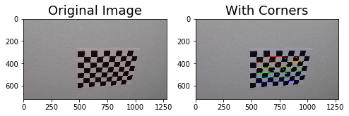


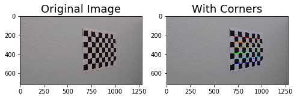


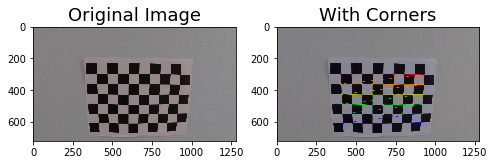


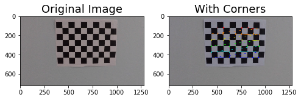


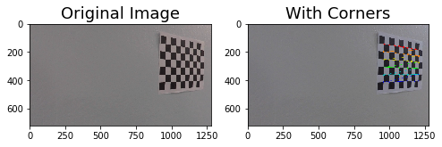


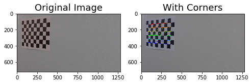


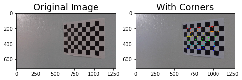


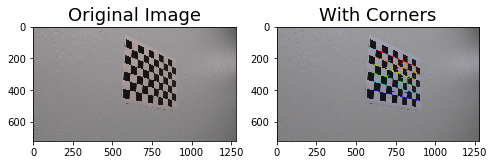


Next I will define a function `undistort()` which uses the calculate camera calibration matrix and distortion coefficients to remove distortion from an image and output the undistorted image.


```python
# Remove distortion from images
def undistort(image, show=True, read = True):
    if read:
        img = cv2.imread(image)
    else:
        img = image
    img_size = (img.shape[1], img.shape[0])
    ret, mtx, dist, rvecs, tvecs = cv2.calibrateCamera(objpoints, imgpoints, img_size, None, None)
    undist = cv2.undistort(img, mtx, dist, None, mtx)
    if show:
        f, (ax1, ax2) = plt.subplots(1, 2, figsize=(9,6))
        ax1.imshow(cv2.cvtColor(img, cv2.COLOR_BGR2RGB))
        ax1.set_title('Original Image', fontsize=20)
        ax2.imshow(cv2.cvtColor(undist, cv2.COLOR_BGR2RGB))
        ax2.set_title('Undistorted Image', fontsize=20)
    else:
        return undist
```


```python
images = glob.glob('test_images/test*.jpg')
for image in images:
    undistort(image)
```


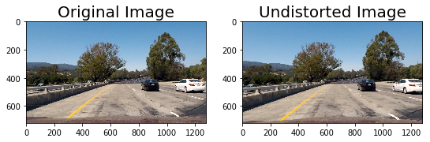


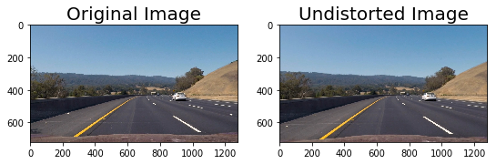


### Step 2: Perspective Transform

In this step I will define a function `birds_eye()` which transforms the undistorted image to a "birds eye view" of the road which focuses only on the lane lines and displays them in such a way that they appear to be relatively parallel to eachother. This will make it easier later on to fit polynomials to the lane lines and measure the curvature.


```python
# Perform perspective transform
def birds_eye(img, display=True, read = True):
    if read:
        undist = undistort(img, show = False)
    else:
        undist = undistort(img, show = False, read=False) 
    img_size = (undist.shape[1], undist.shape[0])
    offset = 0
    src = np.float32([[490, 482],[810, 482],
                      [1250, 720],[40, 720]])
    dst = np.float32([[0, 0], [1280, 0], 
                     [1250, 720],[40, 720]])
    M = cv2.getPerspectiveTransform(src, dst)
    warped = cv2.warpPerspective(undist, M, img_size)
    if display:
        f, (ax1, ax2) = plt.subplots(1, 2, figsize=(9, 6))
        f.tight_layout()
        ax1.imshow(cv2.cvtColor(undist, cv2.COLOR_BGR2RGB))
        ax1.set_title('Undistorted Image', fontsize=20)
        ax2.imshow(cv2.cvtColor(warped, cv2.COLOR_BGR2RGB))
        ax2.set_title('Undistorted and Warped Image', fontsize=20)
        plt.subplots_adjust(left=0., right=1, top=0.9, bottom=0.)
    else:
        return warped, M
```


```python
for image in glob.glob('test_images/test*.jpg'):
    birds_eye(image)
```


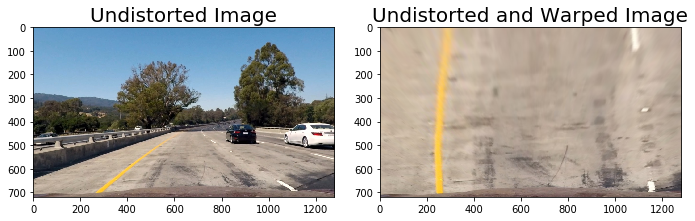


### Step 3: Apply Binary Thresholds

In this step I attempted to convert the warped image to different color spaces and create binary thresholded images which highlight only the lane lines and ignore everything else. 
I found that the following color channels and thresholds did a good job of identifying the lane lines in the provided test images:
- The S Channel from the HLS color space, with a min threshold of 180 and a max threshold of 255, did a fairly good job of identifying both the white and yellow lane lines, but did not pick up 100% of the pixels in either one, and had a tendency to get distracted by shadows on the road.
- The L Channel from the LUV color space, with a min threshold of 225 and a max threshold of 255, did an almost perfect job of picking up the white lane lines, but completely ignored the yellow lines.
- The B channel from the Lab color space, with a min threshold of 155 and an upper threshold of 200, did a better job than the S channel in identifying the yellow lines, but completely ignored the white lines. 

I chose to create a combined binary threshold based on the three above mentioned binary thresholds, to create one combination thresholded image which does a great job of highlighting almost all of the white and yellow lane lines.

**Note: The S binary threshold was left out of the final combined binary image and was not used in detecting lane lines because it added extra noise to the binary image and interfered with detecting lane lines accurately.**


```python

```


```python
# Create binary thresholded images to isolate lane line pixels
def apply_thresholds(image, show=True , read=True):
    if read :
        img, M = birds_eye(image, display = False)
    else:
        img, M = birds_eye(image, display = False , read = False)

    s_channel = cv2.cvtColor(img, cv2.COLOR_BGR2HLS)[:,:,2]
    
    l_channel = cv2.cvtColor(img, cv2.COLOR_BGR2LUV)[:,:,0]

    b_channel = cv2.cvtColor(img, cv2.COLOR_BGR2Lab)[:,:,2]   

    # Threshold color channel
    s_thresh_min = 180
    s_thresh_max = 255
    s_binary = np.zeros_like(s_channel)
    s_binary[(s_channel >= s_thresh_min) & (s_channel <= s_thresh_max)] = 1
    
    b_thresh_min = 155
    b_thresh_max = 200
    b_binary = np.zeros_like(b_channel)
    b_binary[(b_channel >= b_thresh_min) & (b_channel <= b_thresh_max)] = 1
    
    l_thresh_min = 225
    l_thresh_max = 255
    l_binary = np.zeros_like(l_channel)
    l_binary[(l_channel >= l_thresh_min) & (l_channel <= l_thresh_max)] = 1

    #color_binary = np.dstack((u_binary, s_binary, l_binary))
    
    combined_binary = np.zeros_like(s_binary)
    combined_binary[(l_binary == 1) | (b_binary == 1)] = 1

    if show == True:
        # Plotting thresholded images
        f, ((ax1, ax2, ax3), (ax4,ax5, ax6)) = plt.subplots(2, 3, sharey='col', sharex='row', figsize=(10,4))
        f.tight_layout()
        
        ax1.set_title('Original Image', fontsize=16)
        ax1.imshow(cv2.cvtColor(undistort(image, show=False),cv2.COLOR_BGR2RGB))
        
        ax2.set_title('Warped Image', fontsize=16)
        ax2.imshow(cv2.cvtColor(img, cv2.COLOR_BGR2RGB).astype('uint8'))
        
        ax3.set_title('s binary threshold', fontsize=16)
        ax3.imshow(s_binary, cmap='gray')
        
        ax4.set_title('b binary threshold', fontsize=16)
        ax4.imshow(b_binary, cmap='gray')
        
        ax5.set_title('l binary threshold', fontsize=16)
        ax5.imshow(l_binary, cmap='gray')

        ax6.set_title('Combined color thresholds', fontsize=16)
        ax6.imshow(combined_binary, cmap='gray')
        
        
    else: 
        return combined_binary
```


```python
for image in glob.glob('test_images/test*.jpg'):
    apply_thresholds(image)
```


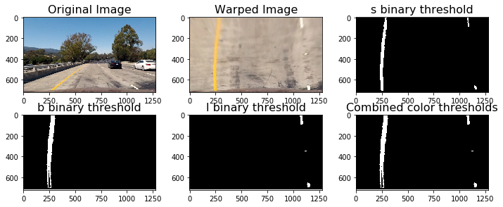


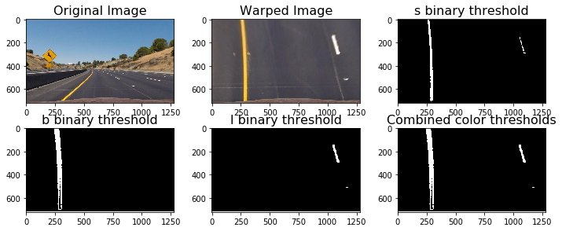


```python
# Define the complete image processing pipeline, reads raw image and returns binary image with lane lines identified
# (hopefully)
def pipeline(img , show=False , read=True):
    return apply_thresholds(img , show , read)
```

### Sliding Window Polyfit


```python
# Define method to fit polynomial to binary image with lines extracted, using sliding window
def sliding_window_polyfit(img):
    # Take a histogram of the bottom half of the image
    histogram = np.sum(img[img.shape[0]//2:,:], axis=0)
    # Print histogram from sliding window polyfit for example image
    plt.plot(histogram)
    plt.xlim(0, 1280)
    # Find the peak of the left and right halves of the histogram
    # These will be the starting point for the left and right lines
    midpoint = np.int(histogram.shape[0]//2)
    print(midpoint)
    quarter_point = np.int(midpoint//2)
    print(quarter_point)
    # Previously the left/right base was the max of the left/right half of the histogram
    # this changes it so that only a quarter of the histogram (directly to the left/right) is considered
    leftx_base = np.argmax(histogram[:midpoint])
    rightx_base = np.argmax(histogram[midpoint:]) + midpoint
    
    print('base pts:', leftx_base, rightx_base)

    # Choose the number of sliding windows
    nwindows = 10
    # Set height of windows
    window_height = np.int(img.shape[0]/nwindows)
    # Identify the x and y positions of all nonzero pixels in the image
    nonzero = img.nonzero()
    nonzeroy = np.array(nonzero[0])
    nonzerox = np.array(nonzero[1])
    # Current positions to be updated for each window
    leftx_current = leftx_base
    rightx_current = rightx_base
    # Set the width of the windows +/- margin
    margin = 80
    # Set minimum number of pixels found to recenter window
    minpix = 40
    # Create empty lists to receive left and right lane pixel indices
    left_lane_inds = []
    right_lane_inds = []
    # Rectangle data for visualization
    rectangle_data = []

    # Step through the windows one by one
    for window in range(nwindows):
        # Identify window boundaries in x and y (and right and left)
        win_y_low = img.shape[0] - (window+1)*window_height
        win_y_high = img.shape[0] - window*window_height
        win_xleft_low = leftx_current - margin
        win_xleft_high = leftx_current + margin
        win_xright_low = rightx_current - margin
        win_xright_high = rightx_current + margin
        rectangle_data.append((win_y_low, win_y_high, win_xleft_low, win_xleft_high, win_xright_low, win_xright_high))
        # Identify the nonzero pixels in x and y within the window
        good_left_inds = ((nonzeroy >= win_y_low) & (nonzeroy < win_y_high) & (nonzerox >= win_xleft_low) & (nonzerox < win_xleft_high)).nonzero()[0]
        good_right_inds = ((nonzeroy >= win_y_low) & (nonzeroy < win_y_high) & (nonzerox >= win_xright_low) & (nonzerox < win_xright_high)).nonzero()[0]
        # Append these indices to the lists
        left_lane_inds.append(good_left_inds)
        right_lane_inds.append(good_right_inds)
        # If you found > minpix pixels, recenter next window on their mean position
        if len(good_left_inds) > minpix:
            leftx_current = np.int(np.mean(nonzerox[good_left_inds]))
        if len(good_right_inds) > minpix:        
            rightx_current = np.int(np.mean(nonzerox[good_right_inds]))

    # Concatenate the arrays of indices
    left_lane_inds = np.concatenate(left_lane_inds)
    right_lane_inds = np.concatenate(right_lane_inds)

    # Extract left and right line pixel positions
    leftx = nonzerox[left_lane_inds]
    lefty = nonzeroy[left_lane_inds] 
    rightx = nonzerox[right_lane_inds]
    righty = nonzeroy[right_lane_inds] 

    left_fit, right_fit = (None, None)
    # Fit a second order polynomial to each
    if len(leftx) != 0:
        left_fit = np.polyfit(lefty, leftx, 2)
    if len(rightx) != 0:
        right_fit = np.polyfit(righty, rightx, 2)
    
    visualization_data = (rectangle_data, histogram)
    
    return left_fit, right_fit, left_lane_inds, right_lane_inds, visualization_data
```


```python
# visualize the result on example image
#exampleImg = cv2.imread('./test_images/test2.jpg')
exampleImg='test_images/straight_lines1.jpg'
#exampleImg = cv2.cvtColor(exampleImg, cv2.COLOR_BGR2RGB)
exampleImg_bin = apply_thresholds(exampleImg , show=False )

exampleImg = cv2.imread('test_images/straight_lines1.jpg')
exampleImg = cv2.cvtColor(exampleImg, cv2.COLOR_BGR2RGB)


        
f, (ax1, ax2) = plt.subplots(1, 2, sharey='col', sharex='row', figsize=(10,4))
f.tight_layout()
        
ax1.set_title('Original Image', fontsize=16)
ax1.imshow(exampleImg)

ax2.set_title('binary threshold Image', fontsize=16)
ax2.imshow(exampleImg_bin , 'gray')

left_fit, right_fit, left_lane_inds, right_lane_inds, visualization_data = sliding_window_polyfit(exampleImg_bin)

h = exampleImg.shape[0]
#print(left_fit)
#print(right_fit)
left_fit_x_int = left_fit[0]*h**2 + left_fit[1]*h + left_fit[2]
right_fit_x_int = right_fit[0]*h**2 + right_fit[1]*h + right_fit[2]
#print('fit x-intercepts:', left_fit_x_int, right_fit_x_int)

rectangles = visualization_data[0]
histogram = visualization_data[1]

# Create an output image to draw on and  visualize the result
out_img = np.uint8(np.dstack((exampleImg_bin, exampleImg_bin, exampleImg_bin))*255)
# Generate x and y values for plotting
ploty = np.linspace(0, exampleImg_bin.shape[0]-1, exampleImg_bin.shape[0] )
left_fitx = left_fit[0]*ploty**2 + left_fit[1]*ploty + left_fit[2]
right_fitx = right_fit[0]*ploty**2 + right_fit[1]*ploty + right_fit[2]
for rect in rectangles:
# Draw the windows on the visualization image
    cv2.rectangle(out_img,(rect[2],rect[0]),(rect[3],rect[1]),(0,255,0), 2) 
    cv2.rectangle(out_img,(rect[4],rect[0]),(rect[5],rect[1]),(0,255,0), 2) 
# Identify the x and y positions of all nonzero pixels in the image
nonzero = exampleImg_bin.nonzero()
nonzeroy = np.array(nonzero[0])
nonzerox = np.array(nonzero[1])
out_img[nonzeroy[left_lane_inds], nonzerox[left_lane_inds]] = [255, 0, 0]
out_img[nonzeroy[right_lane_inds], nonzerox[right_lane_inds]] = [100, 200, 255]
plt.imshow(out_img)
plt.plot(left_fitx, ploty, color='yellow')
plt.plot(right_fitx, ploty, color='yellow')
plt.xlim(0, 1280)
plt.ylim(720, 0)
```

    640
    320
    base pts: 222 1097


    (720, 0)


```python
# Print histogram from sliding window polyfit for example image
plt.plot(histogram)
plt.xlim(0, 1280)
print('...')
```

    ...


```python
# Define method to fit polynomial to binary image based upon a previous fit (chronologically speaking);
# this assumes that the fit will not change significantly from one video frame to the next
def polyfit_using_prev_fit(binary_warped, left_fit_prev, right_fit_prev):
    nonzero = binary_warped.nonzero()
    nonzeroy = np.array(nonzero[0])
    nonzerox = np.array(nonzero[1])
    margin = 80
    left_lane_inds = ((nonzerox > (left_fit_prev[0]*(nonzeroy**2) + left_fit_prev[1]*nonzeroy + left_fit_prev[2] - margin)) & 
                      (nonzerox < (left_fit_prev[0]*(nonzeroy**2) + left_fit_prev[1]*nonzeroy + left_fit_prev[2] + margin))) 
    right_lane_inds = ((nonzerox > (right_fit_prev[0]*(nonzeroy**2) + right_fit_prev[1]*nonzeroy + right_fit_prev[2] - margin)) & 
                       (nonzerox < (right_fit_prev[0]*(nonzeroy**2) + right_fit_prev[1]*nonzeroy + right_fit_prev[2] + margin)))  

    # Again, extract left and right line pixel positions
    leftx = nonzerox[left_lane_inds]
    lefty = nonzeroy[left_lane_inds] 
    rightx = nonzerox[right_lane_inds]
    righty = nonzeroy[right_lane_inds]
    
    left_fit_new, right_fit_new = (None, None)
    if len(leftx) != 0:
        # Fit a second order polynomial to each
        left_fit_new = np.polyfit(lefty, leftx, 2)
    if len(rightx) != 0:
        right_fit_new = np.polyfit(righty, rightx, 2)
    return left_fit_new, right_fit_new, left_lane_inds, right_lane_inds
```


```python
# visualize the result on example image
exampleImg2 = cv2.imread('test_images/test2.jpg')
exampleImg2 = cv2.cvtColor(exampleImg2, cv2.COLOR_BGR2RGB)
exampleImg2_bin = pipeline('test_images/test2.jpg')   
margin = 80
 
f, (ax1, ax2) = plt.subplots(1, 2, sharey='col', sharex='row', figsize=(10,4))
f.tight_layout()
        
ax1.set_title('Original Image', fontsize=16)
ax1.imshow(exampleImg2)

ax2.set_title('binary threshold Image', fontsize=16)
ax2.imshow(exampleImg2_bin , 'gray')

left_fit2, right_fit2, left_lane_inds2, right_lane_inds2 = polyfit_using_prev_fit(exampleImg2_bin, left_fit, right_fit)

# Generate x and y values for plotting
ploty = np.linspace(0, exampleImg2_bin.shape[0]-1, exampleImg2_bin.shape[0] )
left_fitx = left_fit[0]*ploty**2 + left_fit[1]*ploty + left_fit[2]
right_fitx = right_fit[0]*ploty**2 + right_fit[1]*ploty + right_fit[2]
left_fitx2 = left_fit2[0]*ploty**2 + left_fit2[1]*ploty + left_fit2[2]
right_fitx2 = right_fit2[0]*ploty**2 + right_fit2[1]*ploty + right_fit2[2]

# Create an image to draw on and an image to show the selection window
out_img = np.uint8(np.dstack((exampleImg2_bin, exampleImg2_bin, exampleImg2_bin))*255)
window_img = np.zeros_like(out_img)

# Color in left and right line pixels
nonzero = exampleImg2_bin.nonzero()
nonzeroy = np.array(nonzero[0])
nonzerox = np.array(nonzero[1])
out_img[nonzeroy[left_lane_inds2], nonzerox[left_lane_inds2]] = [255, 0, 0]
out_img[nonzeroy[right_lane_inds2], nonzerox[right_lane_inds2]] = [0, 0, 255]

# Generate a polygon to illustrate the search window area (OLD FIT)
# And recast the x and y points into usable format for cv2.fillPoly()
left_line_window1 = np.array([np.transpose(np.vstack([left_fitx-margin, ploty]))])
left_line_window2 = np.array([np.flipud(np.transpose(np.vstack([left_fitx+margin, ploty])))])
left_line_pts = np.hstack((left_line_window1, left_line_window2))
right_line_window1 = np.array([np.transpose(np.vstack([right_fitx-margin, ploty]))])
right_line_window2 = np.array([np.flipud(np.transpose(np.vstack([right_fitx+margin, ploty])))])
right_line_pts = np.hstack((right_line_window1, right_line_window2))

# Draw the lane onto the warped blank image
cv2.fillPoly(window_img, np.int_([left_line_pts]), (0,255, 0))
cv2.fillPoly(window_img, np.int_([right_line_pts]), (0,255, 0))
result = cv2.addWeighted(out_img, 1, window_img, 0.3, 0)
plt.imshow(result)
plt.plot(left_fitx2, ploty, color='yellow')
plt.plot(right_fitx2, ploty, color='yellow')
plt.xlim(0, 1280)
plt.ylim(720, 0)
```


    (720, 0)


```python

```

### Radius of Curvature and Distance from Lane Center Calculation


```python
# Method to determine radius of curvature and distance from lane center 
# based on binary image, polynomial fit, and L and R lane pixel indices
def calc_curv_rad_and_center_dist(bin_img, l_fit, r_fit, l_lane_inds, r_lane_inds):
    # Define conversions in x and y from pixels space to meters
    ym_per_pix = 12/720 # meters per pixel in y dimension, lane line is 10 ft = 3.048 meters
    xm_per_pix = 3.7/900 # meters per pixel in x dimension, lane width is 12 ft = 3.7 meters
    
    left_curverad, right_curverad, center_dist = (0, 0, 0)
    # Define y-value where we want radius of curvature
    # I'll choose the maximum y-value, corresponding to the bottom of the image
    h = bin_img.shape[0]
    ploty = np.linspace(0, h-1, h)
    y_eval = np.max(ploty)
  
    # Identify the x and y positions of all nonzero pixels in the image
    nonzero = bin_img.nonzero()
    nonzeroy = np.array(nonzero[0])
    nonzerox = np.array(nonzero[1])
    # Again, extract left and right line pixel positions
    leftx = nonzerox[l_lane_inds]
    lefty = nonzeroy[l_lane_inds] 
    rightx = nonzerox[r_lane_inds]
    righty = nonzeroy[r_lane_inds]
    
    if len(leftx) != 0 and len(rightx) != 0:
        # Fit new polynomials to x,y in world space
        left_fit_cr = np.polyfit(lefty*ym_per_pix, leftx*xm_per_pix, 2)
        right_fit_cr = np.polyfit(righty*ym_per_pix, rightx*xm_per_pix, 2)
        # Calculate the new radii of curvature
        left_curverad = ((1 + (2*left_fit_cr[0]*y_eval*ym_per_pix + left_fit_cr[1])**2)**1.5) / np.absolute(2*left_fit_cr[0])
        right_curverad = ((1 + (2*right_fit_cr[0]*y_eval*ym_per_pix + right_fit_cr[1])**2)**1.5) / np.absolute(2*right_fit_cr[0])
        # Now our radius of curvature is in meters
    
    # Distance from center is image x midpoint - mean of l_fit and r_fit intercepts 
    if r_fit is not None and l_fit is not None:
        car_position = bin_img.shape[1]/2
        l_fit_x_int = l_fit[0]*h**2 + l_fit[1]*h + l_fit[2]
        r_fit_x_int = r_fit[0]*h**2 + r_fit[1]*h + r_fit[2]
        lane_center_position = (r_fit_x_int + l_fit_x_int) /2
        center_dist = (car_position - lane_center_position) * xm_per_pix
    return left_curverad, right_curverad, center_dist
```


```python
rad_l, rad_r, d_center = calc_curv_rad_and_center_dist(exampleImg2_bin, left_fit2, right_fit2, left_lane_inds2, right_lane_inds2)

print('Radius of curvature for example:', rad_l, 'm,', rad_r, 'm')
print('Distance from lane center for example:', d_center, 'm')
```

    Radius of curvature for example: 148.755664763 m, 509.668963798 m
    Distance from lane center for example: -0.738936252083 m


### Draw the Detected Lane Back onto the Original Image


```python
def draw_lane(original_img, binary_img, l_fit, r_fit, Minv):
    new_img = np.copy(original_img)
    if l_fit is None or r_fit is None:
        return original_img
    # Create an image to draw the lines on
    warp_zero = np.zeros_like(binary_img).astype(np.uint8)
    color_warp = np.dstack((warp_zero, warp_zero, warp_zero))
    
    h,w = binary_img.shape
    ploty = np.linspace(0, h-1, num=h)# to cover same y-range as image
    left_fitx = l_fit[0]*ploty**2 + l_fit[1]*ploty + l_fit[2]
    right_fitx = r_fit[0]*ploty**2 + r_fit[1]*ploty + r_fit[2]

    # Recast the x and y points into usable format for cv2.fillPoly()
    pts_left = np.array([np.transpose(np.vstack([left_fitx, ploty]))])
    pts_right = np.array([np.flipud(np.transpose(np.vstack([right_fitx, ploty])))])
    pts = np.hstack((pts_left, pts_right))

    # Draw the lane onto the warped blank image
    cv2.fillPoly(color_warp, np.int_([pts]), (0,255, 0))
    cv2.polylines(color_warp, np.int32([pts_left]), isClosed=False, color=(255,0,255), thickness=15)
    cv2.polylines(color_warp, np.int32([pts_right]), isClosed=False, color=(0,255,255), thickness=15)

    # Warp the blank back to original image space using inverse perspective matrix (Minv)
    newwarp = cv2.warpPerspective(color_warp, Minv, (w, h)) 
    # Combine the result with the original image
    result = cv2.addWeighted(new_img, 1, newwarp, 0.5, 0)
   
    return result
```


```python
src = np.float32([[490, 482],[810, 482],
                  [1250, 720],[40, 720]])
dst = np.float32([[0, 0], [1280, 0], 
                 [1250, 720],[40, 720]])
Minv = cv2.getPerspectiveTransform(dst, src)
exampleImg2_out1 = draw_lane(exampleImg2, exampleImg2_bin, left_fit, right_fit, Minv)

rad_l, rad_r, d_center = calc_curv_rad_and_center_dist(exampleImg2_bin, left_fit, right_fit, left_lane_inds, right_lane_inds)
print(rad_l, rad_r, d_center)
f, (ax1, ax2) = plt.subplots(1,2, figsize=(9, 6))
f.tight_layout()
       
ax1.set_title('Original Image', fontsize=16)
ax1.imshow(exampleImg2)

ax2.set_title('lane filled image', fontsize=16)
ax2.imshow(exampleImg2_out1 , 'gray')


ax2.text(200, 100, 'Distance from lane center :{} m'.format(d_center),
         style='italic', color='white', fontsize=10)
ax2.text(200, 175, 'Radius of curvature is {}m'.format(int((rad_l + rad_r)/2)),
     style='italic', color='white', fontsize=10)

```

    33.6169844623 65.0673973306 -0.136399504749


    <matplotlib.text.Text at 0x7f9d00cfb390>


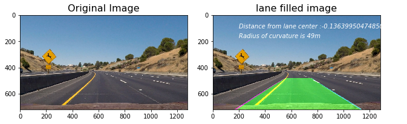


```python

```

### Draw Curvature Radius and Distance from Center Data onto the Original Image


```python
def fill_lane(image , display= True , read=True):
    
    # visualize the result on example image
    if read :
        exampleImg = cv2.imread(image)
        exampleImg = cv2.cvtColor(exampleImg, cv2.COLOR_BGR2RGB)
        exampleImg_bin = pipeline(image , show=False , read=True) 
        left_fit, right_fit, left_lane_inds, right_lane_inds, visualization_data = sliding_window_polyfit(exampleImg_bin)

    else:
        exampleImg = image
        exampleImg = cv2.cvtColor(exampleImg, cv2.COLOR_BGR2RGB)
        exampleImg_bin = pipeline(exampleImg , show=False , read=False) 
        global left_fit, right_fit, left_lane_inds, right_lane_inds, visualization_data
        left_fit, right_fit, left_lane_inds, right_lane_inds, visualization_data = sliding_window_polyfit(exampleImg_bin)
        if left_fit is None or right_fit is None:
            print(left_fit, right_fit, left_lane_inds, right_lane_inds)
            plt.imshow(exampleImg )
            return image
    margin = 20

    
    #h = exampleImg.shape[0]
    print(exampleImg.shape)
    #print(exampleImg_bin)
    print(left_fit, right_fit, left_lane_inds, right_lane_inds)
    h = exampleImg.shape[0]
    w = exampleImg.shape[1]
    
  
    # Create an output image to draw on and  visualize the result
    out_img = np.uint8(np.dstack((exampleImg_bin, exampleImg_bin, exampleImg_bin))*255)
    window_img = np.zeros_like(out_img)
    warp_zero = np.zeros_like(exampleImg_bin).astype(np.uint8)
    color_warp = np.dstack((warp_zero, warp_zero, warp_zero))
        
    # Generate x and y values for plotting
    ploty = np.linspace(0, exampleImg_bin.shape[0]-1, exampleImg_bin.shape[0] )
    left_fitx = left_fit[0]*ploty**2 + left_fit[1]*ploty + left_fit[2]
    right_fitx = right_fit[0]*ploty**2 + right_fit[1]*ploty + right_fit[2]


    nonzero = exampleImg_bin.nonzero()
    nonzeroy = np.array(nonzero[0])
    nonzerox = np.array(nonzero[1])
    out_img[nonzeroy[left_lane_inds], nonzerox[left_lane_inds]] = [255, 0, 0]
    out_img[nonzeroy[right_lane_inds], nonzerox[right_lane_inds]] = [100, 200, 255]
    

    # Recast the x and y points into usable format for cv2.fillPoly()
    pts_left = np.array([np.transpose(np.vstack([left_fitx, ploty]))])
    pts_right = np.array([np.flipud(np.transpose(np.vstack([right_fitx, ploty])))])
    pts = np.hstack((pts_left, pts_right))

    # Draw the lane onto the warped blank image
    cv2.fillPoly(color_warp, np.int_([pts]), (0,255, 0))
    cv2.polylines(color_warp, np.int32([pts_left]), isClosed=False, color=(255,0,255), thickness=15)
    cv2.polylines(color_warp, np.int32([pts_right]), isClosed=False, color=(0,255,255), thickness=15)

    
    src = np.float32([[490, 482],[810, 482],
                  [1250, 720],[40, 720]])
    dst = np.float32([[0, 0], [1280, 0], 
                     [1250, 720],[40, 720]])
    Minv = cv2.getPerspectiveTransform(dst, src)
    
    # Warp the blank back to original image space using inverse perspective matrix (Minv)
    newwarp = cv2.warpPerspective(color_warp, Minv, (w, h)) 
    # Combine the result with the original image
    exampleImg_out1 = cv2.addWeighted(exampleImg, 1, newwarp, 0.5, 0)
   
   

    #exampleImg_out1 = draw_lane(exampleImg, exampleImg_bin, left_fitx, right_fitx, Minv)

    rad_l, rad_r, d_center = calc_curv_rad_and_center_dist(exampleImg_bin, left_fitx, right_fitx, left_lane_inds, right_lane_inds)
    #print(rad_l, rad_r, d_center)
    if display == True:
          #print( left_fit, right_fit, left_lane_inds, right_lane_inds)
        rectangles = visualization_data[0]
        histogram = visualization_data[1]


        f, (ax1, ax2 ,ax3) = plt.subplots(1,3, figsize=(9, 6))
        f.tight_layout()

        ax1.set_title('Original Image', fontsize=16)
        ax1.imshow(exampleImg)

        ax2.set_title('lane filled image', fontsize=16)
        ax2.imshow(exampleImg_out1 , 'gray')


        ax2.text(200, 100, 'Distance from lane center :{} m'.format(d_center),
                 style='italic', color='white', fontsize=10)
        ax2.text(200, 175, 'Radius of curvature is {}m'.format(int((rad_l + rad_r)/2)),
             style='italic', color='white', fontsize=10)

        ax3.set_title('binary poly fit', fontsize=16)
        ax3.imshow(window_img , 'gray')
        ax3.plot(left_fitx, ploty, color='yellow')
        ax3.plot(right_fitx, ploty, color='yellow')
    else:
        return exampleImg_out1


```

### Step 7: Output visual display of the lane boundaries and numerical estimation of lane curvature and vehicle position.


```python
for image in glob.glob('test_images/test*.jpg'):
    fill_lane(image)
```

    (720, 1280, 3)
    [  6.27445200e-05  -1.97761141e-01   3.64860033e+02] [  7.17807742e-05   5.71968816e-02   1.10863335e+03] [31082 31083 31084 ...,  3687  3688  3689] [28565 28566 28567 ..., 12166 12167 12168]
    (720, 1280, 3)
    [  1.09715172e-04  -1.79914375e-01   2.45570535e+02] [  3.79470986e-05   6.74978206e-02   1.06669100e+03] [25050 25051 25052 ...,   988   989   990] [21237 21238 21239 ...,    12    13    14]
    (720, 1280, 3)
    [  1.29707204e-04  -1.52142072e-01   2.91925942e+02] [ -4.56600799e-05   1.41784381e-01   1.07433647e+03] [28451 28452 28453 ...,  4833  4834  4835] [28536 28537 28538 ...,  4859  4860  4861]
    (720, 1280, 3)
    [  5.34069561e-05  -1.94858851e-01   3.44298274e+02] [  6.06495401e-05   5.14431395e-02   1.07325981e+03] [32530 32531 32532 ...,  4530  4531  4532] [32556 32557 32558 ...,  4544  4545  4546]
    (720, 1280, 3)
    [ -9.70147147e-05   1.04525120e-01   2.64265191e+02] [  8.34771801e-05   2.55534863e-01   1.01037034e+03] [27149 27150 27151 ...,  3084  3085  3086] [23693 23694 23720 ...,  6149  6150  6151]
    (720, 1280, 3)
    [ -3.96991678e-05  -1.88905016e-02   2.95009276e+02] [ -1.65706360e-04   3.39913467e-01   1.02759337e+03] [29955 29956 29957 ...,  3142  3143  3144] [28879 28880 28881 ..., 13304 13305 13306]


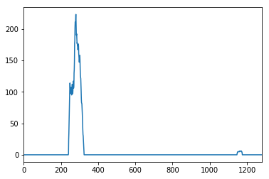


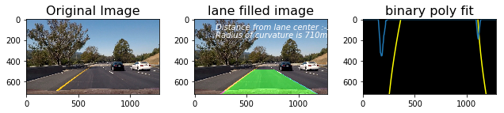


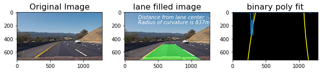


## Video Processing Pipeline:


```python
# Import everything needed to edit/save/watch video clips
from moviepy.editor import VideoFileClip
from IPython.display import HTML
```


```python
def process_video_image(image):
    return fill_lane(image , display= False , read=False)
```

## write images from video to analyse 


```python
video_output1 = 'project_video_output.mp4'
video_input1 = VideoFileClip('project_video.mp4').subclip(10,20)#.subclip(22,26)
video_input1.to_images_sequence("tmp_images/images%03d.jpeg")


```

    [MoviePy] Writing frames tmp_images/images%03d.jpeg.

    250it [00:06, 36.23it/s]             

    [MoviePy]: Done writing frames tmp_images/images%03d.jpeg.
    


    


    '\nfor frame in video_input1.iter_frames():\n    # now frame is a numpy array, do wathever you want\n    clip.fl_image(vertical_flip).to_images_sequence("tmp_images/images%03d.jpeg")\n    newframe = some_transformation(frame)\n    # etc.\n'


```python
for image in glob.glob('tmp_images/images*.jpeg'):
    fill_lane(image)
    break
```

    640
    320
    base pts: 264 1117
    (720, 1280, 3)
    [ -9.53976975e-06   5.59064837e-03   2.56988535e+02] [ -8.71378929e-05   3.17935267e-01   9.82439416e+02] [30375 30376 30377 ...,  4188  4189  4190] [27737 27738 27739 ..., 19571 19572 19573]


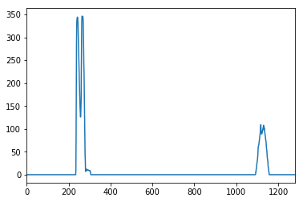


```python
#process_video_image('tmp_images/images000.jpeg')
video_input1.fl_image(process_video_image).to_images_sequence("tmp_output_images/images%03d.jpeg")
```

    640
    320
    base pts: 229 1078
    (720, 1280, 3)
    [ -6.41819803e-05   7.46159101e-02   1.98340140e+02] [ -3.34659395e-05   3.05434222e-01   9.29398584e+02] [29634 29635 29636 ...,  3294  3295  3296] [24448 24449 24450 ..., 20208 20209 20210]
    [MoviePy] Writing frames tmp_output_images/images%03d.jpeg.

    100%|██████████| 1/1 [00:00<00:00,  1.31it/s]

    640
    320
    base pts: 229 1078
    (720, 1280, 3)
    [ -6.41819803e-05   7.46159101e-02   1.98340140e+02] [ -3.34659395e-05   3.05434222e-01   9.29398584e+02] [29634 29635 29636 ...,  3294  3295  3296] [24448 24449 24450 ..., 20208 20209 20210]


    2it [00:01,  1.30it/s]                       

    640
    320
    base pts: 229 1090
    (720, 1280, 3)
    [ -6.05362011e-05   7.37513140e-02   1.97370204e+02] [  1.77516585e-06   2.57526116e-01   9.45237248e+02] [30207 30208 30209 ...,  3768  3769  3770] [27560 27561 27562 ..., 23857 23858 23859]


    3it [00:02,  1.32it/s]

    640
    320
    base pts: 229 1104
    (720, 1280, 3)
    [ -8.87865869e-05   8.82039227e-02   1.96930378e+02] [ -3.77072748e-05   2.94167944e-01   9.36055106e+02] [30100 30101 30102 ...,  4120  4121  4122] [30121 30122 30123 ..., 13680 13681 13682]


    4it [00:03,  1.26it/s]

    640
    320
    base pts: 229 1103
    (720, 1280, 3)
    [ -9.27581572e-05   9.38039803e-02   1.94023084e+02] [ -1.06090613e-04   3.60820736e-01   9.22998653e+02] [30084 30085 30086 ...,  4204  4205  4206] [30104 30105 30106 ...,  4218  4219  4220]


    5it [00:03,  1.25it/s]

    640
    320
    base pts: 230 1110
    (720, 1280, 3)
    [ -1.03518170e-04   9.74759115e-02   1.97759836e+02] [ -1.09057526e-04   3.69220008e-01   9.18282859e+02] [28956 28957 28958 ...,  3789  3790  3791] [28977 28978 28979 ...,  3803  3804  3805]


    6it [00:04,  1.24it/s]

    640
    320
    base pts: 229 1114
    (720, 1280, 3)
    [ -9.99234479e-05   9.28194480e-02   1.98912497e+02] [ -1.33851955e-04   3.85741117e-01   9.18403987e+02] [27897 27898 27899 ...,  3144  3145  3146] [27917 27918 27919 ...,  3156  3157  3158]


    7it [00:05,  1.23it/s]

    640
    320
    base pts: 230 1069
    (720, 1280, 3)
    [ -1.09722378e-04   9.61089791e-02   2.01662752e+02] [ -8.92749992e-05   3.76031359e-01   9.17399046e+02] [27714 27715 27716 ...,  3153  3154  3155] [22834 22835 22836 ...,  6907  6908  6909]


    8it [00:06,  1.25it/s]

    640
    320
    base pts: 231 1080
    (720, 1280, 3)
    [ -1.02977977e-04   8.84958057e-02   2.05343940e+02] [ -4.16004657e-05   3.40882111e-01   9.20108468e+02] [27567 27568 27569 ...,  3071  3072  3073] [24581 24582 24583 ..., 10521 10522 10523]


    9it [00:07,  1.26it/s]

    640
    320
    base pts: 231 1098
    (720, 1280, 3)
    [ -1.03762998e-04   9.00991197e-02   2.05084489e+02] [ -1.27321539e-04   3.98190100e-01   9.15510392e+02] [27894 27895 27896 ...,  3115  3116  3117] [26298 26299 26300 ..., 10070 10071 10072]


    10it [00:08,  1.24it/s]

    640
    320
    base pts: 235 1046
    (720, 1280, 3)
    [ -9.14785994e-05   7.93753518e-02   2.10390561e+02] [ -8.26033508e-05   3.58314716e-01   9.20057052e+02] [28212 28213 28214 ...,  3116  3117  3118] [27892 27893 27894 ..., 13634 13635 13636]


    11it [00:08,  1.23it/s]

    640
    320
    base pts: 234 1050
    (720, 1280, 3)
    [ -6.47078708e-05   6.42693235e-02   2.09538737e+02] [ -7.53746081e-05   3.32094463e-01   9.33842046e+02] [28901 28902 28903 ...,  3359  3360  3361] [29801 29802 29803 ..., 13176 13177 13178]


    12it [00:09,  1.23it/s]

    640
    320
    base pts: 236 1059
    (720, 1280, 3)
    [ -5.57555370e-05   5.60457996e-02   2.13239063e+02] [  1.66762732e-05   2.56667303e-01   9.50059201e+02] [29007 29008 29009 ...,  3368  3369  3370] [24863 24864 24865 ..., 16898 16899 16900]


    13it [00:10,  1.25it/s]

    640
    320
    base pts: 236 1075
    (720, 1280, 3)
    [ -4.40908579e-05   4.81816970e-02   2.14399162e+02] [ -3.35173550e-05   2.87489583e-01   9.47398885e+02] [29968 29969 29970 ...,  3712  3713  3714] [25404 25405 25406 ..., 16791 16792 16793]


    14it [00:11,  1.25it/s]

    640
    320
    base pts: 213 1084
    (720, 1280, 3)
    [ -4.13167977e-05   4.54014640e-02   2.14183892e+02] [ -3.70833545e-05   2.81440567e-01   9.52705237e+02] [30300 30301 30302 ...,  4253  4254  4255] [28521 28522 28523 ..., 20595 20596 20597]


    15it [00:12,  1.24it/s]

    640
    320
    base pts: 235 1097
    (720, 1280, 3)
    [ -6.24839095e-05   5.53458981e-02   2.13771018e+02] [ -4.17636287e-05   2.81503060e-01   9.54355965e+02] [30821 30822 30823 ...,  4425  4426  4427] [31164 31165 31166 ..., 24192 24193 24194]


    16it [00:12,  1.21it/s]

    640
    320
    base pts: 233 1117
    (720, 1280, 3)
    [ -6.90465851e-05   6.10342152e-02   2.09977807e+02] [ -1.60946639e-04   4.07470294e-01   9.25401309e+02] [30783 30784 30785 ...,  4545  4546  4547] [30801 30802 30803 ..., 16344 16345 16389]


    17it [00:13,  1.22it/s]

    640
    320
    base pts: 233 1119
    (720, 1280, 3)
    [ -8.48556933e-05   6.79722550e-02   2.12758504e+02] [ -1.08794375e-04   3.57329575e-01   9.36640619e+02] [30175 30176 30177 ...,  3866  3867  3868] [30196 30197 30198 ..., 18883 18884 18930]


    18it [00:14,  1.22it/s]

    640
    320
    base pts: 232 1122
    (720, 1280, 3)
    [ -9.47570060e-05   7.41196407e-02   2.11672898e+02] [ -1.14182296e-04   3.35932871e-01   9.53356407e+02] [29205 29206 29207 ...,  3449  3450  3451] [29224 29225 29226 ...,  3464  3465  3466]


    19it [00:15,  1.20it/s]

    640
    320
    base pts: 231 1128
    (720, 1280, 3)
    [ -9.35497717e-05   7.40472999e-02   2.09380089e+02] [ -1.32924214e-04   3.45860036e-01   9.57776672e+02] [28812 28813 28814 ...,  3505  3506  3507] [29060 29061 29062 ...,  7458  7459  7460]


    20it [00:16,  1.17it/s]

    640
    320
    base pts: 232 1097
    (720, 1280, 3)
    [ -8.88032872e-05   6.79955788e-02   2.11484155e+02] [ -1.48484421e-04   3.64276480e-01   9.52860823e+02] [28645 28646 28647 ...,  3358  3359  3360] [25321 25322 25323 ..., 11127 11128 11129]


    21it [00:17,  1.14it/s]

    640
    320
    base pts: 234 1108
    (720, 1280, 3)
    [ -9.41372740e-05   6.82920987e-02   2.15226904e+02] [ -1.40011315e-04   3.69117184e-01   9.48159173e+02] [27735 27736 27737 ...,  3149  3150  3151] [26201 26202 26203 ...,  9768  9769  9770]


    22it [00:18,  1.16it/s]

    640
    320
    base pts: 237 1059
    (720, 1280, 3)
    [ -8.69847851e-05   5.81529421e-02   2.23119109e+02] [ -1.35585967e-04   3.83568304e-01   9.37032743e+02] [28282 28283 28284 ...,  3086  3087  3088] [27837 27838 27839 ..., 13089 13090 13091]


    23it [00:18,  1.14it/s]

    640
    320
    base pts: 239 1069
    (720, 1280, 3)
    [ -7.73222499e-05   5.09659516e-02   2.25770651e+02] [ -1.42091708e-04   3.88124959e-01   9.35311054e+02] [28480 28481 28482 ...,  3099  3100  3101] [29298 29299 29300 ..., 16758 16759 16760]


    24it [00:19,  1.18it/s]

    640
    320
    base pts: 242 1080
    (720, 1280, 3)
    [ -6.82532246e-05   4.03371566e-02   2.32712571e+02] [ -1.74830987e-04   4.31440493e-01   9.19491685e+02] [28612 28613 28614 ...,  3094  3095  3096] [24530 24531 24532 ..., 15859 15860 15861]


    25it [00:20,  1.23it/s]

    640
    320
    base pts: 242 1095
    (720, 1280, 3)
    [ -5.52126650e-05   3.42116310e-02   2.32815691e+02] [ -1.72301566e-04   4.33318047e-01   9.19532134e+02] [29506 29507 29508 ...,  3540  3541  3542] [24327 24328 24329 ..., 19956 19957 19958]


    26it [00:21,  1.22it/s]

    640
    320
    base pts: 242 1112
    (720, 1280, 3)
    [ -4.98048513e-05   3.45138171e-02   2.30733140e+02] [ -1.26959217e-04   3.90913818e-01   9.32777152e+02] [30477 30478 30479 ...,  4043  4044  4045] [27999 28000 28001 ..., 19719 19720 19721]


    27it [00:22,  1.24it/s]

    640
    320
    base pts: 244 1125
    (720, 1280, 3)
    [ -7.42704303e-05   4.82807171e-02   2.29616788e+02] [ -1.48683432e-04   4.18981936e-01   9.23477246e+02] [30762 30763 30764 ...,  4173  4174  4175] [30780 30781 30782 ..., 23649 23650 23651]


    28it [00:22,  1.23it/s]

    640
    320
    base pts: 242 1132
    (720, 1280, 3)
    [ -8.30442749e-05   5.84754806e-02   2.26627787e+02] [ -1.59450907e-05   2.55049139e-01   9.74910437e+02] [30388 30389 30390 ...,  4120  4121  4122] [30407 30408 30409 ..., 16157 16158 16159]


    29it [00:23,  1.23it/s]

    640
    320
    base pts: 246 1132
    (720, 1280, 3)
    [ -9.36585368e-05   6.26018830e-02   2.30907121e+02] [ -6.08021433e-05   3.05401297e-01   9.59145301e+02] [29139 29140 29141 ...,  3427  3428  3429] [29158 29159 29160 ...,  3441  3442  3443]


    30it [00:24,  1.17it/s]

    640
    320
    base pts: 247 1131
    (720, 1280, 3)
    [ -8.82935391e-05   5.79946868e-02   2.33014152e+02] [ -9.74673783e-05   3.30952405e-01   9.57277642e+02] [27652 27653 27654 ...,  3132  3133  3134] [27673 27674 27675 ...,  7145  7146  7147]


    31it [00:25,  1.20it/s]

    640
    320
    base pts: 249 1090
    (720, 1280, 3)
    [ -9.01346692e-05   5.92900707e-02   2.34344663e+02] [ -3.68095793e-05   2.98127456e-01   9.63024610e+02] [27484 27485 27486 ...,  2974  2975  2976] [22102 22103 22104 ...,  6297  6298  6299]


    32it [00:26,  1.22it/s]

    640
    320
    base pts: 251 1099
    (720, 1280, 3)
    [ -8.16642112e-05   5.05989752e-02   2.39302930e+02] [ -3.24485685e-05   2.95289653e-01   9.61477553e+02] [27343 27344 27345 ...,  3010  3011  3012] [24034 24035 24036 ...,  9802  9803  9804]


    33it [00:27,  1.25it/s]

    640
    320
    base pts: 251 1119
    (720, 1280, 3)
    [ -7.18485532e-05   4.70489005e-02   2.38721590e+02] [ -4.88724485e-05   2.97405165e-01   9.67751432e+02] [27724 27725 27726 ...,  3094  3095  3096] [26121 26122 26123 ...,  9382  9383  9384]


    34it [00:27,  1.24it/s]

    640
    320
    base pts: 254 1073
    (720, 1280, 3)
    [ -7.33680957e-05   4.68253228e-02   2.42121952e+02] [ -4.31897184e-05   2.94009419e-01   9.69304474e+02] [28104 28105 28106 ...,  3038  3039  3040] [27561 27562 27563 ..., 12852 12853 12854]


    35it [00:28,  1.23it/s]

    640
    320
    base pts: 255 1083
    (720, 1280, 3)
    [ -6.87699184e-05   4.65319874e-02   2.41911349e+02] [ -5.30613090e-05   2.89199926e-01   9.76536857e+02] [28463 28464 28465 ...,  2944  2945  2946] [29145 29146 29147 ..., 16824 16825 16826]


    36it [00:29,  1.23it/s]

    640
    320
    base pts: 254 1099
    (720, 1280, 3)
    [ -5.15844162e-05   3.63800080e-02   2.41580675e+02] [ -6.86001807e-05   2.96065003e-01   9.81548988e+02] [28817 28818 28819 ...,  3146  3147  3148] [24965 24966 24967 ..., 16089 16090 16091]


    37it [00:30,  1.27it/s]

    640
    320
    base pts: 255 1111
    (720, 1280, 3)
    [ -3.86962330e-05   2.54870480e-02   2.45217287e+02] [ -6.35234210e-05   2.90576393e-01   9.83375293e+02] [29455 29456 29457 ...,  3465  3466  3467] [24360 24361 24362 ..., 20006 20007 20008]


    38it [00:30,  1.29it/s]

    640
    320
    base pts: 255 1114
    (720, 1280, 3)
    [ -3.68091560e-05   2.60990074e-02   2.44053256e+02] [ -4.70505534e-05   2.69263219e-01   9.93902362e+02] [30018 30019 30020 ...,  3955  3956  3957] [27527 27528 27529 ..., 19520 19521 19522]


    39it [00:31,  1.32it/s]

    640
    320
    base pts: 259 1124
    (720, 1280, 3)
    [ -6.00487207e-05   3.25490372e-02   2.50700407e+02] [ -7.51640471e-05   3.08618661e-01   9.78490814e+02] [30160 30161 30162 ...,  4445  4446  4447] [30178 30179 30180 ..., 23304 23305 23306]


    40it [00:32,  1.33it/s]

    640
    320
    base pts: 260 1138
    (720, 1280, 3)
    [ -5.73187536e-05   3.04957118e-02   2.50915925e+02] [ -4.91252018e-05   2.72699553e-01   9.92389052e+02] [29649 29650 29651 ...,  4280  4281  4282] [29668 29669 29670 ..., 15805 15806 15848]


    41it [00:33,  1.30it/s]

    640
    320
    base pts: 264 1146
    (720, 1280, 3)
    [ -5.78880230e-05   2.44578247e-02   2.57721628e+02] [ -8.41889508e-05   3.24246729e-01   9.72715657e+02] [28466 28467 28468 ...,  3441  3442  3443] [28484 28485 28486 ..., 18074 18075 18076]


    42it [00:34,  1.28it/s]

    640
    320
    base pts: 265 1150
    (720, 1280, 3)
    [ -6.46734120e-05   2.96518813e-02   2.59194816e+02] [ -7.26859180e-05   3.04313224e-01   9.80274692e+02] [27197 27198 27199 ...,  3048  3049  3050] [27215 27216 27217 ...,  7007  7008  7009]


    43it [00:34,  1.29it/s]

    640
    320
    base pts: 264 1102
    (720, 1280, 3)
    [ -5.68152711e-05   2.68396658e-02   2.58848486e+02] [ -1.55462277e-06   2.67184995e-01   9.87159855e+02] [27440 27441 27442 ...,  3100  3101  3102] [22219 22220 22221 ...,  6518  6519  6520]


    44it [00:35,  1.28it/s]

    640
    320
    base pts: 266 1115
    (720, 1280, 3)
    [ -5.73036340e-05   2.62120518e-02   2.61562580e+02] [ -4.60883485e-06   2.66848827e-01   9.85367977e+02] [27521 27522 27523 ...,  3036  3037  3038] [24166 24167 24168 ..., 10205 10206 10207]


    45it [00:36,  1.28it/s]

    640
    320
    base pts: 268 1133
    (720, 1280, 3)
    [ -5.87226302e-05   2.97985775e-02   2.60185879e+02] [ -8.14179759e-06   2.60160496e-01   9.89769680e+02] [27876 27877 27878 ...,  3140  3141  3142] [25988 25989 25990 ...,  9532  9533  9534]


    46it [00:37,  1.26it/s]

    640
    320
    base pts: 268 1084
    (720, 1280, 3)
    [ -5.65071972e-05   2.86212847e-02   2.61940997e+02] [ -4.93207700e-07   2.53420144e-01   9.89830616e+02] [28191 28192 28193 ...,  3291  3292  3293] [27605 27606 27607 ..., 13111 13112 13113]


    47it [00:37,  1.26it/s]

    640
    320
    base pts: 268 1095
    (720, 1280, 3)
    [ -4.20404040e-05   2.05227659e-02   2.61126217e+02] [ -1.40102853e-05   2.54741273e-01   9.92146792e+02] [28439 28440 28441 ...,  3171  3172  3173] [29102 29103 29104 ..., 16768 16769 16770]


    48it [00:38,  1.28it/s]

    640
    320
    base pts: 243 1103
    (720, 1280, 3)
    [ -2.71389978e-05   1.28724034e-02   2.60119995e+02] [ -1.16077826e-04   3.37806815e-01   9.76715831e+02] [28367 28368 28369 ...,  3336  3337  3338] [24457 24458 24459 ..., 15778 15779 15780]


    49it [00:39,  1.19it/s]

    640
    320
    base pts: 243 1115
    (720, 1280, 3)
    [ -1.18538431e-05   3.58427516e-03   2.60395212e+02] [ -8.35493782e-05   3.11536190e-01   9.81993268e+02] [28952 28953 28954 ...,  3556  3557  3558] [23816 23817 23818 ..., 19479 19480 19481]


    50it [00:40,  1.21it/s]

    640
    320
    base pts: 264 1117
    (720, 1280, 3)
    [ -5.17710501e-06   2.17023112e-03   2.57547478e+02] [ -1.10121770e-04   3.42010280e-01   9.76231836e+02] [29338 29339 29340 ...,  3955  3956  3957] [26859 26860 26861 ..., 19006 19007 19008]


    51it [00:41,  1.24it/s]

    640
    320
    base pts: 266 1128
    (720, 1280, 3)
    [ -2.85714797e-05   1.30916383e-02   2.57361795e+02] [ -6.55136846e-05   3.02633259e-01   9.83110404e+02] [28549 28550 28551 ...,  4032  4033  4034] [28564 28565 28566 ..., 21963 21964 21965]


    52it [00:42,  1.22it/s]

    640
    320
    base pts: 262 1152
    (720, 1280, 3)
    [ -3.11133692e-05   1.89157275e-02   2.52092695e+02] [ -5.57422652e-05   2.79807671e-01   9.95844319e+02] [28820 28821 28822 ...,  4243  4244  4245] [28838 28839 28840 ...,  4260  4261  4262]


    53it [00:42,  1.25it/s]

    640
    320
    base pts: 262 1152
    (720, 1280, 3)
    [ -4.05736458e-05   2.53876576e-02   2.50950735e+02] [ -6.32656003e-05   2.89639136e-01   9.92605223e+02] [28372 28373 28374 ...,  3995  3996  3997] [28392 28393 28394 ...,  4011  4012  4013]


    54it [00:43,  1.25it/s]

    640
    320
    base pts: 238 1152
    (720, 1280, 3)
    [ -4.93455153e-05   2.95977810e-02   2.51258540e+02] [ -8.02175746e-05   3.04067813e-01   9.89542982e+02] [27098 27099 27100 ...,  3266  3267  3268] [27117 27118 27119 ...,  3281  3282  3283]


    55it [00:44,  1.25it/s]

    640
    320
    base pts: 261 1108
    (720, 1280, 3)
    [ -5.38865785e-05   3.78344134e-02   2.46931049e+02] [ -1.75668538e-05   2.73883073e-01   9.96252294e+02] [27707 27708 27709 ...,  3135  3136  3137] [22244 22245 22246 ...,  6994  6995  6996]


    56it [00:45,  1.23it/s]

    640
    320
    base pts: 263 1118
    (720, 1280, 3)
    [ -6.18739151e-05   3.88492977e-02   2.52088048e+02] [ -2.02445339e-05   2.81666157e-01   9.87025313e+02] [27892 27893 27894 ...,  3186  3187  3188] [24336 24337 24338 ..., 10444 10445 10446]


    57it [00:46,  1.24it/s]

    640
    320
    base pts: 262 1152
    (720, 1280, 3)
    [ -5.97507789e-05   4.10483703e-02   2.49345906e+02] [ -3.35056094e-06   2.61506768e-01   9.96733211e+02] [28869 28870 28871 ...,  3280  3281  3282] [26692 26693 26694 ..., 10105 10106 10107]


    58it [00:46,  1.23it/s]

    640
    320
    base pts: 267 1085
    (720, 1280, 3)
    [ -6.20478710e-05   3.48083443e-02   2.58719071e+02] [ -3.80358898e-05   2.97714751e-01   9.82410798e+02] [28533 28534 28535 ...,  3159  3160  3161] [27777 27778 27779 ..., 13383 13384 13385]


    59it [00:47,  1.25it/s]

    640
    320
    base pts: 269 1098
    (720, 1280, 3)
    [ -4.92670107e-05   2.75205518e-02   2.59823201e+02] [ -4.72293315e-05   2.97972169e-01   9.84899427e+02] [28642 28643 28644 ...,  3213  3214  3215] [29226 29227 29228 ..., 12671 12672 12673]


    60it [00:48,  1.24it/s]

    640
    320
    base pts: 269 1110
    (720, 1280, 3)
    [ -1.93434072e-05   2.17173852e-03   2.66417289e+02] [ -8.84971601e-05   3.30826335e-01   9.77295301e+02] [28640 28641 28642 ...,  3244  3245  3246] [24722 24723 24724 ..., 16158 16159 16160]


    61it [00:49,  1.27it/s]

    640
    320
    base pts: 273 1113
    (720, 1280, 3)
    [  3.88310245e-06  -1.88676065e-02   2.73935244e+02] [ -6.32061257e-05   3.15420764e-01   9.74833235e+02] [29473 29474 29475 ...,  3762  3763  3764] [24365 24366 24367 ..., 19997 19998 19999]


    62it [00:50,  1.27it/s]

    640
    320
    base pts: 274 1126
    (720, 1280, 3)
    [  9.01627826e-06  -2.29927905e-02   2.75218026e+02] [ -1.02763058e-04   3.57401163e-01   9.63713828e+02] [30184 30185 30186 ...,  4383  4384  4385] [27689 27690 27691 ..., 24122 24123 24124]


    63it [00:50,  1.30it/s]

    640
    320
    base pts: 278 1135
    (720, 1280, 3)
    [ -9.41723857e-06  -2.29176821e-02   2.83793270e+02] [ -7.67131360e-05   3.43724342e-01   9.58723089e+02] [29967 29968 29969 ...,  4180  4181  4182] [29986 29987 29988 ..., 23268 14214 14215]


    64it [00:51,  1.30it/s]

    640
    320
    base pts: 278 1149
    (720, 1280, 3)
    [ -2.37554111e-05  -1.08574361e-02   2.81379666e+02] [ -2.02403776e-05   2.75374255e-01   9.79681936e+02] [29661 29662 29663 ...,  4039  4040  4041] [29680 29681 29682 ...,  4052  4053  4054]


    65it [00:52,  1.28it/s]

    640
    320
    base pts: 277 1149
    (720, 1280, 3)
    [ -2.15467296e-05  -1.34304348e-02   2.82282755e+02] [ -4.85891087e-05   3.04556980e-01   9.72394697e+02] [28386 28387 28388 ...,  3507  3508  3509] [28402 28403 28404 ..., 18373 18374 18375]


    66it [00:53,  1.28it/s]

    640
    320
    base pts: 277 1150
    (720, 1280, 3)
    [ -2.25066007e-05  -1.18573996e-02   2.81159951e+02] [ -1.71934500e-05   2.59498715e-01   9.88950936e+02] [28063 28064 28065 ...,  3480  3481  3482] [28082 28083 28084 ...,  7567  7568  7569]


    67it [00:53,  1.28it/s]

    640
    320
    base pts: 276 1107
    (720, 1280, 3)
    [ -3.03292027e-05  -5.08810231e-03   2.79750100e+02] [  1.16112367e-04   1.82986481e-01   1.00288066e+03] [28482 28483 28484 ...,  3536  3537  3538] [23119 23120 23121 ...,  7254  7255  7256]


    68it [00:54,  1.26it/s]

    640
    320
    base pts: 277 1115
    (720, 1280, 3)
    [ -2.49140882e-05  -1.52705028e-02   2.87075729e+02] [  9.99400918e-05   1.91013560e-01   9.96212554e+02] [28065 28066 28067 ...,  3342  3343  3344] [24592 24593 24594 ..., 10500 10501 10502]


    69it [00:55,  1.26it/s]

    640
    320
    base pts: 277 1128
    (720, 1280, 3)
    [ -3.55882621e-05  -6.46578311e-03   2.85251947e+02] [  1.05849708e-04   1.69853609e-01   1.00503077e+03] [28535 28536 28537 ...,  3288  3289  3290] [26576 26577 26578 ..., 10089 10090 10091]


    70it [00:56,  1.25it/s]

    640
    320
    base pts: 282 1084
    (720, 1280, 3)
    [ -3.91355738e-05  -6.12375734e-03   2.88944754e+02] [  1.02809414e-04   1.64903649e-01   1.00464403e+03] [28507 28508 28509 ...,  3314  3315  3316] [27916 27917 27918 ..., 13709 13710 13711]


    71it [00:57,  1.27it/s]

    640
    320
    base pts: 284 1092
    (720, 1280, 3)
    [ -2.11566366e-05  -1.46279791e-02   2.88183414e+02] [  7.30579339e-05   1.68351353e-01   1.01074140e+03] [28362 28363 28364 ...,  3369  3370  3371] [28969 28970 28971 ..., 17485 17486 17487]


    72it [00:57,  1.29it/s]

    640
    320
    base pts: 284 1101
    (720, 1280, 3)
    [ -6.79384922e-06  -2.37557400e-02   2.89117350e+02] [ -1.77004674e-05   2.33386977e-01   1.00082616e+03] [29092 29093 29094 ...,  3435  3436  3437] [25132 25133 25134 ..., 17044 17045 17046]


    73it [00:58,  1.30it/s]

    640
    320
    base pts: 284 1112
    (720, 1280, 3)
    [  1.34793241e-05  -3.78596754e-02   2.91703584e+02] [ -2.16698751e-05   2.37654868e-01   9.99527581e+02] [29590 29591 29592 ...,  3769  3770  3771] [24612 24613 24614 ..., 20524 20525 20526]


    74it [00:59,  1.27it/s]

    640
    320
    base pts: 257 1128
    (720, 1280, 3)
    [  2.30768892e-05  -3.95223083e-02   2.87071529e+02] [ -6.02836430e-05   2.68216111e-01   9.98715971e+02] [30533 30534 30535 ...,  4364  4365  4366] [28000 28001 28002 ..., 20417 20418 20419]


    75it [01:00,  1.29it/s]

    640
    320
    base pts: 258 1139
    (720, 1280, 3)
    [  9.85441880e-06  -3.70762870e-02   2.89428148e+02] [  2.90817348e-06   2.02815353e-01   1.01443382e+03] [30557 30558 30559 ...,  4258  4259  4260] [30576 30577 30578 ..., 23989  5228  5299]


    76it [01:00,  1.27it/s]

    640
    320
    base pts: 282 1137
    (720, 1280, 3)
    [  6.42080521e-06  -3.64953783e-02   2.89311237e+02] [ -4.21195599e-05   2.56743483e-01   9.98721707e+02] [29575 29576 29577 ...,  4088  4089  4090] [29594 29595 29596 ..., 16469 16470 16511]


    77it [01:01,  1.29it/s]

    640
    320
    base pts: 279 1148
    (720, 1280, 3)
    [  2.73574063e-06  -3.26580126e-02   2.85898392e+02] [ -2.95016772e-05   2.27525911e-01   1.01435297e+03] [28860 28861 28862 ...,  3773  3774  3775] [28880 28881 28882 ...,  3788  3789  3790]


    78it [01:02,  1.27it/s]

    640
    320
    base pts: 279 1148
    (720, 1280, 3)
    [ -2.16243498e-06  -2.98015900e-02   2.84671776e+02] [ -4.63742677e-05   2.40256515e-01   1.01371346e+03] [27899 27900 27901 ...,  3218  3219  3220] [27917 27918 27919 ...,  7668  7669  7670]


    79it [01:03,  1.26it/s]

    640
    320
    base pts: 275 1116
    (720, 1280, 3)
    [ -1.32277068e-05  -1.66906978e-02   2.77134495e+02] [  9.75212381e-06   2.09392046e-01   1.02633854e+03] [28506 28507 28508 ...,  3489  3490  3491] [23101 23102 23103 ...,  7693  7694  7695]


    80it [01:04,  1.28it/s]

    640
    320
    base pts: 278 1125
    (720, 1280, 3)
    [ -1.75741753e-05  -1.81119533e-02   2.81273126e+02] [  7.95402191e-06   2.13948630e-01   1.02054027e+03] [28632 28633 28634 ...,  3478  3479  3480] [25082 25083 25084 ..., 11424 11425 11426]


    81it [01:04,  1.30it/s]

    640
    320
    base pts: 278 1137
    (720, 1280, 3)
    [  3.61040291e-06  -4.04353295e-02   2.87722326e+02] [  3.90102841e-05   1.94573778e-01   1.02107106e+03] [27324 27325 27326 ...,  3262  3263  3264] [25453 25454 25455 ...,  9957  9958  9959]


    82it [01:05,  1.31it/s]

    640
    320
    base pts: 281 1090
    (720, 1280, 3)
    [  4.07335293e-06  -4.91714625e-02   2.96203148e+02] [  2.80026283e-05   2.10259472e-01   1.00918744e+03] [27873 27874 27875 ...,  3235  3236  3237] [27214 27215 27216 ..., 13406 13407 13408]


    83it [01:06,  1.31it/s]

    640
    320
    base pts: 281 1094
    (720, 1280, 3)
    [  1.30269834e-05  -6.02032440e-02   3.00127429e+02] [  1.79743255e-05   2.15032703e-01   1.00551564e+03] [28538 28539 28540 ...,  3405  3406  3407] [29134 29135 29136 ..., 17442 17443 17444]


    84it [01:07,  1.30it/s]

    640
    320
    base pts: 281 1104
    (720, 1280, 3)
    [  2.85270539e-05  -6.95355179e-02   3.00966534e+02] [ -4.64646115e-06   2.25831614e-01   1.00571354e+03] [28858 28859 28860 ...,  3442  3443  3444] [20801 20802 20803 ..., 16402 16403 16404]


    85it [01:07,  1.30it/s]

    640
    320
    base pts: 282 1117
    (720, 1280, 3)
    [  3.88953349e-05  -7.62175467e-02   3.02138203e+02] [ -6.11929136e-05   2.79355070e-01   9.94125095e+02] [29829 29830 29831 ...,  3874  3875  3876] [24894 24895 24896 ..., 20614 20615 20616]


    86it [01:08,  1.30it/s]

    640
    320
    base pts: 279 1134
    (720, 1280, 3)
    [  4.41031496e-05  -6.96781692e-02   2.94255631e+02] [ -9.14193638e-06   2.15342323e-01   1.01980936e+03] [30546 30547 30548 ...,  4252  4253  4254] [28174 28175 28176 ...,  2879  2944  2945]


    87it [01:09,  1.29it/s]

    640
    320
    base pts: 279 1146
    (720, 1280, 3)
    [  2.48012956e-05  -6.12897761e-02   2.94263276e+02] [ -2.64670576e-05   2.32909275e-01   1.01658965e+03] [30681 30682 30683 ...,  4339  4340  4341] [30699 30700 30701 ..., 24094 24095 24096]


    88it [01:10,  1.27it/s]

    640
    320
    base pts: 279 1146
    (720, 1280, 3)
    [  1.73843278e-05  -5.59879881e-02   2.93500765e+02] [ -3.84041622e-05   2.44657951e-01   1.01453503e+03] [30543 30544 30545 ...,  4397  4398  4399] [30562 30563 30564 ..., 16681 16726 16772]


    89it [01:11,  1.25it/s]

    640
    320
    base pts: 279 1155
    (720, 1280, 3)
    [  8.29642870e-07  -4.55289390e-02   2.93303595e+02] [ -2.53392196e-05   2.27504025e-01   1.01993831e+03] [29827 29828 29829 ...,  3927  3928  3929] [29843 29844 29845 ..., 19228 19229 19230]


    90it [01:11,  1.24it/s]

    640
    320
    base pts: 280 1154
    (720, 1280, 3)
    [ -1.30105295e-05  -4.07367112e-02   2.97423517e+02] [ -2.93915106e-05   2.45131176e-01   1.00850203e+03] [28637 28638 28639 ...,  3402  3403  3404] [28655 28656 28657 ...,  7786  7787  7788]


    91it [01:12,  1.24it/s]

    640
    320
    base pts: 282 1115
    (720, 1280, 3)
    [ -2.35917197e-05  -3.23741539e-02   2.97067815e+02] [ -2.79525330e-05   2.43904118e-01   1.00946000e+03] [28516 28517 28518 ...,  3311  3312  3313] [29333 29334 29335 ...,  6936  6937  6938]


    92it [01:13,  1.26it/s]

    640
    320
    base pts: 284 1123
    (720, 1280, 3)
    [ -2.64384087e-05  -3.54085483e-02   3.03452473e+02] [  1.05525678e-04   1.75543681e-01   1.01087744e+03] [28192 28193 28194 ...,  3182  3183  3184] [24843 24844 24845 ..., 10385 10386 10387]


    93it [01:14,  1.27it/s]

    640
    320
    base pts: 283 1138
    (720, 1280, 3)
    [ -3.46340276e-05  -2.30355772e-02   2.97987264e+02] [  1.15008850e-04   1.54894812e-01   1.01888041e+03] [28682 28683 28684 ...,  3325  3326  3327] [26725 26726 26727 ..., 10018 10019 10020]


    94it [01:15,  1.28it/s]

    640
    320
    base pts: 283 1096
    (720, 1280, 3)
    [ -3.09900624e-05  -1.82147721e-02   2.93422888e+02] [  1.01589957e-04   1.49592465e-01   1.02447999e+03] [28893 28894 28895 ...,  3288  3289  3290] [28229 28230 28231 ..., 13766 13767 13768]


    95it [01:15,  1.28it/s]

    640
    320
    base pts: 284 1099
    (720, 1280, 3)
    [ -2.18860376e-05  -2.00794671e-02   2.91958405e+02] [  7.69103560e-05   1.54341644e-01   1.02682254e+03] [29094 29095 29096 ...,  3119  3120  3121] [29711 29712 29713 ..., 12891 12892 12893]


    96it [01:16,  1.27it/s]

    640
    320
    base pts: 283 1111
    (720, 1280, 3)
    [ -8.42919280e-06  -2.30892688e-02   2.88427493e+02] [  1.56404967e-04   7.59230014e-02   1.04841540e+03] [29146 29147 29148 ...,  3171  3172  3173] [21096 21097 21098 ..., 16732 16733 16734]


    97it [01:17,  1.27it/s]

    640
    320
    base pts: 285 1120
    (720, 1280, 3)
    [  1.71561075e-05  -4.36723130e-02   2.93860977e+02] [  1.77016586e-05   1.90944747e-01   1.02279211e+03] [29469 29470 29471 ...,  3565  3566  3567] [24613 24614 24615 ...,   569   629   689]


    98it [01:18,  1.26it/s]

    640
    320
    base pts: 283 1124
    (720, 1280, 3)
    [  3.68966169e-05  -5.24220514e-02   2.91275939e+02] [  6.39357424e-06   1.92289045e-01   1.02837847e+03] [30434 30435 30436 ...,  4079  4080  4081] [28104 28105 28106 ...,  2436  2495  2496]


    99it [01:19,  1.26it/s]

    640
    320
    base pts: 284 1144
    (720, 1280, 3)
    [  3.41470199e-05  -5.92989155e-02   2.95476628e+02] [  2.21821062e-05   1.79240180e-01   1.02967130e+03] [30605 30606 30607 ...,  4566  4567  4568] [30624 30625 30626 ...,  4521  4587  4588]


    100it [01:19,  1.22it/s]

    640
    320
    base pts: 281 1146
    (720, 1280, 3)
    [  4.34258137e-05  -6.45379312e-02   2.93520471e+02] [  2.24804782e-05   1.63276929e-01   1.04096693e+03] [30278 30279 30280 ...,  4668  4669  4670] [30296 30297 30298 ...,  7161  7228  7293]


    101it [01:20,  1.21it/s]

    640
    320
    base pts: 281 1154
    (720, 1280, 3)
    [  3.78240982e-05  -6.30689068e-02   2.94009754e+02] [ -2.02791088e-05   2.19279648e-01   1.02282397e+03] [29653 29654 29655 ...,  4213  4214  4215] [29671 29672 29673 ...,  4232  4233  4234]


    102it [01:21,  1.19it/s]

    640
    320
    base pts: 280 1155
    (720, 1280, 3)
    [  2.93804101e-05  -5.83002990e-02   2.93420106e+02] [ -1.36667914e-05   2.14671032e-01   1.02286284e+03] [28335 28336 28337 ...,  3329  3330  3331] [28355 28356 28357 ...,  3347  3348  3349]


    103it [01:22,  1.20it/s]

    640
    320
    base pts: 277 1169
    (720, 1280, 3)
    [  2.43097531e-05  -5.41139526e-02   2.89962526e+02] [ -1.85363118e-05   2.11900296e-01   1.02904178e+03] [29002 29003 29004 ...,  3258  3259  3260] [29689 29707 29708 ...,  7481  7482  7483]


    104it [01:23,  1.20it/s]

    640
    320
    base pts: 278 1132
    (720, 1280, 3)
    [  2.03490363e-05  -5.72749609e-02   2.93004158e+02] [  1.52975561e-04   1.24604720e-01   1.03684922e+03] [29272 29273 29274 ...,  3280  3281  3282] [25646 25647 25648 ...,  6697  6698  6699]


    105it [01:24,  1.18it/s]

    640
    320
    base pts: 275 1142
    (720, 1280, 3)
    [  1.32500946e-05  -5.46523450e-02   2.92312518e+02] [  1.55745829e-04   1.08333319e-01   1.04270235e+03] [29741 29742 29743 ...,  3386  3387  3388] [27549 27550 27551 ..., 10585 10586 10587]


    106it [01:24,  1.19it/s]

    640
    320
    base pts: 275 1095
    (720, 1280, 3)
    [  4.21873660e-06  -5.04167740e-02   2.93112708e+02] [  1.41780565e-04   1.01699936e-01   1.04564591e+03] [29564 29565 29566 ...,  3119  3120  3121] [28756 28757 28758 ..., 14159 14160 14161]


    107it [01:25,  1.18it/s]

    640
    320
    base pts: 277 1101
    (720, 1280, 3)
    [ -3.70941499e-06  -4.91226064e-02   2.97866787e+02] [  1.21455020e-04   1.05975650e-01   1.04279531e+03] [29405 29406 29407 ...,  3130  3131  3132] [29905 29906 29907 ..., 12910 12911 12912]


    108it [01:26,  1.17it/s]

    640
    320
    base pts: 278 1113
    (720, 1280, 3)
    [ -1.05190674e-05  -4.06179063e-02   2.95622148e+02] [  8.04446231e-05   1.23930713e-01   1.04437031e+03] [29967 29968 29969 ...,  3323  3324  3325] [21542 21543 21544 ..., 16901 16902 16903]


    109it [01:27,  1.19it/s]

    640
    320
    base pts: 280 1112
    (720, 1280, 3)
    [ -1.78990969e-05  -3.73431177e-02   2.99736409e+02] [  6.43808518e-06   1.91126443e-01   1.02688581e+03] [30274 30275 30276 ...,  3749  3750  3751] [25021 25022 25023 ...,   529   530   592]


    110it [01:28,  1.17it/s]

    640
    320
    base pts: 280 1126
    (720, 1280, 3)
    [ -2.51733497e-05  -2.67801822e-02   2.96227919e+02] [  2.82735095e-06   1.88626140e-01   1.03115874e+03] [31239 31240 31241 ...,  4282  4283  4284] [28571 28572 28573 ...,  2959  2960  3019]


    111it [01:29,  1.20it/s]

    640
    320
    base pts: 282 1137
    (720, 1280, 3)
    [ -3.02352082e-05  -2.19617105e-02   2.95771647e+02] [ -2.34202791e-05   2.13965275e-01   1.02580747e+03] [30545 30546 30547 ...,  4488  4489  4490] [30563 30564 30565 ...,  4511  4512  4513]


    112it [01:30,  1.19it/s]

    640
    320
    base pts: 284 1144
    (720, 1280, 3)
    [ -5.22097356e-05  -6.04540165e-03   2.95586979e+02] [ -3.50151463e-05   2.25322842e-01   1.02084033e+03] [30307 30308 30309 ...,  4400  4401  4402] [30326 30327 30328 ...,  4419  4420  4421]


    113it [01:30,  1.20it/s]

    640
    320
    base pts: 286 1150
    (720, 1280, 3)
    [ -5.57367014e-05   2.68493190e-03   2.93374883e+02] [  1.44319321e-05   1.62905601e-01   1.04196860e+03] [29127 29128 29129 ...,  3678  3679  3680] [29147 29148 29149 ...,  9659  9729  9800]


    114it [01:31,  1.21it/s]

    640
    320
    base pts: 289 1148
    (720, 1280, 3)
    [ -6.01899692e-05   4.26410328e-03   2.97842389e+02] [ -4.70452623e-05   2.47073730e-01   1.01132812e+03] [27859 27860 27861 ...,  3054  3055  3056] [27876 27877 27878 ...,  7192  7193  7194]


    115it [01:32,  1.18it/s]

    640
    320
    base pts: 289 1113
    (720, 1280, 3)
    [ -5.98179313e-05   1.21177380e-02   2.93200462e+02] [  6.17836952e-05   1.85681067e-01   1.02200009e+03] [28192 28193 28194 ...,  3010  3011  3012] [22253 22254 22255 ...,  6459  6460  6461]


    116it [01:33,  1.16it/s]

    640
    320
    base pts: 291 1124
    (720, 1280, 3)
    [ -5.04914413e-05   9.74395287e-03   2.92401582e+02] [  5.50250302e-05   1.86957704e-01   1.02212100e+03] [28822 28823 28824 ...,  3138  3139  3140] [24860 24861 24862 ..., 10503 10504 10505]


    117it [01:34,  1.16it/s]

    640
    320
    base pts: 289 1150
    (720, 1280, 3)
    [ -2.21501335e-05  -5.29341949e-03   2.90870959e+02] [  4.84043369e-05   1.81450013e-01   1.02586957e+03] [29115 29116 29117 ...,  3275  3276  3277] [26881 26882 26883 ...,  9908  9909  9910]


    118it [01:35,  1.17it/s]

    640
    320
    base pts: 265 1095
    (720, 1280, 3)
    [  2.68808223e-06  -1.69959681e-02   2.87970049e+02] [  5.43914747e-05   1.67182953e-01   1.03229215e+03] [29232 29233 29234 ...,  3264  3265  3266] [28394 28395 28396 ..., 13851 13852 13853]


    119it [01:35,  1.19it/s]

    640
    320
    base pts: 266 1102
    (720, 1280, 3)
    [  2.95643538e-05  -4.09681408e-02   2.94000306e+02] [  4.44582435e-05   1.75555039e-01   1.02589474e+03] [28759 28760 28761 ...,  3216  3217  3218] [29330 29331 29332 ..., 17173 17174 17175]


    120it [01:36,  1.19it/s]

    640
    320
    base pts: 265 1109
    (720, 1280, 3)
    [  6.33511971e-05  -6.38168916e-02   2.93360058e+02] [ -9.12402049e-05   2.78466847e-01   1.00930718e+03] [29227 29228 29229 ...,  3362  3363  3364] [25509 25510 21072 ..., 16573 16574 16575]


    121it [01:37,  1.21it/s]

    640
    320
    base pts: 263 1124
    (720, 1280, 3)
    [  9.29677084e-05  -8.92594580e-02   2.96317261e+02] [  2.58421276e-06   2.00674381e-01   1.02487886e+03] [29994 29995 29996 ...,  3845  3846  3847] [25010 25011 25012 ...,   893   955   956]


    122it [01:38,  1.21it/s]

    640
    320
    base pts: 283 1130
    (720, 1280, 3)
    [  1.07182962e-04  -9.84023695e-02   2.93574078e+02] [  2.14720635e-06   1.95114032e-01   1.02870866e+03] [31002 31003 31004 ...,  4367  4368  4369] [28307 28308 28309 ...,  3120  3179  3180]


    123it [01:39,  1.22it/s]

    640
    320
    base pts: 279 1146
    (720, 1280, 3)
    [  1.21768823e-04  -1.12086535e-01   2.93672607e+02] [ -1.27773243e-05   2.10531885e-01   1.02534303e+03] [31474 31475 31476 ...,  4512  4513  4514] [31492 31493 31494 ...,  4527  4528  4529]


    124it [01:40,  1.24it/s]

    640
    320
    base pts: 278 1149
    (720, 1280, 3)
    [  9.70120441e-05  -1.07996070e-01   2.96120912e+02] [  1.96076565e-05   1.75662479e-01   1.03125109e+03] [30852 30853 30854 ...,  4315  4316  4317] [30870 30871 30872 ...,  8036  8037  8107]


    125it [01:40,  1.23it/s]

    640
    320
    base pts: 277 1149
    (720, 1280, 3)
    [  9.14524490e-05  -1.13607891e-01   2.99546113e+02] [ -1.74452756e-04   4.27603577e-01   9.48518293e+02] [29679 29680 29681 ...,  3509  3510  3511] [29699 29700 29701 ..., 29676 29677 29678]


    126it [01:41,  1.25it/s]

    640
    320
    base pts: 275 1149
    (720, 1280, 3)
    [  7.75964392e-05  -1.18212305e-01   3.07430739e+02] [ -2.54071769e-05   2.38565863e-01   1.00516553e+03] [28643 28644 28645 ...,  3171  3172  3173] [28660 28661 28662 ...,  7298  7299  7300]


    127it [01:42,  1.23it/s]

    640
    320
    base pts: 273 1110
    (720, 1280, 3)
    [  6.05617859e-05  -1.10271804e-01   3.06792927e+02] [  9.04200071e-05   1.81707115e-01   1.01222296e+03] [28619 28620 28621 ...,  3169  3170  3171] [23012 23013 23014 ...,  6666  6667  6668]


    128it [01:43,  1.23it/s]

    640
    320
    base pts: 272 1120
    (720, 1280, 3)
    [  4.91768095e-05  -1.08070672e-01   3.09271035e+02] [  8.86322799e-05   1.74691288e-01   1.01252689e+03] [28507 28508 28509 ...,  2995  2996  2997] [24773 24774 24775 ..., 10193 10194 10195]


    129it [01:44,  1.25it/s]

    640
    320
    base pts: 271 1135
    (720, 1280, 3)
    [  3.25879016e-05  -9.57389622e-02   3.06435315e+02] [  8.92944405e-05   1.61371909e-01   1.01993126e+03] [28727 28728 28729 ...,  2984  2985  2986] [26653 26654 26655 ...,  9404  9405  9406]


    130it [01:44,  1.24it/s]

    640
    320
    base pts: 269 1089
    (720, 1280, 3)
    [  3.61786086e-05  -9.74091590e-02   3.05974143e+02] [  8.42010062e-05   1.55499299e-01   1.02563974e+03] [28770 28771 28772 ...,  2970  2971  2972] [28033 28034 28035 ..., 13128 13129 13130]


    131it [01:45,  1.28it/s]

    640
    320
    base pts: 269 1100
    (720, 1280, 3)
    [  2.54572784e-05  -8.65689317e-02   3.03393667e+02] [  7.38093821e-05   1.51455883e-01   1.03054138e+03] [29198 29199 29200 ...,  3190  3191  3192] [29752 29753 29754 ..., 12521 12522 12523]


    132it [01:46,  1.24it/s]

    640
    320
    base pts: 269 1109
    (720, 1280, 3)
    [  1.86753929e-05  -8.18288858e-02   3.02688978e+02] [ -1.68467029e-05   2.13316606e-01   1.01987494e+03] [29771 29772 29773 ...,  3395  3396  3397] [21099 21100 21101 ..., 16565 16566 16567]


    133it [01:47,  1.26it/s]

    640
    320
    base pts: 271 1118
    (720, 1280, 3)
    [  2.79744418e-05  -9.26120791e-02   3.07679702e+02] [  1.33807397e-05   1.90635625e-01   1.02252883e+03] [30070 30071 30072 ...,  3517  3518  3519] [24665 24666 24667 ...,   938   993   994]


    134it [01:48,  1.21it/s]

    640
    320
    base pts: 271 1129
    (720, 1280, 3)
    [  1.56269522e-05  -8.27145471e-02   3.06971217e+02] [  1.23214904e-05   1.91408137e-01   1.02216134e+03] [31192 31193 31194 ...,  4160  4161  4162] [28462 28463 28464 ...,  3375  3376  3428]


    135it [01:48,  1.22it/s]

    640
    320
    base pts: 271 1140
    (720, 1280, 3)
    [  4.76676371e-06  -7.08139947e-02   3.04607593e+02] [ -8.96646619e-06   2.11549399e-01   1.01856255e+03] [31745 31746 31747 ...,  4492  4493  4494] [31770 31771 31772 ...,  4509  4510  4511]


    136it [01:49,  1.22it/s]

    640
    320
    base pts: 270 1144
    (720, 1280, 3)
    [ -3.48674258e-05  -4.14999713e-02   2.98618724e+02] [ -1.35910325e-05   2.11777966e-01   1.02062466e+03] [31454 31455 31456 ...,  4444  4445  4446] [31478 31479 31480 ...,  4463  4464  4465]


    137it [01:50,  1.21it/s]

    640
    320
    base pts: 270 1150
    (720, 1280, 3)
    [ -4.98836057e-05  -2.21709181e-02   2.91642239e+02] [ -3.38537071e-06   1.98668526e-01   1.02676098e+03] [30458 30459 30460 ...,  4136  4137  4138] [30482 30483 30484 ...,  4155  4156  4157]


    138it [01:51,  1.22it/s]

    640
    320
    base pts: 271 1151
    (720, 1280, 3)
    [ -5.85965074e-05  -1.31116397e-02   2.91334296e+02] [ -9.17778574e-06   2.08459934e-01   1.02193832e+03] [29486 29487 29488 ...,  3303  3304  3305] [29508 29509 29510 ...,  3322  3323  3324]


    139it [01:52,  1.23it/s]

    640
    320
    base pts: 270 1153
    (720, 1280, 3)
    [ -6.27995576e-05  -2.78909802e-03   2.86212556e+02] [ -1.21580108e-05   2.07058334e-01   1.02470651e+03] [29373 29374 29375 ...,  3359  3360  3361] [30127 30128 30129 ...,  7569  7570  7571]


    140it [01:52,  1.25it/s]

    640
    320
    base pts: 269 1123
    (720, 1280, 3)
    [ -5.89947132e-05   1.74882430e-03   2.81700084e+02] [  1.04651882e-04   1.41314524e-01   1.03380814e+03] [30185 30186 30187 ...,  3381  3382  3383] [25612 25613 25614 ...,  6913  6914  6915]


    141it [01:53,  1.23it/s]

    640
    320
    base pts: 271 1135
    (720, 1280, 3)
    [ -4.87946009e-05  -1.56914528e-03   2.80636773e+02] [  1.09936708e-04   1.29950946e-01   1.03519251e+03] [29160 29161 29162 ...,  3164  3165  3166] [26541 26542 26543 ..., 10287 10288 10289]


    142it [01:54,  1.23it/s]

    640
    320
    base pts: 270 1090
    (720, 1280, 3)
    [ -3.81707176e-05  -2.57263874e-03   2.77045592e+02] [  1.14233391e-04   1.14833165e-01   1.03983649e+03] [30039 30040 30041 ...,  3228  3229  3230] [29019 29020 29021 ..., 14297 14298 14299]


    143it [01:55,  1.21it/s]

    640
    320
    base pts: 274 1093
    (720, 1280, 3)
    [ -1.73803373e-05  -1.70793412e-02   2.80902272e+02] [  8.52087938e-05   1.32298261e-01   1.03256586e+03] [30110 30111 30112 ...,  3334  3335  3336] [30635 30636 30637 ..., 13436 13437 13438]


    144it [01:56,  1.24it/s]

    640
    320
    base pts: 272 1104
    (720, 1280, 3)
    [  3.00640258e-06  -2.58223658e-02   2.77684469e+02] [ -2.89066538e-05   2.13154668e-01   1.01960926e+03] [30536 30537 30538 ...,  3312  3313  3314] [21617 21618 21619 ..., 17057 17058 17059]


    145it [01:56,  1.25it/s]

    640
    320
    base pts: 249 1112
    (720, 1280, 3)
    [  2.76125996e-05  -4.41770870e-02   2.79926892e+02] [ -3.86189510e-05   2.26898157e-01   1.01403606e+03] [30644 30645 30646 ...,  3436  3437  3438] [24948 24949 24950 ..., 20493 20494 20495]


    146it [01:57,  1.22it/s]

    640
    320
    base pts: 249 1116
    (720, 1280, 3)
    [  3.84274402e-05  -5.14851307e-02   2.79343925e+02] [ -1.86623896e-06   1.92449662e-01   1.02122713e+03] [31662 31663 31664 ...,  4296  4297  4298] [28953 28954 28955 ...,  2626  2627  2628]


    147it [01:58,  1.23it/s]

    640
    320
    base pts: 248 1128
    (720, 1280, 3)
    [  4.78091942e-05  -5.67540781e-02   2.77365041e+02] [  6.53249574e-06   1.81460129e-01   1.02675995e+03] [32695 32696 32697 ...,  4967  4968  4969] [32716 32717 32718 ...,  4854  4855  4856]


    148it [01:59,  1.26it/s]

    640
    320
    base pts: 246 1138
    (720, 1280, 3)
    [  1.65432027e-05  -4.02382210e-02   2.75415344e+02] [ -2.79719682e-05   2.19895494e-01   1.01603739e+03] [31981 31982 31983 ...,  4874  4875  4876] [32003 32004 32005 ...,  4894  4895  4896]


    149it [02:00,  1.22it/s]

    640
    320
    base pts: 265 1144
    (720, 1280, 3)
    [  5.22304903e-06  -3.37362802e-02   2.73264409e+02] [  1.66688524e-06   1.96068278e-01   1.01978131e+03] [31776 31777 31778 ...,  4804  4805  4806] [31802 31803 31804 ...,  4824  4825  4826]


    150it [02:01,  1.19it/s]

    640
    320
    base pts: 264 1144
    (720, 1280, 3)
    [ -3.56417983e-06  -2.97316789e-02   2.73509774e+02] [ -7.77057409e-06   2.06294114e-01   1.01681548e+03] [30538 30539 30540 ...,  3964  3965  3966] [30560 30561 30562 ...,  3984  3985  3986]


    151it [02:01,  1.22it/s]

    640
    320
    base pts: 263 1146
    (720, 1280, 3)
    [ -1.23662454e-05  -2.22759964e-02   2.70756461e+02] [ -4.66001062e-06   2.02073152e-01   1.01906968e+03] [30079 30080 30081 ...,  3532  3533  3534] [30810 30811 30812 ...,  8014  8015  8016]


    152it [02:02,  1.23it/s]

    640
    320
    base pts: 261 1124
    (720, 1280, 3)
    [ -2.56698056e-05  -1.21245712e-02   2.68605682e+02] [  1.22748743e-04   1.36653184e-01   1.02650357e+03] [30370 30371 30372 ...,  3503  3504  3505] [25739 25740 25741 ...,  7150  7151  7152]


    153it [02:03,  1.23it/s]

    640
    320
    base pts: 263 1137
    (720, 1280, 3)
    [ -3.62520903e-05  -3.92572150e-03   2.68582950e+02] [  1.20239598e-04   1.30071038e-01   1.02416261e+03] [30310 30311 30312 ...,  3388  3389  3390] [27725 27758 27759 ..., 10809 10810 10811]


    154it [02:04,  1.25it/s]

    640
    320
    base pts: 260 1083
    (720, 1280, 3)
    [ -4.18149795e-05   5.28294715e-03   2.63313697e+02] [  1.10671216e-04   1.21307758e-01   1.02980486e+03] [30955 30956 30957 ...,  3466  3467  3468] [29910 29911 29912 ..., 14919 14920 14921]


    155it [02:05,  1.23it/s]

    640
    320
    base pts: 261 1088
    (720, 1280, 3)
    [ -3.65204219e-05   1.10654594e-03   2.65101022e+02] [  9.73192389e-05   1.24233352e-01   1.02690192e+03] [30853 30854 30855 ...,  3343  3344  3345] [31328 31329 31330 ..., 13541 13542 13543]


    156it [02:05,  1.23it/s]

    640
    320
    base pts: 260 1098
    (720, 1280, 3)
    [ -4.12977953e-05   1.13342622e-02   2.59351007e+02] [ -1.75205711e-05   2.05140966e-01   1.01394916e+03] [31495 31496 31497 ...,  3305  3306  3307] [22414 22415 22416 ..., 17541 17542 17543]


    157it [02:06,  1.26it/s]

    640
    320
    base pts: 258 1103
    (720, 1280, 3)
    [ -2.15107185e-05   6.33574656e-04   2.58057187e+02] [  2.16600707e-05   1.70170326e-01   1.02165147e+03] [31991 31992 31993 ...,  3558  3559  3560] [26202 26203 26204 ..., 21520 21521 21522]


    158it [02:07,  1.28it/s]

    640
    320
    base pts: 260 1112
    (720, 1280, 3)
    [ -5.00567831e-06  -9.14333830e-03   2.57973890e+02] [  1.78565595e-05   1.72310983e-01   1.01959143e+03] [32070 32071 32072 ...,  3804  3805  3806] [29184 29185 29186 ...,  1010  1064  1065]


    159it [02:08,  1.28it/s]

    640
    320
    base pts: 257 1122
    (720, 1280, 3)
    [  1.58889524e-05  -2.37654990e-02   2.58421638e+02] [  3.04966380e-05   1.57392527e-01   1.02324742e+03] [32644 32645 32646 ...,  4666  4667  4668] [32667 32668 32669 ...,  3892  3952  3953]


    160it [02:08,  1.29it/s]

    640
    320
    base pts: 258 1132
    (720, 1280, 3)
    [  1.26251449e-05  -2.81463384e-02   2.60748644e+02] [  2.93888409e-06   1.90714910e-01   1.01110350e+03] [31432 31433 31434 ...,  4674  4675  4676] [31457 31458 31459 ...,  4694  4695  4696]


    161it [02:09,  1.27it/s]

    640
    320
    base pts: 256 1131
    (720, 1280, 3)
    [  2.04029660e-05  -3.39174222e-02   2.59426088e+02] [  9.77918667e-06   1.83618614e-01   1.01219047e+03] [31019 31020 31021 ...,  4682  4683  4684] [31041 31042 31043 ...,  4701  4702  4703]


    162it [02:10,  1.25it/s]

    640
    320
    base pts: 256 1133
    (720, 1280, 3)
    [  3.11731630e-05  -4.33489555e-02   2.60410789e+02] [  7.95233544e-06   1.85870797e-01   1.01068500e+03] [29735 29736 29737 ...,  3966  3967  3968] [29756 29757 29758 ...,  3984  3985  3986]


    163it [02:11,  1.20it/s]

    640
    320
    base pts: 254 1096
    (720, 1280, 3)
    [  2.49164432e-05  -3.99622151e-02   2.59073293e+02] [ -5.52599306e-06   1.95086921e-01   1.00919842e+03] [29426 29427 29428 ...,  3376  3377  3378] [30328 30329 30330 ...,  7681  7682  7683]


    164it [02:12,  1.21it/s]

    640
    320
    base pts: 255 1100
    (720, 1280, 3)
    [  1.20562028e-05  -3.35077793e-02   2.58662935e+02] [  6.64823755e-05   1.57256222e-01   1.01308289e+03] [29243 29244 29245 ...,  3365  3366  3367] [25314 25315 25316 ...,  6773  6774  6775]


    165it [02:13,  1.16it/s]

    640
    320
    base pts: 253 1110
    (720, 1280, 3)
    [  1.38374234e-05  -4.55981001e-02   2.65374452e+02] [  6.30110617e-05   1.61756404e-01   1.00660299e+03] [29464 29465 29466 ...,  3378  3379  3380] [26953 26954 26955 ..., 10173 10174 10175]


    166it [02:14,  1.15it/s]

    640
    320
    base pts: 250 1072
    (720, 1280, 3)
    [  1.01491362e-05  -3.78444991e-02   2.58691680e+02] [  6.61467637e-05   1.43753596e-01   1.01558370e+03] [30230 30231 30232 ...,  3469  3470  3471] [29233 29234 29235 ..., 14303 14304 14305]


    167it [02:14,  1.18it/s]

    640
    320
    base pts: 248 1076
    (720, 1280, 3)
    [  1.43559290e-05  -4.77090650e-02   2.62858652e+02] [  6.04754242e-05   1.48434554e-01   1.01205092e+03] [30528 30529 30530 ...,  3448  3449  3450] [31032 31033 31034 ..., 13439 13440 13441]


    168it [02:15,  1.20it/s]

    640
    320
    base pts: 248 1087
    (720, 1280, 3)
    [  1.15620471e-05  -4.49016439e-02   2.60898495e+02] [  3.26058970e-05   1.63693988e-01   1.01086477e+03] [30797 30798 30799 ...,  3473  3474  3475] [21958 21959 21960 ..., 17360 17361 17362]


    169it [02:16,  1.21it/s]

    640
    320
    base pts: 244 1089
    (720, 1280, 3)
    [  8.08627290e-06  -4.01856223e-02   2.58695119e+02] [  5.21553111e-05   1.41792588e-01   1.01769202e+03] [31333 31334 31335 ...,  3757  3758  3759] [25652 25653 25654 ..., 21088 21089 21090]


    170it [02:17,  1.23it/s]

    640
    320
    base pts: 246 1097
    (720, 1280, 3)
    [  1.56038803e-05  -5.03990325e-02   2.63946668e+02] [  1.18682392e-05   1.80861594e-01   1.00547322e+03] [31902 31903 31904 ...,  4201  4202  4203] [29049 29050 29051 ...,  1755  1756  1819]


    171it [02:18,  1.23it/s]

    640
    320
    base pts: 246 1107
    (720, 1280, 3)
    [  9.46893283e-06  -4.42515406e-02   2.62270581e+02] [  2.06147648e-05   1.68997165e-01   1.00888932e+03] [31585 31586 31587 ...,  5010  5011  5012] [31607 31608 31609 ...,  4506  4507  4569]


    172it [02:19,  1.20it/s]

    640
    320
    base pts: 248 1114
    (720, 1280, 3)
    [ -1.25754061e-05  -3.76336002e-02   2.65954306e+02] [ -1.47653091e-06   2.04746634e-01   9.92582319e+02] [31532 31533 31534 ...,  4848  4849  4850] [31552 31553 31554 ...,  4867  4868  4869]


    173it [02:19,  1.20it/s]

    640
    320
    base pts: 244 1121
    (720, 1280, 3)
    [ -1.71006584e-05  -3.10788588e-02   2.61159853e+02] [ -6.99901352e-05   2.77908588e-01   9.73620992e+02] [31541 31542 31543 ...,  4574  4575  4576] [31562 31563 31564 ..., 19148 19149 19193]


    174it [02:20,  1.21it/s]

    640
    320
    base pts: 245 1120
    (720, 1280, 3)
    [ -2.79123022e-05  -2.13793749e-02   2.57898060e+02] [  2.37777581e-05   1.77320029e-01   9.98321513e+02] [30595 30596 30597 ...,  3905  3906  3907] [30620 30621 30622 ...,  3924  3925  3926]


    175it [02:21,  1.23it/s]

    640
    320
    base pts: 245 1076
    (720, 1280, 3)
    [ -3.10570525e-05  -1.77662948e-02   2.56453372e+02] [  1.50511734e-05   1.82540232e-01   9.96613742e+02] [30825 30826 30827 ...,  3507  3508  3509] [31806 31807 31808 ...,  8039  8040  8041]


    176it [02:22,  1.22it/s]

    640
    320
    base pts: 242 1089
    (720, 1280, 3)
    [ -3.23140935e-05  -8.96400961e-03   2.48686327e+02] [  1.18484480e-04   1.20874173e-01   1.00991296e+03] [31075 31076 31077 ...,  3482  3483  3484] [26540 26541 26542 ...,  7274  7275  7276]


    177it [02:23,  1.26it/s]

    640
    320
    base pts: 242 1099
    (720, 1280, 3)
    [ -3.12804508e-05  -1.00178151e-02   2.49631516e+02] [  9.87046442e-05   1.26177217e-01   1.00757537e+03] [31168 31169 31170 ...,  3546  3547  3548] [28220 28221 28222 ..., 11030 11031 11032]


    178it [02:23,  1.23it/s]

    640
    320
    base pts: 241 1060
    (720, 1280, 3)
    [ -2.89734308e-05  -1.02138762e-02   2.48175260e+02] [  1.04083453e-04   1.12884532e-01   1.00995105e+03] [31258 31259 31260 ...,  3512  3513  3514] [30190 30191 30192 ..., 14968 14969 14970]


    179it [02:24,  1.24it/s]

    640
    320
    base pts: 242 1065
    (720, 1280, 3)
    [ -2.24839327e-05  -1.62993938e-02   2.49722919e+02] [  8.84764180e-05   1.18677917e-01   1.00703504e+03] [31415 31416 31417 ...,  3628  3629  3630] [31943 31944 31945 ..., 13928 13929 13930]


    180it [02:25,  1.24it/s]

    640
    320
    base pts: 241 1073
    (720, 1280, 3)
    [ -1.97106492e-05  -1.51432838e-02   2.47431417e+02] [  1.33022163e-04   7.19949004e-02   1.01746503e+03] [31699 31700 31701 ...,  3607  3608  3609] [22662 22663 22664 ..., 17858 17859 17860]


    181it [02:26,  1.23it/s]

    640
    320
    base pts: 236 1079
    (720, 1280, 3)
    [ -5.82940514e-06  -1.89978639e-02   2.42268360e+02] [  1.08148651e-04   7.67604822e-02   1.02318389e+03] [31888 31889 31890 ...,  3542  3543  3544] [26040 26041 26042 ..., 21355 21356 21357]


    182it [02:27,  1.23it/s]

    640
    320
    base pts: 238 1088
    (720, 1280, 3)
    [  4.02810921e-07  -2.29019491e-02   2.42472775e+02] [  2.19261042e-06   1.76134370e-01   9.99528332e+02] [32269 32270 32271 ...,  3854  3855  3856] [29342 29343 29344 ...,  1515  1516  1568]


    183it [02:27,  1.25it/s]

    640
    320
    base pts: 233 1100
    (720, 1280, 3)
    [  1.61235905e-05  -2.73622262e-02   2.36570139e+02] [  6.92715836e-06   1.62383034e-01   1.00847613e+03] [32588 32589 32590 ...,  4433  4434  4435] [32610 32611 32612 ...,  3514  3515  3516]


    184it [02:28,  1.23it/s]

    640
    320
    base pts: 234 1111
    (720, 1280, 3)
    [ -5.99721818e-06  -1.79075328e-02   2.36938541e+02] [ -1.25058574e-05   1.84967025e-01   1.00129569e+03] [32179 32180 32181 ...,  4700  4701  4702] [32202 32203 32204 ...,  4717  4718  4719]


    185it [02:29,  1.23it/s]

    640
    320
    base pts: 232 1110
    (720, 1280, 3)
    [ -1.03644453e-05  -1.56808017e-02   2.36354444e+02] [ -3.70925767e-05   2.01007853e-01   1.00093537e+03] [31870 31871 31872 ...,  4770  4771  4772] [31896 31897 31898 ...,  4788  4789  4790]


    186it [02:30,  1.22it/s]

    640
    320
    base pts: 232 1115
    (720, 1280, 3)
    [ -8.98870916e-06  -2.11877058e-02   2.38949458e+02] [ -4.96491548e-05   2.15870238e-01   9.96282079e+02] [30192 30193 30194 ...,  3892  3893  3894] [30217 30218 30219 ...,  3908  3909  3910]


    187it [02:31,  1.21it/s]

    640
    320
    base pts: 233 1078
    (720, 1280, 3)
    [ -1.79497450e-05  -2.04563774e-02   2.43675302e+02] [  1.13977178e-04   1.36095808e-01   9.96455035e+02] [30131 30132 30133 ...,  3427  3428  3429] [23245 23246 23247 ...,  7601  7602  7603]


    188it [02:32,  1.22it/s]

    640
    320
    base pts: 231 1086
    (720, 1280, 3)
    [ -8.47379982e-06  -2.47407219e-02   2.40076096e+02] [  9.04929980e-05   1.33228400e-01   1.00220379e+03] [30514 30515 30516 ...,  3493  3494  3495] [25901 25902 25903 ...,  7070  7071  7072]


    189it [02:32,  1.21it/s]

    640
    320
    base pts: 234 1089
    (720, 1280, 3)
    [ -1.84820893e-05  -2.32478524e-02   2.45191791e+02] [  8.90846305e-05   1.33385051e-01   9.97488154e+02] [30560 30561 30562 ...,  3419  3420  3421] [27921 27922 27923 ..., 10570 10571 10572]


    190it [02:33,  1.22it/s]

    640
    320
    base pts: 234 1051
    (720, 1280, 3)
    [ -1.61048250e-05  -3.06242367e-02   2.50626037e+02] [  9.63528346e-05   1.23375224e-01   9.95923795e+02] [30447 30448 30449 ...,  3445  3446  3447] [29600 29601 29602 ..., 14087 14088 14089]


    191it [02:34,  1.20it/s]

    640
    320
    base pts: 233 1061
    (720, 1280, 3)
    [ -2.06967688e-06  -3.56697213e-02   2.47376283e+02] [  8.90721957e-05   1.17294454e-01   1.00186687e+03] [30422 30423 30424 ...,  3477  3478  3479] [31049 31050 31051 ..., 13217 13218 13219]


    192it [02:35,  1.20it/s]

    640
    320
    base pts: 232 1071
    (720, 1280, 3)
    [  2.06573854e-06  -3.73663646e-02   2.46265819e+02] [  1.69510930e-05   1.69694929e-01   9.92610540e+02] [30818 30819 30820 ...,  3590  3591  3592] [26104 26105 26106 ..., 17047 17048 17049]


    193it [02:36,  1.18it/s]

    640
    320
    base pts: 228 1084
    (720, 1280, 3)
    [  1.77772830e-05  -3.88688106e-02   2.36383081e+02] [  1.31018943e-05   1.54817728e-01   1.00592359e+03] [31786 31787 31788 ...,  3632  3633  3634] [25809 25810 25811 ..., 21304 21305 21306]


    194it [02:37,  1.18it/s]

    640
    320
    base pts: 229 1089
    (720, 1280, 3)
    [  2.80722633e-05  -4.87062991e-02   2.37731377e+02] [ -1.46845822e-05   1.84958711e-01   9.97369492e+02] [32587 32588 32589 ...,  4213  4214  4215] [29464 29465 29466 ...,  1836  1837  1838]


    195it [02:37,  1.21it/s]

    640
    320
    base pts: 222 1100
    (720, 1280, 3)
    [  3.26819080e-05  -5.07317528e-02   2.34209566e+02] [ -5.59895167e-06   1.72770012e-01   1.00252620e+03] [32829 32830 32831 ...,  4802  4803  4804] [32855 32856 32857 ...,  4316  4317  4318]


    196it [02:38,  1.21it/s]

    640
    320
    base pts: 222 1106
    (720, 1280, 3)
    [  3.10662997e-05  -5.83510084e-02   2.37431895e+02] [ -2.44821987e-05   1.95609908e-01   9.95201730e+02] [32519 32520 32521 ...,  4512  4513  4514] [32542 32543 32544 ...,  4528  4529  4530]


    197it [02:39,  1.19it/s]

    640
    320
    base pts: 226 1106
    (720, 1280, 3)
    [  3.19724673e-05  -6.69491716e-02   2.43348880e+02] [ -2.19098050e-05   2.02988540e-01   9.87242327e+02] [31606 31607 31608 ...,  4115  4116  4117] [31629 31630 31631 ...,  4132  4133  4134]


    198it [02:40,  1.22it/s]

    640
    320
    base pts: 224 1110
    (720, 1280, 3)
    [  4.37386538e-05  -7.70824029e-02   2.43185198e+02] [ -1.08192353e-05   1.93096603e-01   9.89843818e+02] [30525 30526 30527 ...,  3594  3595  3596] [30550 30551 30552 ...,  3611  3612  3613]


    199it [02:41,  1.25it/s]

    640
    320
    base pts: 224 1074
    (720, 1280, 3)
    [  4.33535704e-05  -8.44957612e-02   2.47747442e+02] [  8.76194953e-05   1.57309571e-01   9.89714955e+02] [30643 30644 30645 ...,  3282  3283  3284] [23936 23937 23938 ...,  7328  7329  7330]


    200it [02:41,  1.28it/s]

    640
    320
    base pts: 223 1099
    (720, 1280, 3)
    [  3.50449612e-05  -8.11388808e-02   2.46890034e+02] [  8.20908339e-05   1.49880126e-01   9.92858826e+02] [30735 30736 30737 ...,  3303  3304  3305] [26299 26300 26301 ..., 11320 11321 11322]


    201it [02:42,  1.29it/s]

    640
    320
    base pts: 223 1094
    (720, 1280, 3)
    [  1.99373416e-05  -7.55348111e-02   2.48203816e+02] [  7.32167453e-05   1.48253354e-01   9.93752982e+02] [29953 29954 29955 ...,  3290  3291  3292] [27756 27757 27758 ..., 10423 10424 10425]


    202it [02:43,  1.29it/s]

    640
    320
    base pts: 219 1054
    (720, 1280, 3)
    [  8.14659130e-06  -6.68709531e-02   2.46928317e+02] [  6.73763673e-05   1.41503146e-01   9.97014037e+02] [30688 30689 30690 ...,  3313  3314  3315] [30032 30033 30034 ..., 14486 14487 14488]


    203it [02:44,  1.31it/s]

    640
    320
    base pts: 216 1065
    (720, 1280, 3)
    [  1.18056757e-05  -6.95999709e-02   2.45550148e+02] [  5.68161339e-05   1.39446617e-01   1.00196282e+03] [31470 31471 31472 ...,  3336  3337  3338] [32219 32220 32221 ..., 13920 13921 13922]


    204it [02:44,  1.30it/s]

    640
    320
    base pts: 219 1072
    (720, 1280, 3)
    [  1.09895614e-05  -7.62033754e-02   2.53474961e+02] [  4.64775436e-05   1.46002390e-01   9.98739761e+02] [31593 31594 31595 ...,  3349  3350  3351] [26653 26654 26655 ..., 17412 17413 17414]


    205it [02:45,  1.29it/s]

    640
    320
    base pts: 220 1075
    (720, 1280, 3)
    [  2.69891224e-05  -9.07379469e-02   2.57503896e+02] [ -1.67859366e-05   1.98720467e-01   9.88797739e+02] [32383 32384 32385 ...,  3916  3917  3918] [26173 26174 26175 ...,   329   385   386]


    206it [02:46,  1.30it/s]

    640
    320
    base pts: 222 1086
    (720, 1280, 3)
    [  3.30080863e-05  -9.69122775e-02   2.59896289e+02] [ -9.59932277e-06   1.91626178e-01   9.91688691e+02] [33095 33096 33097 ...,  4344  4345  4346] [29944 29945 29946 ...,  2845  2846  2847]


    207it [02:47,  1.27it/s]

    640
    320
    base pts: 224 1096
    (720, 1280, 3)
    [  2.95930207e-05  -9.34588342e-02   2.61460656e+02] [ -2.01564857e-05   2.01966150e-01   9.89263641e+02] [32719 32720 32721 ...,  4329  4330  4331] [32744 32745 32746 ...,  4346  4347  4348]


    208it [02:48,  1.27it/s]

    640
    320
    base pts: 225 1107
    (720, 1280, 3)
    [  1.13481639e-05  -8.31307773e-02   2.61309290e+02] [ -1.65480007e-05   1.97899444e-01   9.91890566e+02] [32143 32144 32145 ...,  4432  4433  4434] [32168 32169 32170 ...,  4447  4448  4449]


    209it [02:48,  1.25it/s]

    640
    320
    base pts: 229 1109
    (720, 1280, 3)
    [  1.35166741e-05  -9.28026221e-02   2.69555120e+02] [ -6.72157226e-06   1.96832160e-01   9.86848025e+02] [30680 30681 30682 ...,  3825  3826  3827] [30704 30705 30706 ...,  3842  3843  3844]


    210it [02:49,  1.21it/s]

    640
    320
    base pts: 228 1109
    (720, 1280, 3)
    [  1.43155847e-05  -9.23461614e-02   2.68093358e+02] [ -7.59392206e-06   1.93050797e-01   9.89823253e+02] [29511 29512 29513 ...,  3191  3192  3193] [29558 29559 29560 ...,  7890  7891  7892]


    211it [02:50,  1.20it/s]

    640
    320
    base pts: 229 1072
    (720, 1280, 3)
    [  1.52424999e-05  -9.12904742e-02   2.67991350e+02] [  4.41971192e-05   1.69971709e-01   9.93296027e+02] [29601 29602 29603 ...,  3418  3419  3420] [23441 23442 23443 ...,  7192  7193  7194]


    212it [02:51,  1.19it/s]

    640
    320
    base pts: 228 1086
    (720, 1280, 3)
    [  1.52916913e-05  -8.76052935e-02   2.64215100e+02] [  5.95967559e-05   1.51471202e-01   1.00101323e+03] [30097 30098 30099 ...,  3423  3424  3425] [26097 26098 26099 ..., 11384 11385 11386]


    213it [02:52,  1.20it/s]

    640
    320
    base pts: 226 1116
    (720, 1280, 3)
    [  7.56755711e-06  -7.79292213e-02   2.59985596e+02] [  5.97721650e-05   1.39506636e-01   1.00886456e+03] [30854 30855 30856 ...,  3520  3521  3522] [28571 28572 28573 ..., 10806 10807 10808]


    214it [02:53,  1.21it/s]

    640
    320
    base pts: 229 1059
    (720, 1280, 3)
    [  9.18700238e-06  -8.74895704e-02   2.68076865e+02] [  4.77775001e-05   1.48968100e-01   1.00237814e+03] [30351 30352 30353 ...,  3362  3363  3364] [29726 29727 29728 ..., 14071 14072 14073]


    215it [02:53,  1.23it/s]

    640
    320
    base pts: 230 1069
    (720, 1280, 3)
    [  2.13283840e-06  -8.19494761e-02   2.67822390e+02] [  4.32755734e-05   1.47672271e-01   1.00366009e+03] [30521 30522 30523 ...,  3308  3309  3310] [31366 31367 31368 ..., 13091 13092 13093]


    216it [02:54,  1.21it/s]

    640
    320
    base pts: 231 1076
    (720, 1280, 3)
    [  6.42818246e-06  -9.03500688e-02   2.73545324e+02] [ -3.90238239e-05   2.16706567e-01   9.87035439e+02] [30767 30768 30769 ...,  3578  3579  3580] [26232 26233 26234 ..., 17013 17014 17015]


    217it [02:55,  1.21it/s]

    640
    320
    base pts: 230 1085
    (720, 1280, 3)
    [  1.25865216e-05  -9.23375561e-02   2.72822877e+02] [ -1.27282669e-05   1.92248883e-01   9.92903090e+02] [31187 31188 31189 ...,  3682  3683  3684] [25344 25345 25346 ...,   902   903   904]


    218it [02:56,  1.23it/s]

    640
    320
    base pts: 231 1095
    (720, 1280, 3)
    [  1.86744925e-05  -9.34680599e-02   2.73209049e+02] [  7.43782870e-06   1.73520057e-01   9.97275859e+02] [32160 32161 32162 ...,  4374  4375  4376] [28906 28907 28908 ...,  3398  3449  3450]


    219it [02:57,  1.20it/s]

    640
    320
    base pts: 232 1105
    (720, 1280, 3)
    [  1.88638599e-05  -9.13400526e-02   2.73556948e+02] [ -9.77272533e-06   1.93361563e-01   9.90924546e+02] [32327 32328 32329 ...,  4768  4769  4770] [32351 32352 32353 ...,  4784  4785  4786]


    220it [02:58,  1.20it/s]

    640
    320
    base pts: 231 1109
    (720, 1280, 3)
    [ -1.89724513e-05  -5.94579442e-02   2.63893285e+02] [  2.31483563e-06   1.76446435e-01   9.98408145e+02] [32203 32204 32205 ...,  4839  4840  4841] [32226 32227 32228 ...,  4858  4859  4860]


    221it [02:59,  1.19it/s]

    640
    320
    base pts: 233 1109
    (720, 1280, 3)
    [ -3.25546323e-05  -5.18823911e-02   2.66476762e+02] [  1.66156932e-05   1.72683812e-01   9.93207714e+02] [31237 31238 31239 ...,  4173  4174  4175] [31260 31261 31262 ...,  4190  4191  4192]


    222it [02:59,  1.19it/s]

    640
    320
    base pts: 234 1111
    (720, 1280, 3)
    [ -3.83065556e-05  -4.36941371e-02   2.63586759e+02] [  9.43115060e-06   1.74378636e-01   9.94812464e+02] [30392 30393 30394 ...,  3575  3576  3577] [30553 30554 30555 ...,  8311  8312  8313]


    223it [03:00,  1.21it/s]

    640
    320
    base pts: 236 1076
    (720, 1280, 3)
    [ -4.64557235e-05  -3.25596340e-02   2.61614243e+02] [  7.93641744e-05   1.38112818e-01   9.99242445e+02] [30493 30494 30495 ...,  3572  3573  3574] [24768 24769 24770 ...,  7713  7714  7715]


    224it [03:01,  1.23it/s]

    640
    320
    base pts: 238 1082
    (720, 1280, 3)
    [ -4.84781265e-05  -2.92204315e-02   2.62608503e+02] [  9.01881010e-05   1.28328449e-01   9.98574695e+02] [30441 30442 30443 ...,  3525  3526  3527] [26959 26960 26961 ..., 11336 11337 11338]


    225it [03:02,  1.26it/s]

    640
    320
    base pts: 236 1098
    (720, 1280, 3)
    [ -6.27146928e-05  -8.29865141e-03   2.53431029e+02] [  8.86994222e-05   1.12062931e-01   1.00934752e+03] [31415 31416 31417 ...,  3606  3607  3608] [29442 29443 29444 ..., 10844 10845 10846]


    226it [03:02,  1.28it/s]

    640
    320
    base pts: 238 1058
    (720, 1280, 3)
    [ -6.01259424e-05  -6.65369023e-03   2.53607747e+02] [  9.28134661e-05   1.02336184e-01   1.01150018e+03] [31246 31247 31248 ...,  3626  3627  3628] [30826 30827 30828 ..., 14624 14625 14626]


    227it [03:03,  1.26it/s]

    640
    320
    base pts: 237 1070
    (720, 1280, 3)
    [ -4.56161238e-05  -9.99626349e-03   2.49517836e+02] [  9.32984106e-05   9.03028540e-02   1.02011247e+03] [31128 31129 31130 ...,  3579  3580  3581] [32099 32100 32101 ..., 13754 13755 13756]


    228it [03:04,  1.25it/s]

    640
    320
    base pts: 239 1079
    (720, 1280, 3)
    [ -2.88151516e-05  -1.48704520e-02   2.47378069e+02] [  2.22639965e-06   1.54900126e-01   1.01152514e+03] [31434 31435 31436 ...,  3567  3568  3569] [26930 26931 26932 ..., 17785 17786 17787]


    229it [03:05,  1.28it/s]

    640
    320
    base pts: 239 1088
    (720, 1280, 3)
    [ -4.87993027e-06  -2.82307446e-02   2.47228113e+02] [  2.85384141e-05   1.27903886e-01   1.01943333e+03] [31774 31775 31776 ...,  3875  3876  3877] [26048 26049 26050 ..., 21555 21556 21557]


    230it [03:06,  1.25it/s]

    640
    320
    base pts: 237 1099
    (720, 1280, 3)
    [  1.65062098e-05  -3.84020939e-02   2.44365235e+02] [  1.59401025e-05   1.33880427e-01   1.02336170e+03] [32669 32670 32671 ...,  4351  4352  4353] [29532 29533 29534 ...,   792   793   794]


    231it [03:06,  1.27it/s]

    640
    320
    base pts: 238 1106
    (720, 1280, 3)
    [  2.79811593e-05  -5.45703393e-02   2.49993149e+02] [  1.87244850e-05   1.33351521e-01   1.02210265e+03] [31552 31553 31554 ...,  5107  5108  5109] [31569 31570 31571 ...,  4477  4478  4479]


    232it [03:07,  1.28it/s]

    640
    320
    base pts: 235 1114
    (720, 1280, 3)
    [  1.78668125e-05  -4.33288011e-02   2.43091975e+02] [  1.93212256e-05   1.26265764e-01   1.02840028e+03] [32327 32328 32329 ...,  5179  5180  5181] [32347 32348 32349 ...,  5197  5198  5199]


    233it [03:08,  1.27it/s]

    640
    320
    base pts: 208 1115
    (720, 1280, 3)
    [  1.82269456e-05  -4.17374295e-02   2.40142685e+02] [ -2.17619444e-07   1.38034159e-01   1.03026169e+03] [32303 32304 32305 ...,  5170  5171  5172] [32323 32324 32325 ...,  5190  5191  5192]


    234it [03:09,  1.27it/s]

    640
    320
    base pts: 210 1121
    (720, 1280, 3)
    [  1.59892666e-05  -4.70227531e-02   2.44704632e+02] [ -2.23632405e-05   1.60449804e-01   1.02488180e+03] [31437 31438 31439 ...,  4188  4189  4190] [31616 31617 31618 ...,  4206  4207  4208]


    235it [03:10,  1.29it/s]

    640
    320
    base pts: 209 1086
    (720, 1280, 3)
    [  2.09416591e-05  -5.27156507e-02   2.45163382e+02] [  6.68050611e-06   1.48781090e-01   1.02660218e+03] [31485 31486 31487 ...,  3690  3691  3692] [25759 25760 25761 ...,  8460  8461  8462]


    236it [03:10,  1.30it/s]

    640
    320
    base pts: 234 1092
    (720, 1280, 3)
    [  2.76821083e-05  -6.54833206e-02   2.52271681e+02] [  1.27697222e-05   1.53914717e-01   1.02045919e+03] [31488 31489 31490 ...,  3615  3616  3617] [27693 27694 27695 ...,  7237  7238  7239]


    237it [03:11,  1.29it/s]

    640
    320
    base pts: 237 1112
    (720, 1280, 3)
    [  1.53038442e-05  -5.99130809e-02   2.53810671e+02] [  1.51749202e-05   1.53008056e-01   1.02068216e+03] [31890 31891 31892 ...,  3651  3652  3653] [30052 30053 30054 ..., 11464 11465 11466]


    238it [03:12,  1.28it/s]

    640
    320
    base pts: 239 1072
    (720, 1280, 3)
    [  1.47242621e-05  -6.73306586e-02   2.60415627e+02] [  6.66150670e-06   1.67705233e-01   1.01311539e+03] [31413 31414 31415 ...,  3522  3523  3524] [31029 31030 31031 ..., 15150 15151 15152]


    239it [03:13,  1.25it/s]

    640
    320
    base pts: 240 1078
    (720, 1280, 3)
    [  6.81165941e-06  -6.66407474e-02   2.64410534e+02] [  3.40780290e-05   1.51770190e-01   1.01250853e+03] [31380 31381 31382 ...,  3697  3698  3699] [32347 32348 32349 ..., 18854 18855 18856]


    240it [03:13,  1.24it/s]

    640
    320
    base pts: 241 1087
    (720, 1280, 3)
    [  8.18448240e-06  -6.67636441e-02   2.64443093e+02] [ -1.33681610e-04   2.88142746e-01   9.85577028e+02] [31346 31347 31348 ...,  3757  3758  3759] [26856 26857 26858 ..., 17839 17840 17841]


    241it [03:14,  1.26it/s]

    640
    320
    base pts: 243 1096
    (720, 1280, 3)
    [  2.04532701e-05  -7.66367193e-02   2.67700537e+02] [  2.96971642e-07   1.74231337e-01   1.00842876e+03] [31507 31508 31509 ...,  4054  4055  4056] [25752 25753 25754 ...,   991   992  1047]


    242it [03:15,  1.28it/s]

    640
    320
    base pts: 242 1107
    (720, 1280, 3)
    [  2.29176969e-05  -7.33535943e-02   2.63756659e+02] [  1.03846930e-05   1.57713905e-01   1.01629578e+03] [32577 32578 32579 ...,  4726  4727  4728] [29485 29486 29487 ...,  3307  3363  3364]


    243it [03:16,  1.27it/s]

    640
    320
    base pts: 241 1117
    (720, 1280, 3)
    [  4.91002297e-06  -6.37160766e-02   2.62844521e+02] [  3.58029603e-06   1.65471123e-01   1.01408575e+03] [32346 32347 32348 ...,  5093  5094  5095] [32367 32368 32369 ...,  5112  5113  5114]


    244it [03:17,  1.28it/s]

    640
    320
    base pts: 240 1120
    (720, 1280, 3)
    [  3.93710537e-06  -5.60712224e-02   2.57132822e+02] [  9.58336515e-06   1.54471145e-01   1.02016074e+03] [31833 31834 31835 ...,  5065  5066  5067] [31851 31852 31853 ...,  5085  5086  5087]


    245it [03:17,  1.26it/s]

    640
    320
    base pts: 239 1122
    (720, 1280, 3)
    [  5.15458886e-06  -5.40357331e-02   2.54665639e+02] [  7.28551022e-06   1.53530225e-01   1.02262504e+03] [31122 31123 31124 ...,  4668  4669  4670] [31143 31144 31145 ...,  4688  4689  4690]


    246it [03:18,  1.26it/s]

    640
    320
    base pts: 239 1125
    (720, 1280, 3)
    [  4.92544434e-06  -5.33415531e-02   2.54999456e+02] [ -1.48622732e-05   1.71856853e-01   1.01854646e+03] [30099 30100 30101 ...,  3946  3947  3948] [30411 30412 30413 ...,  3964  3965  3966]


    247it [03:19,  1.27it/s]

    640
    320
    base pts: 239 1087
    (720, 1280, 3)
    [  1.61555167e-06  -5.06279323e-02   2.54438781e+02] [ -3.12456649e-05   1.82044031e-01   1.01712753e+03] [30254 30255 30256 ...,  3846  3847  3848] [25389 25390 25391 ...,  8084  8085  8086]


    248it [03:20,  1.29it/s]

    640
    320
    base pts: 239 1094
    (720, 1280, 3)
    [  5.94644187e-06  -5.74327022e-02   2.58068296e+02] [ -2.35344768e-05   1.86449803e-01   1.01184974e+03] [29768 29769 29770 ...,  3696  3697  3698] [26787 26788 26789 ..., 11620 11621 11622]


    249it [03:21,  1.27it/s]

    640
    320
    base pts: 238 1113
    (720, 1280, 3)
    [ -6.56392448e-06  -4.42373205e-02   2.52710636e+02] [ -1.02291224e-05   1.75844368e-01   1.01629091e+03] [30571 30572 30573 ...,  3525  3526  3527] [29036 29037 29038 ..., 10779 10780 10781]


    250it [03:21,  1.25it/s]

    640
    320
    base pts: 236 1081
    (720, 1280, 3)
    [ -6.89255201e-06  -3.71892032e-02   2.46403139e+02] [ -1.37131483e-05   1.73877283e-01   1.02178340e+03] [31079 31080 31081 ...,  3721  3722  3723] [30805 30806 30807 ..., 15331 15332 15333]
    [MoviePy]: Done writing frames tmp_output_images/images%03d.jpeg.
    


    


    ['tmp_output_images/images000.jpeg',
     'tmp_output_images/images001.jpeg',
     'tmp_output_images/images002.jpeg',
     'tmp_output_images/images003.jpeg',
     'tmp_output_images/images004.jpeg',
     'tmp_output_images/images005.jpeg',
     'tmp_output_images/images006.jpeg',
     'tmp_output_images/images007.jpeg',
     'tmp_output_images/images008.jpeg',
     'tmp_output_images/images009.jpeg',
     'tmp_output_images/images010.jpeg',
     'tmp_output_images/images011.jpeg',
     'tmp_output_images/images012.jpeg',
     'tmp_output_images/images013.jpeg',
     'tmp_output_images/images014.jpeg',
     'tmp_output_images/images015.jpeg',
     'tmp_output_images/images016.jpeg',
     'tmp_output_images/images017.jpeg',
     'tmp_output_images/images018.jpeg',
     'tmp_output_images/images019.jpeg',
     'tmp_output_images/images020.jpeg',
     'tmp_output_images/images021.jpeg',
     'tmp_output_images/images022.jpeg',
     'tmp_output_images/images023.jpeg',
     'tmp_output_images/images024.jpeg',
     'tmp_output_images/images025.jpeg',
     'tmp_output_images/images026.jpeg',
     'tmp_output_images/images027.jpeg',
     'tmp_output_images/images028.jpeg',
     'tmp_output_images/images029.jpeg',
     'tmp_output_images/images030.jpeg',
     'tmp_output_images/images031.jpeg',
     'tmp_output_images/images032.jpeg',
     'tmp_output_images/images033.jpeg',
     'tmp_output_images/images034.jpeg',
     'tmp_output_images/images035.jpeg',
     'tmp_output_images/images036.jpeg',
     'tmp_output_images/images037.jpeg',
     'tmp_output_images/images038.jpeg',
     'tmp_output_images/images039.jpeg',
     'tmp_output_images/images040.jpeg',
     'tmp_output_images/images041.jpeg',
     'tmp_output_images/images042.jpeg',
     'tmp_output_images/images043.jpeg',
     'tmp_output_images/images044.jpeg',
     'tmp_output_images/images045.jpeg',
     'tmp_output_images/images046.jpeg',
     'tmp_output_images/images047.jpeg',
     'tmp_output_images/images048.jpeg',
     'tmp_output_images/images049.jpeg',
     'tmp_output_images/images050.jpeg',
     'tmp_output_images/images051.jpeg',
     'tmp_output_images/images052.jpeg',
     'tmp_output_images/images053.jpeg',
     'tmp_output_images/images054.jpeg',
     'tmp_output_images/images055.jpeg',
     'tmp_output_images/images056.jpeg',
     'tmp_output_images/images057.jpeg',
     'tmp_output_images/images058.jpeg',
     'tmp_output_images/images059.jpeg',
     'tmp_output_images/images060.jpeg',
     'tmp_output_images/images061.jpeg',
     'tmp_output_images/images062.jpeg',
     'tmp_output_images/images063.jpeg',
     'tmp_output_images/images064.jpeg',
     'tmp_output_images/images065.jpeg',
     'tmp_output_images/images066.jpeg',
     'tmp_output_images/images067.jpeg',
     'tmp_output_images/images068.jpeg',
     'tmp_output_images/images069.jpeg',
     'tmp_output_images/images070.jpeg',
     'tmp_output_images/images071.jpeg',
     'tmp_output_images/images072.jpeg',
     'tmp_output_images/images073.jpeg',
     'tmp_output_images/images074.jpeg',
     'tmp_output_images/images075.jpeg',
     'tmp_output_images/images076.jpeg',
     'tmp_output_images/images077.jpeg',
     'tmp_output_images/images078.jpeg',
     'tmp_output_images/images079.jpeg',
     'tmp_output_images/images080.jpeg',
     'tmp_output_images/images081.jpeg',
     'tmp_output_images/images082.jpeg',
     'tmp_output_images/images083.jpeg',
     'tmp_output_images/images084.jpeg',
     'tmp_output_images/images085.jpeg',
     'tmp_output_images/images086.jpeg',
     'tmp_output_images/images087.jpeg',
     'tmp_output_images/images088.jpeg',
     'tmp_output_images/images089.jpeg',
     'tmp_output_images/images090.jpeg',
     'tmp_output_images/images091.jpeg',
     'tmp_output_images/images092.jpeg',
     'tmp_output_images/images093.jpeg',
     'tmp_output_images/images094.jpeg',
     'tmp_output_images/images095.jpeg',
     'tmp_output_images/images096.jpeg',
     'tmp_output_images/images097.jpeg',
     'tmp_output_images/images098.jpeg',
     'tmp_output_images/images099.jpeg',
     'tmp_output_images/images100.jpeg',
     'tmp_output_images/images101.jpeg',
     'tmp_output_images/images102.jpeg',
     'tmp_output_images/images103.jpeg',
     'tmp_output_images/images104.jpeg',
     'tmp_output_images/images105.jpeg',
     'tmp_output_images/images106.jpeg',
     'tmp_output_images/images107.jpeg',
     'tmp_output_images/images108.jpeg',
     'tmp_output_images/images109.jpeg',
     'tmp_output_images/images110.jpeg',
     'tmp_output_images/images111.jpeg',
     'tmp_output_images/images112.jpeg',
     'tmp_output_images/images113.jpeg',
     'tmp_output_images/images114.jpeg',
     'tmp_output_images/images115.jpeg',
     'tmp_output_images/images116.jpeg',
     'tmp_output_images/images117.jpeg',
     'tmp_output_images/images118.jpeg',
     'tmp_output_images/images119.jpeg',
     'tmp_output_images/images120.jpeg',
     'tmp_output_images/images121.jpeg',
     'tmp_output_images/images122.jpeg',
     'tmp_output_images/images123.jpeg',
     'tmp_output_images/images124.jpeg',
     'tmp_output_images/images125.jpeg',
     'tmp_output_images/images126.jpeg',
     'tmp_output_images/images127.jpeg',
     'tmp_output_images/images128.jpeg',
     'tmp_output_images/images129.jpeg',
     'tmp_output_images/images130.jpeg',
     'tmp_output_images/images131.jpeg',
     'tmp_output_images/images132.jpeg',
     'tmp_output_images/images133.jpeg',
     'tmp_output_images/images134.jpeg',
     'tmp_output_images/images135.jpeg',
     'tmp_output_images/images136.jpeg',
     'tmp_output_images/images137.jpeg',
     'tmp_output_images/images138.jpeg',
     'tmp_output_images/images139.jpeg',
     'tmp_output_images/images140.jpeg',
     'tmp_output_images/images141.jpeg',
     'tmp_output_images/images142.jpeg',
     'tmp_output_images/images143.jpeg',
     'tmp_output_images/images144.jpeg',
     'tmp_output_images/images145.jpeg',
     'tmp_output_images/images146.jpeg',
     'tmp_output_images/images147.jpeg',
     'tmp_output_images/images148.jpeg',
     'tmp_output_images/images149.jpeg',
     'tmp_output_images/images150.jpeg',
     'tmp_output_images/images151.jpeg',
     'tmp_output_images/images152.jpeg',
     'tmp_output_images/images153.jpeg',
     'tmp_output_images/images154.jpeg',
     'tmp_output_images/images155.jpeg',
     'tmp_output_images/images156.jpeg',
     'tmp_output_images/images157.jpeg',
     'tmp_output_images/images158.jpeg',
     'tmp_output_images/images159.jpeg',
     'tmp_output_images/images160.jpeg',
     'tmp_output_images/images161.jpeg',
     'tmp_output_images/images162.jpeg',
     'tmp_output_images/images163.jpeg',
     'tmp_output_images/images164.jpeg',
     'tmp_output_images/images165.jpeg',
     'tmp_output_images/images166.jpeg',
     'tmp_output_images/images167.jpeg',
     'tmp_output_images/images168.jpeg',
     'tmp_output_images/images169.jpeg',
     'tmp_output_images/images170.jpeg',
     'tmp_output_images/images171.jpeg',
     'tmp_output_images/images172.jpeg',
     'tmp_output_images/images173.jpeg',
     'tmp_output_images/images174.jpeg',
     'tmp_output_images/images175.jpeg',
     'tmp_output_images/images176.jpeg',
     'tmp_output_images/images177.jpeg',
     'tmp_output_images/images178.jpeg',
     'tmp_output_images/images179.jpeg',
     'tmp_output_images/images180.jpeg',
     'tmp_output_images/images181.jpeg',
     'tmp_output_images/images182.jpeg',
     'tmp_output_images/images183.jpeg',
     'tmp_output_images/images184.jpeg',
     'tmp_output_images/images185.jpeg',
     'tmp_output_images/images186.jpeg',
     'tmp_output_images/images187.jpeg',
     'tmp_output_images/images188.jpeg',
     'tmp_output_images/images189.jpeg',
     'tmp_output_images/images190.jpeg',
     'tmp_output_images/images191.jpeg',
     'tmp_output_images/images192.jpeg',
     'tmp_output_images/images193.jpeg',
     'tmp_output_images/images194.jpeg',
     'tmp_output_images/images195.jpeg',
     'tmp_output_images/images196.jpeg',
     'tmp_output_images/images197.jpeg',
     'tmp_output_images/images198.jpeg',
     'tmp_output_images/images199.jpeg',
     'tmp_output_images/images200.jpeg',
     'tmp_output_images/images201.jpeg',
     'tmp_output_images/images202.jpeg',
     'tmp_output_images/images203.jpeg',
     'tmp_output_images/images204.jpeg',
     'tmp_output_images/images205.jpeg',
     'tmp_output_images/images206.jpeg',
     'tmp_output_images/images207.jpeg',
     'tmp_output_images/images208.jpeg',
     'tmp_output_images/images209.jpeg',
     'tmp_output_images/images210.jpeg',
     'tmp_output_images/images211.jpeg',
     'tmp_output_images/images212.jpeg',
     'tmp_output_images/images213.jpeg',
     'tmp_output_images/images214.jpeg',
     'tmp_output_images/images215.jpeg',
     'tmp_output_images/images216.jpeg',
     'tmp_output_images/images217.jpeg',
     'tmp_output_images/images218.jpeg',
     'tmp_output_images/images219.jpeg',
     'tmp_output_images/images220.jpeg',
     'tmp_output_images/images221.jpeg',
     'tmp_output_images/images222.jpeg',
     'tmp_output_images/images223.jpeg',
     'tmp_output_images/images224.jpeg',
     'tmp_output_images/images225.jpeg',
     'tmp_output_images/images226.jpeg',
     'tmp_output_images/images227.jpeg',
     'tmp_output_images/images228.jpeg',
     'tmp_output_images/images229.jpeg',
     'tmp_output_images/images230.jpeg',
     'tmp_output_images/images231.jpeg',
     'tmp_output_images/images232.jpeg',
     'tmp_output_images/images233.jpeg',
     'tmp_output_images/images234.jpeg',
     'tmp_output_images/images235.jpeg',
     'tmp_output_images/images236.jpeg',
     'tmp_output_images/images237.jpeg',
     'tmp_output_images/images238.jpeg',
     'tmp_output_images/images239.jpeg',
     'tmp_output_images/images240.jpeg',
     'tmp_output_images/images241.jpeg',
     'tmp_output_images/images242.jpeg',
     'tmp_output_images/images243.jpeg',
     'tmp_output_images/images244.jpeg',
     'tmp_output_images/images245.jpeg',
     'tmp_output_images/images246.jpeg',
     'tmp_output_images/images247.jpeg',
     'tmp_output_images/images248.jpeg',
     'tmp_output_images/images249.jpeg']


```python


video_output1 = 'project_video_output.mp4'
video_input1 = VideoFileClip('project_video.mp4').subclip(10,20)#.subclip(22,26)
processed_video = video_input1.fl_image(process_video_image)
%time processed_video.write_videofile(video_output1, audio=False)
```

    640
    320
    base pts: 229 1078
    (720, 1280, 3)
    [ -6.41819803e-05   7.46159101e-02   1.98340140e+02] [ -3.34659395e-05   3.05434222e-01   9.29398584e+02] [29634 29635 29636 ...,  3294  3295  3296] [24448 24449 24450 ..., 20208 20209 20210]
    [MoviePy] >>>> Building video project_video_output.mp4
    [MoviePy] Writing video project_video_output.mp4


      0%|          | 1/251 [00:00<03:26,  1.21it/s]

    640
    320
    base pts: 229 1078
    (720, 1280, 3)
    [ -6.41819803e-05   7.46159101e-02   1.98340140e+02] [ -3.34659395e-05   3.05434222e-01   9.29398584e+02] [29634 29635 29636 ...,  3294  3295  3296] [24448 24449 24450 ..., 20208 20209 20210]


      1%|          | 2/251 [00:01<03:25,  1.21it/s]

    640
    320
    base pts: 229 1090
    (720, 1280, 3)
    [ -6.05362011e-05   7.37513140e-02   1.97370204e+02] [  1.77516585e-06   2.57526116e-01   9.45237248e+02] [30207 30208 30209 ...,  3768  3769  3770] [27560 27561 27562 ..., 23857 23858 23859]


      1%|          | 3/251 [00:02<03:23,  1.22it/s]

    640
    320
    base pts: 229 1104
    (720, 1280, 3)
    [ -8.87865869e-05   8.82039227e-02   1.96930378e+02] [ -3.77072748e-05   2.94167944e-01   9.36055106e+02] [30100 30101 30102 ...,  4120  4121  4122] [30121 30122 30123 ..., 13680 13681 13682]


      2%|▏         | 4/251 [00:03<03:18,  1.25it/s]

    640
    320
    base pts: 229 1103
    (720, 1280, 3)
    [ -9.27581572e-05   9.38039803e-02   1.94023084e+02] [ -1.06090613e-04   3.60820736e-01   9.22998653e+02] [30084 30085 30086 ...,  4204  4205  4206] [30104 30105 30106 ...,  4218  4219  4220]


      2%|▏         | 5/251 [00:03<03:10,  1.29it/s]

    640
    320
    base pts: 230 1110
    (720, 1280, 3)
    [ -1.03518170e-04   9.74759115e-02   1.97759836e+02] [ -1.09057526e-04   3.69220008e-01   9.18282859e+02] [28956 28957 28958 ...,  3789  3790  3791] [28977 28978 28979 ...,  3803  3804  3805]


      2%|▏         | 6/251 [00:04<03:10,  1.28it/s]

    640
    320
    base pts: 229 1114
    (720, 1280, 3)
    [ -9.99234479e-05   9.28194480e-02   1.98912497e+02] [ -1.33851955e-04   3.85741117e-01   9.18403987e+02] [27897 27898 27899 ...,  3144  3145  3146] [27917 27918 27919 ...,  3156  3157  3158]


      3%|▎         | 7/251 [00:05<03:07,  1.30it/s]

    640
    320
    base pts: 230 1069
    (720, 1280, 3)
    [ -1.09722378e-04   9.61089791e-02   2.01662752e+02] [ -8.92749992e-05   3.76031359e-01   9.17399046e+02] [27714 27715 27716 ...,  3153  3154  3155] [22834 22835 22836 ...,  6907  6908  6909]


      3%|▎         | 8/251 [00:06<03:05,  1.31it/s]

    640
    320
    base pts: 231 1080
    (720, 1280, 3)
    [ -1.02977977e-04   8.84958057e-02   2.05343940e+02] [ -4.16004657e-05   3.40882111e-01   9.20108468e+02] [27567 27568 27569 ...,  3071  3072  3073] [24581 24582 24583 ..., 10521 10522 10523]


      4%|▎         | 9/251 [00:06<03:06,  1.30it/s]

    640
    320
    base pts: 231 1098
    (720, 1280, 3)
    [ -1.03762998e-04   9.00991197e-02   2.05084489e+02] [ -1.27321539e-04   3.98190100e-01   9.15510392e+02] [27894 27895 27896 ...,  3115  3116  3117] [26298 26299 26300 ..., 10070 10071 10072]


      4%|▍         | 10/251 [00:07<03:08,  1.28it/s]

    640
    320
    base pts: 235 1046
    (720, 1280, 3)
    [ -9.14785994e-05   7.93753518e-02   2.10390561e+02] [ -8.26033508e-05   3.58314716e-01   9.20057052e+02] [28212 28213 28214 ...,  3116  3117  3118] [27892 27893 27894 ..., 13634 13635 13636]


      4%|▍         | 11/251 [00:08<03:12,  1.25it/s]

    640
    320
    base pts: 234 1050
    (720, 1280, 3)
    [ -6.47078708e-05   6.42693235e-02   2.09538737e+02] [ -7.53746081e-05   3.32094463e-01   9.33842046e+02] [28901 28902 28903 ...,  3359  3360  3361] [29801 29802 29803 ..., 13176 13177 13178]


      5%|▍         | 12/251 [00:09<03:14,  1.23it/s]

    640
    320
    base pts: 236 1059
    (720, 1280, 3)
    [ -5.57555370e-05   5.60457996e-02   2.13239063e+02] [  1.66762732e-05   2.56667303e-01   9.50059201e+02] [29007 29008 29009 ...,  3368  3369  3370] [24863 24864 24865 ..., 16898 16899 16900]


      5%|▌         | 13/251 [00:10<03:11,  1.25it/s]

    640
    320
    base pts: 236 1075
    (720, 1280, 3)
    [ -4.40908579e-05   4.81816970e-02   2.14399162e+02] [ -3.35173550e-05   2.87489583e-01   9.47398885e+02] [29968 29969 29970 ...,  3712  3713  3714] [25404 25405 25406 ..., 16791 16792 16793]


      6%|▌         | 14/251 [00:11<03:05,  1.28it/s]

    640
    320
    base pts: 213 1084
    (720, 1280, 3)
    [ -4.13167977e-05   4.54014640e-02   2.14183892e+02] [ -3.70833545e-05   2.81440567e-01   9.52705237e+02] [30300 30301 30302 ...,  4253  4254  4255] [28521 28522 28523 ..., 20595 20596 20597]


      6%|▌         | 15/251 [00:11<03:02,  1.29it/s]

    640
    320
    base pts: 235 1097
    (720, 1280, 3)
    [ -6.24839095e-05   5.53458981e-02   2.13771018e+02] [ -4.17636287e-05   2.81503060e-01   9.54355965e+02] [30821 30822 30823 ...,  4425  4426  4427] [31164 31165 31166 ..., 24192 24193 24194]


      6%|▋         | 16/251 [00:12<02:58,  1.31it/s]

    640
    320
    base pts: 233 1117
    (720, 1280, 3)
    [ -6.90465851e-05   6.10342152e-02   2.09977807e+02] [ -1.60946639e-04   4.07470294e-01   9.25401309e+02] [30783 30784 30785 ...,  4545  4546  4547] [30801 30802 30803 ..., 16344 16345 16389]


      7%|▋         | 17/251 [00:13<03:01,  1.29it/s]

    640
    320
    base pts: 233 1119
    (720, 1280, 3)
    [ -8.48556933e-05   6.79722550e-02   2.12758504e+02] [ -1.08794375e-04   3.57329575e-01   9.36640619e+02] [30175 30176 30177 ...,  3866  3867  3868] [30196 30197 30198 ..., 18883 18884 18930]


      7%|▋         | 18/251 [00:14<03:02,  1.27it/s]

    640
    320
    base pts: 232 1122
    (720, 1280, 3)
    [ -9.47570060e-05   7.41196407e-02   2.11672898e+02] [ -1.14182296e-04   3.35932871e-01   9.53356407e+02] [29205 29206 29207 ...,  3449  3450  3451] [29224 29225 29226 ...,  3464  3465  3466]


      8%|▊         | 19/251 [00:14<03:02,  1.27it/s]

    640
    320
    base pts: 231 1128
    (720, 1280, 3)
    [ -9.35497717e-05   7.40472999e-02   2.09380089e+02] [ -1.32924214e-04   3.45860036e-01   9.57776672e+02] [28812 28813 28814 ...,  3505  3506  3507] [29060 29061 29062 ...,  7458  7459  7460]


      8%|▊         | 20/251 [00:15<03:01,  1.27it/s]

    640
    320
    base pts: 232 1097
    (720, 1280, 3)
    [ -8.88032872e-05   6.79955788e-02   2.11484155e+02] [ -1.48484421e-04   3.64276480e-01   9.52860823e+02] [28645 28646 28647 ...,  3358  3359  3360] [25321 25322 25323 ..., 11127 11128 11129]


      8%|▊         | 21/251 [00:16<03:03,  1.25it/s]

    640
    320
    base pts: 234 1108
    (720, 1280, 3)
    [ -9.41372740e-05   6.82920987e-02   2.15226904e+02] [ -1.40011315e-04   3.69117184e-01   9.48159173e+02] [27735 27736 27737 ...,  3149  3150  3151] [26201 26202 26203 ...,  9768  9769  9770]


      9%|▉         | 22/251 [00:17<03:04,  1.24it/s]

    640
    320
    base pts: 237 1059
    (720, 1280, 3)
    [ -8.69847851e-05   5.81529421e-02   2.23119109e+02] [ -1.35585967e-04   3.83568304e-01   9.37032743e+02] [28282 28283 28284 ...,  3086  3087  3088] [27837 27838 27839 ..., 13089 13090 13091]


      9%|▉         | 23/251 [00:18<03:00,  1.26it/s]

    640
    320
    base pts: 239 1069
    (720, 1280, 3)
    [ -7.73222499e-05   5.09659516e-02   2.25770651e+02] [ -1.42091708e-04   3.88124959e-01   9.35311054e+02] [28480 28481 28482 ...,  3099  3100  3101] [29298 29299 29300 ..., 16758 16759 16760]


     10%|▉         | 24/251 [00:18<03:00,  1.26it/s]

    640
    320
    base pts: 242 1080
    (720, 1280, 3)
    [ -6.82532246e-05   4.03371566e-02   2.32712571e+02] [ -1.74830987e-04   4.31440493e-01   9.19491685e+02] [28612 28613 28614 ...,  3094  3095  3096] [24530 24531 24532 ..., 15859 15860 15861]


     10%|▉         | 25/251 [00:19<02:57,  1.27it/s]

    640
    320
    base pts: 242 1095
    (720, 1280, 3)
    [ -5.52126650e-05   3.42116310e-02   2.32815691e+02] [ -1.72301566e-04   4.33318047e-01   9.19532134e+02] [29506 29507 29508 ...,  3540  3541  3542] [24327 24328 24329 ..., 19956 19957 19958]


     10%|█         | 26/251 [00:20<02:53,  1.30it/s]

    640
    320
    base pts: 242 1112
    (720, 1280, 3)
    [ -4.98048513e-05   3.45138171e-02   2.30733140e+02] [ -1.26959217e-04   3.90913818e-01   9.32777152e+02] [30477 30478 30479 ...,  4043  4044  4045] [27999 28000 28001 ..., 19719 19720 19721]


     11%|█         | 27/251 [00:21<02:49,  1.32it/s]

    640
    320
    base pts: 244 1125
    (720, 1280, 3)
    [ -7.42704303e-05   4.82807171e-02   2.29616788e+02] [ -1.48683432e-04   4.18981936e-01   9.23477246e+02] [30762 30763 30764 ...,  4173  4174  4175] [30780 30781 30782 ..., 23649 23650 23651]


     11%|█         | 28/251 [00:21<02:47,  1.33it/s]

    640
    320
    base pts: 242 1132
    (720, 1280, 3)
    [ -8.30442749e-05   5.84754806e-02   2.26627787e+02] [ -1.59450907e-05   2.55049139e-01   9.74910437e+02] [30388 30389 30390 ...,  4120  4121  4122] [30407 30408 30409 ..., 16157 16158 16159]


     12%|█▏        | 29/251 [00:22<02:51,  1.30it/s]

    640
    320
    base pts: 246 1132
    (720, 1280, 3)
    [ -9.36585368e-05   6.26018830e-02   2.30907121e+02] [ -6.08021433e-05   3.05401297e-01   9.59145301e+02] [29139 29140 29141 ...,  3427  3428  3429] [29158 29159 29160 ...,  3441  3442  3443]


     12%|█▏        | 30/251 [00:23<02:49,  1.30it/s]

    640
    320
    base pts: 247 1131
    (720, 1280, 3)
    [ -8.82935391e-05   5.79946868e-02   2.33014152e+02] [ -9.74673783e-05   3.30952405e-01   9.57277642e+02] [27652 27653 27654 ...,  3132  3133  3134] [27673 27674 27675 ...,  7145  7146  7147]


     12%|█▏        | 31/251 [00:24<02:48,  1.31it/s]

    640
    320
    base pts: 249 1090
    (720, 1280, 3)
    [ -9.01346692e-05   5.92900707e-02   2.34344663e+02] [ -3.68095793e-05   2.98127456e-01   9.63024610e+02] [27484 27485 27486 ...,  2974  2975  2976] [22102 22103 22104 ...,  6297  6298  6299]


     13%|█▎        | 32/251 [00:24<02:47,  1.31it/s]

    640
    320
    base pts: 251 1099
    (720, 1280, 3)
    [ -8.16642112e-05   5.05989752e-02   2.39302930e+02] [ -3.24485685e-05   2.95289653e-01   9.61477553e+02] [27343 27344 27345 ...,  3010  3011  3012] [24034 24035 24036 ...,  9802  9803  9804]


     13%|█▎        | 33/251 [00:25<02:47,  1.30it/s]

    640
    320
    base pts: 251 1119
    (720, 1280, 3)
    [ -7.18485532e-05   4.70489005e-02   2.38721590e+02] [ -4.88724485e-05   2.97405165e-01   9.67751432e+02] [27724 27725 27726 ...,  3094  3095  3096] [26121 26122 26123 ...,  9382  9383  9384]


     14%|█▎        | 34/251 [00:26<02:53,  1.25it/s]

    640
    320
    base pts: 254 1073
    (720, 1280, 3)
    [ -7.33680957e-05   4.68253228e-02   2.42121952e+02] [ -4.31897184e-05   2.94009419e-01   9.69304474e+02] [28104 28105 28106 ...,  3038  3039  3040] [27561 27562 27563 ..., 12852 12853 12854]


     14%|█▍        | 35/251 [00:27<02:50,  1.27it/s]

    640
    320
    base pts: 255 1083
    (720, 1280, 3)
    [ -6.87699184e-05   4.65319874e-02   2.41911349e+02] [ -5.30613090e-05   2.89199926e-01   9.76536857e+02] [28463 28464 28465 ...,  2944  2945  2946] [29145 29146 29147 ..., 16824 16825 16826]


     14%|█▍        | 36/251 [00:28<02:50,  1.26it/s]

    640
    320
    base pts: 254 1099
    (720, 1280, 3)
    [ -5.15844162e-05   3.63800080e-02   2.41580675e+02] [ -6.86001807e-05   2.96065003e-01   9.81548988e+02] [28817 28818 28819 ...,  3146  3147  3148] [24965 24966 24967 ..., 16089 16090 16091]


     15%|█▍        | 37/251 [00:28<02:48,  1.27it/s]

    640
    320
    base pts: 255 1111
    (720, 1280, 3)
    [ -3.86962330e-05   2.54870480e-02   2.45217287e+02] [ -6.35234210e-05   2.90576393e-01   9.83375293e+02] [29455 29456 29457 ...,  3465  3466  3467] [24360 24361 24362 ..., 20006 20007 20008]


     15%|█▌        | 38/251 [00:29<02:43,  1.30it/s]

    640
    320
    base pts: 255 1114
    (720, 1280, 3)
    [ -3.68091560e-05   2.60990074e-02   2.44053256e+02] [ -4.70505534e-05   2.69263219e-01   9.93902362e+02] [30018 30019 30020 ...,  3955  3956  3957] [27527 27528 27529 ..., 19520 19521 19522]


     16%|█▌        | 39/251 [00:30<02:47,  1.27it/s]

    640
    320
    base pts: 259 1124
    (720, 1280, 3)
    [ -6.00487207e-05   3.25490372e-02   2.50700407e+02] [ -7.51640471e-05   3.08618661e-01   9.78490814e+02] [30160 30161 30162 ...,  4445  4446  4447] [30178 30179 30180 ..., 23304 23305 23306]


     16%|█▌        | 40/251 [00:31<02:43,  1.29it/s]

    640
    320
    base pts: 260 1138
    (720, 1280, 3)
    [ -5.73187536e-05   3.04957118e-02   2.50915925e+02] [ -4.91252018e-05   2.72699553e-01   9.92389052e+02] [29649 29650 29651 ...,  4280  4281  4282] [29668 29669 29670 ..., 15805 15806 15848]


     16%|█▋        | 41/251 [00:32<02:41,  1.30it/s]

    640
    320
    base pts: 264 1146
    (720, 1280, 3)
    [ -5.78880230e-05   2.44578247e-02   2.57721628e+02] [ -8.41889508e-05   3.24246729e-01   9.72715657e+02] [28466 28467 28468 ...,  3441  3442  3443] [28484 28485 28486 ..., 18074 18075 18076]


     17%|█▋        | 42/251 [00:32<02:47,  1.24it/s]

    640
    320
    base pts: 265 1150
    (720, 1280, 3)
    [ -6.46734120e-05   2.96518813e-02   2.59194816e+02] [ -7.26859180e-05   3.04313224e-01   9.80274692e+02] [27197 27198 27199 ...,  3048  3049  3050] [27215 27216 27217 ...,  7007  7008  7009]


     17%|█▋        | 43/251 [00:33<02:45,  1.26it/s]

    640
    320
    base pts: 264 1102
    (720, 1280, 3)
    [ -5.68152711e-05   2.68396658e-02   2.58848486e+02] [ -1.55462277e-06   2.67184995e-01   9.87159855e+02] [27440 27441 27442 ...,  3100  3101  3102] [22219 22220 22221 ...,  6518  6519  6520]


     18%|█▊        | 44/251 [00:34<02:38,  1.30it/s]

    640
    320
    base pts: 266 1115
    (720, 1280, 3)
    [ -5.73036340e-05   2.62120518e-02   2.61562580e+02] [ -4.60883485e-06   2.66848827e-01   9.85367977e+02] [27521 27522 27523 ...,  3036  3037  3038] [24166 24167 24168 ..., 10205 10206 10207]


     18%|█▊        | 45/251 [00:35<02:38,  1.30it/s]

    640
    320
    base pts: 268 1133
    (720, 1280, 3)
    [ -5.87226302e-05   2.97985775e-02   2.60185879e+02] [ -8.14179759e-06   2.60160496e-01   9.89769680e+02] [27876 27877 27878 ...,  3140  3141  3142] [25988 25989 25990 ...,  9532  9533  9534]


     18%|█▊        | 46/251 [00:35<02:38,  1.29it/s]

    640
    320
    base pts: 268 1084
    (720, 1280, 3)
    [ -5.65071972e-05   2.86212847e-02   2.61940997e+02] [ -4.93207700e-07   2.53420144e-01   9.89830616e+02] [28191 28192 28193 ...,  3291  3292  3293] [27605 27606 27607 ..., 13111 13112 13113]


     19%|█▊        | 47/251 [00:36<02:37,  1.30it/s]

    640
    320
    base pts: 268 1095
    (720, 1280, 3)
    [ -4.20404040e-05   2.05227659e-02   2.61126217e+02] [ -1.40102853e-05   2.54741273e-01   9.92146792e+02] [28439 28440 28441 ...,  3171  3172  3173] [29102 29103 29104 ..., 16768 16769 16770]


     19%|█▉        | 48/251 [00:37<02:34,  1.32it/s]

    640
    320
    base pts: 243 1103
    (720, 1280, 3)
    [ -2.71389978e-05   1.28724034e-02   2.60119995e+02] [ -1.16077826e-04   3.37806815e-01   9.76715831e+02] [28367 28368 28369 ...,  3336  3337  3338] [24457 24458 24459 ..., 15778 15779 15780]


     20%|█▉        | 49/251 [00:38<02:36,  1.29it/s]

    640
    320
    base pts: 243 1115
    (720, 1280, 3)
    [ -1.18538431e-05   3.58427516e-03   2.60395212e+02] [ -8.35493782e-05   3.11536190e-01   9.81993268e+02] [28952 28953 28954 ...,  3556  3557  3558] [23816 23817 23818 ..., 19479 19480 19481]


     20%|█▉        | 50/251 [00:39<02:39,  1.26it/s]

    640
    320
    base pts: 264 1117
    (720, 1280, 3)
    [ -5.17710501e-06   2.17023112e-03   2.57547478e+02] [ -1.10121770e-04   3.42010280e-01   9.76231836e+02] [29338 29339 29340 ...,  3955  3956  3957] [26859 26860 26861 ..., 19006 19007 19008]


     20%|██        | 51/251 [00:39<02:39,  1.25it/s]

    640
    320
    base pts: 266 1128
    (720, 1280, 3)
    [ -2.85714797e-05   1.30916383e-02   2.57361795e+02] [ -6.55136846e-05   3.02633259e-01   9.83110404e+02] [28549 28550 28551 ...,  4032  4033  4034] [28564 28565 28566 ..., 21963 21964 21965]


     21%|██        | 52/251 [00:40<02:39,  1.25it/s]

    640
    320
    base pts: 262 1152
    (720, 1280, 3)
    [ -3.11133692e-05   1.89157275e-02   2.52092695e+02] [ -5.57422652e-05   2.79807671e-01   9.95844319e+02] [28820 28821 28822 ...,  4243  4244  4245] [28838 28839 28840 ...,  4260  4261  4262]


     21%|██        | 53/251 [00:41<02:38,  1.25it/s]

    640
    320
    base pts: 262 1152
    (720, 1280, 3)
    [ -4.05736458e-05   2.53876576e-02   2.50950735e+02] [ -6.32656003e-05   2.89639136e-01   9.92605223e+02] [28372 28373 28374 ...,  3995  3996  3997] [28392 28393 28394 ...,  4011  4012  4013]


     22%|██▏       | 54/251 [00:42<02:44,  1.20it/s]

    640
    320
    base pts: 238 1152
    (720, 1280, 3)
    [ -4.93455153e-05   2.95977810e-02   2.51258540e+02] [ -8.02175746e-05   3.04067813e-01   9.89542982e+02] [27098 27099 27100 ...,  3266  3267  3268] [27117 27118 27119 ...,  3281  3282  3283]


     22%|██▏       | 55/251 [00:43<02:43,  1.20it/s]

    640
    320
    base pts: 261 1108
    (720, 1280, 3)
    [ -5.38865785e-05   3.78344134e-02   2.46931049e+02] [ -1.75668538e-05   2.73883073e-01   9.96252294e+02] [27707 27708 27709 ...,  3135  3136  3137] [22244 22245 22246 ...,  6994  6995  6996]


     22%|██▏       | 56/251 [00:44<02:39,  1.22it/s]

    640
    320
    base pts: 263 1118
    (720, 1280, 3)
    [ -6.18739151e-05   3.88492977e-02   2.52088048e+02] [ -2.02445339e-05   2.81666157e-01   9.87025313e+02] [27892 27893 27894 ...,  3186  3187  3188] [24336 24337 24338 ..., 10444 10445 10446]


     23%|██▎       | 57/251 [00:44<02:37,  1.23it/s]

    640
    320
    base pts: 262 1152
    (720, 1280, 3)
    [ -5.97507789e-05   4.10483703e-02   2.49345906e+02] [ -3.35056094e-06   2.61506768e-01   9.96733211e+02] [28869 28870 28871 ...,  3280  3281  3282] [26692 26693 26694 ..., 10105 10106 10107]


     23%|██▎       | 58/251 [00:45<02:36,  1.23it/s]

    640
    320
    base pts: 267 1085
    (720, 1280, 3)
    [ -6.20478710e-05   3.48083443e-02   2.58719071e+02] [ -3.80358898e-05   2.97714751e-01   9.82410798e+02] [28533 28534 28535 ...,  3159  3160  3161] [27777 27778 27779 ..., 13383 13384 13385]


     24%|██▎       | 59/251 [00:46<02:36,  1.23it/s]

    640
    320
    base pts: 269 1098
    (720, 1280, 3)
    [ -4.92670107e-05   2.75205518e-02   2.59823201e+02] [ -4.72293315e-05   2.97972169e-01   9.84899427e+02] [28642 28643 28644 ...,  3213  3214  3215] [29226 29227 29228 ..., 12671 12672 12673]


     24%|██▍       | 60/251 [00:47<02:34,  1.24it/s]

    640
    320
    base pts: 269 1110
    (720, 1280, 3)
    [ -1.93434072e-05   2.17173852e-03   2.66417289e+02] [ -8.84971601e-05   3.30826335e-01   9.77295301e+02] [28640 28641 28642 ...,  3244  3245  3246] [24722 24723 24724 ..., 16158 16159 16160]


     24%|██▍       | 61/251 [00:48<02:34,  1.23it/s]

    640
    320
    base pts: 273 1113
    (720, 1280, 3)
    [  3.88310245e-06  -1.88676065e-02   2.73935244e+02] [ -6.32061257e-05   3.15420764e-01   9.74833235e+02] [29473 29474 29475 ...,  3762  3763  3764] [24365 24366 24367 ..., 19997 19998 19999]


     25%|██▍       | 62/251 [00:48<02:34,  1.22it/s]

    640
    320
    base pts: 274 1126
    (720, 1280, 3)
    [  9.01627826e-06  -2.29927905e-02   2.75218026e+02] [ -1.02763058e-04   3.57401163e-01   9.63713828e+02] [30184 30185 30186 ...,  4383  4384  4385] [27689 27690 27691 ..., 24122 24123 24124]


     25%|██▌       | 63/251 [00:49<02:30,  1.25it/s]

    640
    320
    base pts: 278 1135
    (720, 1280, 3)
    [ -9.41723857e-06  -2.29176821e-02   2.83793270e+02] [ -7.67131360e-05   3.43724342e-01   9.58723089e+02] [29967 29968 29969 ...,  4180  4181  4182] [29986 29987 29988 ..., 23268 14214 14215]


     25%|██▌       | 64/251 [00:50<02:26,  1.27it/s]

    640
    320
    base pts: 278 1149
    (720, 1280, 3)
    [ -2.37554111e-05  -1.08574361e-02   2.81379666e+02] [ -2.02403776e-05   2.75374255e-01   9.79681936e+02] [29661 29662 29663 ...,  4039  4040  4041] [29680 29681 29682 ...,  4052  4053  4054]


     26%|██▌       | 65/251 [00:51<02:27,  1.26it/s]

    640
    320
    base pts: 277 1149
    (720, 1280, 3)
    [ -2.15467296e-05  -1.34304348e-02   2.82282755e+02] [ -4.85891087e-05   3.04556980e-01   9.72394697e+02] [28386 28387 28388 ...,  3507  3508  3509] [28402 28403 28404 ..., 18373 18374 18375]


     26%|██▋       | 66/251 [00:52<02:26,  1.26it/s]

    640
    320
    base pts: 277 1150
    (720, 1280, 3)
    [ -2.25066007e-05  -1.18573996e-02   2.81159951e+02] [ -1.71934500e-05   2.59498715e-01   9.88950936e+02] [28063 28064 28065 ...,  3480  3481  3482] [28082 28083 28084 ...,  7567  7568  7569]


     27%|██▋       | 67/251 [00:52<02:25,  1.26it/s]

    640
    320
    base pts: 276 1107
    (720, 1280, 3)
    [ -3.03292027e-05  -5.08810231e-03   2.79750100e+02] [  1.16112367e-04   1.82986481e-01   1.00288066e+03] [28482 28483 28484 ...,  3536  3537  3538] [23119 23120 23121 ...,  7254  7255  7256]


     27%|██▋       | 68/251 [00:53<02:23,  1.28it/s]

    640
    320
    base pts: 277 1115
    (720, 1280, 3)
    [ -2.49140882e-05  -1.52705028e-02   2.87075729e+02] [  9.99400918e-05   1.91013560e-01   9.96212554e+02] [28065 28066 28067 ...,  3342  3343  3344] [24592 24593 24594 ..., 10500 10501 10502]


     27%|██▋       | 69/251 [00:54<02:21,  1.29it/s]

    640
    320
    base pts: 277 1128
    (720, 1280, 3)
    [ -3.55882621e-05  -6.46578311e-03   2.85251947e+02] [  1.05849708e-04   1.69853609e-01   1.00503077e+03] [28535 28536 28537 ...,  3288  3289  3290] [26576 26577 26578 ..., 10089 10090 10091]


     28%|██▊       | 70/251 [00:55<02:19,  1.30it/s]

    640
    320
    base pts: 282 1084
    (720, 1280, 3)
    [ -3.91355738e-05  -6.12375734e-03   2.88944754e+02] [  1.02809414e-04   1.64903649e-01   1.00464403e+03] [28507 28508 28509 ...,  3314  3315  3316] [27916 27917 27918 ..., 13709 13710 13711]


     28%|██▊       | 71/251 [00:55<02:20,  1.28it/s]

    640
    320
    base pts: 284 1092
    (720, 1280, 3)
    [ -2.11566366e-05  -1.46279791e-02   2.88183414e+02] [  7.30579339e-05   1.68351353e-01   1.01074140e+03] [28362 28363 28364 ...,  3369  3370  3371] [28969 28970 28971 ..., 17485 17486 17487]


     29%|██▊       | 72/251 [00:56<02:20,  1.27it/s]

    640
    320
    base pts: 284 1101
    (720, 1280, 3)
    [ -6.79384922e-06  -2.37557400e-02   2.89117350e+02] [ -1.77004674e-05   2.33386977e-01   1.00082616e+03] [29092 29093 29094 ...,  3435  3436  3437] [25132 25133 25134 ..., 17044 17045 17046]


     29%|██▉       | 73/251 [00:57<02:16,  1.31it/s]

    640
    320
    base pts: 284 1112
    (720, 1280, 3)
    [  1.34793241e-05  -3.78596754e-02   2.91703584e+02] [ -2.16698751e-05   2.37654868e-01   9.99527581e+02] [29590 29591 29592 ...,  3769  3770  3771] [24612 24613 24614 ..., 20524 20525 20526]


     29%|██▉       | 74/251 [00:58<02:23,  1.24it/s]

    640
    320
    base pts: 257 1128
    (720, 1280, 3)
    [  2.30768892e-05  -3.95223083e-02   2.87071529e+02] [ -6.02836430e-05   2.68216111e-01   9.98715971e+02] [30533 30534 30535 ...,  4364  4365  4366] [28000 28001 28002 ..., 20417 20418 20419]


     30%|██▉       | 75/251 [00:59<02:20,  1.25it/s]

    640
    320
    base pts: 258 1139
    (720, 1280, 3)
    [  9.85441880e-06  -3.70762870e-02   2.89428148e+02] [  2.90817348e-06   2.02815353e-01   1.01443382e+03] [30557 30558 30559 ...,  4258  4259  4260] [30576 30577 30578 ..., 23989  5228  5299]


     30%|███       | 76/251 [00:59<02:22,  1.23it/s]

    640
    320
    base pts: 282 1137
    (720, 1280, 3)
    [  6.42080521e-06  -3.64953783e-02   2.89311237e+02] [ -4.21195599e-05   2.56743483e-01   9.98721707e+02] [29575 29576 29577 ...,  4088  4089  4090] [29594 29595 29596 ..., 16469 16470 16511]


     31%|███       | 77/251 [01:00<02:16,  1.27it/s]

    640
    320
    base pts: 279 1148
    (720, 1280, 3)
    [  2.73574063e-06  -3.26580126e-02   2.85898392e+02] [ -2.95016772e-05   2.27525911e-01   1.01435297e+03] [28860 28861 28862 ...,  3773  3774  3775] [28880 28881 28882 ...,  3788  3789  3790]


     31%|███       | 78/251 [01:01<02:12,  1.30it/s]

    640
    320
    base pts: 279 1148
    (720, 1280, 3)
    [ -2.16243498e-06  -2.98015900e-02   2.84671776e+02] [ -4.63742677e-05   2.40256515e-01   1.01371346e+03] [27899 27900 27901 ...,  3218  3219  3220] [27917 27918 27919 ...,  7668  7669  7670]


     31%|███▏      | 79/251 [01:02<02:11,  1.30it/s]

    640
    320
    base pts: 275 1116
    (720, 1280, 3)
    [ -1.32277068e-05  -1.66906978e-02   2.77134495e+02] [  9.75212381e-06   2.09392046e-01   1.02633854e+03] [28506 28507 28508 ...,  3489  3490  3491] [23101 23102 23103 ...,  7693  7694  7695]


     32%|███▏      | 80/251 [01:02<02:11,  1.30it/s]

    640
    320
    base pts: 278 1125
    (720, 1280, 3)
    [ -1.75741753e-05  -1.81119533e-02   2.81273126e+02] [  7.95402191e-06   2.13948630e-01   1.02054027e+03] [28632 28633 28634 ...,  3478  3479  3480] [25082 25083 25084 ..., 11424 11425 11426]


     32%|███▏      | 81/251 [01:03<02:08,  1.33it/s]

    640
    320
    base pts: 278 1137
    (720, 1280, 3)
    [  3.61040291e-06  -4.04353295e-02   2.87722326e+02] [  3.90102841e-05   1.94573778e-01   1.02107106e+03] [27324 27325 27326 ...,  3262  3263  3264] [25453 25454 25455 ...,  9957  9958  9959]


     33%|███▎      | 82/251 [01:04<02:06,  1.34it/s]

    640
    320
    base pts: 281 1090
    (720, 1280, 3)
    [  4.07335293e-06  -4.91714625e-02   2.96203148e+02] [  2.80026283e-05   2.10259472e-01   1.00918744e+03] [27873 27874 27875 ...,  3235  3236  3237] [27214 27215 27216 ..., 13406 13407 13408]


     33%|███▎      | 83/251 [01:05<02:07,  1.32it/s]

    640
    320
    base pts: 281 1094
    (720, 1280, 3)
    [  1.30269834e-05  -6.02032440e-02   3.00127429e+02] [  1.79743255e-05   2.15032703e-01   1.00551564e+03] [28538 28539 28540 ...,  3405  3406  3407] [29134 29135 29136 ..., 17442 17443 17444]


     33%|███▎      | 84/251 [01:05<02:09,  1.29it/s]

    640
    320
    base pts: 281 1104
    (720, 1280, 3)
    [  2.85270539e-05  -6.95355179e-02   3.00966534e+02] [ -4.64646115e-06   2.25831614e-01   1.00571354e+03] [28858 28859 28860 ...,  3442  3443  3444] [20801 20802 20803 ..., 16402 16403 16404]


     34%|███▍      | 85/251 [01:06<02:09,  1.29it/s]

    640
    320
    base pts: 282 1117
    (720, 1280, 3)
    [  3.88953349e-05  -7.62175467e-02   3.02138203e+02] [ -6.11929136e-05   2.79355070e-01   9.94125095e+02] [29829 29830 29831 ...,  3874  3875  3876] [24894 24895 24896 ..., 20614 20615 20616]


     34%|███▍      | 86/251 [01:07<02:06,  1.31it/s]

    640
    320
    base pts: 279 1134
    (720, 1280, 3)
    [  4.41031496e-05  -6.96781692e-02   2.94255631e+02] [ -9.14193638e-06   2.15342323e-01   1.01980936e+03] [30546 30547 30548 ...,  4252  4253  4254] [28174 28175 28176 ...,  2879  2944  2945]


     35%|███▍      | 87/251 [01:08<02:07,  1.29it/s]

    640
    320
    base pts: 279 1146
    (720, 1280, 3)
    [  2.48012956e-05  -6.12897761e-02   2.94263276e+02] [ -2.64670576e-05   2.32909275e-01   1.01658965e+03] [30681 30682 30683 ...,  4339  4340  4341] [30699 30700 30701 ..., 24094 24095 24096]


     35%|███▌      | 88/251 [01:09<02:07,  1.28it/s]

    640
    320
    base pts: 279 1146
    (720, 1280, 3)
    [  1.73843278e-05  -5.59879881e-02   2.93500765e+02] [ -3.84041622e-05   2.44657951e-01   1.01453503e+03] [30543 30544 30545 ...,  4397  4398  4399] [30562 30563 30564 ..., 16681 16726 16772]


     35%|███▌      | 89/251 [01:09<02:03,  1.31it/s]

    640
    320
    base pts: 279 1155
    (720, 1280, 3)
    [  8.29642870e-07  -4.55289390e-02   2.93303595e+02] [ -2.53392196e-05   2.27504025e-01   1.01993831e+03] [29827 29828 29829 ...,  3927  3928  3929] [29843 29844 29845 ..., 19228 19229 19230]


     36%|███▌      | 90/251 [01:10<02:05,  1.28it/s]

    640
    320
    base pts: 280 1154
    (720, 1280, 3)
    [ -1.30105295e-05  -4.07367112e-02   2.97423517e+02] [ -2.93915106e-05   2.45131176e-01   1.00850203e+03] [28637 28638 28639 ...,  3402  3403  3404] [28655 28656 28657 ...,  7786  7787  7788]


     36%|███▋      | 91/251 [01:11<02:05,  1.28it/s]

    640
    320
    base pts: 282 1115
    (720, 1280, 3)
    [ -2.35917197e-05  -3.23741539e-02   2.97067815e+02] [ -2.79525330e-05   2.43904118e-01   1.00946000e+03] [28516 28517 28518 ...,  3311  3312  3313] [29333 29334 29335 ...,  6936  6937  6938]


     37%|███▋      | 92/251 [01:12<02:04,  1.28it/s]

    640
    320
    base pts: 284 1123
    (720, 1280, 3)
    [ -2.64384087e-05  -3.54085483e-02   3.03452473e+02] [  1.05525678e-04   1.75543681e-01   1.01087744e+03] [28192 28193 28194 ...,  3182  3183  3184] [24843 24844 24845 ..., 10385 10386 10387]


     37%|███▋      | 93/251 [01:13<02:05,  1.26it/s]

    640
    320
    base pts: 283 1138
    (720, 1280, 3)
    [ -3.46340276e-05  -2.30355772e-02   2.97987264e+02] [  1.15008850e-04   1.54894812e-01   1.01888041e+03] [28682 28683 28684 ...,  3325  3326  3327] [26725 26726 26727 ..., 10018 10019 10020]


     37%|███▋      | 94/251 [01:13<02:04,  1.26it/s]

    640
    320
    base pts: 283 1096
    (720, 1280, 3)
    [ -3.09900624e-05  -1.82147721e-02   2.93422888e+02] [  1.01589957e-04   1.49592465e-01   1.02447999e+03] [28893 28894 28895 ...,  3288  3289  3290] [28229 28230 28231 ..., 13766 13767 13768]


     38%|███▊      | 95/251 [01:14<02:09,  1.20it/s]

    640
    320
    base pts: 284 1099
    (720, 1280, 3)
    [ -2.18860376e-05  -2.00794671e-02   2.91958405e+02] [  7.69103560e-05   1.54341644e-01   1.02682254e+03] [29094 29095 29096 ...,  3119  3120  3121] [29711 29712 29713 ..., 12891 12892 12893]


     38%|███▊      | 96/251 [01:15<02:06,  1.22it/s]

    640
    320
    base pts: 283 1111
    (720, 1280, 3)
    [ -8.42919280e-06  -2.30892688e-02   2.88427493e+02] [  1.56404967e-04   7.59230014e-02   1.04841540e+03] [29146 29147 29148 ...,  3171  3172  3173] [21096 21097 21098 ..., 16732 16733 16734]


     39%|███▊      | 97/251 [01:16<02:05,  1.22it/s]

    640
    320
    base pts: 285 1120
    (720, 1280, 3)
    [  1.71561075e-05  -4.36723130e-02   2.93860977e+02] [  1.77016586e-05   1.90944747e-01   1.02279211e+03] [29469 29470 29471 ...,  3565  3566  3567] [24613 24614 24615 ...,   569   629   689]


     39%|███▉      | 98/251 [01:17<02:04,  1.23it/s]

    640
    320
    base pts: 283 1124
    (720, 1280, 3)
    [  3.68966169e-05  -5.24220514e-02   2.91275939e+02] [  6.39357424e-06   1.92289045e-01   1.02837847e+03] [30434 30435 30436 ...,  4079  4080  4081] [28104 28105 28106 ...,  2436  2495  2496]


     39%|███▉      | 99/251 [01:17<02:01,  1.26it/s]

    640
    320
    base pts: 284 1144
    (720, 1280, 3)
    [  3.41470199e-05  -5.92989155e-02   2.95476628e+02] [  2.21821062e-05   1.79240180e-01   1.02967130e+03] [30605 30606 30607 ...,  4566  4567  4568] [30624 30625 30626 ...,  4521  4587  4588]


     40%|███▉      | 100/251 [01:18<01:58,  1.28it/s]

    640
    320
    base pts: 281 1146
    (720, 1280, 3)
    [  4.34258137e-05  -6.45379312e-02   2.93520471e+02] [  2.24804782e-05   1.63276929e-01   1.04096693e+03] [30278 30279 30280 ...,  4668  4669  4670] [30296 30297 30298 ...,  7161  7228  7293]


     40%|████      | 101/251 [01:19<01:57,  1.27it/s]

    640
    320
    base pts: 281 1154
    (720, 1280, 3)
    [  3.78240982e-05  -6.30689068e-02   2.94009754e+02] [ -2.02791088e-05   2.19279648e-01   1.02282397e+03] [29653 29654 29655 ...,  4213  4214  4215] [29671 29672 29673 ...,  4232  4233  4234]


     41%|████      | 102/251 [01:20<01:54,  1.30it/s]

    640
    320
    base pts: 280 1155
    (720, 1280, 3)
    [  2.93804101e-05  -5.83002990e-02   2.93420106e+02] [ -1.36667914e-05   2.14671032e-01   1.02286284e+03] [28335 28336 28337 ...,  3329  3330  3331] [28355 28356 28357 ...,  3347  3348  3349]


     41%|████      | 103/251 [01:20<01:52,  1.31it/s]

    640
    320
    base pts: 277 1169
    (720, 1280, 3)
    [  2.43097531e-05  -5.41139526e-02   2.89962526e+02] [ -1.85363118e-05   2.11900296e-01   1.02904178e+03] [29002 29003 29004 ...,  3258  3259  3260] [29689 29707 29708 ...,  7481  7482  7483]


     41%|████▏     | 104/251 [01:21<01:52,  1.30it/s]

    640
    320
    base pts: 278 1132
    (720, 1280, 3)
    [  2.03490363e-05  -5.72749609e-02   2.93004158e+02] [  1.52975561e-04   1.24604720e-01   1.03684922e+03] [29272 29273 29274 ...,  3280  3281  3282] [25646 25647 25648 ...,  6697  6698  6699]


     42%|████▏     | 105/251 [01:22<01:53,  1.29it/s]

    640
    320
    base pts: 275 1142
    (720, 1280, 3)
    [  1.32500946e-05  -5.46523450e-02   2.92312518e+02] [  1.55745829e-04   1.08333319e-01   1.04270235e+03] [29741 29742 29743 ...,  3386  3387  3388] [27549 27550 27551 ..., 10585 10586 10587]


     42%|████▏     | 106/251 [01:23<01:53,  1.27it/s]

    640
    320
    base pts: 275 1095
    (720, 1280, 3)
    [  4.21873660e-06  -5.04167740e-02   2.93112708e+02] [  1.41780565e-04   1.01699936e-01   1.04564591e+03] [29564 29565 29566 ...,  3119  3120  3121] [28756 28757 28758 ..., 14159 14160 14161]


     43%|████▎     | 107/251 [01:24<01:53,  1.26it/s]

    640
    320
    base pts: 277 1101
    (720, 1280, 3)
    [ -3.70941499e-06  -4.91226064e-02   2.97866787e+02] [  1.21455020e-04   1.05975650e-01   1.04279531e+03] [29405 29406 29407 ...,  3130  3131  3132] [29905 29906 29907 ..., 12910 12911 12912]


     43%|████▎     | 108/251 [01:24<01:51,  1.29it/s]

    640
    320
    base pts: 278 1113
    (720, 1280, 3)
    [ -1.05190674e-05  -4.06179063e-02   2.95622148e+02] [  8.04446231e-05   1.23930713e-01   1.04437031e+03] [29967 29968 29969 ...,  3323  3324  3325] [21542 21543 21544 ..., 16901 16902 16903]


     43%|████▎     | 109/251 [01:25<01:49,  1.29it/s]

    640
    320
    base pts: 280 1112
    (720, 1280, 3)
    [ -1.78990969e-05  -3.73431177e-02   2.99736409e+02] [  6.43808518e-06   1.91126443e-01   1.02688581e+03] [30274 30275 30276 ...,  3749  3750  3751] [25021 25022 25023 ...,   529   530   592]


     44%|████▍     | 110/251 [01:26<01:50,  1.28it/s]

    640
    320
    base pts: 280 1126
    (720, 1280, 3)
    [ -2.51733497e-05  -2.67801822e-02   2.96227919e+02] [  2.82735095e-06   1.88626140e-01   1.03115874e+03] [31239 31240 31241 ...,  4282  4283  4284] [28571 28572 28573 ...,  2959  2960  3019]


     44%|████▍     | 111/251 [01:27<01:49,  1.28it/s]

    640
    320
    base pts: 282 1137
    (720, 1280, 3)
    [ -3.02352082e-05  -2.19617105e-02   2.95771647e+02] [ -2.34202791e-05   2.13965275e-01   1.02580747e+03] [30545 30546 30547 ...,  4488  4489  4490] [30563 30564 30565 ...,  4511  4512  4513]


     45%|████▍     | 112/251 [01:27<01:48,  1.28it/s]

    640
    320
    base pts: 284 1144
    (720, 1280, 3)
    [ -5.22097356e-05  -6.04540165e-03   2.95586979e+02] [ -3.50151463e-05   2.25322842e-01   1.02084033e+03] [30307 30308 30309 ...,  4400  4401  4402] [30326 30327 30328 ...,  4419  4420  4421]


     45%|████▌     | 113/251 [01:28<01:45,  1.30it/s]

    640
    320
    base pts: 286 1150
    (720, 1280, 3)
    [ -5.57367014e-05   2.68493190e-03   2.93374883e+02] [  1.44319321e-05   1.62905601e-01   1.04196860e+03] [29127 29128 29129 ...,  3678  3679  3680] [29147 29148 29149 ...,  9659  9729  9800]


     45%|████▌     | 114/251 [01:29<01:44,  1.31it/s]

    640
    320
    base pts: 289 1148
    (720, 1280, 3)
    [ -6.01899692e-05   4.26410328e-03   2.97842389e+02] [ -4.70452623e-05   2.47073730e-01   1.01132812e+03] [27859 27860 27861 ...,  3054  3055  3056] [27876 27877 27878 ...,  7192  7193  7194]


     46%|████▌     | 115/251 [01:30<01:44,  1.30it/s]

    640
    320
    base pts: 289 1113
    (720, 1280, 3)
    [ -5.98179313e-05   1.21177380e-02   2.93200462e+02] [  6.17836952e-05   1.85681067e-01   1.02200009e+03] [28192 28193 28194 ...,  3010  3011  3012] [22253 22254 22255 ...,  6459  6460  6461]


     46%|████▌     | 116/251 [01:31<01:44,  1.29it/s]

    640
    320
    base pts: 291 1124
    (720, 1280, 3)
    [ -5.04914413e-05   9.74395287e-03   2.92401582e+02] [  5.50250302e-05   1.86957704e-01   1.02212100e+03] [28822 28823 28824 ...,  3138  3139  3140] [24860 24861 24862 ..., 10503 10504 10505]


     47%|████▋     | 117/251 [01:31<01:49,  1.23it/s]

    640
    320
    base pts: 289 1150
    (720, 1280, 3)
    [ -2.21501335e-05  -5.29341949e-03   2.90870959e+02] [  4.84043369e-05   1.81450013e-01   1.02586957e+03] [29115 29116 29117 ...,  3275  3276  3277] [26881 26882 26883 ...,  9908  9909  9910]


     47%|████▋     | 118/251 [01:32<01:49,  1.22it/s]

    640
    320
    base pts: 265 1095
    (720, 1280, 3)
    [  2.68808223e-06  -1.69959681e-02   2.87970049e+02] [  5.43914747e-05   1.67182953e-01   1.03229215e+03] [29232 29233 29234 ...,  3264  3265  3266] [28394 28395 28396 ..., 13851 13852 13853]


     47%|████▋     | 119/251 [01:33<01:48,  1.22it/s]

    640
    320
    base pts: 266 1102
    (720, 1280, 3)
    [  2.95643538e-05  -4.09681408e-02   2.94000306e+02] [  4.44582435e-05   1.75555039e-01   1.02589474e+03] [28759 28760 28761 ...,  3216  3217  3218] [29330 29331 29332 ..., 17173 17174 17175]


     48%|████▊     | 120/251 [01:34<01:48,  1.21it/s]

    640
    320
    base pts: 265 1109
    (720, 1280, 3)
    [  6.33511971e-05  -6.38168916e-02   2.93360058e+02] [ -9.12402049e-05   2.78466847e-01   1.00930718e+03] [29227 29228 29229 ...,  3362  3363  3364] [25509 25510 21072 ..., 16573 16574 16575]


     48%|████▊     | 121/251 [01:35<01:45,  1.24it/s]

    640
    320
    base pts: 263 1124
    (720, 1280, 3)
    [  9.29677084e-05  -8.92594580e-02   2.96317261e+02] [  2.58421276e-06   2.00674381e-01   1.02487886e+03] [29994 29995 29996 ...,  3845  3846  3847] [25010 25011 25012 ...,   893   955   956]


     49%|████▊     | 122/251 [01:35<01:41,  1.27it/s]

    640
    320
    base pts: 283 1130
    (720, 1280, 3)
    [  1.07182962e-04  -9.84023695e-02   2.93574078e+02] [  2.14720635e-06   1.95114032e-01   1.02870866e+03] [31002 31003 31004 ...,  4367  4368  4369] [28307 28308 28309 ...,  3120  3179  3180]


     49%|████▉     | 123/251 [01:36<01:40,  1.27it/s]

    640
    320
    base pts: 279 1146
    (720, 1280, 3)
    [  1.21768823e-04  -1.12086535e-01   2.93672607e+02] [ -1.27773243e-05   2.10531885e-01   1.02534303e+03] [31474 31475 31476 ...,  4512  4513  4514] [31492 31493 31494 ...,  4527  4528  4529]


     49%|████▉     | 124/251 [01:37<01:42,  1.24it/s]

    640
    320
    base pts: 278 1149
    (720, 1280, 3)
    [  9.70120441e-05  -1.07996070e-01   2.96120912e+02] [  1.96076565e-05   1.75662479e-01   1.03125109e+03] [30852 30853 30854 ...,  4315  4316  4317] [30870 30871 30872 ...,  8036  8037  8107]


     50%|████▉     | 125/251 [01:38<01:41,  1.24it/s]

    640
    320
    base pts: 277 1149
    (720, 1280, 3)
    [  9.14524490e-05  -1.13607891e-01   2.99546113e+02] [ -1.74452756e-04   4.27603577e-01   9.48518293e+02] [29679 29680 29681 ...,  3509  3510  3511] [29699 29700 29701 ..., 29676 29677 29678]


     50%|█████     | 126/251 [01:39<01:41,  1.23it/s]

    640
    320
    base pts: 275 1149
    (720, 1280, 3)
    [  7.75964392e-05  -1.18212305e-01   3.07430739e+02] [ -2.54071769e-05   2.38565863e-01   1.00516553e+03] [28643 28644 28645 ...,  3171  3172  3173] [28660 28661 28662 ...,  7298  7299  7300]


     51%|█████     | 127/251 [01:39<01:38,  1.26it/s]

    640
    320
    base pts: 273 1110
    (720, 1280, 3)
    [  6.05617859e-05  -1.10271804e-01   3.06792927e+02] [  9.04200071e-05   1.81707115e-01   1.01222296e+03] [28619 28620 28621 ...,  3169  3170  3171] [23012 23013 23014 ...,  6666  6667  6668]


     51%|█████     | 128/251 [01:40<01:38,  1.25it/s]

    640
    320
    base pts: 272 1120
    (720, 1280, 3)
    [  4.91768095e-05  -1.08070672e-01   3.09271035e+02] [  8.86322799e-05   1.74691288e-01   1.01252689e+03] [28507 28508 28509 ...,  2995  2996  2997] [24773 24774 24775 ..., 10193 10194 10195]


     51%|█████▏    | 129/251 [01:41<01:35,  1.28it/s]

    640
    320
    base pts: 271 1135
    (720, 1280, 3)
    [  3.25879016e-05  -9.57389622e-02   3.06435315e+02] [  8.92944405e-05   1.61371909e-01   1.01993126e+03] [28727 28728 28729 ...,  2984  2985  2986] [26653 26654 26655 ...,  9404  9405  9406]


     52%|█████▏    | 130/251 [01:42<01:34,  1.28it/s]

    640
    320
    base pts: 269 1089
    (720, 1280, 3)
    [  3.61786086e-05  -9.74091590e-02   3.05974143e+02] [  8.42010062e-05   1.55499299e-01   1.02563974e+03] [28770 28771 28772 ...,  2970  2971  2972] [28033 28034 28035 ..., 13128 13129 13130]


     52%|█████▏    | 131/251 [01:43<01:33,  1.28it/s]

    640
    320
    base pts: 269 1100
    (720, 1280, 3)
    [  2.54572784e-05  -8.65689317e-02   3.03393667e+02] [  7.38093821e-05   1.51455883e-01   1.03054138e+03] [29198 29199 29200 ...,  3190  3191  3192] [29752 29753 29754 ..., 12521 12522 12523]


     53%|█████▎    | 132/251 [01:43<01:32,  1.29it/s]

    640
    320
    base pts: 269 1109
    (720, 1280, 3)
    [  1.86753929e-05  -8.18288858e-02   3.02688978e+02] [ -1.68467029e-05   2.13316606e-01   1.01987494e+03] [29771 29772 29773 ...,  3395  3396  3397] [21099 21100 21101 ..., 16565 16566 16567]


     53%|█████▎    | 133/251 [01:44<01:33,  1.26it/s]

    640
    320
    base pts: 271 1118
    (720, 1280, 3)
    [  2.79744418e-05  -9.26120791e-02   3.07679702e+02] [  1.33807397e-05   1.90635625e-01   1.02252883e+03] [30070 30071 30072 ...,  3517  3518  3519] [24665 24666 24667 ...,   938   993   994]


     53%|█████▎    | 134/251 [01:45<01:31,  1.27it/s]

    640
    320
    base pts: 271 1129
    (720, 1280, 3)
    [  1.56269522e-05  -8.27145471e-02   3.06971217e+02] [  1.23214904e-05   1.91408137e-01   1.02216134e+03] [31192 31193 31194 ...,  4160  4161  4162] [28462 28463 28464 ...,  3375  3376  3428]


     54%|█████▍    | 135/251 [01:46<01:31,  1.26it/s]

    640
    320
    base pts: 271 1140
    (720, 1280, 3)
    [  4.76676371e-06  -7.08139947e-02   3.04607593e+02] [ -8.96646619e-06   2.11549399e-01   1.01856255e+03] [31745 31746 31747 ...,  4492  4493  4494] [31770 31771 31772 ...,  4509  4510  4511]


     54%|█████▍    | 136/251 [01:46<01:28,  1.29it/s]

    640
    320
    base pts: 270 1144
    (720, 1280, 3)
    [ -3.48674258e-05  -4.14999713e-02   2.98618724e+02] [ -1.35910325e-05   2.11777966e-01   1.02062466e+03] [31454 31455 31456 ...,  4444  4445  4446] [31478 31479 31480 ...,  4463  4464  4465]


     55%|█████▍    | 137/251 [01:47<01:29,  1.27it/s]

    640
    320
    base pts: 270 1150
    (720, 1280, 3)
    [ -4.98836057e-05  -2.21709181e-02   2.91642239e+02] [ -3.38537071e-06   1.98668526e-01   1.02676098e+03] [30458 30459 30460 ...,  4136  4137  4138] [30482 30483 30484 ...,  4155  4156  4157]


     55%|█████▍    | 138/251 [01:48<01:30,  1.24it/s]

    640
    320
    base pts: 271 1151
    (720, 1280, 3)
    [ -5.85965074e-05  -1.31116397e-02   2.91334296e+02] [ -9.17778574e-06   2.08459934e-01   1.02193832e+03] [29486 29487 29488 ...,  3303  3304  3305] [29508 29509 29510 ...,  3322  3323  3324]


     55%|█████▌    | 139/251 [01:49<01:29,  1.25it/s]

    640
    320
    base pts: 270 1153
    (720, 1280, 3)
    [ -6.27995576e-05  -2.78909802e-03   2.86212556e+02] [ -1.21580108e-05   2.07058334e-01   1.02470651e+03] [29373 29374 29375 ...,  3359  3360  3361] [30127 30128 30129 ...,  7569  7570  7571]


     56%|█████▌    | 140/251 [01:50<01:31,  1.21it/s]

    640
    320
    base pts: 269 1123
    (720, 1280, 3)
    [ -5.89947132e-05   1.74882430e-03   2.81700084e+02] [  1.04651882e-04   1.41314524e-01   1.03380814e+03] [30185 30186 30187 ...,  3381  3382  3383] [25612 25613 25614 ...,  6913  6914  6915]


     56%|█████▌    | 141/251 [01:51<01:27,  1.25it/s]

    640
    320
    base pts: 271 1135
    (720, 1280, 3)
    [ -4.87946009e-05  -1.56914528e-03   2.80636773e+02] [  1.09936708e-04   1.29950946e-01   1.03519251e+03] [29160 29161 29162 ...,  3164  3165  3166] [26541 26542 26543 ..., 10287 10288 10289]


     57%|█████▋    | 142/251 [01:51<01:27,  1.24it/s]

    640
    320
    base pts: 270 1090
    (720, 1280, 3)
    [ -3.81707176e-05  -2.57263874e-03   2.77045592e+02] [  1.14233391e-04   1.14833165e-01   1.03983649e+03] [30039 30040 30041 ...,  3228  3229  3230] [29019 29020 29021 ..., 14297 14298 14299]


     57%|█████▋    | 143/251 [01:52<01:26,  1.25it/s]

    640
    320
    base pts: 274 1093
    (720, 1280, 3)
    [ -1.73803373e-05  -1.70793412e-02   2.80902272e+02] [  8.52087938e-05   1.32298261e-01   1.03256586e+03] [30110 30111 30112 ...,  3334  3335  3336] [30635 30636 30637 ..., 13436 13437 13438]


     57%|█████▋    | 144/251 [01:53<01:24,  1.26it/s]

    640
    320
    base pts: 272 1104
    (720, 1280, 3)
    [  3.00640258e-06  -2.58223658e-02   2.77684469e+02] [ -2.89066538e-05   2.13154668e-01   1.01960926e+03] [30536 30537 30538 ...,  3312  3313  3314] [21617 21618 21619 ..., 17057 17058 17059]


     58%|█████▊    | 145/251 [01:54<01:27,  1.21it/s]

    640
    320
    base pts: 249 1112
    (720, 1280, 3)
    [  2.76125996e-05  -4.41770870e-02   2.79926892e+02] [ -3.86189510e-05   2.26898157e-01   1.01403606e+03] [30644 30645 30646 ...,  3436  3437  3438] [24948 24949 24950 ..., 20493 20494 20495]


     58%|█████▊    | 146/251 [01:55<01:23,  1.25it/s]

    640
    320
    base pts: 249 1116
    (720, 1280, 3)
    [  3.84274402e-05  -5.14851307e-02   2.79343925e+02] [ -1.86623896e-06   1.92449662e-01   1.02122713e+03] [31662 31663 31664 ...,  4296  4297  4298] [28953 28954 28955 ...,  2626  2627  2628]


     59%|█████▊    | 147/251 [01:55<01:22,  1.26it/s]

    640
    320
    base pts: 248 1128
    (720, 1280, 3)
    [  4.78091942e-05  -5.67540781e-02   2.77365041e+02] [  6.53249574e-06   1.81460129e-01   1.02675995e+03] [32695 32696 32697 ...,  4967  4968  4969] [32716 32717 32718 ...,  4854  4855  4856]


     59%|█████▉    | 148/251 [01:56<01:21,  1.26it/s]

    640
    320
    base pts: 246 1138
    (720, 1280, 3)
    [  1.65432027e-05  -4.02382210e-02   2.75415344e+02] [ -2.79719682e-05   2.19895494e-01   1.01603739e+03] [31981 31982 31983 ...,  4874  4875  4876] [32003 32004 32005 ...,  4894  4895  4896]


     59%|█████▉    | 149/251 [01:57<01:20,  1.27it/s]

    640
    320
    base pts: 265 1144
    (720, 1280, 3)
    [  5.22304903e-06  -3.37362802e-02   2.73264409e+02] [  1.66688524e-06   1.96068278e-01   1.01978131e+03] [31776 31777 31778 ...,  4804  4805  4806] [31802 31803 31804 ...,  4824  4825  4826]


     60%|█████▉    | 150/251 [01:58<01:19,  1.27it/s]

    640
    320
    base pts: 264 1144
    (720, 1280, 3)
    [ -3.56417983e-06  -2.97316789e-02   2.73509774e+02] [ -7.77057409e-06   2.06294114e-01   1.01681548e+03] [30538 30539 30540 ...,  3964  3965  3966] [30560 30561 30562 ...,  3984  3985  3986]


     60%|██████    | 151/251 [01:58<01:18,  1.28it/s]

    640
    320
    base pts: 263 1146
    (720, 1280, 3)
    [ -1.23662454e-05  -2.22759964e-02   2.70756461e+02] [ -4.66001062e-06   2.02073152e-01   1.01906968e+03] [30079 30080 30081 ...,  3532  3533  3534] [30810 30811 30812 ...,  8014  8015  8016]


     61%|██████    | 152/251 [01:59<01:16,  1.30it/s]

    640
    320
    base pts: 261 1124
    (720, 1280, 3)
    [ -2.56698056e-05  -1.21245712e-02   2.68605682e+02] [  1.22748743e-04   1.36653184e-01   1.02650357e+03] [30370 30371 30372 ...,  3503  3504  3505] [25739 25740 25741 ...,  7150  7151  7152]


     61%|██████    | 153/251 [02:00<01:16,  1.28it/s]

    640
    320
    base pts: 263 1137
    (720, 1280, 3)
    [ -3.62520903e-05  -3.92572150e-03   2.68582950e+02] [  1.20239598e-04   1.30071038e-01   1.02416261e+03] [30310 30311 30312 ...,  3388  3389  3390] [27725 27758 27759 ..., 10809 10810 10811]


     61%|██████▏   | 154/251 [02:01<01:13,  1.32it/s]

    640
    320
    base pts: 260 1083
    (720, 1280, 3)
    [ -4.18149795e-05   5.28294715e-03   2.63313697e+02] [  1.10671216e-04   1.21307758e-01   1.02980486e+03] [30955 30956 30957 ...,  3466  3467  3468] [29910 29911 29912 ..., 14919 14920 14921]


     62%|██████▏   | 155/251 [02:02<01:14,  1.28it/s]

    640
    320
    base pts: 261 1088
    (720, 1280, 3)
    [ -3.65204219e-05   1.10654594e-03   2.65101022e+02] [  9.73192389e-05   1.24233352e-01   1.02690192e+03] [30853 30854 30855 ...,  3343  3344  3345] [31328 31329 31330 ..., 13541 13542 13543]


     62%|██████▏   | 156/251 [02:02<01:14,  1.27it/s]

    640
    320
    base pts: 260 1098
    (720, 1280, 3)
    [ -4.12977953e-05   1.13342622e-02   2.59351007e+02] [ -1.75205711e-05   2.05140966e-01   1.01394916e+03] [31495 31496 31497 ...,  3305  3306  3307] [22414 22415 22416 ..., 17541 17542 17543]


     63%|██████▎   | 157/251 [02:03<01:13,  1.28it/s]

    640
    320
    base pts: 258 1103
    (720, 1280, 3)
    [ -2.15107185e-05   6.33574656e-04   2.58057187e+02] [  2.16600707e-05   1.70170326e-01   1.02165147e+03] [31991 31992 31993 ...,  3558  3559  3560] [26202 26203 26204 ..., 21520 21521 21522]


     63%|██████▎   | 158/251 [02:04<01:11,  1.30it/s]

    640
    320
    base pts: 260 1112
    (720, 1280, 3)
    [ -5.00567831e-06  -9.14333830e-03   2.57973890e+02] [  1.78565595e-05   1.72310983e-01   1.01959143e+03] [32070 32071 32072 ...,  3804  3805  3806] [29184 29185 29186 ...,  1010  1064  1065]


     63%|██████▎   | 159/251 [02:05<01:11,  1.29it/s]

    640
    320
    base pts: 257 1122
    (720, 1280, 3)
    [  1.58889524e-05  -2.37654990e-02   2.58421638e+02] [  3.04966380e-05   1.57392527e-01   1.02324742e+03] [32644 32645 32646 ...,  4666  4667  4668] [32667 32668 32669 ...,  3892  3952  3953]


     64%|██████▎   | 160/251 [02:05<01:10,  1.29it/s]

    640
    320
    base pts: 258 1132
    (720, 1280, 3)
    [  1.26251449e-05  -2.81463384e-02   2.60748644e+02] [  2.93888409e-06   1.90714910e-01   1.01110350e+03] [31432 31433 31434 ...,  4674  4675  4676] [31457 31458 31459 ...,  4694  4695  4696]


     64%|██████▍   | 161/251 [02:06<01:10,  1.27it/s]

    640
    320
    base pts: 256 1131
    (720, 1280, 3)
    [  2.04029660e-05  -3.39174222e-02   2.59426088e+02] [  9.77918667e-06   1.83618614e-01   1.01219047e+03] [31019 31020 31021 ...,  4682  4683  4684] [31041 31042 31043 ...,  4701  4702  4703]


     65%|██████▍   | 162/251 [02:07<01:08,  1.29it/s]

    640
    320
    base pts: 256 1133
    (720, 1280, 3)
    [  3.11731630e-05  -4.33489555e-02   2.60410789e+02] [  7.95233544e-06   1.85870797e-01   1.01068500e+03] [29735 29736 29737 ...,  3966  3967  3968] [29756 29757 29758 ...,  3984  3985  3986]


     65%|██████▍   | 163/251 [02:08<01:09,  1.27it/s]

    640
    320
    base pts: 254 1096
    (720, 1280, 3)
    [  2.49164432e-05  -3.99622151e-02   2.59073293e+02] [ -5.52599306e-06   1.95086921e-01   1.00919842e+03] [29426 29427 29428 ...,  3376  3377  3378] [30328 30329 30330 ...,  7681  7682  7683]


     65%|██████▌   | 164/251 [02:09<01:08,  1.26it/s]

    640
    320
    base pts: 255 1100
    (720, 1280, 3)
    [  1.20562028e-05  -3.35077793e-02   2.58662935e+02] [  6.64823755e-05   1.57256222e-01   1.01308289e+03] [29243 29244 29245 ...,  3365  3366  3367] [25314 25315 25316 ...,  6773  6774  6775]


     66%|██████▌   | 165/251 [02:09<01:07,  1.27it/s]

    640
    320
    base pts: 253 1110
    (720, 1280, 3)
    [  1.38374234e-05  -4.55981001e-02   2.65374452e+02] [  6.30110617e-05   1.61756404e-01   1.00660299e+03] [29464 29465 29466 ...,  3378  3379  3380] [26953 26954 26955 ..., 10173 10174 10175]


     66%|██████▌   | 166/251 [02:10<01:06,  1.28it/s]

    640
    320
    base pts: 250 1072
    (720, 1280, 3)
    [  1.01491362e-05  -3.78444991e-02   2.58691680e+02] [  6.61467637e-05   1.43753596e-01   1.01558370e+03] [30230 30231 30232 ...,  3469  3470  3471] [29233 29234 29235 ..., 14303 14304 14305]


     67%|██████▋   | 167/251 [02:11<01:05,  1.29it/s]

    640
    320
    base pts: 248 1076
    (720, 1280, 3)
    [  1.43559290e-05  -4.77090650e-02   2.62858652e+02] [  6.04754242e-05   1.48434554e-01   1.01205092e+03] [30528 30529 30530 ...,  3448  3449  3450] [31032 31033 31034 ..., 13439 13440 13441]


     67%|██████▋   | 168/251 [02:12<01:07,  1.24it/s]

    640
    320
    base pts: 248 1087
    (720, 1280, 3)
    [  1.15620471e-05  -4.49016439e-02   2.60898495e+02] [  3.26058970e-05   1.63693988e-01   1.01086477e+03] [30797 30798 30799 ...,  3473  3474  3475] [21958 21959 21960 ..., 17360 17361 17362]


     67%|██████▋   | 169/251 [02:13<01:06,  1.23it/s]

    640
    320
    base pts: 244 1089
    (720, 1280, 3)
    [  8.08627290e-06  -4.01856223e-02   2.58695119e+02] [  5.21553111e-05   1.41792588e-01   1.01769202e+03] [31333 31334 31335 ...,  3757  3758  3759] [25652 25653 25654 ..., 21088 21089 21090]


     68%|██████▊   | 170/251 [02:13<01:03,  1.27it/s]

    640
    320
    base pts: 246 1097
    (720, 1280, 3)
    [  1.56038803e-05  -5.03990325e-02   2.63946668e+02] [  1.18682392e-05   1.80861594e-01   1.00547322e+03] [31902 31903 31904 ...,  4201  4202  4203] [29049 29050 29051 ...,  1755  1756  1819]


     68%|██████▊   | 171/251 [02:14<01:03,  1.26it/s]

    640
    320
    base pts: 246 1107
    (720, 1280, 3)
    [  9.46893283e-06  -4.42515406e-02   2.62270581e+02] [  2.06147648e-05   1.68997165e-01   1.00888932e+03] [31585 31586 31587 ...,  5010  5011  5012] [31607 31608 31609 ...,  4506  4507  4569]


     69%|██████▊   | 172/251 [02:15<01:03,  1.24it/s]

    640
    320
    base pts: 248 1114
    (720, 1280, 3)
    [ -1.25754061e-05  -3.76336002e-02   2.65954306e+02] [ -1.47653091e-06   2.04746634e-01   9.92582319e+02] [31532 31533 31534 ...,  4848  4849  4850] [31552 31553 31554 ...,  4867  4868  4869]


     69%|██████▉   | 173/251 [02:16<01:02,  1.24it/s]

    640
    320
    base pts: 244 1121
    (720, 1280, 3)
    [ -1.71006584e-05  -3.10788588e-02   2.61159853e+02] [ -6.99901352e-05   2.77908588e-01   9.73620992e+02] [31541 31542 31543 ...,  4574  4575  4576] [31562 31563 31564 ..., 19148 19149 19193]


     69%|██████▉   | 174/251 [02:17<01:01,  1.25it/s]

    640
    320
    base pts: 245 1120
    (720, 1280, 3)
    [ -2.79123022e-05  -2.13793749e-02   2.57898060e+02] [  2.37777581e-05   1.77320029e-01   9.98321513e+02] [30595 30596 30597 ...,  3905  3906  3907] [30620 30621 30622 ...,  3924  3925  3926]


     70%|██████▉   | 175/251 [02:17<01:01,  1.24it/s]

    640
    320
    base pts: 245 1076
    (720, 1280, 3)
    [ -3.10570525e-05  -1.77662948e-02   2.56453372e+02] [  1.50511734e-05   1.82540232e-01   9.96613742e+02] [30825 30826 30827 ...,  3507  3508  3509] [31806 31807 31808 ...,  8039  8040  8041]


     70%|███████   | 176/251 [02:18<01:00,  1.24it/s]

    640
    320
    base pts: 242 1089
    (720, 1280, 3)
    [ -3.23140935e-05  -8.96400961e-03   2.48686327e+02] [  1.18484480e-04   1.20874173e-01   1.00991296e+03] [31075 31076 31077 ...,  3482  3483  3484] [26540 26541 26542 ...,  7274  7275  7276]


     71%|███████   | 177/251 [02:19<00:58,  1.26it/s]

    640
    320
    base pts: 242 1099
    (720, 1280, 3)
    [ -3.12804508e-05  -1.00178151e-02   2.49631516e+02] [  9.87046442e-05   1.26177217e-01   1.00757537e+03] [31168 31169 31170 ...,  3546  3547  3548] [28220 28221 28222 ..., 11030 11031 11032]


     71%|███████   | 178/251 [02:20<00:58,  1.26it/s]

    640
    320
    base pts: 241 1060
    (720, 1280, 3)
    [ -2.89734308e-05  -1.02138762e-02   2.48175260e+02] [  1.04083453e-04   1.12884532e-01   1.00995105e+03] [31258 31259 31260 ...,  3512  3513  3514] [30190 30191 30192 ..., 14968 14969 14970]


     71%|███████▏  | 179/251 [02:21<00:56,  1.27it/s]

    640
    320
    base pts: 242 1065
    (720, 1280, 3)
    [ -2.24839327e-05  -1.62993938e-02   2.49722919e+02] [  8.84764180e-05   1.18677917e-01   1.00703504e+03] [31415 31416 31417 ...,  3628  3629  3630] [31943 31944 31945 ..., 13928 13929 13930]


     72%|███████▏  | 180/251 [02:21<00:56,  1.27it/s]

    640
    320
    base pts: 241 1073
    (720, 1280, 3)
    [ -1.97106492e-05  -1.51432838e-02   2.47431417e+02] [  1.33022163e-04   7.19949004e-02   1.01746503e+03] [31699 31700 31701 ...,  3607  3608  3609] [22662 22663 22664 ..., 17858 17859 17860]


     72%|███████▏  | 181/251 [02:22<00:54,  1.27it/s]

    640
    320
    base pts: 236 1079
    (720, 1280, 3)
    [ -5.82940514e-06  -1.89978639e-02   2.42268360e+02] [  1.08148651e-04   7.67604822e-02   1.02318389e+03] [31888 31889 31890 ...,  3542  3543  3544] [26040 26041 26042 ..., 21355 21356 21357]


     73%|███████▎  | 182/251 [02:23<00:52,  1.31it/s]

    640
    320
    base pts: 238 1088
    (720, 1280, 3)
    [  4.02810921e-07  -2.29019491e-02   2.42472775e+02] [  2.19261042e-06   1.76134370e-01   9.99528332e+02] [32269 32270 32271 ...,  3854  3855  3856] [29342 29343 29344 ...,  1515  1516  1568]


     73%|███████▎  | 183/251 [02:24<00:51,  1.31it/s]

    640
    320
    base pts: 233 1100
    (720, 1280, 3)
    [  1.61235905e-05  -2.73622262e-02   2.36570139e+02] [  6.92715836e-06   1.62383034e-01   1.00847613e+03] [32588 32589 32590 ...,  4433  4434  4435] [32610 32611 32612 ...,  3514  3515  3516]


     73%|███████▎  | 184/251 [02:24<00:51,  1.29it/s]

    640
    320
    base pts: 234 1111
    (720, 1280, 3)
    [ -5.99721818e-06  -1.79075328e-02   2.36938541e+02] [ -1.25058574e-05   1.84967025e-01   1.00129569e+03] [32179 32180 32181 ...,  4700  4701  4702] [32202 32203 32204 ...,  4717  4718  4719]


     74%|███████▎  | 185/251 [02:25<00:51,  1.27it/s]

    640
    320
    base pts: 232 1110
    (720, 1280, 3)
    [ -1.03644453e-05  -1.56808017e-02   2.36354444e+02] [ -3.70925767e-05   2.01007853e-01   1.00093537e+03] [31870 31871 31872 ...,  4770  4771  4772] [31896 31897 31898 ...,  4788  4789  4790]


     74%|███████▍  | 186/251 [02:26<00:51,  1.27it/s]

    640
    320
    base pts: 232 1115
    (720, 1280, 3)
    [ -8.98870916e-06  -2.11877058e-02   2.38949458e+02] [ -4.96491548e-05   2.15870238e-01   9.96282079e+02] [30192 30193 30194 ...,  3892  3893  3894] [30217 30218 30219 ...,  3908  3909  3910]


     75%|███████▍  | 187/251 [02:27<00:50,  1.27it/s]

    640
    320
    base pts: 233 1078
    (720, 1280, 3)
    [ -1.79497450e-05  -2.04563774e-02   2.43675302e+02] [  1.13977178e-04   1.36095808e-01   9.96455035e+02] [30131 30132 30133 ...,  3427  3428  3429] [23245 23246 23247 ...,  7601  7602  7603]


     75%|███████▍  | 188/251 [02:28<00:48,  1.29it/s]

    640
    320
    base pts: 231 1086
    (720, 1280, 3)
    [ -8.47379982e-06  -2.47407219e-02   2.40076096e+02] [  9.04929980e-05   1.33228400e-01   1.00220379e+03] [30514 30515 30516 ...,  3493  3494  3495] [25901 25902 25903 ...,  7070  7071  7072]


     75%|███████▌  | 189/251 [02:28<00:48,  1.28it/s]

    640
    320
    base pts: 234 1089
    (720, 1280, 3)
    [ -1.84820893e-05  -2.32478524e-02   2.45191791e+02] [  8.90846305e-05   1.33385051e-01   9.97488154e+02] [30560 30561 30562 ...,  3419  3420  3421] [27921 27922 27923 ..., 10570 10571 10572]


     76%|███████▌  | 190/251 [02:29<00:46,  1.31it/s]

    640
    320
    base pts: 234 1051
    (720, 1280, 3)
    [ -1.61048250e-05  -3.06242367e-02   2.50626037e+02] [  9.63528346e-05   1.23375224e-01   9.95923795e+02] [30447 30448 30449 ...,  3445  3446  3447] [29600 29601 29602 ..., 14087 14088 14089]


     76%|███████▌  | 191/251 [02:30<00:45,  1.32it/s]

    640
    320
    base pts: 233 1061
    (720, 1280, 3)
    [ -2.06967688e-06  -3.56697213e-02   2.47376283e+02] [  8.90721957e-05   1.17294454e-01   1.00186687e+03] [30422 30423 30424 ...,  3477  3478  3479] [31049 31050 31051 ..., 13217 13218 13219]


     76%|███████▋  | 192/251 [02:31<00:45,  1.31it/s]

    640
    320
    base pts: 232 1071
    (720, 1280, 3)
    [  2.06573854e-06  -3.73663646e-02   2.46265819e+02] [  1.69510930e-05   1.69694929e-01   9.92610540e+02] [30818 30819 30820 ...,  3590  3591  3592] [26104 26105 26106 ..., 17047 17048 17049]


     77%|███████▋  | 193/251 [02:31<00:45,  1.27it/s]

    640
    320
    base pts: 228 1084
    (720, 1280, 3)
    [  1.77772830e-05  -3.88688106e-02   2.36383081e+02] [  1.31018943e-05   1.54817728e-01   1.00592359e+03] [31786 31787 31788 ...,  3632  3633  3634] [25809 25810 25811 ..., 21304 21305 21306]


     77%|███████▋  | 194/251 [02:32<00:44,  1.29it/s]

    640
    320
    base pts: 229 1089
    (720, 1280, 3)
    [  2.80722633e-05  -4.87062991e-02   2.37731377e+02] [ -1.46845822e-05   1.84958711e-01   9.97369492e+02] [32587 32588 32589 ...,  4213  4214  4215] [29464 29465 29466 ...,  1836  1837  1838]


     78%|███████▊  | 195/251 [02:33<00:43,  1.30it/s]

    640
    320
    base pts: 222 1100
    (720, 1280, 3)
    [  3.26819080e-05  -5.07317528e-02   2.34209566e+02] [ -5.59895167e-06   1.72770012e-01   1.00252620e+03] [32829 32830 32831 ...,  4802  4803  4804] [32855 32856 32857 ...,  4316  4317  4318]


     78%|███████▊  | 196/251 [02:34<00:42,  1.29it/s]

    640
    320
    base pts: 222 1106
    (720, 1280, 3)
    [  3.10662997e-05  -5.83510084e-02   2.37431895e+02] [ -2.44821987e-05   1.95609908e-01   9.95201730e+02] [32519 32520 32521 ...,  4512  4513  4514] [32542 32543 32544 ...,  4528  4529  4530]


     78%|███████▊  | 197/251 [02:35<00:42,  1.27it/s]

    640
    320
    base pts: 226 1106
    (720, 1280, 3)
    [  3.19724673e-05  -6.69491716e-02   2.43348880e+02] [ -2.19098050e-05   2.02988540e-01   9.87242327e+02] [31606 31607 31608 ...,  4115  4116  4117] [31629 31630 31631 ...,  4132  4133  4134]


     79%|███████▉  | 198/251 [02:35<00:42,  1.26it/s]

    640
    320
    base pts: 224 1110
    (720, 1280, 3)
    [  4.37386538e-05  -7.70824029e-02   2.43185198e+02] [ -1.08192353e-05   1.93096603e-01   9.89843818e+02] [30525 30526 30527 ...,  3594  3595  3596] [30550 30551 30552 ...,  3611  3612  3613]


     79%|███████▉  | 199/251 [02:36<00:41,  1.25it/s]

    640
    320
    base pts: 224 1074
    (720, 1280, 3)
    [  4.33535704e-05  -8.44957612e-02   2.47747442e+02] [  8.76194953e-05   1.57309571e-01   9.89714955e+02] [30643 30644 30645 ...,  3282  3283  3284] [23936 23937 23938 ...,  7328  7329  7330]


     80%|███████▉  | 200/251 [02:37<00:40,  1.27it/s]

    640
    320
    base pts: 223 1099
    (720, 1280, 3)
    [  3.50449612e-05  -8.11388808e-02   2.46890034e+02] [  8.20908339e-05   1.49880126e-01   9.92858826e+02] [30735 30736 30737 ...,  3303  3304  3305] [26299 26300 26301 ..., 11320 11321 11322]


     80%|████████  | 201/251 [02:38<00:38,  1.29it/s]

    640
    320
    base pts: 223 1094
    (720, 1280, 3)
    [  1.99373416e-05  -7.55348111e-02   2.48203816e+02] [  7.32167453e-05   1.48253354e-01   9.93752982e+02] [29953 29954 29955 ...,  3290  3291  3292] [27756 27757 27758 ..., 10423 10424 10425]


     80%|████████  | 202/251 [02:38<00:38,  1.27it/s]

    640
    320
    base pts: 219 1054
    (720, 1280, 3)
    [  8.14659130e-06  -6.68709531e-02   2.46928317e+02] [  6.73763673e-05   1.41503146e-01   9.97014037e+02] [30688 30689 30690 ...,  3313  3314  3315] [30032 30033 30034 ..., 14486 14487 14488]


     81%|████████  | 203/251 [02:39<00:38,  1.23it/s]

    640
    320
    base pts: 216 1065
    (720, 1280, 3)
    [  1.18056757e-05  -6.95999709e-02   2.45550148e+02] [  5.68161339e-05   1.39446617e-01   1.00196282e+03] [31470 31471 31472 ...,  3336  3337  3338] [32219 32220 32221 ..., 13920 13921 13922]


     81%|████████▏ | 204/251 [02:40<00:37,  1.27it/s]

    640
    320
    base pts: 219 1072
    (720, 1280, 3)
    [  1.09895614e-05  -7.62033754e-02   2.53474961e+02] [  4.64775436e-05   1.46002390e-01   9.98739761e+02] [31593 31594 31595 ...,  3349  3350  3351] [26653 26654 26655 ..., 17412 17413 17414]


     82%|████████▏ | 205/251 [02:41<00:36,  1.26it/s]

    640
    320
    base pts: 220 1075
    (720, 1280, 3)
    [  2.69891224e-05  -9.07379469e-02   2.57503896e+02] [ -1.67859366e-05   1.98720467e-01   9.88797739e+02] [32383 32384 32385 ...,  3916  3917  3918] [26173 26174 26175 ...,   329   385   386]


     82%|████████▏ | 206/251 [02:42<00:36,  1.24it/s]

    640
    320
    base pts: 222 1086
    (720, 1280, 3)
    [  3.30080863e-05  -9.69122775e-02   2.59896289e+02] [ -9.59932277e-06   1.91626178e-01   9.91688691e+02] [33095 33096 33097 ...,  4344  4345  4346] [29944 29945 29946 ...,  2845  2846  2847]


     82%|████████▏ | 207/251 [02:43<00:35,  1.23it/s]

    640
    320
    base pts: 224 1096
    (720, 1280, 3)
    [  2.95930207e-05  -9.34588342e-02   2.61460656e+02] [ -2.01564857e-05   2.01966150e-01   9.89263641e+02] [32719 32720 32721 ...,  4329  4330  4331] [32744 32745 32746 ...,  4346  4347  4348]


     83%|████████▎ | 208/251 [02:43<00:35,  1.22it/s]

    640
    320
    base pts: 225 1107
    (720, 1280, 3)
    [  1.13481639e-05  -8.31307773e-02   2.61309290e+02] [ -1.65480007e-05   1.97899444e-01   9.91890566e+02] [32143 32144 32145 ...,  4432  4433  4434] [32168 32169 32170 ...,  4447  4448  4449]


     83%|████████▎ | 209/251 [02:44<00:33,  1.24it/s]

    640
    320
    base pts: 229 1109
    (720, 1280, 3)
    [  1.35166741e-05  -9.28026221e-02   2.69555120e+02] [ -6.72157226e-06   1.96832160e-01   9.86848025e+02] [30680 30681 30682 ...,  3825  3826  3827] [30704 30705 30706 ...,  3842  3843  3844]


     84%|████████▎ | 210/251 [02:45<00:32,  1.26it/s]

    640
    320
    base pts: 228 1109
    (720, 1280, 3)
    [  1.43155847e-05  -9.23461614e-02   2.68093358e+02] [ -7.59392206e-06   1.93050797e-01   9.89823253e+02] [29511 29512 29513 ...,  3191  3192  3193] [29558 29559 29560 ...,  7890  7891  7892]


     84%|████████▍ | 211/251 [02:46<00:31,  1.28it/s]

    640
    320
    base pts: 229 1072
    (720, 1280, 3)
    [  1.52424999e-05  -9.12904742e-02   2.67991350e+02] [  4.41971192e-05   1.69971709e-01   9.93296027e+02] [29601 29602 29603 ...,  3418  3419  3420] [23441 23442 23443 ...,  7192  7193  7194]


     84%|████████▍ | 212/251 [02:46<00:30,  1.29it/s]

    640
    320
    base pts: 228 1086
    (720, 1280, 3)
    [  1.52916913e-05  -8.76052935e-02   2.64215100e+02] [  5.95967559e-05   1.51471202e-01   1.00101323e+03] [30097 30098 30099 ...,  3423  3424  3425] [26097 26098 26099 ..., 11384 11385 11386]


     85%|████████▍ | 213/251 [02:47<00:29,  1.28it/s]

    640
    320
    base pts: 226 1116
    (720, 1280, 3)
    [  7.56755711e-06  -7.79292213e-02   2.59985596e+02] [  5.97721650e-05   1.39506636e-01   1.00886456e+03] [30854 30855 30856 ...,  3520  3521  3522] [28571 28572 28573 ..., 10806 10807 10808]


     85%|████████▌ | 214/251 [02:48<00:28,  1.31it/s]

    640
    320
    base pts: 229 1059
    (720, 1280, 3)
    [  9.18700238e-06  -8.74895704e-02   2.68076865e+02] [  4.77775001e-05   1.48968100e-01   1.00237814e+03] [30351 30352 30353 ...,  3362  3363  3364] [29726 29727 29728 ..., 14071 14072 14073]


     86%|████████▌ | 215/251 [02:49<00:26,  1.34it/s]

    640
    320
    base pts: 230 1069
    (720, 1280, 3)
    [  2.13283840e-06  -8.19494761e-02   2.67822390e+02] [  4.32755734e-05   1.47672271e-01   1.00366009e+03] [30521 30522 30523 ...,  3308  3309  3310] [31366 31367 31368 ..., 13091 13092 13093]


     86%|████████▌ | 216/251 [02:49<00:26,  1.33it/s]

    640
    320
    base pts: 231 1076
    (720, 1280, 3)
    [  6.42818246e-06  -9.03500688e-02   2.73545324e+02] [ -3.90238239e-05   2.16706567e-01   9.87035439e+02] [30767 30768 30769 ...,  3578  3579  3580] [26232 26233 26234 ..., 17013 17014 17015]


     86%|████████▋ | 217/251 [02:50<00:26,  1.30it/s]

    640
    320
    base pts: 230 1085
    (720, 1280, 3)
    [  1.25865216e-05  -9.23375561e-02   2.72822877e+02] [ -1.27282669e-05   1.92248883e-01   9.92903090e+02] [31187 31188 31189 ...,  3682  3683  3684] [25344 25345 25346 ...,   902   903   904]


     87%|████████▋ | 218/251 [02:51<00:25,  1.29it/s]

    640
    320
    base pts: 231 1095
    (720, 1280, 3)
    [  1.86744925e-05  -9.34680599e-02   2.73209049e+02] [  7.43782870e-06   1.73520057e-01   9.97275859e+02] [32160 32161 32162 ...,  4374  4375  4376] [28906 28907 28908 ...,  3398  3449  3450]


     87%|████████▋ | 219/251 [02:52<00:25,  1.28it/s]

    640
    320
    base pts: 232 1105
    (720, 1280, 3)
    [  1.88638599e-05  -9.13400526e-02   2.73556948e+02] [ -9.77272533e-06   1.93361563e-01   9.90924546e+02] [32327 32328 32329 ...,  4768  4769  4770] [32351 32352 32353 ...,  4784  4785  4786]


     88%|████████▊ | 220/251 [02:52<00:23,  1.32it/s]

    640
    320
    base pts: 231 1109
    (720, 1280, 3)
    [ -1.89724513e-05  -5.94579442e-02   2.63893285e+02] [  2.31483563e-06   1.76446435e-01   9.98408145e+02] [32203 32204 32205 ...,  4839  4840  4841] [32226 32227 32228 ...,  4858  4859  4860]


     88%|████████▊ | 221/251 [02:53<00:23,  1.30it/s]

    640
    320
    base pts: 233 1109
    (720, 1280, 3)
    [ -3.25546323e-05  -5.18823911e-02   2.66476762e+02] [  1.66156932e-05   1.72683812e-01   9.93207714e+02] [31237 31238 31239 ...,  4173  4174  4175] [31260 31261 31262 ...,  4190  4191  4192]


     88%|████████▊ | 222/251 [02:54<00:21,  1.33it/s]

    640
    320
    base pts: 234 1111
    (720, 1280, 3)
    [ -3.83065556e-05  -4.36941371e-02   2.63586759e+02] [  9.43115060e-06   1.74378636e-01   9.94812464e+02] [30392 30393 30394 ...,  3575  3576  3577] [30553 30554 30555 ...,  8311  8312  8313]


     89%|████████▉ | 223/251 [02:55<00:21,  1.32it/s]

    640
    320
    base pts: 236 1076
    (720, 1280, 3)
    [ -4.64557235e-05  -3.25596340e-02   2.61614243e+02] [  7.93641744e-05   1.38112818e-01   9.99242445e+02] [30493 30494 30495 ...,  3572  3573  3574] [24768 24769 24770 ...,  7713  7714  7715]


     89%|████████▉ | 224/251 [02:56<00:20,  1.30it/s]

    640
    320
    base pts: 238 1082
    (720, 1280, 3)
    [ -4.84781265e-05  -2.92204315e-02   2.62608503e+02] [  9.01881010e-05   1.28328449e-01   9.98574695e+02] [30441 30442 30443 ...,  3525  3526  3527] [26959 26960 26961 ..., 11336 11337 11338]


     90%|████████▉ | 225/251 [02:56<00:19,  1.32it/s]

    640
    320
    base pts: 236 1098
    (720, 1280, 3)
    [ -6.27146928e-05  -8.29865141e-03   2.53431029e+02] [  8.86994222e-05   1.12062931e-01   1.00934752e+03] [31415 31416 31417 ...,  3606  3607  3608] [29442 29443 29444 ..., 10844 10845 10846]


     90%|█████████ | 226/251 [02:57<00:18,  1.32it/s]

    640
    320
    base pts: 238 1058
    (720, 1280, 3)
    [ -6.01259424e-05  -6.65369023e-03   2.53607747e+02] [  9.28134661e-05   1.02336184e-01   1.01150018e+03] [31246 31247 31248 ...,  3626  3627  3628] [30826 30827 30828 ..., 14624 14625 14626]


     90%|█████████ | 227/251 [02:58<00:18,  1.30it/s]

    640
    320
    base pts: 237 1070
    (720, 1280, 3)
    [ -4.56161238e-05  -9.99626349e-03   2.49517836e+02] [  9.32984106e-05   9.03028540e-02   1.02011247e+03] [31128 31129 31130 ...,  3579  3580  3581] [32099 32100 32101 ..., 13754 13755 13756]


     91%|█████████ | 228/251 [02:59<00:17,  1.28it/s]

    640
    320
    base pts: 239 1079
    (720, 1280, 3)
    [ -2.88151516e-05  -1.48704520e-02   2.47378069e+02] [  2.22639965e-06   1.54900126e-01   1.01152514e+03] [31434 31435 31436 ...,  3567  3568  3569] [26930 26931 26932 ..., 17785 17786 17787]


     91%|█████████ | 229/251 [02:59<00:17,  1.28it/s]

    640
    320
    base pts: 239 1088
    (720, 1280, 3)
    [ -4.87993027e-06  -2.82307446e-02   2.47228113e+02] [  2.85384141e-05   1.27903886e-01   1.01943333e+03] [31774 31775 31776 ...,  3875  3876  3877] [26048 26049 26050 ..., 21555 21556 21557]


     92%|█████████▏| 230/251 [03:00<00:16,  1.29it/s]

    640
    320
    base pts: 237 1099
    (720, 1280, 3)
    [  1.65062098e-05  -3.84020939e-02   2.44365235e+02] [  1.59401025e-05   1.33880427e-01   1.02336170e+03] [32669 32670 32671 ...,  4351  4352  4353] [29532 29533 29534 ...,   792   793   794]


     92%|█████████▏| 231/251 [03:01<00:15,  1.30it/s]

    640
    320
    base pts: 238 1106
    (720, 1280, 3)
    [  2.79811593e-05  -5.45703393e-02   2.49993149e+02] [  1.87244850e-05   1.33351521e-01   1.02210265e+03] [31552 31553 31554 ...,  5107  5108  5109] [31569 31570 31571 ...,  4477  4478  4479]


     92%|█████████▏| 232/251 [03:02<00:14,  1.29it/s]

    640
    320
    base pts: 235 1114
    (720, 1280, 3)
    [  1.78668125e-05  -4.33288011e-02   2.43091975e+02] [  1.93212256e-05   1.26265764e-01   1.02840028e+03] [32327 32328 32329 ...,  5179  5180  5181] [32347 32348 32349 ...,  5197  5198  5199]


     93%|█████████▎| 233/251 [03:03<00:14,  1.28it/s]

    640
    320
    base pts: 208 1115
    (720, 1280, 3)
    [  1.82269456e-05  -4.17374295e-02   2.40142685e+02] [ -2.17619444e-07   1.38034159e-01   1.03026169e+03] [32303 32304 32305 ...,  5170  5171  5172] [32323 32324 32325 ...,  5190  5191  5192]


     93%|█████████▎| 234/251 [03:03<00:12,  1.31it/s]

    640
    320
    base pts: 210 1121
    (720, 1280, 3)
    [  1.59892666e-05  -4.70227531e-02   2.44704632e+02] [ -2.23632405e-05   1.60449804e-01   1.02488180e+03] [31437 31438 31439 ...,  4188  4189  4190] [31616 31617 31618 ...,  4206  4207  4208]


     94%|█████████▎| 235/251 [03:04<00:12,  1.31it/s]

    640
    320
    base pts: 209 1086
    (720, 1280, 3)
    [  2.09416591e-05  -5.27156507e-02   2.45163382e+02] [  6.68050611e-06   1.48781090e-01   1.02660218e+03] [31485 31486 31487 ...,  3690  3691  3692] [25759 25760 25761 ...,  8460  8461  8462]


     94%|█████████▍| 236/251 [03:05<00:11,  1.31it/s]

    640
    320
    base pts: 234 1092
    (720, 1280, 3)
    [  2.76821083e-05  -6.54833206e-02   2.52271681e+02] [  1.27697222e-05   1.53914717e-01   1.02045919e+03] [31488 31489 31490 ...,  3615  3616  3617] [27693 27694 27695 ...,  7237  7238  7239]


     94%|█████████▍| 237/251 [03:06<00:10,  1.30it/s]

    640
    320
    base pts: 237 1112
    (720, 1280, 3)
    [  1.53038442e-05  -5.99130809e-02   2.53810671e+02] [  1.51749202e-05   1.53008056e-01   1.02068216e+03] [31890 31891 31892 ...,  3651  3652  3653] [30052 30053 30054 ..., 11464 11465 11466]


     95%|█████████▍| 238/251 [03:06<00:10,  1.30it/s]

    640
    320
    base pts: 239 1072
    (720, 1280, 3)
    [  1.47242621e-05  -6.73306586e-02   2.60415627e+02] [  6.66150670e-06   1.67705233e-01   1.01311539e+03] [31413 31414 31415 ...,  3522  3523  3524] [31029 31030 31031 ..., 15150 15151 15152]


     95%|█████████▌| 239/251 [03:07<00:09,  1.29it/s]

    640
    320
    base pts: 240 1078
    (720, 1280, 3)
    [  6.81165941e-06  -6.66407474e-02   2.64410534e+02] [  3.40780290e-05   1.51770190e-01   1.01250853e+03] [31380 31381 31382 ...,  3697  3698  3699] [32347 32348 32349 ..., 18854 18855 18856]


     96%|█████████▌| 240/251 [03:08<00:08,  1.29it/s]

    640
    320
    base pts: 241 1087
    (720, 1280, 3)
    [  8.18448240e-06  -6.67636441e-02   2.64443093e+02] [ -1.33681610e-04   2.88142746e-01   9.85577028e+02] [31346 31347 31348 ...,  3757  3758  3759] [26856 26857 26858 ..., 17839 17840 17841]


     96%|█████████▌| 241/251 [03:09<00:07,  1.29it/s]

    640
    320
    base pts: 243 1096
    (720, 1280, 3)
    [  2.04532701e-05  -7.66367193e-02   2.67700537e+02] [  2.96971642e-07   1.74231337e-01   1.00842876e+03] [31507 31508 31509 ...,  4054  4055  4056] [25752 25753 25754 ...,   991   992  1047]


     96%|█████████▋| 242/251 [03:10<00:07,  1.27it/s]

    640
    320
    base pts: 242 1107
    (720, 1280, 3)
    [  2.29176969e-05  -7.33535943e-02   2.63756659e+02] [  1.03846930e-05   1.57713905e-01   1.01629578e+03] [32577 32578 32579 ...,  4726  4727  4728] [29485 29486 29487 ...,  3307  3363  3364]


     97%|█████████▋| 243/251 [03:10<00:06,  1.26it/s]

    640
    320
    base pts: 241 1117
    (720, 1280, 3)
    [  4.91002297e-06  -6.37160766e-02   2.62844521e+02] [  3.58029603e-06   1.65471123e-01   1.01408575e+03] [32346 32347 32348 ...,  5093  5094  5095] [32367 32368 32369 ...,  5112  5113  5114]


     97%|█████████▋| 244/251 [03:11<00:05,  1.30it/s]

    640
    320
    base pts: 240 1120
    (720, 1280, 3)
    [  3.93710537e-06  -5.60712224e-02   2.57132822e+02] [  9.58336515e-06   1.54471145e-01   1.02016074e+03] [31833 31834 31835 ...,  5065  5066  5067] [31851 31852 31853 ...,  5085  5086  5087]


     98%|█████████▊| 245/251 [03:12<00:04,  1.28it/s]

    640
    320
    base pts: 239 1122
    (720, 1280, 3)
    [  5.15458886e-06  -5.40357331e-02   2.54665639e+02] [  7.28551022e-06   1.53530225e-01   1.02262504e+03] [31122 31123 31124 ...,  4668  4669  4670] [31143 31144 31145 ...,  4688  4689  4690]


     98%|█████████▊| 246/251 [03:13<00:03,  1.29it/s]

    640
    320
    base pts: 239 1125
    (720, 1280, 3)
    [  4.92544434e-06  -5.33415531e-02   2.54999456e+02] [ -1.48622732e-05   1.71856853e-01   1.01854646e+03] [30099 30100 30101 ...,  3946  3947  3948] [30411 30412 30413 ...,  3964  3965  3966]


     98%|█████████▊| 247/251 [03:13<00:03,  1.30it/s]

    640
    320
    base pts: 239 1087
    (720, 1280, 3)
    [  1.61555167e-06  -5.06279323e-02   2.54438781e+02] [ -3.12456649e-05   1.82044031e-01   1.01712753e+03] [30254 30255 30256 ...,  3846  3847  3848] [25389 25390 25391 ...,  8084  8085  8086]


     99%|█████████▉| 248/251 [03:14<00:02,  1.31it/s]

    640
    320
    base pts: 239 1094
    (720, 1280, 3)
    [  5.94644187e-06  -5.74327022e-02   2.58068296e+02] [ -2.35344768e-05   1.86449803e-01   1.01184974e+03] [29768 29769 29770 ...,  3696  3697  3698] [26787 26788 26789 ..., 11620 11621 11622]


     99%|█████████▉| 249/251 [03:15<00:01,  1.31it/s]

    640
    320
    base pts: 238 1113
    (720, 1280, 3)
    [ -6.56392448e-06  -4.42373205e-02   2.52710636e+02] [ -1.02291224e-05   1.75844368e-01   1.01629091e+03] [30571 30572 30573 ...,  3525  3526  3527] [29036 29037 29038 ..., 10779 10780 10781]


    100%|█████████▉| 250/251 [03:16<00:00,  1.29it/s]

    640
    320
    base pts: 236 1081
    (720, 1280, 3)
    [ -6.89255201e-06  -3.71892032e-02   2.46403139e+02] [ -1.37131483e-05   1.73877283e-01   1.02178340e+03] [31079 31080 31081 ...,  3721  3722  3723] [30805 30806 30807 ..., 15331 15332 15333]


    


    [MoviePy] Done.
    [MoviePy] >>>> Video ready: project_video_output.mp4 
    
    CPU times: user 8min 39s, sys: 39.7 s, total: 9min 18s
    Wall time: 3min 16s


* The following is the result of the video pipeline being run on the project video.


```python
from IPython.display import HTML
HTML("""
<video width="640" height="360" controls>
  <source src="{0}">
</video>
""".format('project_video_output.mp4'))
```


<video width="640" height="360" controls>
  <source src="project_video_output.mp4">
</video>


```python

challenge_output = 'challenge_result.mp4'
clip1 = VideoFileClip("challenge_video.mp4")
challenge_clip = clip1.fl_image(process_video_image) 
challenge_clip.write_videofile(challenge_output, audio=False)
```

    640
    320
    base pts: 299 1104
    (720, 1280, 3)
    [  5.18854029e-05  -3.51317595e-01   5.07295620e+02] [  1.09443123e-03   6.34770115e-01   3.68166667e+02] [8769 8770 8771 ...,  682  683  684] [7167 7168]
    [MoviePy] >>>> Building video challenge_result.mp4
    [MoviePy] Writing video challenge_result.mp4


      0%|          | 1/485 [00:00<06:30,  1.24it/s]

    640
    320
    base pts: 299 1104
    (720, 1280, 3)
    [  5.18854029e-05  -3.51317595e-01   5.07295620e+02] [  1.09443123e-03   6.34770115e-01   3.68166667e+02] [8769 8770 8771 ...,  682  683  684] [7167 7168]


      0%|          | 2/485 [00:01<06:24,  1.26it/s]

    640
    320
    base pts: 299 1102
    (720, 1280, 3)
    [  5.11181023e-05  -3.52187171e-01   5.07502718e+02] [ -1.43622614e-03   6.41606481e-01   1.20391131e+03] [8135 8136 8137 ...,  192  193  194] [6341 6365 6366 6367]


      1%|          | 3/485 [00:02<06:15,  1.28it/s]

    640
    320
    base pts: 297 1109
    (720, 1280, 3)
    [  2.94960510e-05  -3.32138125e-01   5.04340689e+02] [ -2.60375520e-04   5.47572081e-01   8.72827631e+02] [8244 8245 8246 ...,  337  338  339] [9333 9334 9335 9336 7315 7316]


      1%|          | 4/485 [00:03<06:12,  1.29it/s]

    640
    320
    base pts: 326 1120
    (720, 1280, 3)
    [  3.64005384e-05  -3.33781960e-01   5.02095402e+02] [  1.46912678e-02  -1.80334088e+01   6.63728341e+03] [7806 7807 7808 ...,  153  154  155] [6589 6590 6591 6616 6617 6618 6692 7721 7722 7747 7748 7749 7750 7751 7775
     7776 7777 7778 7779 7780 7781]


      1%|          | 5/485 [00:03<06:13,  1.28it/s]

    640
    320
    base pts: 352 1114
    (720, 1280, 3)
    [  4.02365532e-05  -3.34569816e-01   5.03264095e+02] [ -2.73384702e-04   5.60132525e-01   8.70551393e+02] [7247 7248 7249 ...,  416  417  418] [8217 8218 8219 8220 8221 8222 6960 6961 6962 6963 6964]


      1%|          | 6/485 [00:04<06:09,  1.30it/s]

    640
    320
    base pts: 302 1122
    (720, 1280, 3)
    [  1.25108598e-04  -4.20933731e-01   5.24689004e+02] [ -1.89115506e-03   5.54950482e-01   1.61206595e+03] [7397 7398 7399 ...,  230  231  232] [8220 8221 8222 8223 8224 8225 8226 8251 8252 8253 8254 8255]


      1%|▏         | 7/485 [00:05<06:09,  1.29it/s]

    640
    320
    base pts: 332 640
    [  2.27403225e-04  -5.25880819e-01   5.52514133e+02] None [7099 7100 7101 ...,   65   66   67] []


      2%|▏         | 8/485 [00:06<06:01,  1.32it/s]

    640
    320
    base pts: 352 640
    [  8.85417393e-05  -4.02807275e-01   5.27216603e+02] None [6704 6705 6706 ...,  306  307  308] []


      2%|▏         | 9/485 [00:06<06:09,  1.29it/s]

    640
    320
    base pts: 306 640
    [  9.86871146e-05  -4.12193805e-01   5.31103160e+02] None [6738 6739 6740 ...,  409  410  411] []


      2%|▏         | 10/485 [00:07<06:06,  1.29it/s]

    640
    320
    base pts: 329 640
    [  6.63231604e-05  -3.78432564e-01   5.23286081e+02] None [6454 6455 6456 ...,  322  323  324] []


      2%|▏         | 11/485 [00:08<06:10,  1.28it/s]

    640
    320
    base pts: 318 640
    [  5.19726820e-05  -3.59864216e-01   5.15624129e+02] None [6431 6432 6433 ...,  285  286  287] []


      2%|▏         | 12/485 [00:09<06:11,  1.27it/s]

    640
    320
    base pts: 305 640
    [  3.85201629e-05  -3.36698739e-01   5.05498981e+02] None [6436 6437 6438 ...,  251  252  253] []


      3%|▎         | 13/485 [00:10<06:10,  1.27it/s]

    640
    320
    base pts: 302 640
    [  4.70201324e-05  -3.47263007e-01   5.07093458e+02] None [6636 6637 6638 ...,  115  116  117] []


      3%|▎         | 14/485 [00:10<06:14,  1.26it/s]

    640
    320
    base pts: 328 640
    [  4.39741246e-05  -3.40157035e-01   5.03456925e+02] None [6493 6494 6495 ...,   29   30   31] []


      3%|▎         | 15/485 [00:11<06:11,  1.26it/s]

    640
    320
    base pts: 321 640
    [  4.44934643e-05  -3.38818282e-01   5.01431601e+02] None [6436 6437 6438 ...,    2    3    4] []


      3%|▎         | 16/485 [00:12<06:02,  1.29it/s]

    640
    320
    base pts: 305 640
    [  4.60456900e-05  -3.37701842e-01   4.99097100e+02] None [6531 6532 6533 ...,  632  633  634] []


      4%|▎         | 17/485 [00:13<06:00,  1.30it/s]

    640
    320
    base pts: 304 640
    [  5.78781980e-05  -3.45540807e-01   4.98543082e+02] None [6296 6297 6298 ...,    0    1    2] []


      4%|▎         | 18/485 [00:14<06:08,  1.27it/s]

    640
    320
    base pts: 295 640
    [  1.46107673e-05  -3.03097762e-01   4.89370500e+02] None [6394 6395 6396 ...,  650  651  652] []


      4%|▍         | 19/485 [00:14<06:13,  1.25it/s]

    640
    320
    base pts: 295 640
    [  1.35034502e-05  -2.95996166e-01   4.83353374e+02] None [6589 6590 6591 ...,   71   72   73] []


      4%|▍         | 20/485 [00:15<06:03,  1.28it/s]

    640
    320
    base pts: 295 640
    [ -2.25823666e-05  -2.57425335e-01   4.73163931e+02] None [6567 6568 6569 ...,   26   27   28] []


      4%|▍         | 21/485 [00:16<06:05,  1.27it/s]

    640
    320
    base pts: 326 640
    [  3.66031591e-06  -2.79958072e-01   4.75561766e+02] None [6756 6757 6758 ...,   28   29   30] []


      5%|▍         | 22/485 [00:17<06:03,  1.27it/s]

    640
    320
    base pts: 311 1077
    (720, 1280, 3)
    [  9.18028920e-05  -3.63098394e-01   4.95535917e+02] [ -9.55151844e-04   6.14662202e-01   1.04329754e+03] [6844 6845 6846 ...,  335  336  337] [5490 5512 5513]


      5%|▍         | 23/485 [00:17<05:57,  1.29it/s]

    640
    320
    base pts: 298 1086
    (720, 1280, 3)
    [  5.79319046e-05  -3.28235924e-01   4.82837824e+02] [ -8.72278307e-11  -4.99999892e-01   1.39649997e+03] [7203 7204 7205 ...,  435  436  437] [6630 6631 6654 6655 6656 6678 6679]


      5%|▍         | 24/485 [00:18<05:57,  1.29it/s]

    640
    320
    base pts: 293 1091
    (720, 1280, 3)
    [  7.23094780e-05  -3.45473828e-01   4.89121113e+02] [  3.70000000e-01  -4.90890000e+02   1.63910980e+05] [7221 7222 7223 ...,  249  250  251] [7506 7507 7528 7529 7530 7553 7554 7555 7556 7579 7580]


      5%|▌         | 25/485 [00:19<05:54,  1.30it/s]

    640
    320
    base pts: 298 1100
    (720, 1280, 3)
    [  7.76071240e-05  -3.55479706e-01   4.93247462e+02] [  7.50000000e-01  -1.05975000e+03   3.75457000e+05] [7364 7365 7366 ...,  345  346  347] [8600 8624 8625 8626 8627 8650 8651]


      5%|▌         | 26/485 [00:20<05:55,  1.29it/s]

    640
    320
    base pts: 299 640
    [  8.19054547e-05  -3.70017644e-01   5.02965541e+02] None [7083 7084 7085 ...,  121  122  123] []


      6%|▌         | 27/485 [00:20<05:43,  1.33it/s]

    640
    320
    base pts: 305 640
    [  7.74213411e-05  -3.64950457e-01   4.99568502e+02] None [7532 7533 7534 ...,  276  277  278] []


      6%|▌         | 28/485 [00:21<05:35,  1.36it/s]

    640
    320
    base pts: 300 640
    [  7.27801421e-05  -3.66287982e-01   5.03778350e+02] None [7224 7225 7226 ...,  107  108    0] []


      6%|▌         | 29/485 [00:22<05:29,  1.38it/s]

    640
    320
    base pts: 292 1055
    (720, 1280, 3)
    [  4.28532992e-05  -3.36117103e-01   4.95769557e+02] [ -1.45034998e-02   1.70544845e+01  -3.95586582e+03] [7075 7076 7077 ...,    1    2    3] [5463 5464 5682 5706 5707 5421]


      6%|▌         | 30/485 [00:23<05:39,  1.34it/s]

    640
    320
    base pts: 291 1063
    (720, 1280, 3)
    [  5.85073118e-05  -3.53113044e-01   4.98743156e+02] [  8.33333333e-02  -1.02990741e+02   3.28840556e+04] [7013 7014 7015 ...,  197  198  199] [6333 6379 6380 6403 6404 6452]


      6%|▋         | 31/485 [00:23<05:42,  1.33it/s]

    640
    320
    base pts: 298 1081
    (720, 1280, 3)
    [  3.00685856e-05  -3.18298793e-01   4.88377869e+02] [  7.87280171e-04   5.32988676e-01   3.60833333e+02] [7776 7777 7778 ...,   24   25   26] [8453 8454 8455 8456]


      7%|▋         | 32/485 [00:24<05:47,  1.31it/s]

    640
    320
    base pts: 289 1067
    (720, 1280, 3)
    [  1.80771280e-05  -3.02442759e-01   4.83271087e+02] [ -6.71325010e-03   8.77782057e+00  -1.79467744e+03] [7132 7133 7134 ...,  215  216  217] [7563 7564 7565 7589 7590 7591 7592 7593 5958 6399 6400 6401 6423 6424 6425
     6426 6427 6428 6429 6430]


      7%|▋         | 33/485 [00:25<05:46,  1.30it/s]

    640
    320
    base pts: 313 1061
    (720, 1280, 3)
    [  5.21396411e-07  -2.79848859e-01   4.75968383e+02] [ -1.26182316e-03   1.88720103e+00   3.78025120e+02] [6893 6894 6895 ...,  171  172  173] [7093 7094 7095 7096 7097 7098 7121 7122 7123 7124 7125 7126 7127 7128 7129
     7130 7131 8340 8341 8355 8356 6171 6172 6173 6174 6196 6197 6198]


      7%|▋         | 34/485 [00:26<05:53,  1.27it/s]

    640
    320
    base pts: 293 1067
    (720, 1280, 3)
    [ -1.14826659e-05  -2.61601669e-01   4.68990053e+02] [ -1.71606296e-04   5.06507662e-01   8.08298153e+02] [6896 6897 6898 ...,   37   38   39] [7125 8082 8083 8084 8085 8086 8087 8088 8089]


      7%|▋         | 35/485 [00:27<05:57,  1.26it/s]

    640
    320
    base pts: 293 640
    [  6.14671592e-05  -3.27795664e-01   4.81959096e+02] None [6535 6536 6537 ...,  607    0    1] []


      7%|▋         | 36/485 [00:27<06:01,  1.24it/s]

    640
    320
    base pts: 287 991
    (720, 1280, 3)
    [  1.50528875e-05  -2.86588592e-01   4.74214809e+02] [  2.52205366e-03   9.12983425e-01   3.30500000e+02] [6336 6337 6338 ...,  559  560  561] [597 598]


      8%|▊         | 37/485 [00:28<05:48,  1.29it/s]

    640
    320
    base pts: 287 640
    [ -1.01297270e-04  -1.69332398e-01   4.46557480e+02] None [6548 6549 6550 ...,   37   38   39] []


      8%|▊         | 38/485 [00:29<05:37,  1.32it/s]

    640
    320
    base pts: 344 1039
    (720, 1280, 3)
    [ -4.42764081e-05  -2.27917660e-01   4.61169062e+02] [  5.00000000e-01  -6.23500000e+02   1.95414500e+05] [6668 6669 6670 ...,  183  184  185] [6099 6100 6124 6125 6150 6151]


      8%|▊         | 39/485 [00:30<05:43,  1.30it/s]

    640
    320
    base pts: 341 1047
    (720, 1280, 3)
    [ -2.96234005e-05  -2.31471225e-01   4.57004181e+02] [  1.47088995e-10  -5.00000195e-01   1.37850006e+03] [7083 7084 7085 ...,  160  161  162] [7423 7424 7447 7448 7449 7472 7473]


      8%|▊         | 40/485 [00:30<05:45,  1.29it/s]

    640
    320
    base pts: 330 1054
    (720, 1280, 3)
    [ -2.81738106e-06  -2.50485691e-01   4.57678161e+02] [  2.50000000e-01  -3.53750000e+02   1.26192500e+05] [6915 6916 6917 ...,    4    5    6] [8217 8218 8245 8246 8247 8274 8275 8276]


      8%|▊         | 41/485 [00:31<05:49,  1.27it/s]

    640
    320
    base pts: 317 1010
    (720, 1280, 3)
    [  5.16707825e-05  -2.92965438e-01   4.59648969e+02] [  1.28181257e-03   6.57569851e-01   3.37333333e+02] [7248 7249 7250 ...,  142  143  144] [4309 4310 4311 4312 4313]


      9%|▊         | 42/485 [00:32<05:47,  1.28it/s]

    640
    320
    base pts: 311 1016
    (720, 1280, 3)
    [  8.54583196e-05  -3.25688553e-01   4.64883517e+02] [ -2.50000000e-01   2.74750000e+02  -7.44700000e+04] [7241 7242 7243 ...,   31   32   33] [5015 5016 5017 5018 5019 5040 5041 5042 5043 5044 5045 5046 5047 5068 5069
     5070 5071]


      9%|▉         | 43/485 [00:33<05:44,  1.28it/s]

    640
    320
    base pts: 289 1020
    (720, 1280, 3)
    [  9.97809765e-05  -3.46770972e-01   4.71964217e+02] [ -5.99435838e-03   6.86498697e+00  -9.41834648e+02] [6648 6649 6650 ...,  666  667  668] [5381 5382 5383 5384 5385 5386 5387 5410 5411 5412 5413 5414 5415 5416 5438
     5439 4521 4522 4544 4545 4546]


      9%|▉         | 44/485 [00:34<05:40,  1.29it/s]

    640
    320
    base pts: 288 1024
    (720, 1280, 3)
    [  1.11583060e-04  -3.65829719e-01   4.76911206e+02] [ -4.62665552e-04   7.09558555e-01   7.64984001e+02] [6341 6342 6343 ...,  367  368  369] [4999 5000 5001 5002 5003 5004 5027 5028 5029 5873 5874 5875 5896 5897 5898
     5899 5900 5901 5902 5903 5904 5905 5926 5927 5928 5929 5930 5931 5932 5933
     5952 5953 4079 4080 4103 4104 4105 4127 4128]


      9%|▉         | 45/485 [00:34<05:43,  1.28it/s]

    640
    320
    base pts: 285 1029
    (720, 1280, 3)
    [  8.39112751e-05  -3.47625001e-01   4.76125183e+02] [ -2.15023986e-03   2.86501729e+00   7.77488543e+01] [5923 5924 5925 ...,   46   47   48] [6327 6328 6348 6349 6350 6351 6352 6353 6354 6355 6375 6376 6377 6378 6379
     6380 6381 4481 4482 4483 4506 4507 4508 4509 4510 4532 4533 5399 5400 5401
     5423 5424 5425 5426 5427 5428 5429 5452 5453 5454 5455 5456 5457 5458 5459
     5460 5461 5462 5463 5487]


      9%|▉         | 46/485 [00:35<05:49,  1.25it/s]

    640
    320
    base pts: 277 1038
    (720, 1280, 3)
    [  6.44238890e-05  -3.25826203e-01   4.65679245e+02] [ -5.00385454e-04   8.32411926e-01   7.02540571e+02] [5848 5849 5850 ...,    8    9   10] [6209 6210 6211 6212 6213 6234 6235 6236 6237 6238 6239 6240 6241 6242 6243
     6244 6267 7234 7235 7236 7237 7238 7239 7240 7261 7262 7263 7264 7265 7266
     4310 4331 4332 4333 4334 4335 4336 4337 4338 4933 4934 4935 4981 5180 5181
     5206 5207 5208 5209 5210 5211 5212 5236 5237 5238 5239 5240 5241]


     10%|▉         | 47/485 [00:36<05:47,  1.26it/s]

    640
    320
    base pts: 278 1022
    (720, 1280, 3)
    [  1.23305819e-04  -3.90322152e-01   4.80593959e+02] [  8.89576023e-05   8.07177552e-02   9.40373625e+02] [5770 5771 5772 ...,  186  187  188] [6048 6049 6050 6051 6075 6076 6077 6078 6079 7141 7142 7143 7144 7145 7146
     7147 7148 7149 7150 7151 7152 7178 7179 4900 4901 5102 5103 5104 5105 5106
     5107 5108 5109 5110 5132 5133 5134 5135 5136 5137]


     10%|▉         | 48/485 [00:37<05:41,  1.28it/s]

    640
    320
    base pts: 276 1035
    (720, 1280, 3)
    [  1.22762898e-04  -3.88262053e-01   4.77650430e+02] [ -1.59694667e-02   2.18896102e+01  -6.45700673e+03] [5645 5646 5647 ...,  169  170  171] [5860 5861 5862 5863 5864 5865 5866 5867 5889 5890 5891 5892 5893 5894 5895
     5896 5897 5898 5899 5900 5901 6855 6856 6880 6881 6882 6883 6884 6885 6886
     6887 6888 6911 6912 6913 6914 6915 6916]


     10%|█         | 49/485 [00:37<05:34,  1.30it/s]

    640
    320
    base pts: 296 1033
    (720, 1280, 3)
    [  2.05303283e-04  -4.83726839e-01   5.05050184e+02] [ -3.51552538e-04   4.93228211e-01   8.65000293e+02] [5250 5251 5252 ...,   69   70   71] [6628 6629 6630 6631 6632 6633 6634 6635 6636 6637 6638 6660 6661 6662 6663
     6664 6665 6666 6667 6668 6669 6670]


     10%|█         | 50/485 [00:38<05:26,  1.33it/s]

    640
    320
    base pts: 286 996
    (720, 1280, 3)
    [  1.55370214e-04  -4.47807199e-01   4.98958825e+02] [  1.05867347e-03   5.92857143e-01   3.32000000e+02] [5518 5519 5520 ...,  182  183  184] [3565]


     11%|█         | 51/485 [00:39<05:30,  1.31it/s]

    640
    320
    base pts: 269 1000
    (720, 1280, 3)
    [  1.42758689e-04  -4.46715907e-01   5.02083578e+02] [  9.32595832e-04   5.57692308e-01   3.33500000e+02] [5232 5233 5234 ...,   72   73   74] [4146 4147]


     11%|█         | 52/485 [00:40<05:33,  1.30it/s]

    640
    320
    base pts: 270 1006
    (720, 1280, 3)
    [  9.30182242e-05  -4.01459933e-01   4.92224305e+02] [ -8.07108638e-04   5.27449296e-01   9.98014463e+02] [4801 4802 4803 ...,  811    0    1] [4557 4558 4559 4582 4583]


     11%|█         | 53/485 [00:41<05:30,  1.31it/s]

    640
    320
    base pts: 265 1013
    (720, 1280, 3)
    [  7.75892958e-05  -3.92349162e-01   4.92487708e+02] [  1.06461460e-10  -5.00000144e-01   1.35150005e+03] [4770 4771 4772 ...,   57   58   59] [5398 5399 5424 5425 5426 5449 5450 5451 5452]


     11%|█         | 54/485 [00:41<05:24,  1.33it/s]

    640
    320
    base pts: 292 983
    (720, 1280, 3)
    [  1.13176765e-04  -4.21255047e-01   4.92433404e+02] [  1.39299252e-03   6.75601375e-01   3.27666667e+02] [4714 4715 4716 ...,   55   56   57] [1598]


     11%|█▏        | 55/485 [00:42<05:18,  1.35it/s]

    640
    320
    base pts: 283 984
    (720, 1280, 3)
    [  1.99910340e-04  -5.19129072e-01   5.19415162e+02] [ -2.50000000e-01   2.58583333e+02  -6.58788333e+04] [4637 4638 4639 ...,  615  616  617] [2102 2103 2104 2124 2125 2126 2146 2147 2148 2149]


     12%|█▏        | 56/485 [00:43<05:24,  1.32it/s]

    640
    320
    base pts: 270 989
    (720, 1280, 3)
    [  2.26142927e-04  -5.53847588e-01   5.30063475e+02] [ -5.74360885e-12  -9.99999994e-01   1.54500000e+03] [4310 4311 4312 ...,  391  392  393] [2416 2417 2418 2440 2441 2442 2443 2444 2445 2446 2468 2469 2470 2471 2472
     2473 2474 2496 2497 2498 2499 2500 2520 2521 2522]


     12%|█▏        | 57/485 [00:43<05:22,  1.33it/s]

    640
    320
    base pts: 267 997
    (720, 1280, 3)
    [  1.88037304e-04  -5.22403754e-01   5.25610570e+02] [ -2.95482295e-02   3.25146520e+01  -7.89508327e+03] [4046 4047 4048 ...,  118  119  120] [2921 2922 2923 2945 2946 2947 2948 2949 2950 1235]


     12%|█▏        | 58/485 [00:44<05:28,  1.30it/s]

    640
    320
    base pts: 266 988
    (720, 1280, 3)
    [  1.27011978e-04  -4.66578194e-01   5.14848185e+02] [ -1.68723151e-02   1.98616154e+01  -4.81643951e+03] [4182 4183 4184 ...,  259  260  261] [3843 3864 3865 3866 3867 3889 3890 3891 3911 3912 1982 1983 2005 2006 2029
     2030 2031]


     12%|█▏        | 59/485 [00:45<05:30,  1.29it/s]

    640
    320
    base pts: 259 990
    (720, 1280, 3)
    [  9.95215097e-06  -3.42941730e-01   4.85514282e+02] [ -1.85989606e-03   2.45131317e+00   1.96194739e+02] [3643 3644 3645 ...,   46   47   48] [4158 4159 4160 4182 4183 4184 4185 4186 4187 4188 4189 4190 4191 4192 4215
     4216 4217 4218 4219 2234 2235 2236 2237 2238 2239 2240 2241 3310 2190 2212
     2213]


     12%|█▏        | 60/485 [00:46<05:34,  1.27it/s]

    640
    320
    base pts: 260 996
    (720, 1280, 3)
    [ -1.36329251e-04  -1.69777574e-01   4.32378412e+02] [ -1.62477217e-03   2.12755229e+00   3.04549425e+02] [3489 3490 3491 ...,   28   29   30] [2094 2095 2096 2097 2098 2116 2758 2759 2760 2761 2780 2781 2782 2783 2784
     2785 2786 2787 2807 2808 2809 2810 2811 2812 2813 2814 2815]


     13%|█▎        | 61/485 [00:47<05:41,  1.24it/s]

    640
    320
    base pts: 256 998
    (720, 1280, 3)
    [  2.52625664e-05  -3.46020248e-01   4.78792445e+02] [ -2.85159785e-03   3.82713040e+00  -2.78697862e+02] [4563 4564 4565 ...,  151  152  153] [4624 4625 4626 4627 4628 4629 4652 4653 4654 4655 4656 4657 4658 4659 4660
     4661 4662 4663 4685 4686 4687 4688 4689 4690 4691 4692 4693 4694 4695 4696
     4697 3887 3888 3889 3890 3891 3892 3893 3911 3912 3913 3914 3915 3916 3917
     3918 3919 3920 3937 3938 3939 3940 3941 3942]


     13%|█▎        | 62/485 [00:48<05:38,  1.25it/s]

    640
    320
    base pts: 254 1005
    (720, 1280, 3)
    [  9.90394918e-05  -4.14246711e-01   4.90793835e+02] [  7.76507027e-03  -1.02530185e+01   4.38729290e+03] [3930 3931 3932 ...,  198  199  200] [4028 4029 4030 4031 4032 4033 4034 4035 4036 4037 4055 4056 4057 4058 4059
     4060 4061 4062 4063 4064 4065 4066 4067 4086 4867 4868 4869 4870 4871 4872
     4873 4874 4875 4876 4877 4878 4879 4903 4904 4905 4906 4907 4908 4909 4910
     4911 4912 4913 4914 4938 4939 4940 4941 4942 4943 4944]


     13%|█▎        | 63/485 [00:48<05:45,  1.22it/s]

    640
    320
    base pts: 254 1004
    (720, 1280, 3)
    [  3.13661377e-04  -6.47997504e-01   5.53403015e+02] [ -3.47434624e-04   4.83281562e-01   8.40438924e+02] [3388 3389 3390 ...,   93   94   95] [4609 4610 4611 4612 4613 4614 4615 4616 4617 4618 4639 4640 4641 4642 4643
     4644 4645 4646 4647 4648 4649 4650]


     13%|█▎        | 64/485 [00:49<05:37,  1.25it/s]

    640
    320
    base pts: 258 640
    [  2.87471756e-04  -6.45465113e-01   5.59656831e+02] None [3347 3348 3349 ...,   28   29   30] []


     13%|█▎        | 65/485 [00:50<05:29,  1.28it/s]

    640
    320
    base pts: 255 640
    [  2.02240637e-04  -5.65959554e-01   5.43234227e+02] None [4013 4014 4015 ...,  119  120  121] []


     14%|█▎        | 66/485 [00:51<05:24,  1.29it/s]

    640
    320
    base pts: 259 640
    [  1.64369630e-04  -5.35553345e-01   5.40631387e+02] None [3948 3949 3950 ...,    0    1    2] []


     14%|█▍        | 67/485 [00:51<05:22,  1.30it/s]

    640
    320
    base pts: 279 982
    (720, 1280, 3)
    [  1.74177569e-04  -5.54331658e-01   5.51066416e+02] [  7.86811690e-04   5.07493540e-01   3.27333333e+02] [3854 3855 3856 ...,   20   21   22] [3816]


     14%|█▍        | 68/485 [00:52<05:22,  1.29it/s]

    640
    320
    base pts: 263 988
    (720, 1280, 3)
    [  2.41933368e-04  -6.34601505e-01   5.75867994e+02] [ -5.14752968e-03   6.06755825e+00  -7.51938082e+02] [4172 4173 4174 ...,  206  207  208] [4865 4885 4886 4887 1574 1575 1576]


     14%|█▍        | 69/485 [00:53<05:25,  1.28it/s]

    640
    320
    base pts: 259 980
    (720, 1280, 3)
    [  2.22078385e-04  -6.25057964e-01   5.82714855e+02] [  1.23188406e-02  -1.32949275e+01   4.56220435e+03] [4274 4275 4276 ...,  864  865  866] [2095 2115 2116 2117 2118 2119 2138 2139 2140 2141 2159 2160 2161 2162 2180]


     14%|█▍        | 70/485 [00:54<05:27,  1.27it/s]

    640
    320
    base pts: 278 985
    (720, 1280, 3)
    [  2.41113116e-04  -6.54196489e-01   5.94081236e+02] [ -3.71613425e-01   4.10739588e+02  -1.12509189e+05] [4690 4691 4692 ...,  792  793  794] [2823 2824 2825 2826 2827 2848 2849 2850 2851 2852 2853 2854 2874 2875 2876
     2877 2878 2879 2880 2881 2901 2902 2903]


     15%|█▍        | 71/485 [00:55<05:32,  1.24it/s]

    640
    320
    base pts: 266 990
    (720, 1280, 3)
    [  2.22880028e-04  -6.38969096e-01   5.94682454e+02] [ -2.75172990e-02   3.14099105e+01  -7.96063787e+03] [4530 4531 4532 ...,  344  345  346] [3414 3415 3416 3417 3418 3419 3420 3421 3422 3423 3442 3443 3444 3445 3446
     3447 3448 3449 3450 3471 3472 3473 3474 3475 3476 2619 2637 2656]


     15%|█▍        | 72/485 [00:55<05:31,  1.25it/s]

    640
    320
    base pts: 264 993
    (720, 1280, 3)
    [  1.04409747e-04  -5.04103436e-01   5.57246631e+02] [ -1.82878404e-04   3.05250341e-01   8.79470595e+02] [4206 4207 4208 ...,   14   15   16] [2919 2920 2921 2922 2923 2924 2925 2926 2948 2949 2950 2951 2952 2953 2954
     2955 2978 2979 3767 3768 3787 3788 3789 3790 3791 3792 3793 3794 3814 3815
     3816 3817 3818 3819 3820 3821 3822 3823 3824 3825 3844 3845 3846 3847 3848
     1524 2074 2075 2076 2095 2096 2097 2098 2118 2119 2120 2121 2122]


     15%|█▌        | 73/485 [00:56<05:32,  1.24it/s]

    640
    320
    base pts: 341 1001
    (720, 1280, 3)
    [  8.45442292e-05  -4.69031566e-01   5.45361370e+02] [ -6.71261555e-04   9.40430265e-01   6.75057985e+02] [4893 4894 4895 ...,  755  756  757] [5306 5307 5308 5309 5310 5311 5333 5334 5335 5336 5337 5338 5339 5340 5341
     5342 5343 5344 5345 5367 5368 5369 5370 5371 5372 5373 5374 5375 5376 5377
     5378 4341 4342 4343 4344 4345 4346 4364 4365 4366 4367 4368 4369 4370 4371
     4372 4373 4374 4375 4376 4394 4395 4396 2833 2834 2835 3310 3464 3465 3466
     3467 3468 3469 3470]


     15%|█▌        | 74/485 [00:57<05:30,  1.24it/s]

    640
    320
    base pts: 327 992
    (720, 1280, 3)
    [ -7.49178222e-05  -2.81056476e-01   4.91238310e+02] [  1.75734834e-03  -2.01570107e+00   1.57110947e+03] [4540 4541 4542 ...,  482  483  484] [4800 4823 4824 4825 4826 4827 4828 4829 4830 4831 4855 4856 4857 4858 4859
     4860 4861 4862 4863 4864 4865 4866 4867 4868 4890 4891 4892 4893 4894 4895
     4896 4897 4898 4899 4900 3127 3128 3129 3130 3131 3132 3133 3134 3135 3809
     3810 3811 3812 3813 3831 3832 3833 3956 3976 3977 3101 3102 3103 3104 3105
     3106 3107]


     15%|█▌        | 75/485 [00:58<05:36,  1.22it/s]

    640
    320
    base pts: 331 1001
    (720, 1280, 3)
    [ -9.72346254e-05  -2.46238661e-01   4.80096046e+02] [ -5.68248343e-04   8.82194001e-01   6.70713607e+02] [4320 4321 4322 ...,  128  129  130] [4395 4396 4397 4398 4399 4400 4401 4402 4420 4421 4422 4423 4424 4425 4426
     4427 4428 4429 4430 4431 4432 4452 4453 4454 4455 4456 5486 5487 5488 5510
     5511 5512 5513 5514 5515 5516 5517 5518 5519 5520 5540 5541 5542 5543 5544
     5545 5546 5547 5548 3639 3640 3641 3642 3643 3644 3645 3646 3647 3669 3670
     3671 3672 3673 3674 3675 3676 3677 3678 3700 3701 3702 3703 3704 3705 3706
     3707]


     16%|█▌        | 76/485 [00:59<05:33,  1.22it/s]

    640
    320
    base pts: 300 1006
    (720, 1280, 3)
    [ -9.62684018e-05  -2.35376589e-01   4.74662453e+02] [  1.66685237e-03  -2.08416601e+00   1.65280790e+03] [3850 3851 3852 ...,   21   22   23] [3979 3980 3981 4000 4001 4002 4003 4004 4005 4006 4007 4008 4009 4010 4031
     4032 4033 4034 4035 4036 4037 4038 4039 4040 4041 4819 4820 4821 4822 4823
     4824 4825 4826 4851 4852 4853 4854 4855 4856 4857 4858 4859 4860 4861 4862
     4884 4885 4886 4887 4888 4889 4890 4891 4892 4893 4894 4895]


     16%|█▌        | 77/485 [01:00<05:45,  1.18it/s]

    640
    320
    base pts: 286 1011
    (720, 1280, 3)
    [  2.17590574e-04  -5.79404294e-01   5.67249653e+02] [  1.50000000e+00  -2.09450000e+03   7.32161501e+05] [3046 3047 3048 ...,   59   60   61] [4452 4453 4454 4455 4456 4457 4458 4459 4460 4461 4483 4484 4485 4486 4487
     4488 4489 4490 4491 4492 4493 4494 4495 4496 4516 4517]


     16%|█▌        | 78/485 [01:00<05:38,  1.20it/s]

    640
    320
    base pts: 303 980
    (720, 1280, 3)
    [  8.55664989e-05  -4.52960273e-01   5.38657059e+02] [  1.12860058e-03   6.07187113e-01   3.26666667e+02] [3081 3082 3083 ...,    4    5    6] [976]


     16%|█▋        | 79/485 [01:01<05:23,  1.25it/s]

    640
    320
    base pts: 285 993
    (720, 1280, 3)
    [  7.90268013e-05  -4.41052864e-01   5.36305886e+02] [  3.39519580e-04  -3.89751532e-01   1.09384634e+03] [2595 2596 2597 ...,  394  395  396] [1169 1170 1171 1193 1214 1147    0    1    2    3    4    5    6]


     16%|█▋        | 80/485 [01:02<05:16,  1.28it/s]

    640
    320
    base pts: 275 985
    (720, 1280, 3)
    [  8.09647044e-05  -4.42913367e-01   5.37602667e+02] [  2.11802789e-04  -2.67070813e-01   1.06874569e+03] [2097 2098 2099 ...,   50   51   52] [1441 1461 1462 1482 1483   53   54   55   56   57   58]


     17%|█▋        | 81/485 [01:03<05:17,  1.27it/s]

    640
    320
    base pts: 277 987
    (720, 1280, 3)
    [ -3.19457607e-05  -3.07807304e-01   4.99643400e+02] [ -7.59454503e-04   5.00201581e-01   9.87683819e+02] [1578 1579 1580 ...,  115  116  117] [1782 1783 1784 1803 1804]


     17%|█▋        | 82/485 [01:03<05:16,  1.27it/s]

    640
    320
    base pts: 274 1004
    (720, 1280, 3)
    [ -1.09028267e-05  -3.14170307e-01   4.92919077e+02] [  1.99964821e-03  -2.39022659e+00   1.68966493e+03] [1163 1164 1165 ...,  239  240    0] [2139 2162 2163 2164 2186 2187  235  241  242  243  244  245  246  247  248
      249  250  251  252  253  254  255]


     17%|█▋        | 83/485 [01:04<05:05,  1.32it/s]

    640
    320
    base pts: 286 1007
    (720, 1280, 3)
    [  6.68529036e-05  -3.95791586e-01   5.10756089e+02] [ -2.67718203e-03   2.64029519e+00   3.56552988e+02] [1601 1602 1603 ...,  109  110  111] [472 473 474 484 485 486 487 496 497 498 499 500 511 512 513 514 515 131
     132 141 142 143 310]


     17%|█▋        | 84/485 [01:05<05:12,  1.28it/s]

    640
    320
    base pts: 273 1010
    (720, 1280, 3)
    [  8.59274666e-05  -4.15464502e-01   5.14263726e+02] [ -2.72320864e-03   2.88240351e+00   2.48243102e+02] [1936 1937 1938 ...,  349  350  351] [ 594  595  612  613  614  632  633  634  635  654  655  656  657  658 1288
     1289 1302 1303 1304 1305 1316 1317 1318 1319 1320 1321 1332 1333 1334 1335
     1336 1337 1349 1350 1351 1352 1353]


     18%|█▊        | 85/485 [01:06<05:08,  1.29it/s]

    640
    320
    base pts: 303 1010
    (720, 1280, 3)
    [  2.54380676e-04  -6.20213953e-01   5.76761129e+02] [  4.63562933e-04  -4.97394824e-01   1.14360843e+03] [2438 2439 2440 ...,   99  100  101] [1973 1988 1989 1990 2005 2006 2007 2008 2009 2010 2011 2027 2028 2029 2030
     2031 2032 2033 2034 2035 2053 2054 2055 2056 2057 2058 2059 2060 2061 2062
     2063 2078 2079 2080 2081 2082 1209 1225 1226 1227 1228 1245 1246 1247 1248
     1249 1267 1268 1269 1270 1271 1272 1273 1291 1292 1293 1294 1295 1296 1297
     1298 1317 1318 1319 1320 1321 1340 1341 1060 1061]


     18%|█▊        | 86/485 [01:07<05:09,  1.29it/s]

    640
    320
    base pts: 290 1014
    (720, 1280, 3)
    [  3.76402529e-04  -7.71755737e-01   6.23869047e+02] [  6.05048105e-04  -6.76628331e-01   1.20140879e+03] [2545 2546 2547 ...,   21   22   23] [1461 1462 1482 1483 1484 1485 1507 1508 1509 1510 1511 1512 1513 1514 1515
     1516 1537 1538 1539 1540 1541 1542 1543 1544 1545 1546 1547 1565 1566 1567
     1568 1569 2247 2248 2249 2250 2265 2266 2267 2268 2269 2270 2271 2272 2288
     2289 2290 2291 2292 2293 2294 2295 2296 2297 2298 2299 2315 2316 2317 2318
     2319 2320 2321 1220 1221 1222 1223 1224 1225 1226 1227 1228 1229 1230 1231
     1232 1233 1234 1235 1236 1237]


     18%|█▊        | 87/485 [01:07<05:06,  1.30it/s]

    640
    320
    base pts: 278 1013
    (720, 1280, 3)
    [  1.56460245e-04  -5.33575231e-01   5.65038191e+02] [  2.65815489e-04  -2.85282311e-01   1.08859662e+03] [2320 2321 2322 ...,  144  145  146] [2741 2742 2743 2744 2745 2746 2763 2764 2765 2766 2767 2768 2769 2770 2771
     2772 2773 2774 2775 2791 2792 2793 2794 2795 2796 2797 2798 2799 2800 2801
     1688 1689 1690 1691 1692 1693 1694 1695 1696 1697 1698 1699 1700 1701 1702
     1708 1759 1916 1917 1918 1919 1920 1921 1936 1937 1938 1939 1940 1941 1942
     1943 1944 1945 1946 1963 1964 1965 1966 1967 1968 1969 1970 1971 1972 1973
     1231 1232 1233 1234 1235 1684 1685 1686 1687]


     18%|█▊        | 88/485 [01:08<05:04,  1.30it/s]

    640
    320
    base pts: 308 1015
    (720, 1280, 3)
    [  7.04348051e-05  -4.37786829e-01   5.41020432e+02] [ -8.18307313e-05   1.57848624e-01   9.48979460e+02] [2693 2694 2696 ...,    6    7    8] [2695 2701 2873 2958 2959 2960 2980 2981 2982 2983 2984 2985 2986 2987 2988
     2989 2990 2991 3013 3014 3015 3016 3017 3018 3019 3020 3021 3022 3023 3024
     3045 3046 3047 2060 2061 2062 2063 2064 2065 2066 2067 2068 2082 2083 2084
     2085 2086 2087 2088 2103 2104 2675 2676 2677 2678 2679 2680 2681 2682 2683
     2684 2685 2686 2687 2688 2689 2690]


     18%|█▊        | 89/485 [01:09<05:03,  1.30it/s]

    640
    320
    base pts: 295 1022
    (720, 1280, 3)
    [  7.06132393e-05  -4.34856761e-01   5.39221956e+02] [  8.60428811e-04  -1.05581969e+00   1.34098020e+03] [3101 3102 3103 ...,  293  294  295] [3200 3201 3202 3203 3204 3205 3206 3207 3208 3209 3210 3211 3212 3213 3214
     3215 3216 3217 3218 3219 3220 3221 3222 3223 3224 3225 3226 3227 3228 3229
     3230 3231 3232 3233 3529 3530 3531 3532 3543 3544 3545 2487 2488 2489 2490
     2491 2492 2493 2494 2495 2512 2513 2514 2515 2516 2517 2518 2519 2520 2521
     2522 2523 2542 2543 2544 2545 2546 2547 2548 2549 2550 2551 2552 2553 2554]


     19%|█▊        | 90/485 [01:10<04:57,  1.33it/s]

    640
    320
    base pts: 282 1024
    (720, 1280, 3)
    [  1.65263770e-04  -5.27090452e-01   5.59277307e+02] [ -8.06918587e-03   1.10155764e+01  -2.72952782e+03] [2780 2781 2782 ...,  290  291  292] [2868 2869 2883 2884 2885 2886 2887 2888 2889 2890 2891 2892 2893 2894 2895
     2910 2911 2912 2913 2914 2915 2916 2917 2918 2919 2920 2921 2922 3658 3659
     3660 3661 3662 3663 3664 3665 3666 3667 3668 3669 3670 3671 3672 3673 3674
     3675 3676 3677 3678 3679 3680 3681 3682 3683 3684 3685 3686 3687 3688 3689
     3690]


     19%|█▉        | 91/485 [01:10<04:58,  1.32it/s]

    640
    320
    base pts: 310 1026
    (720, 1280, 3)
    [  4.09970507e-04  -7.91094279e-01   6.29661506e+02] [  7.50000000e-01  -1.04675000e+03   3.66256000e+05] [2493 2494 2495 ...,  131  132  133] [3763 3764 3765 3766 3767 3768 3769 3770 3771 3772 3773 3790 3791 3792 3793
     3794 3795 3796 3797 3798 3799 3800 3801 3802 3803 3821 3822 3823 3824 3825
     3826]


     19%|█▉        | 92/485 [01:11<05:03,  1.30it/s]

    640
    320
    base pts: 301 640
    [  2.16939685e-04  -6.14485187e-01   5.91906063e+02] None [2452 2453 2454 ...,  307  308  309] []


     19%|█▉        | 93/485 [01:12<04:55,  1.33it/s]

    640
    320
    base pts: 281 1012
    (720, 1280, 3)
    [  2.12520345e-04  -6.07634237e-01   5.88719881e+02] [ -5.00000000e-01   5.82500000e+02  -1.68641000e+05] [2359 2360 2361 ...,  320  321  322] [1558 1559 1560 1561 1567 1568 1569]


     19%|█▉        | 94/485 [01:13<05:00,  1.30it/s]

    640
    320
    base pts: 275 1016
    (720, 1280, 3)
    [  2.00779191e-04  -5.92025072e-01   5.83829873e+02] [ -8.40833223e-04   5.45155696e-01   1.00271808e+03] [2194 2195 2196 ...,   85   86   87] [2030 2031 2032 2038 2039 2040 2041]


     20%|█▉        | 95/485 [01:13<04:58,  1.31it/s]

    640
    320
    base pts: 300 1018
    (720, 1280, 3)
    [  1.95014108e-04  -5.96025567e-01   5.92792297e+02] [ -1.13477983e-03   5.10391951e-01   1.18191736e+03] [2629 2638 2639 ...,   80   81   82] [2630 2631 2632 2633 2634 2635 2636 2637]


     20%|█▉        | 96/485 [01:14<04:55,  1.31it/s]

    640
    320
    base pts: 291 1013
    (720, 1280, 3)
    [  1.62909966e-04  -5.62610248e-01   5.88619914e+02] [ -4.89882004e-04   6.19631217e-01   8.30511354e+02] [2866 2867 2868 ...,  152  153  154] [3620 3621  870  871  872  873  874]


     20%|██        | 97/485 [01:15<04:57,  1.30it/s]

    640
    320
    base pts: 292 1016
    (720, 1280, 3)
    [  1.42118372e-04  -5.60973880e-01   6.04650836e+02] [  1.06917172e-03  -9.92361201e-01   1.24150570e+03] [3024 3025 3026 ...,  421  422  423] [1234 1252 1253 1254 1255 1273 1274 1275 1276 1277 1278 1294 1295 1296 1297
     1298 1299 1300 1301 1317 1318 1319 1320 1321 1322 1323 1339 1340 1341 1342
     1358 1359 1360 1361  991  992 1007 1021 1022 1023 1035 1036 1037 1038 1039
     1040 1041 1042 1043 1056 1057 1058 1059 1060 1061 1062 1063 1064 1076 1077
     1078 1079 1080 1081 1082 1092 1093 1094 1095 1096 1097 1098 1099 1100 1107
     1108 1109 1110 1114]


     20%|██        | 98/485 [01:16<04:55,  1.31it/s]

    640
    320
    base pts: 319 1014
    (720, 1280, 3)
    [  6.40088860e-05  -4.70878223e-01   5.84156057e+02] [  1.99325275e-03  -2.07863403e+00   1.55537772e+03] [3577 3578 3579 ...,  558  559  560] [1348 1609 1610 1611 1626 1627 1628 1629 1630 1631 1632 1646 1647 1648 1649
     1650 1651 1652 1653 1667 1668 1669 1670 1671 1672 1673 1674 1686 1687 1688
     1689 2017 2018 2037 2038 2039 2040 2041 2060 2061 2062 2063 2064 2065 2066
     2067 2068 2087 2088 2089 2090 2091 2092 2093 2110 2111 2112 2113 2114 2115
     2116 2135 2136  952  953  954 1010 1011]


     20%|██        | 99/485 [01:16<04:58,  1.29it/s]

    640
    320
    base pts: 325 1015
    (720, 1280, 3)
    [  7.75122599e-05  -4.86967028e-01   5.94829571e+02] [ -7.10053294e-05   1.92456178e-01   9.28470098e+02] [3679 3680 3681 ...,    9   10   11] [2800 2801 2802 2803 2804 2805 2822 2823 2824 2825 2826 2827 2828 2829 2847
     2848 2849 2850 2851 2852 2853 2854 2872 2873 2874 2875 2876 2877 2878 1309
     1325 2332 2333 2334 2335 2336 2337 2338 2354 2355 2356 2357 2358 2359 2360
     2361 2362 2363 2379 2380 2381 2382 2383 2384 2385 2386 2387 2388 2404 2405
     2406 2407 2408 2409 2410 2411 2412 1094 1095 1096]


     21%|██        | 100/485 [01:17<04:57,  1.29it/s]

    640
    320
    base pts: 388 1021
    (720, 1280, 3)
    [  4.45182451e-05  -4.36007304e-01   5.79788970e+02] [  6.21519339e-04  -6.67936548e-01   1.19744723e+03] [3868 3869 3870 ...,   83   84   85] [2801 2847 2848 2866 2885 3047 3068 3069 3070 3091 3092 3093 3094 3095 3096
     3097 3098 3120 3121 3122 3123 3124 3125 3126 3127 3128 3129 3152 3153 3154
     3155 3156 3157 3158 3159 3160 3613 3631 3650 3651 3652 3653 3654 3675 3676
     3677 3678 3679 3680 3681 3682 3683 3702 3703 3704 3705 3706 3707 3708 3709
     3710 3711 3712 3732 3733 3734 3735 3736 3737 3738 3739 1724 2315 2316 2333
     2334 2335 2336 2337 2338 2355 2356 2357 2358 2359 2360 2361 2379 2380 2381]


     21%|██        | 101/485 [01:18<04:55,  1.30it/s]

    640
    320
    base pts: 311 1024
    (720, 1280, 3)
    [  1.49409741e-05  -3.88761825e-01   5.59481556e+02] [ -3.35621862e-04   5.04086262e-01   8.44597435e+02] [3738 3739 3740 ...,   36   37   38] [3823 3870 4032 4050 4140 4141 4142 4143 4144 4162 4163 4164 4165 4166 4167
     4168 4169 4170 4189 4190 4191 4192 4193 4194 4195 4196 4197 4198 4199 4200
     4201 4220 4221 4222 4223 4224 4225 4226 4227 4228 4229 2558 2559 2576 2577
     2638 2639 2640 2641 2642 2643 2661 2662 2663 2664 2665 2666 2667 2668 2669
     2687 2688 2689 2690 2691 2692 2693 2694 2695 2696 2715 2716 2717 2718 2944
     3028 3029 3330 3515 3516 3534 3535 3536 3537 3538 3539 3540 3541 3561 3562
     3737 1883 1899 1900 1901 1902 1903 1904 1905 1906 1907 1908 1909 1910 1927
     1928 1929 1930 1931 1932 1933 1934 1935 1936 1954 1955 1956 1957 1958 1959
     1960 1961 1962 1963]


     21%|██        | 102/485 [01:19<04:51,  1.32it/s]

    640
    320
    base pts: 309 1032
    (720, 1280, 3)
    [  2.10052129e-05  -3.78185188e-01   5.49308578e+02] [ -1.67564018e-03   2.18675735e+00   3.22060273e+02] [4002 4003 4004 ...,    4    5    6] [4488 4509 4510 4511 4512 4513 4514 4532 4533 4534 4535 4536 4537 4538 4539
     4540 4541 4562 4563 4564 4565 4726 4985 4986 2667 2668 2669 2670 2671 2672
     2673 2674 2675 2690 2691 2692 2693 2694 2695 2696 2697 2698 2699 2700 2701
     2702 2718 2719 2720 2721 2722 2723 2724 2725 2726 2727 2728 2729 2730 2731
     2747 2748 2749 2750 2751 2752 2753 2754 2755 2756 2757 2758 2775 3515 3516
     3533 3534 3535 3536 3537 3538 3539 3559 3560 3561 3562 3563 3564 3565 3566
     3567 3568 3569 3570 3589 3590 3591 3592 3593 3594 3595 3596 3597 3598 3599]


     21%|██        | 103/485 [01:19<04:49,  1.32it/s]

    640
    320
    base pts: 348 1035
    (720, 1280, 3)
    [ -4.47031019e-06  -3.35214097e-01   5.33162997e+02] [  1.02038094e-02  -1.29278236e+01   5.12526583e+03] [4177 4178 4179 ...,  422  423  424] [4462 4499 4500 4501 4502 4503 4504 4524 4525 4526 4527 4528 4529 4530 4531
     4532 4533 4534 4535 4536 4554 4555 4556 4557 4558 4559 4560 4561 4562 4563
     4564 4565 3568 3569 3570 3571 3572 3573 3574 3575 3591 3592 3593 3594 3595
     3596 3597 3598 3599 3600 3601 3602 3620 3621 3622 3623 3624 3625 3626 3627
     3628 3629 3630 3649 3650 3651 3652 3653 3654 3655 3656 3657 3658 3659 4176]


     21%|██▏       | 104/485 [01:20<04:50,  1.31it/s]

    640
    320
    base pts: 310 1040
    (720, 1280, 3)
    [  9.23744909e-05  -4.09228260e-01   5.39851312e+02] [ -4.54824337e-04   8.01879639e-01   7.07358011e+02] [3721 3722 3723 ...,   22   23   24] [4020 4021 4022 4039 4040 4041 4042 4043 4044 4045 4046 4047 4048 4068 4069
     4070 4071 4072 4073 4074 5042 5043 5044 5045 5046 5047 5048 5049 5050 5051
     5052 5053 5073 5074 5075 5076 5077 5078 5079 5080 5081 5082 5083 5084 5085
     5086 5103 5104 5105 5106 5107 5108 5109 5110]


     22%|██▏       | 105/485 [01:21<04:51,  1.30it/s]

    640
    320
    base pts: 327 1040
    (720, 1280, 3)
    [  2.03260994e-04  -5.08786587e-01   5.58000932e+02] [  7.49999999e-01  -1.05175000e+03   3.69769499e+05] [4248 4249 4250 ...,    9   10   11] [5611 5612 5613 5614 5615 5616 5617 5618 5619 5620 5639 5640 5641 5642 5643
     5644 5645 5646 5647 5648 5649 5650 5671 5672 5673 5674 5675 5676 5677 5678
     5679 5680 5681 5682 5683]


     22%|██▏       | 106/485 [01:22<04:50,  1.30it/s]

    640
    320
    base pts: 300 640
    [  3.25445441e-06  -3.11311247e-01   5.08807333e+02] None [4006 4007 4008 ...,  528  529  530] []


     22%|██▏       | 107/485 [01:23<04:55,  1.28it/s]

    640
    320
    base pts: 367 1026
    (720, 1280, 3)
    [  6.02058745e-06  -3.07495732e-01   5.05118639e+02] [ -2.78104917e-04   2.76670000e-01   9.62289441e+02] [3807 3808 3809 ...,  284  285  286] [3805  320  523]


     22%|██▏       | 108/485 [01:23<04:51,  1.29it/s]

    640
    320
    base pts: 361 1029
    (720, 1280, 3)
    [  8.27304786e-05  -3.88584246e-01   5.26100545e+02] [  2.32277869e-03  -2.34152309e+00   1.57182499e+03] [4674 4675 4676 ...,  430  431  432] [4673 4669 4670 4671 4672  762  910]


     22%|██▏       | 109/485 [01:24<04:52,  1.29it/s]

    640
    320
    base pts: 334 1020
    (720, 1280, 3)
    [  1.04183735e-04  -4.10431408e-01   5.32591716e+02] [ -2.24849204e-03   2.60067819e+00   3.09297101e+02] [4181 4182 4183 ...,   94   95   96] [5554 5555 5556 5557 5558 5559 1818 1819 1833]


     23%|██▎       | 110/485 [01:25<04:50,  1.29it/s]

    640
    320
    base pts: 342 1019
    (720, 1280, 3)
    [  1.34580257e-04  -4.47179582e-01   5.43825750e+02] [  2.33944575e-03  -2.04062488e+00   1.46177252e+03] [5786 5787 5788 ...,  755  756    0] [1859 1860 1878 1879 1896 1913 1931 1932 1933 1951 1952 1953 1971 1972 1990
     1991 1992 2009 2010 2011 2012 2029 2030 2031 2048 2049 2050 2051 2068 2069
     2324 2325 2344 2345 2346 2347 2365 2366 2367 2368 2369 2388 2389 2390 2391
     2392 2412 2413 2414 2415 2436 2437 2438 2475 2476 2495 2496 2497 2498 2516
     2517 2518 2519 2536 2537 2538 2539 2555 2556 2557 2558 2559 2575 2576 2577
     2607 2650 2651 2666 2783 2784 2785 2786 1259 1454 1473 1804 1805 1806 1821
     1822 1823 1824 1840 1841 1842]


     23%|██▎       | 111/485 [01:26<04:50,  1.29it/s]

    640
    320
    base pts: 309 1021
    (720, 1280, 3)
    [  1.14647420e-04  -4.23689553e-01   5.38046850e+02] [  7.59295722e-04  -6.33387013e-01   1.14977160e+03] [6222 6223 6224 ...,  103  104  105] [3918 3919 3920 3921 2487 2505 2506 2507 2523 2524 2525 2526 2542 2543 2544
     2560 2625 2626 2761 2762 2777 2778 2779 2794 2795 2850 2851 2852 2871 2872
     2873 2874 2894 2895 2896 2917 2918 2938 2939 2940 2962 2963 2964 2985 2986
     2987 2988 2989 3010 3011 3012 3013 3014 3015 3035 3036 3037 3038 3039 3040
     3060 3061 3062 3063 3082 3083 3084 3103 3104 3105 3106 3107 3126 3127 3128
     3129 3148 3149 3150 3151 3152 3170 3171 3172 3173 3174 3192 3193 3194 3195
     3196 3197 3214 3215 3216 3217 3218 3235 3236 3237 3238 3239 3240 3257 3446
     3447 3467 3468 3488 3489 3490 3508 3509 3510 3529 3530 2150 2190 2212 2213
     2236 2237 2238 2239 2261 2262]


     23%|██▎       | 112/485 [01:27<04:51,  1.28it/s]

    640
    320
    base pts: 310 1026
    (720, 1280, 3)
    [  8.83704411e-05  -3.89447681e-01   5.26224619e+02] [  1.39473148e-05   2.31092905e-02   1.00832294e+03] [6246 6247 6248 ...,  227  228  229] [3570 3571 3572 3591 3592 3593 3656 3677 3678 3698 3699 3700 3701 3702 3721
     3722 3723 3724 3725 3726 3745 3746 3747 3748 3749 3750 3769 3770 3771 3772
     3773 3774 3775 3776 3777 3795 3796 3797 3798 3799 3800 3801 3802 3820 3821
     3822 3823 3824 3825 3826 3827 3845 3846 3847 3848 3849 3850 3869 3870 3871
     3872 3892 3893 4038 4056 4057 4074 4075 4076 4077 4078 4094 4095 4096 4097
     4113 4114 4115 4116 4133 4134 4135 4136 4137 4154 4155 4156 4157 4175 4176
     4177 4178 4179 4196 4197 4198 4215 4216 4217 4218 4234 4235 4236 4237 4238
     4255 4256 4257 4272 4273 4274 4275 4276 4292 4293 4294 4309 4354 4371 4448
     4449 4542 4559 4560 4561 4562 4563 4564 4666 4667 4668 4685 4686 4703 4704
     4705 2715 2716 2717 2737 2738 2739 2740 2741 2759 2760 2761 2762 2763 2764
     2782 2783 2784 2785 2786 2787 2804 2805 2806 2807 2808 2809 2810 2811 2812
     2813 2830 2831 2832 2833 2834 2835 2836 2837 2853 2854 2855 2856 2857 2858
     2859 2874 2875 2876 2877 2878 2879 2880 2894 2895 2896 2897 2898 2913 2914
     2928 2929 2930 2944 2945 2946 2961 2992 2993 2994 2995 3009 3010 3011 3012
     3026 3027 3028 3029 3030 3043 3044 3045 3046 3047 3060 3061 3062 3169 3170
     3187 3273 3293 3294 3314 3315 3316 3336 3337 3338 3339 3358 3359 3360 3379
     3380 3381 3398 3494 3510 3511 3512 3528 3529 3530 3531 3532 3533 3549 3550
     3551 3552 3553 3554    0    1]


     23%|██▎       | 113/485 [01:27<04:45,  1.30it/s]

    640
    320
    base pts: 308 1025
    (720, 1280, 3)
    [  6.70838917e-05  -3.74830252e-01   5.26434075e+02] [  1.09739342e-04  -3.24175275e-02   1.00950280e+03] [6105 6106 6107 ...,  198  199  200] [4698 4699 4716 4717 4718 4719 4736 4737 4738 4739 4740 4741 4758 4759 4760
     4761 4762 4778 4779 4780 4781 4782 4783 4799 4800 4801 4802 4803 4820 4821
     4822 4823 4824 4825 4826 4843 4844 4845 4846 4847 4848 4867 4868 4869 4870
     4888 4889 4890 4891 4892 4893 4912 4913 4914 4915 4916 4936 4937 4938 4939
     4940 4941 4959 4960 4961 4962 4963 4964 4965 4984 4985 4986 4987 5007 5008
     5009 5030 5031 5032 5111 5112 5113 5114 5115 5116 5117 5118 5119 5120 5121
     5139 5140 5141 5142 5143 5144 5145 5146 5147 5148 5149 5150 5169 5170 5171
     5172 5173 5244 5245 5264 5265 5266 5283 5284 5285 5286 5287 5288 5289 5308
     5309 5310 5311 5312 5332 5333 5334 5335 5336 5356 5357 5358 5359 5360 5361
     3243 3244 3278 3297 3298 3299 3300 3317 3318 3319 3320 3321 3338 3339 3340
     3341 3342 3343 3361 3362 3363 3364 3365 3366 3384 3385 3386 3387 3388 3405
     3406 3491 3492 3507 3522 3537 3538 3601 3633 3634 3651 3652 3653 3686 3704
     3705 3724 3725 3726 3746 3747 3748 3749 3750 3751 3770 3771 3772 3773 3774
     3775 3793 3794 3795 3796 3797 3814 3815 3816 3817 3818 3819 3837 3838 3839
     3840 3858 3859 3860 3861 3880 3881 3882 3900 3901 3902 3903 3904 3923 3924
     3925 3926 3927 3928 3946 3947 3948 3949 3950 3951 3952 3953 3974 3975 3976
     3977 3978 3999 4000 4019 4038 4039 4060 4061 4062 4063 4064 4086 4087 4088
     4089 4090 4111 4112 4113 4114 4115 4116 4117 4118 4139 4140 4141 4142 4143
     4144 4145 4166 4167 4168 4169 4170 4171 4172 4173 4193 4194 4195 4196 4197
     4198 4199 4200 4201 4222 4223 4224 4225 4226 4227 4228 4229 4250 4251 4252
     4253 4254 4255 4256 4275 4276 4277 4278 4279 4298 4299 4300 4301 4319 4320
     4321 4322 4341 4342 4343 4362 4363 4364 4365 4366 4386 4387 4388 4389 4390
     4391 4392 4393 4412 4413 4414 4415 4416 4417 4418 4419 4438 4439 4440 4441
     4442 4443 4444 4461 4462 4463 4464 4465 4482 4483 4517 4518 4519 4520 4521
     4537 4538 4539 4540 4555 4556 4557 4572 4573 4574 4575 4576 4591 4592 4593
     4608 4609 4624 4625 4626 4627 4644 4645 4663 4664 4665 4666 3066 3084 3101
     3102 3168 3185 3186 3187 3204 3205 3206 3207 3224 3225 3226    1    2    3
        4    5    0]


     24%|██▎       | 114/485 [01:28<04:43,  1.31it/s]

    640
    320
    base pts: 306 1033
    (720, 1280, 3)
    [ -9.31836635e-06  -2.88124856e-01   5.00079884e+02] [  1.12426743e-04  -3.59175888e-02   1.01697948e+03] [7467 7468 7469 ...,  226  227  228] [5782 5783 5784 5785 5786 5787 5788 5789 5790 5791 5792 5793 5794 5814 5815
     5816 5817 5818 5819 5820 5821 5822 5823 5824 5844 5845 5846 5847 5848 5849
     5850 5851 5852 5853 5854 5855 5856 5875 5876 5877 5878 5879 5880 5881 5882
     5883 5884 5885 5886 5887 5888 5906 5907 5908 5909 5910 5911 5912 5913 5914
     5915 5916 5917 5918 5936 5937 5938 5939 5940 5957 5958 5959 5960 5961 5979
     5980 6000 6001 6002 6003 6004 6005 6006 6026 6027 6028 6029 6030 6031 6032
     6033 6034 6035 6055 6056 6057 6058 6059 6060 6061 6062 6063 6064 6085 6086
     6087 6088 6089 6090 6091 6111 6112 6113 6114 6133 6134 6135 6171 6172 6189
     6206 6207 6208 6227 6228 6229 6230 6250 6251 6252 6253 6254 6255 6256 6276
     6277 6278 6279 6280 6281 6282 6283 6303 6304 6305 6306 6307 6329 6330 6331
     6332 6333 6354 6355 6356 6357 6358 6359 6360 6381 6382 6383 6384 6385 6386
     6387 6388 6389 6409 6410 6411 6412 6413 6414 6415 6416 6436 6437 6438 6439
     6440 6441 6460 6461 6462 6463 6464 6465 6484 6485 6486 6487 6488 6507 6508
     6509 6510 6511 6512 6513 6532 6533 6591 6592 6593 6594 6595 6596 6617 6618
     6619 6620 6640 6641 6661 6662 6682 6683 6684 6685 6705 6706 6707 6708 6709
     6710 6711 6712 6733 6734 6735 6736 6737 6738 6758 6759 6760 6779 6780 6781
     6800 6801 6802 6822 6823 6824 6825 6826 6845 6846 6847 6848 6849 6868 6869
     6870 6871 6872 6892 6893 6894 6895 6896 6897 6916 6917 6918 6919 6920 6921
     6922 6923 6943 6944 6945 6946 6947 6948 6949 6950 6951 6970 6971 6972 6973
     6974 6975 6976 6977 6997 6998 7038 7039 7040 7041 7062 7063 7083 7102 7103
     7104 7105 7106 7107 7108 7109 7110 7111 7112 7133 7134 7135 7136 7137 7138
     7139 7140 7141 7142 7143 7144 7145 7146 7165 7166 7167 7168 7169 7170 7171
     7172 7173 7174 7194 7274 7275 7334 7335 7336 7337 7338 7359 7360 7361 7362
     7363 7364 7385 7386 7387 7388 7389 7390 7391 7392 4119 4120 4121 4122 4140
     4141 4286 4287 4339 4340 4359 4360 4379 4380 4381 4401 4402 4403 4404 4423
     4424 4425 4426 4427 4446 4447 4448 4449 4450 4451 4452 4453 4473 4474 4475
     4476 4477 4478 4499 4500 4501 4502 4503 4504 4524 4525 4526 4527 4528 4529
     4530 4549 4550 4551 4552 4553 4554 4555 4556 4557 4575 4576 4577 4578 4579
     4580 4598 4599 4600 4601 4602 4603 4604 4605 4623 4624 4625 4626 4627 4628
     4629 4630 4631 4632 4633 4634 4652 4653 4654 4655 4656 4657 4658 4659 4660
     4661 4679 4680 4681 4682 4683 4684 4685 4704 4705 4706 4707 4708 4709 4710
     4730 4731 4732 4733 4734 4735 4755 4756 4757 4758 4759 4760 4761 4781 4782
     4783 4784 4785 4786 4787 4806 4807 4808 4809 4810 4811 4812 4813 4814 4815
     4833 4834 4835 4853 4854 4871 4872 4873 4874 4875 4892 4893 4894 4895 4896
     4897 4898 4914 4915 4916 4917 4918 4919 4920 4921 4922 4923 4940 4941 4942
     4943 4944 4945 4946 4963 4964 4965 4966 4967 4985 5098 5099 5120 5158 5178
     5179 5180 5181 5182 5183 5203 5204 5205 5206 5207 5208 5209 5228 5229 5230
     5231 5232 5233 5234 5235 5236 5254 5255 5256 5257 5258 5259 5276 5277 5312
     5313 5314 5315 5316 5317 5334 5335 5336 5337 5338 5339 5340 5341 5342 5359
     5360 5361 5362 5363 5364 5365 5366 5384 5385 5386 5387 5388 5389 5406 5407
     5408 5409 5410 5411 5412 5413 5414 5431 5432 5433 5434 5435 5436 5437 5438
     5439 5440 5457 5458 5459 5460 5461 5462 5463 5464 5465 5466 5485 5486 5487
     5488 5489 5490 5491 5492 5493 5494 5495 5513 5514 5515 5516 5517 5518 5519
     5520 5521 5522 5523 5541 5542 5543 5544 5545 5546 5547 5548 5549 5550 5551
     5552 5568 5569 5570 5571 5572 5573 5574 5575 5576 5577 5594 5595 5596 5597
     5598 5599 5600 5601 5602 5619 5620 5621 5622 5623 5624 5625 5626 5627 5628
     5629 5630 5631 5648 5649 5650 5651 5652 5653 5654 5655 5656 5657 5658 5659
     5660 5661 5662 5680 5681 5682 5683 5684 5685 5686 5687 5688 5689 5690 5691
     5692 5693 5694 5695 5715 5716 5717 5718 5719 5720 5721 5722 5723 5724 5725
     5726 5727 5728 5729 5730 5749 5750 5751 5752 5753 5754 5755 5756 5757 5758
     5759 5760 5761 5762 5763 5764 4076 4077 4078 4079 4096 4097 4098 4099 4100
        2    0    1]


     24%|██▎       | 115/485 [01:29<04:36,  1.34it/s]

    640
    320
    base pts: 370 1042
    (720, 1280, 3)
    [ -4.00469391e-06  -2.82451081e-01   4.94975944e+02] [  1.01182526e-04  -2.09831612e-02   1.01437263e+03] [6958 6959 6960 ...,  173  174  175] [6975 6976 6977 6978 6996 6997 6998 6999 7000 7017 7018 7019 7020 7021 7038
     7039 7040 7041 7042 7043 7044 7045 7064 7065 7066 7067 7068 7069 7070 7071
     7072 7090 7091 7092 7093 7094 7095 7096 7115 7116 7117 7118 7119 7120 7121
     7141 7177 7178 7179 7199 7200 7201 7219 7220 7221 7241 7242 7243 7244 7245
     7246 7265 7266 7267 7268 7269 7270 7288 7289 7290 7291 7292 7293 7294 7295
     7313 7314 7315 7316 7317 7334 7335 7336 7337 7338 7339 7340 7359 7360 7361
     7362 7363 7382 7383 7384 7385 7423 7444 7445 7467 7511 7512 7513 7514 7515
     7539 7540 7541 7542 7543 7544 7545 7546 7547 7548 7549 7550 7551 7573 7574
     7575 7576 7577 7578 7579 7580 7581 7582 7583 7584 7585 7586 7587 7588 7589
     7611 7612 7613 7614 7615 7616 7617 7618 7619 7620 7621 7622 7623 7700 7721
     7722 7723 7724 7725 7726 7727 7728 7729 7730 7731 7732 7752 7753 7754 7755
     7756 7757 7758 7797 7798 7799 7800 7801 7823 7824 7825 7826 7848 7849 7850
     5162 5163 5164 5165 5166 5167 5168 5169 5170 5171 5172 5188 5189 5190 5191
     5192 5193 5194 5195 5196 5197 5198 5215 5216 5217 5218 5219 5220 5221 5222
     5223 5224 5225 5226 5244 5245 5328 5329 5330 5348 5349 5350 5351 5352 5371
     5372 5373 5374 5375 5376 5377 5397 5398 5399 5400 5401 5402 5421 5422 5423
     5424 5425 5444 5445 5446 5447 5448 5449 5450 5451 5468 5469 5470 5471 5489
     5490 5491 5492 5510 5511 5512 5513 5531 5532 5533 5534 5535 5536 5556 5557
     5558 5559 5560 5561 5562 5582 5583 5584 5585 5586 5587 5605 5606 5607 5608
     5609 5610 5631 5632 5633 5634 5635 5636 5656 5657 5658 5659 5660 5661 5662
     5663 5664 5665 5666 5667 5668 5688 5689 5690 5691 5692 5693 5694 5695 5696
     5697 5698 5699 5700 5721 5722 5723 5724 5725 5726 5727 5728 5729 5730 5731
     5732 5733 5755 5756 5757 5758 5759 5760 5761 5762 5784 5785 5786 5787 5788
     5789 5790 5791 5812 5813 5814 5815 5816 5817 5818 5819 5820 5821 5840 5841
     5842 5843 5844 5845 5846 5847 5848 5849 5868 5869 5870 5871 5872 5873 5874
     5875 5894 5895 5896 5897 5898 5899 5900 5901 5902 5903 5920 5921 5922 5923
     5924 5925 5926 5927 5928 5946 5947 5948 5949 5950 5951 5952 5953 5954 5955
     5956 5974 5975 5976 5977 5978 5979 5980 5981 5982 5983 6002 6003 6004 6005
     6006 6007 6008 6009 6010 6011 6030 6031 6032 6033 6034 6035 6036 6037 6038
     6039 6058 6059 6060 6061 6062 6063 6064 6065 6066 6086 6087 6088 6089 6090
     6108 6109 6110 6111 6112 6129 6130 6131 6132 6133 6134 6135 6154 6155 6156
     6157 6158 6159 6160 6161 6162 6180 6181 6182 6183 6203 6204 6205 6206 6207
     6208 6209 6210 6232 6233 6234 6235 6236 6237 6238 6239 6240 6241 6263 6264
     6265 6266 6267 6268 6269 6270 6271 6294 6295 6296 6297 6298 6299 6322 6323
     6324 6325 6326 6327 6328 6329 6330 6331 6353 6354 6355 6356 6357 6358 6359
     6360 6361 6362 6383 6384 6385 6386 6387 6388 6389 6390 6391 6392 6393 6394
     6395 6414 6415 6416 6417 6418 6419 6420 6421 6422 6423 6424 6425 6426 6427
     6446 6447 6448 6449 6450 6451 6452 6453 6470 6471 6490 6546 6547 6548 6549
     6550 6551 6571 6572 6573 6574 6575 6576 6596 6597 6598 6599 6600 6601 6620
     6621 6622 6623 6624 6625 6626 6646 6647 6648 6649 6650 6651 6652 6653 6654
     6672 6673 6674 6675 6676 6695 6696 6697 6698 6699 6700 6701 6702 6721 6722
     6723 6724 6725 6726 6727 6728 6729 6730 6749 6750 6751 6752 6753 6754 6755
     6756 6757 6758 6759 6778 6779 6780 6781 6782 6783 6784 6785 6804 6805 6806
     6807 6808 6809 6810 6811 6812 6813 6833 6834 6835 6836 6837 6838 6839 6840
     6841 6859 6860 6861 6862 6863 6864 6865 6885 6886 6887 6888 6906 6907 6908
     6909 6910 6911 6912 6913 6931 6932 6933 6934 6935 6955 6956 6957 4301 4302
     4322 4323 4324 4325 4326 4327 4328 4329 4330 4351 4352 4353 4354 4355 4356
     4357 4358 4359 4380 4381 4382 4383 4384 4385 4671 4690 4691 4692 4693 4694
     4695 4696 4716 4717 4718 4719 4720 4721 4722 4723 4724 4744 4745 4746 4747
     4748 4749 4750 4751 4772 4773 4774 4775 4776 4777 4778 4779 4799 4800 4801
     4802 4803 4804 4822 4823 4824 4825 4826 4827 4828 4829 4847 4848 4849 4850
     4851 4852 4853 4871 4872 4873 4874 4875 4876 4877 4878 4895 4896 4897 4898
     4899 4917 4918 4919 4920 4921 4922 4940 4941 4942 4960 4961 4962 4963 4964
     4965 4982 4983 4984 5001 5002 5003 5020 5021 5038 5039 5040 5041 5058 5059
     5060 5061 5062 5063 5079 5080 5081 5082 5083 5084 5085 5102 5103 5104 5105
     5121 5122 5123 5124 5125 5126 5127 5142 5143 5144 5145 5146 5147    0    1
        2    3    4    5    6    7    8    9   10   11   12   13   14   15   16
       17   18   19   20   21   22   23   24   25   26   27   28   29   30   31
       32   33   34   35   36   37   38   39   40   41   42   43   44   45   46
       47   48   49   50   51   52   53]


     24%|██▍       | 116/485 [01:30<04:39,  1.32it/s]

    640
    320
    base pts: 360 1049
    (720, 1280, 3)
    [ -1.95220289e-05  -2.52685043e-01   4.81600049e+02] [  9.81507020e-05  -2.06762533e-02   1.02059251e+03] [7185 7186 7187 ...,   75   76   77] [7204 7225 7226 7227 7228 7229 7230 7231 7252 7253 7254 7255 7256 7257 7258
     7259 7260 7261 7262 7263 7282 7283 7284 7285 7286 7287 7288 7289 7290 7310
     7311 7312 7313 7314 7315 7316 7317 7337 7338 7339 7340 7341 7361 7362 7382
     7383 7384 7404 7405 7406 7407 7428 7429 7430 7452 7453 7454 7455 7456 7475
     7476 7477 7478 7497 7498 7499 7500 7501 7502 7503 7504 7522 7523 7524 7525
     7526 7527 7528 7529 7530 7549 7550 7551 7552 7553 7573 7574 7575 7576 7577
     7578 7579 7580 7581 7582 7583 7584 7585 7586 7606 7607 7608 7609 7610 7611
     7612 7613 7614 7615 7616 7617 7618 7619 7620 7640 7641 7642 7643 7644 7645
     7646 7647 7648 7649 7650 7651 7652 7672 7673 7674 7675 7676 7677 7696 7697
     7698 7717 7718 7737 7738 7739 7740 7741 7742 7761 7762 7763 7764 7765 7766
     7767 7768 7787 7788 7789 7790 7791 7792 7793 7794 7795 7796 7815 7816 7817
     7818 7819 7838 7839 7840 7841 7842 7843 7844 7862 7863 7864 7865 7866 7867
     7868 7887 7888 7889 7890 7891 7892 7893 7913 7914 7915 7916 7917 7918 7919
     7920 7921 7941 7942 7943 7965 7966 7967 7989 7990 7991 7992 7993 8015 8016
     8017 8018 8019 8020 8021 8044 8045 8046 8047 8048 8069 8070 8071 8072 8073
     8074 8094 8095 8096 8097 8098 8119 8120 8121 8122 8123 8144 8145 8146 8147
     8148 8170 8171 8172 8173 8194 8195 8196 8197 8218 8219 8220 8241 8242 8243
     8264 8265 8266 8267 8268 8269 8292 8293 8294 8295 8296 8297 8298 8299 8320
     8321 8322 8343 8344 8363 8364 8365 8385 8406 8407 8427 8428 8449 8450 8529
     8530 8531 8532 8551 8552 8553 8554 8576 8577 8578 5511 5529 5530 5531 5551
     5572 5593 5613 5614 5634 5635 5654 5655 5656 5673 5674 5675 5676 5677 5678
     5679 5697 5698 5699 5700 5701 5702 5703 5704 5705 5706 5707 5708 5709 5726
     5727 5728 5729 5730 5731 5732 5733 5734 5735 5736 5737 5738 5739 5756 5757
     5758 5759 5760 5761 5762 5763 5764 5765 5766 5767 5768 5785 5786 5787 5788
     5789 5790 5791 5792 5793 5794 5795 5796 5797 5798 5816 5817 5818 5819 5820
     5821 5822 5823 5824 5825 5826 5827 5828 5847 5848 5849 5850 5851 5852 5853
     5854 5855 5856 5876 5877 5878 5879 5880 5881 5882 5902 5903 5904 5905 5906
     5926 5927 5928 5947 5948 5949 5950 5951 5970 5971 5972 5973 5974 5975 5976
     5977 5978 5997 5998 5999 6000 6001 6002 6003 6004 6005 6006 6007 6008 6027
     6028 6029 6030 6031 6032 6033 6034 6052 6053 6054 6055 6074 6075 6076 6077
     6078 6079 6080 6081 6101 6102 6103 6104 6105 6106 6107 6108 6109 6130 6131
     6132 6133 6134 6135 6136 6137 6138 6139 6161 6162 6163 6164 6165 6166 6167
     6168 6169 6170 6171 6194 6195 6196 6197 6198 6199 6200 6201 6202 6203 6204
     6228 6229 6230 6231 6232 6233 6234 6235 6236 6237 6238 6261 6262 6263 6264
     6265 6266 6267 6268 6269 6270 6271 6291 6292 6293 6294 6295 6296 6297 6298
     6299 6318 6319 6320 6321 6322 6323 6324 6342 6343 6344 6345 6346 6347 6348
     6349 6350 6351 6352 6353 6370 6371 6372 6373 6374 6375 6376 6377 6378 6379
     6380 6381 6382 6383 6400 6401 6402 6403 6404 6405 6406 6407 6408 6409 6410
     6411 6429 6430 6431 6432 6500 6518 6519 6520 6521 6522 6523 6524 6525 6526
     6527 6528 6529 6530 6531 6551 6552 6553 6554 6555 6556 6557 6558 6559 6560
     6561 6562 6563 6564 6565 6566 6585 6604 6623 6624 6625 6644 6645 6646 6647
     6648 6649 6650 6669 6670 6671 6672 6673 6674 6675 6676 6677 6678 6695 6696
     6697 6698 6699 6700 6701 6702 6703 6704 6705 6706 6707 6725 6726 6727 6728
     6729 6730 6731 6732 6733 6734 6735 6736 6737 6738 6755 6756 6757 6758 6759
     6760 6761 6762 6763 6764 6765 6783 6784 6785 6786 6787 6788 6789 6807 6808
     6809 6810 6811 6830 6831 6832 6833 6834 6835 6836 6855 6856 6857 6858 6859
     6860 6861 6882 6883 6884 6885 6886 6905 6906 6907 6927 6928 6929 6930 6931
     6932 6951 6952 6953 6954 6955 6956 6957 6958 6959 6977 6978 6979 6980 6981
     6982 6983 6984 6985 7004 7005 7006 7007 7008 7009 7010 7029 7030 7031 7032
     7033 7034 7035 7036 7054 7055 7056 7057 7058 7059 7060 7061 7080 7081 7082
     7083 7084 7085 7086 7105 7106 7107 7108 7109 7110 7111 7112 7130 7131 7132
     7133 7134 7135 7136 7137 7138 7156 7157 7158 7159 7160 7161 7162 7182 7183
     7184 5286 5287 5288 5289 5290 5291 5292 5293 5294 5316 5317 5318 5319 5320
     5321 5322 5323 5324 5325 5326 5327 5328 5329 5330 5351 5352 5353 5354 5355
     5356 5357 5358 5359 5360 5361 5381 5382 5383 5384 5385 5386 5387 5388 5389
     5390 5391 5392   97   98   99  100  101  102  117  118  119  120  121  135
      136  137  138  153  154  170    0    1    2    3    4    5    6    7    8
        9   10   11   12   13   14   15   16   17   18   19   20   21   22   23
       24   25   62   63   78   79   80   81   82]


     24%|██▍       | 117/485 [01:30<04:39,  1.31it/s]

    640
    320
    base pts: 349 1042
    (720, 1280, 3)
    [  1.00536529e-05  -2.77583868e-01   4.85824033e+02] [  1.34145840e-04  -4.73593527e-02   1.02085887e+03] [7845 7846 7847 ...,  957  958  959] [7862 7863 7864 7865 7866 7867 7868 7869 7887 7888 7889 7890 7891 7892 7893
     7894 7913 7914 7915 7916 7917 7918 7936 7937 7956 7957 7976 7977 7997 8036
     8057 8058 8059 8060 8061 8062 8063 8064 8065 8087 8088 8089 8090 8091 8092
     8093 8094 8095 8096 8097 8098 8099 8100 8119 8120 8121 8122 8123 8124 8125
     8126 8127 8128 8129 8130 8131 8132 8150 8151 8152 8153 8154 8155 8156 8157
     8158 8159 8160 8234 8235 8236 8237 8238 8239 8240 8241 8242 8262 8263 8264
     8265 8266 8267 8268 8269 8270 8289 8290 8291 8292 8293 8294 8295 8313 8314
     8315 8316 8317 8318 8337 8338 8339 8340 8341 8360 8361 8362 8363 8384 8385
     8386 8387 8388 8389 8390 8413 8414 8415 8416 8417 8418 8419 8420 8421 8422
     8443 8444 8445 8446 8447 8448 8449 8450 8451 8452 8453 8475 8476 8477 8478
     8479 8480 8481 8501 8502 8503 8504 8505 8506 8507 8508 8509 8529 8530 8531
     8532 8553 8574 8595 8596 8597 8618 8619 8620 8621 8622 8644 8645 8646 8647
     8667 8668 8669 8670 8691 8692 8693 8694 8695 8716 8717 8718 8740 8741 8742
     8743 8764 8765 8766 8767 8768 8769 8789 8790 8811 8812 8832 8833 8834 8835
     8836 8837 8859 8860 8861 8862 8863 8864 8865 8866 8867 8887 8888 8889 8890
     8891 8892 8893 8914 8934 8935 8936 8937 8938 8939 8960 8961 8962 8963 8964
     8965 8986 8987 8988 8989 8990 8991 9011 9012 9050 9051 9052 9053 9054 9055
     9076 9077 9078 9079 9080 9081 9082 9083 9104 9105 9126 9127 9128 9129 9130
     9131 9154 9155 9156 9157 9158 9159 9183 9184 9185 9186 9187 9188 9210 9211
     9212 9255 9300 9301 9338 9339 9340 9341 9342 9351 9352 9353 9354 9355 9356
     9357 9358 9359 9360 9361 9362 9363 9364 9365 9366 9367 9368 9369 9370 9371
     9372 9373 9374 9375 9376 9377 9378 9379 9380 9381 9382 9383 9384 9385 9386
     9387 9388 9389 6975 6976 6977 6978 6979 6980 6981 7001 7002 7003 7004 7005
     7006 7007 7008 7009 7010 7011 7012 7032 7033 7034 7035 7036 7037 7038 7039
     7040 7041 7042 7043 7064 7065 7066 7067 7068 7069 7070 7071 7072 7073 7074
     7075 7076 7095 7096 7097 7098 7099 7100 7101 7102 7103 7104 7105 7106 7195
     7196 7197 7198 7199 7200 7201 7220 7221 7222 7223 7224 7225 7226 7245 7246
     7247 7248 7249 7250 7272 7273 7274 7275 7297 7298 7299 7319 7320 7321 7322
     7323 7324 7343 7344 7345 7346 7347 7348 7349 7368 7369 7370 7371 7392 7393
     7394 7413 7414 7415 7416 7417 7438 7439 7440 7441 7442 7443 7444 7445 7446
     7465 7466 7467 7468 7469 7470 7471 7472 7491 7492 7493 7494 7495 7516 7517
     7518 7519 7520 7540 7541 7542 7543 7562 7563 7564 7565 7585 7586 7605 7606
     7607 7608 7609 7610 7611 7630 7631 7632 7633 7634 7635 7636 7637 7657 7658
     7659 7660 7661 7662 7663 7664 7665 7666 7684 7685 7686 7687 7688 7689 7690
     7691 7692 7693 7694 7714 7715 7716 7717 7718 7719 7720 7721 7722 7723 7742
     7743 7744 7745 7746 7747 7748 7749 7750 7751 7752 7753 7754 7774 7775 7776
     7777 7778 7779 7780 7781 7782 7783 7784 7785 7786 7806 7807 7808 7809 7810
     7811 7812 7813 7814 7815 7836 7837 7838 7839 7840 7841 7842 7843 7844   19
       20   21   22   23   24   25   26   27   28   29   30   31   32   33   34
       35   36   37   38   39   40   41   42   43   44   45   46   47   48   49
       50   51   52   53   54   55   56   57   58   59   60   61   62   63   64
       65   66   67   68   69   70   71   72   73   75   76   77   79   80   81
       84   85   88   89   94  100  245  246  247  264  265  266  267  284  285
      286  287  288  305  306  307  308  309  310  311  328  329  330  331  332
      333  334  352  353  354  355  356  357  374  375  376  377  378  395  396
      397  398  415  416  417  434  435  453  454    0    1    2    3    4    5
        6    7    8    9   10   11   12   13   14   15   16   17   18]


     24%|██▍       | 118/485 [01:31<04:38,  1.32it/s]

    640
    320
    base pts: 340 1057
    (720, 1280, 3)
    [  7.50135310e-05  -3.38355800e-01   5.00903712e+02] [  1.80231244e-04  -8.11347848e-02   1.02443734e+03] [7733 7734 7735 ...,  961  962  963] [8062 8063 8064 8065 8104 8105 8106 8107 8108 8109 8110 8111 8112 8148 8149
     8150 8151 8152 8153 8154 8155 8156 8157 8158 8159 8182 8183 8184 8185 8186
     8187 8188 8189 8190 8191 8192 8193 8194 8195 8196 8218 8219 8220 8221 8222
     8223 8224 8225 8226 8227 8228 8229 8230 8328 8329 8330 8331 8332 8333 8334
     8335 8336 8337 8338 8359 8360 8361 8362 8363 8384 8385 8386 8408 8430 8451
     8452 8453 8454 8473 8474 8475 8476 8477 8478 8498 8499 8500 8501 8502 8503
     8522 8523 8524 8525 8546 8547 8548 8549 8550 8551 8570 8571 8572 8573 8574
     8575 8576 8597 8598 8599 8600 8601 8602 8621 8622 8623 8624 8645 8646 8647
     8648 8649 8650 8671 8672 8673 8674 8675 8676 8697 8698 8699 8700 8701 8702
     8703 8726 8727 8728 8729 8730 8731 8732 8752 8753 8754 8755 8756 8757 8758
     8779 8780 8781 8782 8802 8803 8804 8805 8806 8827 8828 8829 8830 8831 8832
     8833 8834 8835 8836 8837 8838 8839 8840 8862 8863 8864 8865 8866 8867 8868
     8869 8870 8871 8872 8873 8874 8895 8896 8897 8898 8899 8900 8901 8902 8903
     8904 8905 8906 8907 8908 8929 8930 8931 8932 8933 8934 8935 8936 8937 8938
     8939 8940 8960 8961 8962 8963 8964 8965 8966 8967 8968 8969 8990 8991 8992
     8993 8994 8995 8996 8997 8998 8999 9000 9001 9002 9003 9024 9025 9026 9027
     9028 9029 9030 9031 9032 9033 9034 9035 9036 9037 9058 9059 9060 9061 9062
     9063 9064 9065 9066 9067 9068 9069 9070 9071 9072 9073 9095 9096 9097 9098
     9099 9100 9101 9102 9103 9104 9105 9106 9107 9129 9130 9131 9132 9133 9134
     9135 9136 9137 9159 9160 9181 9182 9183 9184 9205 9224 9225 9246 9247 9248
     9267 9268 9307 9308 9309 9310 9331 9332 9333 9334 9335 9336 9337 9338 9339
     9340 9341 9342 9363 9364 9365 9366 9367 9368 9369 9370 9371 9372 9373 9374
     9375 9376 9377 9401 9402 9403 9404 9405 9406 9407 9408 9409 9410 9411 9412
     9413 9414 9527  986  987  988  989  990  991  992   39   40   41   42   43
       44   45   46   47   48   49   50   51   52   53   54   55   56   57   58
       59   60   61   62   63   64   65   66   67   68   69   70   71   72   73
       74   75   76   77   78   79   80   81   82   83   84   85   86   87   88
       89   90   91   92   93   94   95   96   97   98   99  100  101  102  103
      104  105  106  107  108  109  110  111  112  113  114  115  116  117  118
      119  120  121  122  123  124  125  126  127  128  129  130  131  132  133
      134  135  136  137  138  139  140  141  142  143  144  145  146  147  148
      149  150  151  152  153  154  155  156  157  158  159  160  161  162  163
      164  165  166  167  168  169  170  171  172  173  174  175  176  177  178
      179  180  181  182  183  184  185  186  187  188  189  190  191  192  193
      194  195  196  197  198  199  200  201  202  203  204  205  206  207  208
      209  210  211  212  213  214  215  216  217  218  219  220  221  222  223
      224  225  226  227  228  229  230  231  232  233  237  238  239  240  241
      242  250  251  252  253  254  255  264  265  266  267  268  269  279  280
      281  282  283  284  296  297  298  299  300  301  314  315  316  317  318
      332  333  334  335  349  350  351  352  353  369  370  371  372  373  389
      390  391  392  393  409  410  411  412  428  429  430  446  447  448  680
      681  696  697  698  713  714  715  716  717  733  734  735  736  737  752
      753  754  755  756  757  773  774  775  776  777  778  794  795  796  797
      798  799  800  816  817  818  819  820  821  822  823  824  841  842  843
      844  845  846  847  848  849  850  867  868  869  870  871  872  873  874
      875  876  893  894  895  896  897  898  899  900  901  902  918  919  920
      921  922  923  924  925  926  941  942  943  944  945  946  947  948  949
      964  965  966  967  968  969  970  971    0    1    2    3    4    5    6
        7    8    9   10   11   12   13   14   15   16   17   18   19   20   21
       22   23   24   25   26   27   28   29   30   31   32   33   34   35   36
       37   38]


     25%|██▍       | 119/485 [01:32<04:35,  1.33it/s]

    640
    320
    base pts: 335 1056
    (720, 1280, 3)
    [  1.64042496e-04  -4.29148097e-01   5.25691185e+02] [  1.44183697e-04  -3.99376525e-02   1.01053172e+03] [7154 7155 7156 ...,  330  331  332] [8503 8504 8505 8506 8507 8508 8509 8510 8511 8512 8559 8560 8561 8562 8563
     8564 8611 8612 8613 8614 8615 8616 8617 8662 8663 8664 8665 8666 8667 8668
     8669 8712 8713 8714 8715 8716 8717 8718 8719 8720 8721 8722 8723 8724 8725
     8761 8762 8763 8764 8765 8766 8767 8768 8769 8770 8771 8772 8773 8774 8775
     8795 8796 8797 8798 8799 8800 8801 8869 8870 8871 8872 8881 8882 8883 8884
      354  355  356  357  358  359  360  375  376  377  378  379  380  396  397
      398  399  400  416  417  418  419  420  436  437  438  439  456  457  458
      459  477  478  479  497  498  499  500  517  518  519  520  537  538  539
      540  541  558  559  560  561  562  579  580  581  582  583  584  601  602
      603  604  605  606  607  624  625  626  627  628  646  647  648  649  667
      668  820  830  831  832  838  839  840  841  842  843  844  845  846  848
      849  850  851  852  853  855  856  857  858  859  860  864  865  866  867
      868  869  874  875  876  877  878  879  880  881  887  888  889  890  891
      892  893  894  895  896  903  904  905  906  907  908  909  910  911  912
      913  923  924  925  926  927  928  929  930  931  932  933  945  946  947
      948  949  950  951  952  953  954  968  969  970  971  972  973  974  975
      990  991  992  993  994  995  996 1012 1013 1014 1015 1016 1017    0    1
        2    3    4    5    6    7    8    9   10   11   12   13   14   15   16
       17   18   19   20   21   22   23   24   25   26   27   28   29   30   31
       32   33   34   35   36   37   38   39   40   41   42   43   44   45   46
       47   48   49   50   51   52   53   54   55   56   57   58   59   60   61
       62   63   64   65   66   67   68   69   70   71   72   73   74   75   76
       77   78   79   80   81   82   83   84   85   86   87   88   89   90   91
       92   93   94   95   96   97   98   99  100  101  102  103  104  105  106
      107  108  109  110  111  112  113  114  115  116  117  118  119  120  121
      122  123  124  125  126  127  128  129  130  131  132  133  134  135  136
      137  138  139  140  141  142  143  149  150  151  152  153  154  163  164
      165  166  167  168  178  179  180  181  182  194  195  196  197  198  212
      213  214  215  216  232  233  234  235  236  237  238  253  254  255  256
      257  258  273  274  275  276  277  278  293  294  295  296  297  298  313
      314  315  316  317  318  333  334  335  336  337  338  339]


     25%|██▍       | 120/485 [01:33<04:39,  1.31it/s]

    640
    320
    base pts: 334 1015
    (720, 1280, 3)
    [  3.08147693e-05  -3.12078511e-01   5.03010046e+02] [ -5.08862222e-05   8.13277269e-02   9.87823790e+02] [6978 6979 6980 ..., 1178 1179 1180] [3872 3873 3893 3894 3914 3915 1209 1210 1211 1212 1213 1214 1215 1216 1217
     1218 1235 1236 1237 1238 1239 1240 1241 1242 1243 1244 1262 1263 1264 1265
     1266 1267 1268 1269 1270 1290 1291 1292 1293 1294    0    1    2    3    4
        5    6    7    8    9   10   11   12   13   14   15   16   17   18   19
       20   21   22   23   24   25   26   27   28   29   30   31   32   33   34
       35   36   37   38   39   40   41   42   43   44   45   46   47   48   49
       50   51   52   53   54   55   56   57   58   59   60   61   62   63   64
       65   66   67   68   69   70   71   72   73   74   79   80   81   82   83
       84   85   93   94   95   96   97   98   99  107  108  109  110  111  112
      120  121  122  123  124  125  135  136  137  138  139  140  151  152  153
      154  155  156  168  169  170  171  172  173  174  188  189  190  191  192
      193  208  209  210  211  212  213  214  230  231  232  233  234  235  251
      252  253  254  255  256  257  274  275  276  277  278  279  280  281  282
      299  300  301  302  303  304  305  306  323  324  325  326  327  328  329
      345  346  347  348  349  350  351  368  369  370  371  372  373  374  375
      376  392  393  394  395  396  397  398  399  400  416  417  418  419  420
      421  422  423  424  425  440  441  442  443  444  445  446  447  448  463
      464  465  466  467  468  469  470  471  488  489  490  491  492  493  494
      495  496  514  515  516  517  518  519  520  521  522  523  541  542  543
      544  545  546  547  548  549  550  568  569  570  571  572  573  574  575
      576  594  595  596  597  598  599  600  601  602  620  621  622  623  624
      625  626  627  628  629  646  647  648  649  650  651  652  653  654  655
      672  673  674  675  676  677  678  679  680  696  697  698  699  700  701
      702  703  704  718  719  720  721  722  723  724  737  738  739  740  741
      742  753  754  755  756  757  769  770  771  782  783  784  796  797  798
      809  810  811  812  813  814  825  826  827  828  829  830  841  842  843
      844  845  846  847  848  849  860  861  862  863  864  865  866  867  868
      869  870  871  872  873  874  875  876  877  878  879  880  881  882  883
      884  885  886  887  888  889  890  891  892  893  901  902  903  904  905
      906  907  908  909  910  922  923  924  925  926  927  928  929  930  931
      943  944  945  946  947  948  949  950  951  952  963  964  965  966  967
      968  969  970  971  981  982  983  984  985  986  987  988  989  990 1003
     1004 1005 1006 1007 1008 1009 1010 1011 1012 1013 1025 1026 1027 1028 1029
     1030 1031 1032 1033 1034 1035 1047 1048 1049 1050 1051 1052 1053 1054 1055
     1056 1069 1070 1071 1072 1073 1074 1075 1076 1077 1078 1079 1095 1096 1097
     1098 1099 1100 1101 1102 1103 1104 1105 1106 1123 1124 1125 1126 1127 1128
     1129 1130 1131 1132 1133 1134 1135 1153 1154 1155 1156 1157 1158 1159 1160
     1161 1162 1163 1164 1181 1182 1183 1184 1185 1186 1187 1188 1189 1190 1191]


     25%|██▍       | 121/485 [01:33<04:37,  1.31it/s]

    640
    320
    base pts: 314 1010
    (720, 1280, 3)
    [  2.38939417e-05  -3.04034617e-01   5.00947149e+02] [ -5.85860048e-05   9.87027256e-02   9.81276045e+02] [6992 6993 6994 ...,  621  622  623] [4534 4535 4557 4558 4559 4580 4581  652  653  654  655  656  657  658  680
      681  682  683  684  685  686  708  709  710  711  712  713  714  715  739
      740  741  742  743  744  745  771  772  773  774  775  776  777  778  807
      808  809  810  811  812  813  839  840  841  842  843  844  845  871  872
      873  874  875  876  877  902  903  904  905  906  907  908  909  934  935
      936  937  938  939  940  941  966  967  968  969  970  971  972  973  974
      975  976 1001 1002 1003 1004 1005 1006 1007 1008 1009 1010 1034 1035 1036
     1037 1038 1039 1040 1041 1042 1043 1044 1045 1067 1068 1069 1070 1071 1072
     1073 1074 1075 1076 1077 1099 1100 1101 1102 1103 1104 1105 1106 1107 1108
     1109 1110 1134 1135 1136 1137 1138 1139 1140 1141 1142 1143 1144 1145 1146
     1171 1172 1173 1174 1175 1176 1177 1178 1179 1180 1181 1182 1183 1184 1209
     1210 1211 1212 1213 1214 1215 1216 1217 1218 1219 1220 1221 1246 1247 1248
     1249 1250 1251 1252 1253 1254 1255 1256 1257 1283 1284 1285 1286 1287 1288
     1289 1290 1291 1292 1293 1294 1319 1320 1321 1322 1323 1324 1325 1326 1327
     1328 1329 1330 1331 1354 1355 1356 1357 1358 1359 1360 1361 1362 1363 1383
     1384 1385 1386 1387 1388 1389 1390 1391 1392 1393 1413 1414 1415 1416 1417
     1418 1419 1420 1421 1422 1423 1443 1444 1445 1446 1447 1448 1449 1450 1451
     1452 1453 1454 1455 1456 1476 1477 1478 1479 1480 1481 1482 1483 1484 1485
     1486 1487 1488 1489 1509 1510 1511 1512 1513 1514 1515 1516 1517 1518 1519
     1520 1521 1541 1542 1543 1544 1545 1546 1547 1548 1549 1550 1551 1552 1573
     1574 1575 1576 1577 1578 1579 1580 1581 1582 1583 1584 1604 1605 1606 1607
     1608 1609 1610 1611 1612 1613 1614 1615 1616 1617 1637 1638 1639 1640 1641
     1642 1643 1644 1645 1646 1647 1648 1668 1669 1670 1671 1672 1673 1674 1675
     1676 1677 1678 1679 1695 1696 1697 1698 1699 1700 1701 1702 1703 1704 1705
     1706 1707 1723 1724 1725 1726 1727 1728 1729 1730 1731 1732 1733 1734 1751
     1752 1753 1754 1755 1756 1757 1758 1759    0    1    2    3    4    5    6
        7    8    9   10   11   12   13   14   15   16   17   18   19   20   21
       22   23   24   25   26   27   28   29   30   31   32   33   34   35   36
       37   38   39   40   41   42   43   44   45   46   47   48   49   50   51
       52   53   54   55   56   57   58   59   60   61   62   63   64   65   66
       67   68   69   70   71   72   73   74   75   76   77   78   79   80   81
       82   83   84   85   86   87   88   89   90   91   92   93   94   95   96
       97   98   99  100  101  102  103  104  107  108  109  110  111  118  119
      120  121  122  134  135  136  137  138  152  153  154  155  156  157  171
      172  173  174  175  176  190  191  192  193  194  207  208  209  210  211
      224  225  226  227  240  241  242  258  259  291  292  293  310  311  312
      313  314  331  332  333  334  335  336  337  354  355  356  357  358  359
      360  377  378  379  380  381  382  383  384  385  401  402  403  404  405
      406  407  408  409  410  427  428  429  430  431  432  433  434  435  436
      437  455  456  457  458  459  460  461  462  463  482  483  484  485  486
      487  488  489  508  509  510  511  512  513  514  515  516  537  538  539
      540  541  542  543  544  566  567  568  569  570  571  572  573  574  596
      597  598  599  600  601  602  624  625  626  627  628  629  630]


     25%|██▌       | 122/485 [01:34<04:32,  1.33it/s]

    640
    320
    base pts: 313 1012
    (720, 1280, 3)
    [  4.93128953e-05  -3.27039513e-01   5.04002873e+02] [ -6.85243260e-06   6.84450982e-02   9.86452883e+02] [6790 6791 6792 ..., 2308 2309 2310] [5072 5096 5097 5098 5123 5124 5125 5126 5148 5149 5150 5151 5152 5174 5175
     5176 5177  236  237  238  239  240  241  242  243  244  245  246  247  248
      249  250  251  252  253  254  255  256  257  258  259  260  261  262  263
      264  265  266  267  268  269  270  271  272  273  274  275  276  277  278
      279  280  281  282  283  284  285  286  287  288  293  294  295  296  297
      298  299  300  301  302  303  304  315  316  317  318  319  320  321  322
      323  324  325  326  327  328  340  341  342  343  344  345  346  347  348
      349  350  351  352  353  365  366  367  368  369  370  371  372  373  374
      375  376  377  378  391  392  393  394  395  396  397  398  399  400  401
      402  403  404  417  418  419  420  421  422  423  424  425  426  427  428
      429  442  443  444  445  446  447  448  449  450  451  452  453  454  470
      471  472  473  474  475  476  477  478  479  480  499  500  501  502  503
      504  505  506  507  508  509  529  530  531  532  533  534  535  536  537
      538  539  540  560  561  562  563  564  565  566  567  568  569  570  571
      591  592  593  594  595  596  597  598  599  600  601  602  622  623  624
      625  626  627  628  629  630  631  632  652  653  654  655  656  657  658
      659  660  661  681  682  683  684  685  686  687  688  689  690  691  711
      712  713  714  715  716  717  718  719  720  721  742  743  744  745  746
      747  748  749  750  751  772  773  774  775  776  777  778  779  780  802
      803  804  805  806  807  808  809  810  835  836  837  838  839  840  841
      842  843  868  869  870  871  872  873  874  875  876  877  902  903  904
      905  906  907  908  909  910  935  936  937  938  939  940  941  942  943
      968  969  970  971  972  973  974  975 1000 1001 1002 1003 1004 1005 1006
     1007 1033 1034 1035 1036 1037 1038 1039 1067 1068 1069 1070 1071 1072 1073
     1099 1100 1101 1102 1103 1104 1105 1130 1131 1132 1133 1134 1135 1136 1137
     1163 1164 1165 1166 1167 1168 1169 1170 1198 1199 1200 1201 1202 1203 1204
     1205 1232 1233 1234 1235 1236 1237 1238 1239 1266 1267 1268 1269 1270 1271
     1272 1273 1298 1299 1300 1301 1302 1303 1304 1305 1329 1330 1331 1332 1333
     1334 1335 1336 1363 1364 1365 1366 1367 1368 1369 1393 1394 1395 1396 1397
     1398 1422 1423 1424 1425 1426 1450 1451 1452 1453 1454 1455 1479 1480 1481
     1482 1483 1484 1485 1509 1510 1511 1512 1513 1514 1515 1516 1517 1518 1519
     1543 1544 1545 1546 1547 1548 1549 1550 1551 1552 1553 1554 1578 1579 1580
     1581 1582 1583 1584 1585 1586 1587 1588 1612 1613 1614 1615 1616 1617 1618
     1619 1620 1621 1622 1623 1646 1647 1648 1649 1650 1651 1652 1653 1654 1655
     1656 1657 1680 1681 1682 1683 1684 1685 1686 1687 1688 1689 1690 1713 1714
     1715 1716 1717 1718 1719 1720 1721 1722 1745 1746 1747 1748 1749 1750 1751
     1752 1753 1754 1755 1776 1777 1778 1779 1780 1781 1782 1783 1784 1785 1786
     1806 1807 1808 1809 1810 1811 1812 1813 1814 1815 1816 1817 1838 1839 1840
     1841 1842 1843 1844 1845 1846 1847 1848 1868 1869 1870 1871 1872 1873 1874
     1875 1876 1877 1878 1879 1899 1900 1901 1902 1903 1904 1905 1906 1907 1908
     1909 1910 1932 1933 1934 1935 1936 1937 1938 1939 1940 1941 1942 1943 1944
     1967 1968 1969 1970 1971 1972 1973 1974 1975 1976 1977 1978 2001 2002 2003
     2004 2005 2006 2007 2008 2009 2010 2011 2012 2035 2036 2037 2038 2039 2040
     2041 2042 2043 2044 2045 2046 2047 2068 2069 2070 2071 2072 2073 2074 2075
     2076 2077 2078 2079 2100 2101 2102 2103 2104 2105 2106 2107 2108 2109 2110
     2111 2133 2134 2135 2136 2137 2138 2139 2140 2141 2142 2143 2166 2167 2168
     2169 2170 2171 2172 2173 2174 2175 2198 2199 2200 2201 2202 2203 2204 2205
     2227 2228 2229    0    1    2    3    4    5    6    7    8    9   10   11
       12   13   14   15   16   17   18   19   20   21   22   23   24   25   26
       27   28   29   30   31   32   33   34   35   36   37   38   39   40   41
       42   43   44   45   46   47   48   49   50   51   52   53   54   55   56
       57   58   59   60   61   62   63   64   65   66   67   68   69   70   71
       72   73   74   75   76   77   78   79   80   81   82   83   84   85   86
       87   88   89   90   91   92   93   94   95   96   97   98   99  100  101
      102  103  104  105  106  107  108  109  110  111  112  113  114  115  116
      117  118  119  120  121  122  123  124  125  126  127  128  129  130  131
      132  133  134  135  136  137  138  139  140  141  142  143  144  145  146
      147  148  149  150  151  152  153  154  155  156  157  158  159  160  161
      162  163  164  165  166  167  168  169  170  171  172  173  174  175  176
      177  178  179  180  181  182  183  184  185  186  187  188  189  190  191
      192  193  194  195  196  197  198  199  200  201  202  203  204  205  206
      207  208  209  210  211  212  213  214  215  216  217  218  219  220  221
      222  223  224  225  226  227  228  229  230  231  232  233  234  235]


     25%|██▌       | 123/485 [01:35<04:30,  1.34it/s]

    640
    320
    base pts: 345 1012
    (720, 1280, 3)
    [  5.17689318e-05  -3.28960170e-01   5.04588503e+02] [ -1.34601141e-05   8.83096061e-02   9.78519330e+02] [6397 6398 6399 ..., 1420 1421 1422] [5571 5594 5595 ...,   49   50   51]


     26%|██▌       | 124/485 [01:36<04:38,  1.30it/s]

    640
    320
    base pts: 317 1018
    (720, 1280, 3)
    [  6.24182149e-05  -3.34260013e-01   5.03481938e+02] [  1.46825019e-05   6.69309949e-02   9.84237645e+02] [6110 6111 6112 ...,  556  557  558] [6174 6175 6176 ...,  568  569  570]


     26%|██▌       | 125/485 [01:36<04:33,  1.32it/s]

    640
    320
    base pts: 324 1018
    (720, 1280, 3)
    [  1.44424351e-04  -4.31923272e-01   5.32028323e+02] [  2.66874573e-05   5.91172168e-02   9.84293201e+02] [5374 5375 5376 ..., 1743 1744 1745] [6449 6450 6451 ...,   82   83   84]


     26%|██▌       | 126/485 [01:37<04:32,  1.32it/s]

    640
    320
    base pts: 314 1024
    (720, 1280, 3)
    [  1.48018745e-04  -4.37046833e-01   5.33359653e+02] [  5.00734161e-04  -4.11661597e-01   1.10424382e+03] [5094 5095 5096 ...,  799  800  801] [838 839 840 ..., 814 815 816]


     26%|██▌       | 127/485 [01:38<04:37,  1.29it/s]

    640
    320
    base pts: 313 1028
    (720, 1280, 3)
    [  7.07735424e-05  -3.49740083e-01   5.09529725e+02] [  4.14937744e-04  -3.50389499e-01   1.09727139e+03] [4554 4555 4556 ..., 2288 2289 2290] [2331 2332 2333 ...,  241  242  243]


     26%|██▋       | 128/485 [01:39<04:42,  1.26it/s]

    640
    320
    base pts: 313 1034
    (720, 1280, 3)
    [  1.04289290e-04  -3.99581333e-01   5.26888989e+02] [  3.08273824e-04  -2.54613493e-01   1.07930371e+03] [4064 4065 4066 ...,  158  159  160] [4086 4087 4088 ..., 1132 1133 1134]


     27%|██▋       | 129/485 [01:40<04:39,  1.28it/s]

    640
    320
    base pts: 306 1041
    (720, 1280, 3)
    [  1.52371142e-04  -4.67888257e-01   5.49193013e+02] [  2.47862493e-04  -1.98734585e-01   1.06972219e+03] [2678 2679 2680 ...,  165  166  167] [2748 2749 2750 ...,  463  464  465]


     27%|██▋       | 130/485 [01:40<04:38,  1.28it/s]

    640
    320
    base pts: 300 1045
    (720, 1280, 3)
    [  1.92040128e-04  -5.28544684e-01   5.71321811e+02] [  1.25867014e-05   9.05724715e-02   9.82860556e+02] [1148 1149 1150 ...,  286  287  288] [1153 1154 1155 ..., 1145 1146 1147]


     27%|██▋       | 131/485 [01:41<04:36,  1.28it/s]

    640
    320
    base pts: 326 1047
    (720, 1280, 3)
    [ -1.46850683e-03   1.62519880e+00  -1.21654770e+02] [  2.51452106e-05   8.04899570e-02   9.84486185e+02] [1386 1387 1388 1389 1390 1391 1392 1393 1394 1395 1396 1415 1416 1417 1418
     1419 1420 1421 1422 1423 1424 1425 1426 1427 1449 1450 1451 1452 1453 1454
     1455 1456 1457 1458 1459 1460 1461 1462 1463 1464 1465 1466 1467 1488 1489
     1490 1491 1492 1493 1494 1495 1496 1497 1498 1499 1500 1501 1502 1503 1504
     1505 1506 1526 1527 1528 1529 1530 1531 1532 1533 1534 1535 1536 1537 1538
     1539 1540 1541 1542 1543 1544 1545 1546 1547 1566 1567 1568 1569 1570 1571
     1572 1573 1574 1575 1576 1577 1578 1579 1580 1581 1582 1583 1584 1585 1586
     1587 1588 1589 1590 1591 1592 1593 1612 1613 1614 1615 1616 1617 1618 1619
     1620 1621 1622 1623 1624 1625 1626 1627 1628 1629 1630 1631 1632 1633 1634
     1635 1636 1637 1638 1639 1660 1661 1662 1663 1664 1665 1666 1667 1668 1669
     1670 1671 1672 1673 1674 1675 1676 1677 1678 1679 1680 1681 1682 1683 1684
     1685 1686 1687 1708 1709 1710 1711 1712 1713 1714 1715 1716 1717 1718 1719
     1720 1721 1722 1723 1724 1725 1726 1727 1728 1729 1730 1731 1732 1733 1734
     1735 1756 1757 1758 1759 1760 1761 1762 1763 1764 1765 1766 1767 1768 1769
     1770 1771 1772 1773 1774 1775 1776 1777 1778 1779 1780 1781 1782 1783 1803
     1804 1805 1806 1807 1808 1809 1810 1811 1812 1813 1814 1815 1816 1817 1818
     1819 1820 1821 1822 1823 1824 1825 1826 1827 1828 1829 1850 1851 1852 1853
     1854 1855 1856 1857 1858 1859 1860 1861 1862 1863 1864 1865 1866 1867 1868
     1869 1870 1871 1872 1873 1874 1875 1876 1877 1878 1879 1899 1900 1901 1902
     1903 1904 1905 1906 1907 1908 1909 1910 1911 1912 1913 1914 1915 1916 1917
     1918 1919 1920 1921 1922 1923 1943 1944 1945 1946 1947 1948 1949 1950 1951
     1952 1953 1954 1955 1956 1957 1958 1959 1960 1961 1962 1963 1964 1965 1966
     1967 1968 1988 1989 1990 1991 1992 1993 1994 1995 1996 1997 1998 1999 2000
     2001 2002 2003 2004 2005 2006 2007 2008 2009 2010 2011 2012 2013 2014 2035
     2036 2037 2038 2039 2040 2041 2042 2043 2044 2045 2046 2047 2048 2049 2050
     2051 2052 2053 2054 2055 2056 2057 2058 2059 2060 2061 2083 2084 2085 2086
     2087 2088 2089 2090 2091 2092 2093 2094 2095 2096 2097 2098 2099 2100 2101
     2102 2103 2104 2105 2106 2127 2128 2129 2130 2131 2132 2133 2134 2135 2136
     2137 2138 2139 2140 2141 2142 2143 2144 2145 2146 2147 2148 2149 2150 2170
     2171 2172 2173 2174 2175 2176 2177 2178 2179 2180 2181 2182 2183 2184 2185
     2186 2187 2188 2189 2209 2210    0    1    2    3    4    5    6    7    8
        9   10   11   12   13   14   15   16   17   18   19   20   21   22   23
       24   25   26   27   28   29   30   31   32   33   34   35   36   37   38
       39   40   41   42   43   44   45   46   47   48   49   50   51   52   53
       54   55   56   57   58   59   60   61   62   63   64   65   66   67   68
       69   70   71   72   73   74   75   76   77   78   79   80   81   82   83
       84   85   86   87   88   89   90   91   92   93   94   95   96   97   98
       99  100  101  102  103  104  105  106  107  108  109  110  111  112  113
      114  115  116  117  118  119  120  121  122  123  124  125  126  127  128
      129  130  131  132  133  134  135  136  137  138  139  140  141  142  143
      144  145  146  147  148  149  150  151  152  153  154  155  156  157  158
      159  160  161  162  163  164  165  166  167  168  169  170  171  172  173
      174  175  176  177  178  179  180  181  182  183  184  185  186  187  188
      189  190  191  192  193  194  195  196  197  198  199  200  201  202  203
      204  205  206  207  208  209  210  211  212  213  214  215  216  217  218
      219  220  221  222  223  224  225  226  227  228  229  230  231  232  233
      234  235  236  237  238  239  240  241  242  243  244  245  246  247  248
      249  250  251  252  253  254  255  256  257  258  259  260  261  262  263
      264  265  266  267  268  269  270  271  272  273  274  275  276  277  278
      279  280  281  282  283  284  285  286  287  288  289  290  291  292  293
      294  295  296  297  298  299  300  301  302  303  304  305  306  307  308
      309  310  311  312  313  314  315  316  317  318  319  320  321  322  323
      324  325  326  327  328  329  330  331  332  333  334  335  336  337  338
      339  340  341  342  343  344  345  346  347  348  349  350  351  352  353
      354  355  356  357  358  359  360  361  362  363  364  365  366  367  368
      369  370  371  372  373  374  375  376  377  378  379  380  381  382  383
      384  385  386  387  388  389  390  391  392  393  394  395  396  397  398
      399] [728 729 730 ..., 725 726 727]


     27%|██▋       | 132/485 [01:42<04:29,  1.31it/s]

    640
    320
    base pts: 311 1056
    (720, 1280, 3)
    [ -5.69043496e-03   7.24833466e+00  -1.99474597e+03] [ -2.70212863e-03   3.79796674e+00  -2.81181098e+02] [456 457 458 459   0   1   2   3   4   5   6   7   8   9  10  11  12  13
      14  15  16  17  18  19  20  21  22  23  24  25  26  27  28  29  30  31
      32  33  34  35  36  37  38  39  40  41  42  43  44  45  46  47  48  49
      50  51  52  53  54  55  56  57  58  59  60  61  62  63  64  65  66  67
      68  69  70  71  72  73  74  75  76  77  78  79  80  81  82  83  84  85
      86  87  88  89  90  91  92  93  94  95  96  97  98  99 100 101 102 103
     104 105 106 107 108 109 110 111 112 113 114 115 116 117 118 119 120 121
     122 123 124 125 126 127 128 129 130 131 132 133 134 135 136 137 138 139
     140 141 142 143 144 145 146 147 148 149 150 151 152 153 154 155 156 157
     158 159 160 161 162 163 164 165 166 167 168 169 170 171 172 173 174 175
     176 177 178 179 180 181 182 183 184 185 186 187 188 189 190 191 192 193
     194 195 196 197 198 199 200 201 202 203 204 205 206 207 208 209 210 211
     212 213 214 215 216 217 218 219 220 221 222 223 224 225 226 227 228 229
     230 231 232 233 234 235 236 237 238 239 240 241 242 243 244 245 246 247
     248 249 250 251 252 253 254 255 256 257 258 259 260 261 262 263 264 265
     266 267 268 269 270 271 272 273 274 275 276 277 278 279 280 281 282 283
     284 285 286 287 288 289 290 291 292 293 294 295 296 297 298 299 300 301
     302 303 304 305 306 307 308 309 310 311 312 313 314 315 316 317 318 319
     320 321 322 323 324 325 326 327 328 329 330 331 332 333 334 335 336 337
     338 339 340 341 342 343 344 345 346 347 348 349 350 351 352 353 354 355
     356 357 358 359 360 361 362 363 364 365 366 367 368 369 370 371 372 373
     374 375 376 377 378 379 380 381 382 383 384 385 386 387 388 389 390 391
     392 393 394 395 396 397 398 399 400 401 402 403 404 405 406 407 408 409
     410 411 412 413 414 415 416 417 418 419 420 421 422 423 424 425 426 427
     428 429 430 431 432 433 434 435 436 437 438 439 440 441 442 443 444 445
     446 447 448 449 450 451 452 453 454 455] [460 461 462 463 464 465 466 467 468 469 470 471 472 473 474 475 476 477
     478 479 480 481 482 483 484 485 486 487 488 489 490 491 492 493 494 495
     496 497 498 499 500 501 502 503 504 505 506 507 508 509 510 511 512 513
     514 515 516 517 518 519 520 521 522 523 524 525 526 527 528 529 530 531
     532 533 534 535 536 537 538 539 540 541 542 543 544 545 546 547 548 549
     550 551 552 553 554 555 556 557 558 559 560 561 562 563 564 565 566 567
     568 569 570 571 572 573 574 575 576 577 578 579 580 581 582 583 584 585
     586 587 588 589 590 591 592 593 594 595 596 597 598 599 600 601 602 603
     604 605 606 607 608 609 610 611 612 613 614 615 616 617 618 619 620 621
     622 623 624 625 626 627 628 629 630 631 632 633 634 635 636 637 638 639
     640 641 642 643 644 645 646 647 648 649 650 651 652 653 654 655 656 657
     658 659 660 661 662 663 664 665 666 667 668 669 670 671 672 673 674 675
     676 677 678 679 680 681 682 683 684 685 686 687 688 689 690 691 692 693
     694 695 696 697 698 699 700 701 702 703 704 705 706 707 708 709 710 711
     712 713 714 715 716 717 718 719 720 721 722 723 724 725 726 727 728 729
     730 731 732 733 734 735 736 737 738 739 740 741 742 743 744 745 746 747
     748 749 750 751 752 753 754 755 756 757 758 759 760 761 762 763 764 765
     766 767 768 769 770 771 772 773 774 775 776 777 778 779 780 781 782 783
     784 785 786 787 788 789 790 791 792 793 794 795 796 797 798 799 800 801
     802 803 804 805 806 807 808 809 810 811 812 813 814 815 816 817 818 819
     820 821 822 823 824 825 826 827 828 829 830 831 832 833 834 835 836 837
     838 839 840 841 842 843 844 845 846 847 848 849 850 851 852 853 854 855
     856 857 858 859 860 861 862 863 864 865 866 867 868 869 870 871 872 873
     874 875 876 877 878 879 880 881 882 883 884 885 886 887 888 889 890 891
     892 893 894 895 896 897 898 899 900 901 902 903 904 905 906 907 908 909
     910 911 912 913 914 915 916 917 918 919 920 921 922 923 924 925 926 927
     928 929 930 931 932 933 934 935 936 937 938 939 940 941 942 943 944 945
     946 947 948 949 950 951 952 953 954 955 956 957 958 959 960 961 962 963
     964 965 966 967 968 969 970 971 972 973 974 975 976 977 978 979 980 981
     982 983 984 985 986 987 988 989 990]


     27%|██▋       | 133/485 [01:43<04:28,  1.31it/s]

    640
    320
    base pts: 294 1042
    (720, 1280, 3)
    [ -2.16651753e-02   2.94054523e+01  -9.67392372e+03] [  7.14285714e-02  -1.00785714e+02   3.65941429e+04] [  0   1   2   3   4   5   6   7   8   9  10  11  12  13  14  15  16  17
      18  19  20  21  22  23  24  25  26  27  28  29  30  31  32  33  34  35
      36  37  38  39  40  41  42  43  44  45  46  47  48  49  50  51  52  53
      54  55  56  57  58  59  60  61  62  63  64  65  66  67  68  69  70  71
      72  73  74  75  76  77  78  79  80  81  82  83  84  85  86  87  88  89
      90  91  92  93  94  95  96  97  98  99 100 101 102 103 104 105 106 107
     108 109 110 111 112 113 114 115 116 117 118 119 120 121 122 123 124 125
     126 127 128 129 130 131 132 133 134 135 136 137 138 139 140 141 142 143
     144 145 146 147 148 149 150 151 152 153 154 155 156 157 158 159 160 161
     162 163 164 165 166 167 168 169 170 171 172 173 174 175 176 177 178 179
     180 181 182 183 184 185 186 187 188 189 190 191 192 193 194 195 196 197
     198 199 200 201 202 203 204 205 206 207 208 209 210 211 212 213 214 215
     216 217 218 219 220 221 222 223 224 225 226 227 228 229 230 231 232 233
     234 235 236 237 238 239 240 241 242 243 244 245 246 247 248 249 250 251
     252 253 254 255 256 257 258 259 260 261 262 263 264 265 266 267 268 269
     270 271 272 273 274 275 276 277 278 279 280 281 282 283 284 285 286 287
     288 289 290 291 292 293 294 295 296 297 298 299 300 301 302 303 304 305
     306 307 308 309 310 311 312 313 314 315 316 317 318 319 320 321 322 323
     324 325 326 327 328 329 330 331 332 333 334 335 336 337 338 339 340 341
     342 343 344 345 346 347 348 349 350 351 352 353 354 355 356 357 358 359
     360 361 362 363 364 365 366 367 368 369 370 371 372 373 374 375 376 377
     378 379 380 381 382 383 384 385 386 387 388 389 390 391 392 393 394 395
     396 397 398 399 400 401 402 403 404 405 406 407 408 409 410 411 412 413
     414 415 416 417 418 419 420 421 422 423 424 425 426 427 428 429 430 431
     432 433 434 435 436 437 438 439 440 441 442 443 444 445 446 447 448 449
     450 451 452 453 454 455 456 457 458 459 460 461 462 463 464 465 466 467
     468 469 470 471 472 473 474 475 476 477 478 479 480 481 482 483 484 485
     486 487 488 489 490 491 492 493 494 495 496 497 498 499 500 501 502 503
     504 505 506 507 508 509 510 511 512 513 514 515 516 517 518 519 520 521
     522 523 524 525 526 527 528 529 530 531 532 533 534 535 536 537 538 539
     540 541 542 543 544 545 546 547 548 549 550 551 552 553 554 555 556] [557 558 559 560 561 562 563 564 565]


     28%|██▊       | 134/485 [01:43<04:31,  1.29it/s]

    640
    320
    base pts: 0 640
    None None [] []


     28%|██▊       | 135/485 [01:44<04:27,  1.31it/s]

    640
    320
    base pts: 0 640
    None None [] []


     28%|██▊       | 136/485 [01:45<04:30,  1.29it/s]

    640
    320
    base pts: 0 640
    None None [] []


     28%|██▊       | 137/485 [01:46<04:23,  1.32it/s]

    640
    320
    base pts: 0 640
    None None [] []


     28%|██▊       | 138/485 [01:46<04:20,  1.33it/s]

    640
    320
    base pts: 0 640
    None None [] []


     29%|██▊       | 139/485 [01:47<04:21,  1.32it/s]

    640
    320
    base pts: 0 640
    None None [] []


     29%|██▉       | 140/485 [01:48<04:18,  1.33it/s]

    640
    320
    base pts: 0 640
    None None [] []


     29%|██▉       | 141/485 [01:49<04:15,  1.35it/s]

    640
    320
    base pts: 0 640
    None None [] []


     29%|██▉       | 142/485 [01:49<04:11,  1.36it/s]

    640
    320
    base pts: 0 640
    None None [] []


     29%|██▉       | 143/485 [01:50<04:09,  1.37it/s]

    640
    320
    base pts: 0 640
    None None [] []


     30%|██▉       | 144/485 [01:51<04:15,  1.34it/s]

    640
    320
    base pts: 0 640
    None None [] []


     30%|██▉       | 145/485 [01:52<04:17,  1.32it/s]

    640
    320
    base pts: 0 640
    None None [] []


     30%|███       | 146/485 [01:52<04:20,  1.30it/s]

    640
    320
    base pts: 0 640
    None None [] []


     30%|███       | 147/485 [01:53<04:24,  1.28it/s]

    640
    320
    base pts: 0 640
    None None [] []


     31%|███       | 148/485 [01:54<04:25,  1.27it/s]

    640
    320
    base pts: 0 640
    None None [] []


     31%|███       | 149/485 [01:55<04:23,  1.28it/s]

    640
    320
    base pts: 0 1004
    None [  7.28627874e-05  -2.68823015e-02   1.00976277e+03] [] [1835 1836 1837 ...,  657  658  659]


     31%|███       | 150/485 [01:56<04:30,  1.24it/s]

    640
    320
    base pts: 393 1010
    (720, 1280, 3)
    [  1.95406613e-03  -1.61606511e+00   7.22140386e+02] [  1.68665337e-04  -6.08078800e-02   1.01008748e+03] [2299 2300 2301 2302 2303 2304 2305 2306 2307 2308 2309 2310 2322 2323 2324
     2325 2326 2327 2328 2329 2330 2331 2332 2333 2345 2346 2347 2348 2349 2350
     2351 2352 2353 2354 2355 2356 2369 2370 2371 2372 2373 2374 2375 2376 2377
     2388 2389 2390 2391 2392 2393 2394 2395 2396 2403 2404 2405 2406 2407 2408
     2409 2410 2411 2412 2413 2414 2415 2416 2417 2418 2419 2420 2421 2422 2423
     2424 2425 2426 2427 2428 2429 2430 2431 2432 2433 2434 2435 2436 2437 2438
     2439 2447 2448 1094 1095 1096 1097 1098 1099 1100 1101 1102 1103 1104 1105
     1106 1107 1108 1109 1110 1111 1112 1113 1114 1115 1116 1117 1118 1119 1120
     1121 1122 1123 1124 1125 1126 1127 1128 1129 1130 1131 1132 1133 1134 1135
     1136 1137 1138 1139 1140 1141 1142 1143 1144 1145 1146 1147 1148 1149 1150
     1151 1152 1153 1154 1155 1156 1157 1158 1159 1160 1161 1162 1163 1164 1165
     1166 1167 1168 1169 1170 1171 1172 1173 1174 1185 1186 1187 1188 1189 1190
     1191 1192 1193 1194 1195 1196 1197 1198 1199 1200 1201 1202 1203 1218 1219
     1220 1221 1222 1223 1224 1225 1226 1227 1228 1229 1230 1231 1232 1233 1234
     1235 1236 1253 1254 1255 1256 1257 1258 1259 1260 1261 1262 1263 1264 1265
     1266 1267 1268 1269 1270 1289 1290 1291 1292 1293 1294 1295 1296 1297 1298
     1299 1300 1301 1302 1303 1304 1305 1306 1327 1328 1329 1330 1331 1332 1333
     1334 1335 1336 1337 1338 1339 1340 1341 1342 1343 1365 1366 1367 1368 1369
     1370 1371 1372 1373 1374 1375 1376 1377 1378 1379 1380 1381 1404 1405 1406
     1407 1408 1409 1410 1411 1412 1413 1414 1415 1416 1417 1418 1441 1442 1443
     1444 1445 1446 1447 1448 1449 1450 1451 1452 1453 1454 1477 1478 1479 1480
     1481 1482 1483 1484 1485 1486 1509 1510 1511 1512 1513 1514 1515 1516 1517
     1518 1540 1541 1542 1543 1544 1545 1546 1547 1548 1549 1571 1572 1573 1574
     1575 1576 1577 1578 1579 1600 1601 1602 1603 1604 1605 1606 1626 1627 1628
     1788 1789 1811 1812 1833 1834 1835 1856 1857 1858 1879 1880 1881 1901 1902
     1903 1904 1905 1906 1926 1927 1928 1929 1930 1931 1932 1933 1934 1953 1954
     1955 1956 1957 1958 1959 1960 1961 1979 1980 1981 1982 1983 1984 1985 1986
     1987 1988 2006 2007 2008 2009 2010 2011 2012 2013 2014 2015 2033 2034 2035
     2036 2037 2038 2039 2040 2041 2042 2043 2044 2060 2061 2062 2063 2064 2065
     2066 2067 2068 2069 2070 2085 2086 2087 2088 2089 2090 2091 2092 2093 2094
     2095 2096 2109 2110 2111 2112 2113 2114 2115 2116 2117 2118 2119 2132 2133
     2134 2135 2136 2137 2138 2139 2140 2141 2142 2154 2155 2156 2157 2158 2159
     2160 2161 2162 2163 2164 2176 2177 2178 2179 2180 2181 2182 2183 2184 2185
     2186 2187 2195 2196 2197 2198 2199 2200 2201 2202 2203 2204 2212 2213 2214
     2215 2216 2217 2218 2219 2220 2221 2222 2231 2232 2233 2234 2235 2236 2237
     2238 2239 2240 2241 2242 2243 2254 2255 2256 2257 2258 2259 2260 2261 2262
     2263 2264 2265 2266 2277 2278 2279 2280 2281 2282 2283 2284 2285 2286 2287
     2288] [2311 2312 2313 ..., 1091 1092 1093]


     31%|███       | 151/485 [01:56<04:20,  1.28it/s]

    640
    320
    base pts: 391 1004
    (720, 1280, 3)
    [ -1.22334097e-04  -1.74614930e-01   4.76569811e+02] [  2.36553407e-04  -9.00566863e-02   1.00609013e+03] [3530 3531 3532 ..., 1669 1670 1671] [5314 5315 5316 ..., 1206 1207 1208]


     31%|███▏      | 152/485 [01:57<04:20,  1.28it/s]

    640
    320
    base pts: 385 1007
    (720, 1280, 3)
    [ -2.88283657e-04  -3.63105024e-02   4.50125936e+02] [  2.30525572e-04  -8.80825102e-02   1.00478573e+03] [4481 4482 4483 ..., 1688 1689 1690] [4492 4493 4494 ...,  683  684  685]


     32%|███▏      | 153/485 [01:58<04:21,  1.27it/s]

    640
    320
    base pts: 376 1009
    (720, 1280, 3)
    [ -7.98217742e-05  -1.92700204e-01   4.77905840e+02] [  2.43337203e-04  -9.68012290e-02   1.00333734e+03] [3980 3981 3982 ..., 1801 1802 1803] [5703 5704 5705 ...,  204  205  206]


     32%|███▏      | 154/485 [01:59<04:20,  1.27it/s]

    640
    320
    base pts: 366 1017
    (720, 1280, 3)
    [ -2.39653047e-04  -4.20618376e-02   4.41295350e+02] [  2.30277593e-04  -9.40745629e-02   1.00642653e+03] [5011 5012 5013 ..., 1940 1706 1707] [5023 5024 5151 ...,   25   26   27]


     32%|███▏      | 155/485 [02:00<04:22,  1.26it/s]

    640
    320
    base pts: 373 1021
    (720, 1280, 3)
    [ -2.13161417e-05  -2.22980153e-01   4.75304512e+02] [  2.10665204e-04  -8.72459569e-02   1.00916683e+03] [4970 4971 4972 ..., 1984 1985 1986] [6749 6750 6751 ...,  959  960  961]


     32%|███▏      | 156/485 [02:00<04:27,  1.23it/s]

    640
    320
    base pts: 349 1031
    (720, 1280, 3)
    [  1.94228941e-05  -2.60459542e-01   4.81748507e+02] [  2.07156178e-04  -8.87210318e-02   1.01095949e+03] [6643 6644 6645 ..., 2388 2389 2390] [6659 6660 6661 ...,  563  564  565]


     32%|███▏      | 157/485 [02:01<04:23,  1.25it/s]

    640
    320
    base pts: 364 1035
    (720, 1280, 3)
    [  1.89520399e-05  -2.51542187e-01   4.75955577e+02] [  1.73566664e-04  -6.67618765e-02   1.01072461e+03] [6577 6578 6579 ..., 2254 2255 2256] [8781 8782 8783 ...,  200  201  202]


     33%|███▎      | 158/485 [02:02<04:18,  1.27it/s]

    640
    320
    base pts: 339 1039
    (720, 1280, 3)
    [  4.22251564e-06  -2.47610482e-01   4.77706096e+02] [  1.65946339e-04  -5.87390621e-02   1.00579083e+03] [8408 8409 8410 ...,    8    9   10] [8461 8462 8463 ...,  878  879  880]


     33%|███▎      | 159/485 [02:03<04:21,  1.25it/s]

    640
    320
    base pts: 343 1038
    (720, 1280, 3)
    [ -6.91361855e-05  -1.59184708e-01   4.49401632e+02] [  1.91835605e-04  -8.65114605e-02   1.01290470e+03] [7689 7690 7691 ...,  196  197  198] [7729 7730 7731 ...,  699  700  701]


     33%|███▎      | 160/485 [02:04<04:17,  1.26it/s]

    640
    320
    base pts: 334 1043
    (720, 1280, 3)
    [ -6.91999233e-05  -1.54187360e-01   4.45709476e+02] [  1.80068609e-04  -7.57079810e-02   1.01037586e+03] [7550 7551 7552 ...,  244  245  246] [8223 8224 8225 ...,  278  279  280]


     33%|███▎      | 161/485 [02:04<04:15,  1.27it/s]

    640
    320
    base pts: 309 1016
    (720, 1280, 3)
    [ -1.47526648e-04  -9.70257410e-02   4.35645173e+02] [  2.46592470e-04  -1.29754343e-01   1.02196293e+03] [7721 7722 7723 ...,  264  265  266] [4948 4949 4950 ..., 1065 1066 1067]


     33%|███▎      | 162/485 [02:05<04:11,  1.29it/s]

    640
    320
    base pts: 310 1003
    (720, 1280, 3)
    [ -1.81256828e-04  -7.65880608e-02   4.33969905e+02] [  1.61432104e-04  -5.24422044e-02   1.00455604e+03] [8465 8466 8467 ...,  435  436  437] [6253 6254 6255 ...,  367  368  369]


     34%|███▎      | 163/485 [02:06<04:14,  1.27it/s]

    640
    320
    base pts: 312 1008
    (720, 1280, 3)
    [ -2.19006885e-04  -4.15293202e-02   4.25453629e+02] [  1.60883038e-04  -5.20043297e-02   1.00239439e+03] [8853 8854 8855 ...,  996  997  998] [7359 7360 7361 ...,  751  752  753]


     34%|███▍      | 164/485 [02:07<04:11,  1.28it/s]

    640
    320
    base pts: 303 1012
    (720, 1280, 3)
    [ -2.53373353e-04   2.63884481e-03   4.09799113e+02] [  1.51730052e-04  -4.66632484e-02   1.00377714e+03] [8908 8909 8910 ..., 1197 1198 1199] [8231 8232 8233 ...,  951  952  953]


     34%|███▍      | 165/485 [02:07<04:13,  1.26it/s]

    640
    320
    base pts: 302 1010
    (720, 1280, 3)
    [ -3.08008854e-04   5.53426983e-02   3.97565021e+02] [  1.48126448e-04  -4.49330813e-02   1.00156730e+03] [9106 9107 9108 ..., 1198 1199 1200] [9401 9421 9422 ...,  874  875  876]


     34%|███▍      | 166/485 [02:08<04:09,  1.28it/s]

    640
    320
    base pts: 303 1011
    (720, 1280, 3)
    [ -3.74255596e-04   1.30670048e-01   3.76040654e+02] [  1.50189664e-04  -4.04156308e-02   9.97931173e+02] [9218 9219 9220 ..., 1472 1473 1474] [10507 10508 10533 ...,   476   477   478]


     34%|███▍      | 167/485 [02:09<04:03,  1.30it/s]

    640
    320
    base pts: 304 1017
    (720, 1280, 3)
    [ -4.25358915e-04   1.91472698e-01   3.58184518e+02] [  1.35289720e-04  -3.16872784e-02   9.97274683e+02] [9124 9125 9126 ..., 1407 1408 1409] [5202 5203 5204 ...,  182  183  184]


     35%|███▍      | 168/485 [02:10<04:00,  1.32it/s]

    640
    320
    base pts: 303 1017
    (720, 1280, 3)
    [ -4.46752986e-04   2.12695491e-01   3.54025993e+02] [  1.29514421e-04  -2.38581757e-02   9.93650429e+02] [9183 9184 9185 ..., 1438 1439 1440] [7206 7207 7208 ...,  816  817  818]


     35%|███▍      | 169/485 [02:10<04:05,  1.28it/s]

    640
    320
    base pts: 308 1020
    (720, 1280, 3)
    [ -3.22927857e-04   7.07692769e-02   3.94546402e+02] [  1.15236497e-04  -9.69897726e-03   9.88778518e+02] [9558 9559 9560 ..., 1462 1463 1464] [6745 6746 6747 ...,  431  432  433]


     35%|███▌      | 170/485 [02:11<04:04,  1.29it/s]

    640
    320
    base pts: 303 1024
    (720, 1280, 3)
    [ -3.13219920e-04   6.09980659e-02   3.99992187e+02] [  1.16345325e-04  -1.20780800e-03   9.80938054e+02] [8643 8644 8645 ..., 1202 1203 1204] [8663 8664 8665 ...,  875  876  877]


     35%|███▌      | 171/485 [02:12<03:58,  1.32it/s]

    640
    320
    base pts: 302 1029
    (720, 1280, 3)
    [ -2.08859999e-04  -5.08971300e-02   4.29890475e+02] [  1.02655685e-04   1.19866745e-02   9.78248431e+02] [8168 8169 8170 ..., 1271 1272 1273] [8188 8189 8190 ...,  605  606  607]


     35%|███▌      | 172/485 [02:13<03:56,  1.32it/s]

    640
    320
    base pts: 318 1034
    (720, 1280, 3)
    [ -2.38195686e-05  -2.36972967e-01   4.72381979e+02] [  1.32303775e-04  -1.63429449e-02   9.85872737e+02] [8211 8212 8213 ..., 1381 1382 1383] [8231 8232 8233 ...,  379  380  381]


     36%|███▌      | 173/485 [02:14<04:01,  1.29it/s]

    640
    320
    base pts: 303 1042
    (720, 1280, 3)
    [  8.65065855e-05  -3.48849614e-01   5.00591300e+02] [  1.69260935e-04  -4.97464272e-02   9.90971535e+02] [7135 7136 7137 ..., 1841 1842 1843] [7281 7282 7283 ...,   48   49   50]


     36%|███▌      | 174/485 [02:14<04:07,  1.26it/s]

    640
    320
    base pts: 299 1030
    (720, 1280, 3)
    [  2.92942318e-04  -5.57708590e-01   5.47278191e+02] [  1.77134623e-04  -6.02834799e-02   9.94481316e+02] [6979 6980 6981 ..., 1768 1769 1770] [8039 8040 8041 ...,   19   20   21]


     36%|███▌      | 175/485 [02:15<04:04,  1.27it/s]

    640
    320
    base pts: 330 996
    (720, 1280, 3)
    [  2.17816707e-04  -5.03838609e-01   5.38068272e+02] [  2.10980655e-04  -8.09827921e-02   9.97410951e+02] [7295 7296 7297 ..., 1972 1973 1974] [2006 2007 2008 ...,  279  280  281]


     36%|███▋      | 176/485 [02:16<04:02,  1.28it/s]

    640
    320
    base pts: 300 997
    (720, 1280, 3)
    [  2.72216932e-04  -5.64359148e-01   5.52990795e+02] [  2.22376922e-04  -8.64276304e-02   9.99079944e+02] [7860 7861 7862 ..., 2284 2285 2286] [2316 2317 2318 ...,  459  460  461]


     36%|███▋      | 177/485 [02:17<04:00,  1.28it/s]

    640
    320
    base pts: 303 1005
    (720, 1280, 3)
    [  2.75049102e-04  -5.66328942e-01   5.50621826e+02] [  1.95801605e-04  -7.61392096e-02   1.00131509e+03] [8497 8498 8499 ..., 2240 2241 2242] [7669 2272 2273 ...,  593  594  595]


     37%|███▋      | 178/485 [02:17<03:56,  1.30it/s]

    640
    320
    base pts: 307 1000
    (720, 1280, 3)
    [  1.98762477e-04  -5.06291780e-01   5.44270855e+02] [  1.72081212e-04  -6.59601767e-02   9.98039937e+02] [8296 8297 8298 ...,  822  823  824] [8315 8316 8317 ...,  563  564  565]


     37%|███▋      | 179/485 [02:18<03:53,  1.31it/s]

    640
    320
    base pts: 297 1004
    (720, 1280, 3)
    [  1.10370249e-04  -4.20925725e-01   5.23441098e+02] [  1.71318927e-04  -6.48648077e-02   9.98198776e+02] [8421 8422 8423 ...,  714  715  716] [9369 9370 9392 ...,  334  335  336]


     37%|███▋      | 180/485 [02:19<03:50,  1.32it/s]

    640
    320
    base pts: 300 1005
    (720, 1280, 3)
    [  3.41391060e-05  -3.33250875e-01   4.99693161e+02] [  1.76564151e-04  -6.82363579e-02   9.98888929e+02] [8464 8465 8466 ...,  773  774  775] [5123 5124 5125 ...,  151  152  153]


     37%|███▋      | 181/485 [02:20<03:52,  1.31it/s]

    640
    320
    base pts: 305 1011
    (720, 1280, 3)
    [  7.20340994e-05  -3.61288207e-01   5.01309382e+02] [  1.67773857e-04  -6.64820016e-02   1.00328703e+03] [9721 9722 9723 ...,  893  894  895] [5688 5689 5690 ...,   91   92   93]


     38%|███▊      | 182/485 [02:21<04:00,  1.26it/s]

    640
    320
    base pts: 294 1014
    (720, 1280, 3)
    [  4.49655018e-05  -3.43370816e-01   5.02300822e+02] [  1.57472115e-04  -5.56375239e-02   9.97693912e+02] [8849 8850 8851 ...,  845  846  847] [6756 6757 6758 ...,  482  483  484]


     38%|███▊      | 183/485 [02:21<03:56,  1.28it/s]

    640
    320
    base pts: 296 1017
    (720, 1280, 3)
    [  5.42523713e-05  -3.54808725e-01   5.05548375e+02] [  1.57742800e-04  -5.47211453e-02   9.96047078e+02] [8748 8749 8750 ...,  853  854  855] [8768 8769 8770 ...,  194  195  196]


     38%|███▊      | 184/485 [02:22<03:51,  1.30it/s]

    640
    320
    base pts: 314 1025
    (720, 1280, 3)
    [  9.86250448e-06  -2.99516486e-01   4.87543137e+02] [  1.46323675e-04  -5.07602360e-02   1.00005268e+03] [8892 8893 8894 ...,  948  949  950] [8911 8912 8913 ...,   53   54   55]


     38%|███▊      | 185/485 [02:23<03:50,  1.30it/s]

    640
    320
    base pts: 308 1028
    (720, 1280, 3)
    [  1.12119053e-05  -2.98592888e-01   4.88304084e+02] [  1.33903649e-04  -3.97628557e-02   9.97674356e+02] [8449 8450 8451 ...,  995  996  997] [8469 8470 8471 ...,  543  544  545]


     38%|███▊      | 186/485 [02:24<03:46,  1.32it/s]

    640
    320
    base pts: 293 1028
    (720, 1280, 3)
    [  5.45584075e-05  -3.38576307e-01   4.96562637e+02] [  1.28482273e-04  -3.70174808e-02   9.97630258e+02] [7260 7261 7262 ..., 1554 1555 1556] [7281 7282 7283 ...,  276  277  278]


     39%|███▊      | 187/485 [02:24<03:44,  1.33it/s]

    640
    320
    base pts: 328 1028
    (720, 1280, 3)
    [  1.47444229e-04  -4.32369512e-01   5.20107855e+02] [  1.13016083e-04  -2.00934912e-02   9.93517716e+02] [6749 6750 6751 ...,  539  552  553] [7158 7159 7160 ...,  806  807    0]


     39%|███▉      | 188/485 [02:25<03:45,  1.32it/s]

    640
    320
    base pts: 301 1005
    (720, 1280, 3)
    [  5.63507671e-05  -3.51796754e-01   5.04057482e+02] [  1.17305748e-04  -2.04177387e-02   9.92569527e+02] [7004 7005 7006 ...,  365  378  393] [8329 8330 8331 ...,   57   58   59]


     39%|███▉      | 189/485 [02:26<03:45,  1.31it/s]

    640
    320
    base pts: 334 997
    (720, 1280, 3)
    [  6.14446940e-05  -3.57387218e-01   5.07462622e+02] [  7.62550510e-05   6.59713715e-04   9.89201655e+02] [7182 7183 7184 ..., 1586 1587 1588] [4440 4441 4457 ...,  147  148  149]


     39%|███▉      | 190/485 [02:27<03:45,  1.31it/s]

    640
    320
    base pts: 327 998
    (720, 1280, 3)
    [  7.91724871e-05  -3.76923947e-01   5.12942437e+02] [  7.36296808e-05   1.07057479e-02   9.85031033e+02] [7490 7491 7492 ..., 1538 1539 1540] [5352 5353 5354 ...,  134  135  136]


     39%|███▉      | 191/485 [02:27<03:43,  1.32it/s]

    640
    320
    base pts: 325 1004
    (720, 1280, 3)
    [  7.38991245e-05  -3.67040694e-01   5.06775667e+02] [  6.28872655e-05   1.72218981e-02   9.86458225e+02] [7587 7588 7589 ...,  974  975  976] [6232 6233 6234 ...,  136  137  138]


     40%|███▉      | 192/485 [02:28<03:40,  1.33it/s]

    640
    320
    base pts: 300 1006
    (720, 1280, 3)
    [  9.17827781e-05  -3.83296625e-01   5.08585573e+02] [  6.25248778e-05   1.86210840e-02   9.87826733e+02] [7603 7604 7605 ...,  565  566  567] [7124 7143 7144 ...,  113  114  115]


     40%|███▉      | 193/485 [02:29<03:41,  1.32it/s]

    640
    320
    base pts: 300 1007
    (720, 1280, 3)
    [  1.02415331e-04  -3.98146662e-01   5.13896046e+02] [  5.43583367e-05   3.07608981e-02   9.83200831e+02] [7195 7196 7197 ...,  128  129  130] [7639 7640 7662 ...,   15   16   17]


     40%|████      | 194/485 [02:30<03:36,  1.34it/s]

    640
    320
    base pts: 296 1008
    (720, 1280, 3)
    [  7.08498905e-05  -3.69671514e-01   5.09787758e+02] [  7.49473136e-05   3.03422940e-02   9.77821249e+02] [6930 6931 6932 ..., 1113 1114 1115] [3434 3435 3436 ...,   38   39   40]


     40%|████      | 195/485 [02:30<03:44,  1.29it/s]

    640
    320
    base pts: 295 1011
    (720, 1280, 3)
    [  8.95254149e-05  -3.97753048e-01   5.20731539e+02] [  7.04938110e-05   4.00326718e-02   9.72334364e+02] [6620 6621 6622 ...,  718  719  720] [5034 5035 5036 ...,   37    0    1]


     40%|████      | 196/485 [02:31<03:48,  1.27it/s]

    640
    320
    base pts: 307 1015
    (720, 1280, 3)
    [  1.40717027e-04  -4.61084007e-01   5.41281819e+02] [  5.06791548e-05   6.01412638e-02   9.67592725e+02] [6424 6425 6426 ...,  558  559  560] [4396 4397 4398 ...,   41   42   43]


     41%|████      | 197/485 [02:32<03:54,  1.23it/s]

    640
    320
    base pts: 301 1021
    (720, 1280, 3)
    [  9.88297169e-05  -4.21459937e-01   5.34541522e+02] [  5.77165108e-05   5.91789621e-02   9.66889972e+02] [6488 6489 6490 ...,  635  636  637] [6509 6510 6511 ...,   38   39   40]


     41%|████      | 198/485 [02:33<03:55,  1.22it/s]

    640
    320
    base pts: 299 1027
    (720, 1280, 3)
    [  5.19806566e-05  -3.67496410e-01   5.18040321e+02] [  4.43585622e-05   7.36095032e-02   9.65487387e+02] [5871 5872 5873 ...,  480  481  482] [5894 5895 5896 ...,    6    7    8]


     41%|████      | 199/485 [02:34<03:52,  1.23it/s]

    640
    320
    base pts: 296 1031
    (720, 1280, 3)
    [  3.80119132e-05  -3.51080482e-01   5.13553199e+02] [  5.45592335e-05   6.40979470e-02   9.67796891e+02] [5320 5321 5322 ...,  248  249  250] [5433 5434 5435 ...,   99  100  101]


     41%|████      | 200/485 [02:35<03:49,  1.24it/s]

    640
    320
    base pts: 297 1033
    (720, 1280, 3)
    [  1.19945196e-04  -4.32301673e-01   5.33376158e+02] [  2.97683581e-05   8.85973615e-02   9.63267974e+02] [4794 4795 4796 ...,  233  234  235] [4838 5009 5010 5011 5032 5033 5055 5056 5057 5058 5079 5080 5081 5082 5083
     5084 5106 5107 5108 5109 5110 5111 5112 5132 5133 5134 5135 5136 5137 5138
     5160 5161 5162 5163 5164 5165 5166 5186 5187 5188 5189 5209 5210 5211 5232
     5233 5234 5235 5256 5257 5258 5259 5260 5283 5284 5285 5286 5287 5310 5311
     5312 5313 5314 5315 5316 5317 5340 5341 5342 5343 5344 5345 5346 5347 5348
     5349 5373 5374 5375 5376 5377 5399 5400 5401 5402 5403 5404 5405 5406 5407
     5408 5430 5431 5432 5433 5434 5435 5436 5437 5438 5439 5440 5441 5463 5464
     5465 5466 5467 5468 5469 5470 5492 5493 5494 5495 5496 5497 5519 5520 5521
     5522 5523 5524 5546 5547 5548 5549 5550 5551 5575 5576 5577 5578 5579 5601
     5602 5603 5604 5605 5628 5629 5654 5655 5656 5657 5681 5682 5683 5684 5685
     5686 5687 5712 5713 5714 5715 5716 5717 5718 5719 5743 5744 5745 5746 5771
     5772 5773 5898 5899 5900 5901 5924 5925 5926 5927 5928 5929 5949 5950 5951
     5952 5953 5954 5955 5956 5957 5958 5959 5960 5961 5982 5983 5984 5985 5986
     5987 5988 5989 5990 5991 5992 5993 5994 5995 5996 6017 6018 6019 6020 6021
     6022 6023 6024 6025 6116 6117 6118 6141 6142 6143 6169 6170 6171 6172 6196
     6197 6198 6223 6224 6225 6226 6227 6228 6251 6252 6253 6254 6255 6256 6257
     6258 6259 6260 6261 6285 6286 6287 6288 6289 6290 6291 6292 6293 6294 6295
     6296 6319 6320 6321 6322 6323 6324 6325 6326 6327 6351 6352 6353 6354 6355
     6356 6357 6358 6359 6360 6361 6362 6385 6386 6387 6388 6389 6390 6413 6414
     6415 6437 6438 6439 6440 6441 6442 6443 6444 6445 6446 6468 6469 6470 6471
     6472 6473 6474 6475 6497 6498 6499 6500 6501 6502 6503 6525 6526 6527 6528
     6529 6530 6552 6553 6554 4288 4289 4311 4312 4313 4314 4335 4336 4337 4358
     4359 4360 4382 4383 4384 4385 4414 4415 4416 4417 4452 4453 4454 4455 4456
     4457 4458 4459 4495 4496 4497 4498 4499 4500 4501 4502 4503 4504 4505 4548
     4549 4550 4551 4552 4553 4554 4555 4556 4557 4558 4559 4560 4561 4603 4604
     4605 4606 4607 4608 4609 4610 4611 4612 4613 4614 4657 4658 4659 4660 4703
     4704 4705 4746 4747 4748 4791 4792 4793   66   67   68   69   70   71   72
       73   74   75   76   77   78   79   80   81   82   83   84   85    0    1
        2    3    4    5    6    7    8    9   10   11   12   13   14   15   16
       17   18   19   20   21   22   23   24   25   26   27   28   29   30   31
       32   33   34   35   36   37   38   39   40   41   42   43   44   45   46
       47   48   49   50   51   52   53   54   55   56   57   58   59   60   61
       62   63   64   65]


     41%|████▏     | 201/485 [02:35<03:49,  1.24it/s]

    640
    320
    base pts: 336 1033
    (720, 1280, 3)
    [  2.68086601e-04  -5.81486466e-01   5.68976924e+02] [ -4.98909597e-05   1.68440225e-01   9.45644420e+02] [4501 4502 4503 ...,  258  259  260] [5158 5159 5182 5204 5205 5206 5229 5274 5275 5307 5308 5344 5345 5346 5347
     5348 5388 5389 5390 5391 5392 5393 5394 5395 5396 5397 5398 5399 5438 5439
     5440 5441 5442 5443 5444 5445 5446 5447 5448 5449 5450 5492 5493 5494 5495
     5496 5619 5882 5883 5884 5885 5886 5887 5888 5927 5928 5979 5998 5999 6020
     6021 6022 6023 6045 6067 6068 6175 6176 1718   11   12   13   14   15   16
       17   18   19   20   21   22   23   24   25   26   27   28   29   30   31
       32   33   34   35   36   37   38   39   40   41   42   43   44   45   46
       47   48   49   50   51   52   53   54   55   56   57   58   59   60   61
       62   63   64   65   66   67   68   69   70   71   72   73   74   75   76
       77   78   79   80   81   82   83   84   85   86   87   88   89   90   91
       92    0    1    2    3    4    5    6    7    8    9   10]


     42%|████▏     | 202/485 [02:36<03:42,  1.27it/s]

    640
    320
    base pts: 298 640
    [ -7.92913745e-07  -3.13469689e-01   5.04509545e+02] None [4810 4811 4812 ...,   63   64   65] []


     42%|████▏     | 203/485 [02:37<03:39,  1.28it/s]

    640
    320
    base pts: 298 998
    (720, 1280, 3)
    [  1.27367897e-05  -3.26449057e-01   5.08846708e+02] [ -1.38161919e-04   2.28845942e-01   9.31053696e+02] [4778 4779 4780 ...,  213  214  215] [3230 3231  376  383  384  385  386  393  394  395  396  404  405  406  407
      408  409  417  418  419  420  421  422  423  424  425  433  434  435  436
      437  438  439  440  441  442  453  454  455  456  457  458  459    0    1
        2    3    4    5    6    7    8    9   10   11   12   13   14   15   16
       17   18   19   20   21   22   23   24   25   26   27   28   29   30   31
       32   33   34   35   36   37   38   39   40   41   42   43   44   45   46
       47   48   49   50   51   52   53   54   55   56   57   58   59   60   61
       62   63   64   65   66   67   68   69   70   71   72   73   74   75   76
       77   78   79   80]


     42%|████▏     | 204/485 [02:38<03:42,  1.26it/s]

    640
    320
    base pts: 300 993
    (720, 1280, 3)
    [  4.83100537e-05  -3.61333243e-01   5.17602581e+02] [ -2.32600206e-04   3.38647945e-01   9.00154122e+02] [4959 4960 4961 ...,   59   60   61] [4094 4095 4096 4116 4117 4118  371  372  380  381  382  390  391  392  401
      402  403  404  414  415  428  429  430  443  444  445  457  458  459  460
      472  473  474  475  488  489  490  491  492  505  506  507  508  509  510
      521  522  523  524  525  536  537  538  539  540  916  927  928  939  940
      941  942  943  954  955  956  957  958  959  960  975  976  977  978  979
      980  981  996  997  998  999 1000 1001 1002 1003 1019 1020 1021 1022 1023
     1024 1025 1026 1027 1043 1044]


     42%|████▏     | 205/485 [02:38<03:39,  1.27it/s]

    640
    320
    base pts: 334 994
    (720, 1280, 3)
    [  8.03641338e-05  -3.98750323e-01   5.29827374e+02] [ -2.52997283e-04   3.83612110e-01   8.81371330e+02] [4876 4877 4878 ...,  352  353    0] [4741 4742 4743 4744 4764 4765 4766 1436 1437 1438 1447 1448 1449 1450 1451
     1452 1461 1462 1463 1464 1465 1466 1467 1468 1476 1477 1478 1479 1480 1481
     1482 1483 1490 1491 1492 1493 1494 1495 1502  674  767  786  787  806  807
      808  826  827  828  844  845  846  862  904  929  930  931  944  945  946
      960  961 1081 1099]


     42%|████▏     | 206/485 [02:39<03:45,  1.24it/s]

    640
    320
    base pts: 329 1004
    (720, 1280, 3)
    [  9.44776565e-05  -4.11308023e-01   5.32550280e+02] [  9.93128154e-05   1.28101002e-02   9.74881974e+02] [5212 5213 5214 ...,  291  292  293] [5893 5894 5914 5915 5916 5937 5938 5939 1416 1417 1433 1434 1435 1451 1452
     1469 1470 1471 1488 1489 1490 1506 1507 1508 1525 1526 1543 1645 1646 1647
     1648 2115 2116 2117 2118 2119 2120 2139 2140 2141 2142 2143 2144 2145 2146
     2147 2165 2166 2167 2168 2169 2170 2171 2172 2193 2194 2195 2196 2197 2198
     2199 2200 2201 2221 2222 2223 2224 2225 2226 2227 2228 2229 2250 2251 2252
      757  810  828  829  846 1111 1129    0    1]


     43%|████▎     | 207/485 [02:40<03:45,  1.23it/s]

    640
    320
    base pts: 332 1007
    (720, 1280, 3)
    [  8.71191093e-05  -4.00807423e-01   5.28202507e+02] [  4.63606614e-04  -2.27755347e-01   1.00475537e+03] [5030 5031 5032 ...,  185  186  187] [2395 2396 2414 2494 2511 2512 2513 2514 2531 2532 2533 2534 2535 2536 2537
     2538 2554 2555 2556 2557 2558 2559 2560 2561 2578 2579 2580 2581 2582 2583
     2584 2585 2603 2604 2605 2606 2607 2608 2609 2628 2629 1305 1321 1322 1323
     1340 1341 1342 1343 1344 1345 1360 1465 1466 1479 1480 1481 1482 1495 1496
     1497 1498 1511 1512 1513 1514 1528 1529 1530 1531 1545 1546 1547 1548 1563
     1564 1593 1608 1622 1639 1640 1657 1658 1762 1947 1948 1949 2001 2052 2053
     2054 2103 2104 2105 2137 2155 2156 2157 2174 2175 2192 2193 2210 2243 2261
      979 1061 1126]


     43%|████▎     | 208/485 [02:41<03:37,  1.27it/s]

    640
    320
    base pts: 305 1012
    (720, 1280, 3)
    [  9.25547374e-05  -3.97790429e-01   5.22063086e+02] [  1.01829031e-03  -8.78523498e-01   1.19126290e+03] [5236 5237 5238 ...,  219  220  221] [2696 2779 2780 2801 2802 2822 2823 2824 2844 2845 2846 2865 2866 2919 2940
     2941 2942 2963 2964 2965 2986 2987 2988 2989 3009 3010 3011 3012 3031 3032
     3033 3034 3055 3056 3057 3058 3078 3079 3080 3081 3100 3187 3188 3206 3207
     3262 3263 3264 3285 3286 3287 3288 3289 3290 3291 3312 3313 3314 3315 3316
     3317 3318 3319 3337 3338 3339 3340 3341 3342 3343 3344 3345 3346 3347 3348
     3349 3368 3369 3370 3371 3372 3373 3374 3375 3376 3377 3395 3396 3397 3398
     3399 3400 3401 3402 3403 3404 3421 3422 3423 3440 1582 1583 1644 1645 1885
     1886 1887 1905 1906 1907 1924 1925 1942 1943 1944 1961 1962 2137 2138 2139
     2191 2210 2229 2247 2248 2249 2250 2251 2305 2306 2326 2411]


     43%|████▎     | 209/485 [02:42<03:39,  1.26it/s]

    640
    320
    base pts: 296 1009
    (720, 1280, 3)
    [  8.94685956e-05  -3.90846223e-01   5.14673749e+02] [  1.91604122e-03  -1.90587557e+00   1.48239913e+03] [5287 5288 5289 ...,  140  141  142] [3978 3996 3997 3998 3999 4000 4001 4021 4022 4023 4024 4025 4026 4027 4028
     4029 4030 4031 4052 4053 4054 4055 4056 4057 4058 4059 4060 4061 4062 4063
     4083 4084 4085 4086 4087 4088 4089 4090 4091 4092 4093 4094 4114 4115 4116
     4117 4118 4119 4120 4121 2660 2661 2679 2680 2681 2720 2721 2740 2741 2760
     2780 2781 2801 3009 3010 3028 3029 3030 3048 3049 3050 3215 3216 3217 3218
     3219 3220 3239 3240 3241 3242 3243 3244 3245 3246 3247 3248 3249 3267 3268
     3269 3270 3271 3272 3273 3274 3275 3276 3277 3296 3297 3298 3299 3300 3301
     3302 3303 3323 3324 3325 3326 3327 3348 3349 3350 3351 3352 3353 3372 3373
     3374 3375 3376 3377 3396 3397 3398 3399 3400 3401 3402 3403 3423 3424 3425
     3426 3427 3428 3429 3451 3452 3453 3474 3494 3516 3596 3633 3634 3653 3672
     3784 2023 2024 2041 2058 2075 2123 2124 2140 2141 2158 2159 2160 2161 2181
     2182 2183 2184 2185 2204 2205 2206 2207 2227 2228 2396 2397 2417 2437 2438
     2457 2458]


     43%|████▎     | 210/485 [02:43<03:45,  1.22it/s]

    640
    320
    base pts: 297 1012
    (720, 1280, 3)
    [  8.29123686e-05  -3.83159375e-01   5.10546610e+02] [  1.04664270e-03  -1.01842917e+00   1.25649380e+03] [5571 5572 5573 ...,  263  264  265] [4211 4212 4213 4214 4234 4253 4254 4273 4309 4310 4329 4330 4368 4369 4370
     4390 4391 4392 4393 4413 4414 4415 4435 4509 4567 4669 4670 4690 4710 4730
     4750 4770 4883 4902 4903 5013 5034 5035 5036 5037 5038 5039 5061 5062 5063
     5064 5065 5066 5067 5068 5069 5070 5071 5091 5092 5093 5094 5095 5096 5097
     5098 5099 5100 5101 5102 5122 5123 5124 5125 5126 5127 5128 5129 5130 5131
     5132 5133 5134 5135 5155 5156 5157 5158 5159 5160 5161 5182 2932 2933 2950
     2951 2952 2953 2971 2972 2973 2974 2975 2976 2977 2995 2996 2997 3052 3073
     3074 3075 3076 3096 3097 3098 3271 3272 3273 3274 3275 3294 3295 3296 3297
     3298 3299 3318 3319 3320 3409 3410 3431 3451 3452 3530 3549 3550 3587 3588
     3659 3660 3680 3699 3700 3719 3720 3721 3742 3743 3764 3765 3785 3918 3938
     3939 3958 3959 3997 3998 3999 4019 4020 4021 4022 4042 4043 4044 4045 4046
     4047 4048 4068 4069 4070 4071 4092]


     44%|████▎     | 211/485 [02:43<03:42,  1.23it/s]

    640
    320
    base pts: 291 1013
    (720, 1280, 3)
    [  7.46707788e-05  -3.78348191e-01   5.10689792e+02] [  1.63383928e-04  -3.73455899e-02   9.83236171e+02] [6298 6299 6300 ...,   29   30   31] [6487 6669 6670 6671 6672 6673 6674 6675 6697 6698 6699 6700 6701 6702 6703
     6704 6705 6706 6707 6708 6709 6731 6732 6733 6734 6735 6736 6737 6738 6739
     6740 6741 6742 6743 6744 6765 6766 6767 6768 6769 6770 6771 6772 6773 6774
     6793 6794 6816 4814 4815 4893 5005 5300 5301 5302 5378 5399 5400 5401 5422
     5423 5424 5444 5445 5446 5447 5487 5488 5509 5510 5511 5533 5534 5535 5536
     5537 5558 5559 5560 5561 5562 5563 5564 5565 5566 5567 5587 5588 5589 5590
     5591 5592 5593 5594 5595 5596 5616 5617 5618 5619 5620 5768 5769 5770 5792
     5793 5813 5834 5879 5880 5881 5901 5902 5903 5904 5924 5925 5945 5946 5947
     5968 5969 5970 5993 5994 5995 6276 3833 3834 3835 3836 3837 3838 3858 3859
     3860 3861 3862 3883 3884 3885 3886 3887 3888 3915 3916 3917 4067 4068 4069
     4091 4092 4093 4094 4116 4117 4118 4138 4139 4140 4159 4180 4181 4182 4183
     4204 4205 4206 4207 4229 4230 4231 4253 4274 4275 4276 4297 4298 4299 4319
     4320 4321 4342 4343 4344 4345 4366 4367 4423 4480 4481 4502 4503 4504 4524
     4525 4526 4527 4528 4529 4530 4531 4550 4551 4552 4553 4554 4555 4556 4557
     4558 4559 4560 4580 4581 4582 4583 4584 4585 4586 4587 4769 4791 4792    0
        1    2    3]


     44%|████▎     | 212/485 [02:44<03:36,  1.26it/s]

    640
    320
    base pts: 294 1016
    (720, 1280, 3)
    [  5.36480392e-05  -3.65624297e-01   5.13096201e+02] [  3.45827270e-04  -2.95636730e-01   1.06729352e+03] [6057 6058 6059 ...,   22   23   24] [6138 6139 6140 6161 6162 6219 6220 6221 6243 6244 6245 6246 6247 6266 6267
     6268 6269 6270 6271 6272 6273 6274 6294 6295 6296 6297 6298 6299 6300 6301
     6302 6303 6304 6305 6325 6326 6465 6486 6778 6779 6780 6802 6803 6932 6953
     6954 6955 6977 6999 7044 7065 7066 7232 7425 4468 4469 4470 4471 4472 4670
     4671 4672 4673 4674 4706 4707 4708 4709 4710 4735 4736 4737 4800 4838 4858
     4879 4880 5017 5018 5019 5042 5043 5044 5065 5066 5067 5105 5106 5107 5126
     5127 5128 5129 5149 5150 5151 5152 5153 5154 5155 5177 5178 5179 5180 5181
     5182 5183 5184 5185 5207 5208 5209 5210 5211 5212 5213 5214 5215 5216 5217
     5237 5238 5239 5240 5241 5242 5243 5244 5245 5246 5264 5265 5266 5267 5268
     5269 5270 5381 5422 5423 5424 5443 5444 5484 5624 5625 5667 5748 5749 5826
     5827 5846 5866 5867 5949 5950 5970 5971 5972 6054 6055 6056 4413 4414 4415
     4416 4417 4418 4419 4441 4442 4443 4444 4445 4446 4447]


     44%|████▍     | 213/485 [02:45<03:35,  1.26it/s]

    640
    320
    base pts: 310 1016
    (720, 1280, 3)
    [  5.17022055e-05  -3.62661095e-01   5.12121078e+02] [  1.15117138e-03  -1.32356016e+00   1.39397428e+03] [5743 5744 5745 ...,  390  391  392] [5764 5765 5766 5767 5768 5769 5770 5771 5772 5773 5774 5775 5776 5777 5954
     5955 6087 6139 6156 6177 6178 6255 6489 6490 6513 6695 6756 6757 6817 6818
     6819 6820 6821 6822 6823 6845 6846 6847 6848 6849 6850 6851 6852 6853 6876
     6877 6878 6879 6880 6881 6882 6883 6884 6885 6907 6927 4912 4913 4914 4915
     4916 4917 4918 4919 4920 4921 4940 4941 4942 4943 4944 4945 4946 4947 4967
     4968 4969 5157 5158 5190 5275 5376 5377 5399 5458 5459 5537 5538 5559 5581
     5582 5604 5605 5606 5647 5670 5671 5694 5695 5696 5697 5698 5699 5700 5701
     5702 5703 5704 5705 5730 5731 5732 5733 5734 5735 5736 5737 5738 5739 5740
     5741 5742]


     44%|████▍     | 214/485 [02:46<03:30,  1.29it/s]

    640
    320
    base pts: 304 1029
    (720, 1280, 3)
    [  1.25048908e-04  -4.27562295e-01   5.23470734e+02] [ -5.36406909e-05   1.62206737e-01   9.41793766e+02] [5746 5747 5748 ...,  504  505  506] [5867 5868 5869 5870 5871 5872 5873 5874 5908 5909 5910 5911 5912 5913 5914
     5915 5916 5917 5918 5919 5952 5953 5954 5955 6137 6424 6425 6446 6447 6469
     6470 6492 6582 6775 6776 6777 6799 6800 6801 6802 6803 6804 6805 6806 6807
     6808 6830 6831 6832 6833 6834 6835 6836 6837 6838 6839 6840 6841 6842 6843
     6865 6866 6867 6868 6869 6870 6871 6872 6873 6874 6875 6963 6985 6986 7028
     7279    0    1]


     44%|████▍     | 215/485 [02:46<03:29,  1.29it/s]

    640
    320
    base pts: 306 1031
    (720, 1280, 3)
    [  2.51334694e-04  -5.53151755e-01   5.53019344e+02] [  7.50000000e-01  -1.04325000e+03   3.63822000e+05] [5506 5507 5508 ...,  411  412  413] [6487 6488 6489 6490 6491 6492 6513 6514 6515 6516 6517 6518 6519 6520 6521
     6522 6523 6563 6564 6565 6566 6567 6568 6569 6570 6571 6572 6573 6574 6575]


     45%|████▍     | 216/485 [02:47<03:27,  1.30it/s]

    640
    320
    base pts: 290 640
    [  1.08702395e-04  -4.13865615e-01   5.18354982e+02] None [5498 5499 5500 ...,  501  502  503] []


     45%|████▍     | 217/485 [02:48<03:23,  1.32it/s]

    640
    320
    base pts: 300 995
    (720, 1280, 3)
    [  1.22392956e-04  -4.31559204e-01   5.24055121e+02] [  2.31301347e-03  -1.56101157e+00   1.25159633e+03] [5384 5385 5386 ...,  531  532  533] [765 766 777 778 779 789 790 791 792 803 804 805 806 817 818 819 820 821
      91 106 107 108 109 124 125 126 127 143 144 145 146 161 162 163 164 165
     180 181 182 183 199 200 201 202 203 204 218 219 220 221 222 235 236 237
     238 239 252 253 254 267 268 269 280 281 292]


     45%|████▍     | 218/485 [02:49<03:26,  1.30it/s]

    640
    320
    base pts: 295 998
    (720, 1280, 3)
    [  1.70575132e-04  -4.85567285e-01   5.38879969e+02] [ -3.21375844e-04   3.62422465e-01   9.02552174e+02] [5173 5174 5175 ...,  233  234  235] [4013 4034  257  258  259  260  261  277  278  279  280  295  296  297  298
      897  898  899  917  918  919  920  921  922  938  939  940  941  942  943
      944  960  961  962  963  964  965  980  981  982  983  142  154  155  156
      157  172  173  174  175  176  177  192  193  194  195  196  197  198  214
      215  216  217  218  219  220  236  237  238  239  240  241]


     45%|████▌     | 219/485 [02:50<03:28,  1.28it/s]

    640
    320
    base pts: 300 990
    (720, 1280, 3)
    [  1.64686516e-04  -4.87412406e-01   5.44311547e+02] [  2.74844050e-04  -1.29760567e-01   1.00026056e+03] [5147 5148 5149 ...,  232  233  234] [1414 1415 1435 1436 1437 1438 1439 1458 1459 1460 1461 1462 1481 1482 1483
     1484 1485 1486 1505 1506 1507 1508 1509 1510 1511 1531 1532 1533 1534 1535
     1536 1555 1556 1557 1558 1559 1577 1578 1579 1580  540  541  542  543  544
      545  546  547  548  549  550  551  552  553  554  555  556  557  558  559
      560  561  562  563  564  565  566  567  571  572  573  574  580  581  582
      583  593  594  595  607  608  609  624  625  626  641  642  658]


     45%|████▌     | 220/485 [02:50<03:24,  1.29it/s]

    640
    320
    base pts: 302 1005
    (720, 1280, 3)
    [  1.65902163e-04  -4.85104304e-01   5.40574346e+02] [ -1.99651760e-04   2.86241265e-01   9.12030556e+02] [5070 5071 5072 ...,  158  159  160] [1677 1693 1694 1695 1710 1711 1744 1745 1762 1763 1764 1782 1783 1784 1785
     1802 1803 1804 1805 1806 1825 1826 1827 1828 1829 1847 1848 1849 1850 1851
     1852 1870 1871 1872 1873 1874 1875 1876 1894 1895 1896 1897 1898 1899 1900
     1919 1920 1921 1922 1923 1924 1944 1945 1946 1947 1948 1968 1969 1970 1971
     1991 1992  333  334  335  336  337  349  350  351  352  353  368  369  370
      371  385  386  387  402  403  418  790  791  843  844  845  846  847  865
      866  867  868  869  870  886  887  888  889  890  891  907  908  909]


     46%|████▌     | 221/485 [02:51<03:25,  1.29it/s]

    640
    320
    base pts: 300 998
    (720, 1280, 3)
    [  1.68670760e-04  -4.90780430e-01   5.41985694e+02] [  5.25841163e-04  -3.65039670e-01   1.05775282e+03] [4700 4701 4702 ...,  108  109  110] [1902 2050 2051 2068 2069 2070 2087 2088 2089 2106 2107 2108 2109 2128 2129
     2130 2131 2151 2152 2153 2154 2155 2176 2177 2197  849  850  870  871  872
      873  874  894  895  896  897  898  899  920  921  922  923  924  925  926
      927  946  947  948  949  950  951  952  953  972  973  974  975  976  977
      996  997  998  999 1000 1018 1019 1020 1021 1507 1508 1509 1526 1527 1528
     1545 1546 1547 1564 1565 1566 1567 1568 1585 1586 1587 1604 1605 1732 1733
     1752 1753 1754  218  219  220  237  238  239  240  241  258  259  260  261
      278  279  280  281  297  298  299]


     46%|████▌     | 222/485 [02:52<03:23,  1.29it/s]

    640
    320
    base pts: 298 1015
    (720, 1280, 3)
    [  1.21800950e-04  -4.37660071e-01   5.24798043e+02] [ -1.70489569e-04   2.96347469e-01   9.03778757e+02] [5261 5262 5263 ...,  210  211  212] [2539 2559 2560 2561 2580 2581 2582 2583 2601 2602 2603 2604 2624 3070 3071
     3090 3108 3109 3129 3130 3131 3152 3153 3154 3175 3176 3177 3197 3198 3259
     3260 3261 3262 3282 3283 3284 3304 3305 3306 3307 3308 3328 3329 3330 3349
     3369 3370 3390 3391 1081 1082 1083 1102 1103 1104 1123 1124 1125 1143 1144
     1160 1161 1805 1806 1825 1826 1827 1828 1846 1847 1848 1849 1850 1851 1871
     1872 1873 1874 1875 1876 1896 1897 1898 1899 1900 1901 1902 1923 1924 1925
     1926 1927 1928 1929 1950 1951 1952 1973 1974 1995]


     46%|████▌     | 223/485 [02:53<03:27,  1.26it/s]

    640
    320
    base pts: 295 1011
    (720, 1280, 3)
    [  9.47570496e-05  -4.09211232e-01   5.16680017e+02] [  1.97906262e-04  -8.69556178e-02   1.00182395e+03] [5556 5557 5558 ...,  585  586  587] [4080 4081 4082 4117 4285 4286 4287 4288 4289 4290 4311 4312 4313 4314 4315
     4316 4317 4338 4339 4340 4341 4342 4343 4344 4345 4346 4347 4369 4370 4371
     4372 4373 4374 4375 4398 4399 4400 4401 4402 4424 2706 2707 2708 2727 2728
     2729 2730 2731 2751 2752 2753 2754 2755 2756 2757 2758 2778 2779 2780 2781
     2782 2783 2784 2785 2786 2804 2805 2806 2807 2808 2809 2810 2811 2812 2813
     2831 2832 2833 2834 2835 2836 2837 2838 2839 2840 2841 2861 2862 2863 2864
     2865 2866 2867 2868 2869 2870 2890 2891 3083 3145 3146 3166 3187 3188 3209
     3210 3211 3233 3234 3235 3236 3255 3256 3257 3277 3553 3554 3555 3576 3577
     3578 3579 3600 3601 3602 3603 3604 3625 3626 3627 3628 3802 3824 3846 3847
     3967 1817 1836 1837 1838 1839 1860 1861 1862 1863 1864 1865 1886 1887 1888
     1889 1890 1891 1892 1913 1914 1915 1916 1917 1918 1939 1940 1941 2159 2286
     2287 2308]


     46%|████▌     | 224/485 [02:53<03:27,  1.26it/s]

    640
    320
    base pts: 298 1015
    (720, 1280, 3)
    [  6.68497374e-05  -3.75023538e-01   5.05751911e+02] [  1.21107047e-04  -2.23849024e-02   9.90151006e+02] [5853 5854 5855 ...,  625  626  627] [4436 4456 4585 4607 4608 4609 4632 4633 4634 4635 4636 4658 4659 4660 4955
     5103 5104 5394 5395 5396 5397 5398 5399 5400 5401 5402 5424 5425 5426 5427
     5428 5429 5430 5431 5432 5433 5434 5435 5458 5459 5460 5461 5462 5463 5464
     5465 5466 5467 5468 5469 5490 5491 5492 5493 5494 5495 5496 5497 5519 5520
     5521 5522 5523 5524 5525 5568 5569 5590 2826 2827 2845 2846 2847 2848 3401
     3421 3422 3441 3442 3443 3462 3463 3464 3483 3484 3503 3504 3505 3543 3544
     3686 3687 3688 3710 3711 3712 3713 3735 3736 3737 3738 3739 3759 3760 3761
     3762 3763 3764 3765 3766 3786 3787 3788 3789 3790 3791 3792 3793 3794 3814
     3815 3816 3817 3818 3819 3820 3821 3822 3823 3842 3843 3844 3845 3846 3847
     3848 3849 3850 3870 3871 3872 3873 3893 3894 3895 4114 4115 4136 4244 4245
     4246]


     46%|████▋     | 225/485 [02:54<03:30,  1.23it/s]

    640
    320
    base pts: 288 1021
    (720, 1280, 3)
    [  6.46418782e-05  -3.77101427e-01   5.10388083e+02] [  2.29908170e-04  -1.47163703e-01   1.02288918e+03] [5338 5339 5340 ...,  340  341  342] [5557 5664 5852 5853 5854 5855 5856 5857 5858 5859 5860 5861 5882 5883 5884
     5885 5886 5887 5888 5889 5890 5891 5892 5893 5894 5895 5917 5918 5919 5920
     5921 5922 5923 5963 5964 3912 3930 3949 3950 3951 3970 3971 4039 4040 4041
     4061 4062 4063 4064 4065 4066 4067 4068 4088 4089 4090 4091 4092 4093 4094
     4095 4096 4097 4117 4118 4119 4120 4121 4122 4123 4124 4125 4126 4145 4146
     4147 4148 4149 4150 4151 4152 4153 4154 4175 4176 4177 4178 4354 4379 4380
     4381 4382 4405 4406 4407 4429 4430 4431 4455 4456 4457 4480 4481 4482 4503
     4504 4681 4682 4704 4705 5001 5002 5025 5026 5027 5028 5029 5030 5031 5032
     5033 5053 5054 5055 5056 5057 5058 5059 5060 5061 5062 5083 5084 5085 5086
     5087 5259 3093 3094 3095 3113 3114 3115 3134 3135 3605 3627 3628 3629 3650
     3651 3652]


     47%|████▋     | 226/485 [02:55<03:28,  1.24it/s]

    640
    320
    base pts: 296 1015
    (720, 1280, 3)
    [  6.21796496e-05  -3.77552809e-01   5.12879671e+02] [  1.52611220e-03  -1.79331029e+00   1.54312088e+03] [5274 5275 5276 ...,  268  269  270] [5884 5885 5886 5887 5911 5912 5913 5914 5915 5916 5917 5918 5919 5920 5921
     5944 5945 5946 5947 5948 5949 5950 5951 5952 5953 5954 3868 3869 3870 3891
     3892 3893 3894 3895 3896 3917 3918 3919 3920 3921 3922 3942 3943 4901 4902
     4903 4925 4926 4927 4928 4929 4930 4931 4932 4954 4955 4956 4957 4958 4959
     4960 4961 4962 4963 4984 4985 4986 4987 4988 4989 4990 4991 4992 5015 5016
     5017 5018 5019 5020]


     47%|████▋     | 227/485 [02:56<03:25,  1.26it/s]

    640
    320
    base pts: 288 1019
    (720, 1280, 3)
    [  8.10231307e-05  -4.01369350e-01   5.20655219e+02] [ -9.85249531e-04   1.40072962e+00   5.26616088e+02] [5137 5138 5139 ...,  306  307  308] [5716 5717 5718 5719 5720 5742 5743 5744 5745 5746 5747 5748 5749 5750 5751
     5752 5774 5775 5776 5777 5778 5779 5780 5781 5782 5783 5784 5785 5786 5809
     5810 5811 5812 5813 5814 5815 5816 5817 5818 5819 4596 4597 4598 4599 4600
     4623 4624 4625 4626 4627 4628 4629 4630 4631 4632 4654 4655 4656 4657 4658
     4659 4660 4661 4662 4663 4664 4665 4689 4690 4691 4692 4693 4694 4899 5027
     5028]


     47%|████▋     | 228/485 [02:57<03:24,  1.25it/s]

    640
    320
    base pts: 314 1021
    (720, 1280, 3)
    [  1.12686945e-04  -4.34625300e-01   5.30032704e+02] [ -2.80899286e-03   2.88995425e+00   3.44768536e+02] [4751 4752 4753 ...,  103  104  105] [5090 5113 5114 5115 5116 5117 5118 5119 5120 5121 5122 5145 5146 5147 5148
     5149 5150 5151 5152 5153 5154 5348    0    1]


     47%|████▋     | 229/485 [02:57<03:18,  1.29it/s]

    640
    320
    base pts: 289 1024
    (720, 1280, 3)
    [  1.17311211e-04  -4.40550478e-01   5.32294169e+02] [ -1.82514921e-03   2.06961942e+00   4.79369399e+02] [4497 4498 4499 ...,   68   69   70] [5735 5736 5737 5738 5739 5740 5741 5742 5743 5744 5745 5763 5764 5765 5766
     5767 5768 5769 5770 5771 5772 5773 5774 5775    0    1    2    3    4]


     47%|████▋     | 230/485 [02:58<03:15,  1.31it/s]

    640
    320
    base pts: 289 640
    [  9.66740931e-05  -4.17346829e-01   5.25668089e+02] None [4416 4417 4418 ...,   24   25   26] []


     48%|████▊     | 231/485 [02:59<03:16,  1.30it/s]

    640
    320
    base pts: 317 640
    [  1.06877845e-04  -4.21562391e-01   5.22756168e+02] None [4963 4964 4965 ...,  172  173  174] []


     48%|████▊     | 232/485 [03:00<03:15,  1.30it/s]

    640
    320
    base pts: 294 1007
    (720, 1280, 3)
    [  1.05898794e-04  -4.10666944e-01   5.14033828e+02] [  8.91256141e-04   5.47231270e-01   3.36000000e+02] [5286 5287 5288 ...,  277  278  279] [4634 4635 4636]


     48%|████▊     | 233/485 [03:00<03:12,  1.31it/s]

    640
    320
    base pts: 290 994
    (720, 1280, 3)
    [  1.69884234e-04  -4.92034226e-01   5.41936534e+02] [  2.10300716e-03  -2.27084239e+00   1.59555221e+03] [5397 5398 5399 ...,  432  433  434] [5570 5590 5591 5592 2015 2016 2017 2036 2037 2038 2056 2057 2058]


     48%|████▊     | 234/485 [03:01<03:20,  1.25it/s]

    640
    320
    base pts: 298 1001
    (720, 1280, 3)
    [  1.68962976e-04  -4.86115618e-01   5.34171737e+02] [  4.20863114e-03  -4.94096790e+00   2.41556492e+03] [5739 5740 5741 ...,  423  424  425] [6804 6805 6806 6829 6830 6831 6832 2812 2833 2834 2835 2856 2857 2858 2859
     2860 2881 2882 2883 2884 2885 2907 2908 2909 2910]


     48%|████▊     | 235/485 [03:02<03:18,  1.26it/s]

    640
    320
    base pts: 287 1003
    (720, 1280, 3)
    [  1.65025109e-04  -4.85251624e-01   5.33576390e+02] [  2.59073412e-03  -2.57836240e+00   1.64352890e+03] [5967 5968 5969 ...,  594  595  596] [3647 3648 3649 3670 3671 3672 3673 3674 3693 3694 2969 2970 2991 2992 2993
     3013]


     49%|████▊     | 236/485 [03:03<03:16,  1.27it/s]

    640
    320
    base pts: 298 1010
    (720, 1280, 3)
    [  1.07874400e-04  -4.22081605e-01   5.17084483e+02] [ -1.38911307e-03   1.55882254e+00   5.73686791e+02] [5932 5933 5934 ...,  545  546  547] [3586 3606 3607 3608 3609 4260 4261 4282 4283 4284 4285 4309 4310 4311 4312
     4313 4314 4315 4338 4339 4340 4341 4342 2696 2697 2698]


     49%|████▉     | 237/485 [03:04<03:15,  1.27it/s]

    640
    320
    base pts: 287 1010
    (720, 1280, 3)
    [  4.70420993e-05  -3.77313903e-01   5.13826935e+02] [  1.54558610e-04  -5.80653629e-02   9.90365735e+02] [5817 5818 5819 ...,  337  338  339] [4565 4566 4567 4568 5033 5034 5035 5036 5037 5038 5039 5060 5061 5062 5063
     5064 5065 5066 5067 5068 5069 5090 5091 5092 5093 5094 5095 5096 3357 3358
     4232 4233 4234 4235 4257 4258 4259 4260 4261 4282 4283 4284 4285 4286 4287
     4309 4310 4311 4312 4313 2513 2514 2515 2516 2517 2553 2554]


     49%|████▉     | 238/485 [03:04<03:13,  1.28it/s]

    640
    320
    base pts: 289 1016
    (720, 1280, 3)
    [ -3.94041382e-05  -2.88932751e-01   4.94070606e+02] [ -1.90107143e-03   2.43324303e+00   2.37832223e+02] [5632 5633 5634 ...,  228  229  230] [5694 5695 5696 5697 5698 5699 5700 5701 5702 5703 5725 5726 5727 5728 5729
     5730 5731 5732 5733 5734 5735 5736 5737 5738 5760 5761 5762 5763 4890 4891
     4892 4893 4894 4895 4917 4918 4919 4920 4921 5315 5316 3929 3930]


     49%|████▉     | 239/485 [03:05<03:13,  1.27it/s]

    640
    320
    base pts: 351 1021
    (720, 1280, 3)
    [ -6.11668819e-05  -2.64541795e-01   4.92522571e+02] [ -6.62276368e-04   9.59494022e-01   6.73657946e+02] [5449 5450 5451 ...,  182  183  184] [5553 5554 5555 5556 5557 5558 5580 5581 5582 5583 5584 5585 5586 5587 6419
     6444 6445 6446 6447 6448 6449 6450 6451 6452 6453 6454 6455 6456 6481 6482
     6483 6484 6485 6486 6487 6488 6489 6490 6491 4569 3453 3454 3475 3476 3477
     3502 3503 3504 3505 3506 3507 3508 3543]


     49%|████▉     | 240/485 [03:06<03:10,  1.28it/s]

    640
    320
    base pts: 349 1011
    (720, 1280, 3)
    [ -4.79480579e-05  -2.67931821e-01   4.91219009e+02] [  1.16358686e-03  -1.36568879e+00   1.41200331e+03] [5115 5116 5117 ...,   78   79   80] [6090 6091 6092 6093 6094 6119 6120 6121 6122 3812 3834 3835 3836 3837 3838
     3839 5011 5012 5032 5033 5034 5035 5036 5037 5038]


     50%|████▉     | 241/485 [03:07<03:11,  1.27it/s]

    640
    320
    base pts: 328 1017
    (720, 1280, 3)
    [  1.41888472e-04  -4.65548917e-01   5.41043534e+02] [  2.23278177e-02  -2.94258506e+01   1.07000259e+04] [5576 5577 5578 ...,  165  166  167] [6471 6472 6473 6474 6475 6476 6477 6498 6499 6500 6501 6502 6503 6504 6505
     6506 6507 6508 6509 5146 5147 5148 5149 5150 5151 5152 5172 5173 5174 5175
     5176 5177 5178 5179 5180 5201 5202 5203 5204 5205 5206 5207]


     50%|████▉     | 242/485 [03:08<03:08,  1.29it/s]

    640
    320
    base pts: 325 1021
    (720, 1280, 3)
    [  3.90162376e-04  -7.17894542e-01   6.00889939e+02] [ -1.50000000e+00   2.02500000e+03  -6.82410500e+05] [4919 4920 4921 ...,    7    0    1] [5488 5489 5490 5491 5492 5493 5494 5495 5496 5518 5519 5520 5521 5522 5523
     5524 5525 5526 5527 5548]


     50%|█████     | 243/485 [03:08<03:07,  1.29it/s]

    640
    320
    base pts: 308 640
    [  1.43616280e-04  -4.77483738e-01   5.43831201e+02] None [4920 4921 4922 ...,  749  750  751] []


     50%|█████     | 244/485 [03:09<03:02,  1.32it/s]

    640
    320
    base pts: 304 991
    (720, 1280, 3)
    [  1.34584971e-04  -4.64539496e-01   5.38040246e+02] [  3.62793968e-03  -2.48781668e+00   1.41249584e+03] [5020 5021 5022 ...,  244  245  246] [489 143 144 145 146 147 148 152]


     51%|█████     | 245/485 [03:10<02:59,  1.34it/s]

    640
    320
    base pts: 290 640
    [  1.46920450e-04  -4.82130211e-01   5.43537394e+02] None [4960 4961 4962 ...,  182  183  184] []


     51%|█████     | 246/485 [03:10<02:55,  1.36it/s]

    640
    320
    base pts: 304 640
    [  1.05923698e-04  -4.37585994e-01   5.31884015e+02] None [5216 5217 5218 ...,  364  365  366] []


     51%|█████     | 247/485 [03:11<02:59,  1.33it/s]

    640
    320
    base pts: 296 1015
    (720, 1280, 3)
    [  4.98092320e-05  -3.81243912e-01   5.21219582e+02] [ -7.56255403e-04   5.08088452e-01   1.01255471e+03] [5213 5214 5215 ...,  372  373  374] [5607 5608 5630]


     51%|█████     | 248/485 [03:12<02:57,  1.34it/s]

    640
    320
    base pts: 287 640
    [  2.04536505e-05  -3.48703760e-01   5.13126141e+02] None [5197 5198 5199 ...,  421  422  423] []


     51%|█████▏    | 249/485 [03:13<02:55,  1.34it/s]

    640
    320
    base pts: 290 1007
    (720, 1280, 3)
    [  3.11973682e-06  -3.33528006e-01   5.12991453e+02] [  1.44482131e-03   6.96403873e-01   3.35666667e+02] [5062 5063 5064 ...,  278  279  280] [1976]


     52%|█████▏    | 250/485 [03:13<02:54,  1.35it/s]

    640
    320
    base pts: 295 1016
    (720, 1280, 3)
    [ -2.24387599e-05  -2.94876812e-01   4.99506184e+02] [ -2.04273508e-03   5.90974398e-01   1.35031288e+03] [4854 4855 4856 ...,  186  187  188] [3396 3433 3434]


     52%|█████▏    | 251/485 [03:14<02:52,  1.36it/s]

    640
    320
    base pts: 299 1013
    (720, 1280, 3)
    [ -4.37338301e-05  -2.75426177e-01   4.99140300e+02] [  1.05304471e-03  -1.08928288e+00   1.29527421e+03] [4808 4809 4810 ...,   95   96   97] [4097 4118 4119 4139 4140 4141 4142 2684 2685 2686 2687 2707 2708 2709 2710
     2711 2712 2731 2732 2733 2734 2735 2736 2755 2756 2757 2758 3354]


     52%|█████▏    | 252/485 [03:15<02:52,  1.35it/s]

    640
    320
    base pts: 367 1022
    (720, 1280, 3)
    [ -3.14706915e-05  -2.73118397e-01   4.94747532e+02] [ -3.19202548e-04   4.78369858e-01   8.50264269e+02] [4940 4941 4942 ...,   27   28   29] [5047 3795 4183 4201 4202 4203 4204 4223 4224 4225 4508 4650 3493 3512 3513
     3514 3515 3516 3517 3518 3537 3538 3539 3540 3541 3542 3543 3562 3563 3564
     3565 3566 3567 3568 3569]


     52%|█████▏    | 253/485 [03:16<02:55,  1.32it/s]

    640
    320
    base pts: 302 1026
    (720, 1280, 3)
    [ -3.54892476e-05  -2.72054218e-01   4.96535833e+02] [  1.09043829e-04  -4.35801919e-02   1.01039832e+03] [4996 4997 4998 ...,  105  106  107] [5067 5087 5088 5089 5090 5091 5992 5993 6015 6016 3771 4121 4217 4276 4296
     4297 4298 4299 4300 4301 4302 4324 4325 4326 4327 4328 4329 4330 4331 4332
     4333 4334 4355 4356 4357 4358 4359 4360 4361 4362 4363 4364 4365 4831 4941]


     52%|█████▏    | 254/485 [03:17<02:58,  1.30it/s]

    640
    320
    base pts: 302 1031
    (720, 1280, 3)
    [  6.90087907e-05  -3.72121010e-01   5.18413056e+02] [  7.90398997e-04  -9.71464181e-01   1.32986772e+03] [5028 5029 5030 ...,  162  163  164] [5118 5119 5120 5121 5122 5123 5124 5125 5126 5127 5146 5147 5148 5149 5150
     5151 5152 5153 5154 5155 5156 5157 5926 5927 5928 5952 5953 5954 5955 5956
     5957 3950 3951 3952 3972 3973 3974]


     53%|█████▎    | 255/485 [03:17<02:58,  1.29it/s]

    640
    320
    base pts: 342 1035
    (720, 1280, 3)
    [  1.90997350e-04  -4.89094112e-01   5.42915160e+02] [  4.01743157e-02  -5.36711544e+01   1.89341938e+04] [4825 4826 4827 ...,   90   91   92] [6062 6063 6064 6065 6066 6067 6068 6069 6070 6071 6092 6093 6094 6095 6096
     6097 6098 6099 6100 6101 6102 6103 6104 4660 4661 4681 4682 4683 4684 4685
     4686 4687 4688 4689 4690 4710 4711 4712 4713 4714 4715 4716 4717 4718 4823
     4824]


     53%|█████▎    | 256/485 [03:18<02:53,  1.32it/s]

    640
    320
    base pts: 324 1041
    (720, 1280, 3)
    [  2.68352308e-04  -5.66877172e-01   5.58614712e+02] [ -3.73121185e-04   5.10056659e-01   8.71688230e+02] [4988 4989 4990 ...,  211  212  213] [5706 5707 5708 5709 5710 5711 5712 5713 5714 5715 5716 5738 5739 5740 5741
     5742 5743 5744 5745 5746 5747 5748 5749 5750]


     53%|█████▎    | 257/485 [03:19<02:50,  1.33it/s]

    640
    320
    base pts: 302 640
    [  9.19779333e-05  -3.95928853e-01   5.16901122e+02] None [5163 5164 5165 ...,  135  136  137] []


     53%|█████▎    | 258/485 [03:20<02:50,  1.33it/s]

    640
    320
    base pts: 291 1009
    (720, 1280, 3)
    [  8.49995964e-05  -3.93135275e-01   5.16310646e+02] [ -3.24537909e-03   9.04825907e-01   1.11850681e+03] [5589 5590 5591 ...,  166  167  168] [693 708 709 710 711]


     53%|█████▎    | 259/485 [03:20<02:52,  1.31it/s]

    640
    320
    base pts: 298 1021
    (720, 1280, 3)
    [  7.80474540e-05  -3.87035255e-01   5.13543391e+02] [  9.51704492e-04   5.69119287e-01   3.40333333e+02] [5810 5811 5812 ...,   58   59   60] [4854]


     54%|█████▎    | 260/485 [03:21<02:53,  1.30it/s]

    640
    320
    base pts: 292 1025
    (720, 1280, 3)
    [  9.03069423e-05  -4.00334072e-01   5.15963415e+02] [  8.36759967e-04   5.34689619e-01   3.41666667e+02] [5684 5685 5686 ...,  627  628  629] [5518]


     54%|█████▍    | 261/485 [03:22<02:49,  1.32it/s]

    640
    320
    base pts: 315 1028
    (720, 1280, 3)
    [  8.00427548e-05  -3.97199955e-01   5.19723458e+02] [ -1.09631194e-03   5.00851046e-01   1.19933400e+03] [5488 5489 5490 ...,  385  386  387] [6238 6239 6240 6264 6265 6266]


     54%|█████▍    | 262/485 [03:23<02:50,  1.31it/s]

    640
    320
    base pts: 297 1010
    (720, 1280, 3)
    [  7.50459787e-05  -3.89304621e-01   5.17618734e+02] [ -1.30592932e-02   1.28534307e+01  -2.15093523e+03] [5897 5898 5899 ...,  538  539  540] [2612 2613 2759 2778 3035 3036]


     54%|█████▍    | 263/485 [03:23<02:50,  1.30it/s]

    640
    320
    base pts: 303 1012
    (720, 1280, 3)
    [  5.48337867e-05  -3.70053507e-01   5.15865415e+02] [  1.39376096e-03  -1.22403012e+00   1.27196091e+03] [5536 5537 5538 ...,  235  236  237] [2915 2916 2917 2937 2938 2939 2940 2959 2960 2961 2962 2982 2983 2984 3057
     3058 3076 3077 3078 3097 3098 3099 3120 3121 3122 3123 3556 3557 1528 1529
     1530 2455 2681 2700 2701]


     54%|█████▍    | 264/485 [03:24<02:46,  1.33it/s]

    640
    320
    base pts: 294 1020
    (720, 1280, 3)
    [  4.28440541e-05  -3.56912148e-01   5.13450291e+02] [ -5.24198537e-04   6.95946540e-01   7.94140704e+02] [5817 5818 5819 ...,  497  498  499] [4569 4587 4588 4589 4590 4609 3840 3859 3860 3861 3862 3863 3864 3865 3885
     3980 2247 2248 2249 2269 2838 2839 2840 2841 2862 2863]


     55%|█████▍    | 265/485 [03:25<02:51,  1.29it/s]

    640
    320
    base pts: 332 1027
    (720, 1280, 3)
    [ -5.77152347e-06  -3.04526757e-01   5.00775613e+02] [  1.15463150e-03  -1.14462265e+00   1.29307466e+03] [5607 5608 5609 ...,  223  224  225] [4715 4839 4840 4861 4862 4884 5102 5121 5122 5123 5124 5143 5144 5145 5146
     5166 5167 5168 5169 5170 3081 3102 3544 2504 2535 2536]


     55%|█████▍    | 266/485 [03:26<02:49,  1.29it/s]

    640
    320
    base pts: 302 1020
    (720, 1280, 3)
    [ -2.35519399e-05  -2.74612031e-01   4.89476044e+02] [  5.18616615e-04  -4.62950749e-01   1.11563074e+03] [5538 5539 5540 ...,   44   45   46] [5852 5853 5854 5855 5856 5877 5878 5879 5880 5881 5882 5883 5884 5885 5906
     5907 4098 4099 4100 4121 4122 4143 4144 4167 4233 4234 4255 4256 4295 4296
     4315 4316 4337 4630 4896 4897 4917 4918 4919 4940 4941 4999 5000 5001 5002
     5023 5024 5025 5026 5027 5028 5029 5049 5050 5051 5153 2908 2909 2910 2911
     2912 2935 2936 2937 2938 2939 2940 2966 2967 2968 2969 2970 3005 3006 3007
     3008 3009 3046 3047 3534 3535 3899 3900 3901 3902 3903 3904 3905 3906]


     55%|█████▌    | 267/485 [03:26<02:48,  1.30it/s]

    640
    320
    base pts: 303 1020
    (720, 1280, 3)
    [ -2.69276708e-05  -2.67423224e-01   4.86735947e+02] [  2.74541413e-04  -1.91259383e-01   1.04062847e+03] [5350 5351 5352 ...,   26   27   28] [5684 5685 5686 5687 5688 5689 5690 5691 5713 5714 5715 5716 5717 6615 6616
     6617 6618 6619 6641 6642 6643 6644 6645 6646 3925 3964 4001 4061 4083 4084
     4106 4485 4506 4507 4508 4509 4510 4511 4512 4513 4514 4536 4537 4538 4539
     4540 4541 4542 4543 4563 4564 4565 4832 4833 4874 4875 4895 4896 4897 4920
     4921 3398 3399 3400 3401 3402 3424 3425 3426 3427 3428 3429 3430 3451 3452
     3453 3454 3455 3456 3457 3458 3479 3480 3481 3482 3483]


     55%|█████▌    | 268/485 [03:27<02:46,  1.30it/s]

    640
    320
    base pts: 302 1026
    (720, 1280, 3)
    [  2.14456193e-05  -3.11627714e-01   4.95431646e+02] [  9.79149133e-04  -1.12219520e+00   1.34760082e+03] [5746 5747 5748 ...,  172  173  174] [5766 5767 5768 5769 5770 7037 7038 7039 7040 7041 7042 7043 7044 4481 4482
     4483 4484 4485 4486 4487 4488 4489 4512 4513 4514 4515 4516 4517 4518 4519
     4541 4542 4543 4544 4545 4546 4547 4548 4549 4571 4572 4573 4574 4575 4576
     4577 4578 4601 4602 4901 4902 5360 5426 5427 5491 5649 5711 5712 5713 5714
     5715 5716 5738 5739 5740 5741 5742 5743 5744 5745]


     55%|█████▌    | 269/485 [03:28<02:46,  1.30it/s]

    640
    320
    base pts: 323 1038
    (720, 1280, 3)
    [  1.68141417e-04  -4.56769685e-01   5.26065020e+02] [  1.04749556e-02  -1.38966877e+01   5.64022868e+03] [5360 5361 5362 ...,  254  255  256] [5641 5685 5686 5687 6597 6598 6599 6600 6601 6602 6624 6625 6626 6627 6628
     5230 5231 5253 5254 5255 5278 5279 5280 5281 5282 5283 5284 5285 5307 5308
     5309 5310 5311 5312 5313 5314 5315]


     56%|█████▌    | 270/485 [03:29<02:54,  1.24it/s]

    640
    320
    base pts: 314 1038
    (720, 1280, 3)
    [  3.28328217e-04  -6.25708563e-01   5.66903819e+02] [  1.71706264e-01  -2.37424406e+02   8.31114795e+04] [5304 5305 5306 ...,  162  163  164] [6163 6164 6165 6166 6167 6191 6192 6193 6194 6195 6196 6197 6198 6199 6200
     6223 6224 6225 6226 6227 6228 6229 6339]


     56%|█████▌    | 271/485 [03:30<02:51,  1.25it/s]

    640
    320
    base pts: 303 640
    [  1.44503278e-04  -4.57928701e-01   5.31818518e+02] None [5508 5509 5510 ...,  257  258  259] []


     56%|█████▌    | 272/485 [03:30<02:49,  1.26it/s]

    640
    320
    base pts: 295 1004
    (720, 1280, 3)
    [  1.94540211e-04  -5.20036859e-01   5.50958306e+02] [ -3.07388297e-03   8.69963770e-01   1.12619025e+03] [5525 5526 5527 ...,  315  316  317] [649 650 663]


     56%|█████▋    | 273/485 [03:31<02:54,  1.22it/s]

    640
    320
    base pts: 296 640
    [  2.03361534e-04  -5.38452784e-01   5.59355984e+02] None [5347 5348 5349 ...,  254  255  256] []


     56%|█████▋    | 274/485 [03:32<02:49,  1.24it/s]

    640
    320
    base pts: 293 1026
    (720, 1280, 3)
    [  2.13836835e-04  -5.57403367e-01   5.68850933e+02] [ -2.58606847e-03   2.96690214e+00   1.94124613e+02] [4997 4998 4999 ...,  141  142  143] [5200 5201 5202 5224 5225 5226 5227 1302 1303 1353 1354]


     57%|█████▋    | 275/485 [03:33<02:46,  1.26it/s]

    640
    320
    base pts: 293 1007
    (720, 1280, 3)
    [  1.78512711e-04  -5.27586585e-01   5.65240331e+02] [ -6.03495071e-04   8.61886310e-01   7.32093624e+02] [5067 5068 5069 ...,   98   99  100] [6207 6208 6209 6210 6211 6212 6235 6236 6237 6238 6239 6240 6241 6242 6243
     6244 6245 6246 6270 1761 1796 1797 1901 2002 2003 2004 2005 2024 2025 2026
     2027 2045 2046 2047 2048 2067 2068 2069 2070]


     57%|█████▋    | 276/485 [03:34<02:41,  1.29it/s]

    640
    320
    base pts: 299 1010
    (720, 1280, 3)
    [  1.22323583e-04  -4.69116602e-01   5.52352537e+02] [  1.00000000e+00  -1.04400000e+03   2.73494000e+05] [4829 4830 4831 ...,    2    3    4] [2358 2359 2360 2379 2380 2381 2400 2401 2402 2403 2404]


     57%|█████▋    | 277/485 [03:34<02:35,  1.33it/s]

    640
    320
    base pts: 294 1014
    (720, 1280, 3)
    [  5.23584682e-05  -3.93195820e-01   5.34214400e+02] [ -9.92061633e-04   6.06148720e-01   9.84661292e+02] [4596 4597 4598 ...,  672  673  674] [2772 2773 2793 2794 2795]


     57%|█████▋    | 278/485 [03:35<02:38,  1.30it/s]

    640
    320
    base pts: 296 1016
    (720, 1280, 3)
    [  1.18686633e-05  -3.49660705e-01   5.25898597e+02] [ -5.68962460e-03   6.66644028e+00  -9.33523761e+02] [4454 4455 4456 ...,  539  540  541] [3091 3131 3412 3413 3414 3415 3416 3417 3418 3419 3420 3421 3443 3444 3445
     3446 3447 3448 2485 2506 2507 2526 2613 2649 2650 2651 2652 2653 2673 2674
     2675 2676 2696 2697 2698]


     58%|█████▊    | 279/485 [03:36<02:34,  1.34it/s]

    640
    320
    base pts: 299 1022
    (720, 1280, 3)
    [  2.30081932e-05  -3.59168965e-01   5.29889656e+02] [ -7.43681291e-04   1.01362439e+00   6.80215501e+02] [4435 4436 4437 ...,    9   10   11] [3241 3377 3378 3379 3380 3381 3382 3383 3404 3405 3406 3407 3408 3409 3430
     3431 3628 4025 4161 4162 4163 4164 4165 4166 4167 4168 4169 4189 4190 4191
     4192 4193 4194 4195 4196 4197 4198 4218 4219 4220 4221 4222 4223 4224 4225
     2395 2414 2433 2504 2505 2506 2507 2508 2526 2527 2528 2529 2548 2549 2955]


     58%|█████▊    | 280/485 [03:37<02:31,  1.35it/s]

    640
    320
    base pts: 325 1024
    (720, 1280, 3)
    [  6.20717483e-05  -3.95400181e-01   5.38686475e+02] [ -2.71047339e-04   4.81404898e-01   8.27799701e+02] [4362 4363 4364 ...,  476  477  478] [4941 4963 4964 4965 4966 4967 4968 4969 4970 4971 4972 4973 4996 4997 4998
     4999 5000 5001 5002 5003 5004 3079 3099 3100 3120 3121 3122 3123 3124 3125
     3126 3148 3149 3150 3151 4025 4026 4089 4090 4091 4092 4093 4094 4095 4096
     4097 4119 4120 4121 4122 4123 4124 4125 4126 4127 4149 4150 4151 4152 4153
     4339 2395 2396 2397 2398 2399]


     58%|█████▊    | 281/485 [03:37<02:34,  1.32it/s]

    640
    320
    base pts: 314 1025
    (720, 1280, 3)
    [  7.28524385e-05  -3.97788437e-01   5.37562072e+02] [ -3.47817455e-04   6.09070121e-01   7.79216370e+02] [4348 4349 4350 ...,  501  502  503] [4449 4507 4527 4910 4911 4912 4913 4914 4915 4916 4939 4940 4941 4942 4943
     4944 4945 4946 4947 4948 4949 4950 4951 4973 4974 4975 4976 4977 4978 4979
     2977 2978 2979 2980 2981 2982 2983 2984 2985 2986 3006 3007 3008 3009 3862
     3863 3864 3865 3866 3867 3887 3888 3889 3890 3891 3892 3893 3894 3895 3896
     3917 3918 3919 3920 3921 3922]


     58%|█████▊    | 282/485 [03:38<02:31,  1.34it/s]

    640
    320
    base pts: 307 1022
    (720, 1280, 3)
    [  1.47069205e-04  -4.69472030e-01   5.52658817e+02] [ -1.21034717e-02   1.57424685e+01  -4.08554525e+03] [4488 4489 4490 ...,  539  540  541] [4764 4765 4766 4785 4786 4787 4788 4789 4790 4791 4792 4793 4794 4795 4817
     4818 4819 4820 4821 4822 4823 4824 4825 4826 5066 5067 3818 3819 3820 3821
     3822 3823 3824 3825 3826 3990 3991 3992 4018 4019]


     58%|█████▊    | 283/485 [03:39<02:33,  1.32it/s]

    640
    320
    base pts: 304 1035
    (720, 1280, 3)
    [  2.77496022e-04  -6.09716392e-01   5.88877711e+02] [ -1.27972952e-02   1.76627790e+01  -5.05297735e+03] [3981 3982 3983 ...,  331  332  333] [4203 4204 4224 4225 4226 4227 4228 4229 4230 4231 4232 4233 4234 4255 4256
     4257 4258 4259 4260 4261 4262 4263 4264 4265 4266 5337 5338 5339 5340 5364
     5365 5366 5367 5368 5369 5370 5371 5372 5373 5374 5375 5396 5397 5398 5399
     5400 5401 5402 5403 5404]


     59%|█████▊    | 284/485 [03:40<02:31,  1.32it/s]

    640
    320
    base pts: 301 1037
    (720, 1280, 3)
    [  1.42886501e-04  -4.67510279e-01   5.48575376e+02] [  1.50000000e+00  -2.10350000e+03   7.38489500e+05] [4170 4171 4172 ...,  522  523  524] [5245 5246 5247 5248 5249 5250 5272 5273 5274 5275 5276 5277 5278 5279 5280
     5281 5282 5283 5307 5308 5309 5310 5311 5312 5313 5314]


     59%|█████▉    | 285/485 [03:40<02:33,  1.30it/s]

    640
    320
    base pts: 298 995
    (720, 1280, 3)
    [  1.38845068e-04  -4.63770536e-01   5.44147350e+02] [ -1.83300770e-11   1.34516839e-08   9.95499998e+02] [4331 4332 4333 ...,  644  645  646] [ 2  3  4  5 12 13 14 15 24 25]


     59%|█████▉    | 286/485 [03:41<02:43,  1.22it/s]

    640
    320
    base pts: 308 999
    (720, 1280, 3)
    [  1.30307573e-04  -4.49769790e-01   5.36193094e+02] [ -3.64005040e-02   2.83502441e+01  -4.52023399e+03] [4034 4035 4036 ...,  338  339  340] [32 33 34 35 36 37 38 39 40 41 42 43 44 45 46 47 48 49 50 51 52 53 54 55 56
     57 58]


     59%|█████▉    | 287/485 [03:42<02:36,  1.27it/s]

    640
    320
    base pts: 293 1004
    (720, 1280, 3)
    [  1.42950727e-04  -4.61073647e-01   5.35355655e+02] [  1.06741573e-01  -8.96910112e+01   1.98449775e+04] [4193 4194 4195 ...,   28   29   30] [346 347 348 362 363 377 392]


     59%|█████▉    | 288/485 [03:43<02:35,  1.26it/s]

    640
    320
    base pts: 301 1007
    (720, 1280, 3)
    [  1.61982405e-04  -4.88056533e-01   5.43505444e+02] [ -1.26019643e-02   1.39019040e+01  -2.70513918e+03] [4500 4501 4502 ...,   35   36   37] [4397 4416 4417 4418 4419 4420 4440 4441 4442 1062 1063 1064 1081]


     60%|█████▉    | 289/485 [03:44<02:37,  1.25it/s]

    640
    320
    base pts: 289 1010
    (720, 1280, 3)
    [  1.53454160e-04  -4.80635521e-01   5.42034693e+02] [  5.90623906e-03  -6.81966841e+00   2.92964834e+03] [4272 4273 4274 ...,  516  517  518] [5063 5064 5065 5066 5067 5087 5088 5089 5090 5091 5092 5093 5094 5095 5096
     1344 1345 1346 1347 1348 1366 1367 1368]


     60%|█████▉    | 290/485 [03:45<02:44,  1.19it/s]

    640
    320
    base pts: 290 1012
    (720, 1280, 3)
    [  1.06308528e-04  -4.34491452e-01   5.33627133e+02] [ -1.57175919e-03   6.45631875e-01   1.10525625e+03] [3986 3987 3988 ...,   27   28   29] [1736 1737 1738 1758]


     60%|██████    | 291/485 [03:45<02:36,  1.24it/s]

    640
    320
    base pts: 289 1015
    (720, 1280, 3)
    [  9.19017260e-05  -4.17859168e-01   5.27728872e+02] [ -5.50054330e-11   6.12800914e-08   1.01599998e+03] [4544 4545 4546 ...,   32   33   34] [2857 2858 2859 2878 2879 2880 2899 2900 2901 2902 2903]


     60%|██████    | 292/485 [03:46<02:34,  1.25it/s]

    640
    320
    base pts: 295 1019
    (720, 1280, 3)
    [  9.37013739e-06  -3.38844039e-01   5.14006560e+02] [  1.17064294e-01  -1.40021229e+02   4.28899785e+04] [4841 4842 4843 ...,   91   92   93] [3835 3836 3837 3838 3839 3858 3859 3860 3861 3862 3863 3864 3865 3883 3884
     3885 3886 3887 3888 3889 3909 3910 3911]


     60%|██████    | 293/485 [03:47<02:34,  1.24it/s]

    640
    320
    base pts: 294 1021
    (720, 1280, 3)
    [ -3.23288784e-05  -2.93335389e-01   5.05399339e+02] [  2.36948102e-04  -1.44486124e-01   1.02277501e+03] [4390 4391 4392 ...,   67   68   69] [3445 3446 3447 3467 4117 4118 4119 4141 4142 4143 4144 4145 4146 4147 4148
     4149 4150 4151 4171 4172 4173 4174 4175 4176 4177 4178 4197 4198 4312 4313
     2785 2786 2787 2788]


     61%|██████    | 294/485 [03:48<02:28,  1.28it/s]

    640
    320
    base pts: 290 1029
    (720, 1280, 3)
    [ -7.85026552e-05  -2.33623281e-01   4.84100834e+02] [ -1.22929859e-03   1.69769487e+00   4.46298227e+02] [4603 4604 4605 ...,   32   33   34] [5131 5151 5152 5153 5154 5155 5156 5157 5158 5159 5160 5180 5181 5182 5183
     5184 5185 5206 3656 3657 3658 3659 3676 3677 3678 3679 3680 3681 3682 3700
     3701 3702 3703 3704 3705 3706 3707 4400 4401 4402 4403 4404 4405 4406 4426
     4427]


     61%|██████    | 295/485 [03:48<02:26,  1.30it/s]

    640
    320
    base pts: 348 1024
    (720, 1280, 3)
    [ -6.83095554e-05  -2.35786541e-01   4.81538855e+02] [  1.26671794e-04   4.29769666e-02   9.48063655e+02] [4365 4366 4367 ...,    6    7    8] [4945 4946 4947 4948 4949 4950 4951 4972 4973 4974 4975 4976 4977 4978 4979
     4980 4981 4982 5003 5004 3063 3064 3083 3084 4120 4121 4122 4141 4142 4143
     4144 4145 4146 4147 4148 4167 4168 4169 4170 4171 4172 4173 4174 4175 4194
     4195]


     61%|██████    | 296/485 [03:49<02:25,  1.30it/s]

    640
    320
    base pts: 332 1024
    (720, 1280, 3)
    [  6.84029591e-05  -3.68762432e-01   5.10370414e+02] [  5.95480551e-03  -7.54396576e+00   3.41496302e+03] [4599 4600 4601 ...,  113  114  115] [5227 5228 5229 5230 5249 5250 5251 5252 5253 5254 5255 5256 5257 5258 5259
     5278 5279 5280 5281 5282 5283 5284 5285 5286 4014 4015 4034 4035 4036 4037
     4038 4039 4058 4059 4060 4061 4062 4063 4064 4065 4087 4088 4089]


     61%|██████    | 297/485 [03:50<02:25,  1.30it/s]

    640
    320
    base pts: 317 1032
    (720, 1280, 3)
    [  2.49060498e-04  -5.50844680e-01   5.52737528e+02] [ -1.51553451e-03   5.17176434e-01   1.36028492e+03] [4486 4487 4488 ...,  126  127  128] [4815 4816 4817 4818 4819 4839 4840 4841 4842 4843 4844 4845 4846]


     61%|██████▏   | 298/485 [03:51<02:22,  1.31it/s]

    640
    320
    base pts: 306 1037
    (720, 1280, 3)
    [  8.87606088e-05  -3.95434815e-01   5.13932953e+02] [  6.86371752e-04   4.87323944e-01   3.46000000e+02] [4920 4921 4922 ...,  513  514  515] [6084 6085 6086]


     62%|██████▏   | 299/485 [03:51<02:19,  1.33it/s]

    640
    320
    base pts: 288 640
    [  1.08366345e-04  -4.13439425e-01   5.15239700e+02] None [5061 5062 5063 ...,  468  469  470] []


     62%|██████▏   | 300/485 [03:52<02:19,  1.33it/s]

    640
    320
    base pts: 291 640
    [  8.61916561e-05  -3.92136737e-01   5.09463104e+02] None [5540 5541 5542 ...,  663  664  665] []


     62%|██████▏   | 301/485 [03:53<02:19,  1.32it/s]

    640
    320
    base pts: 288 640
    [  8.45370679e-05  -3.89749442e-01   5.07436736e+02] None [6200 6201 6202 ...,    4    5    6] []


     62%|██████▏   | 302/485 [03:54<02:20,  1.30it/s]

    640
    320
    base pts: 283 1023
    (720, 1280, 3)
    [  8.62107216e-05  -3.99213416e-01   5.12785822e+02] [ -7.57545985e-04   5.11323890e-01   1.01947084e+03] [5505 5506 5507 ...,    0    1    2] [5899 5900 5919]


     62%|██████▏   | 303/485 [03:54<02:18,  1.31it/s]

    640
    320
    base pts: 285 640
    [  8.41197468e-05  -3.95823137e-01   5.09543925e+02] None [5517 5518 5519 ...,  334  335  336] []


     63%|██████▎   | 304/485 [03:55<02:19,  1.30it/s]

    640
    320
    base pts: 294 1003
    (720, 1280, 3)
    [  6.28897365e-05  -3.82869445e-01   5.11180969e+02] [  1.42275127e-03   6.90034364e-01   3.34666667e+02] [5304 5305 5306 ...,  639  640  641] [2256 2257 2258]


     63%|██████▎   | 305/485 [03:56<02:18,  1.30it/s]

    640
    320
    base pts: 294 640
    [  7.15466020e-05  -3.92031703e-01   5.15106455e+02] None [5807 5808 5809 ...,   25   26   27] []


     63%|██████▎   | 306/485 [03:57<02:20,  1.28it/s]

    640
    320
    base pts: 287 999
    (720, 1280, 3)
    [  1.83018193e-05  -3.43652924e-01   5.07402701e+02] [ -1.80680299e-04   3.61563820e-01   8.64889069e+02] [6220 6221 6222 ...,   89   90   91] [5393 5394 4310 4311 4330 2869 2886 2887 2888 2889 2890 2891]


     63%|██████▎   | 307/485 [03:58<02:15,  1.32it/s]

    640
    320
    base pts: 361 1016
    (720, 1280, 3)
    [  4.93252052e-05  -3.69534934e-01   5.15098223e+02] [ -3.52985755e-04   5.43280946e-01   8.15847112e+02] [6094 6095 6096 ...,  644  645  646] [5116 5117 5118 5119 5120 5121 6066 6067 6068 6069 6070 6071]


     64%|██████▎   | 308/485 [03:58<02:15,  1.30it/s]

    640
    320
    base pts: 349 1009
    (720, 1280, 3)
    [ -8.51441589e-06  -3.05848740e-01   4.99124865e+02] [ -1.82468411e-04   3.52624510e-01   8.70037294e+02] [5836 5837 5838 ...,  474  475  476] [6646 6647 6648 6670 6671 6672 6673 6674 6675 4669 4670 4694 4695 4696 5631
     5632 5633 5634 5635 5636 5637 5657 5658 5659 5660 5661 5662 5663 5664 3655
     3656 3657 3658 3679 3680 3681 3682 3683 3684 3685 3708 3709 3710 3711 3712
     3733 3734]


     64%|██████▎   | 309/485 [03:59<02:13,  1.31it/s]

    640
    320
    base pts: 340 1018
    (720, 1280, 3)
    [  3.82845236e-06  -3.11027907e-01   4.98279081e+02] [ -7.42054015e-05   2.37860744e-01   9.01030430e+02] [6081 6082 6083 ...,  459  460  461] [6710 6711 6712 6713 6714 6715 6716 6736 6737 6738 6739 6740 6741 6742 6743
     6744 6745 6746 6747 6768 6769 6770 4536 4560 4561 4562 4563 4564 4565 4566
     4567 4591 4592 4593 4594 4595 4596 4597 5674 5675 5676 5677 5678 5679 5680
     5681 5705 5706 5707 5708 5709 5710 5711 5712 5713 5714 5715]


     64%|██████▍   | 310/485 [04:00<02:12,  1.32it/s]

    640
    320
    base pts: 324 1024
    (720, 1280, 3)
    [  9.93738640e-05  -4.00761436e-01   5.17386526e+02] [  1.89098450e-03  -2.34214970e+00   1.74816481e+03] [6104 6105 6106 ...,  604  605  606] [6762 6763 6764 6765 6766 6767 6768 6769 6770 6791 6792 6793 6794 6795 6796
     6797 6798 6799 6800 6801 6802 5650 5651 5652 5653 5654 5655 5656 5657 5678
     5679 5680 5681 5682 5683]


     64%|██████▍   | 311/485 [04:01<02:13,  1.30it/s]

    640
    320
    base pts: 321 1023
    (720, 1280, 3)
    [  2.32721834e-04  -5.30214502e-01   5.47381481e+02] [  9.28571429e-01  -1.24635714e+03   4.19251571e+05] [5910 5911 5912 ...,  594  595  596] [6366 6386 6387 6388 6389 6390 6391 6392 6393 6394 6395 6396 6419 6420 6421
     6422 6423 6424 6425]


     64%|██████▍   | 312/485 [04:02<02:20,  1.23it/s]

    640
    320
    base pts: 295 640
    [  6.93658157e-05  -3.69751248e-01   5.05859254e+02] None [5837 5838 5839 ...,   89   90   91] []


     65%|██████▍   | 313/485 [04:02<02:15,  1.27it/s]

    640
    320
    base pts: 290 640
    [  7.57168086e-05  -3.75297258e-01   5.04596605e+02] None [6569 6570 6571 ...,  289  290  291] []


     65%|██████▍   | 314/485 [04:03<02:10,  1.31it/s]

    640
    320
    base pts: 288 640
    [  4.71675822e-05  -3.44069602e-01   4.95100130e+02] None [6720 6721 6722 ...,  124  125  126] []


     65%|██████▍   | 315/485 [04:04<02:10,  1.31it/s]

    640
    320
    base pts: 291 640
    [  5.26645964e-05  -3.50852535e-01   4.96933135e+02] None [6664 6665 6666 ...,  139  140  141] []


     65%|██████▌   | 316/485 [04:05<02:09,  1.31it/s]

    640
    320
    base pts: 291 987
    (720, 1280, 3)
    [  6.35963012e-05  -3.65959008e-01   5.02395939e+02] [  1.04544322e-03  -1.00655680e+00   1.21868993e+03] [6552 6553 6554 ...,  104  105  106] [7192 1428 1429 1446 1447 1448 1449 1465 1466 1467 1483 1484 1485]


     65%|██████▌   | 317/485 [04:05<02:09,  1.30it/s]

    640
    320
    base pts: 296 1000
    (720, 1280, 3)
    [  7.15516821e-05  -3.74429824e-01   5.06406800e+02] [ -6.92866766e-04   6.79702298e-01   8.34303185e+02] [6014 6015 6016 ...,  519  520  521] [2881 2882 2883 2903 2904 2905 2906 2907 2908 2909]


     66%|██████▌   | 318/485 [04:06<02:08,  1.30it/s]

    640
    320
    base pts: 293 1003
    (720, 1280, 3)
    [  6.35019609e-05  -3.71357686e-01   5.07685607e+02] [ -1.07368553e-03   6.32738236e-01   9.67740559e+02] [5993 5994 5995 ...,  443  444  445] [3568 3588 3589 3590 3591]


     66%|██████▌   | 319/485 [04:07<02:07,  1.30it/s]

    640
    320
    base pts: 287 994
    (720, 1280, 3)
    [  2.69809761e-05  -3.28669416e-01   4.94177685e+02] [  1.22341442e-02  -1.25878459e+01   4.21844403e+03] [5966 5967 5968 ...,  284  285  286] [4295 4296 4297 4298 4299 4300 4301 4302 4321 2639 2661 2685 2686]


     66%|██████▌   | 320/485 [04:08<02:08,  1.29it/s]

    640
    320
    base pts: 285 1018
    (720, 1280, 3)
    [ -9.83906594e-06  -2.83455272e-01   4.79077243e+02] [  2.14755237e-02  -2.47820073e+01   8.15278574e+03] [6432 6433 6434 ...,  488  489  490] [5453 5454 5455 5456 5457 5458 5459 5482 5483 5484 5485 5486 5487 5488 5489
     5512 5513 4572 4573 4594 4595 4596 4597]


     66%|██████▌   | 321/485 [04:08<02:05,  1.31it/s]

    640
    320
    base pts: 284 1016
    (720, 1280, 3)
    [  7.85930934e-06  -3.04000635e-01   4.83177172e+02] [ -1.05026696e-03   1.42884912e+00   5.36679679e+02] [7046 7047 7048 ...,  192  193  194] [6012 6013 6014 6015 6037 6038 6039 6040 6041 6922 6923 6924 6925 6926 6927
     6948 6949 6950 6951 6952 6953 6954 6955 6956 6957 6958 6959 5009 5010 5011
     5028 5029 5030 5031 5032]


     66%|██████▋   | 322/485 [04:09<02:02,  1.33it/s]

    640
    320
    base pts: 286 1006
    (720, 1280, 3)
    [  3.37923706e-05  -3.33407460e-01   4.91819299e+02] [ -2.28548911e-04   4.56694965e-01   8.20602235e+02] [6864 6865 6866 ...,  130  131  132] [7685 7686 7687 7688 7710 7711 7712 7713 7714 7715 7716 7717 7718 7719 7720
     7721 7743 7744 7745 5690 5691 5692 5693 5694 5695 5718 5719 5720 5721 6728
     6729 6730 6731 6732 6733 6734 6756 6757 6758 6759 6760 6761 6762 6763 6764
     6765 4550 4551 4552]


     67%|██████▋   | 323/485 [04:10<02:05,  1.29it/s]

    640
    320
    base pts: 296 1011
    (720, 1280, 3)
    [  8.75782026e-05  -3.85851401e-01   5.03912421e+02] [  1.90561093e-03  -2.28239983e+00   1.69476749e+03] [6980 6981 6982 ...,  908  909  910] [7793 7794 7795 7796 7797 7819 7820 7821 5412 5413 6628 6629 6630 6631 6632
     6633 6634 6657 6658 6659 6660 6661 6662 6663 6664 6688 6689 6690 6691 6692]


     67%|██████▋   | 324/485 [04:11<02:05,  1.28it/s]

    640
    320
    base pts: 324 1018
    (720, 1280, 3)
    [  1.46925344e-04  -4.48836342e-01   5.20358180e+02] [ -1.76345643e-02   2.30204570e+01  -6.48482951e+03] [6824 6825 6826 ...,  133  134  135] [7707 7708 7709 7710 7711 7712 7713 7714 7715 7716 7736 7737 7738 7739 7740
     7741 7742 7743 6377 6378 6379 6380 6381 6382 6383 6405 6406 6407 6408]


     67%|██████▋   | 325/485 [04:12<02:05,  1.27it/s]

    640
    320
    base pts: 316 1019
    (720, 1280, 3)
    [  2.43087529e-04  -5.47814366e-01   5.47547570e+02] [ -4.46793330e-06   5.06018306e-01   6.83473337e+02] [6425 6426 6427 ...,   42   43   44] [7008 7009 7010 7011 7012 7013 7014 7015 7016 7017 7018 7041 7042 7043 7044
     7045 7046 7047 7048]


     67%|██████▋   | 326/485 [04:12<02:05,  1.27it/s]

    640
    320
    base pts: 287 640
    [  4.01959703e-05  -3.63255031e-01   5.10052048e+02] None [6096 6097 6098 ...,  665  666  667] []


     67%|██████▋   | 327/485 [04:13<02:04,  1.27it/s]

    640
    320
    base pts: 287 640
    [  2.55166294e-05  -3.42446497e-01   5.01828327e+02] None [6049 6050 6051 ...,  516  517  518] []


     68%|██████▊   | 328/485 [04:14<02:03,  1.27it/s]

    640
    320
    base pts: 295 640
    [  3.13103170e-05  -3.48381752e-01   5.05059868e+02] None [5690 5691 5692 ...,  193  194  195] []


     68%|██████▊   | 329/485 [04:15<02:02,  1.27it/s]

    640
    320
    base pts: 292 640
    [ -8.80430890e-06  -3.04458049e-01   4.94913561e+02] None [5860 5861 5862 ...,  370  371  372] []


     68%|██████▊   | 330/485 [04:15<01:59,  1.30it/s]

    640
    320
    base pts: 290 1000
    (720, 1280, 3)
    [  1.45849944e-05  -3.30201158e-01   5.03656607e+02] [ -1.30262303e-03   7.15347287e-01   9.50020571e+02] [5656 5657 5658 ...,   75   76   77] [2056 2057 2077]


     68%|██████▊   | 331/485 [04:16<02:00,  1.28it/s]

    640
    320
    base pts: 345 1003
    (720, 1280, 3)
    [  1.78503438e-05  -3.37433318e-01   5.11922924e+02] [ -2.50000000e-01   2.49250000e+02  -6.11210000e+04] [6222 6223 6224 ...,   16   17   18] [3189 3190 3211 3212 3213 3234]


     68%|██████▊   | 332/485 [04:17<02:01,  1.26it/s]

    640
    320
    base pts: 329 1010
    (720, 1280, 3)
    [  3.50983078e-05  -3.51057987e-01   5.15200558e+02] [  1.06060606e-01  -1.13515152e+02   3.13828636e+04] [5809 5810 5811 ...,   14   15   16] [3475 3493 3494 3512 3513 3514 3515 3534 3535]


     69%|██████▊   | 333/485 [04:18<01:59,  1.27it/s]

    640
    320
    base pts: 323 1017
    (720, 1280, 3)
    [  7.55806360e-05  -3.90619328e-01   5.24347376e+02] [ -5.22565589e-04   5.95202206e-01   8.48016303e+02] [5394 5395 5396 ...,  378  379  380] [3780 3781 3804 3805 3806 3807]


     69%|██████▉   | 334/485 [04:19<01:56,  1.30it/s]

    640
    320
    base pts: 305 1025
    (720, 1280, 3)
    [  8.80820754e-05  -3.96389738e-01   5.21556448e+02] [  1.50000000e-01  -1.82150000e+02   5.63225001e+04] [5525 5526 5527 ...,  480  481  482] [4621 4622 4644 4645 4646 4647 4648 4669 4670 4671 4672 4673]


     69%|██████▉   | 335/485 [04:19<01:53,  1.32it/s]

    640
    320
    base pts: 306 1031
    (720, 1280, 3)
    [  5.19773291e-05  -3.63838029e-01   5.15202562e+02] [ -4.50600777e-02   5.69174601e+01  -1.69322263e+04] [5611 5612 5613 ...,  429  430  431] [5630 5631 5632 5633 5634 5635 5636 5657 5658 5659 5660 5661 5662 5663 5664
     5665 4791 4792 5609 5610]


     69%|██████▉   | 336/485 [04:20<01:55,  1.29it/s]

    640
    320
    base pts: 295 1036
    (720, 1280, 3)
    [ -2.70942545e-07  -3.06193514e-01   4.99009042e+02] [  1.72820110e-02  -2.14010212e+01   7.57127376e+03] [5749 5750 5751 ...,    8    9   10] [6662 6663 6664 6665 6666 6667 6668 6669 6670 6693 6694 6695 6696 3792 3793
     3794 3795]


     69%|██████▉   | 337/485 [04:21<01:53,  1.31it/s]

    640
    320
    base pts: 294 1014
    (720, 1280, 3)
    [ -2.20531719e-05  -2.77754199e-01   4.90823377e+02] [ -3.82882883e-02   4.68581081e+01  -1.33065631e+04] [5696 5697 5698 ...,  387  388  389] [4514 5353 5383 5384]


     70%|██████▉   | 338/485 [04:22<01:54,  1.29it/s]

    640
    320
    base pts: 336 1022
    (720, 1280, 3)
    [  3.54104455e-05  -3.29997001e-01   5.03107471e+02] [ -1.36647809e-03   5.36793656e-01   1.23413416e+03] [5969 5970 5971 ...,   36   37   38] [5727 5728 5729 5730 5731 5752 5753 5754 5755 5756]


     70%|██████▉   | 339/485 [04:22<01:53,  1.29it/s]

    640
    320
    base pts: 303 1025
    (720, 1280, 3)
    [  5.71829319e-05  -3.43491832e-01   4.99724503e+02] [ -5.17974723e-03   5.08198005e-01   3.05697832e+03] [6252 6253 6254 ...,  932  933  934] [6832 6833 6834 6835 6857 6858 6859]


     70%|███████   | 340/485 [04:23<01:49,  1.32it/s]

    640
    320
    base pts: 327 640
    [  2.26519644e-05  -3.11788482e-01   4.91782920e+02] None [6685 6686 6687 ...,  212  213  214] []


     70%|███████   | 341/485 [04:24<01:46,  1.35it/s]

    640
    320
    base pts: 325 640
    [  9.15049823e-06  -2.86903632e-01   4.79464689e+02] None [6347 6348 6349 ...,  816  817    0] []


     71%|███████   | 342/485 [04:25<01:44,  1.36it/s]

    640
    320
    base pts: 302 640
    [  2.34349682e-05  -3.03892045e-01   4.84268996e+02] None [6916 6917 6918 ...,  245  246  247] []


     71%|███████   | 343/485 [04:25<01:45,  1.34it/s]

    640
    320
    base pts: 301 986
    (720, 1280, 3)
    [  1.36205380e-05  -2.94439460e-01   4.84179466e+02] [  1.64490422e-03   7.35272185e-01   3.28666667e+02] [6945 6946 6947 ...,  187  188  189] [2817]


     71%|███████   | 344/485 [04:26<01:46,  1.33it/s]

    640
    320
    base pts: 329 992
    (720, 1280, 3)
    [  2.65275434e-05  -2.99612053e-01   4.78394922e+02] [  1.46087847e-03   6.95378151e-01   3.31000000e+02] [6795 6796 6797 ...,  159  160  161] [3199 3200 3201]


     71%|███████   | 345/485 [04:27<01:49,  1.28it/s]

    640
    320
    base pts: 334 640
    [  2.01040281e-05  -2.76978499e-01   4.60245237e+02] None [6955 6956 6957 ...,  193  194  195] []


     71%|███████▏  | 346/485 [04:28<01:50,  1.26it/s]

    640
    320
    base pts: 317 1009
    (720, 1280, 3)
    [  1.03258297e-05  -2.71576000e-01   4.62853727e+02] [  8.43454791e-03  -8.61774629e+00   3.20256883e+03] [7022 7023 7024 ...,  262  263  264] [4616 4617 4618 4619 4620 4621 4645 3819]


     72%|███████▏  | 347/485 [04:28<01:45,  1.31it/s]

    640
    320
    base pts: 309 1009
    (720, 1280, 3)
    [ -5.29247711e-06  -2.62088195e-01   4.62839120e+02] [ -6.74098057e-04   9.13040941e-01   7.07322347e+02] [6841 6842 6843 ...,  322  323  324] [5335 5336 5337 5338 5359 5360 5361 5362 5363 5364 5387 5388 5389 5390 5391
     5392 4454 4501 5180 5203 5204]


     72%|███████▏  | 348/485 [04:29<01:44,  1.31it/s]

    640
    320
    base pts: 299 1005
    (720, 1280, 3)
    [ -3.28183429e-05  -2.40540192e-01   4.61924292e+02] [ -1.67534184e-02   2.03858447e+01  -5.18515683e+03] [6544 6545 6546 ...,   91   92   93] [5092 5093 5094 5118 5119 5120 5121 5122 6017 6018 6019 6020 6021 6022 6046
     6047 6048 6049 6050 6051 6052 6053]


     72%|███████▏  | 349/485 [04:30<01:43,  1.31it/s]

    640
    320
    base pts: 288 1021
    (720, 1280, 3)
    [ -2.98747465e-05  -2.29608941e-01   4.51775352e+02] [ -5.15054365e-04   8.10021937e-01   7.11636482e+02] [6621 6622 6623 ...,  162  163  164] [6954 6955 6956 6957 6979 6980 6981 6982 6983 6984 6985 6986 6987 6988 7011
     7012 7013 7014 7015 7016 5985 6007 6008 6009 6268 5017]


     72%|███████▏  | 350/485 [04:31<01:42,  1.32it/s]

    640
    320
    base pts: 289 1023
    (720, 1280, 3)
    [ -5.05418148e-05  -2.09557067e-01   4.49493718e+02] [ -5.89183569e-04   9.72117121e-01   6.36845265e+02] [6730 6731 6732 ...,  888  889    0] [7014 7015 7016 7017 7040 8047 8048 8049 8073 8074 8075 8076 8077 8078 8079
     5986 6008]


     72%|███████▏  | 351/485 [04:32<01:44,  1.28it/s]

    640
    320
    base pts: 335 1011
    (720, 1280, 3)
    [ -5.29768159e-05  -1.93121798e-01   4.41764855e+02] [  1.77727663e-02  -2.30583655e+01   8.45856991e+03] [6813 6814 6815 ...,  839  840  841] [8055 5697 5698 5699 5721 5722 5723 5724]


     73%|███████▎  | 352/485 [04:32<01:44,  1.28it/s]

    640
    320
    base pts: 328 1017
    (720, 1280, 3)
    [  4.62117496e-05  -2.92715578e-01   4.66221744e+02] [  2.92661919e-02  -3.90544581e+01   1.40337394e+04] [6303 6304 6305 ...,  539  540  541] [7594 7616 7617 6248 6249 6250 6251 6252 6253 6275 6276 6277 6301 6302]


     73%|███████▎  | 353/485 [04:33<01:43,  1.27it/s]

    640
    320
    base pts: 316 1027
    (720, 1280, 3)
    [  4.81583263e-05  -2.95597819e-01   4.66129101e+02] [  7.28154652e-04   4.99514091e-01   3.42666667e+02] [6064 6065 6066 ...,  359  360  361] [6892 6893 6894]


     73%|███████▎  | 354/485 [04:34<01:42,  1.28it/s]

    640
    320
    base pts: 297 640
    [  1.14876862e-05  -2.65478930e-01   4.57974340e+02] None [6105 6106 6107 ...,  406  407  408] []


     73%|███████▎  | 355/485 [04:35<01:41,  1.28it/s]

    640
    320
    base pts: 304 977
    (720, 1280, 3)
    [  6.89019720e-05  -3.20565985e-01   4.69722512e+02] [ -4.19664269e-02   3.15911271e+01  -4.96770504e+03] [6412 6413 6414 ...,  633  634  635] [856 857 874 875 892 893 909 927 928 929]


     73%|███████▎  | 356/485 [04:35<01:38,  1.31it/s]

    640
    320
    base pts: 299 980
    (720, 1280, 3)
    [  1.11533991e-04  -3.74286160e-01   4.87533494e+02] [ -5.00000000e-01   4.13000000e+02  -8.43040000e+04] [6227 6228 6229 ...,  113  114  115] [1340 1341 1342 1360 1361 1362 1363 1381]


     74%|███████▎  | 357/485 [04:36<01:37,  1.31it/s]

    640
    320
    base pts: 296 987
    (720, 1280, 3)
    [  1.25881432e-04  -3.86487866e-01   4.88107652e+02] [  1.06045544e-04   1.17666201e-01   9.16180310e+02] [6536 6537 6538 ...,  902  903  904] [2072 2073 2074 2093 2094 2113 2132 1501 1515]


     74%|███████▍  | 358/485 [04:37<01:38,  1.29it/s]

    640
    320
    base pts: 296 993
    (720, 1280, 3)
    [  1.04803219e-04  -3.72786210e-01   4.87656555e+02] [  1.70454545e-01  -1.60157727e+02   3.86124664e+04] [6532 6533 6534 ...,  912  913  914] [2686 2687 2688 2708 2709 2710 2711 2712 2734 2735 2736 2737 2738 2759 2760
     2761 2762 2763 2784 2785 2786 2787 2788 2809 2810 2811]


     74%|███████▍  | 359/485 [04:38<01:37,  1.29it/s]

    640
    320
    base pts: 286 1000
    (720, 1280, 3)
    [  1.00222335e-04  -3.70659091e-01   4.87200860e+02] [  1.02071081e-03  -1.07678973e+00   1.28307160e+03] [6376 6377 6378 ...,   18   19   20] [6942 6943 6944 3351 3352 3353 3354 3376 3377 3378 3379 3380 3381 3382 3383
     3143 3327 3328]


     74%|███████▍  | 360/485 [04:39<01:39,  1.25it/s]

    640
    320
    base pts: 290 983
    (720, 1280, 3)
    [  7.99375466e-05  -3.61657397e-01   4.90926763e+02] [  1.19975976e-03  -9.67405192e-01   1.17648802e+03] [6053 6054 6055 ...,  539  540  541] [3119 3813 3837 3838 3839 3840 3863 3864 3865 3866 3867 3868 3869 3892 3893
     3894 3895 3896 1752 1753 1773 1774 1775 1794 1795 1796 1797 1816 1817 1818
     1837 1838 1839 1840]


     74%|███████▍  | 361/485 [04:39<01:40,  1.23it/s]

    640
    320
    base pts: 284 1011
    (720, 1280, 3)
    [  2.91699889e-05  -3.06549587e-01   4.75371741e+02] [  6.40545793e-04  -5.15929067e-01   1.09507407e+03] [7047 7048 7049 ...,  558  559  560] [5566 5567 5568 5569 5591 5592 5593 5594 5595 5596 5597 5598 5618 5619 5620
     5621 5622 5623 5624 5625 5626 5627 5628 5648 5649 5650 5651 5652 5653 5654
     5655 5656 5677 4814 4815 4836 4837 4838 4839 3999]


     75%|███████▍  | 362/485 [04:40<01:41,  1.22it/s]

    640
    320
    base pts: 282 1008
    (720, 1280, 3)
    [  2.05993538e-05  -3.07326196e-01   4.79930606e+02] [  8.89031473e-04  -8.31222709e-01   1.19034760e+03] [6168 6169 6170 ...,   54   55   56] [4717 4718 4719 4720 4721 4722 4742 4743 4744 4745 4746 4747 4767 4768 4769
     4770 4771 4772 4791 5521 5522 5523 5524 5525 5547 5548 5549 5550 5551 5552
     5553 5573 5574 5575 5576 5577 5578 5579 3840 3841 4671 4692 4693 4694 4695]


     75%|███████▍  | 363/485 [04:41<01:41,  1.20it/s]

    640
    320
    base pts: 289 1015
    (720, 1280, 3)
    [ -4.61494468e-06  -2.70467266e-01   4.65109261e+02] [  9.25428833e-05   5.67118720e-02   9.46505580e+02] [6175 6176 6177 ...,   26   27   28] [6350 6351 6372 6373 6374 6375 6376 6377 6378 6379 6380 6402 6403 6404 6405
     6406 6407 6408 6409 6431 6432 6433 6434 6435 6436 5469 5470 5490 5491 5492
     5493 5494 5495 5496 5497 5517 5518 5519 5520 5521 5522 5523 5524 3777 4511]


     75%|███████▌  | 364/485 [04:42<01:41,  1.20it/s]

    640
    320
    base pts: 282 1014
    (720, 1280, 3)
    [ -4.88332406e-06  -2.73454256e-01   4.67642586e+02] [  5.64282598e-04  -5.55550058e-01   1.14252909e+03] [5678 5679 5680 ...,  443  444  445] [5855 5856 5857 5858 5859 5860 5880 5881 5882 5883 6814 6815 6816 6841 6842
     6843 6844 6845 4835 4836 4837 4858 4859 4860 4861 4028 4029]


     75%|███████▌  | 365/485 [04:43<01:38,  1.21it/s]

    640
    320
    base pts: 324 1011
    (720, 1280, 3)
    [ -7.02941722e-06  -2.69020497e-01   4.66840639e+02] [ -1.80926310e-03   2.53719944e+00   1.39871450e+02] [6196 6197 6198 ...,  693  694  695] [7240 7241 7266 7267 7268 7269 7270 7295 5250 5251 5252 5253 5274 5275 5276
     5277 5278 5279 6150 6151 6152 6153 6154 6174 6175]


     75%|███████▌  | 366/485 [04:44<01:37,  1.22it/s]

    640
    320
    base pts: 325 1017
    (720, 1280, 3)
    [  5.13121981e-05  -3.39092395e-01   4.90129057e+02] [  3.34745383e-02  -4.45014079e+01   1.57953891e+04] [5911 5912 5913 ...,  343  344  345] [5931 5932 6893 6894 6895 6896 6897 6898 6899 6922 5875 5876 5877 5878 5901
     5902 5903 5904 5905 5906 5907 5908 5909 5910]


     76%|███████▌  | 367/485 [04:44<01:35,  1.23it/s]

    640
    320
    base pts: 331 1020
    (720, 1280, 3)
    [  6.36858252e-06  -2.96002469e-01   4.82509206e+02] [ -3.62698260e-03   4.94355043e-01   2.40469418e+03] [5771 5772 5773 ...,    3    4    5] [6624 6645 6646 6647 6648 6649 6650 6651 6652]


     76%|███████▌  | 368/485 [04:45<01:33,  1.24it/s]

    640
    320
    base pts: 329 640
    [  1.77557436e-05  -3.10397755e-01   4.86261436e+02] None [5916 5917 5918 ...,  293  294  295] []


     76%|███████▌  | 369/485 [04:46<01:31,  1.27it/s]

    640
    320
    base pts: 326 640
    [  6.22085631e-05  -3.57168198e-01   4.97124184e+02] None [6232 6233 6234 ...,  650  651  652] []


     76%|███████▋  | 370/485 [04:47<01:28,  1.30it/s]

    640
    320
    base pts: 284 640
    [  4.49662986e-05  -3.20974973e-01   4.77795900e+02] None [6403 6404 6405 ...,  774  775  776] []


     76%|███████▋  | 371/485 [04:47<01:28,  1.28it/s]

    640
    320
    base pts: 281 640
    [  3.97202212e-05  -3.09379332e-01   4.69117827e+02] None [6199 6200 6201 ...,  559  560  561] []


     77%|███████▋  | 372/485 [04:48<01:28,  1.28it/s]

    640
    320
    base pts: 289 640
    [  3.27383223e-05  -3.01873312e-01   4.65112744e+02] None [6449 6450 6451 ...,  629  630  631] []


     77%|███████▋  | 373/485 [04:49<01:27,  1.28it/s]

    640
    320
    base pts: 277 640
    [ -8.02360830e-06  -2.55673788e-01   4.49741907e+02] None [6343 6344 6345 ...,  590  591  592] []


     77%|███████▋  | 374/485 [04:50<01:26,  1.28it/s]

    640
    320
    base pts: 301 640
    [ -4.80835215e-05  -2.08582698e-01   4.36436736e+02] None [5859 5860 5861 ...,  289  290  291] []


     77%|███████▋  | 375/485 [04:51<01:24,  1.30it/s]

    640
    320
    base pts: 299 990
    (720, 1280, 3)
    [ -9.00756178e-05  -1.61754906e-01   4.22852583e+02] [  1.77656719e-02  -1.90571309e+01   6.06582610e+03] [6070 6071 6072 ...,  275  276  277] [4753 4754 4755 4756 4776 4777 4778 4779 4780 4799 4800 4801 4802 4803 2782
     2815 2816 2846 2847 2848 2877 2878 2909 2910 2911 2941 2942]


     78%|███████▊  | 376/485 [04:51<01:25,  1.28it/s]

    640
    320
    base pts: 328 992
    (720, 1280, 3)
    [ -1.49813262e-04  -9.04118515e-02   4.02378065e+02] [ -3.55512293e-04   5.66677923e-01   7.91334625e+02] [5551 5552 5553 ...,   83   84   85] [5154 3149]


     78%|███████▊  | 377/485 [04:52<01:24,  1.28it/s]

    640
    320
    base pts: 316 994
    (720, 1280, 3)
    [ -1.02183749e-04  -1.36470669e-01   4.11736263e+02] [  5.21825942e-03  -6.21946881e+00   2.84316730e+03] [5886 5887 5888 ...,  336  337  338] [5988 6319 6320 6321 6322 6343 6344 6345 6346 4168 4169 4208 4209 4210 4211
     4212 4213 4214]


     78%|███████▊  | 378/485 [04:53<01:23,  1.29it/s]

    640
    320
    base pts: 323 1000
    (720, 1280, 3)
    [ -9.84335225e-05  -1.39834828e-01   4.13166338e+02] [  2.24803610e-02  -2.85954044e+01   1.00774539e+04] [5984 5985 5986 ...,  346  347  348] [6406 5084 5085 5086 5087 5088 5089 5090 5128 5129 5130 5131 5132 5133 5134
     5135 5136 5137 5175 5176 5177 5178 5179 5180]


     78%|███████▊  | 379/485 [04:54<01:23,  1.27it/s]

    640
    320
    base pts: 294 1006
    (720, 1280, 3)
    [  2.77985232e-05  -2.63052895e-01   4.39493400e+02] [ -6.16193957e-03   7.85955018e+00  -1.49552698e+03] [6202 6203 6204 ...,  137  138  139] [6240 6241 6242 6243 6244 6245 5013 5014 5015 5016 5037 5038 5039 5040 5041
     5042 5043 5044 5045 5065 5066 5067 5068 5069 5070 5071 5072 6148 6149 6191
     6192 6193 6194 6195 6196 6197 6198 6199 6200 6201]


     78%|███████▊  | 380/485 [04:55<01:23,  1.26it/s]

    640
    320
    base pts: 294 1013
    (720, 1280, 3)
    [  1.33081365e-04  -3.69922504e-01   4.64961930e+02] [ -1.54322512e-02   2.08411834e+01  -6.01542223e+03] [5380 5381 5382 ...,   56   57   58] [5402 5403 5404 5405 5406 5407 5429 5430 5431 5432 5433 5434 5435 5436 5437
     5438 5439 5440 5441 5463 5464 5465 5466 5467 5468 5469 5470 6633 6634 6635
     6636 6637 6638 6639 6640 6641 6685 6686 6687 6688 6689 6690 6691 6692 6693
     6694 6695 6696 6697 6698 6699 6738 6739 6740 6741 6742 6743]


     79%|███████▊  | 381/485 [04:55<01:21,  1.28it/s]

    640
    320
    base pts: 280 1017
    (720, 1280, 3)
    [  1.11397800e-05  -2.57511634e-01   4.37839126e+02] [  4.99999999e-01  -6.91499999e+02   2.40104500e+05] [5449 5450 5451 ...,  491  492  493] [6369 6370 6371 6372 6373 6374 6398 6399 6400 6401 6402 6403 6404 6405 6406
     6407 6408 6409 6410 6411 6435 6436 6437 6438 6439 6440 6441 6442 6443 6444]


     79%|███████▉  | 382/485 [04:56<01:20,  1.27it/s]

    640
    320
    base pts: 268 640
    [  3.23537507e-06  -2.45287378e-01   4.28810559e+02] None [5901 5902 5903 ...,   29   30   31] []


     79%|███████▉  | 383/485 [04:57<01:20,  1.27it/s]

    640
    320
    base pts: 264 640
    [ -2.26128353e-05  -2.23753899e-01   4.23615507e+02] None [5462 5463 5464 ...,  487  488  489] []


     79%|███████▉  | 384/485 [04:58<01:19,  1.26it/s]

    640
    320
    base pts: 288 640
    [ -1.59767982e-05  -2.26909365e-01   4.19623364e+02] None [5754 5755 5756 ...,  645  646  647] []


     79%|███████▉  | 385/485 [04:58<01:18,  1.28it/s]

    640
    320
    base pts: 293 640
    [  8.65970628e-06  -2.56913815e-01   4.30475187e+02] None [5610 5611 5612 ...,  576  577  578] []


     80%|███████▉  | 386/485 [04:59<01:14,  1.32it/s]

    640
    320
    base pts: 263 640
    [  2.82578546e-05  -2.84876104e-01   4.40368436e+02] None [5554 5555 5556 ...,  601  602  603] []


     80%|███████▉  | 387/485 [05:00<01:12,  1.34it/s]

    640
    320
    base pts: 293 640
    [  4.70180089e-05  -3.10454705e-01   4.49461120e+02] None [5905 5906 5907 ...,  685  686  687] []


     80%|████████  | 388/485 [05:01<01:15,  1.29it/s]

    640
    320
    base pts: 260 978
    (720, 1280, 3)
    [  4.89251998e-05  -3.11638715e-01   4.46618372e+02] [  1.07377775e-03   5.91651543e-01   3.26000000e+02] [6127 6128 6129 ...,  668  669  670] [4255]


     80%|████████  | 389/485 [05:02<01:18,  1.22it/s]

    640
    320
    base pts: 261 973
    (720, 1280, 3)
    [  4.84956436e-05  -3.10171550e-01   4.42244309e+02] [  4.92424242e-03  -5.09431818e+00   2.27812348e+03] [5999 6000 6001 ...,    3    4    5] [4779 4780 2407 2408 2430]


     80%|████████  | 390/485 [05:03<01:21,  1.17it/s]

    640
    320
    base pts: 259 980
    (720, 1280, 3)
    [  5.85181749e-05  -3.22030860e-01   4.42422387e+02] [  4.80780897e-04  -4.28874360e-01   1.07529344e+03] [6077 6078 6079 ...,  387  388  389] [4622 4623 4624 4625 4626 5555 5634 5635 5636 5637 5638 5659 5660 3079 3100
     3101 3102 3122 3123]


     81%|████████  | 391/485 [05:03<01:19,  1.18it/s]

    640
    320
    base pts: 254 981
    (720, 1280, 3)
    [  3.26239637e-06  -2.69128015e-01   4.29614134e+02] [ -7.90055671e-04   1.10165799e+00   6.20147260e+02] [6838 6839 6840 ...,  192  193  194] [7235 7236 7237 7238 7239 7261 7262 7263 7264 7265 7266 7267 7268 7269 7270
     6214 6215 6216 6217 6218 6219 6220 6221 6222 4439 4440 4441 4442 4443 4466
     4467 4468 4469 4470 4471 4472 4473 4496 4497 4498 4499 4500 4501 4502 5268
     5269 5270 5271 5272 5273 5293 5294 5295]


     81%|████████  | 392/485 [05:04<01:17,  1.19it/s]

    640
    320
    base pts: 283 985
    (720, 1280, 3)
    [ -2.32671701e-05  -2.45859031e-01   4.25522909e+02] [ -1.00108761e-03   1.39769567e+00   5.14091982e+02] [6305 6306 6307 ...,   17   18   19] [6564 6565 6566 6567 6568 6569 6570 6571 6572 6573 4676 4677 4678 4679 4680
     4681 4682 4683 4705 4706 4707 4708 4709 5579 5580 5581 5582 5583 5603 5604
     5605 5606 5607 5608 5609 5610 4622 4623 4624 4625 4645 4646 4647 4648 4649
     4650 4651 4652 4653]


     81%|████████  | 393/485 [05:05<01:14,  1.24it/s]

    640
    320
    base pts: 291 995
    (720, 1280, 3)
    [  1.48777368e-06  -2.70997159e-01   4.33639615e+02] [ -6.99347109e-04   1.08698668e+00   5.89045495e+02] [5726 5727 5728 ...,  109  110  111] [5941 5942 5943 5944 5945 5946 5947 5965 5966 5967 5968 5969 5970 5971 5972
     5973 5974 5975 5976 5996 5997 5998 5999 6000 6001 6002 6003 6004 7023 7024
     7025 7026 7027 7028 7029 7030 7031 7032 7033 7034 7035 4936 4937 4938 4959
     4960 4961 4962 4963 4964 4965 4966 4967 4968 4969 4989 4990 4991 4992 4993
     4994 4995 4996 4997 4998 5018 5019 5020 5021 5022 5023]


     81%|████████  | 394/485 [05:06<01:12,  1.26it/s]

    640
    320
    base pts: 271 1003
    (720, 1280, 3)
    [  1.27549863e-04  -3.93487065e-01   4.59024492e+02] [  3.42660900e-02  -4.62706198e+01   1.66086057e+04] [5908 5909 5910 ...,   40   41   42] [6073 6074 6075 6076 6077 6078 6079 6101 6102 6103 6104 6105 6106 6107 6108
     6109 6110 6111 6134 6135 6136 6137 6138 6139 6140 6141 6142 6143 6166 6167
     6168 6169 6170 7214 7215 7216 7217 7218 7219 7220 7221 7222 7223 7245 7246
     7247 7248 7249 7250 7251 7252 7253 7254 7255 7256 7257]


     81%|████████▏ | 395/485 [05:06<01:11,  1.25it/s]

    640
    320
    base pts: 291 1003
    (720, 1280, 3)
    [  3.95897907e-05  -3.22700698e-01   4.48585190e+02] [  2.91666668e-01  -4.09958335e+02   1.45063251e+05] [6211 6212 6213 ...,   76   77   78] [7367 7368 7369 7370 7371 7372 7373 7374 7397 7398 7399 7400 7401 7402 7403
     7404 7405 7406 7407 7408 7409 7433 7434 7435 7436 7437 7438]


     82%|████████▏ | 396/485 [05:07<01:09,  1.27it/s]

    640
    320
    base pts: 273 640
    [  5.03827652e-05  -3.31811294e-01   4.47518208e+02] None [6448 6449 6450 ...,  194  195  196] []


     82%|████████▏ | 397/485 [05:08<01:08,  1.28it/s]

    640
    320
    base pts: 263 640
    [  8.68183716e-05  -3.78667455e-01   4.63129374e+02] None [6505 6506 6507 ...,  278  279  280] []


     82%|████████▏ | 398/485 [05:09<01:06,  1.30it/s]

    640
    320
    base pts: 263 640
    [  1.25785075e-04  -4.27810456e-01   4.80701918e+02] None [6440 6441 6442 ...,  937  938  939] []


     82%|████████▏ | 399/485 [05:09<01:05,  1.32it/s]

    640
    320
    base pts: 256 640
    [  1.03628852e-04  -4.19885057e-01   4.89453309e+02] None [6456 6457 6458 ...,  884  885  886] []


     82%|████████▏ | 400/485 [05:10<01:04,  1.32it/s]

    640
    320
    base pts: 265 999
    (720, 1280, 3)
    [  6.19380087e-05  -3.80792229e-01   4.81145072e+02] [  6.99432892e-04   4.82608696e-01   3.33000000e+02] [6553 6554 6555 ...,  641  642  643] [7455]


     83%|████████▎ | 401/485 [05:11<01:04,  1.30it/s]

    640
    320
    base pts: 250 640
    [  1.39751932e-05  -3.31391269e-01   4.68024795e+02] None [6696 6697 6698 ...,  703  704  705] []


     83%|████████▎ | 402/485 [05:12<01:04,  1.29it/s]

    640
    320
    base pts: 251 640
    [ -2.60698017e-05  -2.78903103e-01   4.48713687e+02] None [6726 6727 6728 ...,  727  728  729] []


     83%|████████▎ | 403/485 [05:13<01:03,  1.28it/s]

    640
    320
    base pts: 300 997
    (720, 1280, 3)
    [ -6.82639641e-05  -2.34601302e-01   4.39989881e+02] [ -8.91134790e-04   5.59559265e-01   9.79546231e+02] [6762 6763 6764 ...,   10   11   12] [5602 5603 5625]


     83%|████████▎ | 404/485 [05:13<01:03,  1.27it/s]

    640
    320
    base pts: 332 997
    (720, 1280, 3)
    [  1.48899300e-05  -3.11410340e-01   4.57653562e+02] [  1.82584270e-02  -2.14564607e+01   7.27009831e+03] [6951 6952 6953 ...,    1    2    3] [6695 6696 4684 4685 4686 4708 4709 4710 4711 4712 4713 4714 4715]


     84%|████████▎ | 405/485 [05:14<01:02,  1.27it/s]

    640
    320
    base pts: 318 997
    (720, 1280, 3)
    [ -3.43446548e-05  -2.79068236e-01   4.60274856e+02] [  1.40846776e-04  -3.30042833e-02   9.70968300e+02] [6529 6530 6531 ...,  566  567  568] [7227 7228 5184 5207 5208 5209 5210 5211 5212 5213 5214 5237 5238 5239 5240
     5241 5242 5243 4064 4065 4066 4067 4068 4069 4070 4091 4092 4093 4094 4095
     4096 4097 4098 4099]


     84%|████████▎ | 406/485 [05:15<01:02,  1.27it/s]

    640
    320
    base pts: 323 999
    (720, 1280, 3)
    [ -1.33720161e-05  -2.99360642e-01   4.71398319e+02] [ -6.51681497e-04   9.17229017e-01   6.87646859e+02] [6304 6305 6306 ...,  555  556  557] [7021 7022 7023 4648 4649 4650 4651 4652 4675 4676 4677 4678 4679 4680 4681
     4682 4683 4684 4708 4709 4710 4711 4712 4713 4714 4715 4738 4739 4740 4741
     5880 5881 5882 5905 5906 5907 5908 5909 5910 5911 5912 5913]


     84%|████████▍ | 407/485 [05:16<01:00,  1.28it/s]

    640
    320
    base pts: 305 1004
    (720, 1280, 3)
    [  4.30572258e-05  -3.65596500e-01   4.94096721e+02] [  4.52507581e-03  -5.76030653e+00   2.83648809e+03] [5930 5931 5932 ...,  543  544  545] [6656 6657 6658 6659 6660 6661 6662 6663 6664 6665 6666 6667 6668 6691 6692
     6693 6694 6695 6696 6697 6698 6699 6700 6701 6702 6703 5438 5439 5440 5441
     5442 5443 5465 5466 5467 5468 5469 5470 5471 5472 5473 5474 5475 5476 5499
     5500 5501 5502 5503 5504 5505]


     84%|████████▍ | 408/485 [05:17<00:59,  1.30it/s]

    640
    320
    base pts: 303 1006
    (720, 1280, 3)
    [  1.23311549e-04  -4.54044628e-01   5.26573865e+02] [ -1.00000000e+00   1.34250000e+03  -4.49568000e+05] [5479 5480 5481 ...,  289  290  291] [5987 5988 5989 6011 6012 6013 6014 6015 6016 6017 6018 6019 6020 6021 6022
     6045 6046 6047 6048 6049 6050 6051 6052 6053 6054 6055]


     84%|████████▍ | 409/485 [05:17<00:58,  1.30it/s]

    640
    320
    base pts: 287 640
    [ -3.30125202e-06  -3.14559769e-01   4.83488310e+02] None [5858 5859 5860 ...,  491  492  493] []


     85%|████████▍ | 410/485 [05:18<00:57,  1.30it/s]

    640
    320
    base pts: 316 640
    [  2.03272947e-06  -3.12941119e-01   4.79903356e+02] None [5635 5636 5637 ...,  363  364  365] []


     85%|████████▍ | 411/485 [05:19<00:55,  1.33it/s]

    640
    320
    base pts: 304 640
    [  3.29704816e-05  -3.29228960e-01   4.76034380e+02] None [5573 5574 5575 ...,  179  180  181] []


     85%|████████▍ | 412/485 [05:20<00:55,  1.31it/s]

    640
    320
    base pts: 292 640
    [  3.18406472e-06  -2.99822515e-01   4.68171335e+02] None [5542 5543 5544 ...,  242  243  244] []


     85%|████████▌ | 413/485 [05:20<00:54,  1.32it/s]

    640
    320
    base pts: 281 640
    [  1.66479630e-05  -3.15016284e-01   4.73531436e+02] None [6028 6029 6030 ...,  467  468  469] []


     85%|████████▌ | 414/485 [05:21<00:52,  1.35it/s]

    640
    320
    base pts: 285 640
    [  2.71113695e-05  -3.35066007e-01   4.83850980e+02] None [5763 5764 5765 ...,  367  368  369] []


     86%|████████▌ | 415/485 [05:22<00:51,  1.36it/s]

    640
    320
    base pts: 274 640
    [  2.80795312e-05  -3.46489065e-01   4.94347947e+02] None [5322 5323 5324 ...,  312  313  314] []


     86%|████████▌ | 416/485 [05:22<00:50,  1.35it/s]

    640
    320
    base pts: 280 1009
    (720, 1280, 3)
    [  3.45778671e-05  -3.60006040e-01   5.01574583e+02] [  2.50000000e-01  -2.83250000e+02   8.12395000e+04] [6009 6010 6011 ...,  455  456  457] [4287 4288 4310 4311 4312 4313 4314 4315 4316 4338 4339 4340]


     86%|████████▌ | 417/485 [05:23<00:49,  1.36it/s]

    640
    320
    base pts: 307 1013
    (720, 1280, 3)
    [  4.56974100e-05  -3.68511499e-01   5.02765262e+02] [ -4.53216374e-02   5.42032164e+01  -1.51896842e+04] [5686 5687 5688 ...,  237  238  239] [4352 4734 4735 4736 4737 4738 4739 4759 4760 4761 4762 4763]


     86%|████████▌ | 418/485 [05:24<00:50,  1.34it/s]

    640
    320
    base pts: 291 1021
    (720, 1280, 3)
    [  5.31302102e-05  -3.75841010e-01   5.06676125e+02] [ -7.74462054e-03   9.78360544e+00  -2.06537895e+03] [5935 5936 5937 ...,   42   43   44] [5080 5081 5103 5104 5105 5106 5129 5130 5131 5152 5153 5154 5804 5805 5806
     5807 5808 5809 5810 5831 5832 5833 5834 5835 5836 5837 5838 5839 5862 5863
     5864]


     86%|████████▋ | 419/485 [05:25<00:49,  1.34it/s]

    640
    320
    base pts: 283 1029
    (720, 1280, 3)
    [  6.50144547e-05  -3.92242641e-01   5.14532501e+02] [ -9.36611600e-05   2.63053214e-01   8.96200353e+02] [6041 6042 6043 ...,   37   38   39] [6079 6080 6081 6082 6083 6103 6104 6105 6106 6107 6108 6109 6110 6827 6828
     6829 6830 6831 6832 6833 6834 6835 6836 6837 6861 6862 6863 6864 6865 6866
     6867 6868 6869 6870 6871 6872 6895 6896 5077 5078 5079 5080]


     87%|████████▋ | 420/485 [05:26<00:49,  1.31it/s]

    640
    320
    base pts: 281 1032
    (720, 1280, 3)
    [  5.44591756e-05  -3.79866260e-01   5.11078830e+02] [  1.62704045e-02  -2.15805049e+01   8.17855518e+03] [6237 6238 6239 ...,   57   58   59] [7189 7190 7191 7192 7193 7194 7195 7196 7218 7219 7220 7221 7222 7223 7224
     7225 7226 7227 7228 7229 7230 6049 6050 6051 6052 6053 6054 6075 6076 6077
     6078 6079 6080 6081 6082]


     87%|████████▋ | 421/485 [05:26<00:49,  1.29it/s]

    640
    320
    base pts: 322 1032
    (720, 1280, 3)
    [  4.86990506e-05  -3.63639040e-01   5.05103706e+02] [ -1.47232719e-03   5.06781965e-01   1.37468941e+03] [6606 6607 6608 ...,   38   39   40] [7632 7633 7634 7635 7636 7637 7638 7639 7640 7641 7642 7664 7665 7666 7667
     7668 7669 7670 7671 7672 7673 7674 7675]


     87%|████████▋ | 422/485 [05:27<00:48,  1.29it/s]

    640
    320
    base pts: 307 640
    [  9.53549089e-05  -3.91091888e-01   5.02378545e+02] None [6180 6181 6182 ...,    7    8    9] []


     87%|████████▋ | 423/485 [05:28<00:46,  1.33it/s]

    640
    320
    base pts: 285 640
    [ -2.61884059e-05  -2.77447211e-01   4.75463148e+02] None [6036 6037 6038 ...,  349  350  351] []


     87%|████████▋ | 424/485 [05:29<00:46,  1.31it/s]

    640
    320
    base pts: 354 640
    [ -5.11654913e-06  -2.88409795e-01   4.76096391e+02] None [6437 6438 6439 ...,  266  267  268] []


     88%|████████▊ | 425/485 [05:29<00:44,  1.34it/s]

    640
    320
    base pts: 287 640
    [ -7.11374720e-05  -2.28022415e-01   4.65977277e+02] None [6213 6214 6215 ...,  909  910  911] []


     88%|████████▊ | 426/485 [05:30<00:44,  1.34it/s]

    640
    320
    base pts: 347 640
    [ -5.02128178e-05  -2.48371553e-01   4.73816611e+02] None [6010 6011 6012 ...,  860  861  862] []


     88%|████████▊ | 427/485 [05:31<00:42,  1.36it/s]

    640
    320
    base pts: 340 1054
    (720, 1280, 3)
    [ -4.84225358e-05  -2.51982179e-01   4.78566797e+02] [ -1.75940259e-03   4.96592277e-01   1.59033433e+03] [5959 5960 5961 ...,  598  599  600] [7271 7272 7273 7274 7275 7276 7277 7278 7279 7300 7301 7302 7303 7304 7305
     7306 7307 7308]


     88%|████████▊ | 428/485 [05:32<00:42,  1.34it/s]

    640
    320
    base pts: 365 1012
    (720, 1280, 3)
    [  3.76089081e-05  -3.32237674e-01   5.00200445e+02] [ -6.48240849e-04   7.04348067e-01   8.23873641e+02] [5684 5685 5686 ...,  313  314  315] [2332 2553]


     88%|████████▊ | 429/485 [05:32<00:41,  1.33it/s]

    640
    320
    base pts: 328 1023
    (720, 1280, 3)
    [  2.29524350e-05  -3.23051840e-01   4.99901682e+02] [  1.16998171e-03   6.31790123e-01   3.41166667e+02] [5753 5754 5755 ...,  308  309  310] [3604 3605]


     89%|████████▊ | 430/485 [05:33<00:41,  1.33it/s]

    640
    320
    base pts: 310 1025
    (720, 1280, 3)
    [  5.25931706e-05  -3.35788688e-01   4.93618637e+02] [  1.16111561e-03  -1.09626161e+00   1.28206212e+03] [6001 6002 6003 ...,  264  265  266] [3735 3736 3737 3756 3757 3758 3759 4443 4462 4463 4464 4465 4466 4485 4486
     4487 4488 4489 4490 4491 4511 4512 4513 4514 2841 2842 2864 2865 2866 2867
     2868 2892 2893 2894 2895 2916 2917 2938 2939 2940]


     89%|████████▉ | 431/485 [05:34<00:41,  1.32it/s]

    640
    320
    base pts: 297 1034
    (720, 1280, 3)
    [  4.67109309e-05  -3.24161793e-01   4.87195671e+02] [  1.15747268e-03  -1.17368172e+00   1.33052976e+03] [5835 5836 5837 ...,   80   81   82] [4991 5013 5014 5015 5016 5038 5039 5040 5041 5042 5043 5044 5045 5066 5067
     5068 5069 5070 5071 5072 5073 5095 5096 3317 3318 3319 3320 3321 3342 3343
     3344 3345 3365 3366 3367 3368 3387 4180 4200 4201 4202 4221 4222 4223 4224
     4244 4245 4246 4247]


     89%|████████▉ | 432/485 [05:35<00:39,  1.34it/s]

    640
    320
    base pts: 314 1044
    (720, 1280, 3)
    [ -6.45787863e-06  -2.69345675e-01   4.72356755e+02] [  5.27838700e-04  -4.96281765e-01   1.15414879e+03] [5605 5606 5607 ...,   51   52   53] [5622 5623 5624 5625 5626 5627 5628 5629 5649 5650 5651 5652 5653 5654 5655
     5656 5657 5658 5659 5680 5681 5682 5683 5684 5685 5686 4751 4752 4753 4754
     4755 4776 4777 4778 4779 4780 4781 4782 4802 4803 4804 4805 4806 4807 4808
     4809 3778 3779 3780 3781 3782 3803 3804 3805 3806 3807 3808]


     89%|████████▉ | 433/485 [05:35<00:40,  1.30it/s]

    640
    320
    base pts: 310 1058
    (720, 1280, 3)
    [  7.42737695e-06  -2.84823893e-01   4.73426849e+02] [ -2.92055981e-04   5.13669694e-01   8.47261165e+02] [6386 6387 6388 ...,    1    2    3] [6407 6408 6409 6410 6411 6412 6413 6414 7291 7292 7293 7315 7316 7317 7318
     7319 7320 7321 7322 7345 7346 7347 7348 7349 7350 7351 7352 7353 7354 7355
     7356 5257 5258 5259 5260 5261 5283 5284 5285 5286 5287 5288 5289 5290 5291
     5292 5313 5314 5315 5316 5317 5318 5319 5320 5321 5322 5343 5344 6346 6347
     6348 6349 6350 6351 6352 6375 6376 6377 6378 6379 6380 6381 6382 6383 6384
     6385]


     89%|████████▉ | 434/485 [05:36<00:38,  1.31it/s]

    640
    320
    base pts: 297 1059
    (720, 1280, 3)
    [  8.16197211e-06  -2.77224084e-01   4.68431729e+02] [ -4.60588941e-04   7.14186678e-01   7.90945189e+02] [5836 5837 5838 ...,  262  263  264] [6752 6753 6754 6755 6756 6757 6758 6759 6760 6761 6762 6784 6785 6786 6787
     6788 6789 6790 6791 6792 6793 6794 4198 4199 4200 4201 4224 4225 4226 4227
     4228 4229 4230 4231 5533 5534 5535 5536 5537 5561 5562 5563 5564 5565 5566
     5567 5568 5569 5570 5571 5572 5596 5597 5598 5599 5600 5601 5602 5603 5604
     5605 5606 5607 5630 5631 5632]


     90%|████████▉ | 435/485 [05:37<00:39,  1.27it/s]

    640
    320
    base pts: 287 1065
    (720, 1280, 3)
    [  6.36552060e-05  -3.23635266e-01   4.74529133e+02] [ -2.49937325e-03   3.36854471e+00  -6.93745997e+01] [6086 6087 6088 ...,  434  435  436] [7047 7069 7070 7071 7072 7073 7074 7075 7076 7077 7078 7079 7080 7081 7104
     7105 7106 7107 7108 7109 7110 7111 7112 7113 7114 5621 5622 5623 5624 5625
     5626 5627 5653 5654 5655 5656 5657 5658 5659 5660 5661 5662 5688]


     90%|████████▉ | 436/485 [05:38<00:37,  1.29it/s]

    640
    320
    base pts: 309 1061
    (720, 1280, 3)
    [  1.42860127e-04  -4.12499087e-01   5.00887714e+02] [ -5.49003227e-04   5.26319639e-01   9.60373839e+02] [5437 5438 5439 ...,  135  136  137] [6101 6102 6103 6104 6105 6106 6107 6131 6132 6133 6134 6135 6136 6137 6138
     6139 6140 6141 6142 6143 6144]


     90%|█████████ | 437/485 [05:38<00:37,  1.30it/s]

    640
    320
    base pts: 286 640
    [ -5.05907294e-05  -2.32274432e-01   4.62614601e+02] None [6389 6390 6391 ...,  329  330  331] []


     90%|█████████ | 438/485 [05:39<00:35,  1.33it/s]

    640
    320
    base pts: 287 640
    [ -3.56875598e-05  -2.46426414e-01   4.67817182e+02] None [6369 6370 6371 ...,  303  304  305] []


     91%|█████████ | 439/485 [05:40<00:33,  1.36it/s]

    640
    320
    base pts: 341 640
    [ -4.28690709e-05  -2.26988188e-01   4.56614189e+02] None [7070 7071 7072 ...,  269  270  271] []


     91%|█████████ | 440/485 [05:41<00:33,  1.33it/s]

    640
    320
    base pts: 356 640
    [ -2.65505063e-05  -2.42959303e-01   4.63857736e+02] None [7183 7184 7185 ...,  306  307  308] []


     91%|█████████ | 441/485 [05:41<00:33,  1.32it/s]

    640
    320
    base pts: 352 1044
    (720, 1280, 3)
    [ -1.56324893e-05  -2.43386494e-01   4.57941957e+02] [  5.17526603e-03  -5.76642001e+00   2.60196691e+03] [7095 7096 7097 ...,  107  108  109] [7550 7551 7552 3321 3322 3342 3343]


     91%|█████████ | 442/485 [05:42<00:32,  1.32it/s]

    640
    320
    base pts: 343 640
    [ -2.83913626e-05  -2.30170176e-01   4.53555461e+02] None [7499 7500 7501 ...,  274  275  276] []


     91%|█████████▏| 443/485 [05:43<00:31,  1.31it/s]

    640
    320
    base pts: 347 1056
    (720, 1280, 3)
    [ -2.53783860e-05  -2.29865270e-01   4.53175015e+02] [ -4.13028566e-03   4.31426016e+00  -7.00156748e+01] [8103 8104 8105 ...,   47   48   49] [5423 5424 5425 5447 5448 5449 5472 5473 5474 5475 5476 5499 5500 5501 5502
     5503 5504 4516 4570]


     92%|█████████▏| 444/485 [05:44<00:30,  1.33it/s]

    640
    320
    base pts: 315 1046
    (720, 1280, 3)
    [ -1.96756938e-05  -2.42308811e-01   4.60653896e+02] [ -7.01146258e-04   9.00869493e-01   7.74964388e+02] [7489 7490 7491 ...,  275  276  277] [4790 4791 4792 4817 4818 4819 4843 5776 5777 5802 5803 5804 5805 3831 3832
     3833 3834 3858 3859 3860 3884 3885]


     92%|█████████▏| 445/485 [05:44<00:30,  1.32it/s]

    640
    320
    base pts: 334 1056
    (720, 1280, 3)
    [ -4.30690496e-05  -2.18152002e-01   4.57887738e+02] [ -3.30569497e-04   5.28435191e-01   8.69011540e+02] [7234 7235 7236 ...,  378  379  380] [6448 6449 6450 6473 6474 6475 6476 6477 6478 6479 4376 4399 4400 4401 4423
     4424 4425 4447 4448 4449 4472 4473 5417 5418 5419 5443 5444 5445 5446 5447
     5448 5449 5450 5451 5477 5478 5479 5480 5481]


     92%|█████████▏| 446/485 [05:45<00:30,  1.29it/s]

    640
    320
    base pts: 328 1073
    (720, 1280, 3)
    [ -5.21011135e-05  -2.10305753e-01   4.61309810e+02] [ -6.67706209e-04   9.70573006e-01   7.26512295e+02] [8022 8023 8024 ...,    0    1    2] [8153 8176 8177 8178 8179 8180 8181 8182 8206 8207 8208 8209 8210 7119 7120
     7121 7122 7123 7124 7125 7126 7127 7128 7153 7154 7155 7156 7157 7158 6061
     6062 6063 6064 6087 6088 6089 6090 6112 6113 6114 6115 6116]


     92%|█████████▏| 447/485 [05:46<00:29,  1.30it/s]

    640
    320
    base pts: 321 1078
    (720, 1280, 3)
    [ -4.37306274e-05  -2.18537821e-01   4.65324265e+02] [ -9.99003960e-04   1.46833425e+00   5.43424339e+02] [7542 7543 7544 ...,  444  445  446] [7585 7586 7587 7588 7589 7614 7615 7616 7617 7618 7619 7620 7621 7622 7623
     7647 7648 7649 7650 7651 7652 7653 7654 7655 7656 7657 7658 7659 8706 8729
     8730 8731 8732 8733 8734 8735 8736 8737 8738 8761 8762 8763 8764 8765 8766
     8767 8768 6454 6480 6481 6482 6483 6508 6509 6510 6511 6512 6513 6514 6515
     6516 6517 6518 6543 6544 6545 6546 6547 6548 6549 6550 6551]


     92%|█████████▏| 448/485 [05:47<00:27,  1.32it/s]

    640
    320
    base pts: 350 1075
    (720, 1280, 3)
    [ -2.57802775e-05  -2.29737258e-01   4.68252369e+02] [  1.06123438e-04   7.42441987e-02   9.85460852e+02] [7599 7600 7601 ...,  392  393  394] [8617 8618 8619 8620 8621 8622 8623 8624 8625 8649 8650 8651 8652 8653 8654
     8655 8656 8657 8658 8659 8660 8661 8662 8663 8664 8687 8688 8689 8690 8691
     8692 8693 8694 8695 8696 6118 6119 6120 6121 6122 6123 6148 6149 6150 6151
     6152 6153 6154 6155 6156 6157 7412 7436 7437 7438 7439 7440 7441 7442 7443
     7444 7445 7470 7471 7472 7473 7474 7475 7476 7477 7478 7479 7480 7481 7504
     7505 7506 7507]


     93%|█████████▎| 449/485 [05:48<00:27,  1.31it/s]

    640
    320
    base pts: 341 1083
    (720, 1280, 3)
    [  2.96805760e-05  -2.78934235e-01   4.78722276e+02] [  2.27558979e-03  -2.87730451e+00   1.98896582e+03] [6802 6803 6804 ...,   16   17   18] [7907 7908 7909 7910 7911 7912 7913 7914 7915 7916 7917 7918 7943 7944 7945
     7946 7947 7948 7949 7950 7951 7952 7953 7954 7955 7956 7980 7981 7982 7983
     7984 7985 6495 6496 6497 6498 6499 6500 6501 6525 6526 6527 6528 6529 6530
     6531 6532 6533]


     93%|█████████▎| 450/485 [05:48<00:26,  1.32it/s]

    640
    320
    base pts: 332 1086
    (720, 1280, 3)
    [  8.36372743e-05  -3.18870375e-01   4.85193525e+02] [ -5.00000000e-01   6.77000000e+02  -2.28074000e+05] [7207 7208 7209 ...,    0    1    2] [7809 7835 7836 7837 7838 7839 7840 7841 7842 7843 7844 7845 7846 7870 7871
     7872 7873 7874 7875 7876]


     93%|█████████▎| 451/485 [05:49<00:25,  1.31it/s]

    640
    320
    base pts: 354 640
    [ -5.46755373e-05  -1.96428534e-01   4.59810862e+02] None [8099 8100 8101 ...,   64   65   66] []


     93%|█████████▎| 452/485 [05:50<00:24,  1.33it/s]

    640
    320
    base pts: 350 640
    [ -5.19108695e-05  -1.93176008e-01   4.58245869e+02] None [7733 7734 7735 ...,  763  764  765] []


     93%|█████████▎| 453/485 [05:50<00:23,  1.35it/s]

    640
    320
    base pts: 361 640
    [ -5.38562997e-05  -1.87596019e-01   4.56141418e+02] None [7556 7557 7558 ...,  452  453  454] []


     94%|█████████▎| 454/485 [05:51<00:23,  1.33it/s]

    640
    320
    base pts: 368 640
    [ -5.01920334e-05  -1.81163027e-01   4.51085369e+02] None [7947 7948 7949 ...,  140  141  142] []


     94%|█████████▍| 455/485 [05:52<00:22,  1.33it/s]

    640
    320
    base pts: 349 640
    [ -3.70026104e-05  -1.89108667e-01   4.48836049e+02] None [9054 9055 9056 ...,  462  463  464] []


     94%|█████████▍| 456/485 [05:53<00:22,  1.30it/s]

    640
    320
    base pts: 341 1068
    (720, 1280, 3)
    [ -3.77541430e-05  -1.83921691e-01   4.45734343e+02] [  1.81487124e-03   8.03987961e-01   3.56166667e+02] [9377 9378 9379 ...,  650  651  652] [4851 4852]


     94%|█████████▍| 457/485 [05:54<00:21,  1.31it/s]

    640
    320
    base pts: 328 1060
    (720, 1280, 3)
    [ -5.44974576e-05  -1.71411368e-01   4.44504122e+02] [ -2.05791478e-04   4.16431986e-01   9.16593891e+02] [9878 9879 9880 ...,  672  673  674] [7008 7030 7031 7032 7054 7055 7056 7057 7058 7059 5248 5269 5270 6180 6181
     6182 6183 6184 6185]


     94%|█████████▍| 458/485 [05:54<00:20,  1.31it/s]

    640
    320
    base pts: 327 1081
    (720, 1280, 3)
    [ -5.70764252e-05  -1.69023392e-01   4.45279283e+02] [ -1.76645479e-03   2.03700930e+00   4.95565137e+02] [9481 9482 9483 ...,  725  726  727] [6570 6571 6572 6594 6595 6596 6597 6598 6599 6600 6601 6602 6603 6624 6625
     6626 6627 6628 6629 6630 6631 6632 6633 6634 6655 6656 6657 6658 7545 7546
     7547 7548 7549 7550 7551 7552 7553 7577 7578 7579 7580 7603 7604 7605 5565
     5566 5567 5568 5569 5591 5592 5593 5594 5616 5617 5618 5642 5643 5644]


     95%|█████████▍| 459/485 [05:55<00:20,  1.30it/s]

    640
    320
    base pts: 319 1084
    (720, 1280, 3)
    [ -4.93406854e-05  -1.79236830e-01   4.50502450e+02] [  1.33346614e-04   6.85607649e-02   9.98784557e+02] [9397 9398 9399 ...,  188  189  190] [8397 8398 8422 8423 8424 8425 8426 8427 8428 8429 8430 8431 8432 8433 8456
     8457 8458 8459 8460 8461 8462 8463 8464 8465 8466 8467 8468 8492 8493 8494
     6355 6356 6380 6381 6382 6383 6407 6408 6409 6410 6432 6433 6434 6435 7442
     7443 7444 7445 7446 7447 7469 7470 7471 7472 7473 7474 7475 7497 7498 7499
     7500 7501 7502 5568 5569 5570 5571 5572 5596 5597]


     95%|█████████▍| 460/485 [05:56<00:19,  1.29it/s]

    640
    320
    base pts: 368 1067
    (720, 1280, 3)
    [ -3.79705944e-05  -1.90329909e-01   4.53604782e+02] [ -1.36926751e-04   3.84403892e-01   9.06469028e+02] [9778 9779 9780 ...,   41   42   43] [9799 9800 9801 9802 9803 9804 9805 9806 9807 9808 9809 9810 9811 9812 8684
     8685 8686 8687 8688 8689 8690 8691 8692 8693 8694 8717 8718 8719 8720 8721
     8722 8723 8724 8725 8726 8727 8728 8750 8751 8752 8753 8754 8755 8756 8757
     8758 8759 8760 9709 9710 9711 9733 9734 9735 9736 9737 9738 9739 9740 9741
     9764 9765 9766 9767 9768 9769 9770 9771 9772 9773 9774 9775 9776 9777 6680
     6681 6682 6705 6706 6707 6708 6709 6710 6711 6712 6713 6736 6737 6738 6739
     6740 6741 6742 6743 6744 6745 6767 6768 6769 6770 6771 6772 6773 6795 6796
     6797 6798 6820 6821 6822 7538 7539 7540 7541 7565 7566 7567 7568 7569 7570
     7571 7596 7597 7598 7599 7600 7601 7602 7603 7628 7629]


     95%|█████████▌| 461/485 [05:57<00:18,  1.28it/s]

    640
    320
    base pts: 359 1081
    (720, 1280, 3)
    [ -4.97214837e-05  -1.74728288e-01   4.47529539e+02] [  6.34479583e-05   1.19765807e-01   9.93683106e+02] [10651 10652 10653 ...,   243   244   245] [10877 11639 11640 11641 11642 11643 11644 11645 11646 11647 11648 11649
     11650 11673 11674 11675 11676 11677 11678 11679 11680 11681 11682 11683
     11684 11685  9312  9313  9314  9315  9316  9317  9318  9342  9343  9344
      9345  9346  9347  9348  9349  9350  9351  9374  9375  9376  9377  9378
     10084 10498 10499 10521 10522 10523 10524 10525 10526 10527 10528 10529
     10530 10553 10554 10555 10556 10557 10558 10559 10560 10561 10562 10563
     10564 10565 10566 10567  8319  8320  8321  8322  8346  8347  8348  8349
      8350  8351  8352  8353  8354  8376  8377  8378  8379  8380  8381  8382
      8383  8384  8385  8386  8409  8410  8411  8412  8413  8414  8415  8416
      8439  8440  8441  8442  8443]


     95%|█████████▌| 462/485 [05:57<00:17,  1.31it/s]

    640
    320
    base pts: 349 1085
    (720, 1280, 3)
    [ -4.70724505e-05  -1.74878238e-01   4.47342974e+02] [  4.03939547e-04  -2.99824573e-01   1.12242248e+03] [10307 10308 10309 ...,    94    95    96] [11143 11144 11145 11146 11147 11148 11149 11150 11151 11152 11153 11176
     11177 11178 11179 11180 11181 11182 11183 11184 11185 11186 11187 11188
     11189 11190 11191 11213 11214 11215 11216 11217 11218 11219 11220 11221
      8803  8804  8805  8828  8829  8830  8831  8832  8833  8834  8835  8836
      8837  8838  8862  8863  8864  8865  8866  8867  8868  8869  8870  8871
      8872  8896  8897  8898  8899  8900  8901  8902  8903  8904  8905  8906
      8929  9925  9926  9927  9928  9929  9930  9931  9932  9933  9934  9935
      9959  9960  9961  9962  9963  9964  9965  9966  9967  9968  9969  9970]


     95%|█████████▌| 463/485 [05:58<00:16,  1.30it/s]

    640
    320
    base pts: 344 1093
    (720, 1280, 3)
    [ -5.41063735e-05  -1.60267011e-01   4.40740142e+02] [  8.85157530e-03  -1.13442867e+01   4.72872359e+03] [11383 11384 11385 ...,   420   421   422] [12101 12102 12103 12104 12105 12106 12107 12108 12109 12133 12134 12135
     12136 12137 12138 12139 12140 12141 12142 12143 12144 12145 12146 12147
     12173 12174 12175 12176 12177 12178 12179 12180 12181 12182 12183 12184
     12185 10936 10937 10938 10939 10940 10941 10942 10943 10944 10945 10971
     10972 10973 10974 10975 10976 10977 10978 10979 10980 10981 10982 10983
     10984 11010 11011 11012 11013 11014 11015 11016 11017 11018 11019 11020
     11337 11358 11359 11382]


     96%|█████████▌| 464/485 [05:59<00:16,  1.29it/s]

    640
    320
    base pts: 342 1104
    (720, 1280, 3)
    [ -4.43909445e-05  -1.63158738e-01   4.37934211e+02] [  1.50000000e+00  -2.01700000e+03   6.79152500e+05] [11681 11682 11683 ...,   381   382   383] [12224 12225 12226 12227 12228 12229 12230 12253 12254 12255 12256 12257
     12258 12259 12260 12261 12262 12263 12264 12265 12266 12291 12292 12293
     12294 12295 12296 12297 12298 12299 12300 12301 12302 12303 12304 12305]


     96%|█████████▌| 465/485 [06:00<00:15,  1.30it/s]

    640
    320
    base pts: 324 640
    [ -6.54706059e-05  -1.45916470e-01   4.32619121e+02] None [11356 11357 11358 ...,   236   237   238] []


     96%|█████████▌| 466/485 [06:00<00:14,  1.31it/s]

    640
    320
    base pts: 312 640
    [ -5.74462757e-05  -1.49069997e-01   4.30556908e+02] None [11882 11883 11884 ...,   268   269   270] []


     96%|█████████▋| 467/485 [06:01<00:13,  1.31it/s]

    640
    320
    base pts: 354 640
    [ -5.85308520e-05  -1.51103771e-01   4.33944898e+02] None [11149 11150 11151 ...,   556   557   558] []


     96%|█████████▋| 468/485 [06:02<00:13,  1.30it/s]

    640
    320
    base pts: 350 1096
    (720, 1280, 3)
    [ -5.20112036e-05  -1.61884931e-01   4.39912534e+02] [  2.50000000e-01  -3.21750000e+02   1.04618500e+05] [11077 11078 11079 ...,   381   382   383] [10910 10911 10936 10937 10938 10962]


     97%|█████████▋| 469/485 [06:03<00:12,  1.31it/s]

    640
    320
    base pts: 347 1104
    (720, 1280, 3)
    [ -5.23962531e-05  -1.58562372e-01   4.38245840e+02] [  7.87279277e-04   5.38499025e-01   3.68333333e+02] [11021 11022 11023 ...,   242   243   244] [11871 11872 11873]


     97%|█████████▋| 470/485 [06:04<00:11,  1.29it/s]

    640
    320
    base pts: 325 1066
    (720, 1280, 3)
    [ -6.75451399e-05  -1.41026794e-01   4.33696813e+02] [  1.75555556e-03   7.90000000e-01   3.55500000e+02] [11380 11381 11382 ...,   231   232   233] [7094 7095]


     97%|█████████▋| 471/485 [06:04<00:10,  1.28it/s]

    640
    320
    base pts: 327 1072
    (720, 1280, 3)
    [ -5.49031672e-05  -1.52647233e-01   4.36171552e+02] [  1.53951665e-03   7.42047026e-01   3.57666667e+02] [10805 10806 10807 ...,    47    48    49] [7196 7197 7198]


     97%|█████████▋| 472/485 [06:05<00:10,  1.27it/s]

    640
    320
    base pts: 322 1071
    (720, 1280, 3)
    [ -5.73206015e-05  -1.50970561e-01   4.36046734e+02] [ -3.39330169e-04   6.24637006e-01   8.49759505e+02] [10608 10609 10610 ...,    13    14    15] [8988 8989 8990 8991 8992 8993 8994 8995 8996 8997 7019 7020 7021]


     98%|█████████▊| 473/485 [06:06<00:09,  1.24it/s]

    640
    320
    base pts: 313 1081
    (720, 1280, 3)
    [ -5.83993681e-05  -1.46753058e-01   4.31262005e+02] [  5.95390596e-04  -4.09245793e-01   1.13569936e+03] [11115 11116 11117 ...,    29    30    31] [10258 10259 10260 10261 10262 10263 10286 10287 10288 10289 10290 10291
     10292 10293 10294 10295 10296 10320 10321 10322 10323 10324 10325 10326
     10327  8170  8171  8172  8173  8174  8198  8199  8200  8201  8202  8225
      8226  8227  8228  8229  8230  8231  8253  8254  8255  8256  8257  9040
      9041  9064  9065  9066  9067  9068  9069  9091  9092  9093  9094  9095
      9096  9116  9117  9118]


     98%|█████████▊| 474/485 [06:07<00:08,  1.23it/s]

    640
    320
    base pts: 353 1101
    (720, 1280, 3)
    [ -7.06861325e-05  -1.30646424e-01   4.23549644e+02] [  1.03935876e-03  -1.00832467e+00   1.33335192e+03] [10911 10912 10913 ...,    22    23    24] [10956 10957 10981 10982 10983 10984 10985 10986 10987 10988 10989 10990
     10991 10992 11015 11016 11017 11018 11019 11020 11021 11022 11023 11024
     11025 11026 11027 11028 11053 11054 11055 11056 11057 11058 11059 11060
     11061 11062  9669  9670  9695  9696  9697  9698  9699  9700  9701  9721
     10359 10567 10587 10649 10650 10673 10674 10721  7814  7815  7816  7817
      8730  8731  8732  8733  8754  8755  8756  8757  8758  8759  8760  8761
      8762  8783  8784  8785  8786  8787  8788]


     98%|█████████▊| 475/485 [06:08<00:07,  1.25it/s]

    640
    320
    base pts: 339 1112
    (720, 1280, 3)
    [ -7.47658609e-05  -1.27636280e-01   4.24390714e+02] [  4.32043713e-04  -3.04032830e-01   1.12935858e+03] [10542 10543 10544 ...,   275   276   277] [10642 11599 11600 11601 11602 11603 11604 11605 11606 11607 11608 11609
     11610 11635 11636 11637 11638 11639 11640 11641 11642 11643 11644 11645
     11646 11670 11671 11672 11673 11674 11675 11676 11677 11678  9184  9185
      9209  9210  9211  9212  9213  9214  9215  9216  9217 10162 10163 10164
     10165 10166 10188 10189 10190 10191 10192 10193 10194 10195 10196 10197
     10198 10199 10222 10223 10224 10225 10226 10227 10228 10229 10230 10231
     10232 10233 10234 10235 10257 10258 10259 10260 10261 10262 10263 10264
     10265 10266 10267 10268 10269 10290 10291 10292 10293  8214  8215  8216
      8217  8218]


     98%|█████████▊| 476/485 [06:08<00:07,  1.26it/s]

    640
    320
    base pts: 344 1111
    (720, 1280, 3)
    [ -7.19066231e-05  -1.29218410e-01   4.25260330e+02] [  3.69747477e-05   1.72742614e-01   9.83737737e+02] [10333 10334 10335 ...,  1058  1059     0] [10980 10981 10982 10983 10984 10985 10986 10987 10988 10989 10990 10991
     10992 11018 11019 11020 11021 11022 11023 11024 11025 11026 11027 11028
     11029 11053 11054 11055 11056  8805  8806  8807  8808  8845  8846  8847
      8848  8882  8883  8884  9907  9908  9909  9910  9911  9912  9913  9914
      9938  9939  9940  9941  9942  9943  9944  9945  9946  9947  9948  9971
      9972  9973  9974  9975  9976  9977  9978  9979  9980  9981  9982  9983
     10006 10007 10008 10009 10010 10011]


     98%|█████████▊| 477/485 [06:09<00:06,  1.27it/s]

    640
    320
    base pts: 355 1105
    (720, 1280, 3)
    [ -4.11608774e-05  -1.57450960e-01   4.33260893e+02] [ -1.07595094e-02   1.42406318e+01  -3.59374079e+03] [9653 9654 9655 ...,  743    0    1] [10270 10271 10272 10273 10274 10275 10299 10300 10301 10302 10303 10304
     10305 10306 10307 10308 10309 10310 10311 10312 10333 10334 10335 10336
     10337 10338 10339 10340 10341 10342 10343 10344 10345  9047  9088  9089
      9090  9091  9092  9093  9094  9136  9137  9138  9139  9140  9141  9142
      9143  9144  9145  9146  9147  9190  9191  9192  9193  9194]


     99%|█████████▊| 478/485 [06:10<00:05,  1.27it/s]

    640
    320
    base pts: 353 1113
    (720, 1280, 3)
    [  1.01531982e-06  -2.00910568e-01   4.44609857e+02] [  1.26234907e-01  -1.69152580e+02   5.77798002e+04] [9485 9486 9487 ...,  732  733  734] [10123 10124 10125 10126 10127 10128 10173 10174 10175 10176 10177 10178
     10179 10180 10181 10182 10183 10184 10185 10231 10232 10233 10234 10235
     10236 10237 10238 10239 10240 10241 10242 10243 10244 10286 10287 10288
     10289 10290 10291]


     99%|█████████▉| 479/485 [06:11<00:04,  1.26it/s]

    640
    320
    base pts: 344 640
    [ -2.10055050e-05  -1.82082787e-01   4.39619878e+02] None [9192 9193 9194 ...,    1    2    3] []


     99%|█████████▉| 480/485 [06:12<00:03,  1.29it/s]

    640
    320
    base pts: 313 640
    [ -5.30196800e-06  -2.04904439e-01   4.48452880e+02] None [9192 9193 9194 ...,   35   36   37] []


     99%|█████████▉| 481/485 [06:12<00:03,  1.33it/s]

    640
    320
    base pts: 342 640
    [ -2.63450273e-05  -1.84120597e-01   4.42633351e+02] None [9108 9109 9110 ...,  109  110  111] []


     99%|█████████▉| 482/485 [06:13<00:02,  1.34it/s]

    640
    320
    base pts: 332 640
    [ -2.01064117e-05  -1.95288885e-01   4.47583239e+02] None [8352 8353 8354 ...,  246  247  248] []


    100%|█████████▉| 483/485 [06:14<00:01,  1.34it/s]

    640
    320
    base pts: 324 640
    [ -2.13758651e-05  -1.94129567e-01   4.46007865e+02] None [7691 7692 7693 ...,    2    3    4] []


    100%|█████████▉| 484/485 [06:14<00:00,  1.35it/s]

    640
    320
    base pts: 316 640
    [ -3.34674033e-05  -1.78548723e-01   4.41026724e+02] None [8540 8541 8542 ...,   73   74   75] []


    100%|██████████| 485/485 [06:15<00:00,  1.35it/s]

    640
    320
    base pts: 316 640
    [ -3.34674033e-05  -1.78548723e-01   4.41026724e+02] None [8540 8541 8542 ...,   73   74   75] []


    


    [MoviePy] Done.
    [MoviePy] >>>> Video ready: challenge_result.mp4 
    


Next is the result of the pipeline on a harder challenge video


```python
HTML("""
<video width="640" height="360" controls>
  <source src="{0}">
</video>
""".format('challenge_result.mp4'))
```


<video width="640" height="360" controls>
  <source src="challenge_result.mp4">
</video>


### Possible Limitations:
The video pipeline developed in this project did a fairly robust job of detecting the lane lines in the test video provided for the project, which shows a road in basically ideal conditions, with fairly distinct lane lines, and on a clear day. It also did a decent job with the challenge video, although it did lose the lane lines momentarily when there was heavy shadow over the road from an overpass. 

Also due to white squares between the lane histogram changes and so is fitting polynomial which resulted in in some twisted lane filled in challange video. Also during turns algorithm is not very robust.
   


```python

```
